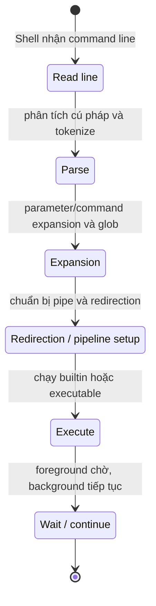

# Chủ đề 1 — Dòng lệnh Linux cơ bản

> **Mục tiêu:** hiểu dòng lệnh Linux hoạt động như thế nào, thay vì chỉ ghi nhớ tên lệnh.
>
> **Quy ước ngôn ngữ:** phần giải thích dùng Tiếng Việt. Các thuật ngữ cần tra cứu đúng theo tài liệu Linux/POSIX như `shell`, `builtin`, `quoting`, `expansion`, `environment variable`, `file descriptor`, `redirection`, `pipeline`, `exit status`, `job control`, cùng tên lệnh, biến, toán tử và API được giữ bằng tiếng Anh.
>
> **Phạm vi:** giao diện dòng lệnh, `terminal`, `TTY`, `PTY`, `shell`, cấu trúc một dòng lệnh, dấu nháy, mở rộng của `shell`, `PATH`, biến môi trường, `stdin/stdout/stderr`, chuyển hướng, `pipe`, `exit status`, tiến trình tiền cảnh/nền và các công cụ quan sát cơ bản.
>
> Chương này chỉ có **lý thuyết**, không chứa bài thực hành.

Trước khi đi vào từng lệnh, hãy giữ một mô hình duy nhất trong đầu: **bàn phím và terminal chỉ đưa ký tự tới Shell; Shell mới là thành phần phân tích dòng lệnh; sau đó Shell chạy builtin hoặc tạo tiến trình để thực thi chương trình**. Những khái niệm như dấu nháy, `PATH`, chuyển hướng, pipe hay `exit status` đều là các mảnh của cùng quá trình đó, chứ không phải các mẹo rời rạc cần học thuộc.

Vì vậy chương này đi từ bên ngoài vào bên trong. Ta bắt đầu bằng terminal/TTY/Shell, sau đó xem Shell xử lý một dòng lệnh ra sao, rồi mới đến cách chương trình nhận đối số, dữ liệu vào/ra và trạng thái kết thúc. Khi đã hiểu luồng này, các lệnh Linux cơ bản sẽ dễ nhớ hơn vì bạn biết **vì sao** chúng hoạt động như vậy.

**Cách đọc nếu bạn mới bắt đầu.** Trước hết hãy đọc phần **Nói đơn giản** ở đầu mỗi mục lớn để nắm câu hỏi mà mục đó đang giải quyết. Sau đó xem sơ đồ và ví dụ để hình thành mô hình trong đầu; chưa cần nhớ mọi cờ, mã lỗi hay trường hợp đặc biệt. Khi ý chính đã rõ, hãy đọc các mục `###` theo thứ tự và quay lại phần giải thích trước đó nếu gặp một thuật ngữ chưa quen.

---

## Mục lục

- [1. Dòng lệnh Linux thực chất là gì?](#1-dòng-lệnh-linux-thực-chất-là-gì)
- [2. Terminal, TTY, PTY và Shell](#2-terminal-tty-pty-và-shell)
- [3. Shell hiểu một dòng lệnh như thế nào?](#3-shell-hiểu-một-dòng-lệnh-như-thế-nào)
- [4. Quoting và Shell expansion](#4-quoting-và-shell-expansion)
- [5. Shell tìm chương trình bằng `PATH` như thế nào?](#5-shell-tìm-chương-trình-bằng-path-như-thế-nào)
- [6. Thư mục làm việc và đường dẫn](#6-thư-mục-làm-việc-và-đường-dẫn)
- [7. Shell variable, environment variable và `argv`](#7-shell-variable-environment-variable-và-argv)
- [8. `stdin`, `stdout`, `stderr` và redirection](#8-stdin-stdout-stderr-và-redirection)
- [9. Pipe và Pipeline](#9-pipe-và-pipeline)
- [10. `exit status` và toán tử điều khiển Shell](#10-exit-status-và-toán-tử-điều-khiển-shell)
- [11. `foreground`, `background` và `job control`](#11-foreground-background-và-job-control)
- [12. Các nhóm lệnh Linux cơ bản](#12-các-nhóm-lệnh-linux-cơ-bản)
- [13. `grep` và `find`: tìm kiếm theo hai mô hình khác nhau](#13-grep-và-find-tìm-kiếm-theo-hai-mô-hình-khác-nhau)
- [14. `ps`, `top`, `mount`, `df`, `du` đang quan sát điều gì?](#14-ps-top-mount-df-du-đang-quan-sát-điều-gì)
- [15. Tư duy gỡ lỗi khi một lệnh không hoạt động](#15-tư-duy-gỡ-lỗi-khi-một-lệnh-không-hoạt-động)
- [16. Liên hệ với Embedded Linux](#16-liên-hệ-với-embedded-linux)
- [17. Tổng kết](#17-tổng-kết)
- [18. Tài liệu tham khảo](#18-tài-liệu-tham-khảo)

---

## 1. Dòng lệnh Linux thực chất là gì?

> **Nói đơn giản:** Dòng lệnh là cách bạn yêu cầu Linux làm việc bằng chữ. Bạn gõ lệnh, Shell phân tích lệnh đó rồi chạy chương trình tương ứng.

### 1.1 CLI và GUI khác nhau ở đâu?

`GUI` đưa ra nút bấm, cửa sổ và biểu tượng. `CLI` đưa ra một ngôn ngữ lệnh.

```text
GUI
Người dùng
   |
   v
Nút / menu / cửa sổ
   |
   v
Ứng dụng

CLI
Người dùng
   |
   v
Dòng lệnh
   |
   v
Shell
   |
   v
Chương trình / system call
```

Điểm mạnh của `CLI` không nằm ở việc “gõ nhanh hơn”, mà ở khả năng **ghép nhiều công cụ nhỏ thành một luồng xử lý**.

Ví dụ về mặt khái niệm:

```text
nguồn dữ liệu
     |
     v
công cụ A
     |
     v
công cụ B
     |
     v
kết quả
```

Đây là tư duy rất quan trọng trong Linux và Embedded Linux vì nhiều hệ thống nhúng không có giao diện đồ họa đầy đủ.

### 1.2 Dòng lệnh không phải `system call`

Khi người dùng nhập:

```text
ls -l /etc
```

Linux kernel không nhận nguyên chuỗi này rồi “hiểu lệnh”. `shell` mới là thành phần phân tích chuỗi.

Mô hình đúng hơn:

```text
"ls -l /etc"
      |
      v
Shell phân tích
      |
      +--> tên chương trình: ls
      +--> argv[1]: -l
      +--> argv[2]: /etc
      |
      v
Shell tìm executable rồi tạo process
      |
      v
Chương trình ls gọi các API / system call cần thiết
```

---

## 2. Terminal, TTY, PTY và Shell

> **Nói đơn giản:** Terminal là cửa sổ nhập/xuất, còn Shell là chương trình đọc và hiểu lệnh. TTY/PTY là lớp trung gian giúp terminal và chương trình trao đổi dữ liệu.

### 2.1 Terminal

`terminal` là giao diện nhập/xuất dạng ký tự. Trên máy hiện đại, phần mềm như trình giả lập terminal cung cấp cửa sổ để hiển thị ký tự và nhận phím.

### 2.2 TTY

`TTY` là lớp trừu tượng của Linux cho kiểu giao tiếp terminal/serial.

Nó gắn với các khái niệm như: thiết bị đầu cuối, chế độ nhập ký tự, `line discipline` và `foreground process group` của terminal.

`TTY` có nguồn gốc lịch sử từ teletype, nhưng trong Linux hiện đại nó là một subsystem quan trọng.

### 2.3 PTY

`PTY` là cặp thiết bị giả lập terminal:

```text
PTY master <------> PTY slave
```

Một chương trình phía master có thể đóng vai trò “terminal”, còn phía slave trông giống TTY đối với chương trình chạy bên trong.

Các trường hợp thường gặp: terminal emulator, SSH session và terminal multiplexer.

### 2.4 Shell

`Shell` là trình thông dịch ngôn ngữ lệnh.

Ví dụ phổ biến: `sh`, `Bash`, `dash` và `zsh`.

Trong tài liệu này, tư duy chuẩn ưu tiên `POSIX shell`; khi một hành vi chỉ có ở `Bash`, cần xem nó là mở rộng riêng của `Bash`.

### 2.5 Quan hệ tổng thể

```text
Bàn phím
   |
   v
Terminal / PTY / TTY
   |
   v
Shell
   |
   v
Chương trình
   |
   v
Linux kernel
```

---

## 3. Shell hiểu một dòng lệnh như thế nào?

> **Nói đơn giản:** Shell không đưa nguyên dòng bạn gõ cho một chương trình duy nhất. Nó phải đọc cú pháp, nhận ra đâu là tên lệnh, đâu là đối số, đâu là pipe/chuyển hướng, thực hiện các phép mở rộng cần thiết rồi mới chạy chương trình.

### 3.1 Shell là một ngôn ngữ nhỏ

Một lệnh đơn giản có dạng:

```text
program arg1 arg2
```

nhưng dòng lệnh của Shell còn có thể chứa biến, dấu nháy, pipe, chuyển hướng và các toán tử điều khiển như `&&`, `||`, `;`. Vì vậy Shell phải được xem như một **trình thông dịch cho một ngôn ngữ lệnh nhỏ**, chứ không chỉ là nơi chuyển một chuỗi ký tự cho kernel.

Ví dụ, với dòng:

```bash
echo "$HOME" | grep home > result.txt
```

Shell phải nhận ra ba loại thành phần khác nhau. `echo` và `grep` là hai lệnh; `"$HOME"` và `home` là đối số; còn `|` và `>` là cú pháp do chính Shell xử lý. Chương trình `grep` không nhận ký tự `>` như một đối số trong ví dụ này, vì Shell đã dùng nó để thiết lập chuyển hướng trước khi `grep` bắt đầu chạy.

### 3.2 Các giai đoạn chính

Có thể hình dung quá trình xử lý theo chuỗi sau:



Điểm quan trọng là **chương trình được chạy sau khi Shell đã xử lý phần cú pháp thuộc về Shell**. Với ví dụ trên, Shell mở rộng `$HOME`, tạo pipe nối `stdout` của `echo` với `stdin` của `grep`, mở `result.txt` và nối `stdout` của `grep` vào tệp đó. Sau các bước chuẩn bị này, hai chương trình mới thực sự chạy và đọc/ghi qua những file descriptor mà Shell đã sắp xếp.

Sơ đồ trên là mô hình học tập, không phải toàn bộ chi tiết triển khai của Bash hay một Shell cụ thể. Tuy nhiên, nó đủ để giải thích phần lớn hiện tượng mà người mới gặp khi dùng dấu nháy, biến, pipe và chuyển hướng.

### 3.3 Builtin và chương trình ngoài

Sau khi phân tích dòng lệnh, Shell phải quyết định lệnh cần chạy là **builtin** hay một executable bên ngoài. Builtin là chức năng nằm ngay trong Shell. `cd` là ví dụ quan trọng: nếu `cd` chạy trong một tiến trình con rồi tiến trình đó kết thúc, thư mục làm việc của Shell cha sẽ không thay đổi; vì vậy việc đổi thư mục phải được Shell tự thực hiện.

Ngược lại, các lệnh như `/bin/ls`, `/usr/bin/grep` hay `/usr/bin/find` thường là chương trình riêng. Shell tìm executable, tạo môi trường thực thi thích hợp rồi chạy nó trong một tiến trình. Vì vậy cần nhớ sự khác nhau: **builtin thay đổi hoặc sử dụng trực tiếp trạng thái của Shell; executable ngoài thường chạy như một tiến trình riêng**.

---
## 4. Quoting và Shell expansion

> **Nói đơn giản:** Dấu nháy quyết định phần nào của dòng lệnh được Shell giữ nguyên và phần nào được thay thế trước khi chạy chương trình.

### 4.1 Vì sao phải dùng dấu nháy?

Một số ký tự có ý nghĩa đặc biệt với `shell`:

```text
space
*
?
$
>
<
|
;
&
```

Dấu nháy kiểm soát việc chúng được hiểu như cú pháp hay như dữ liệu thông thường.

### 4.2 Dấu nháy đơn

Trong dấu nháy đơn, phần lớn ký tự được giữ nguyên nghĩa chữ.

Mô hình:

```text
'$HOME'
   |
   v
chuỗi ký tự $HOME
```

`$HOME` không được mở rộng thành giá trị biến.

### 4.3 Dấu nháy kép

Dấu nháy kép vẫn cho phép một số mở rộng, đặc biệt là mở rộng biến và thay thế lệnh.

```text
"$HOME"
   |
   v
giá trị HOME nhưng vẫn giữ thành một word
```

### 4.4 `parameter expansion`

Ví dụ khái niệm:

```text
$USER
${HOME}
```

`Shell` thay tham chiếu bằng giá trị trước khi chương trình được thực thi.

### 4.5 `command substitution`

Kết quả chuẩn của một lệnh có thể được đưa trở lại dòng lệnh:

```text
$(command)
```

Về mặt tư duy:

```text
chạy lệnh con
   |
thu stdout
   |
chèn kết quả vào dòng lệnh cha
```

### 4.6 `word splitting` và `globbing`

`Shell` có thể tách kết quả thành nhiều word và thực hiện khớp tên tệp bằng các mẫu như: `*.c` và `file?.txt`.

`globbing` không phải `regular expression`.

`Shell glob`: dùng cho tên tệp/pathname; `Regular expression`: dùng cho mô hình khớp văn bản của công cụ như grep.

---

## 5. Shell tìm chương trình bằng `PATH` như thế nào?

> **Nói đơn giản:** Khi bạn chỉ gõ tên như `ls`, Shell phải tìm xem chương trình `ls` nằm ở đâu. Biến `PATH` cho Shell biết những thư mục cần tìm theo thứ tự.

### 5.1 `PATH`

`PATH` là danh sách thư mục mà `shell` dùng để tìm executable khi tên lệnh không chứa `/`.

Mô hình:

```text
PATH=/usr/local/bin:/usr/bin:/bin

command: tool
   |
   +--> /usr/local/bin/tool ?
   +--> /usr/bin/tool ?
   +--> /bin/tool ?
```

### 5.2 Khi tên lệnh có `/`

Nếu người dùng nhập:

```text
./app
```

hoặc:

```text
/opt/bin/app
```

`Shell` không cần tìm theo `PATH`; đường dẫn đã được chỉ ra.

### 5.3 Vì sao `.` thường không nằm sẵn trong `PATH`?

Nếu thư mục hiện tại luôn được ưu tiên tìm kiếm, một executable cùng tên với lệnh hệ thống có thể bị chạy nhầm.

Đây là lý do bảo mật và tính dự đoán được của môi trường dòng lệnh.

---

## 6. Thư mục làm việc và đường dẫn

> **Nói đơn giản:** Mỗi tiến trình có một thư mục làm việc hiện tại. Đường dẫn tương đối được hiểu từ thư mục đó, còn đường dẫn tuyệt đối bắt đầu từ `/`.

### 6.1 `current working directory`

Mỗi tiến trình có một **thư mục làm việc hiện tại**.

Đường dẫn tương đối được phân giải từ đó.

```text
cwd = /home/user/project

relative path: src/main.c
        |
        v
/home/user/project/src/main.c
```

### 6.2 `cd`

`cd` thay đổi thư mục làm việc của chính `shell`.

Nếu `cd` chạy trong một tiến trình con rồi tiến trình con thoát, thư mục làm việc của `shell` cha sẽ không thay đổi.

### 6.3 Đường dẫn logic và vật lý

Khi có symbolic link, đường dẫn người dùng nhìn thấy có thể khác đường dẫn vật lý sau khi phân giải liên kết.

Điểm này sẽ được giải thích sâu hơn ở Topic 2.

---

## 7. Shell variable, environment variable và `argv`

> **Nói đơn giản:** Shell variable giúp lưu giá trị trong Shell; biến môi trường có thể được truyền sang chương trình con; `argv` là danh sách đối số chương trình nhận được.

### 7.1 Shell variable

Biến của `shell` là trạng thái nội bộ của `shell`.

Nó chưa chắc được truyền sang chương trình con.

### 7.2 Environment variable

Environment variable được truyền vào tiến trình con khi tạo `program image` mới.

```text
Shell
  |
  | environment
  v
child process
```

### 7.3 `export`

`export` đánh dấu một biến của `shell` để nó xuất hiện trong môi trường của các tiến trình con được tạo sau đó.

Điểm rất quan trọng:

```text
parent process -> child process: environment inheritance
```

không có nghĩa:

```text
child thay environment của parent trực tiếp
```

### 7.4 `argv`

Sau khi `shell` phân tích và mở rộng dòng lệnh, chương trình nhận danh sách đối số.

Ví dụ về mặt cấu trúc:

```text
argv[0] = tên chương trình
argv[1] = đối số thứ nhất
argv[2] = đối số thứ hai
...
```

Khoảng trắng sau xử lý của `shell` không còn là một chuỗi đơn; ranh giới đối số đã trở thành cấu trúc riêng.

---

## 8. `stdin`, `stdout`, `stderr` và redirection

> **Nói đơn giản:** Một chương trình thường có ba luồng chuẩn: nhập vào, xuất bình thường và xuất lỗi. Chuyển hướng chỉ là đổi nơi các luồng này đọc hoặc ghi dữ liệu.

### 8.1 Ba luồng chuẩn

Theo quy ước Unix/Linux:

```text
fd 0 -> stdin
fd 1 -> stdout
fd 2 -> stderr
```

Chúng chỉ là các `file descriptor` được thiết lập sẵn khi chương trình bắt đầu.

### 8.2 Vì sao `stdout` và `stderr` tách riêng?

Một chương trình có thể gửi:

```text
kết quả bình thường -> stdout
thông báo lỗi       -> stderr
```

Nhờ đó `shell` có thể xử lý hai dòng dữ liệu khác nhau.

### 8.3 Redirection thực chất là nối lại `file descriptor`

Ví dụ về mặt khái niệm:

```text
stdout
  |
  v
terminal
```

sau chuyển hướng:

```text
stdout
  |
  v
file
```

Chương trình không nhất thiết biết rằng đầu ra đã bị chuyển hướng. Nó vẫn ghi vào `fd 1`.

### 8.4 Thứ tự redirection có ý nghĩa

Chuyển hướng được xử lý theo thứ tự, vì việc sao chép một `file descriptor` sử dụng trạng thái tại thời điểm đó.

Đây là lý do hai biểu thức có cùng các toán tử nhưng khác thứ tự có thể cho kết quả khác.

---

## 9. Pipe và Pipeline

> **Nói đơn giản:** Pipe nối đầu ra của lệnh trước với đầu vào của lệnh sau. Nhờ vậy bạn có thể ghép nhiều lệnh nhỏ thành một chuỗi xử lý dữ liệu.

### 9.1 Pipe

`pipe` là một kênh byte do Linux kernel quản lý.

```text
writer
   |
   v
+---------+
|  pipe   |
+---------+
   |
   v
reader
```

### 9.2 Pipeline của Shell

Khi viết:

```text
A | B
```

`Shell` tạo `pipe`, nối:

```text
stdout của A -> pipe write end
stdin của B  -> pipe read end
```

Sau đó A và B có thể chạy đồng thời.

### 9.3 `stderr` không tự đi vào pipe

Theo mô hình thông thường:

```text
stdout -> pipe
stderr -> nơi cũ
```

Muốn đưa `stderr` vào cùng kênh cần chuyển hướng rõ ràng.

### 9.4 Pipeline là ghép tiến trình

Điểm sâu hơn cần nhớ:

**pipeline**: không chỉ là ghép chuỗi văn bản mà là ghép các tiến trình thông qua `file descriptor`.

Đây là nền tảng trực tiếp cho Topic 3 và Topic 8.

---

## 10. `exit status` và toán tử điều khiển Shell

> **Nói đơn giản:** Mỗi lệnh kết thúc với một mã trạng thái. Shell dùng mã này để biết lệnh thành công hay thất bại và quyết định có chạy lệnh tiếp theo hay không.

### 10.1 `exit status`

Khi một chương trình kết thúc, nó trả về trạng thái để tiến trình cha có thể biết kết quả.

Theo quy ước shell:

```text
0      -> thành công
khác 0 -> một trạng thái không thành công nào đó
```

Ý nghĩa cụ thể của số khác `0` phụ thuộc từng chương trình.

### 10.2 `&&`

```text
A && B
```

B chỉ chạy nếu A được xem là thành công.

### 10.3 `||`

```text
A || B
```

B chạy khi A không thành công.

### 10.4 `;`

```text
A ; B
```

B được xét chạy sau A mà không phụ thuộc trực tiếp vào `exit status` của A.

### 10.5 Vì sao `exit status` quan trọng?

Đây là kênh điều khiển dành cho máy, khác với `stdout` vốn thường chứa dữ liệu dành cho người hoặc chương trình khác.

---

## 11. `foreground`, `background` và `job control`

> **Nói đơn giản:** Tiến trình chạy ở tiền cảnh thường nhận bàn phím trực tiếp; tiến trình nền tiếp tục chạy mà không chiếm phiên nhập lệnh hiện tại.

### 11.1 `foreground process`

Trong terminal tương tác, một nhóm tiến trình được xem là nhóm tiền cảnh của terminal.

Các `signal` phát sinh từ terminal, như `SIGINT` khi nhấn `Ctrl+C`, thường nhắm vào nhóm tiền cảnh.

### 11.2 `background process`

Một công việc chạy nền không chiếm quyền điều khiển tương tác của `shell` theo cách của công việc tiền cảnh.

Tuy vậy, nó vẫn là tiến trình bình thường và vẫn dùng CPU, bộ nhớ, `file descriptor`, signal...

### 11.3 `job control`

Shell tương tác sử dụng các khái niệm `process group`, `session`, `controlling terminal` và `signal` để triển khai job control.

Topic 4 và Topic 5 sẽ làm rõ các lớp này hơn.

---

## 12. Các nhóm lệnh Linux cơ bản

> **Nói đơn giản:** Bạn không cần thuộc hàng trăm lệnh. Điều quan trọng là biết mỗi nhóm lệnh giải quyết việc gì: di chuyển, xem tệp, tìm kiếm, xử lý văn bản hay quan sát hệ thống.

Mục đích của phần này không phải học thuộc cú pháp, mà hiểu **mỗi lệnh quan sát hoặc thay đổi lớp nào**.

### 12.1 Điều hướng và quản lý tên tệp

```text
pwd
cd
ls
cp
mv
rm
mkdir
```

Nhóm này chủ yếu làm việc với: pathname, thư mục, metadata và namespace của hệ thống tệp.

### 12.2 Quan sát nội dung văn bản

```text
cat
head
tail
wc
```

Nhóm này chủ yếu đọc byte từ `file descriptor` và biểu diễn/đếm dữ liệu.

### 12.3 Lọc và biến đổi

```text
grep
sort
cut
tr
```

Tư duy chung:

```text
stdin -> xử lý -> stdout
```

Đây là lý do các công cụ Unix có thể ghép qua pipeline hiệu quả.

---

## 13. `grep` và `find`: tìm kiếm theo hai mô hình khác nhau

> **Nói đơn giản:** `grep` tìm nội dung bên trong dữ liệu văn bản, còn `find` tìm đối tượng trong cây thư mục dựa trên tên và thuộc tính.

### 13.1 `grep`

`grep` tìm mẫu trong **nội dung dữ liệu đầu vào**.

```text
text stream
   |
   v
grep pattern
   |
   v
matching lines
```

`grep` có thể dùng biểu thức chính quy; biểu thức chính quy không giống glob của `shell`.

### 13.2 `find`

`find` đi qua **cây thư mục** và đánh giá điều kiện trên từng mục.

```text
cây filesystem
      |
      v
    find
      |
  tests/actions
```

Do đó:

```text
grep -> tìm trong nội dung
find -> tìm trong cây namespace/metadata
```

---

## 14. `ps`, `top`, `mount`, `df`, `du` đang quan sát điều gì?

> **Nói đơn giản:** `ps` và `top` quan sát tiến trình; `mount` quan sát/gắn hệ thống tệp; `df` nhìn dung lượng theo hệ thống tệp; `du` nhìn dung lượng theo tệp và thư mục.

### 14.1 `ps`

`ps` cung cấp một ảnh chụp trạng thái tiến trình tại thời điểm thu thập dữ liệu.

Nó không phải một lịch sử bất biến của hệ thống.

### 14.2 `top`

`top` lặp lại việc thu thập trạng thái và hiển thị động.

Các giá trị CPU/bộ nhớ phải được hiểu theo khoảng lấy mẫu và mô hình bộ nhớ Linux.

### 14.3 `mount`

`mount` liên quan đến việc gắn một hệ thống tệp vào cây không gian tên.

```text
đối tượng trong filesystem
      |
   mount
      |
      v
mount point trong cây /
```

### 14.4 `df`

`df` báo cáo dung lượng ở **mức hệ thống tệp**.

### 14.5 `du`

`du` đi qua **cây tệp/thư mục đã chọn** để ước lượng dung lượng sử dụng.

Vì vậy:

```text
df -> góc nhìn toàn filesystem
du -> góc nhìn cây pathname được duyệt
```

Hai số có thể khác nhau mà không có lỗi.

---

## 15. Tư duy gỡ lỗi khi một lệnh không hoạt động

> **Nói đơn giản:** Khi lệnh lỗi, đừng thử ngẫu nhiên. Hãy kiểm tra lần lượt: lệnh có tồn tại không, đường dẫn đúng không, quyền đủ không, đầu vào có đúng không và mã lỗi nói gì.

### 15.1 “Không tìm thấy lệnh”

Kiểm tra theo lớp:

```text
tên lệnh đúng?
   |
PATH đúng?
   |
executable tồn tại?
   |
quyền thực thi?
   |
interpreter / dynamic loader tồn tại?
```

### 15.2 “Permission denied”

Có thể liên quan: quyền trên file, quyền search của thư mục cha, mount option, credential của tiến trình và security policy khác.

### 15.3 Chương trình nhận sai số lượng đối số

Hãy nghĩ tới quoting, word splitting và globbing, vì Shell có thể đã biến đổi dòng nhập trước khi chương trình nhận `argv`.

### 15.4 Pipeline cho kết quả lạ

Hãy tách từng lớp: A có tạo đúng `stdout` không? B có đọc đúng `stdin` không? `stderr` có bị bỏ sót không? `exit status` đang được quan sát thuộc tiến trình nào?

---

## 16. Liên hệ với Embedded Linux

> **Nói đơn giản:** Trên Embedded Linux, terminal là công cụ chính để cấu hình, kiểm tra log, chạy chương trình và chẩn đoán thiết bị khi không có giao diện đồ họa.

### 16.1 Board thường không có GUI đầy đủ

Trong giai đoạn bring-up, giao diện thường là: UART serial console, `SSH` và cục bộ shell.

Nắm CLI giúp làm việc khi chưa có desktop.

### 16.2 BusyBox

Nhiều hệ thống nhúng dùng `BusyBox` để cung cấp nhiều tiện ích Linux trong một executable nhỏ.

Cú pháp chi tiết có thể khác GNU utilities, nhưng mô hình:

```text
stdin/stdout/stderr
file descriptor
pipe
exit status
```

vẫn cực kỳ quan trọng.

### 16.3 Dòng lệnh là công cụ quan sát hệ thống

Trong bring-up/debug thường cần quan sát:

```text
/proc
/sys
/dev
mounts
processes
memory
network
logs
```

Do đó Topic 1 là nền cho hầu hết các chủ đề tiếp theo.

---

## 17. Tổng kết

> **Nói đơn giản:** Topic 01 cần để lại một mô hình đơn giản: Shell nhận lệnh, thiết lập đầu vào/đầu ra, chạy chương trình và nhận `exit status`.

```text
Người dùng nhập dòng lệnh
        |
        v
Terminal / TTY / PTY
        |
        v
Shell
        |
        +--> phân tích cú pháp
        +--> quoting / expansion
        +--> PATH lookup
        +--> redirection
        +--> pipeline
        |
        v
process / shell builtin
        |
        v
Linux kernel
```

Các ý cần nhớ:

1. `terminal` và `shell` là hai lớp khác nhau.
2. `shell` phân tích dòng lệnh trước khi chương trình nhận `argv`.
3. Dấu nháy quyết định ký tự nào được `shell` diễn giải.
4. `PATH` chỉ tham gia khi tên lệnh cần được tìm kiếm.
5. Mỗi tiến trình có thư mục làm việc hiện tại.
6. Environment variable được truyền từ cha sang con; tiến trình con không trực tiếp sửa môi trường của cha.
7. `stdin`, `stdout`, `stderr` tương ứng với các `file descriptor` chuẩn.
8. Chuyển hướng là thay đổi nơi các `file descriptor` trỏ tới.
9. Pipeline là ghép các tiến trình bằng `pipe`.
10. `exit status` là kênh điều khiển, không phải nội dung `stdout`.
11. `grep` tìm trong dữ liệu; `find` duyệt cây filesystem.
12. `df` và `du` quan sát dung lượng từ hai góc khác nhau.

---

## 18. Tài liệu tham khảo

> **Nói đơn giản:** Phần này liệt kê các nguồn chính thống để bạn tra cứu khi cần kiểm chứng hoặc học sâu hơn.

Nguồn ưu tiên cho chủ đề này:

- POSIX.1-2024 Shell Command Language: https://pubs.opengroup.org/onlinepubs/9799919799/
- GNU Bash Manual: https://www.gnu.org/software/bash/manual/
- Linux man-pages: https://man7.org/linux/man-pages/
- GNU Coreutils Manual: https://www.gnu.org/software/coreutils/manual/
- GNU Grep Manual: https://www.gnu.org/software/grep/manual/
- GNU Findutils Manual: https://www.gnu.org/software/findutils/manual/
- procps-ng: https://gitlab.com/procps-ng/procps
- util-linux: https://github.com/util-linux/util-linux
- Linux TTY documentation: https://docs.kernel.org/driver-api/tty/
- Bootlin Embedded Linux training: https://bootlin.com/training/embedded-linux/
- BusyBox documentation: https://busybox.net/

> **Điều hướng:** [Chủ đề 2 — Hệ thống tệp Linux →](README-topic-02.md)
