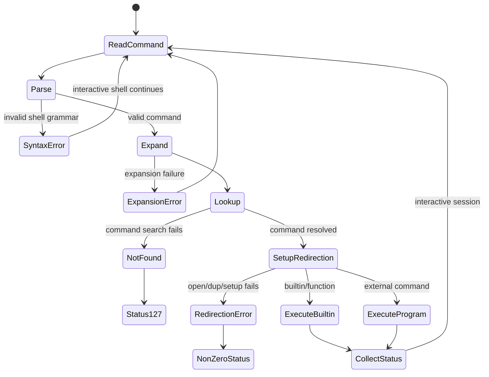

# Chủ đề 1 — Basic Linux Command Line

> **Mục tiêu dễ hiểu:** Hiểu từ lúc bạn gõ một dòng lệnh cho đến khi shell tìm chương trình, nối stdin/stdout/stderr và kernel thực hiện công việc.
>
> **Bạn cần biết trước:** Không cần biết system call hay kernel internals. Chỉ cần biết Linux có terminal và chương trình chạy trong process.
>
> **Các từ khóa sẽ gặp nhiều:**
> - **terminal** = cửa sổ/thiết bị nhập xuất chữ
> - **shell** = chương trình đọc và hiểu lệnh
> - **stdin/stdout/stderr** = 3 luồng vào/ra chuẩn
> - **pipe** = nối output của lệnh trước vào input của lệnh sau
>
> **Quy ước đọc thuật ngữ:** khi gặp `state`, `context`, `semantics`, `object`, hãy hiểu lần lượt là **trạng thái**, **ngữ cảnh**, **hành vi theo chuẩn**, **đối tượng/tài nguyên**. Tên API và thuật ngữ chuẩn như process, thread, socket, mutex được giữ nguyên để bạn quen dần với tài liệu kỹ thuật.
>
> **Cách đọc nếu bạn mới bắt đầu:**
> 1. Lượt đầu chỉ đọc các ô **“Nói đơn giản”**, sơ đồ ASCII/Mermaid và phần **Tổng kết**.
> 2. Lượt hai đọc các mục `###` để hiểu API/khái niệm cụ thể.
> 3. Các mục `####`, caveat POSIX/Linux và edge case có thể để lần đọc thứ ba. **Không cần hiểu hết trong một lượt.**
>
> Chương này chỉ có **lý thuyết**, không có lab hay bài tập thực hành. Thuật ngữ tiếng Anh được giữ khi đó là tên chuẩn, nhưng luôn ưu tiên giải thích ý nghĩa trước.
---

## Mục lục

- [1. Nền tảng Command Line và CLI](#1-nền-tảng-command-line-và-cli)
- [2. Terminal, TTY, PTY và Shell](#2-terminal-tty-pty-và-shell)
- [3. Shell hiểu và chạy một dòng lệnh như thế nào?](#3-shell-hiểu-và-chạy-một-dòng-lệnh-như-thế-nào)
- [4. Dấu nháy, Expansion và Globbing](#4-dấu-nháy-expansion-và-globbing)
- [5. Shell tìm command và tạo Execution Context](#5-shell-tìm-command-và-tạo-execution-context)
- [6. Biến shell, Environment và `argv`](#6-biến-shell-environment-và-argv)
- [7. `stdin`, `stdout`, `stderr` và Redirection](#7-stdin-stdout-stderr-và-redirection)
- [8. Pipe và Pipeline](#8-pipe-và-pipeline)
- [9. Exit Status và Shell Control Flow](#9-exit-status-và-shell-control-flow)
- [10. Foreground, Background và Job Control](#10-foreground-background-và-job-control)
- [11. Các utility cơ bản đang quan sát lớp nào?](#11-các-utility-cơ-bản-đang-quan-sát-lớp-nào)
- [12. Search và Filtering: `grep`, `find`](#12-search-và-filtering-grep-find)
- [13. Process Observation: `ps`, `top`](#13-process-observation-ps-top)
- [14. Filesystem/Storage Observation: `mount`, `df`, `du`](#14-filesystemstorage-observation-mount-df-du)
- [15. Khi command lỗi: tư duy Debugging](#15-khi-command-lỗi-tư-duy-debugging)
- [16. Liên hệ với Embedded Linux](#16-liên-hệ-với-embedded-linux)
- [17. Tổng kết và Mô hình tư duy](#17-tổng-kết-và-mô-hình-tư-duy)
- [18. Tài liệu tham khảo](#18-tài-liệu-tham-khảo)

---

## 1. Nền tảng Command Line và CLI

> **Nói đơn giản:** Command line là cách điều khiển hệ thống bằng văn bản. Trước tiên chỉ cần hiểu: bạn nhập text, shell đọc text đó rồi quyết định phải làm gì.


### 1.1 Command line trong Linux thực chất là gì?


Command line thường được nhìn thấy dưới dạng:

```text
$ command argument option ...
```

Nhưng giao diện này chỉ là lớp ngoài cùng.

Một command-line session điển hình có nhiều lớp:

```text
User
  |
  v
Terminal / terminal emulator
  |
  v
TTY / PTY interface
  |
  v
Shell
  |
  +--> parse command language
  +--> perform expansions
  +--> configure redirections/pipes
  +--> execute builtin/function
  |       or
  +--> locate executable and start program
          |
          v
       Process
          |
          v
       Kernel
          |
          +--> filesystems
          +--> devices
          +--> processes
          +--> memory
          +--> network
```

Do đó, command line không phải bản thân kernel, cũng không phải chỉ là “một chương trình để gõ lệnh”.

Nó là **một môi trường tương tác và một command language** dùng để:

```text
describe operations
compose programs
connect data streams
control process execution
inspect operating-system state
```

Một câu lệnh nhìn đơn giản như:

```text
grep error system.log
```

có thể liên quan tới:

```text
terminal input
    ↓
shell lexical/parser rules
    ↓
word expansion
    ↓
command search
    ↓
process execution
    ↓
filesystem access
    ↓
read bytes
    ↓
pattern matching
    ↓
write stdout
    ↓
terminal output
```

Điểm cốt lõi:

> **Shell không “làm tất cả công việc”. Shell tổ chức việc thực thi; utility và kernel thực hiện phần lớn operation phía dưới.**

---

### 1.2 CLI và GUI khác nhau ở lớp nào?


CLI và GUI không phải hai hệ điều hành khác nhau.

Chúng thường là hai kiểu frontend khác nhau tới cùng các resource/system service phía dưới.

Mô hình tư duy:

```text
                User
                 |
        +--------+--------+
        |                 |
        v                 v
       GUI               CLI
        |                 |
 window/app            terminal
        |                 |
 toolkit/API            shell
        |                 |
        +--------+--------+
                 |
              system APIs
                 |
               kernel
```

#### 1.2.1 GUI ưu tiên trực quan

GUI thường biểu diễn resource bằng:

```text
window
button
menu
icon
dialog
drag-and-drop
```

Ưu điểm:

```text
discoverability cao
feedback trực quan
phù hợp tác vụ tương tác
```

Nhưng GUI có thể:

```text
che abstraction phía dưới
khó tự động hóa chuỗi thao tác dài
khó dùng khi target không có display stack
```

#### 1.2.2 CLI ưu tiên biểu đạt bằng text và composition

CLI thường biểu diễn operation bằng:

```text
command
arguments
options
streams
exit status
```

Điểm mạnh không nằm ở việc “gõ nhanh hơn GUI”, mà ở tính **composable**:

```text
producer
  |
  v
filter
  |
  v
transform
  |
  v
consumer
```

Text command còn dễ:

```text
ghi lại
review
version-control
remote execution
automation
reproduction
```

#### 1.2.3 Trong Embedded Linux

Một board embedded có thể không có:

```text
GPU desktop stack
display
window manager
full desktop environment
```

nhưng vẫn có:

```text
UART console
SSH
shell
kernel log
BusyBox utilities
system service interface
```

Do đó command line trong Embedded Linux thường không phải “giao diện phụ”.

Nó có thể là **giao diện quản trị và debug chính**.

---

## 2. Terminal, TTY, PTY và Shell

> **Nói đơn giản:** Terminal và shell là hai thứ khác nhau: terminal là nơi bạn nhập/nhìn chữ; shell là chương trình hiểu câu lệnh. TTY/PTTY là lớp Linux dùng để nối hai phía đó.

> **Hình dung:** Terminal giống “màn hình + bàn phím” cho text; shell giống người phiên dịch đọc câu bạn gõ rồi quyết định gọi chương trình nào.


### 2.1 Terminal, TTY, PTY và shell


Bốn khái niệm này liên quan nhưng không đồng nghĩa.

```text
terminal       ≠ shell
TTY            ≠ shell
PTY            ≠ shell
terminal app   ≠ command interpreter
```

---

#### 2.1.1 Terminal

Trong lịch sử UNIX, terminal có thể là thiết bị vật lý:

```text
keyboard
   +
display/printer
   +
serial communication
```

Ngày nay desktop Linux thường dùng terminal emulator.

Terminal emulator chịu trách nhiệm các việc kiểu:

```text
nhận keyboard input
render text output
interpret terminal control sequences
manage window/tab
connect to a PTY
```

Nó không cần hiểu semantics của:

```text
grep
find
mount
ps
```

Nó chủ yếu vận chuyển và hiển thị byte/character stream.

---

#### 2.1.2 TTY

`TTY` có nguồn gốc từ teletypewriter.

Trong Linux, TTY là một kernel abstraction dành cho terminal-style I/O.

Mô hình tư duy:

```text
process
   ↕
TTY subsystem
   ↕
terminal endpoint
```

TTY layer có thể tham gia:

```text
canonical input
line discipline
echo
special control characters
terminal attributes
foreground process-group behavior
```

Vì vậy ký tự như:

```text
Ctrl+C
Ctrl+Z
Backspace
Enter
```

không nhất thiết chỉ là byte được giao nguyên trạng cho application.

Behavior phụ thuộc TTY configuration và line discipline.

---

#### 2.1.3 Controlling terminal

Một session/process group có thể liên hệ với một **controlling terminal**.

Concept này quan trọng cho:

```text
interactive shell
foreground process group
job control
terminal-generated signals
```

Linux cung cấp `/dev/tty` như một character device đại diện controlling terminal của process nếu process có controlling terminal.

Mô hình tư duy đơn giản:

```text
terminal
   |
   +---- session
          |
          +---- shell
          |
          +---- foreground job
          |
          +---- background jobs
```

Topic Process/Signal sẽ đào sâu.

---

#### 2.1.4 PTY — pseudoterminal

Desktop terminal emulator và SSH thường không cần một terminal vật lý.

Linux cung cấp pseudoterminal pair:

```text
PTY master  <------>  PTY slave
```

Slave side trông với process gần giống classical terminal.

Mô hình tư duy:

```text
+-------------------+
| Terminal Emulator |
+-------------------+
          |
      PTY master
          |
    kernel PTY layer
          |
      PTY slave
          |
+-------------------+
|       Shell       |
+-------------------+
```

Dữ liệu:

```text
keyboard
  ↓
terminal emulator
  ↓
PTY master
  ↓
PTY slave
  ↓
shell/program
```

Và output đi chiều ngược lại.

Linux UNIX 98 PTY thường liên quan:

```text
/dev/ptmx
/dev/pts/<n>
devpts filesystem
```

---

#### 2.1.5 SSH và PTY

Một interactive SSH session thường có thể yêu cầu PTY phía remote.

Conceptually:

```text
local terminal
      |
      v
SSH client
      |
   network
      |
      v
SSH server
      |
 remote PTY
      |
 remote shell
```

Vì thế interactive behavior như:

```text
prompt
Ctrl+C
terminal dimensions
line editing
```

có thể hoạt động gần giống local terminal.

---

#### 2.1.6 Serial console trong Embedded Linux

Với embedded target, chain có thể gần hardware hơn:

```text
Laptop terminal program
        |
     USB-UART
        |
   board UART pins
        |
   SoC UART driver
        |
      TTY layer
        |
   login/getty/shell
```

Ở đây:

```text
UART
```

là hardware communication peripheral,

còn:

```text
shell
```

là command interpreter.

Không nên gộp hai lớp này.

---

## 3. Shell hiểu và chạy một dòng lệnh như thế nào?

> **Nói đơn giản:** Một dòng lệnh không được chạy nguyên xi. Shell phải tách từ, xử lý cú pháp, tìm command rồi mới chạy builtin hoặc executable.


### 3.1 Shell là một command-language interpreter


POSIX mô tả shell command language như một ngôn ngữ có:

```text
words
operators
redirections
pipelines
lists
compound commands
variables
expansions
functions
control structures
```

Một shell không chỉ là launcher.

Nó vừa là:

```text
parser
language runtime
execution coordinator
environment manager
redirection/pipeline configurator
```

Các shell phổ biến:

```text
sh-style shell
Bash
dash
ash
zsh
ksh
```

Trong Embedded Linux, BusyBox `ash` rất phổ biến.

#### 3.1.1 POSIX shell và Bash không hoàn toàn giống nhau

Bash hỗ trợ nhiều extension ngoài POSIX.

Ví dụ:

```text
arrays
[[ ... ]]
process substitution
brace expansion
Bash-specific options
```

Do đó phải tách:

```text
POSIX shell semantics
          vs
Bash-specific semantics
```

Nếu script cần portable giữa:

```text
dash
ash
bash
```

không nên mặc định mọi Bash feature đều có.

#### 3.1.2 Interactive shell và non-interactive shell

Interactive shell:

```text
đọc command từ terminal/user
hiển thị prompt
job control thường bật
interactive error behavior
```

Non-interactive shell thường:

```text
đọc shell script
hoặc command string
```

Startup behavior và error semantics có thể khác.

#### 3.1.3 Login shell

Login shell là shell được khởi tạo như một login session theo shell-specific convention.

Nó có thể đọc startup file khác interactive non-login shell.

Vì vậy câu hỏi:

> “Vì sao biến môi trường có ở terminal này nhưng không có ở service/script kia?”

thường liên quan tới:

```text
shell startup mode
inheritance
environment initialization
```

chứ không chỉ “Linux mất biến”.

---

### 3.2 Cấu trúc của một command line


Một simple command có thể nhìn như:

```text
variable assignments
      +
command name
      +
arguments
      +
redirections
```

Ví dụ conceptual:

```text
LANG=C grep -n error input.txt > result.txt
```

có các thành phần:

```text
LANG=C
  shell assignment for command environment

grep
  command name

-n
  argument interpreted by grep as option

error
  argument interpreted by grep as pattern

input.txt
  argument interpreted by grep as pathname

> result.txt
  redirection interpreted by shell
```

Điểm cực kỳ quan trọng:

> **Shell và command không cùng chịu trách nhiệm parse mọi thứ.**

Shell xử lý:

```text
grammar
quotes
expansions
redirections
pipes
control operators
```

Program nhận:

```text
argv[]
environment
already-configured file descriptors
```

Program như `grep` tự hiểu:

```text
-n
--color
pattern syntax
file operands
```

Shell không biết `-n` có nghĩa là line number.

---

### 3.3 Shell xử lý một command theo những giai đoạn nào?


GNU Bash mô tả simple-command expansion và execution theo các bước xác định.

Ở mức mô hình tư duy có thể tóm tắt:

```text
raw command text
      ↓
lexing / parsing
      ↓
identify words, operators, assignments, redirections
      ↓
shell expansions
      ↓
word splitting / filename expansion where applicable
      ↓
quote removal
      ↓
command lookup
      ↓
redirection setup
      ↓
builtin/function execution
        or
external program execution
      ↓
wait / collect status as required
      ↓
exit status
```

Cần lưu ý đây là sơ đồ học tập; exact ordering có nhiều chi tiết theo POSIX/Bash.

#### 3.3.1 Một state machine cho command vòng đời



State diagram trên nhấn mạnh:

```text
parse failure
lookup failure
redirection failure
program failure
```

là các lớp lỗi khác nhau.

---

## 4. Dấu nháy, Expansion và Globbing

> **Nói đơn giản:** Dấu nháy và expansion quyết định chuỗi nào được shell biến đổi trước khi chương trình nhận `argv`. Đây là lý do cùng một dòng nhìn giống nhau nhưng có thể cho kết quả khác.


### 4.1 Quoting: khi nào ký tự được hiểu theo nghĩa literal?


Shell có nhiều ký tự mang syntax đặc biệt:

```text
space
tab
newline
|
&
;
<
>
(
)
$
`
\
'
"
*
?
[
...
```

Quoting kiểm soát khi nào shell được phép hiểu các ký tự này như syntax.

---

#### 4.1.1 Backslash

Backslash thường preserve literal value của ký tự kế tiếp, với các rule cụ thể theo shell/context.

Concept:

```text
\*
```

khác:

```text
*
```

Vế đầu có thể truyền literal `*`.

Vế sau có thể tham gia filename expansion.

---

#### 4.1.2 Single quotes

Trong POSIX-style shell, single quotes preserve literal value của các ký tự bên trong, trừ việc không thể chứa single quote literal theo cách đơn giản bên trong chính single-quoted string.

Mô hình tư duy:

```text
'...'
   ↓
strong quoting
```

Ví dụ concept:

```text
'$HOME'
```

không parameter-expand `$HOME`.

---

#### 4.1.3 Double quotes

Double quote yếu hơn single quote.

Một số expansion vẫn hoạt động:

```text
parameter expansion
command substitution
arithmetic expansion
```

nhưng word splitting và filename expansion bị ảnh hưởng mạnh/không xảy ra theo cách thông thường trên kết quả quoted.

Mô hình tư duy:

```text
"$variable"
```

thường giúp preserve một argument ngay cả khi value chứa whitespace.

---

#### 4.1.4 Quote removal

Quote character dùng để điều khiển shell parser/expansion không nhất thiết trở thành character truyền vào `argv`.

Ví dụ conceptual:

```text
"hello world"
```

được shell biến thành **một argument** chứa:

```text
hello world
```

không chứa hai ký tự `"`.

---

#### 4.1.5 Quoting không phải “format text”

Quoting ảnh hưởng semantics:

```text
argument boundaries
expansion
globbing
word splitting
redirection operands
pattern handling
```

Đây là lý do quoting bug có thể trở thành:

```text
wrong pathname
wrong number of argv elements
unexpected wildcard expansion
security bug trong script
```

---

### 4.2 Shell expansion và vì sao “text nhập vào” có thể khác `argv`


Một command line không được chuyển nguyên xi thành `argv`.

Shell có nhiều expansion phase.

Bash có các expansion như:

```text
brace expansion
tilde expansion
parameter/variable expansion
command substitution
arithmetic expansion
word splitting
filename expansion
quote removal
```

Không phải tất cả đều là POSIX feature; brace expansion là Bash feature.

#### 4.2.1 Parameter expansion

Concept:

```text
$HOME
${USER}
```

Shell thay reference bằng value trước khi program chạy.

Program không nhận literal `$HOME` nếu expansion xảy ra.

#### 4.2.2 Command substitution

Concept:

```text
$(command)
```

Shell chạy command substitution và dùng output làm một phần của word theo quoting/expansion rules.

Điều này tạo data dependency:

```text
inner command
   ↓
stdout capture
   ↓
outer command argument construction
```

#### 4.2.3 Arithmetic expansion

Bash/POSIX shell có arithmetic expansion:

```text
$(( expression ))
```

Shell tính arithmetic expression rồi tạo text result.

#### 4.2.4 Word splitting

Kết quả expansion không được quote có thể bị split theo `IFS` rules.

Đây là nguồn bug nổi tiếng:

```text
variable contains whitespace
       ↓
unquoted expansion
       ↓
one logical value becomes multiple argv elements
```

#### 4.2.5 Filename expansion

Sau một số expansion, pattern characters có thể được shell dùng để match pathname entries.

Khi đó external program nhận **danh sách filename đã expand**, không nhận wildcard gốc.

#### 4.2.6 Mô hình tư duy

```text
typed shell text

mycmd "$A" *.log

        ↓ shell

argv[0] = "mycmd"
argv[1] = value of A as one argument
argv[2] = "a.log"
argv[3] = "b.log"
...
```

Program có thể không biết user từng viết `*.log`.

---

### 4.3 Globbing không phải regular expression


Hai khái niệm thường bị nhầm:

```text
shell glob
regex
```

Chúng có syntax và engine khác nhau.

#### 4.3.1 Shell glob

Common shell filename patterns:

```text
*
?
[abc]
[a-z]
```

Mục tiêu chính:

```text
match pathnames / filenames
```

Ví dụ mô hình tư duy:

```text
*.c
  |
  | shell filename expansion
  v
main.c util.c driver.c
```

#### 4.3.2 Regular expression

Regex được utility/library như `grep` hiểu.

Ví dụ regex concept:

```text
^error
[0-9]+
foo.*bar
```

Shell không tự hiểu regex semantics này khi nó chỉ đang parse argument.

#### 4.3.3 Vì sao quote pattern của `grep` thường quan trọng?

Pattern:

```text
*.c
```

nếu không quote có thể bị shell glob-expand trước.

`grep` có thể không bao giờ nhận đúng pattern intended.

Mô hình tư duy:

```text
shell syntax layer
      ↓
argv
      ↓
grep regex layer
```

Hai parser khác nhau.

---

## 5. Shell tìm command và tạo Execution Context

> **Nói đơn giản:** Khi bạn gõ tên như `ls`, shell phải tìm xem `ls` là builtin, function hay executable nào trong `PATH`, rồi chạy nó trong đúng thư mục/environment hiện tại.


### 5.1 Shell builtin, shell function và external executable


Khi thấy:

```text
command arg...
```

không thể mặc định nó luôn tạo một executable process mới.

Command có thể là:

```text
reserved word
alias
shell function
builtin
external executable
```

Exact lookup order phụ thuộc shell/spec.

---

#### 5.1.1 Builtin

Builtin chạy bên trong shell implementation.

Ví dụ shell cần builtin cho những operation phải ảnh hưởng chính shell:

```text
cd
export
unset
read
jobs
wait
```

Nếu `cd` chỉ là child process độc lập:

```text
shell cwd = /home
      |
      +--> child executes cd /tmp
                |
                v
          child cwd = /tmp
                |
              exits
      |
shell cwd vẫn = /home
```

Vì vậy `cd` cần thay current directory của shell process.

---

#### 5.1.2 External executable

External command thường là executable file được shell tìm và execute.

Ví dụ common GNU/Linux utilities:

```text
/bin/ls
/usr/bin/grep
/usr/bin/find
/usr/bin/ps
```

Location phụ thuộc distro/system.

Không nên hard-code mô hình tư duy rằng mọi command nằm `/bin`.

---

#### 5.1.3 Shell function

Function là shell-language construct được định nghĩa trong shell environment.

Function có thể:

```text
nhận positional parameters
dùng shell variables
gọi command khác
return shell status
```

Nó không nhất thiết tương ứng executable file.

---

#### 5.1.4 Alias

Alias là text-level shell convenience mechanism.

Alias expansion xảy ra ở shell parsing context, không phải kernel command lookup.

Do đó:

```text
alias
function
builtin
executable
```

là bốn abstraction khác nhau.

---

### 5.2 `PATH` và command search


Khi command name không chứa `/`, shell có thể search `PATH`.

Ví dụ:

```text
PATH=/usr/local/bin:/usr/bin:/bin
```

Mô hình tư duy:

```text
command = grep
   |
   v
search PATH entries in order
   |
   +--> /usr/local/bin/grep ?
   |
   +--> /usr/bin/grep ?
   |
   +--> /bin/grep ?
   |
   v
resolved executable
```

Exact search semantics còn có:

```text
functions
builtins
hash cache
POSIX special builtins
shell-specific rules
```

#### 5.2.1 Có slash → khác search mode

Command:

```text
./app
```

chứa `/`.

Shell không cần search `PATH` theo cùng cách.

Nó dùng pathname được chỉ định.

#### 5.2.2 Vì sao current directory thường không tự nằm trong `PATH`?

Nếu `.` không ở `PATH`, gõ:

```text
app
```

không đồng nghĩa:

```text
./app
```

Điều này giúp tránh vô tình execute file trong arbitrary current directory khi user intended system command.

#### 5.2.3 Empty PATH entry

Trong một số shell/POSIX semantics, empty field có thể biểu diễn current directory; đây là cấu hình dễ gây confusion/security risk.

Mô hình tư duy tốt:

```text
PATH defines command-search namespace
not filesystem visibility
```

Một file tồn tại nhưng không nằm trên search path vẫn có thể execute bằng explicit pathname nếu permissions/format cho phép.

#### 5.2.4 Command cache

Shell có thể cache vị trí command để tránh search `PATH` lặp lại.

Bash có command hashing.

Vì vậy khi executable thay đổi location hoặc `PATH` thay đổi, shell-specific cache behavior có thể ảnh hưởng.

---

### 5.3 Current working directory và pathname context


Mỗi process có current working directory (cwd).

Shell cũng là process, nên shell có cwd.

Mô hình tư duy:

```text
shell process
    |
    +--> cwd = /home/hai/project
```

Relative pathname được resolve từ context này.

Ví dụ:

```text
src/main.c
```

conceptually bắt đầu từ:

```text
/home/hai/project
```

#### 5.3.1 `pwd`

`pwd` biểu diễn current working directory của shell context.

Nó không “hỏi terminal đang ở folder nào”.

Terminal window không có cwd theo nghĩa process filesystem state giống shell; process bên trong terminal có cwd.

#### 5.3.2 `cd`

`cd` thay cwd của shell.

Đây là process state.

Cwd được child process kế thừa khi shell tạo child.

#### 5.3.3 Logical và physical path

Shell có thể maintain logical cwd có symlink components, trong khi kernel filesystem traversal có physical object semantics.

Bash `pwd` có logical/physical modes.

Topic File System sẽ đào sâu pathname, symlink và inode.

---

## 6. Biến shell, Environment và `argv`

> **Nói đơn giản:** Biến shell chỉ thuộc shell hiện tại; environment là phần dữ liệu được truyền sang process con. `argv` là danh sách đối số chương trình thực sự nhận được sau khi shell xử lý.


### 6.1 Shell variable và environment variable


Hai khái niệm này thường bị dùng thay nhau nhưng không giống nhau.

#### 6.1.1 Shell variable

Shell có internal variable namespace:

```text
NAME=value
```

Variable có thể chỉ tồn tại trong shell.

#### 6.1.2 Environment variable

Environment là array các chuỗi dạng:

```text
name=value
```

được cung cấp cho program khi program image mới được execute.

Linux `environ(7)` mô tả environment như một array pointer kết thúc bởi NULL.

Mô hình tư duy:

```text
shell variables
      |
      | export selected variables
      v
environment for child
      |
      v
exec new program
```

#### 6.1.3 `export`

`export` đánh dấu shell variable để shell đưa nó vào environment của command sau.

Concept:

```text
VAR=value       shell variable

export VAR      mark for environment inheritance
```

Không phải mọi shell variable tự động thành environment variable.

#### 6.1.4 Environment inheritance

Khi process được tạo, child thường inherit environment copy từ parent.

Khi new program được `execve()`:

```text
argv[]
envp[] / environ
```

được cung cấp cho program mới.

#### 6.1.5 Child không thể “export ngược” trực tiếp vào parent

Mô hình tư duy:

```text
parent shell env
      |
      +--> child gets copy
             |
             +--> child modifies own environment
             |
             v
            exit

parent environment unchanged
```

Điều này giải thích vì sao script chạy như child không thể đơn giản thay permanent environment của parent shell.

`source`/`.` khác vì shell đọc commands vào current shell environment.

#### 6.1.6 Environment có thể chứa configuration quan trọng

Ví dụ:

```text
PATH
HOME
LANG
LC_*
TERM
PWD
SHELL
```

Nhưng semantics exact của từng variable phụ thuộc shell/library/program.

Không nên suy luận chỉ từ tên.

---

### 6.2 `argv`, environment và process image


Một C program thường nhìn command-line arguments qua:

```c
int main(int argc, char *argv[])
```

Mô hình tư duy:

```text
shell words after expansion
      ↓
argument vector
      ↓
argv[0]
argv[1]
argv[2]
...
NULL
```

#### 6.2.1 `argv[0]`

Convention thường là command/program name.

Nhưng kernel/API không nên được hiểu là luôn xác minh `argv[0]` chính xác bằng executable pathname.

#### 6.2.2 Argument boundaries là cấu trúc

Program nhận array strings.

Nó không nhận nguyên command line như một single raw line rồi tự split theo shell syntax.

Do đó:

```text
"hello world"
```

sau shell parsing có thể thành một `argv` element.

#### 6.2.3 Environment là channel khác arguments

Arguments:

```text
explicit per invocation
```

Environment:

```text
ambient process configuration inherited/provided
```

Ví dụ conceptual:

```text
LANG=C sort file
```

`LANG=C` có thể được shell đưa vào environment của `sort`, trong khi `file` là argument.

Hai channel khác nhau.

---

## 7. `stdin`, `stdout`, `stderr` và Redirection

> **Nói đơn giản:** Hãy coi stdin/stdout/stderr là ba “đường ống logic” gắn vào process. Redirection chỉ đổi xem các đường đó đang nối tới terminal, file hay đối tượng nào.

> **Hình dung:** Process có ba dây mặc định: dây vào `stdin`, dây ra thường `stdout`, dây báo lỗi `stderr`. Redirection chỉ cắm các dây sang chỗ khác.


### 7.1 Standard input, standard output và standard error


POSIX program model thường bắt đầu với ba standard streams/file descriptors:

```text
FD 0 -> stdin
FD 1 -> stdout
FD 2 -> stderr
```

Mô hình tư duy:

```text
          +----------------------+
FD 0 ---->|                      |
          |       process        |----> FD 1
          |                      |----> FD 2
          +----------------------+
```

#### 7.1.1 Default trong interactive terminal

Thông thường:

```text
stdin  -> terminal/PTY
stdout -> terminal/PTY
stderr -> terminal/PTY
```

Vì cả stdout và stderr cùng hiện trên terminal nên người mới dễ tưởng chúng là một stream.

Không phải.

Chúng là file descriptors riêng.

#### 7.1.2 Vì sao tách stdout và stderr?

Một program có hai loại output conceptually:

```text
normal result
diagnostic/error
```

Tách channel cho phép:

```text
pipeline chỉ data result
error vẫn xuất hiện terminal

hoặc

capture result riêng
capture diagnostics riêng
```

Đây là nền của automation đáng tin cậy.

#### 7.1.3 Stream không đồng nghĩa terminal

FD có thể trỏ tới:

```text
terminal
regular file
pipe
socket
device
/dev/null
```

Do đó utility tốt thường không cần biết “output đang đi đâu”; nó chỉ write vào stdout/stderr.

---

### 7.2 Redirection thực chất là thay đổi file-descriptor wiring


Shell syntax:

```text
>
<
>>
2>
2>&1
...
```

không phải instruction mà external program tự parse.

Shell xử lý redirection trước/khi setup execution context.

Mô hình tư duy:

```text
Without redirection

process FD 1
    |
    v
terminal


With stdout redirection

process FD 1
    |
    v
file
```

#### 7.2.1 Output redirection

Concept:

```text
command > output
```

Shell conceptually:

```text
open/create output target
      ↓
associate target FD with child's FD 1
      ↓
execute command
```

Program vẫn chỉ:

```text
write(1, ...)
```

Program có thể không biết stdout là file.

#### 7.2.2 Input redirection

Concept:

```text
command < input
```

Shell làm FD 0 đọc từ file/endpoint thay vì terminal.

#### 7.2.3 Append

Concept:

```text
>>
```

Shell open output với append semantics thay vì truncating semantics.

#### 7.2.4 Redirect stderr

Concept:

```text
2> error.log
```

thay FD 2 target.

#### 7.2.5 Duplicate descriptor

Concept:

```text
2>&1
```

không có nghĩa:

```text
"send stderr to filename called &1"
```

Nó duplicate/associate FD 2 với target hiện tại của FD 1 theo shell redirection semantics.

---

### 7.3 Thứ tự redirection và vì sao thứ tự toán tử quan trọng


Redirections được xử lý theo thứ tự.

Hai command forms:

```text
command >out 2>&1
```

và:

```text
command 2>&1 >out
```

không tương đương.

#### 7.3.1 Trường hợp A

```text
>out
```

trước:

```text
FD1 -> out
FD2 -> terminal
```

sau:

```text
2>&1
```

FD2 duplicate current FD1:

```text
FD1 -> out
FD2 -> out
```

#### 7.3.2 Trường hợp B

Bắt đầu:

```text
FD1 -> terminal
FD2 -> terminal
```

`2>&1`:

```text
FD2 -> current FD1 -> terminal
```

sau đó `>out`:

```text
FD1 -> out
FD2 -> terminal
```

ASCII:

```text
A: >out 2>&1

stdout ----+
           +----> out
stderr ----+


B: 2>&1 >out

stdout ---------> out
stderr ---------> terminal
```

Bài học:

> **Redirection là thao tác trên descriptor graph; thứ tự thay đổi graph.**

---

## 8. Pipe và Pipeline

> **Nói đơn giản:** Pipeline là cách nối stdout của process A sang stdin của process B. Dữ liệu đi qua pipe của kernel chứ shell không cần tạo file tạm để chuyển từng dòng.


### 8.1 Pipe: kênh byte-stream do kernel quản lý


Pipe là IPC primitive.

Ở mức concept:

```text
writer process
      |
      | bytes
      v
 +-----------+
 | kernel    |
 | pipe      |
 | buffer    |
 +-----------+
      |
      | bytes
      v
reader process
```

Pipe có read end và write end.

#### 8.1.1 Pipe không phải temporary regular file

Data thường nằm trong kernel-managed pipe buffering, không phải shell tạo một file trung gian rồi ghi toàn bộ output.

#### 8.1.2 Pipe là byte stream

Pipe không tự biết:

```text
line
JSON object
record
CSV row
log event
```

Đó là convention/protocol giữa producer và consumer.

#### 8.1.3 EOF

Reader thấy EOF khi không còn writer giữ write end và buffered data đã đọc hết.

Đây là lý do việc đóng unused pipe descriptors quan trọng trong process implementation.

#### 8.1.4 Broken pipe và SIGPIPE

Nếu process write vào pipe nhưng không còn reader, write có thể thất bại với `EPIPE` và process có thể nhận `SIGPIPE` theo normal Unix semantics.

Điều này giải thích tại sao producer trong pipeline đôi khi kết thúc sớm khi downstream command không cần thêm input.

---

### 8.2 Pipeline: process composition thay vì “chuyển text bằng shell”


Shell pipeline syntax:

```text
producer | consumer
```

POSIX semantics cốt lõi:

```text
stdout của command bên trái
        ↓
pipe
        ↓
stdin của command bên phải
```

Mô hình tư duy:

```text
+----------+       kernel pipe       +----------+
| producer | FD1 ==================> | consumer |
+----------+                          +----------+
                                      FD0
```

Shell không cần đọc từng dòng rồi truyền lại.

Nó chủ yếu:

```text
create pipe
wire descriptors
start commands
wait according to shell semantics
```

#### 8.2.1 Pipeline nhiều stage

```text
A | B | C
```

conceptually:

```text
A stdout
   |
 pipe1
   |
B stdin
B stdout
   |
 pipe2
   |
C stdin
```

Mỗi stage có thể chạy concurrently.

#### 8.2.2 Pipeline là composition interface

Utility nhỏ có thể chuyên một việc:

```text
produce
filter
transform
aggregate
format
```

và được nối bằng stream.

Đây là Unix composability.

#### 8.2.3 stderr mặc định không đi vào `|`

Normal pipeline nối:

```text
left FD1 -> pipe
```

FD2 vẫn theo target riêng, thường terminal.

Bash có syntax extension để pipe stdout+stderr, nhưng phải phân biệt với POSIX `|`.

#### 8.2.4 Pipeline exit status

POSIX/Bash normal behavior khi `pipefail` không bật thường lấy status từ rightmost command.

Bash `pipefail` thay rule để pipeline phản ánh failure của command phù hợp trong pipeline.

Vì vậy:

```text
data flow success
```

và:

```text
pipeline status rule
```

là hai concept riêng.

---

## 9. Exit Status và Shell Control Flow

> **Nói đơn giản:** Mỗi command kết thúc bằng một exit status. Shell dùng con số đó để biết thành công/thất bại và quyết định có chạy tiếp với `&&`, `||` hay không.


### 9.1 Exit status và contract giữa các command


Một command hoàn thành với exit status.

Convention phổ biến:

```text
0     success
nonzero  failure / false / special condition
```

Nhưng ý nghĩa cụ thể của nonzero status thuộc utility.

Không nên hiểu:

```text
1 luôn nghĩa "generic fatal error"
```

#### 9.1.1 Status 126 và 127

POSIX shell semantics:

```text
127
command not found

126
command name found but not executable utility
```

Đây là diagnostic clue quan trọng.

#### 9.1.2 Signal termination

Shell biểu diễn command bị signal terminate bằng status > 128 theo POSIX rule, với exact mapping có implementation-defined aspects.

Bash thường dùng convention:

```text
128 + signal_number
```

nhưng khi nói portable semantics nên không khẳng định mapping này cho mọi shell như một định luật POSIX universal.

#### 9.1.3 `$?`

Trong shell, special parameter `$?` phản ánh status của pipeline/command gần nhất theo shell rules.

Nó là transient state.

Một command khác chạy sau đó có thể overwrite value.

#### 9.1.4 Exit status là machine-readable control channel

stdout có thể là:

```text
human/data output
```

stderr:

```text
diagnostic
```

exit status:

```text
small control result
```

Ba channel khác nhau.

Mô hình tư duy:

```text
process result
   |
   +--> stdout   data
   +--> stderr   diagnostic
   +--> status   success/control outcome
```

---

### 9.2 Command lists, `&&`, `||`, `;` và control flow


Shell command language dùng exit status để xây control flow.

#### 9.2.1 `;`

Concept:

```text
A ; B
```

B được xét/chạy sau A bất kể A success hay failure, trừ các shell termination/event conditions khác.

#### 9.2.2 `&&`

```text
A && B
```

B chạy khi A có success status theo shell condition semantics.

Mô hình tư duy:

```text
A
 |
 +-- success --> B
 |
 +-- failure --> stop this AND-list path
```

#### 9.2.3 `||`

```text
A || B
```

B chạy khi A thất bại theo status semantics.

```text
A
 |
 +-- success --> stop this OR-list path
 |
 +-- failure --> B
```

#### 9.2.4 `&&` và `||` không truyền data

Chúng truyền **control decision** dựa trên exit status.

Khác với:

```text
|
```

là stream/data connection.

Tách:

```text
|      data flow
&&     conditional control flow on success
||     conditional control flow on failure
```

---

## 10. Foreground, Background và Job Control

> **Nói đơn giản:** Foreground/background chỉ mô tả cách shell quản lý job và terminal. Nó không có nghĩa background process luôn chạy nhanh/chậm hơn.


### 10.1 Foreground, background, session và job-control ở mức nền tảng


Interactive shell thường có khái niệm job control.

#### 10.1.1 Foreground job

Foreground process group là group được terminal cho phép tương tác terminal input theo normal job-control semantics.

TTY-generated signals như `SIGINT` thường nhắm foreground process group.

Mô hình tư duy:

```text
controlling terminal
        |
        v
foreground process group
        |
     command(s)
```

#### 10.1.2 Background job

Shell syntax:

```text
command &
```

cho asynchronous/background execution.

Background process vẫn có:

```text
stdin/stdout/stderr descriptors
environment
cwd
```

nhưng terminal access/job-control behavior có thể khác.

#### 10.1.3 Shell không đồng nghĩa process group

Một pipeline có thể gồm nhiều processes trong một process group để shell quản lý như một job.

Chi tiết process group/session/signal sẽ học ở Process và Signal topics.

Ở Topic 1 chỉ cần mô hình tư duy:

```text
terminal
   |
session
   |
shell
   |
jobs
   +--> foreground process group
   +--> background process groups
```

---

## 11. Các utility cơ bản đang quan sát lớp nào?

> **Nói đơn giản:** Các utility như `cat`, `ls`, `cp` là những chương trình nhỏ, mỗi chương trình trả lời một loại câu hỏi hoặc thực hiện một thao tác trên Linux.


### 11.1 Các utility cơ bản dưới góc nhìn abstraction


Roadmap yêu cầu “các lệnh cơ bản”, nhưng mục tiêu không phải tạo dictionary command.

Nên phân loại theo resource/abstraction.

#### 11.1.1 Navigation / naming context

```text
pwd
cd
ls
```

Mô hình tư duy:

```text
pwd -> process current-working-directory view
cd  -> change shell cwd
ls  -> inspect directory entries / metadata view
```

Chi tiết filesystem sang Topic 2.

#### 11.1.2 File/directory manipulation

```text
mkdir
cp
mv
rm
ln
touch
```

Ở mức Topic 1:

```text
mkdir -> create directory namespace object
cp    -> copy content/metadata according to options
mv    -> rename/move, possibly copy+remove across filesystems
rm    -> unlink/remove names/trees according to options
ln    -> create links
touch -> update timestamps or create empty file depending state
```

Exact inode/link semantics ở Topic 2.

#### 11.1.3 Text/stream utilities

```text
cat
head
tail
wc
sort
uniq
cut
tr
printf
```

Có thể nhìn như các transform:

```text
cat
stream concatenation/pass-through

head/tail
stream selection

wc
aggregation/count

sort
ordering transform

uniq
adjacent duplicate processing

cut
field/column selection

tr
character translation/deletion

printf
formatted stream producer
```

#### 11.1.4 Search/filter

```text
grep
find
```

Hai command đều “tìm” nhưng ở abstraction khác:

```text
grep
search/filter contents or input lines

find
traverse filesystem hierarchy and evaluate file predicates/actions
```

#### 11.1.5 Process observation

```text
ps
top
```

```text
ps
snapshot-style process information

top
repeated/dynamic system and process display
```

#### 11.1.6 Storage/filesystem observation

```text
mount
df
du
```

```text
mount -> attachment/mount topology and operations
df    -> filesystem capacity/accounting
du    -> usage attributed to file hierarchy
```

---

## 12. Search và Filtering: `grep`, `find`

> **Nói đơn giản:** `grep` tìm pattern trong dữ liệu; `find` đi qua cây thư mục để tìm đối tượng. Một cái lọc nội dung, một cái duyệt filesystem.


### 12.1 `grep`: stream filtering bằng pattern matching


GNU `grep` tìm lines match pattern.

Mô hình tư duy:

```text
input stream/files
      |
      v
line-oriented scanning
      |
      v
pattern matcher
      |
  +---+---+
  |       |
match   no match
  |
selected output/status
```

#### 12.1.1 `grep` là consumer/filter

`grep` có thể nhận input từ:

```text
file operands
stdin
pipeline
```

Vì vậy nó rất phù hợp Unix pipeline model.

#### 12.1.2 Pattern và regex dialect

GNU `grep` có các matcher mode như:

```text
BRE  Basic Regular Expressions
ERE  Extended Regular Expressions
fixed strings
PCRE2-based mode khi hỗ trợ
```

Không nên nói:

```text
grep pattern = shell wildcard
```

Hai language khác nhau.

#### 12.1.3 Line-oriented semantics

Common `grep` behavior xử lý input theo lines.

Pattern success thường quyết định line nào được selected.

Options có thể thay:

```text
invert selection
print line number
count
show context
recursive traversal
binary handling
```

nhưng abstraction cốt lõi vẫn là:

```text
select information from stream based on pattern
```

#### 12.1.4 `grep` exit status có semantic value

GNU/POSIX `grep` thường dùng:

```text
0 -> selected line found
1 -> no selected line
>1 -> error
```

Đây là ví dụ tốt chứng minh:

```text
nonzero
```

không luôn có nghĩa “program crashed”.

`1` có thể là legitimate query result.

---

### 12.2 `find`: traversal của filesystem hierarchy


GNU `find` bắt đầu từ một hoặc nhiều starting points và traverse directory hierarchy.

Mô hình tư duy:

```text
start path(s)
      |
      v
filesystem traversal
      |
      v
for each encountered entry
      |
      v
evaluate expression
      |
  +---+------------------+
  |                      |
tests/predicates       actions
```

#### 12.2.1 `find` expression là một language nhỏ

Expression có thể gồm:

```text
tests
actions
operators
options
```

Tests có thể liên quan:

```text
name
type
size
time
ownership
permissions
path
```

Actions có thể:

```text
print
execute command
delete
```

Tại Topic 1 chỉ cần hiểu abstraction, không đi vào destructive operations.

#### 12.2.2 `find` khác shell glob

Shell glob:

```text
expands pathnames trước command invocation
```

`find`:

```text
program tự traverse hierarchy sau khi chạy
```

Sơ đồ:

```text
Shell glob

shell
  |
  +--> read directory
  +--> expand *.c
  |
  v
program gets list


find

shell starts find
       |
       v
find itself traverses filesystem tree
```

#### 12.2.3 Quote và ownership của pattern

Pattern passed cho `find -name` cần được shell truyền đúng.

Nếu shell expand wildcard trước, `find` có thể nhận argument khác intended.

Đây là ví dụ điển hình của two-language problem:

```text
shell pattern syntax layer
       +
find expression/pattern layer
```

---

## 13. Process Observation: `ps`, `top`

> **Nói đơn giản:** `ps` cho ảnh chụp process tại một thời điểm; `top` cập nhật lặp lại. Chúng là công cụ quan sát, không phải chính scheduler.


### 13.1 `ps`: snapshot của process state


`ps` thuộc procps-ng ecosystem trên Linux.

Mô hình tư duy:

```text
kernel process state
       |
   /proc + system interfaces
       |
       v
      ps
       |
       v
formatted snapshot
```

`ps` không “theo dõi liên tục” theo mặc định.

Nó tạo một view tại thời điểm command thu thập information.

#### 13.1.1 Process identity và attributes

Fields thường gặp:

```text
PID
PPID
TTY
state
CPU time
command
user
memory-related metrics
```

Exact output phụ thuộc options/personality.

#### 13.1.2 `ps` có nhiều option syntax tradition

Linux `ps` hỗ trợ:

```text
UNIX options with -
BSD options without -
GNU long options with --
```

Mix option style có thể thay default selection/display.

Đây là lý do `ps` syntax trông phức tạp hơn nhiều GNU utility khác.

#### 13.1.3 Snapshot không phải ground truth tuyệt đối bất biến

Process table thay đổi trong lúc `ps` đọc.

Process có thể:

```text
start
exit
change state
```

trong quá trình snapshot.

Output nên hiểu là **observation của dynamic system**.

---

### 13.2 `top`: dynamic view của process/system activity


`top` cũng thuộc procps-ng.

Khác `ps`, `top` cập nhật display theo interval.

Mô hình tư duy:

```text
sample system/process counters
       ↓
wait interval
       ↓
sample again
       ↓
derive rates/percentages
       ↓
refresh display
       ↓
repeat
```

#### 13.2.1 CPU percentage là measurement theo interval

CPU usage không phải một field tĩnh “lưu trong process”.

Nó thường được suy ra từ thay đổi counters theo thời gian.

Concept:

```text
counter at t1
counter at t2
      |
      v
delta / elapsed interval
      |
      v
CPU usage estimate/display
```

#### 13.2.2 Load average không phải CPU percentage

Linux load average liên quan runnable/uninterruptible task load semantics, không đơn giản là:

```text
CPU utilization %
```

Do đó:

```text
load = 4
```

không trực tiếp nghĩa:

```text
CPU = 400%
```

Context số CPU và task states quan trọng.

#### 13.2.3 Memory fields cần hiểu theo Linux memory model

Các metric như:

```text
VIRT
RES
SHR
```

không nên cộng/trừ naively để suy ra “RAM thật của process” trong mọi trường hợp.

Shared mappings, page cache, virtual mappings làm memory accounting phức tạp.

Topic Process/Memory sẽ đi sâu.

---

## 14. Filesystem/Storage Observation: `mount`, `df`, `du`

> **Nói đơn giản:** `mount`, `df`, `du` trả lời ba câu hỏi khác nhau: filesystem gắn ở đâu, filesystem còn bao nhiêu chỗ, và một cây file đang chiếm bao nhiêu dung lượng.


### 14.1 `mount`: quan sát và thay đổi filesystem attachment


`mount` nằm trong util-linux trên GNU/Linux phổ biến.

Command này liên quan cơ chế mount của kernel.

Ở Topic 1 chỉ cần mô hình tư duy:

```text
filesystem instance
        |
        | attach
        v
mount point in namespace
```

Ví dụ topology:

```text
/
├── home
├── proc   <-- procfs mounted here
├── sys    <-- sysfs mounted here
└── mnt
    └── data <-- another filesystem may mount here
```

#### 14.1.1 Mount không đồng nghĩa disk

Filesystem có thể là:

```text
ext4
tmpfs
procfs
sysfs
NFS
SquashFS
...
```

Một số không có block device phía dưới.

#### 14.1.2 `mount` output không phải interface tốt nhất để programmatically parse

Modern util-linux có `findmnt` để query mount topology rõ ràng hơn.

`/proc/self/mountinfo` là kernel-exposed detailed mount information.

Topic File System sẽ đào sâu.

#### 14.1.3 Embedded Linux relevance

Boot sequence cuối cùng cần root filesystem được mount.

Các pseudo-filesystem:

```text
/proc
/sys
/dev
```

cũng là phần quan trọng của running userspace.

---

### 14.2 `df`: filesystem-wide space accounting


GNU `df` báo:

```text
filesystem space used
filesystem space available
total size
mount point
```

Mô hình tư duy:

```text
selected pathname
      |
      v
filesystem containing pathname
      |
      v
filesystem accounting/statistics
      |
      v
df report
```

#### 14.2.1 `df` không walk toàn bộ file tree

Nó không cần cộng size từng file như `du`.

Nó query filesystem statistics.

Do đó `df` trả lời:

> **Filesystem này đang có capacity/usage accounting như thế nào?**

#### 14.2.2 Mounted filesystem context

Nếu không có operand, GNU `df` thường report mounted filesystems theo utility rules.

Pseudo/duplicate filesystems có filtering rules riêng.

#### 14.2.3 “Available” không luôn bằng `total - used` theo trực giác user

Filesystem có thể có:

```text
reserved blocks
metadata accounting
filesystem-specific policies
```

Do đó exact fields cần hiểu theo filesystem/utility semantics.

---

### 14.3 `du`: file-tree disk-usage accounting


GNU `du` ước lượng file space usage cho file/directory operands.

Mô hình tư duy:

```text
starting path
     |
     v
walk reachable entries
     |
     v
read allocation-related metadata
     |
     v
aggregate usage
```

Nó trả lời:

> **Những file reachable từ path này đang được quy bao nhiêu storage usage?**

#### 14.3.1 `du` không giống logical file-size sum

Sparse file là ví dụ:

```text
logical size large
allocated blocks small
```

`du` default thường quan tâm allocated space hơn apparent/logical size.

#### 14.3.2 Hard links

Nếu cùng inode xuất hiện qua nhiều hard links, utility có rules để tránh double counting trong common modes.

#### 14.3.3 Mount boundaries

`du` có thể cross filesystem boundaries hoặc bị giới hạn bởi option.

Do đó tree view có thể không trùng filesystem capacity view.

---

### 14.4 `df` và `du` khác nhau về câu hỏi đang trả lời


Đây là distinction cần nhớ từ đầu.

```text
df
 |
 +--> filesystem accounting

du
 |
 +--> pathname tree accounting
```

ASCII:

```text
                    Filesystem
                 /             \
                /               \
               v                 v
       allocation tables       namespace
              |                   |
              v                   v
             df                  du
```

#### 14.4.1 Open-but-unlinked file

Một case kinh điển:

```text
process opens log
      ↓
directory entry is removed
      ↓
process still holds open reference
      ↓
blocks still allocated
```

Kết quả:

```text
du may no longer reach old pathname
df still sees allocated filesystem space
```

Đây là một ví dụ cho:

```text
namespace
!=
storage allocation state
```

Topic File System/File I/O sẽ giải thích kỹ hơn.

#### 14.4.2 Filesystem metadata

`df` accounting có thể bao gồm allocations không được `du` quy trực tiếp cho visible files theo cách user mong đợi.

Do đó chênh lệch không tự động là bug.

---

## 15. Khi command lỗi: tư duy Debugging

> **Nói đơn giản:** Khi command lỗi, đừng đoán ngay. Xác định lỗi xảy ra ở shell, pathname/quyền truy cập, process hay utility rồi mới đọc thông báo/exit status.


### 15.1 Error model và tư duy debug command line


Khi command fail, đừng bắt đầu bằng việc đoán command syntax.

Phân loại layer trước.

Mô hình tư duy:

```text
1. terminal/input problem?
        ↓
2. shell parse/quote problem?
        ↓
3. expansion problem?
        ↓
4. command lookup problem?
        ↓
5. permission/executable-format problem?
        ↓
6. redirection/pipe problem?
        ↓
7. program argument/option problem?
        ↓
8. underlying resource/system problem?
```

---

#### 15.1.1 “command not found”

Likely layer:

```text
shell command lookup
```

Possible causes:

```text
PATH does not contain location
executable absent
typo
shell cache/stale path
command belongs to missing package
```

POSIX shell status typically:

```text
127
```

---

#### 15.1.2 “Permission denied” before program starts

Could be:

```text
execute bit missing
directory search permission missing
filesystem mounted noexec
security policy
interpreter unavailable in script context
```

Do not assume:

```text
chmod 777
```

is the correct answer.

Need identify which layer denied operation.

---

#### 15.1.3 “No such file or directory” dù executable trông tồn tại

Possible deeper causes include:

```text
pathname component missing
symlink target missing
ELF interpreter/dynamic loader missing
script shebang interpreter missing
architecture/format problems can produce different errors
```

Therefore shell-visible error message may come from deeper executable loading path.

---

#### 15.1.4 Unexpected argument count

Likely:

```text
quoting
word splitting
globbing
```

Mô hình tư duy:

```text
typed word
   ↓
expansion
   ↓
argv elements
```

Debugging nên nghĩ ở `argv`, không chỉ nhìn text.

---

#### 15.1.5 Pipeline hides upstream failure

Default pipeline status may come from final stage.

Thus:

```text
A fails
B receives empty input but exits success
```

pipeline can look successful depending shell/options.

This is why `pipefail` exists in shells like Bash.

---

#### 15.1.6 Output “missing”

Check descriptor routing:

```text
stdout redirected?
stderr redirected?
pipeline consumes output?
program buffers output differently on TTY vs pipe/file?
```

C stdio programs may use different buffering mode depending destination, so absence/delay of visible output không nhất thiết means program never produced data.

---

#### 15.1.7 Environment-dependent behavior

Same executable can behave differently because:

```text
PATH
LANG/locale
HOME
TERM
working directory
umask
environment variables
stdin type
TTY vs pipe
```

Therefore reproducibility requires understanding execution context.

---

## 16. Liên hệ với Embedded Linux

> **Nói đơn giản:** Embedded Linux thường headless và debug qua UART/SSH, nên command line là giao diện quan trọng nhất khi bring-up và recovery.


### 16.1 Vì sao command line đặc biệt quan trọng trong Embedded Linux?


Embedded Linux thường giảm bớt UI stack nhưng giữ low-level text interfaces.

#### 16.1.1 Early bring-up

Khi board chưa có:

```text
display
network
GUI
application stack
```

UART console có thể vẫn cung cấp:

```text
bootloader console
kernel logs
init messages
shell
```

Command-line literacy lúc này là foundational.

#### 16.1.2 BusyBox

Minimal rootfs thường dùng BusyBox để cung cấp nhiều applets:

```text
sh
ls
cat
mount
ps
grep
find
...
```

Các applet có option set có thể nhỏ hơn GNU full utilities.

Do đó cần hiểu **abstraction/semantics**, không phụ thuộc một option cụ thể.

#### 16.1.3 RootFS debugging

Các symptom:

```text
cannot mount root fs
init not found
service fails
device node missing
library missing
permission denied
```

được điều tra qua:

```text
shell
filesystem utilities
/proc
/sys
/dev
logs
```

#### 16.1.4 Driver interaction

Sau này driver có thể expose:

```text
/dev/...
/sys/...
/proc/...
```

Command line trở thành observation/control surface.

Mô hình tư duy:

```text
shell utility
      ↓
filesystem/device interface
      ↓
kernel subsystem
      ↓
driver
      ↓
hardware
```

#### 16.1.5 Remote management

Embedded target thường được access qua:

```text
serial
SSH
network service
```

CLI dễ truyền qua low-bandwidth text channels và dễ automate.

#### 16.1.6 Build systems

Cross-compilation, kernel, Buildroot và Yocto đều phụ thuộc command-line environment:

```text
make
compiler
shell scripts
environment variables
filesystem tools
```

Nếu shell semantics yếu, build/debug problem dễ bị hiểu sai.

#### 16.1.7 Production/debug separation

Production product có thể không expose interactive shell cho end-user vì security.

Nhưng engineer vẫn cần command-line knowledge để:

```text
development
factory
service mode
debug image
recovery
CI/build
diagnostics
```

---

## 17. Tổng kết và Mô hình tư duy

> **Nói đơn giản:** Phần này gom lại đường đi từ bàn phím → terminal → shell → process → kernel. Nếu bạn giải thích được luồng này thì Topic 1 đã đạt mục tiêu.


```text
User
  ↓
Terminal
  ↓
Shell
  ├─ parse / quote / expand
  ├─ resolve builtin or executable
  └─ connect stdin/stdout/stderr
          ↓
       process / utility
          ↓
         kernel
```

Các điểm cần giữ:
- CLI là interface text; shell là command-language interpreter, không phải terminal.
- Shell biến command text thành words/`argv` thông qua parsing, quoting và expansion.
- `PATH` giải quyết command name thành executable khi command không chứa slash.
- `stdin`, `stdout`, `stderr` là file descriptors 0/1/2; redirection thay descriptor wiring.
- Pipeline nối output của một command với input của command khác qua pipe.
- Exit status là contract để shell control flow quyết định success/failure.
- `grep`, `find`, `ps`, `top`, `mount`, `df`, `du` trả lời các câu hỏi khác nhau về hệ thống.
- Command line trong Embedded Linux quan trọng vì console, bring-up và recovery thường tối giản, headless và text-oriented.

---

## 18. Tài liệu tham khảo

> **Nói đơn giản:** Đây là danh sách nguồn để kiểm chứng. Người mới không cần đọc hết ngay; hãy quay lại khi một chi tiết trong chapter chưa rõ.


- POSIX.1-2024, Shell Command Language: https://pubs.opengroup.org/onlinepubs/9799919799/utilities/V3_chap02.html
- GNU Bash Reference Manual: https://www.gnu.org/software/bash/manual/
- GNU Coreutils Manual: https://www.gnu.org/software/coreutils/manual/
- GNU Grep Manual: https://www.gnu.org/software/grep/manual/
- GNU Findutils Manual: https://www.gnu.org/software/findutils/manual/
- Linux `pty(7)`, `tty(4)`: https://man7.org/linux/man-pages/man7/pty.7.html
- procps-ng (`ps`, `top`): https://gitlab.com/procps-ng/procps
- util-linux (`mount`, `findmnt`): https://github.com/util-linux/util-linux
- BusyBox: https://busybox.net/
- Bootlin Embedded Linux training: https://bootlin.com/training/embedded-linux/

> Ưu tiên semantics từ POSIX/upstream manuals; community discussion chỉ dùng để tìm edge case hoặc terminology.

---

> **Điều hướng:** [← Root README](../README.md) · [Chủ đề 2 — Linux File System →](README-topic-02.md)
