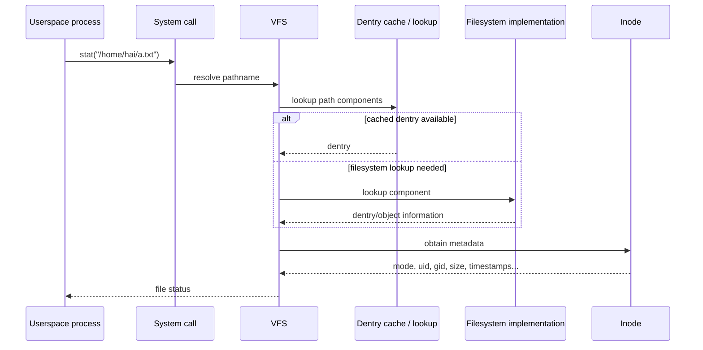
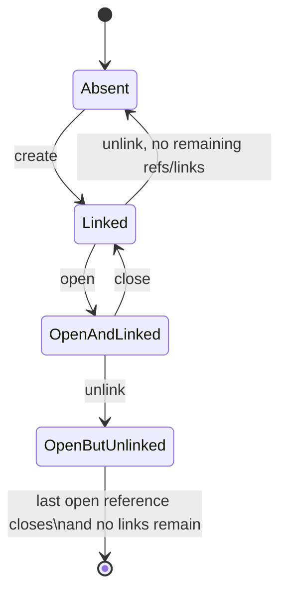

# Chủ đề 2 — Linux File System

> **Phạm vi:** Linux filesystem fundamentals: cây thư mục từ `/`, file types, pathname, inode/block, permissions, mount, pseudo-filesystems và các góc nhìn quan sát filesystem.
>
> Chương này chỉ trình bày **lý thuyết**. Không có lab, bài tập, chương trình mẫu hoàn chỉnh hoặc hướng dẫn thao tác thực hành.
>
> **Giới hạn chủ đề:** Không đi sâu vào `open/read/write/lseek`, filesystem-driver implementation, page cache, journaling hoặc VFS locking.
>
> **Nguyên tắc bố cục:** `##` chỉ dành cho các khối kiến thức lớn; `###/####` dùng cho concept chi tiết. Các phần trùng hoặc thuộc topic khác đã được loại khỏi chapter này.
>
> **Điều hướng:** [← Chủ đề 1 — Basic Linux Command Line](README-topic-01.md) · [Chủ đề 3 — File I/O →](README-topic-03.md)

---

## Mục lục

- [1. Filesystem, Namespace và Hierarchy](#1-filesystem-namespace-và-hierarchy)
- [2. Pathname, Directory và Path Resolution](#2-pathname-directory-và-path-resolution)
- [3. VFS, Dentry và Inode](#3-vfs-dentry-và-inode)
- [4. Block, File Size và Storage Allocation](#4-block-file-size-và-storage-allocation)
- [5. Các loại File trong Linux](#5-các-loại-file-trong-linux)
- [6. Metadata và `stat`](#6-metadata-và-stat)
- [7. Ownership, Permissions và `umask`](#7-ownership-permissions-và-umask)
- [8. Mount và các lớp Storage](#8-mount-và-các-lớp-storage)
- [9. Các công cụ quan sát Filesystem](#9-các-công-cụ-quan-sát-filesystem)
- [10. Pseudo-filesystems: `/dev`, `/proc`, `/sys`](#10-pseudo-filesystems-dev-proc-sys)
- [11. Vòng đời File: Name, Inode và Open References](#11-vòng-đời-file-name-inode-và-open-references)
- [12. Error Model và Debugging](#12-error-model-và-debugging)
- [13. Liên hệ với Embedded Linux](#13-liên-hệ-với-embedded-linux)
- [14. Tổng kết và Mental Model](#14-tổng-kết-và-mental-model)
- [15. Tài liệu tham khảo](#15-tài-liệu-tham-khảo)

---

## 1. Filesystem, Namespace và Hierarchy

### 1.1 Filesystem trong Linux thực chất là gì?


Khi mới học Linux, filesystem thường được hình dung là một cây thư mục:

```text
/
├── bin
├── dev
├── etc
├── home
├── proc
├── sys
└── usr
```

Hình dung này đúng ở mức giao diện, nhưng chưa đủ để hiểu bản chất.

Cần tách ít nhất ba góc nhìn:

```text
1. Namespace
   "Tên nào nằm ở đâu trong cây thư mục?"

2. Object + metadata
   "Tên đó đang tham chiếu tới loại object nào?
    inode nào?
    owner/group/permission/size/timestamp ra sao?"

3. Storage / implementation
   "Filesystem cụ thể lưu metadata và data ở đâu,
    theo cấu trúc nào?"
```

Topic 2 tập trung vào hai lớp đầu và chỉ chạm lớp storage ở mức đủ để hiểu `inode`, `block`, `df`, `du`.

Mental model đầu tiên:

```text
User sees pathname
      |
      v
/home/hai/config.txt
      |
      v
Linux VFS resolves the path
      |
      v
filesystem object + metadata
      |
      +------> data may live on disk/flash/RAM/network
      |
      +------> object may expose kernel/device state
```

Điểm quan trọng:

> **Filesystem không chỉ là “cách lưu file trên disk”.**

Trong Linux, filesystem còn là namespace chung để biểu diễn:

```text
persistent storage
temporary storage
process information
kernel objects
devices
IPC endpoints
network filesystems
```

Vì vậy cùng một thao tác như `cat` có thể đọc regular file trên ext4, `/proc/cpuinfo`, một sysfs attribute hoặc device interface, nhưng semantics phía dưới khác nhau.

---

### 1.2 Một cây namespace thống nhất bắt đầu từ `/`


Linux trình bày một **directory namespace thống nhất**, bắt đầu tại root directory `/`.

Ví dụ:

```text
/
├── etc
├── home
│   └── hai
├── mnt
├── proc
├── sys
└── usr
```

Nhưng phía dưới, các nhánh có thể đến từ nhiều filesystem:

```text
                         /
                         |
              root filesystem (ext4)
                         |
       +---------+-------+--------+---------+
       |         |                |         |
      /etc      /home            /proc     /sys
       |         |                |         |
     ext4      ext4/NFS          procfs    sysfs
```

Người dùng vẫn thấy một cây duy nhất nhờ cơ chế mount.

Do đó:

```text
directory tree
!=
một filesystem vật lý duy nhất
```

Một pathname có thể đi qua mount point mà chuỗi path không tự thể hiện điều đó.

---

### 1.3 Filesystem Hierarchy và ý nghĩa các thư mục chính


Filesystem Hierarchy Standard (FHS) chuẩn hóa **vị trí và mục đích** của nhiều directory/file để software và người quản trị có thể dự đoán tài nguyên nằm ở đâu.

Cần phân biệt:

```text
FHS
  = quy ước tổ chức pathname

ext4 / XFS / tmpfs / procfs
  = filesystem implementation/type
```

FHS không mô tả layout inode nội bộ của ext4.

#### 1.3.1 Cây thường gặp

```text
/
├── bin
├── boot
├── dev
├── etc
├── home
├── lib
├── media
├── mnt
├── opt
├── proc
├── root
├── run
├── sbin
├── sys
├── tmp
├── usr
└── var
```

Không nên học cây này như bảng từ vựng. Hãy nhóm theo vai trò.

#### 1.3.2 `/etc` — host/system configuration

Ví dụ:

```text
/etc/passwd
/etc/group
/etc/hosts
/etc/fstab
/etc/ssh/
```

Trong embedded system, `/etc` thường chứa startup/network/service configuration quan trọng.

#### 1.3.3 `/usr` — phần lớn userspace software

Thường có:

```text
/usr/bin
/usr/sbin
/usr/lib
/usr/share
```

Nhiều distribution hiện đại dùng merged `/usr`, ví dụ:

```text
/bin  -> /usr/bin
/sbin -> /usr/sbin
/lib  -> /usr/lib
```

Do đó không nên suy luận `/bin` và `/usr/bin` luôn nằm ở hai vùng storage riêng.

#### 1.3.4 `/var` — variable data

Ví dụ:

```text
/var/log
/var/lib
/var/cache
/var/tmp
```

Trong embedded product, policy ghi `/var` liên quan trực tiếp đến flash wear, persistent data và read-only rootfs.

#### 1.3.5 `/dev`, `/proc`, `/sys`

```text
/dev  device nodes
/proc procfs: process/system/kernel information
/sys  sysfs: kernel objects, attributes, relationships
```

Đây là ba nhánh cực quan trọng khi học Embedded Linux.

#### 1.3.6 `/tmp` và `/run`

```text
/tmp  temporary application data
/run  runtime state của boot hiện tại
```

Tùy system, chúng có thể nằm trên `tmpfs`.

#### 1.3.7 Embedded rootfs có thể tối giản hơn desktop

Một BusyBox rootfs có thể chỉ cần:

```text
/
├── bin
├── dev
├── etc
├── lib
├── proc
├── sbin
├── sys
├── tmp
└── usr
```

FHS giúp hiểu role của hierarchy, nhưng minimal embedded rootfs không nhất thiết sao chép nguyên desktop distribution.

---

## 2. Pathname, Directory và Path Resolution

### 2.1 Pathname, filename và path component


Pathname:

```text
/home/hai/project/main.c
```

gồm các component:

```text
/
home
hai
project
main.c
```

Kernel không coi toàn chuỗi này như một ID duy nhất. Nó phải walk từng component.

#### 2.1.1 Absolute path

Bắt đầu bằng `/`:

```text
/etc/hosts
/home/hai/a.txt
```

lookup bắt đầu từ root của process.

#### 2.1.2 Relative path

Không bắt đầu bằng `/`:

```text
src/main.c
../config
./app
```

thường bắt đầu từ current working directory.

```text
cwd = /home/hai/project
relative = src/main.c

lookup begins from:
/home/hai/project
```

#### 2.1.3 `.` và `..`

```text
.   current directory
..  parent directory
```

Đây là path semantics, không phải string replacement đơn giản.

#### 2.1.4 Filename không thể chứa `/` hoặc NUL

Linux dùng byte `/` làm pathname separator; NUL kết thúc C string truyền vào kernel interface. Vì vậy hai byte này không thể nằm bên trong một filename component.

Các ký tự như space, tab hoặc newline có thể tồn tại trong filename trên Linux, nên shell script phải quote cẩn thận.

---

### 2.2 Kernel phân giải pathname như thế nào?


Ví dụ application yêu cầu metadata của:

```text
/home/hai/a.txt
```

Mental model:

```text
choose lookup start
      ↓
lookup "home"
      ↓
lookup "hai"
      ↓
lookup "a.txt"
      ↓
final filesystem object
```

#### 2.2.1 Mỗi component có thể tạo failure point

Nếu intermediate component không tồn tại:

```text
ENOENT
```

Nếu component cần là directory nhưng lại không phải directory:

```text
ENOTDIR
```

Nếu process không có search permission trên directory:

```text
EACCES
```

Do đó permission của final file không phải yếu tố duy nhất.

#### 2.2.2 Symbolic link thay đổi lookup path

Ví dụ:

```text
current -> releases/v2
```

Lookup:

```text
/app/current/config
```

có thể tiếp tục ở:

```text
/app/releases/v2/config
```

Symlink loop có thể dẫn đến `ELOOP`.

#### 2.2.3 Mount point cũng thay đổi object được nhìn thấy

Một filesystem mounted tại `/mnt/data` khiến lookup dưới path đó đi vào mounted filesystem.

#### 2.2.4 Mermaid sequence diagram: pathname lookup ở mức mental model



Implementation thực có RCU-walk, REF-walk, mount traversal, symlink rules và concurrency phức tạp hơn; Topic 2 không cần đi sâu đến đó.

---

### 2.3 Directory thực chất là gì?


GUI thường mô tả directory là “folder chứa file”. Ở filesystem model, cần chính xác hơn:

> Directory cung cấp mapping/name lookup giữa tên trong directory và filesystem object.

Concept:

```text
directory /home/hai
        |
        +-- "a.txt" ------> object/inode A
        +-- "project" ----> object/inode B
        +-- "link" -------> symlink object C
```

Directory bản thân cũng là filesystem object và có:

```text
inode
owner
group
permissions
timestamps
```

#### 2.3.1 Pathname được xây qua nhiều directory lookup

```text
inode("/")
   |
   | "home"
   v
inode("/home")
   |
   | "hai"
   v
inode("/home/hai")
   |
   | "project"
   v
inode("/home/hai/project")
   |
   | "main.c"
   v
inode(file)
```

Đây là lý do directory search permission quyết định khả năng traverse path.

---

## 3. VFS, Dentry và Inode

### 3.1 VFS: lớp abstraction nối userspace với nhiều filesystem


Linux hỗ trợ nhiều filesystem type:

```text
ext4
XFS
Btrfs
tmpfs
procfs
sysfs
NFS
SquashFS
FAT
...
```

VFS cung cấp interface thống nhất:

```text
                  userspace
                      |
          open/stat/read/write/chmod/...
                      |
                      v
             +----------------+
             |      VFS       |
             +----------------+
              /       |       \
             v        v        v
           ext4     tmpfs     procfs
             |        |         |
          storage     RAM    kernel data
```

#### 3.1.1 Bốn object cần nhận biết

```text
superblock
    đại diện filesystem instance/mount context ở mức VFS

inode
    filesystem object + metadata

dentry
    name lookup/cache object

file object
    open-file kernel object
```

Topic 2 tập trung vào `dentry`, `inode`, mount; `file object`/file descriptor sẽ đi sâu ở Topic 3.

#### 3.1.2 Dentry cache sống trong RAM

VFS dùng dentry cache để tăng tốc pathname lookup.

Do đó:

```text
on-disk directory representation
!=
VFS struct dentry trong RAM
```

#### 3.1.3 Inode VFS và persistent metadata

Với block filesystem, persistent metadata tồn tại trên storage theo format riêng và được đưa vào kernel objects khi cần. Với pseudo-filesystem, object có thể chỉ tồn tại trong memory.

Vì vậy inode là abstraction phổ quát, còn cách lưu vật lý phụ thuộc filesystem.

---

### 3.2 Dentry và inode: tên file không phải file object


Đây là một trong các khái niệm quan trọng nhất của Topic 2.

Tách bốn lớp:

```text
name
 ↓
dentry
 ↓
inode
 ↓
data / object semantics
```

ASCII:

```text
             pathname component
                   "a.txt"
                      |
                      v
                  +--------+
                  | dentry |
                  +--------+
                      |
                      v
                  +--------+
                  | inode  |
                  +--------+
                   /      \
                  /        \
             metadata      data mapping
                              |
                              v
                          data blocks
```

#### 3.2.1 Filename không phải inode

`report.txt` là name trong một directory context; inode là object reached by lookup.

```text
filename != inode number
```

#### 3.2.2 Inode number không global toàn máy

Hai filesystem khác nhau có thể có cùng inode number.

Cặp concept:

```text
filesystem/device identity + inode number
```

mới có ý nghĩa định danh tốt hơn.

#### 3.2.3 Một inode có thể có nhiều tên

Hard link minh họa:

```text
directory A                    directory B
    |                              |
 "name1"                         "name2"
    |                              |
    +--------------+---------------+
                   |
                   v
                inode X
                   |
                   v
                 data
```

Topic 2 chỉ cần hiểu nguyên lý; API hard link chi tiết không phải trọng tâm.

---

### 3.3 Inode chứa gì và không chứa gì?


Các metadata điển hình gắn với inode:

```text
file type
permission mode
owner UID
group GID
inode number
hard-link count
file size
timestamps
block usage
device identity
```

#### 3.3.1 Inode không chứa pathname đầy đủ

Một inode không cần biết:

```text
/home/hai/project/report.txt
```

vì nó có thể được tham chiếu bằng nhiều directory entry.

Mental model:

```text
pathname = route through namespace
inode    = object reached by that route
```

#### 3.3.2 `mtime`, `ctime`, `atime`

```text
mtime
  data modification time

ctime
  inode/status change time
  không phải creation time

atime
  access time, chịu ảnh hưởng mount/access-time policy
```

Một số filesystem/API có birth time nhưng không được đồng nhất với traditional `ctime`.

#### 3.3.3 Link count

Inode metadata có hard-link count. Khi link count về 0, regular file chưa chắc được reclaim ngay nếu vẫn có process giữ open reference.

---

## 4. Block, File Size và Storage Allocation

### 4.1 Data block, filesystem block và kích thước file


Từ “block” dễ gây nhầm vì có nhiều meaning.

#### 4.1.1 Filesystem allocation block

Block filesystem quản lý storage theo allocation unit riêng.

```text
filesystem
├── metadata
├── directory data
├── file data blocks/extents
└── free-space metadata
```

Không nên mặc định mọi filesystem block = 4096 bytes dù 4 KiB phổ biến.

#### 4.1.2 Logical file size

Logical size là số byte file biểu diễn cho userspace.

```bash
stat -c '%s' file
```

#### 4.1.3 Allocated space có thể khác logical size

Sparse file có thể có:

```text
logical size     = 1 GiB
allocated space  = rất nhỏ
```

Do đó:

```text
file size != storage allocation
```

#### 4.1.4 `st_blocks` và `st_blksize`

Cần tách:

```text
st_blocks
  block-accounting field; trên Linux/POSIX-style interface thường tính theo 512-byte units

st_blksize
  preferred I/O block size hint

filesystem allocation block
  implementation/storage allocation unit
```

Ba thứ này không nên bị đồng nhất.

#### 4.1.5 Inode → data mapping

```text
          inode
            |
            +----------------------+
                                   |
                            data mapping
                                   |
                  +----------------+----------------+
                  |                |                |
                  v                v                v
               block/extent A   block/extent B   block/extent C
```

Filesystem hiện đại có thể dùng extent tree hoặc structure khác; không cần học implementation ext4 ở Topic này.

---

## 5. Các loại File trong Linux

### 5.1 Các loại file trong Linux


Nhóm file type cốt lõi:

```text
regular file
directory
symbolic link
character device
block device
FIFO
socket
```

`ls -l` thường biểu diễn bằng ký tự đầu:

```text
-  regular file
d  directory
l  symbolic link
c  character device
b  block device
p  FIFO
s  socket
```

Ví dụ:

```text
-rw-r--r--  regular file
drwxr-xr-x  directory
lrwxrwxrwx  symbolic link
crw-------  character device
brw-rw----  block device
prw-r--r--  FIFO
srwxr-xr-x  socket
```

File type là metadata. Extension `.txt`, `.c`, `.jpg` không quyết định inode file type.

---
### 5.2 Regular file, directory và symbolic link


Ba loại này xuất hiện liên tục trong userspace.

#### 5.2.1 Regular file

Regular file thường biểu diễn byte content:

```text
source code
text
ELF executable
shared library
image
configuration
binary data
```

Một ELF executable vẫn là regular file về inode type; executable format là interpretation của content cộng với permission/policy.

```text
inode type = regular file
content     = ELF executable
mode        = có thể có x bit
```

Ba lớp này khác nhau.

#### 5.2.2 Directory

Directory là file type đặc biệt phục vụ namespace/name lookup.

```text
directory
    |
    +--> directory entries / names
    +--> metadata
```

Filesystem implementation có format directory riêng; userspace không nên tự parse raw directory bytes như regular file bằng portable `read()` semantics.

#### 5.2.3 Symbolic link

Symbolic link là object chứa pathname tới target.

```text
symlink object
    |
    | stores pathname
    v
"../releases/v2"
    |
    v
path lookup continues at target
```

Ví dụ:

```bash
ln -s releases/v2 current
```

##### 5.2.3.1 Symlink có inode riêng

```text
name "current"
      |
      v
symlink inode
      |
      v
"releases/v2"
      |
      v
target lookup
```

Target có object/inode riêng.

##### 5.2.3.2 Dangling symlink

Symlink vẫn có thể tồn tại khi target không tồn tại:

```text
current -> releases/v9

releases/v9: absent
```

Khi đó:

```text
lstat(link)  có thể thấy link object
stat(link)   follow final symlink và có thể ENOENT
```

##### 5.2.3.3 Relative symlink target

Relative target được giải tương đối với directory chứa symlink khi follow link, không phải đơn giản theo cwd nơi lệnh `ln` từng được chạy.

##### 5.2.3.4 Symlink loop

```text
a -> b
b -> a
```

path resolution có giới hạn số symbolic links được follow; vượt giới hạn có thể trả `ELOOP`.

---

### 5.3 Character device, block device, FIFO và socket


Các type này cho thấy filesystem namespace không chỉ đặt tên persistent data.

#### 5.3.1 Character device

Ví dụ:

```text
/dev/null
/dev/zero
/dev/ttyS0
```

Mental model:

```text
userspace
    |
 open/read/write/ioctl
    |
    v
device node
    |
 major/minor
    |
    v
kernel device/driver interface
```

Device node không phải regular file chứa “dữ liệu của phần cứng”.

#### 5.3.2 Block device

Ví dụ:

```text
/dev/sda
/dev/mmcblk0
/dev/mmcblk0p1
```

Block device thường cung cấp random-access block I/O và có thể là nền cho:

```text
partition table
filesystem
swap
LVM/device mapper
```

#### 5.3.3 Major và minor number

Device node thường mang major/minor identity.

Mental model đơn giản:

```text
major -> kernel routing theo driver/device class
minor -> instance/subdevice identification
```

Chi tiết phụ thuộc subsystem.

Quan sát:

```bash
ls -l /dev/null
stat /dev/null
```

#### 5.3.4 Có device node không có nghĩa hardware chắc chắn hoạt động

Một `/dev/...` entry tồn tại không chứng minh:

```text
wiring đúng
pinmux đúng
clock đúng
peripheral responds
driver runtime không lỗi
```

Đây là distinction quan trọng cho board bring-up sau này.

#### 5.3.5 FIFO

FIFO còn gọi là named pipe.

```bash
mkfifo mypipe
```

Mental model:

```text
process A
   |
 write
   v
/path/to/fifo
   |
 kernel IPC semantics
   v
process B
   |
  read
```

Filesystem entry cung cấp name để process rendezvous; data không phải persistent regular-file content.

#### 5.3.6 UNIX-domain socket pathname

Socket có thể bind vào pathname:

```text
/run/service.sock
```

```text
client
  |
connect(path)
  v
socket pathname
  |
  v
kernel socket endpoint
  |
  v
server
```

Một socket pathname thường hiện type `s` trong `ls -l`.

---

## 6. Metadata và `stat`

### 6.1 File metadata và `stat`


`stat` là công cụ quan sát metadata trực tiếp và rất quan trọng khi debug.

```bash
stat README.md
```

Thông tin điển hình:

```text
file type
size
allocated blocks
I/O block hint
device
inode number
hard-link count
mode/permissions
UID/GID
timestamps
```

#### 6.1.1 `stat(1)` và `stat(2)` là hai lớp khác nhau

```text
stat(1)
  command-line utility

stat(2)
  system-call/API family
```

Đây là lý do manual section quan trọng:

```bash
man 1 stat
man 2 stat
```

#### 6.1.2 `stat` và symlink

Kernel APIs:

```text
stat(path)
  normally follows final symlink

lstat(path)
  reports final symlink object itself

fstat(fd)
  reports object referenced by an open fd
```

Command-line options phải đọc manual của utility hiện tại thay vì suy từ syscall name.

#### 6.1.3 Search permission trên prefix

Theo `stat(2)`, để lookup metadata bằng pathname, process cần search/execute permission trên các directory component của prefix.

Ví dụ:

```text
/a/b/file
```

Nếu không traverse được `/a/b`, kernel không tới được final object dù file bản thân có read bit cho user.

#### 6.1.4 Metadata có thể thay đổi đồng thời

Filesystem là hệ thống concurrent. Process khác có thể `chmod`, `chown`, rename hoặc modify trong lúc ta quan sát.

Do đó output của diagnostic tool là snapshot/observation ở một thời điểm, không phải guarantee rằng state sẽ giữ nguyên sau đó.

---

## 7. Ownership, Permissions và `umask`

### 7.1 Ownership: UID, GID, owner và group


Classic Unix filesystem permission model dùng numeric identity:

```text
UID
GID
```

Inode có:

```text
owner UID
group GID
```

`ls -l` thường resolve numeric IDs thành tên qua userspace identity services.

Do đó:

```text
stored metadata: UID 1000
human display:   hai
```

là hai lớp khác nhau.

#### 7.1.1 Process credentials tham gia access decision

Mental model giản lược:

```text
process credentials
      +
inode UID/GID/mode
      +
directory traversal permissions
      +
mount/security policy
      ↓
access decision
```

#### 7.1.2 Owner / group / others

Classic mode chia ba class:

```text
-rw-r-----
 ||| ||| |||
 ||| ||| +++ others
 ||| +++----- group
 +++--------- owner
```

Kernel permission check không chỉ nhìn string mà `ls` hiển thị; nó dùng credentials và policy thực tế.

---

### 7.2 Permission model `r/w/x`


Ba bit cơ bản:

```text
r = read
w = write
x = execute/search
```

Đối với regular file:

```text
r -> đọc file data
w -> thay đổi file data
x -> execute permission ở mode-bit layer
```

#### 7.2.1 Octal representation

```text
r = 4 = 100b
w = 2 = 010b
x = 1 = 001b
```

Suy ra:

```text
7 = rwx
6 = rw-
5 = r-x
4 = r--
0 = ---
```

Ví dụ:

```text
0644

owner  = 6 = rw-
group  = 4 = r--
others = 4 = r--
```

#### 7.2.2 Permission bits không phải toàn bộ security model

Access có thể còn chịu ảnh hưởng:

```text
ACL
Linux capabilities
SELinux/AppArmor
mount flags
read-only filesystem
immutable attributes
namespace/container policy
```

Roadmap Fresher cần chắc classic bits trước; các layer nâng cao chỉ cần biết tồn tại.

---

### 7.3 Permission trên directory khác regular file


Đây là phần rất dễ nhầm.

Với directory:

```text
r = read/list directory entries
w = modify directory entries
x = search/traverse directory
```

#### 7.3.1 `r` trên directory

Cho phép đọc/list danh sách entry names.

Nhưng `r` không tự đảm bảo process có thể lookup metadata/nội dung bên trong nếu thiếu `x`.

#### 7.3.2 `x` trên directory

`x` nghĩa là **search permission**.

Path:

```text
/a/b/c
```

cần traverse các directory component:

```text
/
a
b
```

Mental model:

```text
directory x
=
"được đi xuyên qua node này khi pathname lookup"
```

#### 7.3.3 `w` trên directory

`w` liên quan tới sửa directory entries:

```text
create name
unlink name
rename name
```

thường kết hợp với `x` để operation hoạt động.

Điểm quan trọng:

> File bản thân không writable vẫn có thể bị unlink bởi user có quyền phù hợp trên parent directory, vì unlink thay directory entry chứ không phải ghi file contents.

#### 7.3.4 Bảng semantics

| Bit | Regular file | Directory |
|---|---|---|
| `r` | đọc data | list/read entries |
| `w` | sửa data | tạo/xóa/rename entry, với traversal/policy phù hợp |
| `x` | execute permission layer | search/traverse |

#### 7.3.5 Ví dụ path

Muốn đọc:

```text
/home/hai/private/config
```

cần conceptually:

```text
search /home
search /home/hai
search /home/hai/private
read config
```

Mất `x` ở `private` có thể chặn lookup dù `config` là `-rw-r--r--`.

---

### 7.4 `chmod`, `chown` và `umask`


Ba công cụ liên quan permission/ownership nhưng giải quyết ba vấn đề khác nhau.

```text
chmod -> mode bits
chown -> owner/group metadata
umask -> process file-mode creation mask
```

#### 7.4.1 `chmod` symbolic mode

```bash
chmod u+x app
chmod g-w file
chmod o-r secret
chmod a+r README.md
```

```text
u = owner/user
g = group
o = others
a = all

+ add
- remove
= set selected permissions
```

#### 7.4.2 `chmod` octal mode

```bash
chmod 644 file
chmod 755 script
chmod 700 private
```

Giải mã:

```text
755
│││
││└─ others = 5 = r-x
│└── group  = 5 = r-x
└─── owner  = 7 = rwx
```

##### 7.4.2.1 Không dùng `chmod 777` như “universal fix”

`777` không sửa được các lỗi như:

```text
wrong pathname
wrong owner
read-only filesystem
missing mount
SELinux/AppArmor denial
wrong symlink target
```

và có thể tạo security issue.

Tư duy đúng:

```text
operation cần quyền gì?
       ↓
object/parent nào thiếu quyền?
       ↓
ownership đúng chưa?
       ↓
mount/filesystem writable không?
```

#### 7.4.3 Special mode bits

Ngoài `r/w/x` còn có:

```text
setuid
setgid
sticky
```

Topic này chỉ cần nhận biết. Ví dụ sticky bit trên `/tmp` giải quyết shared-directory deletion policy.

#### 7.4.4 `chown`

Ví dụ:

```bash
sudo chown user file
sudo chown user:group file
sudo chown :group file
```

Kernel APIs gồm `chown`, `fchown`, `lchown`, `fchownat`.

Một nuance quan trọng: `chown(path)` normally dereference symbolic link; `lchown()` thao tác link object.

Việc đổi owner phụ thuộc privilege/capability. Trên Linux, process có `CAP_CHOWN` có khả năng rộng hơn user thông thường.

#### 7.4.5 Ownership của file mới

Owner thường theo filesystem UID của creating process.

Group phụ thuộc:

```text
process group
parent directory setgid
filesystem/mount semantics
```

Vì vậy “file mới lúc nào cũng mang primary group của user” không phải quy tắc universal.

#### 7.4.6 `umask`

`umask` là state của process, không phải permission được lưu trong file.

Công thức mental model:

```text
created_mode = requested_mode & ~umask
```

chỉ xét permission bits phù hợp.

##### 7.4.6.1 Regular file example

Program thường request kiểu:

```text
0666 = rw-rw-rw-
```

với:

```text
umask 0022
```

kết quả:

```text
0644 = rw-r--r--
```

##### 7.4.6.2 Directory example

`mkdir` thường request:

```text
0777
```

với `0022`:

```text
0755
```

##### 7.4.6.3 Umask không thêm execute bit

Nếu requested mode là `0666`, x bits không tồn tại từ đầu. `umask` chỉ loại bit, không thêm bit.

##### 7.4.6.4 Process inheritance

Shell có umask; child process thường kế thừa state này.

```bash
umask
umask -S
```

Default ACL có thể làm creation semantics phức tạp hơn; đó là caveat cần biết nhưng chưa cần học sâu ở Topic 2.

---

## 8. Mount và các lớp Storage

### 8.1 Mount: gắn filesystem vào namespace


Không nên định nghĩa mount là “mở ổ đĩa”.

Định nghĩa hữu ích:

> **Mount gắn một filesystem tree vào một mount point trong pathname namespace.**

Mental model:

```text
filesystem tree
      |
      | mount
      v
directory mount point
      |
      v
reachable through pathname
```

#### 8.1.1 Mount không copy dữ liệu

Trước mount:

```text
/mnt/data/
└── underlying.txt
```

Sau khi filesystem B mount vào `/mnt/data`:

```text
/mnt/data/
├── a.txt
└── b.txt
```

`underlying.txt` không nhất thiết bị xóa; nó bị mounted filesystem che trong namespace.

ASCII:

```text
Underlying rootfs
|
+-- mnt
    |
    +-- data
        |
        +-- underlying.txt

             mount filesystem B
                     |
                     v
Visible namespace
|
+-- mnt
    |
    +-- data  <--- mount point
        |
        +-- a.txt
        +-- b.txt
```

Sau `umount`, underlying entry có thể hiện lại.

#### 8.1.2 Filesystem không cần block device

Ví dụ:

```text
procfs
sysfs
tmpfs
```

không cần block storage device theo nghĩa thông thường.

Trong `/proc/filesystems`, `nodev` biểu thị filesystem type không cần block device để mount.

#### 8.1.3 Unmount có thể fail vì busy

Các reference như:

```text
process cwd inside mount
open files
other active mount usage
```

có thể khiến unmount thất bại tùy context.

Dùng:

```bash
findmnt
mount
```

để quan sát mount topology.

---

### 8.2 Block device, partition, filesystem và mount point


Bốn abstraction này cần tách rõ:

```text
physical/virtual storage
        ↓
block device
        ↓
optional partition table
        ↓
partition / logical region
        ↓
filesystem structures
        ↓
mount operation
        ↓
mount point in namespace
```

Ví dụ microSD:

```text
microSD
  |
  v
/dev/mmcblk0               block device
  |
  +--> /dev/mmcblk0p1      partition
  |        |
  |        +--> FAT filesystem
  |                 |
  |                 +--> mounted at /boot
  |
  +--> /dev/mmcblk0p2
           |
           +--> ext4 filesystem
                    |
                    +--> mounted at /
```

#### 8.2.1 Block device không nhất thiết là physical disk

Có thể đến từ:

```text
LVM
device mapper
loop device
RAID
network block device
```

#### 8.2.2 Partition không phải filesystem

Partition có thể chứa:

```text
filesystem
swap
raw boot data
other structured/raw data
```

#### 8.2.3 Filesystem không phải mount point

```text
ext4 filesystem
     ↓ mount
/home
```

Filesystem là data structure/type; `/home` là vị trí namespace.

---

## 9. Các công cụ quan sát Filesystem

### 9.1 `ls -l`, `stat`, `file`, `df`, `du`


Năm tool này trả lời **năm góc nhìn khác nhau**. Không nên xem chúng là các cách in cùng một thông tin.

#### 9.1.1 `ls -l` — directory listing + metadata phổ biến

Ví dụ:

```bash
ls -l
ls -ld directory
ls -li file
ls -ln file
```

Ý nghĩa hữu ích:

```text
-l  long listing
-d  list directory object itself
-i  show inode number
-n  show numeric UID/GID
```

Một dòng concept:

```text
-rw-r--r-- 1 hai dev 1234 Aug 23 12:00 config.txt
|          | |   |   |                 |
|          | |   |   |                 +-- name
|          | |   |   +-------------------- size
|          | |   +------------------------ group
|          | +---------------------------- owner
|          +------------------------------ link count
+----------------------------------------- type + mode
```

#### 9.1.2 `stat` — metadata chi tiết

```bash
stat file
stat -c '%n %i %s %b %U %G %a %A' file
```

Hữu ích khi cần:

```text
inode
mode
UID/GID
size
allocated blocks
timestamps
device
link count
```

#### 9.1.3 `file` — content/format identification

`file` trả lời gần với câu hỏi:

> “Nội dung/format của object này có vẻ là gì?”

```bash
file /bin/ls
file image.png
file script.sh
```

Cần tách:

```text
inode type
vs
content type/format
```

ELF executable và Markdown text đều có thể là regular file, nhưng `file(1)` nhận dạng content khác nhau.

#### 9.1.4 `df` — filesystem-wide space accounting

```bash
df -h
df -T
df -h /
```

Mental model:

```text
mounted filesystem
      |
      +--> total
      +--> used
      +--> available
      +--> filesystem type
      +--> mount point
```

`df` trả lời:

> Filesystem chứa path này đang có accounting space như thế nào?

#### 9.1.5 `du` — usage của file tree

```bash
du -sh .
du -h --max-depth=1 .
```

Mental model:

```text
start pathname
      ↓
walk reachable file tree
      ↓
sum file allocation information
      ↓
report
```

#### 9.1.6 Vì sao `df` và `du` có thể khác?

Hai tool đo khác lớp:

```text
df
  filesystem-wide allocation accounting

du
  reachable directory-tree usage
```

Một case kinh điển:

```text
process opens log
      ↓
pathname is unlinked
      ↓
directory entry disappears
      ↓
process still holds open reference
      ↓
blocks remain allocated
```

Lúc đó `du` có thể không thấy pathname cũ nhưng `df` vẫn tính space đã cấp phát.

Các lý do khác:

```text
filesystem metadata
reserved space
sparse files
mount boundaries
inaccessible directories
snapshots/filesystem-specific behavior
```

Do đó “`df` != `du`” không tự động nghĩa là tool sai.

---

## 10. Pseudo-filesystems: `/dev`, `/proc`, `/sys`

### 10.1 `/dev`, `/proc`, `/sys`


Ba vùng này chứng minh rằng “file trong pathname namespace” không đồng nghĩa “regular file lưu trên disk”.

#### 10.1.1 `/proc` — procfs

`procfs` là pseudo-filesystem cung cấp interface tới process/system/kernel state.

Ví dụ:

```text
/proc/cpuinfo
/proc/meminfo
/proc/interrupts
/proc/filesystems
/proc/<pid>/
```

Mental model:

```text
cat /proc/meminfo
       |
       v
VFS / procfs
       |
       v
kernel exposes current state
```

#### 10.1.2 `/sys` — sysfs

Linux Kernel docs mô tả sysfs là RAM-based filesystem dùng để export kernel objects, attributes và relationships tới userspace.

Thường gặp:

```text
/sys/devices
/sys/bus
/sys/class
/sys/module
/sys/fs
```

Sau này Linux Device Model sẽ dùng trực tiếp các nhánh này.

#### 10.1.3 `/dev` — device nodes

Linux hiện đại thường dùng `devtmpfs` kết hợp userspace device manager như `udev`; minimal embedded system có thể dùng `devtmpfs` + BusyBox `mdev` hoặc cơ chế đơn giản hơn.

Mental model:

```text
device/driver registration
       ↓
kernel device model
       ↓
device node in devtmpfs
       ↓
optional userspace naming/permissions/symlinks
       ↓
/dev/...
```

Không nên đồng nhất `/sys` và `/dev`:

```text
/sys -> object hierarchy + attributes
/dev -> device access nodes
```

#### 10.1.4 “Everything is a file” là shortcut

Câu này hữu ích để hiểu Unix abstraction nhưng không literal hoàn toàn.

Linux dùng filesystem namespace và file descriptors rất rộng, nhưng không phải mọi kernel object đều là regular file với đầy đủ regular-file semantics.

---

## 11. Vòng đời File: Name, Inode và Open References

### 11.1 Vòng đời của regular file dưới góc nhìn tên và inode


Tách ba concept:

```text
directory name
inode
open reference
```

Một file có thể bị `unlink` trong khi process vẫn giữ nó open.



Đây là mô hình giản lược cho regular file.

ASCII:

```text
Before unlink:

directory entry "log.txt"
          |
          v
        inode <------ open process reference
          |
          v
       data blocks


After unlink:

(no directory entry)

        inode <------ open process reference
          |
          v
       data blocks


After last reference closes:

inode/data can be reclaimed when no link/reference keeps them alive
```

Điểm này là nền trực tiếp để hiểu một số chênh lệch `df`/`du`.

---

## 12. Error Model và Debugging

### 12.1 Error model và tư duy debug filesystem


Đừng debug filesystem bằng cách thử `sudo` hoặc `chmod 777` ngay.

Debug theo layer:

```text
pathname correct?
      ↓
components exist?
      ↓
required components are directories?
      ↓
symlink target correct?
      ↓
mount mapping correct?
      ↓
directory traversal permission?
      ↓
final object owner/mode?
      ↓
filesystem writable?
      ↓
space/inode capacity available?
      ↓
security/filesystem-specific restriction?
```

#### 12.1.1 `ENOENT`

Có thể do:

```text
final object absent
intermediate component absent
dangling symlink target
```

Kiểm tra từng prefix hoặc dùng:

```bash
namei -l /path/to/file
```

nếu utility có sẵn.

#### 12.1.2 `ENOTDIR`

Một intermediate component không phải directory.

```text
/tmp/a       regular file
/tmp/a/b     impossible path traversal
```

#### 12.1.3 `EACCES`

Có thể do:

```text
missing x/search on directory prefix
missing final-object permission
other access-control policy
```

Debug:

```bash
id
namei -l path
ls -ld parent
stat target
```

#### 12.1.4 `ELOOP`

Thường liên quan symbolic-link loop hoặc quá nhiều symlink resolutions.

```bash
readlink link
readlink -f link
```

#### 12.1.5 `EROFS`

Filesystem read-only.

```bash
findmnt
findmnt -no TARGET,SOURCE,FSTYPE,OPTIONS /path
```

#### 12.1.6 `ENOSPC`

Kiểm tra cả:

```bash
df -h
df -i
```

Tùy filesystem, data space và inode/object capacity có thể là hai nguồn giới hạn khác nhau.

#### 12.1.7 Permission trông đúng nhưng vẫn fail

Checklist:

```text
1. process/user hiện tại là ai?
2. supplementary groups đúng chưa?
3. parent directory có search permission?
4. symlink đi tới đâu?
5. mount có ro/noexec hay policy khác?
6. ACL?
7. SELinux/AppArmor?
8. owner/group numeric IDs thực là gì?
```

Topic này chưa học toàn bộ security layer nhưng phải biết mode bits không phải lớp duy nhất.

---

## 13. Liên hệ với Embedded Linux

### 13.1 Liên hệ với Embedded Linux


Topic 2 là nền trực tiếp cho nhiều phần sau của roadmap.

#### 13.1.1 Root filesystem

Một Embedded Linux system cần một rootfs hierarchy tối thiểu, ví dụ:

```text
/
├── bin
├── dev
├── etc
├── lib
├── proc
├── sbin
├── sys
└── usr
```

Kernel boot xong phải mount được root filesystem và chạy init/userspace.

Không hiểu:

```text
filesystem type
mount
pathname
permissions
/dev
/proc
/sys
```

thì rất khó debug rootfs.

#### 13.1.2 BusyBox

BusyBox cung cấp nhiều applet như:

```text
ls
mount
df
du
chmod
chown
```

Topic 2 giúp hiểu semantics phía dưới các applet này thay vì chỉ nhớ syntax.

#### 13.1.3 `/dev` và driver

Sau này userspace sẽ gặp:

```text
/dev/ttyS0
/dev/i2c-1
/dev/spidevX.Y
/dev/watchdog
```

Mental model nền:

```text
device node
   ↓
file type + major/minor
   ↓
kernel driver/device interface
```

#### 13.1.4 `/sys` và Linux Device Model

Khi học:

```text
device
driver
bus
class
probe/bind
```

bạn sẽ dùng:

```text
/sys/devices
/sys/bus
/sys/class
```

Topic 2 đặt nền rằng sysfs là filesystem interface tới kernel object relationships.

#### 13.1.5 `/proc` và bring-up

Trên target:

```text
/proc/cmdline
/proc/interrupts
/proc/meminfo
/proc/filesystems
/proc/mounts
```

là các nguồn diagnostic quan trọng.

#### 13.1.6 Read-only rootfs và writable data

Embedded product có thể dùng:

```text
SquashFS/read-only rootfs
        +
/tmp, /run, /var, /data mounted separately
```

Muốn hiểu kiến trúc này phải chắc mount + hierarchy.

#### 13.1.7 Storage trên embedded board

Có thể gặp:

```text
eMMC
SD
SPI-NOR
NAND
UBI/UBIFS
```

Storage technology khác nhau nhưng userspace vẫn thường nhìn qua filesystem namespace/mount/file metadata.

#### 13.1.8 Boot failure liên quan rootfs

Các log kiểu:

```text
VFS: Cannot open root device ...
VFS: Unable to mount root fs ...
```

cần debug theo:

```text
storage/block driver?
partition?
filesystem support?
root= bootarg?
filesystem integrity?
mount?
init path?
```

Topic 2 cung cấp vocabulary và abstraction nền cho phần Boot Architecture sau.

---

## 14. Tổng kết và Mental Model

```text
pathname
   ↓
namespace lookup
   ↓
dentry/name
   ↓
inode/object metadata
   ↓
filesystem
   ↓
storage / RAM-backed / kernel-backed object
```

Các điểm cần giữ:
- Linux presents một namespace thống nhất bắt đầu từ `/`.
- Pathname là chuỗi tên để lookup; inode không lưu pathname theo cách “mỗi file có đúng một tên”.
- File types gồm regular file, directory, symlink, char/block device, FIFO và socket.
- Metadata, ownership và permission là thuộc tính của filesystem object; directory permissions có semantics riêng.
- Mount gắn một filesystem vào một mount point trong namespace.
- `/proc`, `/sys` và nhiều `/dev` views là kernel-facing/pseudo-filesystem interfaces.
- `df` trả lời filesystem-wide space; `du` trả lời usage của file/tree được duyệt.

---

## 15. Tài liệu tham khảo

- Linux Kernel VFS documentation: https://docs.kernel.org/filesystems/vfs.html
- Linux path lookup documentation: https://docs.kernel.org/filesystems/path-lookup.html
- `inode(7)`: https://man7.org/linux/man-pages/man7/inode.7.html
- `path_resolution(7)`: https://man7.org/linux/man-pages/man7/path_resolution.7.html
- `pathname(7)`: https://man7.org/linux/man-pages/man7/pathname.7.html
- `stat(2)`: https://man7.org/linux/man-pages/man2/stat.2.html
- `mount(2)`: https://man7.org/linux/man-pages/man2/mount.2.html
- Filesystem Hierarchy Standard: https://refspecs.linuxfoundation.org/FHS_3.0/fhs/index.html
- GNU Coreutils Manual: https://www.gnu.org/software/coreutils/manual/
- Bootlin Embedded Linux training: https://bootlin.com/training/embedded-linux/

---

> **Điều hướng:** [← Chủ đề 1 — Basic Linux Command Line](README-topic-01.md) · [Chủ đề 3 — File I/O →](README-topic-03.md)
