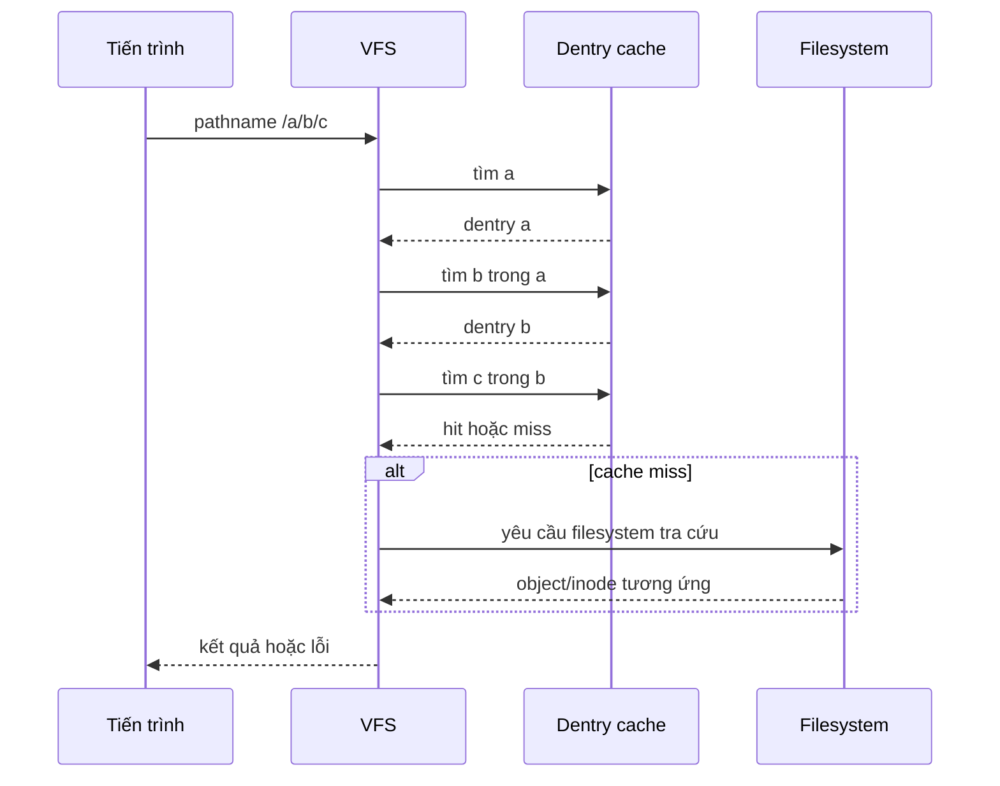

# Chủ đề 2 — Hệ thống tệp Linux

> **Mục tiêu:** hiểu Linux tổ chức và tìm tệp như thế nào: từ cây `/`, đường dẫn, thư mục, `inode`, `dentry`, quyền truy cập, mount cho tới `/dev`, `/proc`, `/sys`.
>
> **Quy ước ngôn ngữ:** phần giải thích dùng Tiếng Việt. Giữ nguyên những tên chuẩn cần tra cứu như `Linux`, `VFS`, `inode`, `dentry`, `procfs`, `sysfs`, `devtmpfs`, tên API và lệnh.
>
> **Phạm vi:** cây namespace, FHS, pathname, phân giải đường dẫn, `VFS`, `dentry`, `inode`, block, các loại tệp, metadata, quyền `r/w/x`, `chmod`, `chown`, `umask`, mount, `/dev`, `/proc`, `/sys`, `df`, `du`.
>
> Chương này chỉ có **lý thuyết**, không có bài thực hành.

---

## Mục lục

- [1. Hệ thống tệp trong Linux thực chất là gì?](#1-hệ-thống-tệp-trong-linux-thực-chất-là-gì)
- [2. Cây thư mục bắt đầu từ `/`](#2-cây-thư-mục-bắt-đầu-từ-)
- [3. Đường dẫn và cách nhân Linux tìm một tệp](#3-đường-dẫn-và-cách-nhân-linux-tìm-một-tệp)
- [4. VFS, Dentry và Inode](#4-vfs-dentry-và-inode)
- [5. Block, kích thước tệp và dung lượng thật](#5-block-kích-thước-tệp-và-dung-lượng-thật)
- [6. Các loại tệp trong Linux](#6-các-loại-tệp-trong-linux)
- [7. Metadata và `stat`](#7-metadata-và-stat)
- [8. Chủ sở hữu, nhóm và quyền `r/w/x`](#8-chủ-sở-hữu-nhóm-và-quyền-rwx)
- [9. `chmod`, `chown` và `umask`](#9-chmod-chown-và-umask)
- [10. Mount: ghép nhiều hệ thống tệp vào một cây](#10-mount-ghép-nhiều-hệ-thống-tệp-vào-một-cây)
- [11. `/dev`, `/proc`, `/sys`: những hệ thống tệp đặc biệt](#11-dev-proc-sys-những-hệ-thống-tệp-đặc-biệt)
- [12. `ls`, `stat`, `file`, `df`, `du` quan sát lớp nào?](#12-ls-stat-file-df-du-quan-sát-lớp-nào)
- [13. Vòng đời tên tệp, liên kết và tệp đang mở](#13-vòng-đời-tên-tệp-liên-kết-và-tệp-đang-mở)
- [14. Tư duy gỡ lỗi hệ thống tệp](#14-tư-duy-gỡ-lỗi-hệ-thống-tệp)
- [15. Liên hệ với Embedded Linux](#15-liên-hệ-với-embedded-linux)
- [16. Tổng kết](#16-tổng-kết)
- [17. Tài liệu tham khảo](#17-tài-liệu-tham-khảo)

---

## 1. Hệ thống tệp trong Linux thực chất là gì?

> **Nói đơn giản:** hệ thống tệp không chỉ là “nơi lưu file”. Nó là cách Linux tổ chức tên, thư mục, metadata và dữ liệu thành một namespace mà chương trình có thể truy cập.

### 1.1 Hai lớp dễ bị trộn lẫn

Có hai câu hỏi khác nhau:

```text
1. Tệp có tên/pathname nào trong cây thư mục?
2. Dữ liệu/metadata của tệp được lưu ra sao trong filesystem cụ thể?
```

Ví dụ:

```text
/home/user/a.txt
```

là một **đường dẫn trong namespace**.

Còn việc tệp nằm trên:

```text
ext4
F2FS
SquashFS
tmpfs
```

là câu chuyện của filesystem bên dưới.

### 1.2 Linux cho nhiều filesystem cùng xuất hiện trong một cây

Một hệ Linux có thể có:

```text
/             -> ext4
/proc         -> procfs
/sys          -> sysfs
/dev          -> devtmpfs
/run          -> tmpfs
/mnt/data     -> filesystem khác
```

Người dùng vẫn nhìn thấy **một cây duy nhất bắt đầu từ `/`**.

### 1.3 Không nên hiểu quá literal câu “everything is a file”

Linux cung cấp nhiều tài nguyên qua giao diện giống tệp:

```text
regular file
directory
device node
FIFO
socket pathname
procfs/sysfs entry
```

Nhưng chúng không có cùng ngữ nghĩa.

Ví dụ:

```text
read() trên regular file
read() trên UART device
read() trên /proc entry
```

có thể rất khác nhau.

---

## 2. Cây thư mục bắt đầu từ `/`

### 2.1 `/` là gốc của namespace

`/` là điểm bắt đầu của việc phân giải đường dẫn tuyệt đối.

```text
/
├── bin
├── dev
├── etc
├── home
├── proc
├── run
├── sys
├── tmp
├── usr
└── var
```

Điểm quan trọng:

> `/` là gốc của namespace mà tiến trình nhìn thấy; nó không đồng nghĩa cố định với “partition root vật lý”.

Mount namespace, `chroot`, container và boot configuration có thể thay đổi cách tiến trình nhìn cây này.

### 2.2 Ý nghĩa khái quát của một số thư mục

#### `/etc`

Chứa cấu hình hệ thống/dịch vụ mang tính cục bộ cho máy.

Trong hệ nhúng có thể gặp:

```text
network configuration
service configuration
startup configuration
```

#### `/usr`

Chứa phần lớn chương trình, thư viện và dữ liệu dùng chung của không gian người dùng.

#### `/var`

Chứa dữ liệu có tính thay đổi trong quá trình vận hành:

```text
log
cache
state
spool
```

Trong Embedded Linux, cách ghi `/var` liên quan trực tiếp đến tuổi thọ flash và thiết kế rootfs chỉ đọc.

#### `/tmp`

Dữ liệu tạm thời; chính sách tồn tại phụ thuộc hệ thống.

#### `/run`

Trạng thái runtime từ lúc boot hiện tại, thường nằm trên `tmpfs`.

#### `/dev`, `/proc`, `/sys`

Đây không phải ba thư mục “chứa file bình thường”. Chúng là các giao diện quan trọng nối không gian người dùng với nhân Linux và mô hình thiết bị.

### 2.3 FHS là quy ước, không phải định luật vật lý

`Filesystem Hierarchy Standard` giúp hệ Linux có cấu trúc nhất quán, nhưng một rootfs nhúng tối giản có thể bỏ nhiều thư mục/chương trình không cần thiết.

---

## 3. Đường dẫn và cách nhân Linux tìm một tệp

> **Nói đơn giản:** đường dẫn là một chuỗi tên. Nhân Linux đi qua từng thành phần từ trái sang phải để tìm đối tượng cuối cùng.

### 3.1 Tên tệp, thành phần đường dẫn và đường dẫn

Ví dụ:

```text
/home/user/docs/report.txt
```

Các thành phần:

```text
home
user
docs
report.txt
```

Mỗi thành phần phải được tra cứu trong thư mục tương ứng.

### 3.2 Đường dẫn tuyệt đối

Bắt đầu bằng `/`:

```text
/etc/passwd
```

Tra cứu bắt đầu từ root của namespace.

### 3.3 Đường dẫn tương đối

Không bắt đầu bằng `/`:

```text
src/main.c
```

Tra cứu bắt đầu từ thư mục làm việc hiện tại của tiến trình.

### 3.4 `.` và `..`

```text
.   -> vị trí hiện tại
..  -> thư mục cha theo namespace hiện tại
```

### 3.5 Quá trình phân giải



Đây là mô hình tư duy. Chi tiết cache và filesystem cụ thể phức tạp hơn.

### 3.6 Mỗi thành phần đều có thể gây lỗi

Ví dụ:

```text
/a/b/c
```

Có thể lỗi vì:

```text
a không tồn tại
b không phải directory
thiếu quyền search trên a hoặc b
symlink loop
mount state thay đổi
c không tồn tại
```

### 3.7 Symbolic link làm thay đổi đường tra cứu

Một symbolic link chứa một pathname khác.

```text
name -> ../target/file
```

Khi theo liên kết, nhân Linux tiếp tục phân giải pathname mục tiêu theo quy tắc tương ứng.

---

## 4. VFS, Dentry và Inode

### 4.1 VFS là gì?

`VFS` là lớp trừu tượng trong nhân Linux cho phép cùng các API như:

```text
open
read
write
stat
mount
```

làm việc với nhiều filesystem khác nhau.

```text
Ứng dụng
   |
   v
System call / VFS
   |
   +--> ext4
   +--> tmpfs
   +--> procfs
   +--> sysfs
   +--> ...
```

### 4.2 Dentry là gì?

`dentry` là đối tượng VFS đại diện cho **mối quan hệ tên trong một thư mục**.

Mô hình đơn giản:

```text
parent directory + name
          |
          v
        dentry
          |
          v
        inode
```

Dentry cache giúp tăng tốc pathname lookup.

Dentry là đối tượng trong RAM; không nên đồng nhất nó với định dạng directory entry trên đĩa của một filesystem cụ thể.

### 4.3 Inode là gì?

`inode` đại diện cho đối tượng tệp ở lớp filesystem/VFS.

Nó gắn với metadata như:

```text
file type
mode/permissions
UID/GID
size
timestamps
link count
mapping tới dữ liệu
```

### 4.4 Inode không chứa pathname đầy đủ

Đây là điểm cực kỳ quan trọng.

```text
Tên/pathname
  thuộc namespace/directory entry

Inode
  thuộc object/metadata
```

Một inode có thể có nhiều tên thông qua hard link.

### 4.5 Inode number không phải ID toàn máy

`inode number` có ý nghĩa trong ngữ cảnh filesystem cụ thể.

Hai filesystem khác nhau có thể có inode cùng số.

### 4.6 Quan hệ tổng thể

```text
pathname
   |
   v
directory lookup
   |
   v
dentry
   |
   v
inode
   |
   +--> metadata
   +--> data mapping
```

---

## 5. Block, kích thước tệp và dung lượng thật

### 5.1 Logical size

Kích thước logic là số byte mà tệp biểu diễn trong namespace/API.

Ví dụ một tệp có:

```text
size = 1000 bytes
```

### 5.2 Dung lượng được cấp phát có thể khác

Filesystem thường quản lý dữ liệu theo đơn vị block.

Một tệp logic 1000 byte có thể cần nhiều dung lượng vật lý hơn do:

```text
block allocation
metadata
alignment
filesystem overhead
```

Ngược lại, sparse file có thể có logical size rất lớn nhưng chỉ cấp phát ít block.

### 5.3 `st_size`, `st_blocks`, `st_blksize`

Về mặt khái niệm:

```text
st_size
  kích thước logic của tệp

st_blocks
  số block lưu trữ đã cấp phát theo đơn vị API quy định

st_blksize
  kích thước block ưu tiên cho I/O, không nhất thiết là allocation block của filesystem
```

Không nên đồng nhất ba khái niệm này.

---

## 6. Các loại tệp trong Linux

### 6.1 Regular file

Tệp dữ liệu thông thường:

```text
text
binary
executable
image
database
```

Extension không quyết định loại tệp ở mức inode.

### 6.2 Directory

Directory là đối tượng tổ chức namespace: nó ánh xạ tên sang đối tượng filesystem.

Directory không nên được xem như “một file text chứa danh sách tên”.

### 6.3 Symbolic link

Symbolic link chứa pathname mục tiêu.

```text
link -> target path
```

Mục tiêu có thể:

```text
tồn tại
không tồn tại
là đường dẫn tương đối
là đường dẫn tuyệt đối
```

### 6.4 Character device

Đại diện cho thiết bị/giao diện dòng byte hoặc ký tự, ví dụ nhiều thiết bị serial.

### 6.5 Block device

Đại diện cho thiết bị truy cập theo block, thường liên quan lưu trữ.

### 6.6 Major và minor

Device node mang:

```text
major
minor
```

nhằm giúp nhân Linux liên hệ node với lớp driver/device tương ứng.

Có device node **không chứng minh** phần cứng chắc chắn đang hoạt động.

### 6.7 FIFO

FIFO là pipe có tên trong filesystem.

Dữ liệu không được lưu như regular file; pathname chủ yếu là điểm gặp nhau giữa các tiến trình.

### 6.8 Socket pathname

`Unix Domain Socket` có thể dùng pathname làm địa chỉ cục bộ.

Pathname là điểm rendezvous, không phải file chứa payload socket.

---

## 7. Metadata và `stat`

### 7.1 Metadata là gì?

Metadata là thông tin mô tả đối tượng, ví dụ:

```text
type
mode
UID/GID
size
inode number
link count
timestamps
```

### 7.2 `stat`, `lstat`, `fstat`

Mô hình:

```text
stat(path)
  lấy metadata của target sau khi theo symlink

lstat(path)
  lấy metadata của chính symlink ở phần cuối

fstat(fd)
  lấy metadata qua file descriptor đã mở
```

### 7.3 `mtime`, `ctime`, `atime`

```text
mtime
  thời điểm nội dung tệp được sửa gần nhất

ctime
  thời điểm trạng thái/metadata inode thay đổi gần nhất

atime
  thời điểm truy cập gần nhất theo mount/filesystem policy
```

`ctime` **không phải** “creation time”.

### 7.4 Metadata có thể thay đổi đồng thời

Giữa lúc một chương trình đọc nhiều trường, tiến trình khác có thể thay đổi đối tượng.

Do đó metadata là ảnh chụp của trạng thái tại những thời điểm cụ thể, không phải giao dịch bất biến mặc định.

---

## 8. Chủ sở hữu, nhóm và quyền `r/w/x`

### 8.1 UID và GID

Filesystem lưu chủ sở hữu bằng numeric ID:

```text
UID
GID
```

Tên người dùng/nhóm là cách không gian người dùng ánh xạ ID sang tên dễ đọc.

### 8.2 Ba lớp quyền cơ bản

```text
user
 group
 others
```

Mỗi lớp có thể có:

```text
r  read
w  write
x  execute/search
```

### 8.3 Với regular file

```text
r -> đọc nội dung
w -> sửa nội dung
x -> được phép thực thi ở lớp permission
```

Có `x` không đảm bảo tệp thực sự chạy được; executable format, interpreter, mount options và loader còn tham gia.

### 8.4 Với directory

Ý nghĩa khác:

```text
r -> đọc danh sách tên trong thư mục
w -> sửa các entry của thư mục
x -> search/traverse qua thư mục
```

`x` trên directory rất quan trọng cho pathname lookup.

### 8.5 Quyền trên tệp chưa đủ để truy cập pathname

Muốn mở:

```text
/a/b/file
```

tiến trình cần quyền traverse/search phù hợp trên các thư mục cha.

---

## 9. `chmod`, `chown` và `umask`

### 9.1 `chmod`

`chmod` thay đổi mode/permission bits.

Có hai cách biểu diễn phổ biến:

```text
symbolic
  u+rwx,g+rx,o-r

octal
  755
  644
```

### 9.2 `chown`

`chown` thay đổi chủ sở hữu/nhóm theo quyền được phép.

Đây là thao tác lên metadata, không phải nội dung tệp.

### 9.3 `umask`

`umask` là mặt nạ loại bỏ một số bit quyền khi tạo đối tượng mới.

Mô hình cơ bản:

```text
quyền yêu cầu
    &
~umask
    |
    v
quyền ban đầu
```

Trong thực tế ACL và policy khác có thể ảnh hưởng kết quả.

### 9.4 `umask` không “thêm quyền”

Nó chỉ loại bỏ bit từ quyền được yêu cầu.

Nếu chương trình không yêu cầu bit execute thì `umask` không tự thêm execute.

---

## 10. Mount: ghép nhiều hệ thống tệp vào một cây

> **Nói đơn giản:** mount không copy dữ liệu. Nó nối root của một filesystem vào một điểm trong namespace.

### 10.1 Trước mount

```text
/mnt/data
   |
   v
các entry vốn có trong filesystem hiện tại
```

### 10.2 Sau mount

```text
filesystem B root
      |
      v
/mnt/data
```

Các entry cũ bên dưới mount point bị che khuất trong lúc filesystem mới đang được gắn, nhưng không bị xóa.

### 10.3 Block device, partition, filesystem và mount point là bốn khái niệm khác nhau

```text
block device
   |
partition
   |
filesystem format
   |
mount
   |
mount point trong namespace
```

Không phải mọi filesystem đều nằm trên block device; `tmpfs`, `procfs`, `sysfs` là ví dụ quan trọng.

### 10.4 Unmount

Unmount tháo liên kết giữa filesystem và mount point.

Nó có thể thất bại khi tài nguyên vẫn đang được sử dụng, tùy loại tham chiếu và điều kiện của hệ thống.

---

## 11. `/dev`, `/proc`, `/sys`: những hệ thống tệp đặc biệt

### 11.1 `/dev`

`/dev` thường chứa device node và các đối tượng thiết bị dành cho không gian người dùng.

Trên Linux hiện đại, `devtmpfs` có thể được nhân Linux dùng để cung cấp nền tảng node thiết bị; `udev` hoặc `mdev` có thể bổ sung policy/tên/quyền.

### 11.2 `/proc`

`procfs` xuất thông tin runtime về:

```text
processes
kernel state
mounts
memory
system settings/interfaces nhất định
```

Nội dung thường được tạo động khi đọc.

### 11.3 `/sys`

`sysfs` biểu diễn mô hình thiết bị và nhiều đối tượng kernel theo dạng cây.

Nó rất quan trọng với Embedded Linux vì giúp quan sát:

```text
devices
drivers
buses
classes
firmware-related objects
```

### 11.4 Đây là giao diện, không phải dữ liệu “nằm sẵn trên đĩa”

```text
read /proc/... hoặc /sys/...
        |
        v
nhân Linux tạo/trả dữ liệu theo interface
```

---

## 12. `ls`, `stat`, `file`, `df`, `du` quan sát lớp nào?

### 12.1 `ls`

Tập trung vào directory entry và metadata hiển thị.

### 12.2 `stat`

Cho cái nhìn chi tiết hơn về metadata của object/path.

### 12.3 `file`

`file` phân tích nội dung/magic để suy đoán định dạng dữ liệu.

Nó không quyết định inode file type dựa vào extension.

### 12.4 `df`

Quan sát accounting ở mức filesystem:

```text
tổng dung lượng
đã dùng
còn sẵn
```

### 12.5 `du`

Duyệt cây pathname và cộng usage của các object được nhìn thấy.

### 12.6 Vì sao `df` và `du` có thể khác?

Ví dụ:

```text
một file bị unlink
nhưng vẫn đang mở bởi process
```

Filesystem vẫn giữ block cho file đó, nên `df` vẫn tính dung lượng; `du` không còn thấy pathname để duyệt.

---

## 13. Vòng đời tên tệp, liên kết và tệp đang mở

### 13.1 Tên và object là hai thứ khác nhau

```text
pathname -> directory entry -> inode/object
```

Xóa pathname không nhất thiết xóa object ngay.

### 13.2 Hard link

Nhiều directory entry có thể cùng tham chiếu một inode.

```text
name A ----+
           +--> inode X
name B ----+
```

Link count phản ánh số hard link theo semantics của filesystem.

### 13.3 Unlink

`unlink()` loại bỏ một tên khỏi namespace.

Object thực sự được thu hồi khi không còn các điều kiện giữ nó tồn tại, ví dụ không còn hard link và không còn open reference phù hợp.

### 13.4 Tệp đang mở vẫn có thể tồn tại sau khi mất tên

```text
process fd ---> open file/object
                  ^
                  |
pathname đã unlink
```

Đây là mô hình quan trọng cho log rotation, temporary file và sự khác nhau giữa `df`/`du`.

---

## 14. Tư duy gỡ lỗi hệ thống tệp

### 14.1 “No such file”

Đừng chỉ kiểm tra tệp cuối.

Hãy nghĩ theo chuỗi:

```text
root/cwd đúng?
   |
component cha tồn tại?
   |
quyền traverse?
   |
symlink hợp lệ?
   |
mount đúng?
   |
target cuối tồn tại?
```

### 14.2 “Permission denied”

Có thể do:

```text
mode bits
ownership
quyền x trên directory prefix
read-only mount
ACL/security policy
credential của process
```

### 14.3 Device node tồn tại nhưng thiết bị không chạy

Kiểm tra theo lớp:

```text
node đúng major/minor?
   |
driver có bind?
   |
hardware có được phát hiện?
   |
clock/pin/power/device-tree đúng?
```

Node chỉ là một phần của toàn bộ đường đi.

### 14.4 Mount point trống hoặc “mất dữ liệu”

Có thể filesystem mới đang che các entry cũ của mount point.

Unmount có thể làm chúng xuất hiện lại.

---

## 15. Liên hệ với Embedded Linux

### 15.1 Rootfs tối giản

Embedded Linux thường có rootfs nhỏ hơn desktop:

```text
BusyBox
/lib
/etc
/dev
/proc
/sys
/tmp
```

Tuy nhỏ, các quy tắc về pathname, inode, permissions và mount vẫn giữ nguyên.

### 15.2 Rootfs chỉ đọc

Sản phẩm nhúng có thể dùng:

```text
SquashFS
read-only ext filesystem
verified image
```

và tách dữ liệu ghi được sang:

```text
/data
/var
/tmpfs
persistent partition riêng
```

### 15.3 `/dev`, `/proc`, `/sys` là ba cửa sổ quan trọng khi bring-up

Chúng giúp trả lời:

```text
kernel thấy thiết bị chưa?
driver bind chưa?
process đang có trạng thái gì?
mount đang ra sao?
```

### 15.4 Flash khác ổ cứng desktop

Thiết kế filesystem cần cân nhắc:

```text
wear
power loss
read-only partitions
log volume
persistent state
```

Đây là lý do hiểu filesystem quan trọng hơn việc chỉ biết `ls` và `cd`.

---

## 16. Tổng kết

```text
pathname
   |
   v
VFS pathname lookup
   |
   v
dentry
   |
   v
inode
   |
   +--> metadata
   +--> data blocks / backing object
```

Các ý cần nhớ:

1. Linux trình bày nhiều filesystem trong một namespace bắt đầu từ `/`.
2. `/` là root của namespace, không phải khái niệm đồng nghĩa bắt buộc với một partition vật lý.
3. Pathname được phân giải từng component.
4. `dentry` gắn tên với object trong VFS; `inode` đại diện metadata/object.
5. Pathname không nằm trong inode.
6. Một inode có thể có nhiều hard link.
7. Symbolic link chứa pathname mục tiêu.
8. Kích thước logic và dung lượng đã cấp phát có thể khác nhau.
9. Directory permission `x` có nghĩa search/traverse.
10. Mount ghép filesystem vào namespace; nó không copy dữ liệu.
11. `/proc`, `/sys`, `/dev` là các giao diện đặc biệt của Linux.
12. `df` và `du` quan sát dung lượng theo hai mô hình khác nhau.
13. Unlink tên không nhất thiết làm object đang mở biến mất ngay.

---

## 17. Tài liệu tham khảo

- Filesystem Hierarchy Standard: https://refspecs.linuxfoundation.org/FHS_3.0/fhs/index.html
- Linux VFS documentation: https://docs.kernel.org/filesystems/vfs.html
- Linux pathname lookup documentation: https://docs.kernel.org/filesystems/path-lookup.html
- `path_resolution(7)`: https://man7.org/linux/man-pages/man7/path_resolution.7.html
- `inode(7)`: https://man7.org/linux/man-pages/man7/inode.7.html
- `stat(2)`: https://man7.org/linux/man-pages/man2/stat.2.html
- `chmod(2)`: https://man7.org/linux/man-pages/man2/chmod.2.html
- `chown(2)`: https://man7.org/linux/man-pages/man2/chown.2.html
- `umask(2)`: https://man7.org/linux/man-pages/man2/umask.2.html
- `mount(8)`: https://man7.org/linux/man-pages/man8/mount.8.html
- Linux procfs documentation: https://docs.kernel.org/filesystems/proc.html
- Linux sysfs documentation: https://docs.kernel.org/filesystems/sysfs.html
- Bootlin Embedded Linux training: https://bootlin.com/training/embedded-linux/

> **Điều hướng:** [← Chủ đề 1 — Dòng lệnh Linux cơ bản](README-topic-01.md) · [Chủ đề 3 — Vào/ra tệp →](README-topic-03.md)
