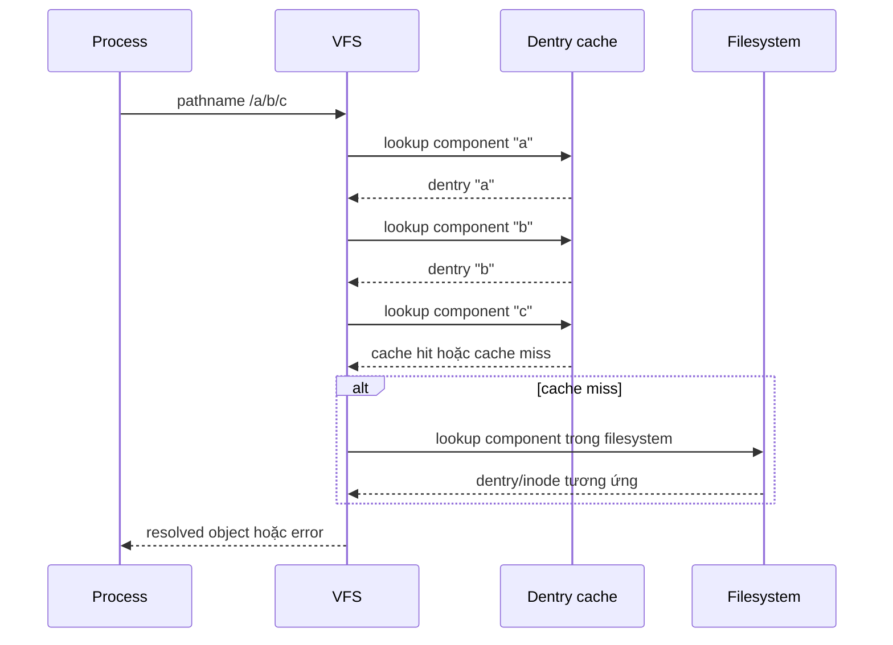

# Chủ đề 2 — Hệ thống tệp Linux (Filesystem)

> **Mục tiêu:** hiểu Linux tổ chức và tìm tệp như thế nào: từ cây `/`, đường dẫn, thư mục, `inode`, `dentry`, quyền truy cập, mount cho tới `/dev`, `/proc`, `/sys`.
>
> **Quy ước ngôn ngữ:** phần giải thích dùng Tiếng Việt. Các tên/thuật ngữ chuẩn như `filesystem`, `VFS`, `pathname`, `pathname resolution`, `dentry`, `inode`, `symbolic link`, `hard link`, `mount point`, `device node`, `procfs`, `sysfs`, `devtmpfs`, cùng tên API và lệnh được giữ bằng tiếng Anh khi việc dịch có thể làm lệch nghĩa.
>
> **Phạm vi:** cây không gian tên, FHS, pathname, phân giải đường dẫn, `VFS`, `dentry`, `inode`, block, các loại tệp, siêu dữ liệu, quyền `r/w/x`, `chmod`, `chown`, `umask`, mount, `/dev`, `/proc`, `/sys`, `df`, `du`.
>
> Chương này chỉ có **lý thuyết**, không có bài thực hành.

Cách dễ nhất để học filesystem Linux là tách hai câu hỏi: **một tên tệp được tìm thấy như thế nào trong cây thư mục**, và **đối tượng mà tên đó trỏ tới được filesystem lưu giữ ra sao**. Pathname, directory và mount thuộc nhiều về không gian tên; còn `inode`, block và metadata mô tả đối tượng phía dưới. `VFS` là lớp giúp Linux nối hai góc nhìn này lại với nhau.

Chương này vì thế đi theo đúng đường mà hệ thống đi khi một chương trình truy cập tệp: từ cây `/` và pathname, qua `dentry`/`inode`, tới quyền truy cập và mount, rồi cuối cùng là các filesystem đặc biệt như `/dev`, `/proc` và `/sys`.

**Cách đọc nếu bạn mới bắt đầu.** Trước hết hãy đọc phần **Nói đơn giản** ở đầu mỗi mục lớn để nắm câu hỏi mà mục đó đang giải quyết. Sau đó xem sơ đồ và ví dụ để hình thành mô hình trong đầu; chưa cần nhớ mọi cờ, mã lỗi hay trường hợp đặc biệt. Khi ý chính đã rõ, hãy đọc các mục `###` theo thứ tự và quay lại phần giải thích trước đó nếu gặp một thuật ngữ chưa quen.

---

## Mục lục

- [1. Hệ thống tệp trong Linux thực chất là gì?](#1-hệ-thống-tệp-trong-linux-thực-chất-là-gì)
- [2. Cây thư mục bắt đầu từ `/`](#2-cây-thư-mục-bắt-đầu-từ-)
- [3. Đường dẫn và cách Linux kernel tìm một tệp](#3-đường-dẫn-và-cách-linux-kernel-tìm-một-tệp)
- [4. VFS, `dentry` và `inode`](#4-vfs-dentry-và-inode)
- [5. Block, kích thước tệp và dung lượng thật](#5-block-kích-thước-tệp-và-dung-lượng-thật)
- [6. Các loại tệp trong Linux](#6-các-loại-tệp-trong-linux)
- [7. Metadata và `stat`](#7-metadata-và-stat)
- [8. Chủ sở hữu, nhóm và quyền `r/w/x`](#8-chủ-sở-hữu-nhóm-và-quyền-rwx)
- [9. `chmod`, `chown` và `umask`](#9-chmod-chown-và-umask)
- [10. `mount`: ghép nhiều filesystem vào một cây](#10-mount-ghép-nhiều-filesystem-vào-một-cây)
- [11. `/dev`, `/proc`, `/sys`: những hệ thống tệp đặc biệt](#11-dev-proc-sys-những-hệ-thống-tệp-đặc-biệt)
- [12. `ls`, `stat`, `file`, `df`, `du` quan sát lớp nào?](#12-ls-stat-file-df-du-quan-sát-lớp-nào)
- [13. Vòng đời tên tệp, liên kết và tệp đang mở](#13-vòng-đời-tên-tệp-liên-kết-và-tệp-đang-mở)
- [14. Tư duy gỡ lỗi hệ thống tệp](#14-tư-duy-gỡ-lỗi-hệ-thống-tệp)
- [15. Liên hệ với Embedded Linux](#15-liên-hệ-với-embedded-linux)
- [16. Tổng kết](#16-tổng-kết)
- [17. Tài liệu tham khảo](#17-tài-liệu-tham-khảo)

---

## 1. Hệ thống tệp trong Linux thực chất là gì?

> **Nói đơn giản:** Hệ thống tệp là cách Linux tổ chức tên, thư mục, dữ liệu và siêu dữ liệu thành một cây mà chương trình có thể truy cập bằng pathname.

### 1.1 Hai lớp dễ bị trộn lẫn

Có hai câu hỏi khác nhau:

```text
1. Tệp có tên/pathname nào trong cây thư mục?
2. Dữ liệu/metadata của tệp được lưu ra sao trong filesystem cụ thể?
```

Ví dụ:

```text
/home/user/a.txt
```

là một **đường dẫn trong không gian tên**.

Còn việc dữ liệu và metadata của tệp được lưu trên `ext4`, `F2FS`, `SquashFS` hay `tmpfs` là câu chuyện của filesystem cụ thể bên dưới.

### 1.2 Linux cho nhiều filesystem cùng xuất hiện trong một cây

Một hệ Linux có thể có:

```text
/             -> ext4
/proc         -> procfs
/sys          -> sysfs
/dev          -> devtmpfs
/run          -> tmpfs
/mnt/data     -> filesystem khác
```

Người dùng vẫn nhìn thấy **một cây duy nhất bắt đầu từ `/`**.

### 1.3 Không nên hiểu quá máy móc câu “everything is a file”

Linux cung cấp nhiều tài nguyên qua giao diện giống tệp:

```text
tệp thông thường
directory
device node
FIFO
socket pathname
mục trong procfs/sysfs
```

Nhưng chúng không có cùng ngữ nghĩa.

Ví dụ:

```text
read() trên tệp thông thường
read() trên thiết bị UART
read() trên một mục `/proc`
```

có thể rất khác nhau.

---

## 2. Cây thư mục bắt đầu từ `/`

> **Nói đơn giản:** Linux ghép mọi thứ vào một cây duy nhất bắt đầu từ `/`. Bạn không nhìn từng ổ đĩa như các cây tách biệt; chúng được gắn vào các vị trí trong cây này.

### 2.1 `/` là gốc của namespace

`/` là điểm bắt đầu của việc phân giải đường dẫn tuyệt đối.

```text
/
├── bin
├── dev
├── etc
├── home
├── proc
├── run
├── sys
├── tmp
├── usr
└── var
```

Điểm quan trọng:

> `/` là gốc của không gian tên mà tiến trình nhìn thấy; nó không đồng nghĩa cố định với “partition root vật lý”.

Mount không gian tên, `chroot`, container và boot configuration có thể thay đổi cách tiến trình nhìn cây này.

### 2.2 Ý nghĩa khái quát của một số thư mục

#### `/etc`

Chứa cấu hình hệ thống/dịch vụ mang tính cục bộ cho máy.

Trong hệ nhúng có thể gặp các nhóm như cấu hình mạng, cấu hình service và cấu hình khởi động.

#### `/usr`

Chứa phần lớn chương trình, thư viện và dữ liệu dùng chung của không gian người dùng.

#### `/var`

Chứa dữ liệu có tính thay đổi trong quá trình vận hành: `log`, `cache`, trạng thái và `spool`.

Trong Embedded Linux, cách ghi `/var` liên quan trực tiếp đến tuổi thọ flash và thiết kế rootfs chỉ đọc.

#### `/tmp`

Dữ liệu tạm thời; chính sách tồn tại phụ thuộc hệ thống.

#### `/run`

Trạng thái runtime từ lúc boot hiện tại, thường nằm trên `tmpfs`.

#### `/dev`, `/proc`, `/sys`

Đây không phải ba thư mục “chứa file bình thường”. Chúng là các giao diện quan trọng nối không gian người dùng với Linux kernel và mô hình thiết bị.

### 2.3 FHS là quy ước, không phải định luật vật lý

`Filesystem Hierarchy Standard` giúp hệ Linux có cấu trúc nhất quán, nhưng một rootfs nhúng tối giản có thể bỏ nhiều thư mục/chương trình không cần thiết.

---

## 3. Đường dẫn và cách Linux kernel tìm một tệp

> **Nói đơn giản:** Khi nhận một pathname, Linux kernel đi qua từng thành phần thư mục để tìm đối tượng cuối cùng. Vì vậy quyền truy cập ở các thư mục trung gian cũng rất quan trọng.

### 3.1 Tên tệp, thành phần đường dẫn và đường dẫn

Ví dụ:

```text
/home/user/docs/report.txt
```

Các thành phần: `home`, `user`, docs và `report.txt`.

Mỗi thành phần phải được tra cứu trong thư mục tương ứng.

### 3.2 Đường dẫn tuyệt đối

Bắt đầu bằng `/`:

```text
/etc/passwd
```

Tra cứu bắt đầu từ root của không gian tên.

### 3.3 Đường dẫn tương đối

Không bắt đầu bằng `/`:

```text
src/main.c
```

Tra cứu bắt đầu từ thư mục làm việc hiện tại của tiến trình.

### 3.4 `.` và `..`

```text
.   -> vị trí hiện tại
..  -> thư mục cha theo namespace hiện tại
```

### 3.5 `pathname resolution`



Đây là mô hình tư duy. Chi tiết cache và filesystem cụ thể phức tạp hơn.

### 3.6 Mỗi thành phần đều có thể gây lỗi

Ví dụ:

```text
/a/b/c
```

Có thể lỗi vì: a không tồn tại, b không phải directory, thiếu quyền search trên a hoặc b, symlink loop, mount trạng thái thay đổi và c không tồn tại.

### 3.7 `symbolic link` làm thay đổi đường tra cứu

Một symbolic link chứa một pathname khác.

```text
name -> ../target/file
```

Khi theo liên kết, Linux kernel tiếp tục phân giải pathname mục tiêu theo quy tắc tương ứng.

---

## 4. VFS, `dentry` và `inode`

> **Nói đơn giản:** VFS là lớp chung để Linux làm việc với nhiều loại filesystem. Dentry giúp ánh xạ tên, còn inode giữ siêu dữ liệu của đối tượng trong filesystem.

### 4.1 VFS là gì?

`VFS` là lớp trừu tượng trong Linux kernel cho phép cùng các API như `open`, `read`, `write`, `stat` và `mount` làm việc với nhiều filesystem khác nhau.

```text
Ứng dụng
   |
   v
system call / VFS
   |
   +--> ext4
   +--> tmpfs
   +--> procfs
   +--> sysfs
   +--> ...
```

### 4.2 `dentry` là gì?

`dentry` là đối tượng VFS đại diện cho **mối quan hệ tên trong một thư mục**.

Mô hình đơn giản:

```text
parent directory + name
          |
          v
        dentry
          |
          v
        inode
```

Dentry cache giúp tăng tốc pathname lookup.

`dentry` là đối tượng trong RAM; không nên đồng nhất nó với định dạng `directory entry` trên đĩa của một filesystem cụ thể.

### 4.3 `inode` là gì?

`inode` đại diện cho đối tượng tệp ở lớp filesystem/VFS.

Nó gắn với siêu dữ liệu như:

```text
file type
mode/permissions
UID/GID
size
timestamps
link count
ánh xạ tới dữ liệu
```

### 4.4 `inode` không chứa pathname đầy đủ

Đây là điểm cực kỳ quan trọng.

`Tên/pathname`: thuộc namespace/directory entry; `Inode`: thuộc đối tượng/metadata.

Một inode có thể có nhiều tên thông qua hard link.

### 4.5 `inode number` không phải ID toàn hệ thống

`inode number` có ý nghĩa trong ngữ cảnh filesystem cụ thể.

Hai filesystem khác nhau có thể có inode cùng số.

### 4.6 Quan hệ tổng thể

```text
pathname
   |
   v
pathname component lookup
   |
   v
dentry
   |
   v
inode
   |
   +--> metadata
   +--> data mapping
```

---

## 5. Block, kích thước tệp và dung lượng thật

> **Nói đơn giản:** Kích thước logic của tệp và dung lượng thật trên thiết bị lưu trữ có thể khác nhau. Dữ liệu được quản lý theo các khối nên không phải lúc nào số byte của tệp cũng bằng số byte đã cấp phát.

### 5.1 `logical size`

Kích thước logic là số byte mà tệp biểu diễn trong không gian tên/API.

Ví dụ một tệp có:

```text
size = 1000 bytes
```

### 5.2 Dung lượng được cấp phát có thể khác

Filesystem thường quản lý dữ liệu theo đơn vị block.

Một tệp logic 1000 byte có thể cần nhiều dung lượng vật lý hơn do: block allocation, metadata, alignment và filesystem overhead.

Ngược lại, sparse file có thể có logical size rất lớn nhưng chỉ cấp phát ít block.

### 5.3 `st_size`, `st_blocks`, `st_blksize`

Về mặt khái niệm:

`st_size`: kích thước logic của tệp; `st_blocks`: số block lưu trữ đã cấp phát theo đơn vị API quy định; `st_blksize`: kích thước block ưu tiên cho I/O, không nhất thiết là allocation block của filesystem.

Không nên đồng nhất ba khái niệm này.

---

## 6. Các loại tệp trong Linux

> **Nói đơn giản:** Trong Linux, 'file' không chỉ là tệp văn bản. `directory`, symbolic link, `device node` (device node), socket và nhiều đối tượng khác cũng xuất hiện trong cùng không gian tên.

### 6.1 `regular file`

Tệp dữ liệu thông thường: `text`, `binary`, executable, `image` và `database`.

Extension không quyết định loại tệp ở mức inode.

### 6.2 `directory`

`directory` là đối tượng tổ chức không gian tên: nó ánh xạ tên sang đối tượng filesystem.

`directory` không nên được xem như “một file text chứa danh sách tên”.

### 6.3 `symbolic link`

`symbolic link` chứa pathname mục tiêu.

```text
symlink -> target pathname
```

Mục tiêu có thể: tồn tại, không tồn tại, là đường dẫn tương đối và là đường dẫn tuyệt đối.

### 6.4 `character device`

Đại diện cho thiết bị/giao diện dòng byte hoặc ký tự, ví dụ nhiều thiết bị serial.

### 6.5 `block device`

Đại diện cho thiết bị truy cập theo block, thường liên quan lưu trữ.

### 6.6 `major` và `minor`

`device node` mang cặp số major/minor để giúp Linux kernel liên hệ node đó với lớp driver và thiết bị tương ứng.

Có `device node` (device node) **không chứng minh** phần cứng chắc chắn đang hoạt động.

### 6.7 FIFO

FIFO là pipe có tên trong filesystem.

Dữ liệu không được lưu như tệp thông thường; pathname chủ yếu là điểm gặp nhau giữa các tiến trình.

### 6.8 Unix-domain socket pathname

`Unix Domain Socket` có thể dùng pathname làm địa chỉ cục bộ.

`pathname` đóng vai trò điểm hẹn (`rendezvous`), không phải tệp chứa payload của socket.

---

## 7. Metadata và `stat`

> **Nói đơn giản:** Siêu dữ liệu là thông tin mô tả tệp như loại, quyền, chủ sở hữu, kích thước, inode và các mốc thời gian. `stat` cho phép xem các thông tin này rõ ràng hơn.

### 7.1 Metadata là gì?

Siêu dữ liệu là thông tin mô tả đối tượng, ví dụ:

```text
type
mode
UID/GID
size
inode number
link count
timestamps
```

### 7.2 `stat`, `lstat`, `fstat`

Mô hình:

`stat(path)`: lấy metadata của đối tượng đích sau khi theo symbolic link; `lstat(path)`: lấy metadata của chính symbolic link ở thành phần cuối; `fstat(fd)`: lấy metadata qua `file descriptor` đã mở.

### 7.3 `mtime`, `ctime`, `atime`

**mtime**: thời điểm nội dung tệp được sửa gần nhất; **ctime**: thời điểm trạng thái/metadata inode thay đổi gần nhất; **atime**: thời điểm truy cập gần nhất theo mount/filesystem policy.

`ctime` **không phải** “creation time”.

### 7.4 Metadata có thể thay đổi đồng thời

Giữa lúc một chương trình đọc nhiều trường, tiến trình khác có thể thay đổi đối tượng.

Do đó siêu dữ liệu là ảnh chụp của trạng thái tại những thời điểm cụ thể, không phải giao dịch bất biến mặc định.

---

## 8. Chủ sở hữu, nhóm và quyền `r/w/x`

> **Nói đơn giản:** Quyền truy cập được chia cho ba lớp `user` (owner), `group` và `others`. Ba bit `r/w/x` có ý nghĩa khác nhau một chút giữa tệp thông thường và directory.

### 8.1 UID và GID

Filesystem lưu chủ sở hữu bằng các ID dạng số: `UID` và `GID`.

Tên người dùng/nhóm là cách không gian người dùng ánh xạ ID sang tên dễ đọc.

### 8.2 Ba lớp quyền cơ bản

Ba lớp là: **`user` (owner)**, **`group`** và **`others`**.

Mỗi lớp có thể có:

```text
r  read
w  write
x  execute/search
```

### 8.3 Với tệp thông thường

```text
r -> đọc nội dung
w -> sửa nội dung
x -> có quyền thực thi theo permission bits
```

Có `x` không đảm bảo tệp thực sự chạy được; định dạng executable, interpreter, mount option và loader còn tham gia.

### 8.4 Với directory

Ý nghĩa khác:

```text
r -> đọc danh sách tên trong thư mục
w -> sửa các directory entry của thư mục
x -> search / traverse qua thư mục
```

`x` trên directory rất quan trọng cho pathname lookup.

### 8.5 Quyền trên tệp chưa đủ để truy cập pathname

Muốn mở:

```text
/a/b/file
```

tiến trình cần quyền traverse/search phù hợp trên các thư mục cha.

---

## 9. `chmod`, `chown` và `umask`

> **Nói đơn giản:** `chmod` đổi permission bits, `chown` đổi owner/group, còn `umask` loại bớt quyền khi tạo đối tượng mới. Ba công cụ này giải quyết ba việc khác nhau.

### 9.1 `chmod`

`chmod` thay đổi các `mode`/`permission bits`.

Có hai cách biểu diễn phổ biến:

Dạng `symbolic`: `u+rwx,g+rx,o-r`; dạng `octal`: `755`, `644`.

### 9.2 `chown`

`chown` thay đổi chủ sở hữu/nhóm theo quyền được phép.

Đây là thao tác lên siêu dữ liệu, không phải nội dung tệp.

### 9.3 `umask`

`umask` là mặt nạ loại bỏ một số bit quyền khi tạo đối tượng mới.

Mô hình cơ bản:

```text
quyền yêu cầu
    &
~umask
    |
    v
quyền ban đầu
```

Trong thực tế ACL và policy khác có thể ảnh hưởng kết quả.

### 9.4 `umask` không “thêm quyền”

Nó chỉ loại bỏ bit từ quyền được yêu cầu.

Nếu chương trình không yêu cầu bit execute thì `umask` không tự thêm execute.

---

## 10. `mount`: ghép nhiều filesystem vào một cây

> **Nói đơn giản:** `mount` không sao chép dữ liệu. Nó làm cho một filesystem xuất hiện tại một directory trong cây `/`.

### 10.1 Trước `mount`

```text
/mnt/data
   |
   v
các entry vốn có trong filesystem hiện tại
```

### 10.2 Sau `mount`

```text
filesystem B root
      |
      v
/mnt/data
```

Các `directory entry` cũ bên dưới `mount point` bị che khuất trong lúc filesystem mới đang được gắn, nhưng không bị xóa.

### 10.3 `block device`, partition, filesystem và mount point là bốn khái niệm khác nhau

```text
block device
   |
partition
   |
filesystem format
   |
mount
   |
mount point trong namespace
```

Không phải mọi filesystem đều nằm trên block device; `tmpfs`, `procfs`, `sysfs` là ví dụ quan trọng.

### 10.4 `unmount`

`unmount` tháo liên kết giữa filesystem và mount point.

Nó có thể thất bại khi tài nguyên vẫn đang được sử dụng, tùy loại tham chiếu và điều kiện của hệ thống.

---

## 11. `/dev`, `/proc`, `/sys`: những hệ thống tệp đặc biệt

> **Nói đơn giản:** `/dev`, `/proc`, `/sys` trông như thư mục bình thường nhưng nhiều nội dung trong đó được Linux kernel tạo động để biểu diễn thiết bị, tiến trình và trạng thái hệ thống.

### 11.1 `/dev`

`/dev` thường chứa `device node` (device node) và các đối tượng thiết bị dành cho không gian người dùng.

Trên Linux hiện đại, `devtmpfs` có thể được Linux kernel dùng để cung cấp nền tảng node thiết bị; `udev` hoặc `mdev` có thể bổ sung policy/tên/quyền.

### 11.2 `/proc`

`procfs` xuất thông tin runtime về:

```text
processes
trạng thái của Linux kernel
mounts
memory
system settings/interfaces nhất định
```

Nội dung thường được tạo động khi đọc.

### 11.3 `/sys`

`sysfs` biểu diễn mô hình thiết bị và nhiều đối tượng Linux kernel theo dạng cây.

Nó rất quan trọng với Embedded Linux vì giúp quan sát: devices, drivers, buses, classes và firmware-related objects.

### 11.4 Đây là giao diện, không phải dữ liệu “nằm sẵn trên đĩa”

```text
read /proc/... hoặc /sys/...
        |
        v
Linux kernel tạo/trả dữ liệu theo giao diện
```

---

## 12. `ls`, `stat`, `file`, `df`, `du` quan sát lớp nào?

> **Nói đơn giản:** Mỗi lệnh quan sát một lớp khác nhau: `ls` nhìn directory entry, `stat` nhìn siêu dữ liệu, `file` đoán loại nội dung, `df` nhìn filesystem, `du` nhìn dung lượng theo cây thư mục.

### 12.1 `ls`

Tập trung vào directory entry và siêu dữ liệu hiển thị.

### 12.2 `stat`

Cho cái nhìn chi tiết hơn về siêu dữ liệu của đối tượng/path.

### 12.3 `file`

`file` phân tích nội dung/magic để suy đoán định dạng dữ liệu.

Nó không quyết định inode file type dựa vào extension.

### 12.4 `df`

Quan sát accounting ở mức filesystem: tổng dung lượng, đã dùng và còn sẵn.

### 12.5 `du`

Duyệt cây pathname và cộng usage của các đối tượng được nhìn thấy.

### 12.6 Vì sao `df` và `du` có thể khác?

Ví dụ: một tệp đã bị `unlink()` nhưng vẫn đang mở bởi tiến trình.

Filesystem vẫn giữ block cho file đó, nên `df` vẫn tính dung lượng; `du` không còn thấy pathname để duyệt.

---

## 13. Vòng đời tên tệp, liên kết và tệp đang mở

> **Nói đơn giản:** Tên tệp và dữ liệu không phải cùng một thứ. Xóa một tên không nhất thiết làm dữ liệu biến mất ngay nếu vẫn còn hard link hoặc tiến trình đang giữ tệp mở.

### 13.1 Tên và đối tượng là hai thứ khác nhau

```text
pathname -> directory entry -> inode/object
```

Xóa pathname không nhất thiết xóa đối tượng ngay.

### 13.2 `hard link`

Nhiều directory entry có thể cùng tham chiếu một inode.

```text
name A ----+
           +--> inode X
name B ----+
```

Link count phản ánh số hard link theo ngữ nghĩa của filesystem.

### 13.3 Unlink

`unlink()` loại bỏ một tên khỏi không gian tên.

Đối tượng thực sự được thu hồi khi không còn các điều kiện giữ nó tồn tại, ví dụ không còn hard link và không còn tham chiếu đang mở phù hợp.

### 13.4 Tệp đang mở vẫn có thể tồn tại sau khi mất tên

```text
process fd ---> open file description / kernel object
                  ^
                  |
pathname đã unlink
```

Đây là mô hình quan trọng cho log rotation, temporary file và sự khác nhau giữa `df`/`du`.

---

## 14. Tư duy gỡ lỗi hệ thống tệp

> **Nói đơn giản:** Khi lỗi filesystem, hãy tách câu hỏi: pathname có đúng không, mount có đúng không, quyền có đủ không, filesystem có đầy không và đối tượng thực sự là loại gì.

### 14.1 “No such file”

Đừng chỉ kiểm tra tệp cuối.

Hãy nghĩ theo chuỗi:

```text
root/cwd đúng?
   |
component cha tồn tại?
   |
quyền traverse?
   |
symlink hợp lệ?
   |
mount đúng?
   |
đối tượng đích cuối cùng có tồn tại?
```

### 14.2 “Permission denied”

Có thể do:

```text
mode bits
ownership
quyền x trên directory prefix
read-only mount
ACL/security policy
credential của tiến trình
```

### 14.3 `device node` tồn tại nhưng thiết bị không chạy

Kiểm tra theo lớp:

```text
node đúng major/minor?
   |
driver đã bind?
   |
hardware có được phát hiện?
   |
clock / pinctrl / power / Device Tree đúng?
```

Node chỉ là một phần của toàn bộ đường đi.

### 14.4 Mount point trống hoặc “mất dữ liệu”

Có thể filesystem mới đang che các entry cũ của mount point.

`unmount` có thể làm chúng xuất hiện lại.

---

## 15. Liên hệ với Embedded Linux

> **Nói đơn giản:** Embedded Linux dùng filesystem để chứa rootfs, cấu hình, `device node` (device node) và các giao diện `/proc`/`/sys`; vì vậy hiểu cây tệp là nền tảng cho gần như mọi bước debug.

### 15.1 Rootfs tối giản

Embedded Linux thường có rootfs nhỏ hơn desktop:

```text
BusyBox
/lib
/etc
/dev
/proc
/sys
/tmp
```

Tuy nhỏ, các quy tắc về pathname, inode, permissions và mount vẫn giữ nguyên.

### 15.2 Read-only rootfs

Sản phẩm nhúng có thể dùng `SquashFS`, filesystem ext chỉ đọc hoặc image đã được xác minh, rồi tách dữ liệu cần ghi sang một vùng lưu trữ riêng:

```text
/data
/var
/tmpfs
phân vùng lưu bền vững riêng
```

### 15.3 `/dev`, `/proc`, `/sys` là ba cửa sổ quan trọng khi bring-up

Chúng giúp trả lời các câu hỏi: Linux kernel đã nhận ra thiết bị chưa? Driver đã bind chưa? Tiến trình đang ở trạng thái nào? Các filesystem đã được mount đúng chưa?

### 15.4 Flash khác ổ cứng desktop

Thiết kế filesystem cần cân nhắc: wear, power loss, read-only partitions, log volume và trạng thái cần lưu bền vững.

Đây là lý do hiểu filesystem quan trọng hơn việc chỉ biết `ls` và `cd`.

---

## 16. Tổng kết

> **Nói đơn giản:** Topic 02 cần để lại một chuỗi tư duy: pathname → directory entry → inode/siêu dữ liệu → filesystem → mount point.

```text
pathname
   |
   v
VFS pathname lookup
   |
   v
dentry
   |
   v
inode
   |
   +--> metadata
   +--> data blocks / backing object
```

Các ý cần nhớ:

1. Linux trình bày nhiều filesystem trong một không gian tên bắt đầu từ `/`.
2. `/` là root của không gian tên, không phải khái niệm đồng nghĩa bắt buộc với một partition vật lý.
3. Pathname được phân giải từng component.
4. `dentry` gắn tên với đối tượng trong VFS; `inode` đại diện siêu dữ liệu/đối tượng.
5. Pathname không nằm trong inode.
6. Một inode có thể có nhiều hard link.
7. `symbolic link` chứa pathname mục tiêu.
8. Kích thước logic và dung lượng đã cấp phát có thể khác nhau.
9. `directory` permission `x` có nghĩa search/traverse.
10. Mount ghép filesystem vào không gian tên; nó không copy dữ liệu.
11. `/proc`, `/sys`, `/dev` là các giao diện đặc biệt của Linux.
12. `df` và `du` quan sát dung lượng theo hai mô hình khác nhau.
13. Unlink tên không nhất thiết làm đối tượng đang mở biến mất ngay.

---

## 17. Tài liệu tham khảo

> **Nói đơn giản:** Phần này liệt kê nguồn chuẩn để tra cứu chi tiết về filesystem, quyền truy cập và mount.

- Filesystem Hierarchy Standard: https://refspecs.linuxfoundation.org/FHS_3.0/fhs/index.html
- Linux VFS documentation: https://docs.kernel.org/filesystems/vfs.html
- Linux pathname lookup documentation: https://docs.kernel.org/filesystems/path-lookup.html
- `path_resolution(7)`: https://man7.org/linux/man-pages/man7/path_resolution.7.html
- `inode(7)`: https://man7.org/linux/man-pages/man7/inode.7.html
- `stat(2)`: https://man7.org/linux/man-pages/man2/stat.2.html
- `chmod(2)`: https://man7.org/linux/man-pages/man2/chmod.2.html
- `chown(2)`: https://man7.org/linux/man-pages/man2/chown.2.html
- `umask(2)`: https://man7.org/linux/man-pages/man2/umask.2.html
- `mount(8)`: https://man7.org/linux/man-pages/man8/mount.8.html
- Linux procfs documentation: https://docs.kernel.org/filesystems/proc.html
- Linux sysfs documentation: https://docs.kernel.org/filesystems/sysfs.html
- Bootlin Embedded Linux training: https://bootlin.com/training/embedded-linux/

> **Điều hướng:** [← Chủ đề 1 — Dòng lệnh Linux cơ bản](README-topic-01.md) · [Chủ đề 3 — Vào/ra tệp →](README-topic-03.md)
