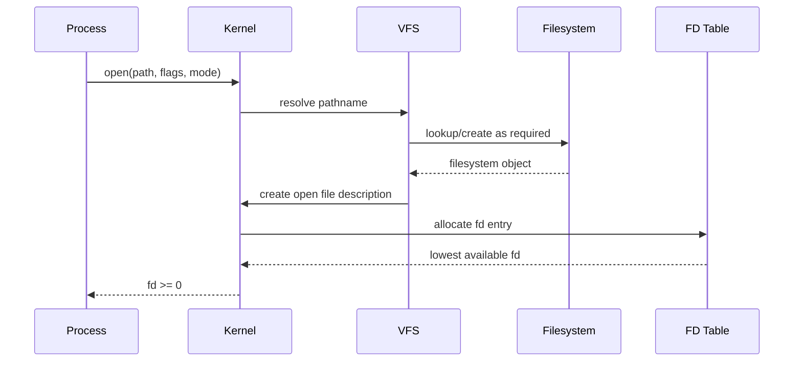
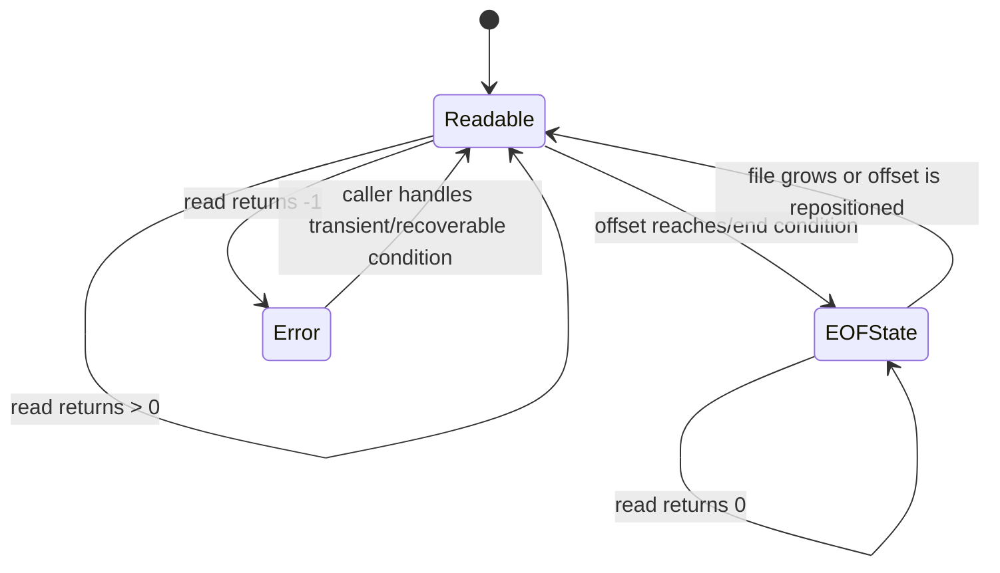
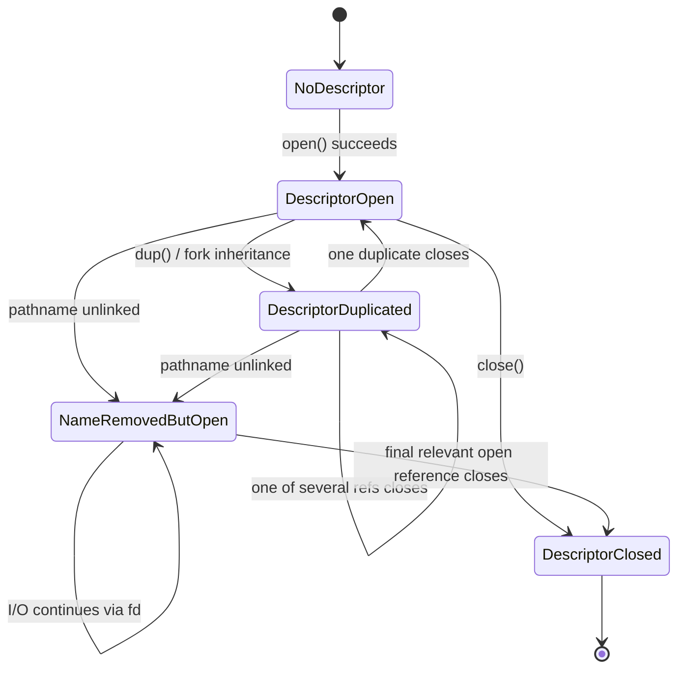
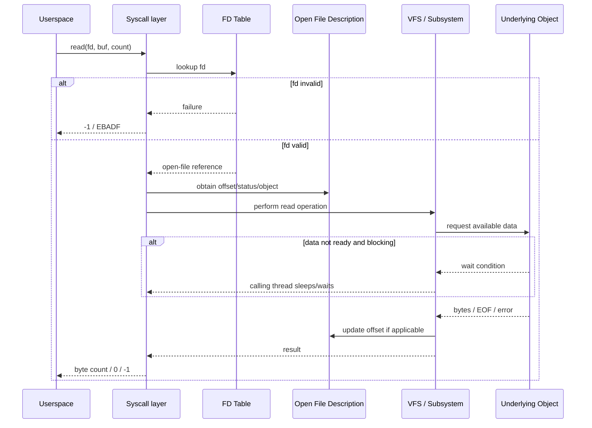

# Chủ đề 3 — File I/O trong Linux

> **Phạm vi:** Linux low-level File I/O fundamentals — nền tảng về file descriptor, open file description, `open()`, `read()`, `write()`, `lseek()`, `close()`, file offset, blocking I/O cơ bản và mô hình lỗi I/O.
>
> Chương này tập trung vào bản chất của low-level I/O trong Linux: vì sao userspace không thao tác trực tiếp với inode hay driver object mà thông qua **file descriptor**, điều gì thực sự được tạo ra khi `open()` thành công, file offset nằm ở đâu, vì sao hai file descriptor có thể chia sẻ cùng offset, `read()` và `write()` thực sự hứa hẹn điều gì, vì sao short read/short write không nhất thiết là lỗi, `lseek()` làm thay đổi vị trí nào, tại sao pipe/socket/terminal không seek được như regular file, `close()` đóng cái gì, và blocking/nonblocking I/O cần được hiểu như thế nào.
>
> Mục tiêu của chương **không phải học thuộc prototype hay viết chương trình mẫu**. Mục tiêu là hình thành mental model đúng:
>
> `pathname → open() → fd table → open file description → filesystem/device object → I/O operation`
>
> cùng với:
>
> `read/write ↔ file offset ↔ blocking state ↔ return value ↔ errno`
>
> Mental model này sẽ được dùng lại ở Process, Signal, IPC, Socket, Device Driver, `ioctl`, `select/poll/epoll`, daemon/service, board bring-up và debugging.
>
> **Giới hạn chủ đề:** chương này chưa đi sâu vào buffered C `stdio`, `mmap`, asynchronous I/O, `io_uring`, `select/poll/epoll`, file locking, direct I/O, page cache internals, filesystem writeback, block layer hay driver implementation. Các phần này chỉ được nhắc khi cần để giữ mental model chính xác.
>
> **Điều hướng:** [← Chủ đề 2 — Linux File System](README-topic-02.md) · [Chủ đề 4 →](README-topic-04.md)

---

## Mục lục

- [1. File I/O trong Linux thực chất là gì?](#1-file-io-trong-linux-thực-chất-là-gì)
- [2. “File” trong File I/O rộng hơn regular file](#2-file-trong-file-io-rộng-hơn-regular-file)
- [3. Pathname và file descriptor thuộc hai giai đoạn khác nhau](#3-pathname-và-file-descriptor-thuộc-hai-giai-đoạn-khác-nhau)
- [4. File descriptor là gì?](#4-file-descriptor-là-gì)
- [5. File-descriptor table của process](#5-file-descriptor-table-của-process)
- [6. Open file description là object trung gian quan trọng](#6-open-file-description-là-object-trung-gian-quan-trọng)
- [7. Quan hệ giữa pathname, dentry, inode, open file description và fd](#7-quan-hệ-giữa-pathname-dentry-inode-open-file-description-và-fd)
- [8. `open()` thực sự làm gì?](#8-open-thực-sự-làm-gì)
- [9. Access mode: `O_RDONLY`, `O_WRONLY`, `O_RDWR`](#9-access-mode-o_rdonly-o_wronly-o_rdwr)
- [10. Creation flags và file-status flags](#10-creation-flags-và-file-status-flags)
- [11. `O_CREAT`, `mode` và `umask`](#11-o_creat-mode-và-umask)
- [12. `O_TRUNC`: mở file và làm thay đổi dữ liệu](#12-o_trunc-mở-file-và-làm-thay-đổi-dữ-liệu)
- [13. `O_APPEND`: append là semantic của open file description](#13-o_append-append-là-semantic-của-open-file-description)
- [14. `O_CLOEXEC` và vòng đời fd qua `exec`](#14-o_cloexec-và-vòng-đời-fd-qua-exec)
- [15. `openat()` và directory-relative I/O](#15-openat-và-directory-relative-io)
- [16. `read()` — yêu cầu đọc “up to count bytes”](#16-read--yêu-cầu-đọc-up-to-count-bytes)
- [17. Short read không nhất thiết là lỗi](#17-short-read-không-nhất-thiết-là-lỗi)
- [18. EOF khác error như thế nào?](#18-eof-khác-error-như-thế-nào)
- [19. `write()` — yêu cầu ghi byte vào object](#19-write--yêu-cầu-ghi-byte-vào-object)
- [20. Short write và vì sao một lần `write()` chưa chắc ghi hết](#20-short-write-và-vì-sao-một-lần-write-chưa-chắc-ghi-hết)
- [21. `write()` thành công không đồng nghĩa dữ liệu đã bền vững trên storage](#21-write-thành-công-không-đồng-nghĩa-dữ-liệu-đã-bền-vững-trên-storage)
- [22. File offset nằm ở đâu?](#22-file-offset-nằm-ở-đâu)
- [23. `lseek()` thay đổi file offset chứ không đọc/ghi dữ liệu](#23-lseek-thay-đổi-file-offset-chứ-không-đọcghi-dữ-liệu)
- [24. `SEEK_SET`, `SEEK_CUR`, `SEEK_END`](#24-seek_set-seek_cur-seek_end)
- [25. Seek vượt EOF và sparse-file hole](#25-seek-vượt-eof-và-sparse-file-hole)
- [26. Seekable và non-seekable objects](#26-seekable-và-non-seekable-objects)
- [27. Vì sao nhiều fd có thể chia sẻ cùng file offset?](#27-vì-sao-nhiều-fd-có-thể-chia-sẻ-cùng-file-offset)
- [28. `dup()` và `fork()` dưới góc nhìn open file description](#28-dup-và-fork-dưới-góc-nhìn-open-file-description)
- [29. Nhiều lần `open()` cùng pathname không nhất thiết chia sẻ offset](#29-nhiều-lần-open-cùng-pathname-không-nhất-thiết-chia-sẻ-offset)
- [30. `pread()` / `pwrite()` và I/O không phụ thuộc shared file offset](#30-pread--pwrite-và-io-không-phụ-thuộc-shared-file-offset)
- [31. `close()` thực sự đóng cái gì?](#31-close-thực-sự-đóng-cái-gì)
- [32. File descriptor number có thể được tái sử dụng](#32-file-descriptor-number-có-thể-được-tái-sử-dụng)
- [33. Unlink pathname không đồng nghĩa đóng open file](#33-unlink-pathname-không-đồng-nghĩa-đóng-open-file)
- [34. Vòng đời fd và open file description](#34-vòng-đời-fd-và-open-file-description)
- [35. Standard input/output/error cũng chỉ là file descriptors](#35-standard-inputoutputerror-cũng-chỉ-là-file-descriptors)
- [36. File descriptor và C `FILE *` stream khác nhau như thế nào?](#36-file-descriptor-và-c-file--stream-khác-nhau-như-thế-nào)
- [37. Buffering của `stdio` không phải semantics của `read/write`](#37-buffering-của-stdio-không-phải-semantics-của-readwrite)
- [38. Blocking I/O thực chất là gì?](#38-blocking-io-thực-chất-là-gì)
- [39. Blocking phụ thuộc loại object và trạng thái hiện tại](#39-blocking-phụ-thuộc-loại-object-và-trạng-thái-hiện-tại)
- [40. `O_NONBLOCK` và `EAGAIN`](#40-o_nonblock-và-eagain)
- [41. Regular file và `O_NONBLOCK`: một nuance quan trọng](#41-regular-file-và-o_nonblock-một-nuance-quan-trọng)
- [42. `read()` trên terminal, pipe, FIFO và device có semantics khác regular file](#42-read-trên-terminal-pipe-fifo-và-device-có-semantics-khác-regular-file)
- [43. Return value: dữ liệu điều khiển quan trọng của I/O](#43-return-value-dữ-liệu-điều-khiển-quan-trọng-của-io)
- [44. `size_t`, `ssize_t` và `off_t`](#44-size_t-ssize_t-và-off_t)
- [45. `errno` và error model của system call](#45-errno-và-error-model-của-system-call)
- [46. `EBADF`: lỗi ở tầng descriptor](#46-ebadf-lỗi-ở-tầng-descriptor)
- [47. `EINTR`: I/O bị ngắt bởi signal](#47-eintr-io-bị-ngắt-bởi-signal)
- [48. `EAGAIN` / `EWOULDBLOCK`: “chưa sẵn sàng” khác failure vĩnh viễn](#48-eagain--ewouldblock-chưa-sẵn-sàng-khác-failure-vĩnh-viễn)
- [49. `EPIPE` và write khi không còn reader](#49-epipe-và-write-khi-không-còn-reader)
- [50. VFS nối system call với filesystem hoặc driver như thế nào?](#50-vfs-nối-system-call-với-filesystem-hoặc-driver-như-thế-nào)
- [51. `struct file` trong kernel và open file description](#51-struct-file-trong-kernel-và-open-file-description)
- [52. I/O path cho regular file và device file khác nhau ở đâu?](#52-io-path-cho-regular-file-và-device-file-khác-nhau-ở-đâu)
- [53. Sequence của `read()` dưới góc nhìn abstraction](#53-sequence-của-read-dưới-góc-nhìn-abstraction)
- [54. Concurrency và shared file offset](#54-concurrency-và-shared-file-offset)
- [55. Atomicity không đồng nghĩa “mọi I/O đều thread-safe theo ý ứng dụng”](#55-atomicity-không-đồng-nghĩa-mọi-io-đều-thread-safe-theo-ý-ứng-dụng)
- [56. Error model và tư duy debug File I/O](#56-error-model-và-tư-duy-debug-file-io)
- [57. Liên hệ với Embedded Linux](#57-liên-hệ-với-embedded-linux)
- [58. Mô hình tư duy tổng hợp](#58-mô-hình-tư-duy-tổng-hợp)
- [59. Các nguyên tắc cốt lõi](#59-các-nguyên-tắc-cốt-lõi)
- [Tài liệu tham khảo](#tài-liệu-tham-khảo)

---

# 1. File I/O trong Linux thực chất là gì?

Ở Topic 2, filesystem được nhìn từ namespace:

```text
pathname
   ↓
VFS lookup
   ↓
dentry
   ↓
inode
   ↓
filesystem object
```

Topic 3 thêm một lớp mới:

> Sau khi userspace đã xác định object bằng pathname, chương trình cần một **handle ổn định** để thực hiện I/O nhiều lần mà không phải resolve pathname lại mỗi lần.

Handle đó là:

```text
file descriptor
```

Mental model:

```text
pathname
   |
   | open()
   v
file descriptor
   |
   +--> read()
   +--> write()
   +--> lseek()
   +--> fstat()
   +--> ioctl()
   +--> ...
   |
   | close()
   v
descriptor released
```

Điểm cốt lõi:

```text
pathname
```

là cách **định danh object qua namespace**,

còn:

```text
file descriptor
```

là cách **tham chiếu một open I/O context** trong process.

Hai khái niệm này không đồng nghĩa.

---

# 2. “File” trong File I/O rộng hơn regular file

Low-level Linux I/O dùng file descriptor cho rất nhiều loại object:

```text
regular file
directory handle trong một số operation
terminal
character device
block device
pipe
FIFO
socket
eventfd
timerfd
signalfd
epoll instance
...
```

Không phải mọi object đều hỗ trợ mọi operation.

Ví dụ:

```text
regular file
  read    yes
  write   tùy access mode/permission
  lseek   thường yes

pipe
  read    yes
  write   yes
  lseek   no

terminal
  read    yes
  write   yes
  lseek   no

device
  semantics tùy driver
```

Do đó:

> **File descriptor là một generic I/O handle, không phải chỉ là “số của file trên disk”.**

Mental model:

```text
                    file descriptor
                          |
          +---------------+----------------+
          |               |                |
          v               v                v
     regular file       device          socket/pipe
          |               |                |
      filesystem        driver           IPC/network
```

---

# 3. Pathname và file descriptor thuộc hai giai đoạn khác nhau

Một pathname như:

```text
/home/hai/data.bin
```

thuộc namespace.

Khi gọi:

```c
open("/home/hai/data.bin", ...);
```

kernel resolve path và tạo I/O context.

Sau khi `open()` thành công:

```text
fd = 3
```

các operation sau dùng `fd`:

```c
read(fd, ...);
write(fd, ...);
lseek(fd, ...);
close(fd);
```

Không cần gửi pathname lại cho mỗi `read()`.

ASCII:

```text
           Namespace phase
                |
pathname -------+
                |
                v
              open()
                |
                v
       Open-I/O-context phase
                |
                v
               fd
         /      |      \
        /       |       \
     read     write     lseek
```

Đây là separation rất quan trọng:

```text
name lookup
    ≠
open I/O state
```

---

# 4. File descriptor là gì?

Linux `open(2)` mô tả file descriptor là một **small nonnegative integer** dùng làm index vào table file descriptors của process.

Ví dụ concept:

```text
0
1
2
3
4
...
```

Một process có thể có:

```text
fd 0 -> terminal stdin
fd 1 -> terminal stdout
fd 2 -> terminal stderr
fd 3 -> regular file
fd 4 -> pipe
fd 5 -> socket
```

Điểm quan trọng:

> Số `3`, `4`, `5` không mang bản chất filesystem.

Chúng chỉ có ý nghĩa trong context của process sở hữu descriptor table.

## 4.1 fd không phải inode number

Tách:

```text
fd
  per-process handle

inode number
  filesystem object identity within filesystem context
```

Một inode có thể được mở nhiều lần và tạo nhiều fd.

Một fd có thể refer object không có persistent inode kiểu regular disk file.

## 4.2 fd không phải pointer userspace

Userspace nhìn fd như `int`.

Kernel dùng integer này để lookup kernel-side entry.

Application không dereference fd như memory pointer.

---

# 5. File-descriptor table của process

Mỗi process có file-descriptor table.

Mental model:

```text
Process
  |
  v
+---------------------------+
| File Descriptor Table     |
+------+--------------------+
| fd 0 | reference ---------+---->
| fd 1 | reference ---------+---->
| fd 2 | reference ---------+---->
| fd 3 | reference ---------+---->
| fd 4 | reference ---------+---->
+------+--------------------+
```

Mỗi slot có thể chứa:

```text
reference tới open file description
file-descriptor flags như FD_CLOEXEC
```

Open file status flags như `O_APPEND`, `O_NONBLOCK` không nên nhầm với per-descriptor flag.

Đây là distinction quan trọng:

```text
per-fd state
      vs
open-file-description state
```

---

# 6. Open file description là object trung gian quan trọng

Đây là một trong những khái niệm quan trọng nhất của Linux I/O.

POSIX dùng thuật ngữ:

```text
open file description
```

Linux kernel developer thường liên hệ nó với kernel `struct file`.

Khi `open()` thành công, một **new open file description** được tạo.

Nó lưu state như:

```text
current file offset
file status flags
reference tới underlying file/object
```

Mental model:

```text
Process fd table
      |
      | fd 3
      v
+----------------------+
| Open File Description|
+----------------------+
| current offset       |
| status flags         |
| object reference     |
+----------+-----------+
           |
           v
     filesystem/device object
```

Điểm cốt lõi:

> **File offset thuộc open file description, không thuộc “integer fd” riêng lẻ và cũng không đơn giản nằm trong inode.**

Điều này giải thích nhiều behavior về:

```text
dup()
fork()
shared offset
O_APPEND
```

---

# 7. Quan hệ giữa pathname, dentry, inode, open file description và fd

Một regular file có thể nhìn qua nhiều layer:

```text
pathname
   |
   v
directory namespace
   |
   v
dentry
   |
   v
inode
   |
   +-------------------------+
                             |
                     open file description
                             |
                      offset / flags
                             |
                             v
                         fd table
                             |
                             v
                            fd
```

Một sơ đồ dễ nhìn hơn:

```text
Userspace process

fd = 3
  |
  v
[FD table entry]
  |
  v
[open file description]
  |       |
  |       +--> file offset
  |       +--> status flags
  |
  v
[kernel/VFS file object]
  |
  v
[inode / device / socket / pipe ...]
```

Pathname cần cho `open()` ban đầu.

Sau đó open file description giữ reference ổn định tới object.

Nếu pathname sau đó bị rename/unlink, fd không tự biến thành invalid chỉ vì name thay đổi.

---

# 8. `open()` thực sự làm gì?

Prototype Linux/POSIX phổ biến:

```c
int open(const char *path, int flags, ...);
```

Ở mức abstraction, `open()` làm nhiều việc:

```text
1. resolve pathname
2. kiểm tra path traversal / access conditions
3. tùy flags, có thể create/truncate object
4. tạo open file description
5. đặt access mode / file status flags
6. khởi tạo file offset
7. tạo fd-table entry trong process
8. return file descriptor
```

Mermaid sequence:



Nếu bất kỳ stage cần thiết nào fail:

```text
return -1
errno = error code
```

---

# 9. Access mode: `O_RDONLY`, `O_WRONLY`, `O_RDWR`

Ba access mode cơ bản:

```text
O_RDONLY
O_WRONLY
O_RDWR
```

Chúng nói open file description được mở với intent:

```text
read-only
write-only
read-write
```

Nuance quan trọng từ Linux `open(2)`:

> Chúng không phải ba bit độc lập để OR tùy ý.

`O_RDONLY | O_WRONLY` không phải cách tạo read-write mode.

`O_RDWR` là access mode riêng.

## 9.1 Access mode khác filesystem permission bits

Tách:

```text
open access mode
    what this open description requests

inode permissions
    what access policy allows
```

Ví dụ concept:

```text
file mode permits read/write
```

nhưng process gọi:

```text
O_RDONLY
```

thì fd đó không được dùng `write()` như read-write fd.

Ngược lại, request `O_RDWR` vẫn có thể fail nếu access policy không cho phép.

---

# 10. Creation flags và file-status flags

Linux `open(2)` phân biệt conceptually:

```text
file creation flags
file status flags
```

Creation flags ảnh hưởng operation của `open()` itself.

Status flags ảnh hưởng I/O behavior sau khi open.

Ví dụ:

```text
creation/context flags:
O_CREAT
O_EXCL
O_TRUNC
O_CLOEXEC
O_DIRECTORY
O_NOFOLLOW
...

status/behavior flags:
O_APPEND
O_NONBLOCK
O_SYNC
...
```

Exact classification theo `open(2)` cần được đọc khi dùng flag cụ thể.

Mental model:

```text
open() time
   |
   +--> "mở/create như thế nào?"
   |
   v
open file description
   |
   +--> "I/O sau đó có semantics nào?"
```

---

# 11. `O_CREAT`, `mode` và `umask`

Khi `O_CREAT` được dùng và file cần tạo mới, argument `mode` cung cấp requested permission bits.

Concept:

```text
requested mode
      |
      v
mode & ~umask
      |
      v
initial permission mode
```

nếu không có default ACL ảnh hưởng semantics.

Điểm quan trọng:

```text
mode
```

được dùng để xác định permission của object mới cho future access,

nhưng access mode của fd vừa mở được quyết định bởi flags.

Vì vậy có tình huống conceptually:

```text
file được tạo với mode read-only cho future opens
```

nhưng current `open()` vẫn return writable fd vì current open access đã được authorize/create trong operation đó theo semantics.

---

# 12. `O_TRUNC`: mở file và làm thay đổi dữ liệu

`O_TRUNC` là ví dụ cho việc:

> `open()` không chỉ “lấy handle”.

Với điều kiện phù hợp, mở regular file với `O_TRUNC` có thể làm file length trở về 0.

Mental model:

```text
before open:

inode
 |
 +--> size = N
 +--> data blocks


open(... O_TRUNC ...)

        ↓

inode
 |
 +--> size = 0
 +--> previous contents no longer part of file
```

Do đó:

```text
open()
```

có thể có side effect lên filesystem state.

Không nên coi nó là pure lookup operation.

---

# 13. `O_APPEND`: append là semantic của open file description

Nếu open file description có `O_APPEND`, trước mỗi `write()` kernel đảm bảo file offset được đặt ở end-of-file và write diễn ra theo append semantics của interface.

Mental model:

```text
write(fd, data)
      |
      v
determine current EOF
      |
      v
position write at EOF
      |
      v
perform write
```

Điểm quan trọng:

> `O_APPEND` không đơn giản là application tự `lseek(SEEK_END)` trước mỗi write.

Nếu user space làm:

```text
lseek(end)
write()
```

hai operation riêng biệt có race window.

`O_APPEND` cung cấp stronger append semantics cho open file description.

Nuance:

```text
network filesystem
```

có thể có protocol limitations; `open(2)` nêu NFS là trường hợp cần thận trọng.

---

# 14. `O_CLOEXEC` và vòng đời fd qua `exec`

Mặc định, một new fd có thể remain open qua `execve()` nếu `FD_CLOEXEC` không được đặt.

`O_CLOEXEC` cho phép đặt close-on-exec atomically khi `open()`.

Mental model:

```text
process
  |
 fd 3
  |
execve(new_program)
  |
  +--> without CLOEXEC: fd 3 may remain
  |
  +--> with CLOEXEC: fd 3 closed during exec transition
```

Điều này quan trọng với:

```text
security
resource leaks
multi-threaded programs
daemon/service design
```

Nuance về atomic flag setting quan trọng vì:

```text
open()
then fcntl(F_SETFD)
```

là hai operation, tạo race trong multithreaded context nơi thread khác có thể `fork+exec` giữa hai bước.

---

# 15. `openat()` và directory-relative I/O

`openat()` mở pathname relative tới một directory fd khi pathname không absolute.

Mental model:

```text
dirfd
  |
  v
stable directory reference
  |
  +--> "child/path"
        |
        v
      openat()
```

Lợi ích chính được Linux `open(2)` nêu:

```text
giảm race conditions do pathname prefix thay đổi
stable reference dù directory bị rename
hỗ trợ directory-relative operations
```

Đây là extension của mental model Topic 2:

```text
cwd-relative lookup
```

không phải cách duy nhất.

Có thể có:

```text
fd-relative lookup
```

Topic Fresher chỉ cần hiểu concept, chưa cần đi sâu `openat2()`.

---

# 16. `read()` — yêu cầu đọc “up to count bytes”

Prototype:

```c
ssize_t read(int fd, void *buf, size_t count);
```

Semantics cốt lõi:

```text
attempt to read up to count bytes
```

Không phải:

```text
must return exactly count bytes
```

Mental model:

```text
fd
 |
 v
open object
 |
 v
available data / file offset / device state
 |
 v
read up to count bytes
 |
 v
copy to userspace buffer
 |
 v
return actual byte count
```

Return:

```text
> 0   số byte thực sự đọc
= 0   EOF trong relevant stream/file semantics
= -1  error, errno set
```

---

# 17. Short read không nhất thiết là lỗi

Nếu request:

```text
count = 4096
```

`read()` có thể return:

```text
100
512
2048
...
```

và đây vẫn là successful call.

Linux `read(2)` nêu các lý do điển hình:

```text
near EOF
less data currently available
pipe
terminal
signal interruption after some data
object-specific behavior
```

Mental model:

```text
requested bytes
      !=
guaranteed returned bytes
```

Application-level logic phải dùng:

```text
return value
```

làm source of truth.

Không được giả định:

```text
one read == one complete logical message
```

đặc biệt với stream-like I/O.

---

# 18. EOF khác error như thế nào?

Đối với `read()`:

```text
0
```

là một valid return value biểu diễn end-of-file/end-of-stream condition theo object semantics.

Error là:

```text
-1
errno = ...
```

Tách:

```text
EOF
  state of input stream/file position
  not a syscall failure

ERROR
  operation failed
  errno explains class
```

Ví dụ regular file:

```text
offset < size
    ↓
read data

offset reaches size
    ↓
next read returns 0
```

State diagram:



Đây là mental model giản lược; stream/device semantics có thể khác regular file.

---

# 19. `write()` — yêu cầu ghi byte vào object

Prototype:

```c
ssize_t write(int fd, const void *buf, size_t count);
```

Semantics cốt lõi:

```text
attempt to write up to count bytes
```

Mental model:

```text
userspace buffer
      |
      | count bytes requested
      v
write(fd, ...)
      |
      v
kernel / object implementation
      |
      v
actual bytes accepted
      |
      v
return byte count
```

Return:

```text
>= 0  số byte accepted/written theo call semantics
-1    error
```

Với regular seekable file, normal write ảnh hưởng file offset.

---

# 20. Short write và vì sao một lần `write()` chưa chắc ghi hết

`write()` có thể return nhỏ hơn `count`.

Các nguyên nhân có thể gồm:

```text
insufficient space
resource limits
signal interruption after partial transfer
pipe/socket capacity/state
device-specific limits
filesystem conditions
```

Mental model:

```text
requested 4096
       |
       v
system accepts 1024
       |
       v
write returns 1024
```

Không được giả định:

```text
return >= 0
```

nghĩa là toàn bộ buffer đã được ghi.

Đây là một principle nền tảng của robust I/O design.

---

# 21. `write()` thành công không đồng nghĩa dữ liệu đã bền vững trên storage

Một trong những hiểu nhầm phổ biến:

```text
write() returned success
        =
data physically persisted on disk/flash
```

Không đúng như một guarantee chung.

Với buffered filesystem/storage stack:

```text
userspace
   |
 write()
   v
kernel cache / filesystem state
   |
   v
later writeback
   |
   v
storage device
```

`write()` success thường cho biết kernel accepted data theo interface semantics.

Durability có thể cần các mechanism như:

```text
fsync()
fdatasync()
sync-related flags
filesystem-specific guarantees
hardware cache semantics
```

Topic này không đi sâu durability, nhưng phải tránh mental model sai.

---

# 22. File offset nằm ở đâu?

Với seekable open file, current file position được lưu trong:

```text
open file description
```

không phải:

```text
pathname
inode
fd integer itself
```

Mental model:

```text
fd 3
  |
  v
open file description
  |
  +--> offset = 128
  |
  v
inode/file object
```

Khi:

```text
read 20 bytes
```

thành công:

```text
offset 128
   ↓
offset 148
```

nếu object supports seek-style offset semantics.

---

# 23. `lseek()` thay đổi file offset chứ không đọc/ghi dữ liệu

Prototype:

```c
off_t lseek(int fd, off_t offset, int whence);
```

`lseek()` thay position của **open file description**.

Nó không tự:

```text
copy data
read bytes
write bytes
change file size
```

chỉ vì offset được reposition.

Mental model:

```text
open file description

offset = 100

lseek(...)

offset = 500
```

File data không tự thay đổi.

---

# 24. `SEEK_SET`, `SEEK_CUR`, `SEEK_END`

Ba origin cơ bản:

```text
SEEK_SET
    new_offset = offset

SEEK_CUR
    new_offset = current_offset + offset

SEEK_END
    new_offset = file_size + offset
```

ASCII:

```text
file:

0                                              EOF
|----------------------------------------------|
                    ^
                    current

SEEK_SET
  reference = beginning

SEEK_CUR
  reference = current

SEEK_END
  reference = EOF
```

`lseek()` return resulting byte offset từ beginning trên success.

---

# 25. Seek vượt EOF và sparse-file hole

POSIX/Linux cho phép `lseek()` đặt offset vượt current EOF trên regular seekable file.

Chỉ seek không làm file lớn hơn.

Ví dụ concept:

```text
file size = 100

lseek(fd, 1000, SEEK_SET)

current offset = 1000
file size still = 100
```

Nếu sau đó write:

```text
offset 1000
```

file có thể trở thành:

```text
data [0..99]
hole [100..999]
new data from 1000...
```

Khi read logical bytes trong hole:

```text
0-valued bytes
```

được trả về theo sparse-file semantics, dù storage không nhất thiết cấp physical blocks cho toàn bộ gap.

Mental model:

```text
logical address space
| data |---------- hole ----------| data |

physical allocation
| data |                           | data |
```

---

# 26. Seekable và non-seekable objects

Không phải mọi fd có meaningful random-access offset.

`lseek()` trên:

```text
pipe
FIFO
socket
terminal
```

fails với `ESPIPE` theo Linux/POSIX cases.

Tại sao?

Vì những object này thường biểu diễn stream:

```text
past bytes
   gone/consumed
       ↓
current stream point
       ↓
future bytes
```

không phải random-access byte array.

Mental model:

```text
regular file
  random-access addressable byte sequence
       ↑
       | seek meaningful

pipe/socket/terminal
  stream/event flow
       ↑
       | seek generally meaningless
```

---

# 27. Vì sao nhiều fd có thể chia sẻ cùng file offset?

Vì fd không tự chứa offset.

Nhiều fd-table entries có thể refer **cùng open file description**.

ASCII:

```text
fd 3 -------+
            |
            v
      +-------------+
      | open file   |
      | description |
      | offset=200  |
      +-------------+
            ^
            |
fd 7 -------+
```

Nếu read qua fd 3 làm offset tăng:

```text
200 -> 300
```

fd 7 cũng nhìn cùng shared offset vì cả hai refer same open file description.

---

# 28. `dup()` và `fork()` dưới góc nhìn open file description

Linux `open(2)` nêu rằng duplicated fd dùng `dup()` và inherited descriptors qua `fork()` có thể refer cùng open file description.

## 28.1 `dup()`

Concept:

```text
before:

fd 3 -> OFD A

dup(fd3)

after:

fd 3 -> OFD A
fd 4 -> OFD A
```

Shared:

```text
file offset
file status flags
```

Nhưng per-descriptor flags như close-on-exec có semantics riêng.

## 28.2 `fork()`

Concept:

```text
Parent fd 3
      |
      v
    OFD A
      ^
      |
Child fd 3
```

Child inherited descriptor reference thường trỏ cùng open file description.

Đây là nền cho:

```text
pipes
redirection
shell process model
shared offset behavior
```

Topic Process sẽ đi sâu `fork()`.

---

# 29. Nhiều lần `open()` cùng pathname không nhất thiết chia sẻ offset

Giả sử:

```text
open("a.txt") -> fd3
open("a.txt") -> fd4
```

Mỗi `open()` tạo **new open file description**.

Mental model:

```text
fd3 -> OFD A -> inode X
        offset=0

fd4 -> OFD B -> inode X
        offset=0
```

Cùng inode/object phía dưới,

nhưng:

```text
OFD A != OFD B
```

nên offset độc lập.

Nếu fd3 read:

```text
OFD A offset -> 100
```

OFD B vẫn có thể:

```text
offset = 0
```

Đây là distinction cực kỳ quan trọng:

```text
same file
!=
same open file description
```

---

# 30. `pread()` / `pwrite()` và I/O không phụ thuộc shared file offset

`pread()` và `pwrite()` cho phép I/O tại explicit offset mà không thay open file description's shared current file offset theo normal semantics.

Mental model:

```text
read(fd)
   uses and advances shared OFD offset

pread(fd, ..., offset=1000)
   performs positioned read
   shared OFD offset remains conceptually unchanged
```

Điều này hữu ích trong concurrent programs vì tránh pattern:

```text
lseek()
then read()
```

vốn dùng shared mutable file offset.

Linux `pread(2)` đặc biệt nhấn mạnh utility trong multithreaded applications.

Nuance Linux:

`pwrite()` với `O_APPEND` có Linux-specific behavior được man-page ghi nhận; không nên suy rộng POSIX expectation sang Linux mà không kiểm tra.

---

# 31. `close()` thực sự đóng cái gì?

Prototype:

```c
int close(int fd);
```

`close()` làm fd-table entry của process không còn refer open file.

Mental model:

```text
before:

fd 3 -> OFD A

close(3)

after:

fd 3 slot free
```

Nhưng open file description chưa chắc bị destroy ngay.

Nếu còn reference:

```text
another duplicated fd
another process inherited fd
kernel reference
```

OFD/object vẫn có thể sống.

## 31.1 Reference-count mental model

```text
fd3 ----+
        |
fd7 ----+--> OFD A --> object
        |
child3 -+
```

close fd3:

```text
fd7 ----+
        +--> OFD A --> object
child3 -+
```

OFD chỉ eligible for final cleanup khi relevant final references mất.

---

# 32. File descriptor number có thể được tái sử dụng

Sau:

```text
close(3)
```

fd number 3 có thể được allocation cho open operation sau.

Ví dụ concept:

```text
time t1:
fd 3 -> log.txt

close(3)

time t2:
fd 3 -> socket
```

Do đó:

> **fd number không phải stable global object identity qua thời gian.**

Đây là lý do use-after-close có thể rất nguy hiểm:

```text
stale fd integer
```

có thể tình cờ refer object hoàn toàn khác sau reuse.

---

# 33. Unlink pathname không đồng nghĩa đóng open file

Topic 2 đã giới thiệu:

```text
directory entry
inode
open reference
```

Nếu pathname bị unlink nhưng process còn open fd:

```text
directory name removed
        |
        v
fd still refers OFD
        |
        v
underlying file object/data can remain alive
```

ASCII:

```text
Before unlink:

"path"
  |
  v
inode <--- OFD <--- fd


After unlink:

(no pathname link)

inode <--- OFD <--- fd
```

File can remain accessible through fd.

Khi final link/open references gone theo relevant filesystem semantics:

```text
object/data may be reclaimed
```

Đây là một trong các case giải thích `df`/`du` mismatch.

---

# 34. Vòng đời fd và open file description

State diagram:



Sơ đồ là mental model.

Actual kernel lifetime còn liên quan:

```text
mappings
kernel references
filesystem references
locks
async operations
```

---

# 35. Standard input/output/error cũng chỉ là file descriptors

Topic 1 đã giới thiệu:

```text
0 stdin
1 stdout
2 stderr
```

Topic 3 làm rõ chúng không phải loại object đặc biệt tách khỏi fd model.

Process fd table:

```text
fd0 -> open terminal / pipe / file
fd1 -> terminal / pipe / file
fd2 -> terminal / file
```

Shell redirection hoạt động vì:

```text
fd 0/1/2
```

cũng chỉ là descriptor slots.

Mental model:

```text
command < file
```

không làm program cần API đặc biệt.

Program vẫn read fd 0.

Chỉ target của fd 0 đã thay.

---

# 36. File descriptor và C `FILE *` stream khác nhau như thế nào?

GNU C Library phân biệt hai I/O mechanism:

```text
file descriptor
    int
    low-level POSIX/Linux-style I/O

stream
    FILE *
    ISO C stdio abstraction
```

Mental model:

```text
Application
   |
   +--> FILE * stream
   |       |
   |       +--> userspace buffering / formatting
   |       |
   |       v
   |     file descriptor
   |
   +--------------------> file descriptor
                           |
                           v
                         kernel
```

File descriptors dùng:

```text
open
read
write
lseek
close
```

Streams dùng:

```text
fopen
fread
fwrite
fprintf
fseek
fclose
```

Không nên trộn operation mà không hiểu buffering/offset coordination.

---

# 37. Buffering của `stdio` không phải semantics của `read/write`

`stdio` có userspace buffer.

Concept:

```text
fprintf()
   |
   v
libc buffer
   |
   | later flush
   v
write()
   |
   v
kernel
```

Do đó:

```text
printf succeeded
```

không nhất thiết nghĩa kernel `write()` đã xảy ra ngay tại thời điểm đó.

Ngược lại low-level:

```text
write(fd, ...)
```

đi vào syscall interface trực tiếp hơn, dù kernel/storage vẫn có buffering/cache phía dưới.

Ba lớp buffering cần tách:

```text
stdio userspace buffer
kernel page/cache/buffer state
hardware/storage cache
```

Topic này chỉ tập trung layer đầu và syscall boundary đủ để tránh nhầm.

---

# 38. Blocking I/O thực chất là gì?

“Blocking” nghĩa là operation có thể làm calling thread phải chờ cho tới khi condition cần thiết xảy ra hoặc operation hoàn thành/tiến triển theo interface semantics.

Mental model:

```text
thread calls read()
      |
      v
data ready now?
   /       \
 yes        no
 |          |
 v          v
return     sleep/wait in kernel
            |
       event/data arrives
            |
            v
         wake thread
            |
            v
          return
```

Blocking không có nghĩa:

```text
CPU busy-loop 100%
```

Thread thường bị scheduler đưa khỏi runnable state trong khi đợi event/resource.

---

# 39. Blocking phụ thuộc loại object và trạng thái hiện tại

Cùng `read()` nhưng behavior khác:

## Regular file

Data có thể cần:

```text
page cache lookup
storage I/O
filesystem work
```

operation có thể chờ I/O.

## Pipe/FIFO

Nếu không có data nhưng writer còn tồn tại:

```text
blocking read
```

có thể sleep chờ data.

## Terminal

Read behavior phụ thuộc:

```text
canonical/noncanonical mode
line discipline
input availability
```

## Socket

Read/receive có thể chờ network data.

## Device

Driver định nghĩa readiness/blocking behavior theo subsystem/API.

Do đó:

> **Blocking là property của operation + object state + flags, không phải chỉ tên system call.**

---

# 40. `O_NONBLOCK` và `EAGAIN`

Nếu fd/open file description được đặt nonblocking và operation sẽ phải chờ, interface có thể return ngay:

```text
-1
errno = EAGAIN
```

hoặc socket portable code có thể cần nhận biết:

```text
EAGAIN / EWOULDBLOCK
```

Mental model:

```text
blocking mode:

not ready
  ↓
sleep
  ↓
ready
  ↓
return


nonblocking mode:

not ready
  ↓
return immediately
  ↓
EAGAIN
```

Điểm cốt lõi:

> `EAGAIN` thường biểu diễn “hiện tại chưa thể hoàn thành mà không block”, không phải resource hỏng vĩnh viễn.

---

# 41. Regular file và `O_NONBLOCK`: một nuance quan trọng

Linux `open(2)` ghi rõ:

```text
O_NONBLOCK
```

hiện không tạo general guarantee rằng regular-file I/O sẽ không bao giờ chờ.

Với regular file và block device, I/O vẫn có thể briefly block khi device activity cần thiết.

Do đó không nên thiết kế mental model:

```text
O_NONBLOCK
  =
mọi read/write trên mọi fd return ngay lập tức
```

Correct model:

```text
nonblocking semantics are object/subsystem dependent
```

và đặc biệt meaningful với:

```text
pipes
FIFOs
sockets
terminals/devices
```

---

# 42. `read()` trên terminal, pipe, FIFO và device có semantics khác regular file

Một API thống nhất:

```c
read(fd, buf, count)
```

không có nghĩa underlying object identical.

## Regular file

```text
offset-based byte sequence
EOF based on file size/current position
```

## Pipe/FIFO

```text
producer-consumer byte stream
no lseek
EOF depends on writer references/state
```

## Terminal

```text
TTY line discipline
canonical mode may deliver line-oriented input
special-character handling
no normal random seek
```

## Character device

```text
driver-defined read semantics
may block waiting hardware event
may represent samples/register-generated data
```

Đây là sức mạnh của Unix/Linux I/O abstraction:

```text
same syscall shape
different object semantics
```

---

# 43. Return value: dữ liệu điều khiển quan trọng của I/O

Một robust mental model luôn nhìn:

```text
return value first
```

## `open()`

```text
>= 0  fd
-1    error
```

## `read()`

```text
>0  bytes read
 0  EOF/end condition
-1  error
```

## `write()`

```text
>=0 bytes written/accepted
-1  error
```

## `lseek()`

```text
>=0 resulting offset normally
-1 error
```

## `close()`

```text
0   success
-1  error
```

Tuy nhiên `close()` error handling có caveats đặc biệt, sẽ nói ở phần error model.

---

# 44. `size_t`, `ssize_t` và `off_t`

Ba type này phản ánh ba loại quantity khác nhau.

## 44.1 `size_t`

Unsigned integer type dùng cho object sizes/counts.

Trong:

```c
read(fd, buf, count)
```

`count` là `size_t`.

Nó biểu diễn:

```text
requested byte count
```

## 44.2 `ssize_t`

Signed type dùng cho return byte count.

Tại sao signed?

Vì cần biểu diễn:

```text
>= 0 actual count
-1 error
```

Mental model:

```text
size_t
  request range

ssize_t
  result count or negative error sentinel
```

## 44.3 `off_t`

Type biểu diễn file offsets.

Dùng bởi:

```text
lseek()
```

Nó cần biểu diễn vị trí file có thể lớn.

Large-file support/history khiến không nên assume:

```text
off_t == int
```

---

# 45. `errno` và error model của system call

Linux/POSIX functions thường signal failure bằng:

```text
return value
```

và set:

```text
errno
```

Ví dụ:

```text
read returns -1
       |
       v
errno identifies class
```

Điểm cực kỳ quan trọng:

> Chỉ đọc `errno` khi API contract cho biết call đã fail theo return value.

`errno` có thể còn chứa value từ call trước.

Không được làm:

```text
call succeeded
then inspect errno
```

rồi kết luận operation lỗi.

Mental model:

```text
return value
     |
     +--> success path
     |
     +--> failure path
              |
              v
            errno
```

---

# 46. `EBADF`: lỗi ở tầng descriptor

`EBADF` thường biểu diễn:

```text
fd không valid
```

hoặc không mở với access phù hợp cho operation.

Ví dụ conceptual:

```text
read(fd)
```

nhưng:

```text
fd closed
fd never valid
fd opened write-only
```

Mental model debug:

```text
is fd valid?
   ↓
does current process own a live entry?
   ↓
is access mode compatible?
```

Đây là lỗi ở layer:

```text
descriptor / open context
```

không phải trước tiên ở pathname layer.

---

# 47. `EINTR`: I/O bị ngắt bởi signal

Blocking syscall có thể bị signal interrupt.

Với `read()` Linux man-page:

```text
EINTR
```

khi call bị interrupted trước khi any data read theo described case.

Mental model:

```text
thread blocks in syscall
      |
      v
signal delivered
      |
      v
syscall may terminate early
      |
      v
-1 / EINTR
```

Nhưng behavior có thể bị ảnh hưởng bởi:

```text
signal disposition
SA_RESTART
specific syscall
whether partial transfer already occurred
```

Do đó rule:

```text
"mọi EINTR cứ retry vô hạn"
```

không phải universal design answer.

Topic Signal sẽ mở rộng.

---

# 48. `EAGAIN` / `EWOULDBLOCK`: “chưa sẵn sàng” khác failure vĩnh viễn

Với nonblocking I/O:

```text
operation would block
```

nên kernel return:

```text
EAGAIN
```

Với socket, POSIX cho phép:

```text
EAGAIN
hoặc
EWOULDBLOCK
```

và portable code không nên assume chúng luôn bằng nhau.

Mental model:

```text
EAGAIN
   |
   +--> resource currently not ready
   |
   +--> caller may wait/retry through a suitable design
```

Đây là nền để sau này hiểu:

```text
select
poll
epoll
event-driven I/O
```

---

# 49. `EPIPE` và write khi không còn reader

Pipe/FIFO/socket-like stream có producer-consumer lifetime.

Nếu writer ghi khi không còn reader:

```text
write
  |
  v
no reader
  |
  +--> EPIPE
  |
  +--> SIGPIPE may be generated
```

Đây là ví dụ cho:

```text
write failure
```

do **peer/lifetime state** chứ không phải storage full hay permission.

Topic IPC/Signal sẽ đi sâu.

---

# 50. VFS nối system call với filesystem hoặc driver như thế nào?

Topic 2 đã giới thiệu VFS.

Topic 3 thêm operation path:

```text
userspace
   |
 read(fd)
   |
   v
syscall layer
   |
   v
fd lookup
   |
   v
struct file / open file description
   |
   v
VFS operation
   |
   +----------------+----------------+
   |                |                |
   v                v                v
filesystem       device driver      pipe/socket subsystem
```

VFS tạo abstraction:

```text
read(fd,...)
```

có cùng API shape dù underlying implementation khác.

---

# 51. `struct file` trong kernel và open file description

Linux Kernel VFS documentation dùng `struct file` cho open file object ở kernel.

Mental model:

```text
POSIX term:
open file description

Linux kernel implementation concept:
struct file
```

Không nên đồng nhất 100% mọi wording/spec implementation detail, nhưng chúng liên hệ rất gần để học.

`struct file` có thể chứa/reference:

```text
file position
status flags
file operations
path/inode references
private subsystem/driver data
```

Exact fields thay đổi theo kernel version.

Điểm cần nhớ:

> `struct file` là object của **một open instance**, không phải inode itself.

---

# 52. I/O path cho regular file và device file khác nhau ở đâu?

Cùng userspace API:

```c
read(fd, ...)
```

nhưng dispatch path khác.

## Regular file

```text
read()
  ↓
fd -> struct file
  ↓
VFS/filesystem operation
  ↓
page cache / filesystem logic
  ↓
storage as needed
```

## Character device

```text
read()
  ↓
fd -> struct file
  ↓
file_operations
  ↓
driver read handler / subsystem
  ↓
hardware or driver buffer/state
```

Mental model:

```text
          read(fd)
             |
             v
        VFS / dispatch
          /       \
         /         \
        v           v
 filesystem       driver
 regular file     device file
```

Đây là lý do File I/O là nền trực tiếp cho Linux Device Driver.

---

# 53. Sequence của `read()` dưới góc nhìn abstraction



Sơ đồ này là abstraction.

Kernel thật có:

```text
locking
security hooks
filesystem-specific paths
page cache
copy_to_user
async conditions
signals
```

và nhiều chi tiết khác.

---

# 54. Concurrency và shared file offset

Nếu nhiều execution contexts share same open file description:

```text
Thread/process A
        \
         \
          +--> OFD offset
         /
Thread/process B
```

cả hai có thể tác động cùng position.

Ví dụ concept:

```text
A read 100 bytes
B read 100 bytes
```

thứ tự offset advancement phụ thuộc concurrency/atomicity guarantees.

POSIX yêu cầu một số regular-file operations atomic với respect tới file-offset updates.

Linux trước 3.14 từng có bug khiến concurrent `read()` trên shared OFD có thể overlap offset ranges; man-page ghi vấn đề này đã được sửa từ Linux 3.14.

Điểm học:

> Shared open file description tạo shared mutable I/O state.

---

# 55. Atomicity không đồng nghĩa “mọi I/O đều thread-safe theo ý ứng dụng”

Có nhiều loại atomicity:

```text
offset update atomicity
append positioning atomicity
pipe write atomicity up to PIPE_BUF
filesystem transaction behavior
application record atomicity
```

Không nên gộp thành:

```text
"write() là atomic"
```

một câu chung chung.

Ví dụ:

```text
write 1 MiB
```

không có nghĩa mọi reader/process khác luôn nhìn nó như một application record không thể xen kẽ trong mọi object/filesystem context.

Khi nói atomicity phải hỏi:

```text
atomic with respect to what?
on which object type?
for which size?
under which standard/kernel/filesystem?
```

---

# 56. Error model và tư duy debug File I/O

Một I/O failure nên được phân lớp.

Mental model:

```text
1. pathname resolution?
        ↓
2. open access/create flags?
        ↓
3. fd valid/lifetime?
        ↓
4. operation compatible with access mode?
        ↓
5. object supports operation?
        ↓
6. blocking/readiness state?
        ↓
7. partial transfer?
        ↓
8. signal interruption?
        ↓
9. filesystem/device/network error?
        ↓
10. durability requirement?
```

## 56.1 `open()` fail

Likely categories:

```text
path missing
directory traversal denied
permissions
read-only filesystem
bad flags
too many open files
resource limits
symlink/path issue
device-specific failure
```

## 56.2 `read()` returns 0

Do not log as generic error.

Ask:

```text
is this EOF?
pipe peer closed?
object-specific end condition?
```

## 56.3 `read()` returns fewer bytes

Do not assume corruption.

Ask:

```text
how many bytes actually returned?
is object stream-like?
near EOF?
signal/availability?
```

## 56.4 `write()` returns positive short count

Do not discard unwritten tail conceptually.

The operation succeeded partially.

## 56.5 `lseek()` returns `ESPIPE`

Likely:

```text
fd refers non-seekable stream:
pipe/FIFO/socket/terminal
```

Not necessarily a broken fd.

## 56.6 `close()` reports error

`close()` has subtle semantics.

Linux man-page warns that after `close()` returns error other than `EBADF`, Linux has already released the fd and it may be reused.

Therefore blindly retrying `close(fd)` can accidentally close a different resource in multithreaded code if the number has been reused.

This is a critical nuance:

```text
close error
    ≠
safe to call close(fd) again blindly
```

Data/writeback errors may also be reported at close time on some filesystems/storage contexts, so applications requiring durability must use appropriate synchronization interfaces rather than treating `close()` as the sole durability check.

---

# 57. Liên hệ với Embedded Linux

File I/O là một trong những abstraction quan trọng nhất của Embedded Linux.

## 57.1 Device nodes

Userspace có thể:

```text
open("/dev/ttyS0")
read()
write()
ioctl()
```

Mental model:

```text
pathname /dev/...
      ↓
open()
      ↓
fd
      ↓
VFS
      ↓
driver/subsystem
      ↓
hardware
```

Khi học driver:

```text
struct file_operations
```

sẽ nối trực tiếp với mental model Topic 3.

---

## 57.2 UART

UART userspace interface thường xuất hiện như:

```text
/dev/tty...
```

File I/O path:

```text
application
   |
 open/read/write
   |
   v
TTY subsystem
   |
   v
UART driver
   |
   v
UART hardware
```

Nhưng terminal line discipline có semantics riêng nên raw byte I/O không luôn giống regular file.

---

## 57.3 I2C / SPI

Embedded Linux có nhiều cách expose hardware.

Ví dụ userspace interfaces có thể dùng:

```text
/dev/i2c-X
/dev/spidevX.Y
```

và interaction có thể kết hợp:

```text
open
read/write
ioctl
```

Điểm nền:

```text
fd
```

là handle tới kernel interface.

---

## 57.4 GPIO

Modern GPIO character-device userspace API sử dụng file descriptors cho chip/line requests/events.

Dù API không chỉ đơn giản là `read/write` traditional style, fd abstraction vẫn trung tâm.

---

## 57.5 `/sys` và `/proc`

Nhiều pseudo-filesystem attributes có thể đọc/ghi qua standard file I/O path:

```text
open
read
write
close
```

Nhưng underlying data có thể được kernel generate/consume dynamically.

Do đó:

```text
looks like file
```

không nghĩa:

```text
persistent disk data
```

---

## 57.6 Blocking hardware I/O

Một device read có thể chờ:

```text
interrupt
incoming byte
sensor sample
DMA completion
driver buffer data
```

Mental model:

```text
userspace read()
     |
     v
driver has data?
  /       \
 yes       no
 |         |
return   sleep/wait queue
           |
        hardware IRQ
           |
        wake caller
```

Đây là bridge trực tiếp sang:

```text
interrupt handling
wait queues
poll
device-driver design
```

---

## 57.7 Board bring-up

Khi peripheral “không hoạt động”, cần tách:

```text
device node exists?
open succeeds?
read/write blocks?
returns 0?
returns -1?
errno?
driver probe?
hardware event?
```

Nếu không hiểu return semantics và fd lifetime, rất dễ debug sai layer.

---

## 57.8 BusyBox và minimal userspace

Minimal Embedded Linux vẫn dùng same kernel syscalls.

BusyBox utilities cuối cùng dựa trên:

```text
open/read/write/stat/ioctl/...
```

theo nhu cầu applet.

Do đó File I/O knowledge không phụ thuộc desktop GUI.

---

# 58. Mô hình tư duy tổng hợp

Sơ đồ tổng thể:

```text
                         USERSPACE PROCESS
                               |
                               |
                    pathname + open flags
                               |
                               v
                         +-----------+
                         |  open()   |
                         +-----------+
                               |
                       pathname resolution
                               |
                               v
                        VFS / filesystem
                               |
                               v
                    underlying object found
                               |
                               v
                +---------------------------+
                | Open File Description     |
                |---------------------------|
                | file offset               |
                | file status flags         |
                | object / operations ref   |
                +-------------+-------------+
                              ^
                              |
                    process FD table
                              |
                +------+------+------+
                |             |      |
               fd3           fd4    fd5
                              |
                      read/write/lseek
                              |
                              v
                       syscall dispatch
                              |
           +------------------+-------------------+
           |                  |                   |
           v                  v                   v
      regular file        device file        pipe/socket
           |                  |                   |
      filesystem            driver             subsystem
           |                  |                   |
           v                  v                   v
       storage/cache       hardware           peer/event
```

File offset model:

```text
fd
 |
 v
open file description
 |
 +--> current offset
 |
 +--> O_APPEND / O_NONBLOCK / ...
 |
 v
object
```

Sharing model:

```text
dup/fork:

fd A ------+
           |
           +--> same OFD --> same offset
           |
fd B ------+


separate open():

fd A --> OFD 1 --+
                  +--> same inode/object
fd B --> OFD 2 --+

offset 1 independent from offset 2
```

I/O result model:

```text
read
 |
 +--> >0  bytes received
 +-->  0  EOF/end condition
 +--> -1  error → errno

write
 |
 +--> >=0 bytes accepted
 +-->  -1 error → errno
```

Blocking model:

```text
operation
    |
object ready now?
   / \
 yes  no
 |     |
return blocking fd? ---- yes ---> sleep/wake
                        |
                        no
                        |
                        v
                    EAGAIN
```

---

# 59. Các nguyên tắc cốt lõi

1. Pathname và file descriptor là hai abstraction khác nhau: pathname định danh qua namespace; fd là open I/O handle của process.

2. File descriptor là small nonnegative integer index vào process file-descriptor table.

3. File descriptor number chỉ có ý nghĩa trong process context và có thể được reuse sau `close()`.

4. fd không phải inode number và không phải userspace pointer.

5. `open()` tạo một new open file description khi thành công.

6. Open file description là nơi chứa shared open-state như current file offset và file-status flags.

7. POSIX “open file description” liên hệ gần với Linux kernel `struct file`.

8. Một fd-table entry tham chiếu open file description; nhiều fd có thể tham chiếu cùng open file description.

9. `dup()` tạo descriptor khác nhưng cùng open file description với original fd.

10. `fork()` làm child inherit descriptors trỏ cùng open file descriptions theo normal semantics.

11. Vì offset thuộc open file description, duplicated/inherited fds có thể share offset.

12. Hai lần `open()` độc lập trên cùng pathname thường tạo hai open file descriptions và hai offset độc lập.

13. Same inode không đồng nghĩa same open file description.

14. `O_RDONLY`, `O_WRONLY`, `O_RDWR` là access modes, không phải ba permission bit độc lập để OR tùy ý.

15. Open access mode khác inode permission mode.

16. `O_CREAT` có thể làm `open()` tạo object mới; `open()` không phải pure lookup.

17. File mode của object mới chịu ảnh hưởng của `umask` và có thể cả ACL semantics.

18. `O_TRUNC` có thể làm regular file size trở về 0 khi điều kiện phù hợp.

19. `O_APPEND` là open-file-description I/O semantic; nó không tương đương application tự `lseek()` rồi `write()`.

20. `O_CLOEXEC` kiểm soát descriptor lifetime qua `exec` và giúp tránh fd leaks/race.

21. `openat()` cho phép pathname lookup relative tới stable directory fd và giảm một số pathname races.

22. `read()` yêu cầu đọc **up to** `count` bytes, không guarantee đúng `count`.

23. Short read là successful condition hợp lệ.

24. `read() == 0` thường biểu diễn EOF/end-of-stream condition, không phải generic error.

25. `read() == -1` mới đi vào error path và cần xem `errno`.

26. `write()` cũng có thể successful partial transfer.

27. `write()` return dương không guarantee toàn bộ requested buffer đã được ghi.

28. Successful `write()` không tự guarantee physical durability trên disk/flash.

29. File offset của seekable object thuộc open file description.

30. Successful read/write trên seekable file thường advance file offset theo số byte thực sự transfer.

31. `lseek()` chỉ reposition file offset; nó không tự đọc, ghi hay extend file.

32. `SEEK_SET`, `SEEK_CUR`, `SEEK_END` khác nhau ở reference origin.

33. Seek beyond EOF không tự làm file lớn lên.

34. Write sau seek beyond EOF có thể tạo sparse hole.

35. Pipe, FIFO, socket và terminal không có normal seek semantics; `lseek()` có thể fail `ESPIPE`.

36. `pread()`/`pwrite()` cho positioned I/O mà không dùng shared current offset theo normal semantics.

37. `close(fd)` release descriptor entry, nhưng underlying open file description có thể còn sống nếu còn references.

38. Unlink pathname không tự invalidate open fd.

39. Một open file có thể tiếp tục tồn tại sau unlink cho tới khi relevant final references được giải phóng.

40. `stdin`, `stdout`, `stderr` chỉ là conventional fd 0, 1, 2.

41. Shell redirection hoạt động bằng cách thay descriptor wiring.

42. Low-level file descriptor và C `FILE *` stream là hai abstraction khác nhau.

43. `FILE *` có thể có userspace buffering; `read/write` system-call semantics không phải stdio buffering semantics.

44. Blocking I/O nghĩa calling thread có thể sleep/wait khi operation chưa thể tiến triển.

45. Blocking behavior phụ thuộc object type, current state và flags.

46. `O_NONBLOCK` không có một semantics identical trên mọi object type.

47. Với nonblocking object chưa ready, `EAGAIN`/`EWOULDBLOCK` có thể là transient readiness condition.

48. Regular-file I/O vẫn có thể block cho storage activity ngay cả khi `O_NONBLOCK` được set trên Linux.

49. Cùng `read()` API có thể dispatch tới filesystem, TTY, driver, pipe hoặc socket subsystem.

50. Unix I/O abstraction thống nhất interface, không làm underlying object semantics giống nhau.

51. `size_t` thường biểu diễn requested size; `ssize_t` cho phép return byte count hoặc `-1`; `off_t` biểu diễn file offset.

52. `errno` chỉ có ý nghĩa để giải thích failure khi return-value contract nói call đã fail.

53. `EBADF` là clue cho descriptor/access-mode problem.

54. `EINTR` là clue cho signal interruption, nhưng retry policy phụ thuộc context và syscall semantics.

55. `EAGAIN` thường nghĩa “would block/not ready now”, không đồng nghĩa permanent I/O failure.

56. `EPIPE` cho thấy stream peer/lifetime state có thể gây write failure.

57. Không nên nói “read/write luôn atomic” mà không xác định object, operation, size và loại atomicity.

58. Shared open file description tạo shared mutable state; concurrency phải được thiết kế với điều đó.

59. File I/O là bridge trực tiếp từ userspace tới Linux VFS và Linux Device Driver.

60. Mental model quan trọng nhất của Topic 3 là:

```text
pathname
   ↓
open()
   ↓
file descriptor
   ↓
open file description
   ↓
VFS / subsystem
   ↓
filesystem / driver / pipe / socket
```

và:

```text
operation
   ↓
return value
   ↓
success / EOF / partial transfer / error
   ↓
errno only on failure
```

---

# Tài liệu tham khảo

Nguồn trong chapter được ưu tiên theo thứ tự:

```text
POSIX / The Open Group
        ↓
Linux man-pages
        ↓
Linux kernel documentation
        ↓
GNU C Library documentation
        ↓
recognized Embedded Linux training material
        ↓
reputable community discussion for edge cases only
```

Community discussion được dùng để:

```text
nhận diện edge case thực tế
tìm symptom/debug keyword
đối chiếu filesystem/device-specific behavior
```

nhưng không thay specification/upstream documentation khi xác định system-call semantics.

---

## 1. POSIX.1-2024 / The Open Group

### `open()`

- https://pubs.opengroup.org/onlinepubs/9799919799/functions/open.html

Nguồn chuẩn cho:

```text
pathname → file descriptor relationship
new open file description
file offset initialization
open flags
creation semantics
```

Điểm cốt lõi:

```text
open() establishes connection between a file and a file descriptor
fd refers to an open file description
new open description starts with file offset at beginning
```

### `read()` / `pread()`

- https://pubs.opengroup.org/onlinepubs/9799919799/functions/read.html

Nguồn cho:

```text
read up to nbyte
actual byte-count return
file offset advancement
EOF
EAGAIN
EBADF
EINTR
```

### `write()` / `pwrite()`

- https://pubs.opengroup.org/onlinepubs/9799919799/functions/write.html

Nguồn cho:

```text
write byte transfer semantics
partial writes
file offset effects
O_APPEND
pipe/FIFO semantics
errors
```

### `lseek()`

- https://pubs.opengroup.org/onlinepubs/9799919799/functions/lseek.html

Nguồn cho:

```text
open-file-description offset
SEEK_SET
SEEK_CUR
SEEK_END
SEEK_DATA
SEEK_HOLE
ESPIPE
seek beyond EOF
```

### `close()`

- https://pubs.opengroup.org/onlinepubs/9799919799/functions/close.html

Nguồn chuẩn cho descriptor close semantics.

### POSIX General Information — File Descriptors / Handles

- https://pubs.opengroup.org/onlinepubs/9799919799/functions/V2_chap02.html

Dùng để đối chiếu:

```text
file descriptor
open file description
shared file offset
stream/descriptor coordination
```

---

## 2. Linux man-pages project

Linux man-pages là nguồn chính cho Linux-specific syscall behavior.

### `open(2)`

- https://man7.org/linux/man-pages/man2/open.2.html

Nguồn trung tâm của Topic 3.

Dùng cho:

```text
fd allocation
open file descriptions
file offset
file-status flags
O_CREAT
O_TRUNC
O_APPEND
O_NONBLOCK
O_CLOEXEC
O_PATH
openat()
dup/fork sharing
/proc/pid/fd
```

Đặc biệt quan trọng:

```text
a call to open() creates a new open file description
a file descriptor is a reference to that open file description
```

### `read(2)`

- https://man7.org/linux/man-pages/man2/read.2.html

Dùng cho:

```text
up to count bytes
short read
EOF = 0
-1 + errno
EAGAIN
EBADF
EINTR
file-offset advancement
Linux transfer limits
shared-offset atomicity history
```

### `write(2)`

- https://man7.org/linux/man-pages/man2/write.2.html

Dùng cho:

```text
partial write
EAGAIN
EINTR
EPIPE
file offset
O_APPEND
writeback/durability caveats
```

### `lseek(2)`

- https://man7.org/linux/man-pages/man2/lseek.2.html

Dùng cho:

```text
reposition open-file-description offset
SEEK_SET/CUR/END
seek past EOF
sparse-file holes
SEEK_DATA/SEEK_HOLE
ESPIPE
O_APPEND interaction
```

### `close(2)`

- https://man7.org/linux/man-pages/man2/close.2.html

Dùng cho:

```text
descriptor release
fd reuse
open-file-description lifetime
close error caveats
why retrying close() blindly can be dangerous on Linux
```

### `dup(2)`

- https://man7.org/linux/man-pages/man2/dup.2.html

Dùng cho:

```text
two fds referring to same open file description
shared offset
shared file-status flags
per-fd close-on-exec distinction
```

### `fcntl(2)`

- https://man7.org/linux/man-pages/man2/fcntl.2.html

Dùng để đối chiếu:

```text
file descriptor flags
file status flags
FD_CLOEXEC
O_NONBLOCK
descriptor operations
```

### `pread(2)`

- https://man7.org/linux/man-pages/man2/pread.2.html

Dùng cho:

```text
positioned I/O
multithreaded use
no shared-offset modification in normal semantics
Linux O_APPEND/pwrite caveat
```

### `errno(3)`

- https://man7.org/linux/man-pages/man3/errno.3.html

Nguồn cho:

```text
errno usage
error-number semantics
only meaningful after a documented failure
```

### `pipe(7)`

- https://man7.org/linux/man-pages/man7/pipe.7.html

Dùng để đối chiếu:

```text
blocking pipe I/O
EOF
SIGPIPE/EPIPE
pipe capacity
nonblocking behavior
```

### `signal(7)`

- https://man7.org/linux/man-pages/man7/signal.7.html

Dùng cho context:

```text
EINTR
SA_RESTART
signal interruption of blocking calls
```

---

## 3. Linux Kernel Documentation — VFS

### Overview of the Linux Virtual File System

- https://docs.kernel.org/filesystems/vfs.html

Nguồn kernel-level cho:

```text
struct file
file operations
inode
dentry
VFS abstraction
open/read/write dispatch
```

Topic 3 dùng tài liệu này để nối mental model:

```text
userspace fd
   ↓
open file description / struct file
   ↓
VFS operation
   ↓
filesystem or driver
```

Không dùng nó để đi sâu filesystem-driver implementation trong chapter này.

---

## 4. GNU C Library Manual

### Input/Output Overview

- https://www.gnu.org/software/libc/manual/html_node/I_002fO-Overview.html
- https://www.gnu.org/software/libc/manual/

Dùng để phân biệt:

```text
file descriptors
vs
FILE * streams
```

GNU libc mô tả:

```text
file descriptors
    primitive low-level I/O interface

streams
    FILE * abstraction with higher-level buffering/formatted I/O
```

Điểm này giúp tránh trộn:

```text
read/write
```

với:

```text
fread/fwrite/fprintf
```

---

## 5. Bootlin Embedded Linux training

### Embedded Linux System Development

- https://bootlin.com/training/embedded-linux/
- https://bootlin.com/doc/training/embedded-linux/

Dùng để đối chiếu scope Embedded Linux:

```text
Linux system programming foundations
root filesystem
device files
serial console
userspace ↔ kernel interfaces
```

### Linux Kernel and Driver Development

- https://bootlin.com/training/kernel/
- https://bootlin.com/doc/training/linux-kernel/

Liên hệ Topic 3 với phần sau của roadmap:

```text
file_operations
character device
open/read/write/release
userspace/device interaction
```

Topic 3 chỉ xây nền userspace; driver implementation thuộc phase Device Driver.

---

## 6. The Linux Programming Interface / man7.org

Michael Kerrisk — maintainer/author lâu năm của Linux man-pages và tác giả *The Linux Programming Interface*.

- https://man7.org/tlpi/
- https://man7.org/training/

Được xem là nguồn tham khảo uy tín cho Linux/UNIX system programming concepts như:

```text
file descriptors
open file descriptions
I/O system calls
process inheritance
signals
pipes
```

Chapter vẫn ưu tiên Linux man-pages/POSIX làm authority cho exact semantics.

---

## 7. Reputable community references

Community source chỉ là nguồn bổ sung.

### Unix & Linux Stack Exchange

- https://unix.stackexchange.com/

Có giá trị cho các tình huống:

```text
why df and du differ
open-but-unlinked files
descriptor inheritance
blocking behavior
filesystem/device-specific edge cases
```

### Stack Overflow — system programming discussions

- https://stackoverflow.com/

Có thể hữu ích để nhìn:

```text
partial-read/write bugs
EINTR handling mistakes
fd leaks
stdio vs descriptor confusion
```

Nhưng mọi behavior quan trọng phải quay lại kiểm tra:

```text
POSIX
Linux man-pages
kernel docs
libc docs
```

---

## Nguyên tắc kiểm chứng khi đọc tài liệu File I/O

Khi hai nguồn có vẻ mâu thuẫn, kiểm tra theo thứ tự:

```text
1. POSIX requirement hay Linux-specific behavior?
2. regular file, pipe, socket, terminal hay device?
3. blocking hay nonblocking?
4. same open file description hay separate open()?
5. shared fd qua dup/fork hay independent fd?
6. return value là full, partial, EOF hay error?
7. signal có interrupt operation không?
8. filesystem/network filesystem nào?
9. kernel/library version nào?
10. durability hay chỉ syscall completion?
```

Đây là đặc biệt quan trọng vì cùng API:

```c
read(fd, ...)
```

có thể có behavior khác rõ rệt tùy object mà `fd` đang tham chiếu.

---

> **Điều hướng:** [← Chủ đề 2 — Linux File System](README-topic-02.md) · [Chủ đề 4 →](README-topic-04.md)
