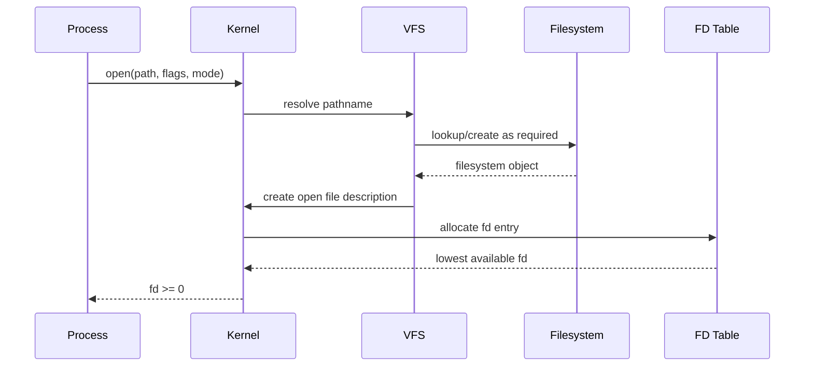
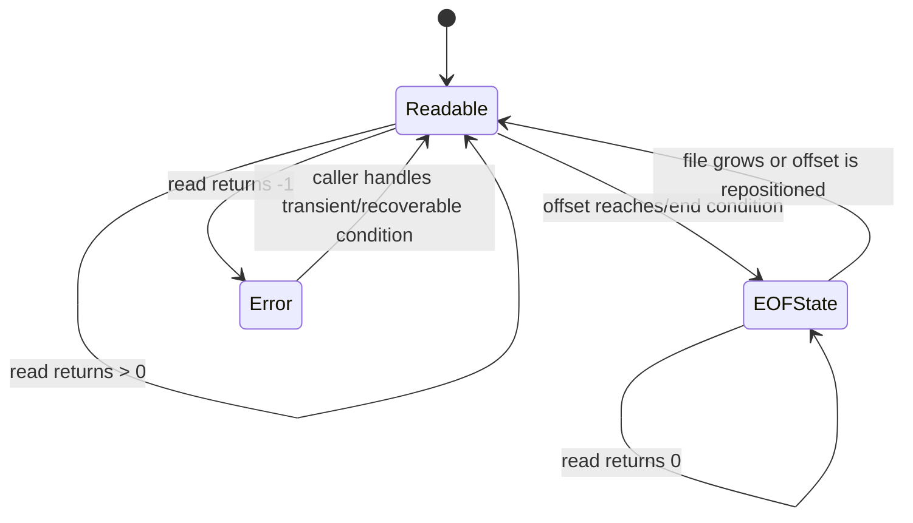
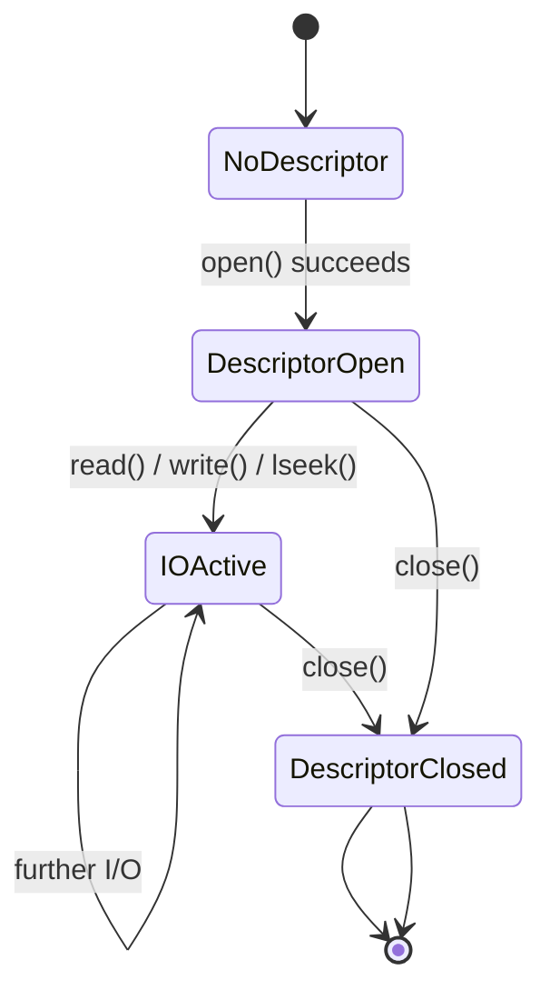

# Chủ đề 3 — File I/O trong Linux

> **Mục tiêu dễ hiểu:** Hiểu chương trình mở một đối tượng, nhận file descriptor rồi dùng `read/write/lseek/close` như thế nào.
>
> **Bạn cần biết trước:** Biết pathname/inode ở mức Topic 2. Chưa cần biết process internals sâu.
>
> **Các từ khóa sẽ gặp nhiều:**
> - **file descriptor (fd)** = số nhỏ process dùng để tham chiếu object đã mở
> - **open file description** = trạng thái open trong kernel như file offset/status flags
> - **partial I/O** = syscall có thể xử lý ít byte hơn yêu cầu
> - **blocking** = thread có thể phải chờ
>
> **Quy ước đọc thuật ngữ:** khi gặp `state`, `context`, `semantics`, `object`, hãy hiểu lần lượt là **trạng thái**, **ngữ cảnh**, **hành vi theo chuẩn**, **đối tượng/tài nguyên**. Tên API và thuật ngữ chuẩn như process, thread, socket, mutex được giữ nguyên để bạn quen dần với tài liệu kỹ thuật.
>
> **Cách đọc nếu bạn mới bắt đầu:**
> 1. Lượt đầu chỉ đọc các ô **“Nói đơn giản”**, sơ đồ ASCII/Mermaid và phần **Tổng kết**.
> 2. Lượt hai đọc các mục `###` để hiểu API/khái niệm cụ thể.
> 3. Các mục `####`, caveat POSIX/Linux và edge case có thể để lần đọc thứ ba. **Không cần hiểu hết trong một lượt.**
>
> Chương này chỉ có **lý thuyết**, không có lab hay bài tập thực hành. Thuật ngữ tiếng Anh được giữ khi đó là tên chuẩn, nhưng luôn ưu tiên giải thích ý nghĩa trước.
---

## Mục lục

- [1. File Descriptor: “tay cầm” để làm I/O](#1-file-descriptor-tay-cầm-để-làm-io)
- [2. Bảng File Descriptor và trạng thái Open trong kernel](#2-bảng-file-descriptor-và-trạng-thái-open-trong-kernel)
- [3. `open()`: từ pathname thành file descriptor](#3-open-từ-pathname-thành-file-descriptor)
- [4. `read()`: đọc tối đa bao nhiêu byte?](#4-read-đọc-tối-đa-bao-nhiêu-byte)
- [5. `write()`: ghi được bao nhiêu byte?](#5-write-ghi-được-bao-nhiêu-byte)
- [6. File Offset và `lseek()`](#6-file-offset-và-lseek)
- [7. `close()` và vòng đời File Descriptor](#7-close-và-vòng-đời-file-descriptor)
- [8. Blocking và Nonblocking I/O cơ bản](#8-blocking-và-nonblocking-io-cơ-bản)
- [9. Return Value, kiểu dữ liệu và lỗi I/O thường gặp](#9-return-value-kiểu-dữ-liệu-và-lỗi-io-thường-gặp)
- [10. Tư duy Debugging cho File I/O](#10-tư-duy-debugging-cho-file-io)
- [11. Liên hệ với Embedded Linux](#11-liên-hệ-với-embedded-linux)
- [12. Tổng kết và Mô hình tư duy](#12-tổng-kết-và-mô-hình-tư-duy)
- [13. Tài liệu tham khảo](#13-tài-liệu-tham-khảo)

---

## 1. File Descriptor: “tay cầm” để làm I/O

> **Nói đơn giản:** Tên file giúp tìm đối tượng; file descriptor là “tay cầm” mà process dùng sau khi đối tượng đã được mở. Đừng coi fd là inode hay địa chỉ bộ nhớ.

> **Hình dung:** Pathname giống địa chỉ nhà. `open()` tìm đúng nhà rồi kernel đưa cho process một số vé như `fd=3`; từ đó process dùng số vé 3 để `read/write` mà không phải đọc lại địa chỉ mỗi lần.


### 1.1 File I/O trong Linux thực chất là gì?


Ở Topic 2, filesystem được nhìn từ namespace:

```text
pathname
   ↓
VFS lookup
   ↓
dentry
   ↓
inode
   ↓
filesystem object
```

Topic 3 thêm một lớp mới:

> Sau khi userspace đã xác định object bằng pathname, chương trình cần một **handle ổn định** để thực hiện I/O nhiều lần mà không phải resolve pathname lại mỗi lần.

Handle đó là:

```text
file descriptor
```

Mô hình tư duy:

```text
pathname
   |
   | open()
   v
file descriptor
   |
   +--> read()
   +--> write()
   +--> lseek()
   +--> fstat()
   +--> ioctl()
   +--> ...
   |
   | close()
   v
descriptor released
```

Điểm cốt lõi:

```text
pathname
```

là cách **định danh object qua namespace**,

còn:

```text
file descriptor
```

là cách **tham chiếu một open I/O context** trong process.

Hai khái niệm này không đồng nghĩa.

---

### 1.2 “File” trong File I/O rộng hơn regular file


Low-level Linux I/O dùng file descriptor cho rất nhiều loại object:

```text
regular file
directory handle trong một số operation
terminal
character device
block device
pipe
FIFO
socket
...
```

Không phải mọi object đều hỗ trợ mọi operation.

Ví dụ:

```text
regular file
  read    yes
  write   tùy access mode/permission
  lseek   thường yes

pipe
  read    yes
  write   yes
  lseek   no

terminal
  read    yes
  write   yes
  lseek   no

device
  semantics tùy driver
```

Do đó:

> **File descriptor là một generic I/O handle, không phải chỉ là “số của file trên disk”.**

Mô hình tư duy:

```text
                    file descriptor
                          |
          +---------------+----------------+
          |               |                |
          v               v                v
     regular file       device          socket/pipe
          |               |                |
      filesystem        driver           IPC/network
```

---

### 1.3 Pathname và file descriptor thuộc hai giai đoạn khác nhau


Một pathname như:

```text
/home/hai/data.bin
```

thuộc namespace.

Khi gọi:

```c
open("/home/hai/data.bin", ...);
```

kernel resolve path và tạo I/O context.

Sau khi `open()` thành công:

```text
fd = 3
```

các operation sau dùng `fd`:

```c
read(fd, ...);
write(fd, ...);
lseek(fd, ...);
close(fd);
```

Không cần gửi pathname lại cho mỗi `read()`.

ASCII:

```text
           Namespace phase
                |
pathname -------+
                |
                v
              open()
                |
                v
       Open-I/O-context phase
                |
                v
               fd
         /      |      \
        /       |       \
     read     write     lseek
```

Đây là separation rất quan trọng:

```text
name lookup
    ≠
open I/O state
```

---

## 2. Bảng File Descriptor và trạng thái Open trong kernel

> **Nói đơn giản:** Process có bảng fd riêng. Một fd trỏ tới trạng thái open ở kernel; chính trạng thái đó giữ file offset và status flags quan trọng.

> **Đừng nhầm:** `fd=3` chỉ là số index trong bảng của process. Nó không phải inode và cũng không phải địa chỉ của đối tượng trong RAM.


### 2.1 File descriptor là gì?


Linux `open(2)` mô tả file descriptor là một **small nonnegative integer** dùng làm index vào table file descriptors của process.

Ví dụ concept:

```text
0
1
2
3
4
...
```

Một process có thể có:

```text
fd 0 -> terminal stdin
fd 1 -> terminal stdout
fd 2 -> terminal stderr
fd 3 -> regular file
fd 4 -> pipe
fd 5 -> socket
```

Điểm quan trọng:

> Số `3`, `4`, `5` không mang bản chất filesystem.

Chúng chỉ có ý nghĩa trong context của process sở hữu descriptor table.

#### 2.1.1 fd không phải inode number

Tách:

```text
fd
  per-process handle

inode number
  filesystem object identity within filesystem context
```

Một inode có thể được mở nhiều lần và tạo nhiều fd.

Một fd có thể refer object không có persistent inode kiểu regular disk file.

#### 2.1.2 fd không phải pointer userspace

Userspace nhìn fd như `int`.

Kernel dùng integer này để lookup kernel-side entry.

Application không dereference fd như memory pointer.

---

### 2.2 File-descriptor table của process


Mỗi process có file-descriptor table.

Mô hình tư duy:

```text
Process
  |
  v
+---------------------------+
| File Descriptor Table     |
+------+--------------------+
| fd 0 | reference ---------+---->
| fd 1 | reference ---------+---->
| fd 2 | reference ---------+---->
| fd 3 | reference ---------+---->
| fd 4 | reference ---------+---->
+------+--------------------+
```

Mỗi slot có thể chứa:

```text
reference tới open file description
file-descriptor flags như FD_CLOEXEC
```

Open file status flags như `O_APPEND`, `O_NONBLOCK` không nên nhầm với per-descriptor flag.

Đây là distinction quan trọng:

```text
per-fd state
      vs
open-file-description state
```

---

### 2.3 Open file description là object trung gian quan trọng


Đây là một trong những khái niệm quan trọng nhất của Linux I/O.

POSIX dùng thuật ngữ:

```text
open file description
```


Khi `open()` thành công, một **new open file description** được tạo.

Nó lưu state như:

```text
current file offset
file status flags
reference tới underlying file/object
```

Mô hình tư duy:

```text
Process fd table
      |
      | fd 3
      v
+----------------------+
| Open File Description|
+----------------------+
| current offset       |
| status flags         |
| object reference     |
+----------+-----------+
           |
           v
     filesystem/device object
```

Điểm cốt lõi:

> **File offset thuộc open file description, không thuộc “integer fd” riêng lẻ và cũng không đơn giản nằm trong inode.**

Điều này giải thích vì sao file offset và file status flags thuộc **trạng thái của lần mở file**, chứ không phải bản thân integer fd.

---

### 2.4 Quan hệ giữa pathname, dentry, inode, open file description và fd


Một regular file có thể nhìn qua nhiều layer:

```text
pathname
   |
   v
directory namespace
   |
   v
dentry
   |
   v
inode
   |
   +-------------------------+
                             |
                     open file description
                             |
                      offset / flags
                             |
                             v
                         fd table
                             |
                             v
                            fd
```

Một sơ đồ dễ nhìn hơn:

```text
Userspace process

fd = 3
  |
  v
[FD table entry]
  |
  v
[open file description]
  |       |
  |       +--> file offset
  |       +--> status flags
  |
  v
[kernel/VFS file object]
  |
  v
[inode / device / socket / pipe ...]
```

Pathname cần cho `open()` ban đầu.

Sau đó open file description giữ reference ổn định tới object.

Nếu pathname sau đó bị rename/unlink, fd không tự biến thành invalid chỉ vì name thay đổi.

---

## 3. `open()`: từ pathname thành file descriptor

> **Nói đơn giản:** `open()` vừa resolve pathname vừa tạo open-I/O context. Flags nói bạn muốn đọc/ghi và có tạo/truncate/append hay không.


### 3.1 `open()` thực sự làm gì?


Prototype Linux/POSIX phổ biến:

```c
int open(const char *path, int flags, ...);
```

Ở mức abstraction, `open()` làm nhiều việc:

```text
1. resolve pathname
2. kiểm tra path traversal / access conditions
3. tùy flags, có thể create/truncate object
4. tạo open file description
5. đặt access mode / file status flags
6. khởi tạo file offset
7. tạo fd-table entry trong process
8. return file descriptor
```

Mermaid sequence:



Nếu bất kỳ stage cần thiết nào fail:

```text
return -1
errno = error code
```

---

### 3.2 Access mode: `O_RDONLY`, `O_WRONLY`, `O_RDWR`


Ba access mode cơ bản:

```text
O_RDONLY
O_WRONLY
O_RDWR
```

Chúng nói open file description được mở với intent:

```text
read-only
write-only
read-write
```

Nuance quan trọng từ Linux `open(2)`:

> Chúng không phải ba bit độc lập để OR tùy ý.

`O_RDONLY | O_WRONLY` không phải cách tạo read-write mode.

`O_RDWR` là access mode riêng.

#### 3.2.1 Access mode khác filesystem permission bits

Tách:

```text
open access mode
    what this open description requests

inode permissions
    what access policy allows
```

Ví dụ concept:

```text
file mode permits read/write
```

nhưng process gọi:

```text
O_RDONLY
```

thì fd đó không được dùng `write()` như read-write fd.

Ngược lại, request `O_RDWR` vẫn có thể fail nếu access policy không cho phép.

---

### 3.3 Creation flags và file-status flags


Linux `open(2)` phân biệt conceptually:

```text
file creation flags
file status flags
```

Creation flags ảnh hưởng operation của `open()` itself.

Status flags ảnh hưởng I/O behavior sau khi open.

Ví dụ:

```text
creation/context flags:
O_CREAT
O_EXCL
O_TRUNC
O_CLOEXEC
O_DIRECTORY
O_NOFOLLOW
...

status/behavior flags:
O_APPEND
O_NONBLOCK
O_SYNC
...
```

Exact classification theo `open(2)` cần được đọc khi dùng flag cụ thể.

Mô hình tư duy:

```text
open() time
   |
   +--> "mở/create như thế nào?"
   |
   v
open file description
   |
   +--> "I/O sau đó có semantics nào?"
```

---

### 3.4 `O_CREAT`, `mode` và `umask`


Khi `O_CREAT` được dùng và file cần tạo mới, argument `mode` cung cấp requested permission bits.

Concept:

```text
requested mode
      |
      v
mode & ~umask
      |
      v
initial permission mode
```

nếu không có default ACL ảnh hưởng semantics.

Điểm quan trọng:

```text
mode
```

được dùng để xác định permission của object mới cho future access,

nhưng access mode của fd vừa mở được quyết định bởi flags.

Vì vậy có tình huống conceptually:

```text
file được tạo với mode read-only cho future opens
```

nhưng current `open()` vẫn return writable fd vì current open access đã được authorize/create trong operation đó theo semantics.

---

### 3.5 `O_TRUNC`: mở file và làm thay đổi dữ liệu


`O_TRUNC` là ví dụ cho việc:

> `open()` không chỉ “lấy handle”.

Với điều kiện phù hợp, mở regular file với `O_TRUNC` có thể làm file length trở về 0.

Mô hình tư duy:

```text
before open:

inode
 |
 +--> size = N
 +--> data blocks


open(... O_TRUNC ...)

        ↓

inode
 |
 +--> size = 0
 +--> previous contents no longer part of file
```

Do đó:

```text
open()
```

có thể có side effect lên filesystem state.

Không nên coi nó là pure lookup operation.

---

### 3.6 `O_APPEND`: append là semantic của open file description


Nếu open file description có `O_APPEND`, trước mỗi `write()` kernel đảm bảo file offset được đặt ở end-of-file và write diễn ra theo append semantics của interface.

Mô hình tư duy:

```text
write(fd, data)
      |
      v
determine current EOF
      |
      v
position write at EOF
      |
      v
perform write
```

Điểm quan trọng:

> `O_APPEND` không đơn giản là application tự `lseek(SEEK_END)` trước mỗi write.

Nếu user space làm:

```text
lseek(end)
write()
```

hai operation riêng biệt có race window.

`O_APPEND` cung cấp stronger append semantics cho open file description.

Nuance:

```text
network filesystem
```

có thể có protocol limitations; `open(2)` nêu NFS là trường hợp cần thận trọng.

---

### 3.7 `O_CLOEXEC` và vòng đời fd qua `exec`


Mặc định, một new fd có thể remain open qua `execve()` nếu `FD_CLOEXEC` không được đặt.

`O_CLOEXEC` cho phép đặt close-on-exec atomically khi `open()`.

Mô hình tư duy:

```text
process
  |
 fd 3
  |
execve(new_program)
  |
  +--> without CLOEXEC: fd 3 may remain
  |
  +--> with CLOEXEC: fd 3 closed during exec transition
```

Điều này quan trọng với:

```text
security
resource leaks
multi-threaded programs
daemon/service design
```

Nuance về atomic flag setting quan trọng vì:

```text
open()
then fcntl(F_SETFD)
```

là hai operation, tạo race trong multithreaded context nơi thread khác có thể `fork+exec` giữa hai bước.

---

## 4. `read()`: đọc tối đa bao nhiêu byte?

> **Nói đơn giản:** `read()` có nghĩa “đọc tối đa N byte”, không phải “chắc chắn đủ N byte”. `0` thường có nghĩa EOF với regular/stream-like đối tượng phù hợp.


### 4.1 `read()` — yêu cầu đọc “up to count bytes”


Prototype:

```c
ssize_t read(int fd, void *buf, size_t count);
```

Semantics cốt lõi:

```text
attempt to read up to count bytes
```

Không phải:

```text
must return exactly count bytes
```

Mô hình tư duy:

```text
fd
 |
 v
open object
 |
 v
available data / file offset / device state
 |
 v
read up to count bytes
 |
 v
copy to userspace buffer
 |
 v
return actual byte count
```

Return:

```text
> 0   số byte thực sự đọc
= 0   EOF trong relevant stream/file semantics
= -1  error, errno set
```

---

### 4.2 Short read không nhất thiết là lỗi


Nếu request:

```text
count = 4096
```

`read()` có thể return:

```text
100
512
2048
...
```

và đây vẫn là successful call.

Linux `read(2)` nêu các lý do điển hình:

```text
near EOF
less data currently available
pipe
terminal
signal interruption after some data
object-specific behavior
```

Mô hình tư duy:

```text
requested bytes
      !=
guaranteed returned bytes
```

Application-level logic phải dùng:

```text
return value
```

làm source of truth.

Không được giả định:

```text
one read == one complete logical message
```

đặc biệt với stream-like I/O.

---

### 4.3 EOF khác error như thế nào?


Đối với `read()`:

```text
0
```

là một valid return value biểu diễn end-of-file/end-of-stream condition theo object semantics.

Error là:

```text
-1
errno = ...
```

Tách:

```text
EOF
  state of input stream/file position
  not a syscall failure

ERROR
  operation failed
  errno explains class
```

Ví dụ regular file:

```text
offset < size
    ↓
read data

offset reaches size
    ↓
next read returns 0
```

State diagram:



Đây là mô hình tư duy giản lược; stream/device semantics có thể khác regular file.

---

## 5. `write()`: ghi được bao nhiêu byte?

> **Nói đơn giản:** `write()` cũng có thể ghi ít hơn số byte yêu cầu. Return value mới là số byte thực sự đã được chấp nhận.


### 5.1 `write()` — yêu cầu ghi byte vào object


Prototype:

```c
ssize_t write(int fd, const void *buf, size_t count);
```

Semantics cốt lõi:

```text
attempt to write up to count bytes
```

Mô hình tư duy:

```text
userspace buffer
      |
      | count bytes requested
      v
write(fd, ...)
      |
      v
kernel / object implementation
      |
      v
actual bytes accepted
      |
      v
return byte count
```

Return:

```text
>= 0  số byte accepted/written theo call semantics
-1    error
```

Với regular seekable file, normal write ảnh hưởng file offset.

---

### 5.2 Short write và vì sao một lần `write()` chưa chắc ghi hết


`write()` có thể return nhỏ hơn `count`.

Các nguyên nhân có thể gồm:

```text
insufficient space
resource limits
signal interruption after partial transfer
pipe/socket capacity/state
device-specific limits
filesystem conditions
```

Mô hình tư duy:

```text
requested 4096
       |
       v
system accepts 1024
       |
       v
write returns 1024
```

Không được giả định:

```text
return >= 0
```

nghĩa là toàn bộ buffer đã được ghi.

Đây là một principle nền tảng của robust I/O design.

---

### 5.3 `write()` thành công không đồng nghĩa dữ liệu đã bền vững trên storage


Một trong những hiểu nhầm phổ biến:

```text
write() returned success
        =
data physically persisted on disk/flash
```

Không đúng như một guarantee chung.

Với buffered filesystem/storage stack:

```text
userspace
   |
 write()
   v
kernel cache / filesystem state
   |
   v
later writeback
   |
   v
storage device
```

`write()` success thường cho biết kernel accepted data theo interface semantics.

Durability có thể cần các mechanism như:

```text
fsync()
fdatasync()
sync-related flags
filesystem-specific guarantees
hardware cache semantics
```

Topic này không đi sâu durability, nhưng phải tránh mô hình tư duy sai.

---

## 6. File Offset và `lseek()`

> **Nói đơn giản:** File offset là vị trí đọc/ghi hiện tại của seekable đối tượng. `lseek()` thay đổi offset chứ không tự đọc hay ghi dữ liệu.


### 6.1 File offset nằm ở đâu?


Với seekable open file, current file position được lưu trong:

```text
open file description
```

không phải:

```text
pathname
inode
fd integer itself
```

Mô hình tư duy:

```text
fd 3
  |
  v
open file description
  |
  +--> offset = 128
  |
  v
inode/file object
```

Khi:

```text
read 20 bytes
```

thành công:

```text
offset 128
   ↓
offset 148
```

nếu object supports seek-style offset semantics.

---

### 6.2 `lseek()` thay đổi file offset chứ không đọc/ghi dữ liệu


Prototype:

```c
off_t lseek(int fd, off_t offset, int whence);
```

`lseek()` thay position của **open file description**.

Nó không tự:

```text
copy data
read bytes
write bytes
change file size
```

chỉ vì offset được reposition.

Mô hình tư duy:

```text
open file description

offset = 100

lseek(...)

offset = 500
```

File data không tự thay đổi.

---

### 6.3 `SEEK_SET`, `SEEK_CUR`, `SEEK_END`


Ba origin cơ bản:

```text
SEEK_SET
    new_offset = offset

SEEK_CUR
    new_offset = current_offset + offset

SEEK_END
    new_offset = file_size + offset
```

ASCII:

```text
file:

0                                              EOF
|----------------------------------------------|
                    ^
                    current

SEEK_SET
  reference = beginning

SEEK_CUR
  reference = current

SEEK_END
  reference = EOF
```

`lseek()` return resulting byte offset từ beginning trên success.

---

### 6.4 Seekable và non-seekable objects


Không phải mọi fd có meaningful random-access offset.

`lseek()` trên:

```text
pipe
FIFO
socket
terminal
```

fails với `ESPIPE` theo Linux/POSIX cases.

Tại sao?

Vì những object này thường biểu diễn stream:

```text
past bytes
   gone/consumed
       ↓
current stream point
       ↓
future bytes
```

không phải random-access byte array.

Mô hình tư duy:

```text
regular file
  random-access addressable byte sequence
       ↑
       | seek meaningful

pipe/socket/terminal
  stream/event flow
       ↑
       | seek generally meaningless
```

---

## 7. `close()` và vòng đời File Descriptor

> **Nói đơn giản:** `close()` bỏ reference fd của process. Số fd có thể được kernel tái sử dụng cho một đối tượng khác sau đó.


### 7.1 `close()` thực sự đóng cái gì?


Prototype:

```c
int close(int fd);
```

`close()` làm fd-table entry của process không còn refer open file.

Mô hình tư duy:

```text
before:

fd 3 -> OFD A

close(3)

after:

fd 3 slot free
```

Nhưng open file description chưa chắc bị destroy ngay.

Nếu còn reference:

```text
another duplicated fd
another process inherited fd
kernel reference
```

OFD/object vẫn có thể sống.

#### 7.1.1 Reference-count mô hình tư duy

```text
fd3 ----+
        |
fd7 ----+--> OFD A --> object
        |
child3 -+
```

close fd3:

```text
fd7 ----+
        +--> OFD A --> object
child3 -+
```

OFD chỉ eligible for final cleanup khi relevant final references mất.

---

### 7.2 File descriptor number có thể được tái sử dụng


Sau:

```text
close(3)
```

fd number 3 có thể được allocation cho open operation sau.

Ví dụ concept:

```text
time t1:
fd 3 -> log.txt

close(3)

time t2:
fd 3 -> socket
```

Do đó:

> **fd number không phải stable global object identity qua thời gian.**

Đây là lý do use-after-close có thể rất nguy hiểm:

```text
stale fd integer
```

có thể tình cờ refer object hoàn toàn khác sau reuse.

---

### 7.3 Vòng đời fd và open file description


State diagram:



Sơ đồ là mô hình tư duy.

Actual kernel lifetime còn liên quan:

```text
mappings
kernel references
filesystem references
locks
async operations
```

---

## 8. Blocking và Nonblocking I/O cơ bản

> **Nói đơn giản:** Blocking nghĩa syscall có thể làm thread ngủ chờ đối tượng sẵn sàng. `O_NONBLOCK` thay đổi hành vi với các đối tượng hỗ trợ nó; không phải regular file nào cũng thành “không bao giờ chờ”.


### 8.1 Blocking I/O thực chất là gì?


“Blocking” nghĩa là operation có thể làm calling thread phải chờ cho tới khi condition cần thiết xảy ra hoặc operation hoàn thành/tiến triển theo interface semantics.

Mô hình tư duy:

```text
thread calls read()
      |
      v
data ready now?
   /       \
 yes        no
 |          |
 v          v
return     sleep/wait in kernel
            |
       event/data arrives
            |
            v
         wake thread
            |
            v
          return
```

Blocking không có nghĩa:

```text
CPU busy-loop 100%
```

Thread thường bị scheduler đưa khỏi runnable state trong khi đợi event/resource.

---

### 8.2 Blocking phụ thuộc loại object và trạng thái hiện tại


Cùng `read()` nhưng behavior khác:

#### 8.2.1 Regular file

Data có thể cần:

```text
page cache lookup
storage I/O
filesystem work
```

operation có thể chờ I/O.

#### 8.2.2 Pipe/FIFO

Nếu không có data nhưng writer còn tồn tại:

```text
blocking read
```

có thể sleep chờ data.

#### 8.2.3 Terminal

Read behavior phụ thuộc:

```text
canonical/noncanonical mode
line discipline
input availability
```

#### 8.2.4 Socket

Read/receive có thể chờ network data.

#### 8.2.5 Device

Driver định nghĩa readiness/blocking behavior theo subsystem/API.

Do đó:

> **Blocking là property của operation + object state + flags, không phải chỉ tên system call.**

---

### 8.3 `O_NONBLOCK` và `EAGAIN`


Nếu fd/open file description được đặt nonblocking và operation sẽ phải chờ, interface có thể return ngay:

```text
-1
errno = EAGAIN
```

hoặc socket portable code có thể cần nhận biết:

```text
EAGAIN / EWOULDBLOCK
```

Mô hình tư duy:

```text
blocking mode:

not ready
  ↓
sleep
  ↓
ready
  ↓
return


nonblocking mode:

not ready
  ↓
return immediately
  ↓
EAGAIN
```

Điểm cốt lõi:

> `EAGAIN` thường biểu diễn “hiện tại chưa thể hoàn thành mà không block”, không phải resource hỏng vĩnh viễn.

---

### 8.4 Regular file và `O_NONBLOCK`: một nuance quan trọng


Linux `open(2)` ghi rõ:

```text
O_NONBLOCK
```

hiện không tạo general guarantee rằng regular-file I/O sẽ không bao giờ chờ.

Với regular file và block device, I/O vẫn có thể briefly block khi device activity cần thiết.

Do đó không nên thiết kế mô hình tư duy:

```text
O_NONBLOCK
  =
mọi read/write trên mọi fd return ngay lập tức
```

Correct model:

```text
nonblocking semantics are object/subsystem dependent
```

và đặc biệt meaningful với:

```text
pipes
FIFOs
sockets
terminals/devices
```

---

### 8.5 `read()` trên terminal, pipe, FIFO và device có semantics khác regular file


Một API thống nhất:

```c
read(fd, buf, count)
```

không có nghĩa underlying object identical.

#### 8.5.1 Regular file

```text
offset-based byte sequence
EOF based on file size/current position
```

#### 8.5.2 Pipe/FIFO

```text
producer-consumer byte stream
no lseek
EOF depends on writer references/state
```

#### 8.5.3 Terminal

```text
TTY line discipline
canonical mode may deliver line-oriented input
special-character handling
no normal random seek
```

#### 8.5.4 Character device

```text
driver-defined read semantics
may block waiting hardware event
may represent samples/register-generated data
```

Đây là sức mạnh của Unix/Linux I/O abstraction:

```text
same syscall shape
different object semantics
```

---

## 9. Return Value, kiểu dữ liệu và lỗi I/O thường gặp

> **Nói đơn giản:** Hãy luôn đọc giá trị trả về trước rồi mới đọc `errno`. `size_t`, `ssize_t`, `off_t` tồn tại vì count, kết quả và offset có kiểu/miền giá trị khác nhau.


### 9.1 Return value: dữ liệu điều khiển quan trọng của I/O


Một robust mô hình tư duy luôn nhìn:

```text
return value first
```

#### 9.1.1 `open()`

```text
>= 0  fd
-1    error
```

#### 9.1.2 `read()`

```text
>0  bytes read
 0  EOF/end condition
-1  error
```

#### 9.1.3 `write()`

```text
>=0 bytes written/accepted
-1  error
```

#### 9.1.4 `lseek()`

```text
>=0 resulting offset normally
-1 error
```

#### 9.1.5 `close()`

```text
0   success
-1  error
```

Tuy nhiên `close()` error handling có caveats đặc biệt, sẽ nói ở phần error model.

---

### 9.2 `size_t`, `ssize_t` và `off_t`


Ba type này phản ánh ba loại quantity khác nhau.

#### 9.2.1 `size_t`

Unsigned integer type dùng cho object sizes/counts.

Trong:

```c
read(fd, buf, count)
```

`count` là `size_t`.

Nó biểu diễn:

```text
requested byte count
```

#### 9.2.2 `ssize_t`

Signed type dùng cho return byte count.

Tại sao signed?

Vì cần biểu diễn:

```text
>= 0 actual count
-1 error
```

Mô hình tư duy:

```text
size_t
  request range

ssize_t
  result count or negative error sentinel
```

#### 9.2.3 `off_t`

Type biểu diễn file offsets.

Dùng bởi:

```text
lseek()
```

Nó cần biểu diễn vị trí file có thể lớn.

Large-file support/history khiến không nên assume:

```text
off_t == int
```

---

### 9.3 `errno` và error model của system call


Linux/POSIX functions thường signal failure bằng:

```text
return value
```

và set:

```text
errno
```

Ví dụ:

```text
read returns -1
       |
       v
errno identifies class
```

Điểm cực kỳ quan trọng:

> Chỉ đọc `errno` khi API contract cho biết call đã fail theo return value.

`errno` có thể còn chứa value từ call trước.

Không được làm:

```text
call succeeded
then inspect errno
```

rồi kết luận operation lỗi.

Mô hình tư duy:

```text
return value
     |
     +--> success path
     |
     +--> failure path
              |
              v
            errno
```

---

### 9.4 `EBADF`: lỗi ở tầng descriptor


`EBADF` thường biểu diễn:

```text
fd không valid
```

hoặc không mở với access phù hợp cho operation.

Ví dụ conceptual:

```text
read(fd)
```

nhưng:

```text
fd closed
fd never valid
fd opened write-only
```

Mô hình tư duy debug:

```text
is fd valid?
   ↓
does current process own a live entry?
   ↓
is access mode compatible?
```

Đây là lỗi ở layer:

```text
descriptor / open context
```

không phải trước tiên ở pathname layer.

---

### 9.5 `EINTR`: I/O bị ngắt bởi signal


Blocking syscall có thể bị signal interrupt.

Với `read()` Linux man-page:

```text
EINTR
```

khi call bị interrupted trước khi any data read theo described case.

Mô hình tư duy:

```text
thread blocks in syscall
      |
      v
signal delivered
      |
      v
syscall may terminate early
      |
      v
-1 / EINTR
```

Nhưng behavior có thể bị ảnh hưởng bởi:

```text
signal disposition
SA_RESTART
specific syscall
whether partial transfer already occurred
```

Do đó rule:

```text
"mọi EINTR cứ retry vô hạn"
```

không phải universal design answer.

Topic Signal sẽ mở rộng.

---

### 9.6 `EAGAIN` / `EWOULDBLOCK`: “chưa sẵn sàng” khác failure vĩnh viễn


Với nonblocking I/O:

```text
operation would block
```

nên kernel return:

```text
EAGAIN
```

Với socket, POSIX cho phép:

```text
EAGAIN
hoặc
EWOULDBLOCK
```

và portable code không nên assume chúng luôn bằng nhau.

Mô hình tư duy:

```text
EAGAIN
   |
   +--> resource currently not ready
   |
   +--> caller may wait/retry through a suitable design
```

Đây là nền tảng để hiểu rằng nonblocking I/O cần một cơ chế chờ/readiness thích hợp ở các topic sau.

---

## 10. Tư duy Debugging cho File I/O

> **Nói đơn giản:** Debug File I/O theo thứ tự: fd hợp lệ? access mode đúng? đối tượng có data/space? giá trị trả về là gì? errno nói gì?


### 10.1 Error model và tư duy debug File I/O


Một I/O failure nên được phân lớp.

Mô hình tư duy:

```text
1. pathname resolution?
        ↓
2. open access/create flags?
        ↓
3. fd valid/lifetime?
        ↓
4. operation compatible with access mode?
        ↓
5. object supports operation?
        ↓
6. blocking/readiness state?
        ↓
7. partial transfer?
        ↓
8. signal interruption?
        ↓
9. filesystem/device/network error?
        ↓
10. durability requirement?
```

#### 10.1.1 `open()` fail

Likely categories:

```text
path missing
directory traversal denied
permissions
read-only filesystem
bad flags
too many open files
resource limits
symlink/path issue
device-specific failure
```

#### 10.1.2 `read()` returns 0

Do not log as generic error.

Ask:

```text
is this EOF?
pipe peer closed?
object-specific end condition?
```

#### 10.1.3 `read()` returns fewer bytes

Do not assume corruption.

Ask:

```text
how many bytes actually returned?
is object stream-like?
near EOF?
signal/availability?
```

#### 10.1.4 `write()` returns positive short count

Do not discard unwritten tail conceptually.

The operation succeeded partially.

#### 10.1.5 `lseek()` returns `ESPIPE`

Likely:

```text
fd refers non-seekable stream:
pipe/FIFO/socket/terminal
```

Not necessarily a broken fd.

#### 10.1.6 `close()` reports error

`close()` has subtle semantics.

Linux man-page warns that after `close()` returns error other than `EBADF`, Linux has already released the fd and it may be reused.

Therefore blindly retrying `close(fd)` can accidentally close a different resource in multithreaded code if the number has been reused.

This is a critical nuance:

```text
close error
    ≠
safe to call close(fd) again blindly
```

Data/writeback errors may also be reported at close time on some filesystems/storage contexts, so applications requiring durability must use appropriate synchronization interfaces rather than treating `close()` as the sole durability check.

---

## 11. Liên hệ với Embedded Linux

> **Nói đơn giản:** UART, GPIO/device node, I2C/SPI userspace interface và `/proc`/`/sys` đều nối lại với mô hình tư duy fd + read/write/ioctl.


### 11.1 Liên hệ với Embedded Linux


File I/O là một trong những abstraction quan trọng nhất của Embedded Linux.

#### 11.1.1 Device nodes

Userspace có thể:

```text
open("/dev/ttyS0")
read()
write()
ioctl()
```

Mô hình tư duy:

```text
pathname /dev/...
      ↓
open()
      ↓
fd
      ↓
VFS
      ↓
driver/subsystem
      ↓
hardware
```


---

#### 11.1.2 UART

UART userspace interface thường xuất hiện như:

```text
/dev/tty...
```

File I/O path:

```text
application
   |
 open/read/write
   |
   v
TTY subsystem
   |
   v
UART driver
   |
   v
UART hardware
```

Nhưng terminal line discipline có semantics riêng nên raw byte I/O không luôn giống regular file.

---

#### 11.1.3 I2C / SPI

Embedded Linux có nhiều cách expose hardware.

Ví dụ userspace interfaces có thể dùng:

```text
/dev/i2c-X
/dev/spidevX.Y
```

và interaction có thể kết hợp:

```text
open
read/write
ioctl
```

Điểm nền:

```text
fd
```

là handle tới kernel interface.

---

#### 11.1.4 GPIO

Modern GPIO character-device userspace API sử dụng file descriptors cho chip/line requests/events.

Dù API không chỉ đơn giản là `read/write` traditional style, fd abstraction vẫn trung tâm.

---

#### 11.1.5 `/sys` và `/proc`

Nhiều pseudo-filesystem attributes có thể đọc/ghi qua standard file I/O path:

```text
open
read
write
close
```

Nhưng underlying data có thể được kernel generate/consume dynamically.

Do đó:

```text
looks like file
```

không nghĩa:

```text
persistent disk data
```

---

#### 11.1.6 Blocking hardware I/O

Một device read có thể chờ:

```text
interrupt
incoming byte
sensor sample
DMA completion
driver buffer data
```

Mô hình tư duy:

```text
userspace read()
     |
     v
driver has data?
  /       \
 yes       no
 |         |
return   sleep/wait queue
           |
        hardware IRQ
           |
        wake caller
```

Đây là bridge trực tiếp sang:

```text
interrupt handling
wait queues
poll
device-driver design
```

---

#### 11.1.7 Board bring-up

Khi peripheral “không hoạt động”, cần tách:

```text
device node exists?
open succeeds?
read/write blocks?
returns 0?
returns -1?
errno?
driver probe?
hardware event?
```

Nếu không hiểu return semantics và fd lifetime, rất dễ debug sai layer.

---

#### 11.1.8 BusyBox và minimal userspace

Minimal Embedded Linux vẫn dùng same kernel syscalls.

BusyBox utilities cuối cùng dựa trên:

```text
open/read/write/stat/ioctl/...
```

theo nhu cầu applet.

Do đó File I/O knowledge không phụ thuộc desktop GUI.

---

## 12. Tổng kết và Mô hình tư duy

> **Nói đơn giản:** Chuỗi cần nhớ: pathname → `open()` → fd → I/O operations → `close()`.


```text
pathname
   ↓ open()
fd number
   ↓
open file description
   ├─ access/status flags
   └─ current offset
        ↓
filesystem/device object
        ↓
read / write / lseek / close
```

Các điểm cần giữ:
- File descriptor là process-local integer handle.
- `open()` tạo/thu được một open-file state rồi đặt reference vào fd table.
- `read()`/`write()` có thể hoàn thành một phần; return value là phần của protocol I/O.
- `read() == 0` có nghĩa EOF trong các object có EOF semantics, không phải generic error.
- File offset thuộc open-file state của seekable object; `lseek()` thay vị trí, không đọc/ghi.
- Blocking nghĩa calling thread có thể sleep chờ object sẵn sàng.
- `O_NONBLOCK` thay waiting behavior của object hỗ trợ semantics đó.
- System call failure thường báo `-1` và cung cấp error qua `errno`.

---

## 13. Tài liệu tham khảo

> **Nói đơn giản:** Nguồn tham khảo để kiểm chứng system-call hành vi theo chuẩn; người mới chỉ cần dùng khi gặp chi tiết chưa rõ.


- POSIX.1-2024 System Interfaces: https://pubs.opengroup.org/onlinepubs/9799919799/
- `open(2)`: https://man7.org/linux/man-pages/man2/open.2.html
- `read(2)`: https://man7.org/linux/man-pages/man2/read.2.html
- `write(2)`: https://man7.org/linux/man-pages/man2/write.2.html
- `lseek(2)`: https://man7.org/linux/man-pages/man2/lseek.2.html
- `close(2)`: https://man7.org/linux/man-pages/man2/close.2.html
- `fcntl(2)`: https://man7.org/linux/man-pages/man2/fcntl.2.html
- `errno(3)`: https://man7.org/linux/man-pages/man3/errno.3.html
- GNU C Library Manual: https://www.gnu.org/software/libc/manual/
- The Linux Programming Interface: https://man7.org/tlpi/

---

> **Điều hướng:** [← Chủ đề 2 — Linux File System](README-topic-02.md) · [Chủ đề 4 — Process →](README-topic-04.md)
