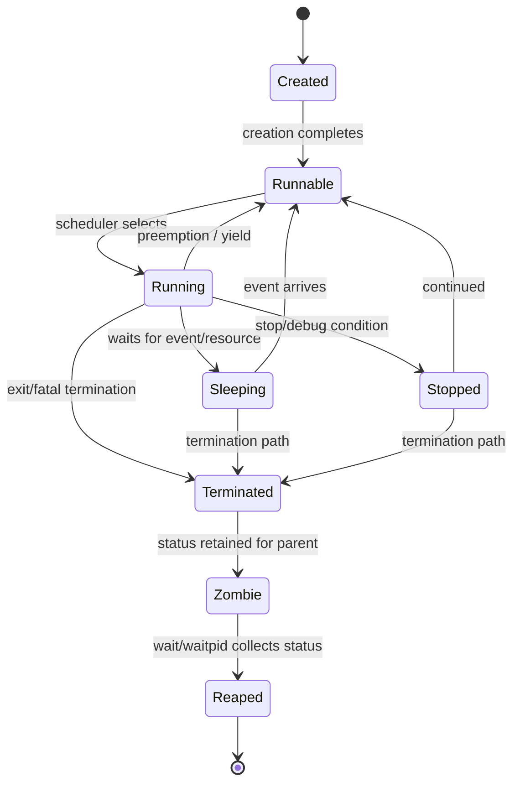

# Chủ đề 4 — Process trong Linux

> **Phạm vi:** Linux process fundamentals — program và process, PID/PPID, process resources, virtual address space, process hierarchy, `fork()`, `execve()`, `wait()`/`waitpid()`, process termination, zombie/orphan/reparenting và `/proc/<pid>`.
>
> Chương này chỉ trình bày **lý thuyết**. Không có lab, bài tập, lệnh thực hành hay hướng dẫn thao tác.
>
> Mục tiêu của chương là xây mental model:
>
> `executable → process → PID/resources/address space → fork/exec → process states → termination → wait/reap`
>
> và:
>
> `process identity → kernel-managed state → /proc/<pid> → userspace observation`
>
> **Giới hạn chủ đề:** Signal programming, POSIX threads, synchronization, scheduler policy/nice/CPU affinity, IPC, namespaces/cgroups, `clone()` nâng cao và virtual-memory internals sẽ được học ở topic/phần sau.
>
> **Cấu trúc tài liệu:** các mục `##` là khối kiến thức lớn; các concept chi tiết được đặt ở `###`/`####` để giữ mục lục gọn nhưng không giảm chiều sâu nội dung.
>
> **Điều hướng:** [← Chủ đề 3 — File I/O](README-topic-03.md) · [Chủ đề 5 — Signal →](README-topic-05.md)

---

## Mục lục

- [1. Program, Process và Linux Task Model](#1-program-process-và-linux-task-model)
- [2. Process Identity và Hierarchy](#2-process-identity-và-hierarchy)
- [3. Process Resources, Memory và Execution Context](#3-process-resources-memory-và-execution-context)
- [4. Process States và Context Switch](#4-process-states-và-context-switch)
- [5. `fork()` và Child Process Model](#5-fork-và-child-process-model)
- [6. `execve()` và Program-image Replacement](#6-execve-và-program-image-replacement)
- [7. Process Termination và Exit Status](#7-process-termination-và-exit-status)
- [8. Zombie, `wait()`, Orphan và Reparenting](#8-zombie-wait-orphan-và-reparenting)
- [9. Process Lifecycle State Machine](#9-process-lifecycle-state-machine)
- [10. Process Observation qua `/proc/<pid>`](#10-process-observation-qua-procpid)
- [11. Process Observation với `ps` và `top`](#11-process-observation-với-ps-và-top)
- [12. Process và Thread ở mức nền tảng](#12-process-và-thread-ở-mức-nền-tảng)
- [13. Isolation, Resource Limits và Scheduling](#13-isolation-resource-limits-và-scheduling)
- [14. Error Model và Debugging](#14-error-model-và-debugging)
- [15. Liên hệ với Embedded Linux](#15-liên-hệ-với-embedded-linux)
- [16. Tổng kết và Mental Model](#16-tổng-kết-và-mental-model)
- [17. Tài liệu tham khảo](#17-tài-liệu-tham-khảo)

---

## 1. Program, Process và Linux Task Model

### 1.1 Program và process khác nhau ở đâu?


Một **program** là mô tả tĩnh về code/dữ liệu cần để thực thi. Nó có thể là:

```text
ELF executable
shell script
interpreter script
```

và nằm trên filesystem mà không cần có process nào đang chạy.

Một **process** là một instance thực thi có state do kernel quản lý.

```text
Program file
    |
    | execute
    v
+-----------------------------+
|           Process           |
|-----------------------------|
| PID / PPID                  |
| virtual address space       |
| CPU execution state         |
| file-descriptor table       |
| cwd / root / umask          |
| credentials                 |
| environment                 |
| scheduling state            |
| kernel bookkeeping          |
+-----------------------------+
```

Do đó:

```text
program  = static executable description
process  = dynamic execution context
```

Một executable có thể tạo nhiều process độc lập:

```text
/usr/bin/app
   |
   +--> PID 1010
   +--> PID 1042
   +--> PID 1201
```

Các process này có thể dùng cùng executable nhưng khác:

```text
PID
address-space state
open files
environment
cwd
execution progress
```

---

### 1.2 Process là một execution context


Định nghĩa “program đang chạy” là đúng nhưng chưa đủ.

Process gồm nhiều loại state:

```text
Identity
  PID, PPID, process-group/session context

Memory
  address space, mappings, heap, stack

CPU execution context
  registers, program counter, stack pointer

I/O
  file-descriptor table

Filesystem context
  cwd, root, umask

Security
  UID/GID credentials, capabilities context

Runtime state
  environment, signal state, resource limits,
  accounting, scheduler state
```

Mental model:

```text
Process
   =
program image
   +
kernel-managed execution state
   +
references to kernel/system resources
```

Kernel phải giữ đủ state để:

```text
schedule process
pause/resume process
perform access checks
track memory
track open files
handle termination
report status to parent/userspace
```

---

### 1.3 Linux kernel nhìn process như thế nào?


Ở userspace ta nói “process”.

Linux kernel dùng task model, với `task_struct` là structure trung tâm cho schedulable execution entities.

Mental model:

```text
Userspace view:
Process

Kernel view:
Task / task_struct
```

Với single-threaded process, hai view khá gần nhau.

Với multithreaded process:

```text
one userspace process
        |
        +--> task/thread A
        +--> task/thread B
        +--> task/thread C
```

Do đó không nên khẳng định:

```text
1 task_struct = 1 userspace process
```

trong mọi trường hợp.

Topic này chủ yếu dùng single-threaded mental model để làm rõ `fork/exec/wait/exit`.

---

## 2. Process Identity và Hierarchy

### 2.1 PID và process identity


Mỗi process có process ID:

```text
PID
```

PID là integer identifier dùng để process được tham chiếu trong nhiều interfaces:

```text
waitpid()
kill()
ptrace()
setpriority()
/proc/<pid>
process monitoring
```

PID không phải:

```text
pointer
memory address
inode
file descriptor
```

Mental model:

```text
PID
 |
 +--> process identity in current PID-namespace context
```

Linux hiện đại có PID namespaces, vì vậy cùng một task có thể có các PID khác nhau khi nhìn từ namespace khác nhau. Chi tiết namespaces nằm ngoài Topic 4.

---

### 2.2 PPID và quan hệ parent/child


Một process còn có:

```text
PPID
```

— parent process ID.

Khi parent tạo child bằng `fork()`:

```text
Parent PID = 200
      |
      | fork()
      v
Child PID = 201

Child PPID = 200
```

Parent/child relationship quan trọng cho:

```text
termination notification
wait/reaping
process hierarchy
reparenting
```

Nhưng child không phải “memory object nằm trong parent”.

Sau fork, child là process riêng.

---

### 2.3 PID reuse và vì sao PID không phải identity vĩnh viễn


PID được cấp từ finite ID space.

Sau khi process terminate và được reaped hoàn toàn, PID có thể được tái sử dụng:

```text
t1:
PID 500 -> process A

A exits + reaped

t2:
PID 500 -> process B
```

Vì vậy khi debugging/monitoring historical state, PID thường cần đi kèm context như:

```text
start time
executable
namespace
parent relation
```

---

### 2.4 Process hierarchy


Parent/child relationships tạo process tree:

```text
PID 1
 |
 +-- service-A
 |    |
 |    +-- worker-A1
 |    +-- worker-A2
 |
 +-- login/session
      |
      +-- shell
           |
           +-- application
```

Cây này mô tả **creation/lifecycle relationship**.

Nó không tự có nghĩa:

```text
memory hierarchy
privilege hierarchy
CPU-priority hierarchy
```

---

## 3. Process Resources, Memory và Execution Context

### 3.1 Process resources


Process giữ private state và references tới shared kernel resources.

```text
Process
 |
 +--> virtual-memory context
 |
 +--> file-descriptor table
 |      |
 |      +--> files
 |      +--> pipes
 |      +--> sockets
 |      +--> devices
 |
 +--> cwd / root
 |
 +--> credentials
 |
 +--> signal state
 |
 +--> resource limits
 |
 +--> namespace memberships
 |
 +--> scheduler/accounting state
```

Important distinction:

```text
private process state
        !=
all underlying resources are private
```

Ví dụ hai process có thể cùng refer:

```text
same open file description
same shared-memory mapping
same executable/library pages
same pipe/socket endpoints
```

---

### 3.2 Virtual address space


Normal userspace process có virtual address space.

```text
Process A virtual addresses
         |
         | page tables / MMU
         v
physical pages / files / swap


Process B virtual addresses
         |
         | different mappings
         v
physical pages / files / swap
```

Virtual address space cho phép:

```text
isolation
memory protection
shared-library mappings
copy-on-write
memory-mapped files
demand paging
```

Cùng virtual address ở process A và B không nhất thiết trỏ cùng physical memory.

---

### 3.3 Code, data, BSS, heap, mappings và stack


Textbook layout:

```text
High virtual addresses
+---------------------------+
| stack                     |
+---------------------------+
| mmap/shared libraries     |
| anonymous mappings        |
+---------------------------+
| heap                      |
+---------------------------+
| BSS                       |
+---------------------------+
| initialized data          |
+---------------------------+
| executable code/text      |
+---------------------------+
Low virtual addresses
```

Đây là mental model, không phải fixed map.

Actual layout phụ thuộc:

```text
architecture
ELF
dynamic loader
ASLR
kernel
compiler/linker
mmap activity
```

#### 3.3.1 Code/Text

Executable instructions/mappings.

#### 3.3.2 Initialized data

Global/static objects có initial data stored by executable.

#### 3.3.3 BSS

Zero-initialized/uninitialized static storage.

#### 3.3.4 Heap

Dynamic-allocation region concept; allocators có thể dùng cả `brk` lẫn `mmap`.

#### 3.3.5 Stack

Execution frames, local automatic variables, call/return state theo ABI/compiler.

#### 3.3.6 Mappings

Shared libraries, mapped files, anonymous mappings, VDSO, shared memory...

---

### 3.4 Virtual memory không đồng nghĩa physical RAM


Một process có thể có:

```text
large virtual size
```

nhưng physical resident memory nhỏ hơn.

Reasons:

```text
not-yet-resident pages
shared pages
file-backed pages
copy-on-write
reserved mappings
swap
```

Mental model:

```text
virtual region
    |
    +--> resident RAM
    +--> file-backed page
    +--> shared physical page
    +--> swapped page
    +--> not currently instantiated
```

Do đó:

```text
VmSize != amount of RAM exclusively owned by process
```

---

### 3.5 File descriptor table trong process


Topic 3 đã xây:

```text
Process
  |
  v
FD table
  |
  +--> fd 0
  +--> fd 1
  +--> fd 2
  +--> fd 3...
```

Sau `fork()` child nhận descriptor-table entries theo inheritance semantics.

Các entries có thể cùng refer underlying open file descriptions.

```text
Parent fd 3 ----+
                |
                v
         Open File Description
                ^
                |
Child fd 3 -----+
```

Vì vậy process creation ảnh hưởng trực tiếp I/O state.

---

### 3.6 Filesystem context: cwd, root, umask


Process có:

```text
current working directory
root directory used for pathname resolution
umask
```

Concept:

```text
Process
 |
 +--> cwd  = /home/app
 +--> root = /
 +--> umask = 0022
```

Relative pathname phụ thuộc cwd.

Child thường inherit filesystem context qua fork.

`execve()` không tự đổi cwd sang thư mục chứa executable.

---

### 3.7 `argv` và environment


Khi program image mới được tạo bởi `execve()`:

```text
argv[]
envp[]
```

được cung cấp cho program.

```text
execve(executable, argv, envp)
           |
           v
new program image
       |
       +--> command arguments
       +--> environment
```

`argv` và environment là hai channels khác nhau:

```text
argv
  explicit invocation parameters

environment
  ambient key=value runtime context
```

---

### 3.8 Process credentials


Linux process có nhiều identity/credential values:

```text
real UID/GID
effective UID/GID
saved IDs
supplementary groups
```

Mental model:

```text
process credentials
        |
        v
kernel access/security decisions
        |
        +--> filesystem
        +--> signals
        +--> privileged operations
```

Không nên coi “process thuộc user X” là một single immutable field cho mọi access decision.

Capabilities và security modules là tầng nâng cao.

---

## 4. Process States và Context Switch

### 4.1 Process states


`/proc/<pid>/status` có user-visible states như:

```text
R  running
S  sleeping
D  disk sleep / uninterruptible sleep
T  stopped
t  tracing stop
Z  zombie
X  dead
```

Mental model:

```text
created
   ↓
runnable/running
   ↔
sleeping/waiting
   ↔
stopped
   ↓
terminated
   ↓
zombie
   ↓
reaped
```

Kernel internal state model chi tiết hơn.

---

### 4.2 Running và runnable


Hai khái niệm:

```text
runnable
  task đủ điều kiện để được CPU chạy

running
  task đang thực sự execute trên CPU
```

Ví dụ:

```text
Run queue:
 A
 B
 C

CPU executes B
```

A và C runnable nhưng chưa running.

Trên multicore, nhiều tasks có thể running đồng thời trên các CPU khác nhau.

---

### 4.3 Sleeping: `S` và `D`


#### 4.3.1 `S` — interruptible sleeping

Task đang đợi event/resource, ví dụ:

```text
timer
pipe/socket data
child state
event
```

và có thể được đánh thức theo event/signal semantics.

#### 4.3.2 `D` — uninterruptible sleep

Task đang đợi trong kernel state không xử lý normal interruption theo cùng cách.

Nó thường xuất hiện trong I/O/resource paths.

Không nên suy luận:

```text
D = disk hỏng
```

Tên “disk sleep” là shorthand lịch sử.

---

### 4.4 Stopped, traced, zombie và dead


#### 4.4.1 Stopped

Process execution đang dừng, ví dụ job-control/debug context.

#### 4.4.2 Traced

Debugger/ptrace stop.

#### 4.4.3 Zombie

Execution đã kết thúc nhưng parent chưa collect status.

#### 4.4.4 Dead

Kernel có internal/user-visible dead state trong một số context, thường transient.

Quan trọng nhất:

```text
Z != sleeping
Z != running
```

Zombie không còn chạy normal user code.

---

### 4.5 Context switch ở mức mental model


Scheduler có thể chuyển CPU:

```text
CPU running A
    |
save A CPU context
    |
select B
    |
restore B CPU context
    |
CPU running B
```

Context có thể gồm:

```text
register state
program counter
stack pointer
scheduler/accounting state
memory-context references
```

Không có nghĩa toàn bộ address space bị copy mỗi lần switch.

---

## 5. `fork()` và Child Process Model

### 5.1 Vì sao Unix tách `fork()` và `exec()`?


Unix process model tách:

```text
fork()
  create child based on current process

exec()
  replace current process's program image
```

Mental model:

```text
Parent
  |
 fork
 /  \
P    C
      |
     exec
      |
   new program
```

Khoảng giữa `fork()` và `exec()` cho phép child setup:

```text
file-descriptor redirection
pipes
cwd
environment
credentials
resource limits
```

Đây là nền của shell/process launching.

---

### 5.2 `fork()` tạo child như thế nào?


Linux `fork(2)` mô tả:

```text
fork() creates a new process by duplicating the calling process
```

Sau success:

```text
Parent
  |
  +--> Child
```

Child có:

```text
unique PID
PPID = parent PID
separate ordinary virtual address space
inherited/copy/share state theo rules
```

“Duplicate” không có nghĩa mọi physical resource bị copy ngay.

---

### 5.3 Parent và child có address space riêng


Tại thời điểm fork, private-memory contents logically giống nhau.

```text
Before fork:

Parent:
x = 10


After fork:

Parent: x = 10
Child:  x = 10
```

Sau parent write:

```text
Parent: x = 20
Child:  x = 10
```

nếu đó là ordinary private memory.

Shared mappings là trường hợp khác.

---

### 5.4 Copy-on-write


Linux `fork()` dùng copy-on-write cho many private memory pages.

Immediately after fork:

```text
Parent page table ----+
                      |
                      +--> physical page A
                      |
Child page table -----+
```

Khi parent write:

```text
write fault
   |
   v
copy page as needed
```

Sau đó:

```text
Parent -> page B (modified)
Child  -> page A (original)
```

Copy-on-write giảm chi phí eager copying toàn bộ memory.

Nhưng `fork()` vẫn có cost:

```text
new task structures
page-table work
kernel bookkeeping
later COW faults
```

---

### 5.5 Return value của `fork()`


Một call tạo hai return paths:

```text
                 fork()
               /        \
              /          \
        Parent            Child
   return child PID       return 0
```

Failure:

```text
parent gets -1
no child created
```

Do đó source code sau fork có thể chạy ở cả parent và child, phân biệt bằng return value.

---

### 5.6 Inheritance sau `fork()`


Child bắt đầu với nhiều state giống/inherited từ parent:

```text
address-space contents
file descriptors
cwd/root
environment
credentials
resource limits
signal dispositions
```

Nhưng không phải mọi thứ giống tuyệt đối.

Ví dụ child có:

```text
new PID
PPID set to parent
empty pending-signal set
reset CPU/resource-usage counters
certain non-inherited kernel state
```

Do đó câu đúng hơn:

> Child là một process mới được khởi tạo từ state của parent theo inheritance rules cụ thể.

---

### 5.7 File descriptors sau `fork()`


Parent và child descriptor-table entries thường refer same open file descriptions.

```text
Parent fd 3 ----+
                |
                v
         Open File Description
         offset = 120
                ^
                |
Child fd 3 -----+
```

Consequences:

```text
shared file offset
shared file-status flags
```

Nếu child đọc và advance offset, parent có thể quan sát offset mới.

---

### 5.8 `fork()` không chạy program mới


Ngay sau `fork()` child chạy same program image/control point as parent.

```text
same executable code
same logical memory contents at fork moment
different process identity
```

Muốn child chạy program khác:

```text
child calls exec()
```

---

## 6. `execve()` và Program-image Replacement

### 6.1 `execve()` thay program image


`execve()` không tạo process mới.

```text
PID 900
program A
   |
 execve(B)
   |
   v
PID 900
program B
```

Nó thay program image:

```text
text/code
initialized data
BSS
stack
many mappings
```

và xây image mới theo executable/interpreter.

---

### 6.2 `execve()` thành công không return


```text
old program
    |
 execve()
   / \
fail success
 |      |
return  old image replaced
-1      new program starts
```

Nếu success, old instruction stream không còn để return tới.

---

### 6.3 PID qua `execve()`


PID được giữ qua successful exec.

Điều này chứng minh:

```text
process identity
    !=
program-image identity
```

Một process có thể thay executable/program nhưng tiếp tục với same PID.

---

### 6.4 State nào bị thay và state nào còn lại qua `execve()`?


#### 6.4.1 Bị thay/reset đáng kể

```text
code/data/BSS/stack
memory mappings
caught-signal dispositions reset
alternate signal stack
atexit registrations
many userspace runtime structures
```

#### 6.4.2 Thường được giữ theo exec rules

```text
PID/PPID
cwd
root
umask
process group/session
resource limits
many credentials attributes
open fds without CLOEXEC
```

Exact security/attribute list cần xem `execve(2)` khi làm production code.

---

### 6.5 File descriptors và close-on-exec


Fd không mang `FD_CLOEXEC` có thể survive exec.

```text
Before exec:
fd3 -> file
fd4 -> pipe
fd5 -> socket [CLOEXEC]

After exec:
fd3 -> file
fd4 -> pipe
fd5 -> closed
```

Cơ chế này quan trọng cho:

```text
shell redirection
pipelines
service launch
security
resource-leak prevention
```

---

### 6.6 Executable binary và interpreter script


`execve()` có thể load:

```text
binary executable
```

hoặc interpreter script:

```text
#!interpreter [optional-arg]
```

Mental model:

```text
script
  |
 kernel reads #!
  |
  v
interpreter executable
  |
  v
new program image
```

“Chạy script” vẫn nằm trong process/exec model.

---

### 6.7 `fork()` + `exec()` trong shell


Command external:

```text
Shell
  |
 fork/create child
  |
  +--> Child
  |     |
  |     +--> setup fd redirection/pipes
  |     +--> exec program
  |
  +--> Parent shell waits/reaps as required
```

Pipeline:

```text
Shell
 |
 +--> pipe
 |
 +--> Child A: stdout -> pipe -> exec A
 |
 +--> Child B: stdin  <- pipe -> exec B
 |
 +--> wait/reap
```

Đây là cầu nối từ Topic 1 tới Topic 4.

---

## 7. Process Termination và Exit Status

### 7.1 Process termination


Process có thể terminate qua:

```text
return from main
exit()
_exit() / _Exit()
fatal signal/default action
kernel/runtime fatal condition
```

Sau termination:

```text
normal execution ends
most resources released
termination status retained
zombie exists until reaped
```

Execution kết thúc không đồng nghĩa kernel quên process ngay lập tức.

---

### 7.2 `exit()` và `_exit()`


#### 7.2.1 `exit()`

Libc-level normal termination:

```text
call atexit handlers
flush/close stdio streams
then terminate process
```

#### 7.2.2 `_exit()` / `_Exit()`

Không thực hiện atexit/stdio-flush userspace cleanup như `exit()`.

```text
exit()
  |
userspace cleanup
  |
terminate


_exit()
  |
skip those userspace cleanup steps
  |
terminate
```

Distinction này rất quan trọng sau `fork()`.

---

### 7.3 Exit status


Child để lại termination status cho parent.

```text
Child
  |
 terminate(status)
  |
  v
kernel retains status
  |
  v
Parent wait()
```

Wait interfaces có thể phân biệt:

```text
normal exit
terminated by signal
stopped
continued
```

Shell sử dụng child status để xây command exit status.

---

## 8. Zombie, `wait()`, Orphan và Reparenting

### 8.1 Zombie process


Zombie là:

```text
process đã terminate
nhưng parent chưa wait/reap
```

Most execution resources đã được release.

Kernel còn giữ minimal information cần thiết:

```text
PID
termination status
accounting needed for wait
```

Zombie không chạy instructions và không tiêu thụ CPU như running task.

Problem của zombie accumulation là process-table/PID bookkeeping leak.

---

### 8.2 `wait()` / `waitpid()` và reaping


Parent dùng wait-family để:

```text
observe child state
collect status
reap terminated child
```

```text
Child exits
   |
   v
Zombie
   |
 Parent wait()
   |
   v
Status collected
   |
   v
Zombie record removed
```

`wait()` có thể block nếu chưa có matching child state change.

`waitpid()` cung cấp child-selection semantics.

---

### 8.3 Orphan process và reparenting


Nếu parent terminate trước child:

```text
child không mặc định phải terminate
```

Child có thể được reparented:

```text
original parent
      X
      |
      v
child -> init or nearest subreaper
```

Distinction:

```text
orphan
  parent changed; child can still run

zombie
  execution already ended
```

---

### 8.4 PID 1, init và subreaper


Traditional process hierarchy có PID 1 là init.

Modern Linux có thể dùng:

```text
systemd
BusyBox init
custom init
```

Linux còn có subreaper concept.

Mental model:

```text
orphaned descendants
      |
      v
init/subreaper hierarchy
      |
eventual wait/reaping responsibility
```

PID namespaces có PID 1 riêng trong namespace context.

---

## 9. Process Lifecycle State Machine

### 9.1 Process lifecycle state machine




Đây là mental model, không phải đầy đủ internal task-state graph của kernel.

---

## 10. Process Observation qua `/proc/<pid>`

### 10.1 `/proc/<pid>` là gì?


`procfs` export process/kernel state qua filesystem interface.

Mỗi process có directory:

```text
/proc/<pid>/
```

với entries như:

```text
status
stat
cmdline
environ
cwd
root
exe
fd
maps
smaps
limits
io
task
...
```

Mental model:

```text
kernel process state
       |
       v
procfs
       |
       v
/proc/<pid>/*
       |
       v
userspace observation
```

Access chịu permission/security rules.

---

### 10.2 `/proc/<pid>/status` và `/proc/<pid>/stat`


#### 10.2.1 `status`

Human-readable summary:

```text
Name
State
Tgid
Pid
PPid
Uid/Gid
FDSize
Groups
VmSize
VmRSS
Threads
context-switch counters
...
```

#### 10.2.2 `stat`

Compact ordered fields, dùng bởi tools/process monitors.

Có thể chứa:

```text
PID
state
PPID
process group/session
CPU times
priority/nice
thread count
start time
vsize/RSS
exit_code
...
```

Hai files là snapshots của dynamic state.

---

### 10.3 `/proc/<pid>/cmdline` và `/proc/<pid>/environ`


#### 10.3.1 `cmdline`

Common layout:

```text
argv0\0argv1\0argv2\0...
```

Zombie thường đọc empty.

Process có thể sửa visible argv memory, vì vậy không nên coi `cmdline` là immutable historical launch record.

#### 10.3.2 `environ`

NUL-separated initial environment associated with current executed program.

Linux man-page có caveat: changes sau exec không nhất thiết được reflected như một live serialization hoàn hảo.

---

### 10.4 `/proc/<pid>/cwd`, `root`, `exe`, `fd`


Concept:

```text
cwd
  current working directory

root
  process root directory

exe
  executable associated with current process image

fd/
  file-descriptor entries
```

Đây là direct observation của process state đã học:

```text
filesystem context
program image
fd table
```

---

### 10.5 `/proc/<pid>/maps`


`maps` mô tả mapped virtual-memory regions.

Typical conceptual fields:

```text
address range
permissions
file offset
device
inode
pathname/special mapping
```

Có thể thấy:

```text
executable mappings
shared libraries
heap
stack
anonymous mappings
vdso
mapped files
```

Quan trọng:

```text
/proc/<pid>/maps
    =
virtual mappings

not
physical RAM layout
```

---

## 11. Process Observation với `ps` và `top`

### 11.1 `ps` và `top` dưới góc nhìn process model


```text
kernel process/task state
       |
     procfs
       |
   +---+---+
   |       |
  ps      top
```

`ps`:

```text
snapshot-style process view
```

`top`:

```text
repeated/dynamic sampling view
```

Tools format/derive metrics từ process/system state; field names không nhất thiết map 1:1 với one kernel struct field.

---

## 12. Process và Thread ở mức nền tảng

### 12.1 Process và thread: phân biệt tối thiểu cần thiết


Process có thể chứa nhiều threads.

```text
Process
 |
 +--> Thread A
 +--> Thread B
 +--> Thread C
```

Threads thường share:

```text
virtual address space
many process resources
fd context
```

nhưng mỗi thread có:

```text
own execution state
own stack
own TID
own scheduling state
```

Topic Multithreading sẽ đi sâu.

Important fork caveat: child of `fork()` in a multithreaded process initially contains only calling thread, trong khi copied address space có thể chứa synchronization object states từ parent.

---

### 12.2 PID, TID và TGID


Linux distinguishes:

```text
TID  = thread ID
TGID = thread-group ID
```

Single-threaded process:

```text
PID/TGID/TID often same
```

Multithreaded:

```text
Thread group TGID 100
 |
 +--> leader TID 100
 +--> worker TID 101
 +--> worker TID 102
```

`getpid()` corresponds to process/TGID semantics.

`gettid()` returns calling thread ID.

---

## 13. Isolation, Resource Limits và Scheduling

### 13.1 Process isolation và resource sharing


Process model combines:

```text
isolation
+
controlled sharing
```

Private-ish state:

```text
ordinary virtual address-space view
process identity
execution state
```

Shared/referenced resources may include:

```text
file-backed pages
shared libraries
shared memory
open file descriptions
pipes
sockets
filesystem objects
kernel caches
```

Do not equate “separate process” with “everything physically duplicated”.

---

### 13.2 Resource limits ở mức khái niệm


Process has resource limits for categories such as:

```text
open files
address space
stack
CPU time
process/thread count
core size
locked memory
```

Limits are inherited/preserved according to fork/exec semantics.

They explain failures such as:

```text
fork fails due process/thread limits
open fails due fd limit
memory operations constrained
```

Detailed `getrlimit/setrlimit` belongs later.

---

### 13.3 Scheduling ở mức đủ để hiểu process lifecycle


Scheduler handles runnable tasks.

```text
Runnable:
 A
 B
 C

Scheduler
   |
   +--> choose task for CPU
```

Tasks move between:

```text
running
runnable
sleeping
stopped
```

based on:

```text
CPU scheduling
events
I/O waits
timers
signals
```

Nice values, CPU affinity and scheduling policies are outside Topic 4 core.

---

## 14. Error Model và Debugging

### 14.1 Error model và tư duy debug process


Debug by layers:

```text
process exists?
   ↓
PID is still expected process?
   ↓
state?
   ↓
parent/child relation?
   ↓
current executable?
   ↓
cwd/environment?
   ↓
fd/resource state?
   ↓
memory state?
   ↓
blocked on what?
   ↓
terminated but zombie?
   ↓
reaped correctly?
```

#### 14.1.1 Process disappeared

Potential classes:

```text
normal exit
fatal signal
exec-launch failure
OOM/security/service-manager action
```

#### 14.1.2 PID exists but program name changed

Possible:

```text
exec happened
argv/comm changed
PID was reused
tool displays comm vs argv vs exe
```

#### 14.1.3 State `D`

Interpret as uninterruptible sleep first, then investigate actual wait context. Không nên mặc định “process chết”.

#### 14.1.4 Many zombies

Likely parent reaping problem.

#### 14.1.5 Memory appears huge

Separate:

```text
VmSize
RSS
PSS
shared/file mappings
anonymous memory
```

#### 14.1.6 Parent/child file position surprises

Recall shared open file description after fork.

---

## 15. Liên hệ với Embedded Linux

### 15.1 Liên hệ với Embedded Linux


#### 15.1.1 PID 1 / init

After kernel mounts rootfs:

```text
kernel
   |
   v
initial userspace process
   |
   v
PID 1 / init
```

Then process hierarchy forms:

```text
init
 |
 +--> service
 +--> shell/getty
 +--> application
```

#### 15.1.2 BusyBox

Minimal systems may use:

```text
BusyBox init
BusyBox shell
small service processes
```

Process fundamentals remain the same.

#### 15.1.3 Daemon/service architecture

Embedded product may have:

```text
sensor service
network service
logger
watchdog service
update service
```

Process boundaries provide:

```text
fault isolation
separate privileges
independent restart
clear IPC boundaries
```

with cost:

```text
memory
IPC
lifecycle complexity
```

#### 15.1.4 Device fd inheritance

A process can hold:

```text
/dev/ttyS0
/dev/i2c-X
/dev/spidevX.Y
/dev/watchdog
socket
```

After fork, child may inherit those descriptors.

Accidental inheritance can cause:

```text
device stays open
watchdog lifecycle bug
socket leak
shared file/device state
```

`FD_CLOEXEC` becomes important.

#### 15.1.5 `/proc` on headless targets

Process diagnostics can rely on:

```text
/proc/<pid>/status
/proc/<pid>/fd
/proc/<pid>/maps
/proc/<pid>/cmdline
/proc/<pid>/cwd
/proc/<pid>/exe
```

without GUI.

---

## 16. Tổng kết và Mental Model

### 16.1 Mô hình tư duy tổng hợp


```text
                       EXECUTABLE FILE
                              |
                              | exec
                              v
+--------------------------------------------------+
|                    PROCESS                       |
|--------------------------------------------------|
| PID / PPID                                       |
| virtual address space                            |
| CPU/scheduler state                              |
| file descriptor table                           |
| cwd / root / umask                               |
| credentials                                      |
| environment                                      |
| limits / signal state / accounting               |
+--------------------------------------------------+
          |
          | fork()
          v
+----------------------+     +----------------------+
| Parent Process       |     | Child Process        |
| PID P                |     | PID C                |
+----------------------+     +----------------------+
                                     |
                                     | execve()
                                     v
                              +------------------+
                              | same process C   |
                              | new program image|
                              +------------------+
                                     |
                                     | exit
                                     v
                                  Zombie
                                     |
                                     | wait/reap
                                     v
                                   Gone
```

Memory view:

```text
Process VA
+--------------------+
| stack              |
+--------------------+
| mmap/libraries     |
+--------------------+
| heap               |
+--------------------+
| BSS/data           |
+--------------------+
| executable mappings|
+--------------------+
         |
         v
page tables / MMU
         |
         v
RAM / file-backed pages / swap
```

`/proc` view:

```text
Kernel process state
      |
      v
    procfs
      |
      +--> /proc/PID/status
      +--> /proc/PID/stat
      +--> /proc/PID/cmdline
      +--> /proc/PID/environ
      +--> /proc/PID/fd
      +--> /proc/PID/maps
      +--> /proc/PID/cwd
      +--> /proc/PID/exe
```

---

### 16.2 Các nguyên tắc cốt lõi


1. Program là static executable description; process là dynamic execution instance.

2. Process gồm nhiều state hơn code: memory, PID, CPU context, fd table, cwd, credentials, environment và kernel bookkeeping.

3. PID là process identifier trong PID-namespace context, không phải pointer hay file descriptor.

4. PPID mô tả parent relationship và có thể thay đổi do reparenting.

5. PID có thể được reuse sau khi old process biến mất hoàn toàn.

6. Process hierarchy là creation/lifecycle relationship, không tự là security/memory hierarchy.

7. Virtual address space của process không đồng nghĩa physical RAM.

8. Virtual size không thể dùng trực tiếp để kết luận process độc quyền bao nhiêu RAM.

9. Text/data/BSS/heap/stack chỉ là mental model; actual process mapping còn libraries, anonymous maps, VDSO và file mappings.

10. File-descriptor table là một phần process state.

11. Process còn có filesystem context như cwd, root và umask.

12. `argv` và environment được cung cấp khi program image được exec.

13. Process credentials có nhiều UID/GID identities, không chỉ một “user field”.

14. Runnable và running khác nhau: runnable đủ điều kiện, running đang được CPU execute.

15. Sleeping task thường không busy-loop CPU.

16. State `D` là uninterruptible sleep; không tự động nghĩa disk/hardware đã hỏng.

17. Zombie là terminated process chờ parent collect status.

18. Zombie không chạy normal instructions và không tiêu thụ CPU như running task.

19. `fork()` tạo child process từ parent state theo defined inheritance rules.

20. Parent và child có unique process identities.

21. Parent và child có separate ordinary private address spaces.

22. Linux dùng copy-on-write để tránh eager-copy toàn bộ private memory khi fork.

23. `fork()` success tạo hai control-flow paths: parent nhận child PID, child nhận 0.

24. Child không phải exact clone ở mọi kernel attribute.

25. Inherited descriptors sau fork có thể cùng refer same open file descriptions.

26. Shared open file description có nghĩa parent/child có thể share file offset/status flags.

27. `fork()` không load executable mới.

28. `execve()` thay current process program image.

29. Successful `execve()` không return về old program.

30. PID được giữ qua exec, chứng minh process identity khác program-image identity.

31. Exec thay code/data/stack/mappings nhưng nhiều process-level attributes được giữ theo rules.

32. Fds không mang close-on-exec có thể survive exec.

33. Script `#!` vẫn thuộc exec/interpreter model.

34. Unix launching model thường là `fork → child setup → exec`.

35. Shell pipelines/redirections dựa trực tiếp trên process creation và fd inheritance.

36. `exit()` và `_exit()` khác nhau ở userspace cleanup/stdio/atexit semantics.

37. Child termination status được kernel giữ để parent có thể `wait()`.

38. Zombie tồn tại vì parent cần cơ hội collect child status.

39. `wait()`/`waitpid()` vừa quan sát child state vừa reap terminated child.

40. Orphan và zombie là hai khái niệm khác nhau.

41. Orphan có thể vẫn chạy; zombie đã terminate.

42. Orphaned child có thể được reparented tới init hoặc subreaper.

43. PID 1 có vai trò đặc biệt trong process hierarchy/reaping.

44. `/proc/<pid>` là filesystem interface tới process state trong kernel.

45. `/proc/<pid>/status` là human-readable summary; `/proc/<pid>/stat` là compact ordered representation.

46. `/proc/<pid>/cmdline` không phải immutable historical launch record.

47. `/proc/<pid>/environ` có caveats và không phải perfect live serialization của mọi environment mutation.

48. `/proc/<pid>/fd` phản ánh open descriptor state của process.

49. `/proc/<pid>/maps` mô tả virtual memory mappings, không phải physical RAM map.

50. `ps` là snapshot; `top` là dynamic/repeated view.

51. Linux multithreaded process có TGID/process ID và per-thread TIDs.

52. Process isolation và resource sharing cùng tồn tại.

53. Resource limits là một phần process context và có thể làm fork/open/memory operations fail.

54. Scheduler quyết định khi runnable task thực sự chạy.

55. Embedded Linux userspace cuối cùng là hierarchy của processes bắt đầu từ PID 1.

56. Device/socket/file-descriptor inheritance qua fork/exec là vấn đề thực tế quan trọng trong embedded services.

57. `/proc` là một trong các interfaces quan trọng nhất để debug process trên headless Embedded Linux target.

58. Mental model cốt lõi:

```text
Executable
   ↓
Process
   ↓
PID + address space + resources
   ↓
fork()
   ↓
Parent + Child
   ↓
exec() may replace program image
   ↓
running/sleeping/stopped
   ↓
termination
   ↓
zombie
   ↓
wait/reap
```

---

## 17. Tài liệu tham khảo


Nguồn được ưu tiên theo thứ tự:

```text
POSIX / The Open Group
        ↓
Linux man-pages
        ↓
Linux Kernel Documentation
        ↓
glibc / upstream project documentation
        ↓
recognized Linux/Embedded Linux training
        ↓
reputable community discussion for edge cases
```

### POSIX / The Open Group

#### POSIX.1-2024
- https://pubs.opengroup.org/onlinepubs/9799919799/

Các interface liên quan:

```text
fork()
exec family
wait()/waitpid()
_exit()
getpid()/getppid()
process-termination consequences
```

#### `fork()`
- https://pubs.opengroup.org/onlinepubs/9799919799/functions/fork.html

#### `exec`
- https://pubs.opengroup.org/onlinepubs/9799919799/functions/exec.html

#### `wait()` / `waitpid()`
- https://pubs.opengroup.org/onlinepubs/9799919799/functions/wait.html

POSIX được dùng để phân biệt portable process semantics với Linux-specific details.

---

### Linux man-pages — process creation and identity

#### `fork(2)`
- https://man7.org/linux/man-pages/man2/fork.2.html

Nguồn chính cho:

```text
child process creation
separate memory spaces
PID/PPID
inheritance differences
copy-on-write implementation
fork in multithreaded process
resource-limit errors
```

#### `getpid(2)` / `getppid(2)`
- https://man7.org/linux/man-pages/man2/getppid.2.html

Nguồn cho:

```text
PID
PPID
reparenting
PID namespace caveat
TGID/TID distinction note
```

#### `credentials(7)`
- https://man7.org/linux/man-pages/man7/credentials.7.html

Nguồn cho:

```text
PID/PPID
process groups
sessions
real/effective/saved IDs
supplementary groups
PID preserved across execve
```

---

### Linux man-pages — program execution

#### `execve(2)`
- https://man7.org/linux/man-pages/man2/execve.2.html

Nguồn trung tâm cho:

```text
program-image replacement
argv/envp
ELF/script interpreter
attributes reset/preserved
file descriptors
FD_CLOEXEC
credential transitions
```

#### `exec(3)`
- https://man7.org/linux/man-pages/man3/exec.3.html

Dùng để đối chiếu libc exec-family variants.

---

### Linux man-pages — termination and child monitoring

#### `wait(2)` / `waitpid(2)`
- https://man7.org/linux/man-pages/man2/waitpid.2.html

Nguồn cho:

```text
child status changes
blocking wait
zombie reaping
normal/signal termination status
stopped/continued state
```

#### `exit(3)`
- https://man7.org/linux/man-pages/man3/exit.3.html

Nguồn cho libc-level normal termination:

```text
atexit handlers
stdio flushing
exit status
```

#### `_exit(2)`
- https://man7.org/linux/man-pages/man2/exit.2.html

Nguồn cho:

```text
termination without atexit/stdio flush
fd closure
reparenting
parent notification
glibc/kernel exit_group nuance
```

#### `atexit(3)`
- https://man7.org/linux/man-pages/man3/atexit.3.html

---

### Linux Kernel Documentation — `/proc`

#### The `/proc` Filesystem
- https://docs.kernel.org/filesystems/proc.html

Nguồn kernel cho:

```text
/proc as interface to internal kernel state
process-specific PID directories
status
memory
fd
process states
accounting
```

---

### Linux man-pages — `/proc/<pid>`

#### `proc_pid(5)`
- https://man7.org/linux/man-pages/man5/proc_pid.5.html

#### `proc_pid_status(5)`
- https://man7.org/linux/man-pages/man5/proc_pid_status.5.html

#### `proc_pid_stat(5)`
- https://man7.org/linux/man-pages/man5/proc_pid_stat.5.html

#### `proc_pid_cmdline(5)`
- https://man7.org/linux/man-pages/man5/proc_pid_cmdline.5.html

#### `proc_pid_environ(5)`
- https://man7.org/linux/man-pages/man5/proc_pid_environ.5.html

#### `proc_pid_maps(5)`
- https://man7.org/linux/man-pages/man5/proc_pid_maps.5.html

#### `proc_pid_smaps(5)`
- https://man7.org/linux/man-pages/man5/proc_pid_smaps.5.html

Các nguồn này hỗ trợ:

```text
process state
PID/PPID/TGID
memory summaries/mappings
argv/environment interfaces
process metadata
```

---

### procps-ng

#### Upstream
- https://gitlab.com/procps-ng/procps

#### `ps(1)`
- https://man7.org/linux/man-pages/man1/ps.1.html

#### `top(1)`
- https://man7.org/linux/man-pages/man1/top.1.html

Dùng để đối chiếu cách userspace tools biểu diễn process state.

---

### Linux scheduler documentation

- https://docs.kernel.org/scheduler/

Chỉ dùng để giữ mental model đúng về:

```text
runnable tasks
scheduler
task state
```

Scheduler policy/nice/affinity nằm ngoài Topic 4.

---

### GNU C Library

#### GNU C Library Manual
- https://www.gnu.org/software/libc/manual/

Nguồn bổ sung cho:

```text
process creation
program execution
process completion
environment
exit vs _exit context
```

---

### Bootlin

#### Embedded Linux System Development
- https://bootlin.com/training/embedded-linux/
- https://bootlin.com/doc/training/embedded-linux/

Dùng để đối chiếu Embedded Linux scope:

```text
userspace
BusyBox
init
shell
process/service execution
root filesystem
```

#### Bootlin documentation index
- https://bootlin.com/docs/

---

### The Linux Programming Interface / man7.org

- https://man7.org/tlpi/
- https://man7.org/training/

Michael Kerrisk là maintainer lâu năm của Linux man-pages và là tác giả *The Linux Programming Interface*. Nguồn này hữu ích để hệ thống hóa:

```text
process IDs
process creation
program execution
termination
child monitoring
process groups/sessions
```

Exact semantics vẫn ưu tiên POSIX/man-pages.

---

### Reputable community references

#### Unix & Linux Stack Exchange
- https://unix.stackexchange.com/

#### Stack Overflow
- https://stackoverflow.com/

Chỉ dùng để nghiên cứu edge cases thực tế như:

```text
zombie/orphan confusion
PID reuse
D-state diagnosis
fd inheritance
fork/stdio effects
/proc observations
```

Mọi conclusion quan trọng cần quay lại đối chiếu:

```text
POSIX
Linux man-pages
kernel docs
glibc docs
```

---

### Nguyên tắc kiểm chứng khi đọc tài liệu Process

Khi hai nguồn có vẻ khác nhau, cần hỏi:

```text
1. POSIX semantics hay Linux-specific behavior?
2. Process hay individual thread?
3. PID, TID hay TGID?
4. Trước fork, sau fork hay sau exec?
5. State được copy hay resource được share by reference?
6. Running/sleeping/stopped/zombie?
7. Parent còn sống hay đã reparent?
8. Fd-table entry hay underlying open-file description?
9. Virtual memory metric hay resident-memory metric?
10. libc function hay raw kernel syscall?
11. PID namespace nào?
12. Kernel/glibc version nào?
```

---

> **Điều hướng:** [← Chủ đề 3 — File I/O](README-topic-03.md) · [Chủ đề 5 — Signal →](README-topic-05.md)
