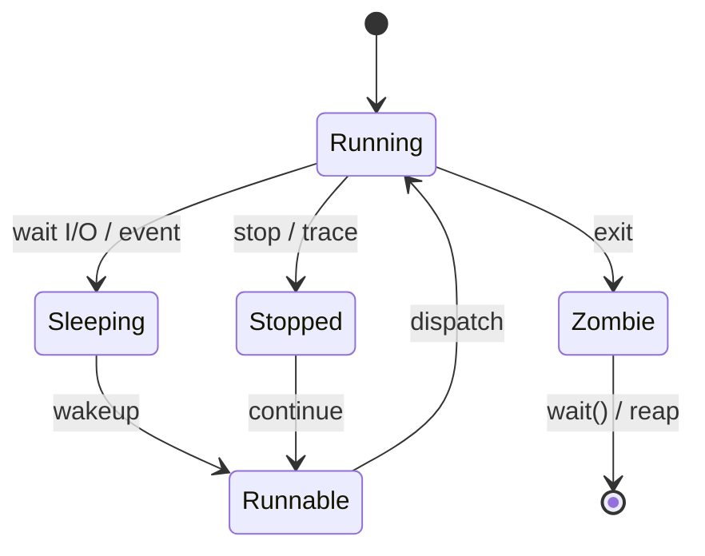

# Chủ đề 4 — Tiến trình trong Linux

> **Mục tiêu:** hiểu tiến trình (`process`) là gì, Linux kernel quản lý tiến trình ra sao, và vòng đời `fork() → execve() → exit() → wait()` hoạt động như thế nào.
>
> **Quy ước ngôn ngữ:** phần giải thích dùng Tiếng Việt. Giữ nguyên các thuật ngữ chuẩn cần đối chiếu với Linux/POSIX như `program image`, `scheduler`, `context switch`, `open file description`, `exit status`, `zombie`, `orphan process`, `reparenting`, `subreaper`, `PID namespace`, cùng tên API, `PID`, `PPID`, `COW` và `procfs`.
>
> Chương này chỉ có **lý thuyết**, không có bài thực hành.

Một **chương trình** là mã và dữ liệu nằm trên thiết bị lưu trữ; một **tiến trình** là một lần chương trình đó đang được thực thi với PID, không gian địa chỉ, `file descriptor`, thông tin quyền và trạng thái lập lịch riêng. Đây là phân biệt nền tảng để hiểu `fork()`, `execve()` và `wait()`.

Chương này trước hết xây mô hình “một tiến trình đang sở hữu những gì”, sau đó theo dõi vòng đời của nó: được tạo ra, có thể thay `program image` bằng `execve()`, kết thúc, trở thành zombie trong một khoảng thời gian và được tiến trình cha thu hồi bằng `wait()`.

**Cách đọc nếu bạn mới bắt đầu.** Trước hết hãy đọc phần **Nói đơn giản** ở đầu mỗi mục lớn để nắm câu hỏi mà mục đó đang giải quyết. Sau đó xem sơ đồ và ví dụ để hình thành mô hình trong đầu; chưa cần nhớ mọi cờ, mã lỗi hay trường hợp đặc biệt. Khi ý chính đã rõ, hãy đọc các mục `###` theo thứ tự và quay lại phần giải thích trước đó nếu gặp một thuật ngữ chưa quen.

---

## Mục lục

- [1. Chương trình và tiến trình khác nhau thế nào?](#1-chương-trình-và-tiến-trình-khác-nhau-thế-nào)
- [2. PID, PPID và cây tiến trình](#2-pid-ppid-và-cây-tiến-trình)
- [3. Một tiến trình đang nắm giữ những gì?](#3-một-tiến-trình-đang-nắm-giữ-những-gì)
- [4. Trạng thái tiến trình và `scheduler`](#4-trạng-thái-tiến-trình-và-scheduler)
- [5. `fork()`: tạo tiến trình con](#5-fork-tạo-tiến-trình-con)
- [6. `execve()`: thay `program image`](#6-execve-thay-program-image)
- [7. Kết thúc tiến trình và `exit status`](#7-kết-thúc-tiến-trình-và-exit-status)
- [8. Zombie, `wait()`, `orphan process` và chuyển tiến trình cha](#8-zombie-wait-orphan-process-và-chuyển-tiến-trình-cha)
- [9. Quan sát tiến trình qua `/proc`](#9-quan-sát-tiến-trình-qua-proc)
- [10. `ps`, `top` và góc nhìn của `scheduler`](#10-ps-top-và-góc-nhìn-của-scheduler)
- [11. Tư duy gỡ lỗi tiến trình](#11-tư-duy-gỡ-lỗi-tiến-trình)
- [12. Liên hệ với Embedded Linux](#12-liên-hệ-với-embedded-linux)
- [13. Tổng kết](#13-tổng-kết)
- [14. Tài liệu tham khảo](#14-tài-liệu-tham-khảo)

---

## 1. Chương trình và tiến trình khác nhau thế nào?

> **Nói đơn giản:** Chương trình là mã và dữ liệu thực thi nằm trên thiết bị lưu trữ; tiến trình là một lần chương trình đang được chạy với PID, bộ nhớ và tài nguyên riêng.

### 1.1 Chương trình là dữ liệu tĩnh

Một tệp thực thi (`executable`) trên filesystem chứa các thành phần như:

```text
machine code
data
ELF metadata
thông tin symbol/relocation tùy loại binary
```

Bản thân tệp không “đang chạy”.

### 1.2 Tiến trình là ngữ cảnh thực thi

Khi chương trình được chạy:

```text
Executable
    |
    v
Tiến trình
    |
    +--> PID
    +--> virtual address space
    +--> CPU register state
    +--> file descriptor
    +--> credentials
    +--> current working directory (cwd)
    +--> signal state
```

Một executable có thể tạo ra nhiều tiến trình độc lập.

### 1.3 Linux kernel nhìn tiến trình như thế nào?

Trong Linux kernel, đơn vị được lập lịch được biểu diễn bởi các cấu trúc task. Ở mức người mới, có thể dùng cách hình dung:

```text
tiến trình
  =
trạng thái thực thi
+
tài nguyên/tham chiếu
+
định danh
```

Khi sang đa luồng, ta sẽ thấy một tiến trình có thể có nhiều task/luồng.

---

## 2. PID, PPID và cây tiến trình

> **Nói đơn giản:** Mỗi tiến trình có PID; PPID cho biết tiến trình cha. Nhìn các PID/PPID giúp bạn thấy quan hệ tạo tiến trình trong hệ thống.

### 2.1 PID

`PID` là số định danh tiến trình trong một `PID namespace`.

Nó giúp các API và công cụ tham chiếu tiến trình:

```text
kill(pid, ...)
waitpid(pid, ...)
/proc/<pid>
```

### 2.2 PID có thể được tái sử dụng

Sau khi tiến trình kết thúc và được thu hồi đầy đủ, PID của nó có thể được dùng cho tiến trình mới.

Do đó:

> PID không phải định danh vĩnh viễn theo thời gian.

### 2.3 PPID

`PPID` là PID của tiến trình cha hiện tại.

Quan hệ cha/con rất quan trọng cho:

```text
fork()
wait()
zombie reaping
shell job creation
giám sát service
```

### 2.4 Cây tiến trình

```text
PID 1
 |
 +--> shell
 |     |
 |     +--> app A
 |     +--> app B
 |
 +--> child process của service manager
```

Quan hệ này có thể thay đổi khi tiến trình cha kết thúc và tiến trình con được reparent.

---

## 3. Một tiến trình đang nắm giữ những gì?

> **Nói đơn giản:** Một tiến trình không chỉ có code. Nó còn có không gian địa chỉ, `fd`, thư mục làm việc, biến môi trường, trạng thái signal và nhiều tài nguyên khác.

### 3.1 Không gian địa chỉ ảo

Một tiến trình không thao tác trực tiếp trên “RAM vật lý dạng một mảng duy nhất”. Nó nhìn thấy **không gian địa chỉ ảo**.

Mô hình đơn giản:

```text
địa chỉ thấp
+------------------+
| code / text      |
+------------------+
| data / BSS       |
+------------------+
| heap             |
|       ↓          |
|                  |
| mmap regions     |
|                  |
|       ↑          |
| stack            |
+------------------+
địa chỉ cao
```

Đây là mô hình khái niệm, không phải layout cố định cho mọi hệ thống.

### 3.2 `code`, `data`, BSS, heap và stack

`code/text`: mã máy của chương trình; **data**: biến global/static có giá trị khởi tạo; `BSS`: vùng static/global zero-initialized; **heap**: vùng cấp phát động; **stack**: frame lời gọi hàm, biến tự động và trạng thái thực thi.

### 3.3 Các ánh xạ `mmap`

Không gian địa chỉ còn có thể chứa: `shared library`, `file-backed mapping`, `anonymous mapping`, shared memory và `VDSO`.

### 3.4 Bộ nhớ ảo không bằng RAM vật lý

Một tiến trình có vùng địa chỉ ảo lớn không có nghĩa tất cả đều đang chiếm RAM vật lý.

Khái niệm cần tách:

```text
không gian địa chỉ ảo (`virtual address space`)
resident pages
shared pages
file-backed pages
swap/reclaim trạng thái
```

### 3.5 Bảng file descriptor

Mỗi tiến trình có bảng file descriptor:

```text
fd 0 -> stdin
fd 1 -> stdout
fd 2 -> stderr
fd 3 -> file/socket/device/pipe...
```

Sau `fork()`, tiến trình con nhận các file descriptor theo quy tắc kế thừa.

### 3.6 Ngữ cảnh filesystem

Tiến trình có: thư mục làm việc hiện tại, root directory view, umask và mount namespace context.

Những trạng thái này ảnh hưởng pathname lookup và tạo tệp.

### 3.7 `argv` và environment

`Program image` mới nhận `argument vector` và environment mới theo lời gọi `execve()`.

Đây là dữ liệu đầu vào lúc chương trình bắt đầu thực thi sau `exec`.

### 3.8 `credentials`

Tiến trình có nhiều giá trị UID/GID và capability/security ngữ cảnh liên quan quyền truy cập.

Không nên rút gọn thành “mỗi tiến trình chỉ có một user”.

---

## 4. Trạng thái tiến trình và `scheduler`

> **Nói đơn giản:** Tiến trình có thể chạy, chờ hoặc ngủ. Scheduler của Linux kernel quyết định tiến trình/luồng nào được dùng CPU tại từng thời điểm.

### 4.1 `running` và `runnable`

Hai khái niệm khác nhau:

`runnable`: đủ điều kiện chạy nhưng có thể đang đợi CPU; `running`: hiện đang thực sự được CPU thực thi.

### 4.2 `sleeping`

Khi tiến trình/luồng đợi sự kiện:

```text
I/O
mutex
timer
signal/event
resource
```

nó có thể ngủ thay vì tiêu tốn CPU.

### 4.3 Trạng thái `S`

Thường biểu diễn interruptible sleep: task đang chờ và có thể bị đánh thức bởi sự kiện/signal phù hợp.

### 4.4 Trạng thái `D`

`D` thường là uninterruptible sleep.

Nó thường xuất hiện khi task đang chờ ở Linux kernel path không thể bị signal thông thường đánh thức ngay.

`D` không tự động chứng minh disk/hardware hỏng; phải xem task đang chờ gì.

### 4.5 `stopped` và `traced`

Tiến trình có thể bị dừng bởi job control/signal hoặc debugger/tracing.

### 4.6 `zombie`

Zombie là tiến trình **đã kết thúc thực thi**, nhưng trạng thái kết thúc vẫn còn để tiến trình cha thu thập.

Zombie không tiếp tục chạy instruction bình thường.

### 4.7 `context switch`

```text
Task A RUNNING
      |
 save CPU context
      |
scheduler chọn Task B
      |
 restore Task B context
      |
Task B RUNNING
```

Đây là nền tảng để hiểu concurrency sau này.

---

## 5. `fork()`: tạo tiến trình con

> **Nói đơn giản:** `fork()` tạo tiến trình con từ tiến trình hiện tại. Sau lời gọi, cả cha và con tiếp tục chạy từ gần cùng một vị trí nhưng là hai tiến trình riêng.

### 5.1 Mô hình

```text
Parent process
     |
   fork()
    /   \
   /     \
Parent   Child
```

`fork()` thành công tạo một tiến trình con mới.

### 5.2 Hai luồng điều khiển

Sau `fork()`:

```text
parent: fork() trả PID của child
child : fork() trả 0
```

Cả hai tiếp tục từ điểm sau lời gọi `fork()`.

### 5.3 Hai không gian địa chỉ riêng

Ngay sau `fork()`, nội dung bộ nhớ logic trông rất giống nhau, nhưng parent và child có **không gian địa chỉ riêng**.

Thay đổi private memory ở child không trực tiếp sửa private memory của parent.

### 5.4 Copy-on-Write (COW)

Linux tránh sao chép ngay toàn bộ page memory.

Mô hình:

```text
Trước khi ghi (Copy-on-Write):
Parent mapping ----+
                    +--> cùng physical page
Child mapping -----+

Khi một bên ghi:
        |
        v
kernel copy physical page
        |
        v
Parent và Child trỏ tới các physical page riêng
```

Đây là `Copy-on-Write` (`COW`).

### 5.5 `file descriptor` sau `fork()`

Tiến trình cha và con có bảng `file descriptor` riêng nhưng các mục kế thừa có thể cùng tham chiếu **`open file description`**.

Vì vậy chúng có thể chia sẻ:

```text
vị trí đọc/ghi hiện tại (file offset)
các cờ trạng thái của tệp
đối tượng socket/pipe bên dưới
```

### 5.6 `fork()` không chạy chương trình mới

Child bắt đầu với cùng `program image` tương đương về mặt logic với parent.

Muốn chạy executable khác, thường dùng `exec` sau đó.

---

## 6. `execve()`: thay `program image`

> **Nói đơn giản:** `execve()` không tạo thêm tiến trình. Nó thay chương trình đang chạy bên trong tiến trình hiện tại bằng chương trình mới.

### 6.1 Ý nghĩa cốt lõi

`execve()` không tạo tiến trình mới.

Nó thay **`program image` của tiến trình hiện tại**.

```text
Tiến trình PID = 1200
  program A
     |
  execve(B)
     |
     v
Tiến trình PID = 1200
  program B
```

PID vẫn là định danh tiến trình; program image đã đổi.

### 6.2 Thành công thì không quay về code cũ

Nếu `execve()` thành công:

```text
old process image (code/data/stack)
        X
        |
        v
new executable image
```

Không có return bình thường về dòng code cũ sau lời gọi.

### 6.3 Những gì bị thay mạnh

Điển hình: `code`, dữ liệu tĩnh, heap, stack, phần lớn memory mapping và các `signal disposition` đã cài, theo quy tắc của POSIX/Linux.

### 6.4 Những gì có thể được giữ

Nhiều thuộc tính ở mức tiến trình vẫn tồn tại theo quy tắc POSIX/Linux, ví dụ PID và nhiều `credentials`/ngữ cảnh.

`file descriptor` không có `FD_CLOEXEC` có thể tồn tại qua `exec`.

### 6.5 Vì sao `FD_CLOEXEC` quan trọng?

Nếu một `file descriptor` nhạy cảm như socket, pipe hoặc fd của thiết bị vô tình được giữ lại sau `execve()`, nó có thể giữ tài nguyên tồn tại ngoài ý muốn hoặc tạo rủi ro truy cập.

### 6.6 Script `#!`

Một script bắt đầu bằng `shebang`: 

```text
#!/path/to/interpreter
```

được Linux kernel và cơ chế `exec` xử lý để chạy thông qua trình thông dịch (`interpreter`) tương ứng.

### 6.7 Mô hình Unix điển hình

```text
parent process
  |
fork
  |
child process setup
  |
exec
  |
new program image
```

Shell sử dụng mô hình này để chạy lệnh, kết hợp `redirection` và pipe.

---

## 7. Kết thúc tiến trình và `exit status`

> **Nói đơn giản:** Khi tiến trình kết thúc, nó để lại exit status để tiến trình cha có thể biết kết quả chạy thành công hay thất bại.

### 7.1 `exit()`

`exit()` là hàm thư viện C thực hiện một số bước dọn dẹp ở user space, như flush các stream `stdio` và chạy các hàm đăng ký bằng `atexit()`, rồi mới kết thúc tiến trình.

### 7.2 `_exit()` / `_Exit()`

Kết thúc tiến trình trực tiếp hơn mà không thực hiện cùng lớp dọn dẹp `stdio`/`atexit()` của `exit()`.

Sự khác biệt đặc biệt quan trọng sau `fork()` trong một số thiết kế.

### 7.3 `exit status`

Linux kernel giữ thông tin kết thúc để parent có thể thu thập bằng `wait()`/`waitpid()`.

`exit status` là một phần của giao thức cha–con.

---

## 8. Zombie, `wait()`, `orphan process` và chuyển tiến trình cha

> **Nói đơn giản:** Zombie là tiến trình đã kết thúc nhưng tiến trình cha chưa thu `exit status`. `Orphan process` là tiến trình mất cha ban đầu và được hệ thống nhận quản lý lại.

### 8.1 Vì sao zombie tồn tại?

Child đã kết thúc, nhưng parent chưa thu trạng thái.

```text
Child RUNNING
    |
  exit
    |
    v
ZOMBIE
    |
 parent wait()/waitpid()
    |
    v
REAPED
```

### 8.2 `wait()` / `waitpid()`

Tiến trình cha có thể chờ tiến trình con thay đổi trạng thái, đọc `exit status` và thu hồi mục zombie.

### 8.3 `zombie process` khác `orphan process`

`zombie`: đã kết thúc; `orphan`: tiến trình cha cũ biến mất; child có thể vẫn đang chạy.

Đây là hai khái niệm hoàn toàn khác nhau.

### 8.4 Reparenting

Khi tiến trình cha biến mất, tiến trình con có thể được chuyển sang một tiến trình như PID 1 hoặc subreaper tùy cấu hình.

### 8.5 PID 1

PID 1 có vai trò đặc biệt trong cây tiến trình (`process hierarchy`) và việc thu hồi các tiến trình hậu duệ đã được `reparent`.

Trong Embedded Linux, PID 1 có thể là: systemd, BusyBox init và một chương trình init tùy biến.

---

## 9. Quan sát tiến trình qua `/proc`

> **Nói đơn giản:** `/proc/<pid>` là cửa sổ quan sát trạng thái tiến trình từ không gian người dùng: command line, `fd`, memory map, trạng thái và nhiều thông tin khác.

### 9.1 `/proc/<pid>`

Đây là giao diện `procfs` cho trạng thái tiến trình trong Linux kernel.

### 9.2 `status`

`/proc/<pid>/status` là bản tóm tắt dễ đọc hơn cho người.

Có thể chứa:

```text
Name
Trạng thái
Pid
PPid
Uid/Gid
Vm* fields
thông tin signal
capability information
```

### 9.3 `stat`

`/proc/<pid>/stat` là biểu diễn cô đọng theo thứ tự trường, phù hợp cho công cụ nhưng phải phân tích đúng theo đặc tả.

### 9.4 `cmdline`

Hiển thị argument vector theo format của procfs.

Nó không phải “bản ghi lịch sử bất biến” của lệnh shell ban đầu.

### 9.5 `environ`

Hiển thị environment theo giao diện procfs với các caveat về permission và cách tiến trình quản lý bộ nhớ environment.

### 9.6 `cwd`, `root`, `exe`, `fd`

```text
/proc/<pid>/cwd
/proc/<pid>/root
/proc/<pid>/exe
/proc/<pid>/fd/
```

cho phép quan sát các tham chiếu quan trọng của tiến trình.

### 9.7 `maps`

`/proc/<pid>/maps` mô tả các các ánh xạ bộ nhớ ảo.

Nó không phải bản đồ RAM vật lý.

---

## 10. `ps`, `top` và góc nhìn của `scheduler`

> **Nói đơn giản:** `ps` cho ảnh chụp tại một thời điểm; `top` cập nhật liên tục. Cả hai giúp nhìn CPU, memory và trạng thái tiến trình ở mức người dùng.

### 10.1 `ps`

`ps` cho snapshot của tiến trình/task information.

Một task có thể đổi trạng thái ngay sau khi `ps` đọc dữ liệu.

### 10.2 `top`

`top` cập nhật theo chu kỳ, giúp thấy xu hướng CPU/memory nhưng số liệu phụ thuộc khoảng lấy mẫu.

### 10.3 Scheduling ở mức cơ bản

`scheduler` quyết định task runnable nào được CPU chạy.

Các khái niệm nâng cao như nice value, real-time policy, CPU affinity và cgroup scheduling nằm ngoài trọng tâm Chủ đề 4; ở đây chỉ cần nhớ rằng **tiến trình hoặc luồng không tự sở hữu CPU liên tục**.

---

## 11. Tư duy gỡ lỗi tiến trình

> **Nói đơn giản:** Debug tiến trình nên bắt đầu từ: tiến trình có tồn tại không, PID nào, đang ở trạng thái gì, exit status là gì và đang giữ tài nguyên nào.

### 11.1 Tiến trình “biến mất”

Hãy kiểm tra tiến trình đã thoát hay bị signal kết thúc, có `exec` sang chương trình khác không, PID có bị tái sử dụng không và service manager có khởi động lại tiến trình hay không.

### 11.2 PID còn nhưng tên chương trình đổi

Có thể tiến trình đã `execve()` chương trình khác.

PID giữ nguyên qua exec là hành vi bình thường.

### 11.3 Nhiều zombie

Thường cần xem logic thu hồi tiến trình con: tiến trình cha có gọi `wait()`/`waitpid()` không, chính sách xử lý `SIGCHLD` là gì và vòng đời tiến trình con được quản lý ra sao.

### 11.4 Task ở `D`

Tìm nó đang chờ tài nguyên trong Linux kernel nào thay vì kết luận ngay “tiến trình treo”.

### 11.5 Bộ nhớ nhìn rất lớn

Tách: virtual size, resident memory, ánh xạ dùng chung và ánh xạ dựa trên tệp.

### 11.6 `file offset` thay đổi lạ giữa parent/child

Sau `fork()`, file descriptor kế thừa có thể chia sẻ cùng `open file description` và vị trí đọc/ghi hiện tại (file offset).

---

## 12. Liên hệ với Embedded Linux

> **Nói đơn giản:** Embedded Linux thường chạy nhiều daemon/service nhỏ. Hiểu tiến trình giúp bạn đọc init script, systemd, watchdog và chẩn đoán chương trình treo hoặc thoát bất thường.

### 12.1 PID 1 và init

Hệ nhúng cần một tiến trình init để:

```text
khởi động service
thu child
quản lý shutdown/restart
```

### 12.2 Service architecture

Một ứng dụng lớn có thể được tách thành nhiều tiến trình để tăng khả năng cô lập lỗi (`fault isolation`), cô lập quyền (`privilege isolation`) và khởi động lại từng thành phần độc lập.

### 12.3 Kế thừa `file descriptor` của thiết bị

Nếu một tiến trình mở UART/device rồi `fork()`/`exec()`, fd có thể bị truyền sang child nếu không kiểm soát.

Điều này có thể giữ thiết bị hoặc socket sống ngoài ý muốn.

### 12.4 `/proc` trên hệ headless

Khi không có GUI, `/proc` là công cụ quan trọng để trả lời: tiến trình còn tồn tại không, nó đang chờ điều gì, đang mở những `fd` nào và không gian bộ nhớ được ánh xạ ra sao.

---

## 13. Tổng kết

> **Nói đơn giản:** Topic 04 cần để lại mô hình: tiến trình được tạo, có thể `exec` chương trình khác, chạy, kết thúc và được cha `wait` thu trạng thái.



Mô hình `fork` + `exec`:

```text
Parent process
     |
   fork()
    /   \
Parent  Child
          |
        execve()
          |
          v
      New program
```

Các ý cần nhớ:

1. Chương trình là tệp/mã; tiến trình là một thực thể đang thực thi.
2. PID là định danh có thể tái sử dụng.
3. PPID mô tả quan hệ cha hiện tại.
4. Tiến trình có không gian địa chỉ ảo (`virtual address space`), bảng fd, `cwd`, `credentials`, trạng thái signal...
5. Running khác runnable.
6. Sleeping thường không tiêu thụ CPU bằng busy-loop.
7. `fork()` tạo child với không gian địa chỉ riêng và COW.
8. File descriptor kế thừa qua `fork()` có thể cùng tham chiếu `open file description`.
9. `execve()` thay program image, không tạo PID mới.
10. `exit()` và `_exit()` khác nhau ở quá trình dọn dẹp ở userspace.
11. Zombie là child đã kết thúc chờ parent reap.
12. Orphan có thể vẫn chạy và được reparent.
13. `/proc/<pid>` là cửa sổ quan trọng vào tiến trình trạng thái.

---

## 14. Tài liệu tham khảo

> **Nói đơn giản:** Phần này liệt kê nguồn chuẩn về tiến trình, `fork`, `exec`, `wait` và `/proc`.

- `fork(2)`: https://man7.org/linux/man-pages/man2/fork.2.html
- `execve(2)`: https://man7.org/linux/man-pages/man2/execve.2.html
- `wait(2)`: https://man7.org/linux/man-pages/man2/wait.2.html
- `_exit(2)`: https://man7.org/linux/man-pages/man2/_exit.2.html
- `exit(3)`: https://man7.org/linux/man-pages/man3/exit.3.html
- `getpid(2)`: https://man7.org/linux/man-pages/man2/getpid.2.html
- `credentials(7)`: https://man7.org/linux/man-pages/man7/credentials.7.html
- Linux procfs documentation: https://docs.kernel.org/filesystems/proc.html
- POSIX.1-2024: https://pubs.opengroup.org/onlinepubs/9799919799/
- The Linux Programming Interface: https://man7.org/tlpi/

> **Điều hướng:** [← Chủ đề 3 — Vào/ra tệp](README-topic-03.md) · [Chủ đề 5 — Signal →](README-topic-05.md)
