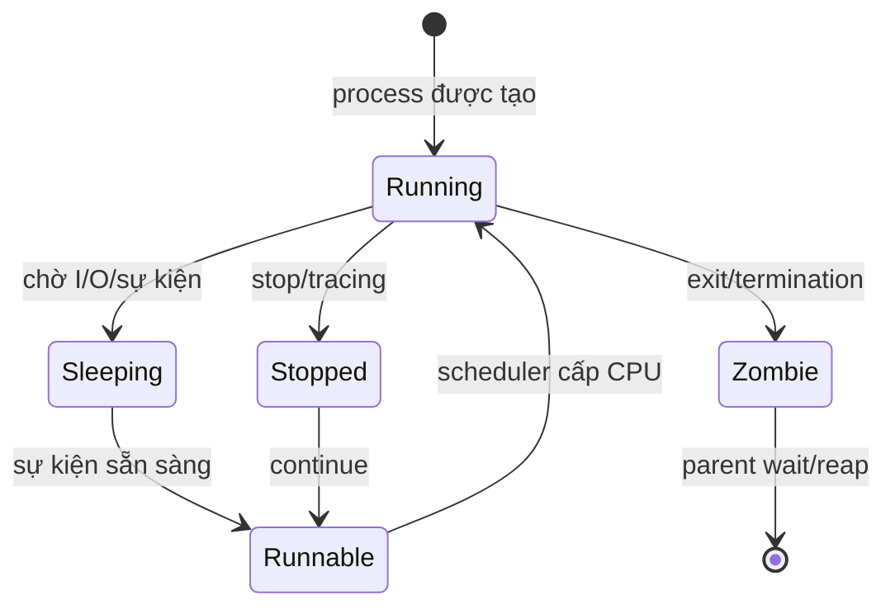

# Chủ đề 4 — Tiến trình trong Linux

> **Mục tiêu:** hiểu tiến trình (`process`) là gì, nhân Linux quản lý tiến trình ra sao, và vòng đời `fork() → execve() → exit() → wait()` hoạt động như thế nào.
>
> **Quy ước ngôn ngữ:** giải thích dùng Tiếng Việt; giữ nguyên tên API, `PID`, `PPID`, `COW`, `procfs` và các trạng thái chuẩn cần tra cứu.
>
> Chương này chỉ có **lý thuyết**, không có bài thực hành.

---

## Mục lục

- [1. Chương trình và tiến trình khác nhau thế nào?](#1-chương-trình-và-tiến-trình-khác-nhau-thế-nào)
- [2. PID, PPID và cây tiến trình](#2-pid-ppid-và-cây-tiến-trình)
- [3. Một tiến trình đang nắm giữ những gì?](#3-một-tiến-trình-đang-nắm-giữ-những-gì)
- [4. Trạng thái tiến trình và bộ lập lịch](#4-trạng-thái-tiến-trình-và-bộ-lập-lịch)
- [5. `fork()`: tạo tiến trình con](#5-fork-tạo-tiến-trình-con)
- [6. `execve()`: thay ảnh chương trình](#6-execve-thay-ảnh-chương-trình)
- [7. Kết thúc tiến trình và mã kết thúc](#7-kết-thúc-tiến-trình-và-mã-kết-thúc)
- [8. Zombie, `wait()`, tiến trình mồ côi và chuyển tiến trình cha](#8-zombie-wait-tiến-trình-mồ-côi-và-chuyển-tiến-trình-cha)
- [9. Quan sát tiến trình qua `/proc`](#9-quan-sát-tiến-trình-qua-proc)
- [10. `ps`, `top` và góc nhìn của bộ lập lịch](#10-ps-top-và-góc-nhìn-của-bộ-lập-lịch)
- [11. Tư duy gỡ lỗi tiến trình](#11-tư-duy-gỡ-lỗi-tiến-trình)
- [12. Liên hệ với Embedded Linux](#12-liên-hệ-với-embedded-linux)
- [13. Tổng kết](#13-tổng-kết)
- [14. Tài liệu tham khảo](#14-tài-liệu-tham-khảo)

---

## 1. Chương trình và tiến trình khác nhau thế nào?

> **Nói đơn giản:** chương trình là mã và dữ liệu nằm trên tệp thực thi; tiến trình là một lần chương trình đang được chạy với bộ nhớ, file descriptor, PID và trạng thái riêng.

### 1.1 Chương trình là dữ liệu tĩnh

Một executable trên filesystem chứa các thành phần như:

```text
machine code
data
ELF metadata
symbol/relocation information tùy loại binary
```

Bản thân tệp không “đang chạy”.

### 1.2 Tiến trình là ngữ cảnh thực thi

Khi chương trình được chạy:

```text
Executable
    |
    v
Tiến trình
    |
    +--> PID
    +--> virtual address space
    +--> register state
    +--> file descriptors
    +--> credentials
    +--> current working directory
    +--> signal state
```

Một executable có thể tạo ra nhiều tiến trình độc lập.

### 1.3 Nhân Linux nhìn tiến trình như thế nào?

Trong nhân Linux, đơn vị được lập lịch được biểu diễn bởi các cấu trúc task. Ở mức người mới, có thể dùng mental model:

```text
process
  =
execution state
+
resources/references
+
identity
```

Khi sang đa luồng, ta sẽ thấy một process có thể có nhiều task/thread.

---

## 2. PID, PPID và cây tiến trình

### 2.1 PID

`PID` là số định danh tiến trình trong một PID namespace.

Nó giúp các API và công cụ tham chiếu tiến trình:

```text
kill(pid, ...)
waitpid(pid, ...)
/proc/<pid>
```

### 2.2 PID có thể được tái sử dụng

Sau khi tiến trình kết thúc và được thu hồi đầy đủ, PID của nó có thể được dùng cho tiến trình mới.

Do đó:

> PID không phải định danh vĩnh viễn theo thời gian.

### 2.3 PPID

`PPID` là PID của tiến trình cha hiện tại.

Quan hệ cha/con rất quan trọng cho:

```text
fork()
wait()
zombie reaping
shell job creation
service supervision
```

### 2.4 Cây tiến trình

```text
PID 1
 |
 +--> shell
 |     |
 |     +--> app A
 |     +--> app B
 |
 +--> service manager child
```

Quan hệ này có thể thay đổi khi tiến trình cha kết thúc và tiến trình con được reparent.

---

## 3. Một tiến trình đang nắm giữ những gì?

### 3.1 Không gian địa chỉ ảo

Một tiến trình không thao tác trực tiếp trên “RAM vật lý dạng một mảng duy nhất”. Nó nhìn thấy **không gian địa chỉ ảo**.

Mô hình đơn giản:

```text
địa chỉ thấp
+------------------+
| code / text      |
+------------------+
| data / BSS       |
+------------------+
| heap             |
|       ↓          |
|                  |
| mmap regions     |
|                  |
|       ↑          |
| stack            |
+------------------+
địa chỉ cao
```

Đây là mô hình khái niệm, không phải layout cố định cho mọi hệ thống.

### 3.2 Code, data, BSS, heap, stack

```text
code/text
  mã máy của chương trình

data
  biến global/static có giá trị khởi tạo

BSS
  vùng static/global zero-initialized

heap
  vùng cấp phát động

stack
  frame lời gọi hàm, biến tự động và trạng thái thực thi
```

### 3.3 Các ánh xạ `mmap`

Không gian địa chỉ còn có thể chứa:

```text
shared libraries
file-backed mappings
anonymous mappings
shared memory
VDSO
```

### 3.4 Bộ nhớ ảo không bằng RAM vật lý

Một tiến trình có vùng địa chỉ ảo lớn không có nghĩa tất cả đều đang chiếm RAM vật lý.

Khái niệm cần tách:

```text
virtual address space
resident pages
shared pages
file-backed pages
swap/reclaim state
```

### 3.5 Bảng file descriptor

Mỗi tiến trình có bảng descriptor:

```text
fd 0 -> stdin
fd 1 -> stdout
fd 2 -> stderr
fd 3 -> file/socket/device/pipe...
```

Sau `fork()`, tiến trình con nhận các descriptor theo quy tắc kế thừa.

### 3.6 Ngữ cảnh filesystem

Tiến trình có:

```text
current working directory
root directory view
umask
mount namespace context
```

Những trạng thái này ảnh hưởng pathname lookup và tạo tệp.

### 3.7 `argv` và environment

Ảnh chương trình mới nhận:

```text
argument vector
environment
```

Đây là dữ liệu đầu vào lúc chương trình bắt đầu thực thi sau `exec`.

### 3.8 Credentials

Tiến trình có nhiều giá trị UID/GID và capability/security context liên quan quyền truy cập.

Không nên rút gọn thành “mỗi tiến trình chỉ có một user”.

---

## 4. Trạng thái tiến trình và bộ lập lịch

### 4.1 Running và runnable

Hai khái niệm khác nhau:

```text
runnable
  đủ điều kiện chạy nhưng có thể đang đợi CPU

running
  hiện đang thực sự được CPU thực thi
```

### 4.2 Sleeping

Khi tiến trình/luồng đợi sự kiện:

```text
I/O
mutex
timer
signal/event
resource
```

nó có thể ngủ thay vì tiêu tốn CPU.

### 4.3 Trạng thái `S`

Thường biểu diễn interruptible sleep: task đang chờ và có thể bị đánh thức bởi sự kiện/tín hiệu thích hợp.

### 4.4 Trạng thái `D`

`D` thường là uninterruptible sleep.

Nó thường xuất hiện khi task đang chờ ở kernel path không thể bị signal thông thường đánh thức ngay.

`D` không tự động chứng minh disk/hardware hỏng; phải xem task đang chờ gì.

### 4.5 Stopped và traced

Tiến trình có thể bị dừng bởi job control/signal hoặc debugger/tracing.

### 4.6 Zombie

Zombie là tiến trình **đã kết thúc thực thi**, nhưng trạng thái kết thúc vẫn còn để tiến trình cha thu thập.

Zombie không tiếp tục chạy instruction bình thường.

### 4.7 Chuyển ngữ cảnh

```text
Task A running
      |
 lưu CPU context
      |
Scheduler chọn B
      |
 khôi phục context B
      |
Task B running
```

Đây là nền tảng để hiểu concurrency sau này.

---

## 5. `fork()`: tạo tiến trình con

### 5.1 Mô hình

```text
Parent process
     |
   fork()
    /   \
   /     \
Parent   Child
```

`fork()` thành công tạo một tiến trình con mới.

### 5.2 Hai luồng điều khiển

Sau `fork()`:

```text
parent: fork() trả PID của child
child : fork() trả 0
```

Cả hai tiếp tục từ điểm sau lời gọi `fork()`.

### 5.3 Hai không gian địa chỉ riêng

Ngay sau `fork()`, nội dung bộ nhớ logic trông rất giống nhau, nhưng parent và child có **không gian địa chỉ riêng**.

Thay đổi private memory ở child không trực tiếp sửa private memory của parent.

### 5.4 Copy-on-Write

Linux tránh sao chép ngay toàn bộ page memory.

Mô hình:

```text
trước khi ghi:
Parent page ----+
                +--> cùng physical page
Child page -----+

khi một bên ghi:
        |
        v
copy page
        |
Parent và Child có bản riêng
```

Đây là `Copy-on-Write` (`COW`).

### 5.5 File descriptor sau `fork()`

Parent và child có descriptor table riêng nhưng các entry kế thừa có thể cùng tham chiếu **mô tả tệp đang mở**.

Vì vậy chúng có thể chia sẻ:

```text
file offset
file status flags
underlying socket/pipe object
```

### 5.6 `fork()` không chạy chương trình mới

Child bắt đầu với cùng program image logic như parent.

Muốn chạy executable khác, thường dùng `exec` sau đó.

---

## 6. `execve()`: thay ảnh chương trình

### 6.1 Ý nghĩa cốt lõi

`execve()` không tạo tiến trình mới.

Nó thay **ảnh chương trình của tiến trình hiện tại**.

```text
Process PID = 1200
  program A
     |
  execve(B)
     |
     v
Process PID = 1200
  program B
```

PID vẫn là process identity; program image đã đổi.

### 6.2 Thành công thì không quay về code cũ

Nếu `execve()` thành công:

```text
old code/data/stack image
        X
        |
        v
new executable image
```

Không có return bình thường về dòng code cũ sau lời gọi.

### 6.3 Những gì bị thay mạnh

Điển hình:

```text
code
static data
heap
stack
most mappings
caught signal dispositions theo rules
```

### 6.4 Những gì có thể được giữ

Nhiều thuộc tính process-level vẫn tồn tại theo quy tắc POSIX/Linux, ví dụ PID và nhiều credential/context.

File descriptor không có `FD_CLOEXEC` có thể tồn tại qua `exec`.

### 6.5 Vì sao `FD_CLOEXEC` quan trọng?

Nếu descriptor nhạy cảm vô tình lọt vào chương trình mới:

```text
socket
pipe
device fd
file fd
```

nó có thể giữ tài nguyên sống hoặc tạo rủi ro quyền truy cập.

### 6.6 Script `#!`

Một script bắt đầu bằng shebang:

```text
#!/path/to/interpreter
```

được kernel/exec mechanism xử lý để chạy thông qua interpreter tương ứng.

### 6.7 Mô hình Unix điển hình

```text
parent
  |
fork
  |
child setup
  |
exec
  |
new program
```

Shell sử dụng mô hình này để chạy command, kết hợp redirection và pipe.

---

## 7. Kết thúc tiến trình và mã kết thúc

### 7.1 `exit()`

`exit()` là hàm thư viện C thực hiện cleanup ở mức userspace như:

```text
flush stdio theo rules
atexit handlers
```

rồi kết thúc tiến trình.

### 7.2 `_exit()` / `_Exit()`

Kết thúc tiến trình trực tiếp hơn mà không thực hiện cùng lớp cleanup stdio/`atexit()` của `exit()`.

Sự khác biệt đặc biệt quan trọng sau `fork()` trong một số thiết kế.

### 7.3 Mã kết thúc

Kernel giữ thông tin termination để parent có thể thu thập bằng `wait()`/`waitpid()`.

Mã kết thúc là một phần của giao thức parent-child.

---

## 8. Zombie, `wait()`, tiến trình mồ côi và chuyển tiến trình cha

### 8.1 Vì sao zombie tồn tại?

Child đã kết thúc, nhưng parent chưa thu trạng thái.

```text
Child running
    |
  exit
    |
    v
Zombie
    |
 parent wait()
    |
    v
Reaped
```

### 8.2 `wait()` / `waitpid()`

Parent có thể:

```text
chờ child thay đổi trạng thái
đọc exit status
thu hồi zombie entry
```

### 8.3 Zombie khác orphan

```text
zombie
  đã kết thúc

orphan
  tiến trình cha cũ biến mất; child có thể vẫn đang chạy
```

Đây là hai khái niệm hoàn toàn khác nhau.

### 8.4 Reparenting

Khi parent biến mất, child có thể được chuyển sang một tiến trình như PID 1 hoặc subreaper tùy cấu hình.

### 8.5 PID 1

PID 1 có vai trò đặc biệt trong process hierarchy và việc thu hồi các descendant bị reparent.

Trong Embedded Linux, PID 1 có thể là:

```text
systemd
BusyBox init
custom init
```

---

## 9. Quan sát tiến trình qua `/proc`

### 9.1 `/proc/<pid>`

Đây là giao diện `procfs` cho trạng thái process trong kernel.

### 9.2 `status`

`/proc/<pid>/status` là bản tóm tắt dễ đọc hơn cho người.

Có thể chứa:

```text
Name
State
Pid
PPid
Uid/Gid
Vm* fields
signal information
capability information
```

### 9.3 `stat`

`/proc/<pid>/stat` là biểu diễn compact theo thứ tự trường, phù hợp cho tool nhưng cần parse đúng đặc tả.

### 9.4 `cmdline`

Hiển thị argument vector theo format của procfs.

Nó không phải “bản ghi lịch sử bất biến” của lệnh shell ban đầu.

### 9.5 `environ`

Hiển thị environment theo giao diện procfs với các caveat về permission và cách tiến trình quản lý bộ nhớ environment.

### 9.6 `cwd`, `root`, `exe`, `fd`

```text
/proc/<pid>/cwd
/proc/<pid>/root
/proc/<pid>/exe
/proc/<pid>/fd/
```

cho phép quan sát các reference quan trọng của tiến trình.

### 9.7 `maps`

`/proc/<pid>/maps` mô tả các virtual memory mappings.

Nó không phải bản đồ RAM vật lý.

---

## 10. `ps`, `top` và góc nhìn của bộ lập lịch

### 10.1 `ps`

`ps` cho snapshot của process/task information.

Một task có thể đổi trạng thái ngay sau khi `ps` đọc dữ liệu.

### 10.2 `top`

`top` cập nhật theo chu kỳ, giúp thấy xu hướng CPU/memory nhưng số liệu phụ thuộc khoảng lấy mẫu.

### 10.3 Scheduling ở mức cơ bản

Bộ lập lịch quyết định task runnable nào được CPU chạy.

Các khái niệm nâng cao như:

```text
nice
real-time policy
CPU affinity
cgroup scheduling
```

nằm ngoài trọng tâm Topic 4; chỉ cần nhớ rằng **process/thread không tự sở hữu CPU liên tục**.

---

## 11. Tư duy gỡ lỗi tiến trình

### 11.1 Process “biến mất”

Hỏi:

```text
process đã exit?
bị signal terminate?
exec sang program khác?
PID đã được reuse?
service manager restart?
```

### 11.2 PID còn nhưng tên chương trình đổi

Có thể tiến trình đã `execve()` chương trình khác.

PID giữ nguyên qua exec là hành vi bình thường.

### 11.3 Nhiều zombie

Thường cần xem logic parent reaping:

```text
parent có wait không?
SIGCHLD policy?
child lifecycle?
```

### 11.4 Task ở `D`

Tìm nó đang chờ kernel resource nào thay vì kết luận ngay “process treo”.

### 11.5 Bộ nhớ nhìn rất lớn

Tách:

```text
virtual size
resident memory
shared mapping
file-backed mapping
```

### 11.6 File offset thay đổi lạ giữa parent/child

Sau `fork()`, descriptor kế thừa có thể chia sẻ cùng open file description và file offset.

---

## 12. Liên hệ với Embedded Linux

### 12.1 PID 1 và init

Hệ nhúng cần một tiến trình init để:

```text
khởi động service
thu child
quản lý shutdown/restart
```

### 12.2 Service architecture

Một ứng dụng lớn có thể được tách thành nhiều process để tăng:

```text
fault isolation
privilege isolation
restart independence
```

### 12.3 Inheritance của device fd

Nếu một process mở UART/device rồi `fork()`/`exec()`, fd có thể bị truyền sang child nếu không kiểm soát.

Điều này có thể giữ thiết bị hoặc socket sống ngoài ý muốn.

### 12.4 `/proc` trên hệ headless

Khi không có GUI, `/proc` là công cụ quan trọng để trả lời:

```text
process có tồn tại?
đang chờ gì?
mở fd nào?
memory mapping ra sao?
```

---

## 13. Tổng kết



Mô hình `fork` + `exec`:

```text
Parent process
     |
   fork()
    /   \
Parent  Child
          |
        execve()
          |
          v
      New program
```

Các ý cần nhớ:

1. Chương trình là tệp/mã; tiến trình là một instance đang thực thi.
2. PID là định danh có thể tái sử dụng.
3. PPID mô tả quan hệ cha hiện tại.
4. Tiến trình có virtual address space, fd table, cwd, credentials, signal state...
5. Running khác runnable.
6. Sleeping thường không tiêu thụ CPU bằng busy-loop.
7. `fork()` tạo child với address space logic riêng và COW.
8. Descriptor kế thừa qua `fork()` có thể cùng tham chiếu open file description.
9. `execve()` thay program image, không tạo PID mới.
10. `exit()` và `_exit()` khác nhau ở userspace cleanup.
11. Zombie là child đã kết thúc chờ parent reap.
12. Orphan có thể vẫn chạy và được reparent.
13. `/proc/<pid>` là cửa sổ quan trọng vào process state.

---

## 14. Tài liệu tham khảo

- `fork(2)`: https://man7.org/linux/man-pages/man2/fork.2.html
- `execve(2)`: https://man7.org/linux/man-pages/man2/execve.2.html
- `wait(2)`: https://man7.org/linux/man-pages/man2/wait.2.html
- `_exit(2)`: https://man7.org/linux/man-pages/man2/_exit.2.html
- `exit(3)`: https://man7.org/linux/man-pages/man3/exit.3.html
- `getpid(2)`: https://man7.org/linux/man-pages/man2/getpid.2.html
- `credentials(7)`: https://man7.org/linux/man-pages/man7/credentials.7.html
- Linux procfs documentation: https://docs.kernel.org/filesystems/proc.html
- POSIX.1-2024: https://pubs.opengroup.org/onlinepubs/9799919799/
- The Linux Programming Interface: https://man7.org/tlpi/

> **Điều hướng:** [← Chủ đề 3 — Vào/ra tệp](README-topic-03.md) · [Chủ đề 5 — Tín hiệu →](README-topic-05.md)
