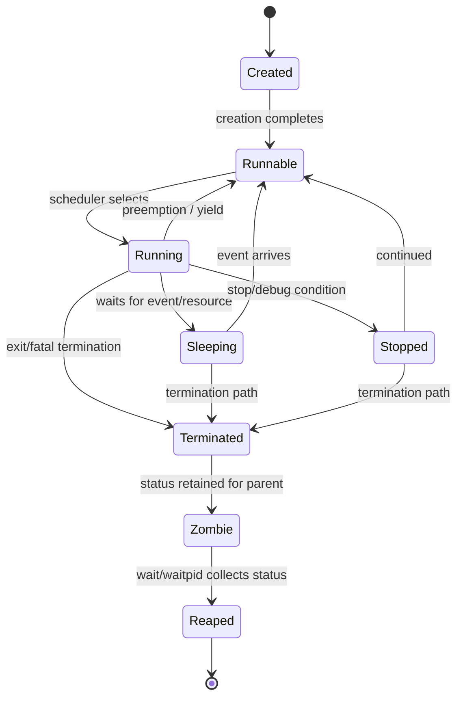

# Chủ đề 4 — Process trong Linux

> **Mục tiêu dễ hiểu:** Hiểu process là một chương trình đang chạy với identity, bộ nhớ/tài nguyên và vòng đời riêng; sau đó nối `fork`, `exec`, `wait` vào cùng một mô hình.
>
> **Bạn cần biết trước:** Biết file descriptor từ Topic 3 và command execution ở Topic 1.
>
> **Các từ khóa sẽ gặp nhiều:**
> - **program** = file/code tĩnh; process = instance đang chạy
> - **PID** = process ID
> - **fork** = tạo child process
> - **exec** = thay program image của process hiện tại
> - **wait** = parent thu trạng thái kết thúc của child
>
> **Quy ước đọc thuật ngữ:** khi gặp `state`, `context`, `semantics`, `object`, hãy hiểu lần lượt là **trạng thái**, **ngữ cảnh**, **hành vi theo chuẩn**, **đối tượng/tài nguyên**. Tên API và thuật ngữ chuẩn như process, thread, socket, mutex được giữ nguyên để bạn quen dần với tài liệu kỹ thuật.
>
> **Cách đọc nếu bạn mới bắt đầu:**
> 1. Lượt đầu chỉ đọc các ô **“Nói đơn giản”**, sơ đồ ASCII/Mermaid và phần **Tổng kết**.
> 2. Lượt hai đọc các mục `###` để hiểu API/khái niệm cụ thể.
> 3. Các mục `####`, caveat POSIX/Linux và edge case có thể để lần đọc thứ ba. **Không cần hiểu hết trong một lượt.**
>
> Chương này chỉ có **lý thuyết**, không có lab hay bài tập thực hành. Thuật ngữ tiếng Anh được giữ khi đó là tên chuẩn, nhưng luôn ưu tiên giải thích ý nghĩa trước.
---

## Mục lục

- [1. Program khác Process như thế nào?](#1-program-khác-process-như-thế-nào)
- [2. PID, PPID và cây Process](#2-pid-ppid-và-cây-process)
- [3. Một Process đang sở hữu những gì?](#3-một-process-đang-sở-hữu-những-gì)
- [4. Process chạy, chờ và được Scheduler chuyển CPU ra sao?](#4-process-chạy-chờ-và-được-scheduler-chuyển-cpu-ra-sao)
- [5. `fork()`: tạo Child Process](#5-fork-tạo-child-process)
- [6. `execve()`: thay chương trình đang chạy trong Process](#6-execve-thay-chương-trình-đang-chạy-trong-process)
- [7. Process kết thúc và Exit Status](#7-process-kết-thúc-và-exit-status)
- [8. Zombie, `wait()`, Orphan và Reparenting](#8-zombie-wait-orphan-và-reparenting)
- [9. Toàn bộ vòng đời Process](#9-toàn-bộ-vòng-đời-process)
- [10. Quan sát Process qua `/proc/<pid>`](#10-quan-sát-process-qua-procpid)
- [11. Quan sát Process với `ps` và `top`](#11-quan-sát-process-với-ps-và-top)
- [12. Process Isolation và Scheduling cơ bản](#12-process-isolation-và-scheduling-cơ-bản)
- [13. Khi Process có vấn đề: tư duy Debugging](#13-khi-process-có-vấn-đề-tư-duy-debugging)
- [14. Liên hệ với Embedded Linux](#14-liên-hệ-với-embedded-linux)
- [15. Tổng kết và Mô hình tư duy](#15-tổng-kết-và-mô-hình-tư-duy)
- [16. Tài liệu tham khảo](#16-tài-liệu-tham-khảo)

---

## 1. Program khác Process như thế nào?

> **Nói đơn giản:** Program là code trên storage; process là một lần thực thi sống của program, có PID, bộ nhớ, fd và trạng thái riêng.

> **Hình dung:** File executable trên disk giống bản nhạc; process giống một lần ban nhạc đang biểu diễn bản nhạc đó. Một program có thể có nhiều process chạy cùng lúc.


### 1.1 Program và process khác nhau ở đâu?


Một **program** là mô tả tĩnh về code/dữ liệu cần để thực thi. Nó có thể là:

```text
ELF executable
shell script
interpreter script
```

và nằm trên filesystem mà không cần có process nào đang chạy.

Một **process** là một instance thực thi có state do kernel quản lý.

```text
Program file
    |
    | execute
    v
+-----------------------------+
|           Process           |
|-----------------------------|
| PID / PPID                  |
| virtual address space       |
| CPU execution state         |
| file-descriptor table       |
| cwd / root / umask          |
| credentials                 |
| environment                 |
| scheduling state            |
| kernel bookkeeping          |
+-----------------------------+
```

Do đó:

```text
program  = static executable description
process  = dynamic execution context
```

Một executable có thể tạo nhiều process độc lập:

```text
/usr/bin/app
   |
   +--> PID 1010
   +--> PID 1042
   +--> PID 1201
```

Các process này có thể dùng cùng executable nhưng khác:

```text
PID
address-space state
open files
environment
cwd
execution progress
```

---

### 1.2 Process là một execution context


Định nghĩa “program đang chạy” là đúng nhưng chưa đủ.

Process gồm nhiều loại state:

```text
Identity
  PID, PPID, process-group/session context

Memory
  address space, mappings, heap, stack

CPU execution context
  registers, program counter, stack pointer

I/O
  file-descriptor table

Filesystem context
  cwd, root, umask

Security
  UID/GID credentials, capabilities context

Runtime state
  environment, signal state, resource limits,
  accounting, scheduler state
```

Mô hình tư duy:

```text
Process
   =
program image
   +
kernel-managed execution state
   +
references to kernel/system resources
```

Kernel phải giữ đủ state để:

```text
schedule process
pause/resume process
perform access checks
track memory
track open files
handle termination
report status to parent/userspace
```

---

### 1.3 Linux kernel nhìn process như thế nào?


Ở userspace ta nói “process”.

Linux kernel dùng task model, với `task_struct` là structure trung tâm cho schedulable execution entities.

Mô hình tư duy:

```text
Userspace view:
Process

Kernel view:
Task / task_struct
```

Với single-threaded process, hai view khá gần nhau.

Với multithreaded process:

```text
one userspace process
        |
        +--> task/thread A
        +--> task/thread B
        +--> task/thread C
```

Do đó không nên khẳng định:

```text
1 task_struct = 1 userspace process
```

trong mọi trường hợp.

Topic này chủ yếu dùng single-threaded mô hình tư duy để làm rõ `fork/exec/wait/exit`.

---

## 2. PID, PPID và cây Process

> **Nói đơn giản:** PID giúp kernel/userspace định danh process. PPID cho biết quan hệ parent-child; nhiều process tạo thành cây process.


### 2.1 PID và process identity


Mỗi process có process ID:

```text
PID
```

PID là integer identifier dùng để process được tham chiếu trong nhiều interfaces:

```text
waitpid()
kill()
ptrace()
setpriority()
/proc/<pid>
process monitoring
```

PID không phải:

```text
pointer
memory address
inode
file descriptor
```

Mô hình tư duy:

```text
PID
 |
 +--> process identity in current PID-namespace context
```

Linux hiện đại có PID namespaces, vì vậy cùng một task có thể có các PID khác nhau khi nhìn từ namespace khác nhau. Chi tiết namespaces nằm ngoài Topic 4.

---

### 2.2 PPID và quan hệ parent/child


Một process còn có:

```text
PPID
```

— parent process ID.

Khi parent tạo child bằng `fork()`:

```text
Parent PID = 200
      |
      | fork()
      v
Child PID = 201

Child PPID = 200
```

Parent/child relationship quan trọng cho:

```text
termination notification
wait/reaping
process hierarchy
reparenting
```

Nhưng child không phải “memory object nằm trong parent”.

Sau fork, child là process riêng.

---

### 2.3 PID reuse và vì sao PID không phải identity vĩnh viễn


PID được cấp từ finite ID space.

Sau khi process terminate và được reaped hoàn toàn, PID có thể được tái sử dụng:

```text
t1:
PID 500 -> process A

A exits + reaped

t2:
PID 500 -> process B
```

Vì vậy khi debugging/monitoring historical state, PID thường cần đi kèm context như:

```text
start time
executable
namespace
parent relation
```

---

### 2.4 Process hierarchy


Parent/child relationships tạo process tree:

```text
PID 1
 |
 +-- service-A
 |    |
 |    +-- worker-A1
 |    +-- worker-A2
 |
 +-- login/session
      |
      +-- shell
           |
           +-- application
```

Cây này mô tả **creation/vòng đời relationship**.

Nó không tự có nghĩa:

```text
memory hierarchy
privilege hierarchy
CPU-priority hierarchy
```

---

## 3. Một Process đang sở hữu những gì?

> **Nói đơn giản:** Một process không chỉ có code: nó còn có virtual bộ nhớ, stack/heap, fd, cwd, environment, credentials và nhiều kernel-managed tài nguyên.


### 3.1 Process resources


Process giữ private state và references tới shared kernel resources.

```text
Process
 |
 +--> virtual-memory context
 |
 +--> file-descriptor table
 |      |
 |      +--> files
 |      +--> pipes
 |      +--> sockets
 |      +--> devices
 |
 +--> cwd / root
 |
 +--> credentials
 |
 +--> signal state
 |
 +--> resource limits
 |
 +--> namespace memberships
 |
 +--> scheduler/accounting state
```

Important distinction:

```text
private process state
        !=
all underlying resources are private
```

Ví dụ hai process có thể cùng refer:

```text
same open file description
same shared-memory mapping
same executable/library pages
same pipe/socket endpoints
```

---

### 3.2 Virtual address space


Normal userspace process có virtual address space.

```text
Process A virtual addresses
         |
         | page tables / MMU
         v
physical pages / files / swap


Process B virtual addresses
         |
         | different mappings
         v
physical pages / files / swap
```

Virtual address space cho phép:

```text
isolation
memory protection
shared-library mappings
copy-on-write
memory-mapped files
demand paging
```

Cùng virtual address ở process A và B không nhất thiết trỏ cùng physical memory.

---

### 3.3 Code, data, BSS, heap, mappings và stack


Textbook layout:

```text
High virtual addresses
+---------------------------+
| stack                     |
+---------------------------+
| mmap/shared libraries     |
| anonymous mappings        |
+---------------------------+
| heap                      |
+---------------------------+
| BSS                       |
+---------------------------+
| initialized data          |
+---------------------------+
| executable code/text      |
+---------------------------+
Low virtual addresses
```

Đây là mô hình tư duy, không phải fixed map.

Actual layout phụ thuộc:

```text
architecture
ELF
dynamic loader
ASLR
kernel
compiler/linker
mmap activity
```

#### 3.3.1 Code/Text

Executable instructions/mappings.

#### 3.3.2 Initialized data

Global/static objects có initial data stored by executable.

#### 3.3.3 BSS

Zero-initialized/uninitialized static storage.

#### 3.3.4 Heap

Dynamic-allocation region concept; allocators có thể dùng cả `brk` lẫn `mmap`.

#### 3.3.5 Stack

Execution frames, local automatic variables, call/return state theo ABI/compiler.

#### 3.3.6 Mappings

Shared libraries, mapped files, anonymous mappings, VDSO, shared memory...

---

### 3.4 Virtual memory không đồng nghĩa physical RAM


Một process có thể có:

```text
large virtual size
```

nhưng physical resident memory nhỏ hơn.

Reasons:

```text
not-yet-resident pages
shared pages
file-backed pages
copy-on-write
reserved mappings
swap
```

Mô hình tư duy:

```text
virtual region
    |
    +--> resident RAM
    +--> file-backed page
    +--> shared physical page
    +--> swapped page
    +--> not currently instantiated
```

Do đó:

```text
VmSize != amount of RAM exclusively owned by process
```

---

### 3.5 File descriptor table trong process


Topic 3 đã xây:

```text
Process
  |
  v
FD table
  |
  +--> fd 0
  +--> fd 1
  +--> fd 2
  +--> fd 3...
```

Sau `fork()` child nhận descriptor-table entries theo inheritance semantics.

Các entries có thể cùng refer underlying open file descriptions.

```text
Parent fd 3 ----+
                |
                v
         Open File Description
                ^
                |
Child fd 3 -----+
```

Vì vậy process creation ảnh hưởng trực tiếp I/O state.

---

### 3.6 Filesystem context: cwd, root, umask


Process có:

```text
current working directory
root directory used for pathname resolution
umask
```

Concept:

```text
Process
 |
 +--> cwd  = /home/app
 +--> root = /
 +--> umask = 0022
```

Relative pathname phụ thuộc cwd.

Child thường inherit filesystem context qua fork.

`execve()` không tự đổi cwd sang thư mục chứa executable.

---

### 3.7 `argv` và environment


Khi program image mới được tạo bởi `execve()`:

```text
argv[]
envp[]
```

được cung cấp cho program.

```text
execve(executable, argv, envp)
           |
           v
new program image
       |
       +--> command arguments
       +--> environment
```

`argv` và environment là hai channels khác nhau:

```text
argv
  explicit invocation parameters

environment
  ambient key=value runtime context
```

---

### 3.8 Process credentials


Linux process có nhiều identity/credential values:

```text
real UID/GID
effective UID/GID
saved IDs
supplementary groups
```

Mô hình tư duy:

```text
process credentials
        |
        v
kernel access/security decisions
        |
        +--> filesystem
        +--> signals
        +--> privileged operations
```

Không nên coi “process thuộc user X” là một single immutable field cho mọi access decision.

Capabilities và security modules là tầng nâng cao.

---

## 4. Process chạy, chờ và được Scheduler chuyển CPU ra sao?

> **Nói đơn giản:** Process có thể running, runnable, sleeping, stopped, zombie... Scheduler chuyển CPU giữa các runnable tasks.


### 4.1 Process states


`/proc/<pid>/status` có user-visible states như:

```text
R  running
S  sleeping
D  disk sleep / uninterruptible sleep
T  stopped
t  tracing stop
Z  zombie
X  dead
```

Mô hình tư duy:

```text
created
   ↓
runnable/running
   ↔
sleeping/waiting
   ↔
stopped
   ↓
terminated
   ↓
zombie
   ↓
reaped
```

Kernel internal state model chi tiết hơn.

---

### 4.2 Running và runnable


Hai khái niệm:

```text
runnable
  task đủ điều kiện để được CPU chạy

running
  task đang thực sự execute trên CPU
```

Ví dụ:

```text
Run queue:
 A
 B
 C

CPU executes B
```

A và C runnable nhưng chưa running.

Trên multicore, nhiều tasks có thể running đồng thời trên các CPU khác nhau.

---

### 4.3 Sleeping: `S` và `D`


#### 4.3.1 `S` — interruptible sleeping

Task đang đợi event/resource, ví dụ:

```text
timer
pipe/socket data
child state
event
```

và có thể được đánh thức theo event/signal semantics.

#### 4.3.2 `D` — uninterruptible sleep

Task đang đợi trong kernel state không xử lý normal interruption theo cùng cách.

Nó thường xuất hiện trong I/O/resource paths.

Không nên suy luận:

```text
D = disk hỏng
```

Tên “disk sleep” là shorthand lịch sử.

---

### 4.4 Stopped, traced, zombie và dead


#### 4.4.1 Stopped

Process execution đang dừng, ví dụ job-control/debug context.

#### 4.4.2 Traced

Debugger/ptrace stop.

#### 4.4.3 Zombie

Execution đã kết thúc nhưng parent chưa collect status.

#### 4.4.4 Dead

Kernel có internal/user-visible dead state trong một số context, thường transient.

Quan trọng nhất:

```text
Z != sleeping
Z != running
```

Zombie không còn chạy normal user code.

---

### 4.5 Context switch ở mức mô hình tư duy


Scheduler có thể chuyển CPU:

```text
CPU running A
    |
save A CPU context
    |
select B
    |
restore B CPU context
    |
CPU running B
```

Context có thể gồm:

```text
register state
program counter
stack pointer
scheduler/accounting state
memory-context references
```

Không có nghĩa toàn bộ address space bị copy mỗi lần switch.

---

## 5. `fork()`: tạo Child Process

> **Nói đơn giản:** `fork()` tạo child từ trạng thái parent. Parent và child là hai process riêng; Linux dùng copy-on-write để tránh copy bộ nhớ ngay lập tức.

> **Hình dung:** `fork()` giống tách một execution thành hai process có trạng thái ban đầu rất giống nhau; sau đó parent và child chạy độc lập.


### 5.1 Vì sao Unix tách `fork()` và `exec()`?


Unix process model tách:

```text
fork()
  create child based on current process

exec()
  replace current process's program image
```

Mô hình tư duy:

```text
Parent
  |
 fork
 /  \
P    C
      |
     exec
      |
   new program
```

Khoảng giữa `fork()` và `exec()` cho phép child setup:

```text
file-descriptor redirection
pipes
cwd
environment
credentials
resource limits
```

Đây là nền của shell/process launching.

---

### 5.2 `fork()` tạo child như thế nào?


Linux `fork(2)` mô tả:

```text
fork() creates a new process by duplicating the calling process
```

Sau success:

```text
Parent
  |
  +--> Child
```

Child có:

```text
unique PID
PPID = parent PID
separate ordinary virtual address space
inherited/copy/share state theo rules
```

“Duplicate” không có nghĩa mọi physical resource bị copy ngay.

---

### 5.3 Parent và child có address space riêng


Tại thời điểm fork, private-memory contents logically giống nhau.

```text
Before fork:

Parent:
x = 10


After fork:

Parent: x = 10
Child:  x = 10
```

Sau parent write:

```text
Parent: x = 20
Child:  x = 10
```

nếu đó là ordinary private memory.

Shared mappings là trường hợp khác.

---

### 5.4 Copy-on-write


Linux `fork()` dùng copy-on-write cho many private memory pages.

Immediately after fork:

```text
Parent page table ----+
                      |
                      +--> physical page A
                      |
Child page table -----+
```

Khi parent write:

```text
write fault
   |
   v
copy page as needed
```

Sau đó:

```text
Parent -> page B (modified)
Child  -> page A (original)
```

Copy-on-write giảm chi phí eager copying toàn bộ memory.

Nhưng `fork()` vẫn có cost:

```text
new task structures
page-table work
kernel bookkeeping
later COW faults
```

---

### 5.5 Return value của `fork()`


Một call tạo hai return paths:

```text
                 fork()
               /        \
              /          \
        Parent            Child
   return child PID       return 0
```

Failure:

```text
parent gets -1
no child created
```

Do đó source code sau fork có thể chạy ở cả parent và child, phân biệt bằng return value.

---

### 5.6 Inheritance sau `fork()`


Child bắt đầu với nhiều state giống/inherited từ parent:

```text
address-space contents
file descriptors
cwd/root
environment
credentials
resource limits
signal dispositions
```

Nhưng không phải mọi thứ giống tuyệt đối.

Ví dụ child có:

```text
new PID
PPID set to parent
empty pending-signal set
reset CPU/resource-usage counters
certain non-inherited kernel state
```

Do đó câu đúng hơn:

> Child là một process mới được khởi tạo từ state của parent theo inheritance rules cụ thể.

---

### 5.7 File descriptors sau `fork()`


Parent và child descriptor-table entries thường refer same open file descriptions.

```text
Parent fd 3 ----+
                |
                v
         Open File Description
         offset = 120
                ^
                |
Child fd 3 -----+
```

Consequences:

```text
shared file offset
shared file-status flags
```

Nếu child đọc và advance offset, parent có thể quan sát offset mới.

---

### 5.8 `fork()` không chạy program mới


Ngay sau `fork()` child chạy same program image/control point as parent.

```text
same executable code
same logical memory contents at fork moment
different process identity
```

Muốn child chạy program khác:

```text
child calls exec()
```

---

## 6. `execve()`: thay chương trình đang chạy trong Process

> **Nói đơn giản:** `execve()` không tạo process mới. Nó thay program image của process hiện tại, nên PID có thể giữ nguyên nhưng code/data/stack thay đổi.


### 6.1 `execve()` thay program image


`execve()` không tạo process mới.

```text
PID 900
program A
   |
 execve(B)
   |
   v
PID 900
program B
```

Nó thay program image:

```text
text/code
initialized data
BSS
stack
many mappings
```

và xây image mới theo executable/interpreter.

---

### 6.2 `execve()` thành công không return


```text
old program
    |
 execve()
   / \
fail success
 |      |
return  old image replaced
-1      new program starts
```

Nếu success, old instruction stream không còn để return tới.

---

### 6.3 PID qua `execve()`


PID được giữ qua successful exec.

Điều này chứng minh:

```text
process identity
    !=
program-image identity
```

Một process có thể thay executable/program nhưng tiếp tục với same PID.

---

### 6.4 State nào bị thay và state nào còn lại qua `execve()`?


#### 6.4.1 Bị thay/reset đáng kể

```text
code/data/BSS/stack
memory mappings
caught-signal dispositions reset
alternate signal stack
atexit registrations
many userspace runtime structures
```

#### 6.4.2 Thường được giữ theo exec rules

```text
PID/PPID
cwd
root
umask
process group/session
resource limits
many credentials attributes
open fds without CLOEXEC
```

Exact security/attribute list cần xem `execve(2)` khi làm production code.

---

### 6.5 File descriptors và close-on-exec


Fd không mang `FD_CLOEXEC` có thể survive exec.

```text
Before exec:
fd3 -> file
fd4 -> pipe
fd5 -> socket [CLOEXEC]

After exec:
fd3 -> file
fd4 -> pipe
fd5 -> closed
```

Cơ chế này quan trọng cho:

```text
shell redirection
pipelines
service launch
security
resource-leak prevention
```

---

### 6.6 Executable binary và interpreter script


`execve()` có thể load:

```text
binary executable
```

hoặc interpreter script:

```text
#!interpreter [optional-arg]
```

Mô hình tư duy:

```text
script
  |
 kernel reads #!
  |
  v
interpreter executable
  |
  v
new program image
```

“Chạy script” vẫn nằm trong process/exec model.

---

### 6.7 `fork()` + `exec()` trong shell


Command external:

```text
Shell
  |
 fork/create child
  |
  +--> Child
  |     |
  |     +--> setup fd redirection/pipes
  |     +--> exec program
  |
  +--> Parent shell waits/reaps as required
```

Pipeline:

```text
Shell
 |
 +--> pipe
 |
 +--> Child A: stdout -> pipe -> exec A
 |
 +--> Child B: stdin  <- pipe -> exec B
 |
 +--> wait/reap
```

Đây là cầu nối từ Topic 1 tới Topic 4.

---

## 7. Process kết thúc và Exit Status

> **Nói đơn giản:** Khi process kết thúc, kernel giữ exit status để parent có thể biết kết quả. `exit()` là bước kết thúc, không phải `wait()`.


### 7.1 Process termination


Process có thể terminate qua:

```text
return from main
exit()
_exit() / _Exit()
fatal signal/default action
kernel/runtime fatal condition
```

Sau termination:

```text
normal execution ends
most resources released
termination status retained
zombie exists until reaped
```

Execution kết thúc không đồng nghĩa kernel quên process ngay lập tức.

---

### 7.2 `exit()` và `_exit()`


#### 7.2.1 `exit()`

Libc-level normal termination:

```text
call atexit handlers
flush/close stdio streams
then terminate process
```

#### 7.2.2 `_exit()` / `_Exit()`

Không thực hiện atexit/stdio-flush userspace cleanup như `exit()`.

```text
exit()
  |
userspace cleanup
  |
terminate


_exit()
  |
skip those userspace cleanup steps
  |
terminate
```

Distinction này rất quan trọng sau `fork()`.

---

### 7.3 Exit status


Child để lại termination status cho parent.

```text
Child
  |
 terminate(status)
  |
  v
kernel retains status
  |
  v
Parent wait()
```

Wait interfaces có thể phân biệt:

```text
normal exit
terminated by signal
stopped
continued
```

Shell sử dụng child status để xây command exit status.

---

## 8. Zombie, `wait()`, Orphan và Reparenting

> **Nói đơn giản:** Zombie là child đã kết thúc nhưng chưa được parent `wait`; orphan là child còn sống nhưng parent cũ đã mất. Hai khái niệm khác nhau.


### 8.1 Zombie process


Zombie là:

```text
process đã terminate
nhưng parent chưa wait/reap
```

Most execution resources đã được release.

Kernel còn giữ minimal information cần thiết:

```text
PID
termination status
accounting needed for wait
```

Zombie không chạy instructions và không tiêu thụ CPU như running task.

Problem của zombie accumulation là process-table/PID bookkeeping leak.

---

### 8.2 `wait()` / `waitpid()` và reaping


Parent dùng wait-family để:

```text
observe child state
collect status
reap terminated child
```

```text
Child exits
   |
   v
Zombie
   |
 Parent wait()
   |
   v
Status collected
   |
   v
Zombie record removed
```

`wait()` có thể block nếu chưa có matching child state change.

`waitpid()` cung cấp child-selection semantics.

---

### 8.3 Orphan process và reparenting


Nếu parent terminate trước child:

```text
child không mặc định phải terminate
```

Child có thể được reparented:

```text
original parent
      X
      |
      v
child -> init or nearest subreaper
```

Distinction:

```text
orphan
  parent changed; child can still run

zombie
  execution already ended
```

---

### 8.4 PID 1, init và subreaper


Traditional process hierarchy có PID 1 là init.

Modern Linux có thể dùng:

```text
systemd
BusyBox init
custom init
```

Linux còn có subreaper concept.

Mô hình tư duy:

```text
orphaned descendants
      |
      v
init/subreaper hierarchy
      |
eventual wait/reaping responsibility
```

PID namespaces có PID 1 riêng trong namespace context.

---

## 9. Toàn bộ vòng đời Process

> **Nói đơn giản:** Phần này nối các trạng thái thành một vòng đời để bạn thấy process sinh ra, chạy, chờ và được reap như thế nào.


### 9.1 Process vòng đời state machine




Đây là mô hình tư duy, không phải đầy đủ internal task-state graph của kernel.

---

## 10. Quan sát Process qua `/proc/<pid>`

> **Nói đơn giản:** `/proc/<pid>` là cửa sổ filesystem nhìn vào process trạng thái: status, cmdline, fd, maps... Đây là cách kernel export thông tin cho userspace.


### 10.1 `/proc/<pid>` là gì?


`procfs` export process/kernel state qua filesystem interface.

Mỗi process có directory:

```text
/proc/<pid>/
```

với entries như:

```text
status
stat
cmdline
environ
cwd
root
exe
fd
maps
smaps
limits
io
task
...
```

Mô hình tư duy:

```text
kernel process state
       |
       v
procfs
       |
       v
/proc/<pid>/*
       |
       v
userspace observation
```

Access chịu permission/security rules.

---

### 10.2 `/proc/<pid>/status` và `/proc/<pid>/stat`


#### 10.2.1 `status`

Human-readable summary:

```text
Name
State
Tgid
Pid
PPid
Uid/Gid
FDSize
Groups
VmSize
VmRSS
Threads
context-switch counters
...
```

#### 10.2.2 `stat`

Compact ordered fields, dùng bởi tools/process monitors.

Có thể chứa:

```text
PID
state
PPID
process group/session
CPU times
priority/nice
thread count
start time
vsize/RSS
exit_code
...
```

Hai files là snapshots của dynamic state.

---

### 10.3 `/proc/<pid>/cmdline` và `/proc/<pid>/environ`


#### 10.3.1 `cmdline`

Common layout:

```text
argv0\0argv1\0argv2\0...
```

Zombie thường đọc empty.

Process có thể sửa visible argv memory, vì vậy không nên coi `cmdline` là immutable historical launch record.

#### 10.3.2 `environ`

NUL-separated initial environment associated with current executed program.

Linux man-page có caveat: changes sau exec không nhất thiết được reflected như một live serialization hoàn hảo.

---

### 10.4 `/proc/<pid>/cwd`, `root`, `exe`, `fd`


Concept:

```text
cwd
  current working directory

root
  process root directory

exe
  executable associated with current process image

fd/
  file-descriptor entries
```

Đây là direct observation của process state đã học:

```text
filesystem context
program image
fd table
```

---

### 10.5 `/proc/<pid>/maps`


`maps` mô tả mapped virtual-memory regions.

Typical conceptual fields:

```text
address range
permissions
file offset
device
inode
pathname/special mapping
```

Có thể thấy:

```text
executable mappings
shared libraries
heap
stack
anonymous mappings
vdso
mapped files
```

Quan trọng:

```text
/proc/<pid>/maps
    =
virtual mappings

not
physical RAM layout
```

---

## 11. Quan sát Process với `ps` và `top`

> **Nói đơn giản:** `ps` và `top` đọc/biểu diễn process trạng thái; chúng không phải nguồn tạo ra process trạng thái.


### 11.1 `ps` và `top` dưới góc nhìn process model


```text
kernel process/task state
       |
     procfs
       |
   +---+---+
   |       |
  ps      top
```

`ps`:

```text
snapshot-style process view
```

`top`:

```text
repeated/dynamic sampling view
```

Tools format/derive metrics từ process/system state; field names không nhất thiết map 1:1 với one kernel struct field.

---

## 12. Process Isolation và Scheduling cơ bản

> **Nói đơn giản:** Process isolation giúp tách address space/failure domain; scheduling quyết định task nào được CPU chạy tại thời điểm nào.


### 12.1 Process isolation và resource sharing


Process model combines:

```text
isolation
+
controlled sharing
```

Private-ish state:

```text
ordinary virtual address-space view
process identity
execution state
```

Shared/referenced resources may include:

```text
file-backed pages
shared libraries
shared memory
open file descriptions
pipes
sockets
filesystem objects
kernel caches
```

Do not equate “separate process” with “everything physically duplicated”.

---

### 12.2 Scheduling ở mức đủ để hiểu process vòng đời


Scheduler handles runnable tasks.

```text
Runnable:
 A
 B
 C

Scheduler
   |
   +--> choose task for CPU
```

Tasks move between:

```text
running
runnable
sleeping
stopped
```

based on:

```text
CPU scheduling
events
I/O waits
timers
signals
```

Nice values, CPU affinity and scheduling policies are outside Topic 4 core.

---

## 13. Khi Process có vấn đề: tư duy Debugging

> **Nói đơn giản:** Debug process nên bắt đầu từ: process còn tồn tại không? PID/trạng thái gì? đang block ở đâu? fd/bộ nhớ/vòng đời có đúng không?


### 13.1 Error model và tư duy debug process


Debug by layers:

```text
process exists?
   ↓
PID is still expected process?
   ↓
state?
   ↓
parent/child relation?
   ↓
current executable?
   ↓
cwd/environment?
   ↓
fd/resource state?
   ↓
memory state?
   ↓
blocked on what?
   ↓
terminated but zombie?
   ↓
reaped correctly?
```

#### 13.1.1 Process disappeared

Potential classes:

```text
normal exit
fatal signal
exec-launch failure
OOM/security/service-manager action
```

#### 13.1.2 PID exists but program name changed

Possible:

```text
exec happened
argv/comm changed
PID was reused
tool displays comm vs argv vs exe
```

#### 13.1.3 State `D`

Interpret as uninterruptible sleep first, then investigate actual wait context. Không nên mặc định “process chết”.

#### 13.1.4 Many zombies

Likely parent reaping problem.

#### 13.1.5 Memory appears huge

Separate:

```text
VmSize
RSS
PSS
shared/file mappings
anonymous memory
```

#### 13.1.6 Parent/child file position surprises

Recall shared open file description after fork.

---

## 14. Liên hệ với Embedded Linux

> **Nói đơn giản:** Init/service, daemon, worker process và việc quan sát `/proc` đều dựa trên mô hình tư duy process này.


### 14.1 Liên hệ với Embedded Linux


#### 14.1.1 PID 1 / init

After kernel mounts rootfs:

```text
kernel
   |
   v
initial userspace process
   |
   v
PID 1 / init
```

Then process hierarchy forms:

```text
init
 |
 +--> service
 +--> shell/getty
 +--> application
```

#### 14.1.2 BusyBox

Minimal systems may use:

```text
BusyBox init
BusyBox shell
small service processes
```

Process fundamentals remain the same.

#### 14.1.3 Daemon/service architecture

Embedded product may have:

```text
sensor service
network service
logger
watchdog service
update service
```

Process boundaries provide:

```text
fault isolation
separate privileges
independent restart
clear IPC boundaries
```

with cost:

```text
memory
IPC
lifecycle complexity
```

#### 14.1.4 Device fd inheritance

A process can hold:

```text
/dev/ttyS0
/dev/i2c-X
/dev/spidevX.Y
/dev/watchdog
socket
```

After fork, child may inherit those descriptors.

Accidental inheritance can cause:

```text
device stays open
watchdog lifecycle bug
socket leak
shared file/device state
```

`FD_CLOEXEC` becomes important.

#### 14.1.5 `/proc` on headless targets

Process diagnostics can rely on:

```text
/proc/<pid>/status
/proc/<pid>/fd
/proc/<pid>/maps
/proc/<pid>/cmdline
/proc/<pid>/cwd
/proc/<pid>/exe
```

without GUI.

---

## 15. Tổng kết và Mô hình tư duy

> **Nói đơn giản:** Hãy nhớ: `fork()` tạo process mới; `exec()` thay chương trình trong process; `wait()` thu trạng thái child.


```text
executable
   ↓
process
   ├─ PID / PPID
   ├─ virtual address space
   ├─ descriptors / environment / resources
   └─ execution state
        ↓
      fork()
     /      \
 parent     child
               ↓
             exec()
               ↓
        new program image
               ↓
          exit / wait
```

Các điểm cần giữ:
- Program là executable/code; process là một running execution context với identity và resources.
- PID/PPID mô tả identity/hierarchy nhưng PID có thể được reuse.
- `fork()` tạo child có process identity riêng; Linux dùng copy-on-write cho private memory.
- `execve()` thay program image của process hiện tại; successful exec không return về image cũ.
- Terminated child có thể trở thành zombie tới khi parent `wait()`/`waitpid()` thu status.
- Orphan và zombie là hai trạng thái/quan hệ khác nhau.
- `/proc/<pid>` là kernel-exported view của process state.

---

## 16. Tài liệu tham khảo

> **Nói đơn giản:** Nguồn tham khảo dành cho việc kiểm chứng chi tiết POSIX/Linux.


- POSIX.1-2024 process interfaces: https://pubs.opengroup.org/onlinepubs/9799919799/
- `fork(2)`: https://man7.org/linux/man-pages/man2/fork.2.html
- `execve(2)`: https://man7.org/linux/man-pages/man2/execve.2.html
- `wait(2)`: https://man7.org/linux/man-pages/man2/wait.2.html
- `_exit(2)`: https://man7.org/linux/man-pages/man2/_exit.2.html
- `exit(3)`: https://man7.org/linux/man-pages/man3/exit.3.html
- `proc(5)`: https://man7.org/linux/man-pages/man5/proc.5.html
- `proc_pid_status(5)`: https://man7.org/linux/man-pages/man5/proc_pid_status.5.html
- Linux scheduler overview: https://docs.kernel.org/scheduler/
- The Linux Programming Interface: https://man7.org/tlpi/

---

> **Điều hướng:** [← Chủ đề 3 — File I/O](README-topic-03.md) · [Chủ đề 5 — Signal →](README-topic-05.md)
