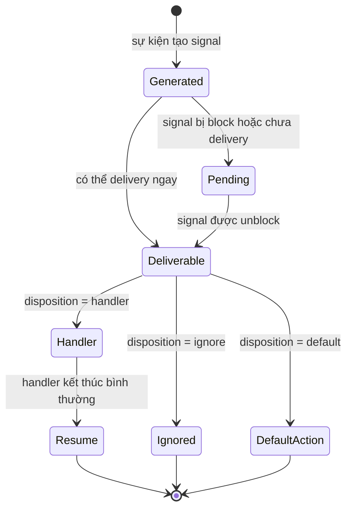

# Chủ đề 5 — Tín hiệu trong Linux

> **Mục tiêu:** hiểu tín hiệu (`signal`) là cơ chế thông báo bất đồng bộ của Unix/Linux, từ lúc tín hiệu được phát sinh cho tới khi bị chặn, chờ, phân phối và xử lý.
>
> **Quy ước ngôn ngữ:** phần giải thích dùng Tiếng Việt. Giữ nguyên tên chuẩn như `SIGINT`, `SIGTERM`, `SIGKILL`, `sigaction()`, `sigset_t`, `EINTR`, `SA_RESTART`.
>
> **Phạm vi:** phát sinh → chờ → phân phối, cách xử lý tín hiệu, mặt nạ tín hiệu, `sigaction()`, `sigprocmask()`, `kill()`, `raise()`, hàm xử lý tín hiệu, async-signal-safety, `EINTR`, `SA_RESTART`, các tín hiệu quan trọng.
>
> Chương này chỉ có **lý thuyết**, không có bài thực hành.

> **Cách đọc tài liệu này nếu bạn mới bắt đầu:**
> 1. Đọc câu **Nói đơn giản** ở đầu mỗi mục lớn để biết mục đó đang giải quyết vấn đề gì.
> 2. Xem sơ đồ và ví dụ trước; chưa cần nhớ ngay mọi cờ, mã lỗi hay trường hợp đặc biệt.
> 3. Sau khi đã hiểu ý chính, mới đọc các mục `###` theo thứ tự. Nếu gặp thuật ngữ mới, hãy quay lại câu giải thích đầu mục thay vì cố học thuộc định nghĩa.

---

## Mục lục

- [1. Tín hiệu là gì?](#1-tín-hiệu-là-gì)
- [2. Vòng đời của một tín hiệu](#2-vòng-đời-của-một-tín-hiệu)
- [3. Tiến trình làm gì khi nhận tín hiệu?](#3-tiến-trình-làm-gì-khi-nhận-tín-hiệu)
- [4. Các tín hiệu thường gặp](#4-các-tín-hiệu-thường-gặp)
- [5. Cách xử lý, mặt nạ và trạng thái chờ](#5-cách-xử-lý-mặt-nạ-và-trạng-thái-chờ)
- [6. `sigaction()`: cấu hình cách xử lý tín hiệu](#6-sigaction-cấu-hình-cách-xử-lý-tín-hiệu)
- [7. Tập tín hiệu và `sigprocmask()`](#7-tập-tín-hiệu-và-sigprocmask)
- [8. Gửi tín hiệu bằng `kill()` và `raise()`](#8-gửi-tín-hiệu-bằng-kill-và-raise)
- [9. Hàm xử lý tín hiệu chen vào luồng chạy như thế nào?](#9-hàm-xử-lý-tín-hiệu-chen-vào-luồng-chạy-như-thế-nào)
- [10. Vì sao hàm xử lý tín hiệu phải rất hạn chế?](#10-vì-sao-hàm-xử-lý-tín-hiệu-phải-rất-hạn-chế)
- [11. Tín hiệu và lời gọi hệ thống: `EINTR`, `SA_RESTART`](#11-tín-hiệu-và-lời-gọi-hệ-thống-eintr-sa_restart)
- [12. Tư duy gỡ lỗi tín hiệu](#12-tư-duy-gỡ-lỗi-tín-hiệu)
- [13. Liên hệ với Embedded Linux](#13-liên-hệ-với-embedded-linux)
- [14. Tổng kết](#14-tổng-kết)
- [15. Tài liệu tham khảo](#15-tài-liệu-tham-khảo)

---

## 1. Tín hiệu là gì?

> **Nói đơn giản:** Signal là một thông báo bất đồng bộ mà nhân Linux hoặc tiến trình khác gửi tới tiến trình để báo một sự kiện như yêu cầu kết thúc, lỗi hay timer hết hạn.

### 1.1 Tín hiệu không phải lời gọi hàm thông thường

Lời gọi hàm:

```text
code A
  |
call function
  |
function chạy
  |
return
  |
code A tiếp tục
```

Tín hiệu:

```text
code đang chạy
    |
    | sự kiện xảy ra bất kỳ lúc thích hợp
    v
nhân Linux chuẩn bị signal delivery
    |
    v
handler/mặc định action
    |
    v
có thể quay lại code cũ hoặc thay đổi trạng thái tiến trình
```

Điểm khác biệt lớn là **thời điểm tín hiệu đến không nhất thiết do code hiện tại gọi trực tiếp**.

### 1.2 Nguồn tạo tín hiệu

Tín hiệu có thể phát sinh do:

```text
một tiến trình gọi kill()
terminal tạo SIGINT/SIGTSTP
child thay đổi trạng thái -> SIGCHLD
pipe/socket bị đóng -> SIGPIPE
CPU/memory fault -> SIGSEGV/SIGILL/SIGFPE...
nhân Linux/subsystem tạo tín hiệu
```

### 1.3 “Bất đồng bộ” không phải lúc nào cũng có nghĩa ngẫu nhiên

Một số tín hiệu gắn chặt với instruction đang thực thi, ví dụ fault như `SIGSEGV`.

Một số tín hiệu đến từ sự kiện bên ngoài luồng code hiện tại, như `SIGTERM` do tiến trình khác gửi.

Do đó nên phân biệt:

```text
synchronous fault relative to hiện tại execution
vs
asynchronous external notification
```

nhưng cả hai đều đi qua signal mechanism.

---

## 2. Vòng đời của một tín hiệu

> **Nói đơn giản:** Một signal đi qua các bước: được phát sinh, có thể chờ nếu đang bị chặn, sau đó được giao để tiến trình xử lý.

Ba khái niệm nền tảng:

```text
generation
   |
   v
đang chờ
   |
   v
delivery
```

Trong tài liệu này:

```text
phát sinh
   |
   v
đang chờ
   |
   v
được phân phối/xử lý
```

### 2.1 Phát sinh

Tín hiệu được phát sinh khi một sự kiện/API tạo ra nó cho đối tượng đích.

### 2.2 Đang chờ

Nếu tín hiệu chưa được phân phối ngay, nó có thể ở trạng thái đang chờ.

Một lý do quan trọng:

```text
tín hiệu đang bị chặn bởi signal mask
```

### 2.3 Phân phối

Khi tín hiệu đủ điều kiện được delivery, nhân Linux áp dụng cách xử lý tương ứng:

```text
ignore
handler
hành động mặc định
```

### 2.4 Sơ đồ trạng thái



---

## 3. Tiến trình làm gì khi nhận tín hiệu?

> **Nói đơn giản:** Khi signal được giao, tiến trình có thể dùng hành vi mặc định, bỏ qua hoặc chạy handler nếu signal cho phép cấu hình.

### 3.1 Signal disposition

Mỗi signal có một **cách xử lý** (`disposition`).

Ba hướng chính:

```text
hành động mặc định
bỏ qua
chạy handler do application cài
```

### 3.2 Hành động mặc định

Tùy tín hiệu, hành động mặc định có thể là:

```text
terminate
terminate + core dump
ignore
stop
continue
```

Không phải mọi tín hiệu mặc định đều “kill tiến trình”.

### 3.3 Bỏ qua

Ứng dụng có thể chọn bỏ qua một số tín hiệu.

Khi bị ignore theo rules, tín hiệu không làm handler chạy.

### 3.4 Bắt bằng handler

Ứng dụng cài hàm xử lý cho một tín hiệu được phép bắt.

Khi delivery:

```text
nhân Linux tạm chuyển control flow
      |
      v
hàm xử lý signal
      |
      v
sigreturn mechanism
      |
      v
code bị gián đoạn tiếp tục
```

nếu signal/action không làm tiến trình kết thúc hoặc dừng.

### 3.5 `SIGKILL` và `SIGSTOP`

Hai tín hiệu này đặc biệt:

```text
không catch
không ignore
không block
```

Chúng dành cho cơ chế điều khiển bắt buộc của nhân Linux.

---

## 4. Các tín hiệu thường gặp

> **Nói đơn giản:** Bạn không cần nhớ tất cả signal. Hãy hiểu trước vài signal thường gặp như `SIGINT`, `SIGTERM`, `SIGKILL`, `SIGSEGV`, `SIGCHLD`.

### 4.1 Không hard-code số tín hiệu

Ứng dụng nên dùng tên:

```text
SIGINT
SIGTERM
SIGKILL
```

thay vì giả định một số numeric cố định trên mọi kiến trúc.

### 4.2 `SIGINT`

Thường gắn với yêu cầu interrupt từ terminal, ví dụ `Ctrl+C` trong foreground tiến trình group.

Ý nghĩa thực tế phụ thuộc terminal/job-control ngữ cảnh.

### 4.3 `SIGTERM`

Là yêu cầu kết thúc có thể được ứng dụng bắt và xử lý.

Nó phù hợp với graceful service shutdown vì chương trình có cơ hội:

```text
dừng nhận việc mới
flush trạng thái phù hợp
đóng tài nguyên
thoát có kiểm soát
```

### 4.4 `SIGKILL`

Nhân Linux buộc terminate; ứng dụng không có cơ hội chạy hàm xử lý signal để cleanup.

Vì vậy `SIGKILL` không phải lựa chọn đầu tiên cho shutdown bình thường.

### 4.5 `SIGCHLD`

Phát sinh liên quan child thay đổi trạng thái.

Nó nối trực tiếp Topic 4:

```text
child exit
   |
SIGCHLD
   |
parent biết có trạng thái change
   |
wait()/waitpid()
```

`SIGCHLD` là thông báo; `wait()` mới là cơ chế thu trạng thái/reap.

### 4.6 `SIGPIPE`

Khi ghi vào pipe/socket stream mà không còn reader theo điều kiện tương ứng:

```text
SIGPIPE
```

có thể được phát sinh.

Nếu signal không terminate tiến trình, thao tác ghi thường báo `EPIPE`.

### 4.7 `SIGSEGV`

Thường liên quan truy cập bộ nhớ không hợp lệ theo memory-protection/ánh xạ rules.

### 4.8 `SIGBUS`

Có thể liên quan lỗi bus, alignment hoặc backing ánh xạ không hợp lệ tùy kiến trúc/trường hợp.

### 4.9 `SIGILL`

Liên quan instruction không hợp lệ/không được hỗ trợ.

### 4.10 `SIGFPE`

Liên quan lớp arithmetic exception; tên lịch sử không có nghĩa nó chỉ dành cho floating point.

---

## 5. Cách xử lý, mặt nạ và trạng thái chờ

> **Nói đơn giản:** Mask quyết định signal nào tạm thời bị chặn; đang chờ nghĩa là signal đã tới nhưng chưa được giao xử lý.

Ba trạng thái dễ nhầm:

```text
disposition
  tiến trình sẽ làm gì khi signal delivery?

mask
  signal nào đang bị block?

đang chờ
  signal nào đã phát sinh nhưng chưa delivery?
```

### 5.1 Disposition là process-wide

Trong POSIX threads model, signal disposition được chia sẻ ở mức tiến trình.

Nếu một luồng thay handler của `SIGTERM`, nó thay disposition của toàn tiến trình.

### 5.2 Signal mask

Mask là tập tín hiệu đang bị chặn đối với luồng hiện tại.

```text
SIGUSR1 blocked
    |
signal generated
    |
    v
đang chờ
    |
unblock
    |
    v
delivery
```

### 5.3 Mask là per-thread

Trong tiến trình đa luồng, mỗi luồng có signal mask riêng.

Topic 6 sẽ giải thích luồng sâu hơn.

### 5.4 Block không bằng ignore

```text
blocked
  giữ signal ở đang chờ cho tới khi được phép delivery

ignored
  disposition yêu cầu bỏ qua signal
```

Hai cơ chế có ý nghĩa khác nhau.

---

## 6. `sigaction()`: cấu hình cách xử lý tín hiệu

> **Nói đơn giản:** `sigaction()` là API chuẩn để cấu hình handler và các cờ liên quan. Nó rõ ràng và kiểm soát tốt hơn cách dùng `signal()` cũ.

### 6.1 Vì sao ưu tiên `sigaction()`?

`signal()` có lịch sử ngữ nghĩa khác nhau giữa các hệ thống cũ.

`sigaction()` là giao diện chuẩn và rõ ràng hơn để cấu hình:

```text
handler
tập signal block trong handler
flags
```

### 6.2 `struct sigaction`

Các trường quan trọng về mặt khái niệm:

```text
sa_handler / sa_sigaction
sa_mask
sa_flags
```

### 6.3 `sa_handler`

Có thể chỉ:

```text
function handler
SIG_DFL
SIG_IGN
```

### 6.4 `sa_mask`

Khi handler chạy, có thể tạm block thêm các tín hiệu chỉ định.

Theo mặc định, signal đang được xử lý cũng thường bị block trong chính handler của nó trừ khi dùng flag thay đổi ngữ nghĩa như `SA_NODEFER`.

### 6.5 `SA_RESTART`

Yêu cầu nhân Linux/libc tự restart một số lời gọi hệ thống bị signal gián đoạn.

Điểm cần nhớ:

> `SA_RESTART` không áp dụng cho mọi giao diện và mọi trường hợp.

### 6.6 `SA_SIGINFO`

Cho handler dạng mở rộng nhận thêm thông tin về signal source/ngữ cảnh khi API cung cấp.

Chi tiết trường nào hợp lệ phụ thuộc loại signal và nguồn phát sinh.

---

## 7. Tập tín hiệu và `sigprocmask()`

> **Nói đơn giản:** `sigprocmask()` thay đổi tập signal đang bị chặn của tiến trình/luồng theo quy tắc POSIX tương ứng.

### 7.1 `sigset_t`

POSIX dùng `sigset_t` để biểu diễn tập signal.

Các API tập hợp cho phép:

```text
khởi tạo tập rỗng
khởi tạo tập đầy
thêm signal
xóa signal
kiểm tra membership
```

### 7.2 `sigprocmask()`

Trong single-threaded tiến trình, API này thay signal mask.

Ba thao tác logic:

```text
SIG_BLOCK
  thêm signal vào mask

SIG_UNBLOCK
  bỏ signal khỏi mask

SIG_SETMASK
  thay mask bằng tập mới
```

Trong chương trình đa luồng nên dùng API luồng-aware phù hợp như `pthread_sigmask()`.

### 7.3 `sigpending()`

Cho phép hỏi tập tín hiệu đang đang chờ đối với tiến trình/luồng ngữ cảnh theo ngữ nghĩa.

Đang chờ set không phải một message hàng đợi tổng quát.

---

## 8. Gửi tín hiệu bằng `kill()` và `raise()`

> **Nói đơn giản:** `kill()` gửi signal tới tiến trình hoặc nhóm tiến trình; `raise()` gửi signal cho chính tiến trình hiện tại.

### 8.1 `kill()` không có nghĩa chỉ là “giết process”

Tên lịch sử dễ gây hiểu nhầm.

`kill()` có nghĩa rộng hơn:

```text
gửi signal tới tiến trình/tiến trình group theo target ngữ nghĩa
```

Signal được gửi có thể là:

```text
SIGTERM
SIGUSR1
SIGCONT
signal 0 để kiểm tra existence/permission theo ngữ nghĩa
```

### 8.2 Ý nghĩa của PID argument

Ở mức khái niệm, `kill()` có thể nhắm:

```text
một PID cụ thể
tiến trình group của caller
a tiến trình group cụ thể
một tập tiến trình được phép theo ngữ nghĩa đặc biệt
```

Cần đọc `kill(2)` khi dùng các giá trị đặc biệt.

### 8.3 Quyền gửi tín hiệu

Nhân Linux kiểm tra credential/capability/session rules phù hợp.

Có PID đúng không đồng nghĩa caller có quyền gửi mọi signal.

### 8.4 `raise()`

`raise(sig)` yêu cầu gửi signal tới chính execution ngữ cảnh của chương trình theo POSIX ngữ nghĩa.

Nó hữu ích để kích hoạt signal path từ chính ứng dụng.

---

## 9. Hàm xử lý tín hiệu chen vào luồng chạy như thế nào?

> **Nói đơn giản:** Handler có thể chen vào lúc chương trình đang chạy một đoạn code khác, vì vậy code trong handler phải giả định rằng trạng thái chương trình đang dang dở.

### 9.1 Control transfer do kernel sắp xếp

Khi delivery tới một luồng:

```text
luồng đang chạy
    |
nhân Linux lưu context thích hợp
    |
tạo signal frame / chuẩn bị user context
    |
    v
handler chạy
    |
handler return
    |
sigreturn mechanism
    |
    v
luồng tiếp tục
```

Ứng dụng không nên tự gọi `sigreturn()`.

### 9.2 Handler không phải thread riêng

Handler chạy trong ngữ cảnh của luồng nhận signal.

Nó dùng stack/register trạng thái của luồng theo signal-frame ngữ nghĩa.

### 9.3 Reentrancy

Nếu các tín hiệu khác vẫn được phép delivery trong khi handler chạy, handler có thể bị lồng bởi signal khác.

Đây là lý do code trong handler phải cực kỳ cẩn trọng.

---

## 10. Vì sao hàm xử lý tín hiệu phải rất hạn chế?

> **Nói đơn giản:** Không phải hàm nào cũng an toàn khi gọi trong hàm xử lý signal. Vì vậy handler nên làm rất ít việc và chuyển xử lý phức tạp ra luồng bình thường.

### 10.1 Async-signal-safe

POSIX định nghĩa một tập hàm an toàn để gọi từ asynchronous hàm xử lý signal.

Nhiều hàm thư viện **không** async-signal-safe.

Ví dụ các cơ chế dùng:

```text
malloc internal trạng thái
stdio buffers
mutex nội bộ
global non-reentrant trạng thái
```

có thể bị gián đoạn đúng lúc chưa nhất quán.

### 10.2 Ví dụ deadlock nội bộ

```text
code thường
   |
libc function giữ internal mutex
   |
signal interrupt
   |
handler gọi lại function cần cùng mutex
   |
   v
deadlock
```

### 10.3 Thiết kế handler

Nguyên tắc tốt:

```text
handler làm tối thiểu
  |
  +--> đặt cờ nhỏ an toàn
  +--> ghi vào cơ chế async-signal-safe phù hợp
  |
main loop/luồng xử lý logic phức tạp
```

### 10.4 `volatile sig_atomic_t`

Kiểu `sig_atomic_t` cho phép một số thao tác đọc/ghi đơn giản phù hợp giữa code thường và hàm xử lý signal theo C/POSIX expectations.

Nó **không** thay thế mutex/atomic synchronization giữa nhiều luồng cho mọi bài toán.

### 10.5 `errno`

Handler có thể làm thay đổi `errno` nếu gọi function tác động tới nó.

Một handler cần bảo toàn `errno` nếu chương trình bị gián đoạn cần giá trị cũ sau khi handler kết thúc.

---

## 11. Tín hiệu và lời gọi hệ thống: `EINTR`, `SA_RESTART`

> **Nói đơn giản:** Signal có thể làm lời gọi hệ thống đang chờ bị gián đoạn và trả `EINTR`; một số trường hợp `SA_RESTART` khiến nhân Linux/libc tự khởi động lại lời gọi.

### 11.1 Signal có thể làm gián đoạn blocking syscall

Ví dụ:

```text
luồng đang read()
     |
signal delivery
     |
handler chạy
     |
     v
syscall được restart hoặc trả EINTR tùy giao diện/flags/trạng thái
```

### 11.2 `EINTR`

`EINTR` nghĩa lời gọi bị gián đoạn bởi signal trước khi hoàn tất theo ngữ nghĩa của API.

Không nên mặc định:

```text
EINTR -> retry vô điều kiện
```

Hãy xét:

```text
application có yêu cầu shutdown không?
đã có partial I/O chưa?
deadline đã hết chưa?
handler có thay trạng thái điều khiển không?
```

### 11.3 `SA_RESTART`

Một số blocking interfaces có thể tự restart nếu signal action dùng `SA_RESTART`.

Nhưng danh sách phụ thuộc giao diện và Linux/POSIX ngữ nghĩa.

### 11.4 Partial I/O

Nếu một lời gọi đã truyền được một phần dữ liệu trước khi signal đến, nó có thể trả số byte đã xử lý thay vì `EINTR`.

Do đó Topic 3 và Topic 5 liên kết trực tiếp:

```text
signal interruption
+
partial I/O
+
return value
```

---

## 12. Tư duy gỡ lỗi tín hiệu

> **Nói đơn giản:** Debug signal cần hỏi: signal nào được gửi, có bị block không, disposition là gì, handler có chạy không và lời gọi hệ thống có bị `EINTR` không.

### 12.1 “Handler không chạy”

Kiểm tra:

```text
signal có thực sự phát sinh?
đúng target?
bị block?
disposition đúng?
tiến trình còn sống?
SIGKILL/SIGSTOP thì không có handler
```

### 12.2 “Gửi nhiều lần nhưng handler chạy ít hơn”

Standard signals không phải hàng đợi message đếm từng occurrence như một counter lossless.

Nhiều instance cùng loại có thể được gộp theo đang chờ ngữ nghĩa.

### 12.3 “Chương trình treo sau khi thêm handler”

Nghi ngờ:

```text
handler gọi function không async-signal-safe
handler deadlock trên lock nội bộ
handler thực hiện logic quá lớn
```

### 12.4 “`read()` đột nhiên trả -1”

Kiểm tra:

```text
errno == EINTR?
SA_RESTART?
shutdown policy?
```

### 12.5 “SIGTERM không dừng process”

`SIGTERM` có thể bị:

```text
caught
ignored
blocked tạm thời
```

Không có ngữ nghĩa cưỡng bức giống `SIGKILL`.

### 12.6 “SIGKILL không biến mất ngay”

Nếu task đang ở nhân Linux trạng thái đặc biệt như uninterruptible sleep, delivery/termination observable có thể chờ tới khi task thoát khỏi trạng thái đó.

Điều này không có nghĩa `SIGKILL` bị catch/ignore.

---

## 13. Liên hệ với Embedded Linux

> **Nói đơn giản:** Embedded Linux dùng signal để dừng service, reload cấu hình, nhận thông báo child tiến trình và xử lý timer/sự kiện hệ thống.

### 13.1 Graceful shutdown của service

Service nhận `SIGTERM` có thể chuyển trạng thái:

```text
RUNNING
   |
SIGTERM
   |
   v
STOPPING
   |
cleanup có kiểm soát
   |
   v
EXIT
```

### 13.2 Reload cấu hình

Một số daemon dùng `SIGHUP` như **quy ước ứng dụng** để reload configuration.

Nhân Linux không quy định universal meaning “SIGHUP luôn là reload config”.

### 13.3 Child worker

Supervisor có thể kết hợp:

```text
fork
SIGCHLD
waitpid
```

để quản lý luồng xử lý tiến trình.

### 13.4 UART/TTY

`Ctrl+C` qua serial terminal có thể tạo `SIGINT` tới foreground tiến trình group nếu TTY được cấu hình theo canonical/job-control ngữ nghĩa.

### 13.5 Pipe/socket

Broken stream có thể gây `SIGPIPE`, vì vậy network/service code cần policy rõ ràng.

### 13.6 Fault diagnostics

`SIGSEGV`, `SIGBUS`, `SIGILL` là dấu hiệu quan trọng khi debug crash trên target.

Tuy nhiên signal name chỉ mô tả lớp sự kiện; root cause vẫn cần backtrace, register, memory ánh xạ, logs và subsystem ngữ cảnh.

---

## 14. Tổng kết

> **Nói đơn giản:** Topic 05 cần để lại mô hình: generate → đang chờ/block → delivery → mặc định/ignore/handler.

```text
Sự kiện/API
    |
    v
Signal phát sinh
    |
    +--> bị block -> Đang chờ
    |                 |
    |              unblock
    |                 |
    +-----------------+
    |
    v
Delivery
    |
    +--> mặc định action
    +--> ignore
    +--> handler
```

Các ý cần nhớ:

1. Signal là cơ chế thông báo/control, không phải lời gọi hàm thông thường.
2. Phải tách `generation`, `pending`, `delivery`.
3. Disposition quyết định hành động khi delivery.
4. Mask quyết định signal nào đang bị block.
5. Block khác ignore.
6. `SIGKILL` và `SIGSTOP` không thể catch/block/ignore.
7. `SIGTERM` là yêu cầu terminate có thể xử lý; `SIGKILL` là cưỡng bức nhân Linux-level.
8. `SIGCHLD` là notification; `wait()` thu trạng thái child.
9. `sigaction()` là giao diện chuẩn để cấu hình handler/flags/mask.
10. Handler chạy trong luồng ngữ cảnh nhận signal, không phải luồng riêng.
11. Chỉ gọi async-signal-safe operations từ asynchronous handler.
12. Signal có thể làm syscall trả `EINTR`; `SA_RESTART` không áp dụng cho mọi syscall.
13. Standard signal đang chờ không phải lossless message hàng đợi.

---

## 15. Tài liệu tham khảo

> **Nói đơn giản:** Phần này liệt kê nguồn chuẩn về signal và các API POSIX liên quan.

- `signal(7)`: https://man7.org/linux/man-pages/man7/signal.7.html
- `sigaction(2)`: https://man7.org/linux/man-pages/man2/sigaction.2.html
- `sigprocmask(2)`: https://man7.org/linux/man-pages/man2/sigprocmask.2.html
- `sigpending(2)`: https://man7.org/linux/man-pages/man2/sigpending.2.html
- `kill(2)`: https://man7.org/linux/man-pages/man2/kill.2.html
- `signal-safety(7)`: https://man7.org/linux/man-pages/man7/signal-safety.7.html
- `wait(2)`: https://man7.org/linux/man-pages/man2/wait.2.html
- POSIX.1-2024: https://pubs.opengroup.org/onlinepubs/9799919799/
- The Linux Programming Giao diện: https://man7.org/tlpi/

> **Điều hướng:** [← Chủ đề 4 — Tiến trình](README-topic-04.md) · [Chủ đề 6 — Đa luồng →](README-topic-06.md)
