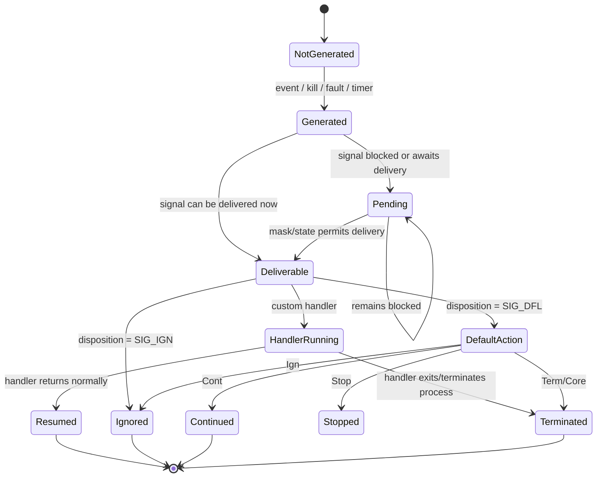
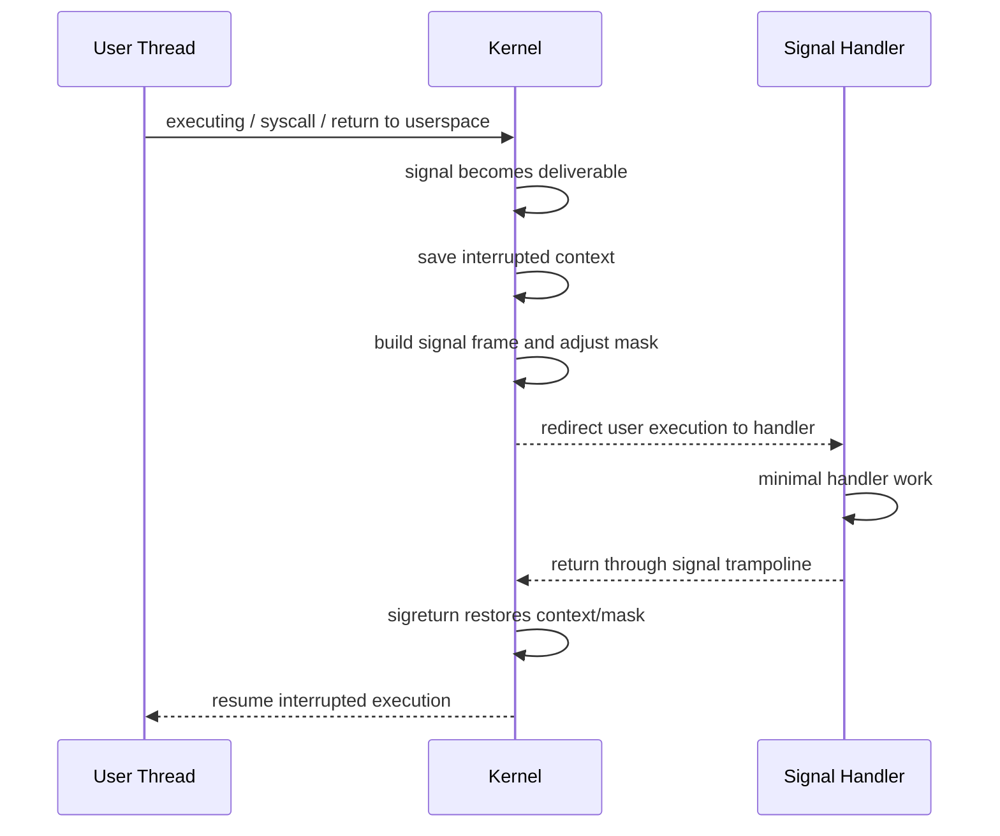

# Chủ đề 5 — Signal trong Linux

> **Phạm vi:** Linux/POSIX signal fundamentals — signal concept, generation, pending/delivery, signal disposition, signal mask, process-directed và thread-directed signals, standard và real-time signals, `sigaction()`, `sigprocmask()`, `kill()`, `raise()`, `pause()`, `sigsuspend()`, synchronous signal waiting, signal-handler execution, async-signal-safety, `EINTR`, `SA_RESTART`, `SIGCHLD` và mối liên hệ với process lifecycle.
>
> Chương này chỉ trình bày **lý thuyết**. Không có lab, bài tập, lệnh thực hành hoặc hướng dẫn thao tác.
>
> Mục tiêu của chương là xây mental model:
>
> `event → signal generation → pending state → mask/filter → delivery → disposition → handler/default action`
>
> và:
>
> `signal disposition = process-wide`
>
> `signal mask = per-thread`
>
> `pending signals = có thể process-directed hoặc thread-directed`
>
> Đây là nền tảng trực tiếp cho Multithreading, Synchronization, Daemon, IPC, Socket, child-process management, event-driven system và Linux service/application architecture.
>
> **Giới hạn chủ đề:** chương này chưa đi sâu vào POSIX threads, thread synchronization, `signalfd()`-based event loop, `pidfd_send_signal()`, POSIX timers, `ptrace`, seccomp, namespaces, kernel signal internals hoặc real-time scheduling. Các phần đó chỉ được nhắc khi cần để giữ mental model đúng.
>
> **Điều hướng:** [← Chủ đề 4 — Process](README-topic-04.md) · [Chủ đề 6 — Multithreading →](README-topic-06.md)

---

## Mục lục

1. [Signal trong Unix/Linux thực chất là gì?](#1-signal-trong-unixlinux-thực-chất-là-gì)
2. [Signal không phải function call](#2-signal-không-phải-function-call)
3. [Signal là asynchronous notification — nhưng không phải lúc nào cũng “asynchronous” theo nghĩa đơn giản](#3-signal-là-asynchronous-notification--nhưng-không-phải-lúc-nào-cũng-asynchronous-theo-nghĩa-đơn-giản)
4. [Signal lifecycle: generation → pending → delivery](#4-signal-lifecycle-generation--pending--delivery)
5. [Signal generation là gì?](#5-signal-generation-là-gì)
6. [Signal pending là gì?](#6-signal-pending-là-gì)
7. [Signal delivery là gì?](#7-signal-delivery-là-gì)
8. [Signal disposition](#8-signal-disposition)
9. [Default action của signal](#9-default-action-của-signal)
10. [Ignore và catch](#10-ignore-và-catch)
11. [`SIGKILL` và `SIGSTOP` là trường hợp đặc biệt](#11-sigkill-và-sigstop-là-trường-hợp-đặc-biệt)
12. [Signal number và signal name](#12-signal-number-và-signal-name)
13. [Không nên hard-code signal number giữa các architecture](#13-không-nên-hard-code-signal-number-giữa-các-architecture)
14. [Những standard signals quan trọng](#14-những-standard-signals-quan-trọng)
15. [`SIGINT`, `SIGTERM`, `SIGKILL`: ba semantics rất khác nhau](#15-sigint-sigterm-sigkill-ba-semantics-rất-khác-nhau)
16. [`SIGCHLD` và process lifecycle](#16-sigchld-và-process-lifecycle)
17. [`SIGPIPE` và broken stream](#17-sigpipe-và-broken-stream)
18. [`SIGSEGV`, `SIGBUS`, `SIGILL`, `SIGFPE`](#18-sigsegv-sigbus-sigill-sigfpe)
19. [Signal disposition là process-wide](#19-signal-disposition-là-process-wide)
20. [Signal mask là gì?](#20-signal-mask-là-gì)
21. [Signal mask là per-thread](#21-signal-mask-là-per-thread)
22. [Blocked signal không đồng nghĩa ignored signal](#22-blocked-signal-không-đồng-nghĩa-ignored-signal)
23. [Pending signal và signal mask](#23-pending-signal-và-signal-mask)
24. [Process-directed signal](#24-process-directed-signal)
25. [Thread-directed signal](#25-thread-directed-signal)
26. [Kernel chọn thread nào để nhận process-directed signal?](#26-kernel-chọn-thread-nào-để-nhận-process-directed-signal)
27. [`fork()` và signal state](#27-fork-và-signal-state)
28. [`execve()` và signal state](#28-execve-và-signal-state)
29. [`sigaction()` — interface chuẩn để thiết lập disposition](#29-sigaction--interface-chuẩn-để-thiết-lập-disposition)
30. [`struct sigaction`](#30-struct-sigaction)
31. [`sa_handler` và `sa_sigaction`](#31-sa_handler-và-sa_sigaction)
32. [`sa_mask`: signal nào bị block trong khi handler chạy?](#32-sa_mask-signal-nào-bị-block-trong-khi-handler-chạy)
33. [`SA_RESTART`](#33-sa_restart)
34. [`SA_SIGINFO`](#34-sa_siginfo)
35. [`SA_NODEFER`, `SA_RESETHAND`, `SA_ONSTACK`](#35-sa_nodefer-sa_resethand-sa_onstack)
36. [Vì sao `signal()` không nên là interface mặc định](#36-vì-sao-signal-không-nên-là-interface-mặc-định)
37. [`sigset_t` và signal sets](#37-sigset_t-và-signal-sets)
38. [`sigprocmask()`](#38-sigprocmask)
39. [`pthread_sigmask()` và multithreaded program](#39-pthread_sigmask-và-multithreaded-program)
40. [`sigpending()`](#40-sigpending)
41. [`kill()` không có nghĩa đơn giản là “kill process”](#41-kill-không-có-nghĩa-đơn-giản-là-kill-process)
42. [`kill()` target semantics theo PID argument](#42-kill-target-semantics-theo-pid-argument)
43. [`raise()`](#43-raise)
44. [`pthread_kill()` và thread-directed signaling](#44-pthread_kill-và-thread-directed-signaling)
45. [Signal permission model](#45-signal-permission-model)
46. [`pause()` và race condition kinh điển](#46-pause-và-race-condition-kinh-điển)
47. [`sigsuspend()` — atomic mask replacement + wait](#47-sigsuspend--atomic-mask-replacement--wait)
48. [Synchronously waiting for signals](#48-synchronously-waiting-for-signals)
49. [`sigwaitinfo()` / `sigtimedwait()` / `sigwait()`](#49-sigwaitinfo--sigtimedwait--sigwait)
50. [Asynchronous handler vs synchronous signal acceptance](#50-asynchronous-handler-vs-synchronous-signal-acceptance)
51. [Signal-handler execution model](#51-signal-handler-execution-model)
52. [Signal frame và `sigreturn()` ở mức mental model](#52-signal-frame-và-sigreturn-ở-mức-mental-model)
53. [Handler có chạy “song song” với code bị interrupt không?](#53-handler-có-chạy-song-song-với-code-bị-interrupt-không)
54. [Handler reentrancy và nested signals](#54-handler-reentrancy-và-nested-signals)
55. [Async-signal-safety](#55-async-signal-safety)
56. [Vì sao nhiều libc function không an toàn trong signal handler?](#56-vì-sao-nhiều-libc-function-không-an-toàn-trong-signal-handler)
57. [Signal handler nên làm gì ở mức thiết kế?](#57-signal-handler-nên-làm-gì-ở-mức-thiết-kế)
58. [`volatile sig_atomic_t`](#58-volatile-sig_atomic_t)
59. [`errno` trong signal handler](#59-errno-trong-signal-handler)
60. [Signal interrupting system calls](#60-signal-interrupting-system-calls)
61. [`EINTR`](#61-eintr)
62. [`SA_RESTART` không restart mọi syscall](#62-sa_restart-không-restart-mọi-syscall)
63. [Partial I/O và signal interruption](#63-partial-io-và-signal-interruption)
64. [Signal coalescing với standard signals](#64-signal-coalescing-với-standard-signals)
65. [Real-time signals](#65-real-time-signals)
66. [Real-time signals có queueing semantics](#66-real-time-signals-có-queueing-semantics)
67. [Ordering của real-time signals](#67-ordering-của-real-time-signals)
68. [`sigqueue()` và payload](#68-sigqueue-và-payload)
69. [Standard signals vs real-time signals](#69-standard-signals-vs-real-time-signals)
70. [Signal và process groups](#70-signal-và-process-groups)
71. [Terminal-generated signals và foreground process group](#71-terminal-generated-signals-và-foreground-process-group)
72. [`SIGINT`, `SIGTSTP`, `SIGHUP` trong terminal/session model](#72-sigint-sigtstp-sighup-trong-terminalsession-model)
73. [`SIGCHLD`, zombie và `wait()`](#73-sigchld-zombie-và-wait)
74. [`SIGCHLD` disposition nuances](#74-sigchld-disposition-nuances)
75. [Signal pending không phải message queue tổng quát](#75-signal-pending-không-phải-message-queue-tổng-quát)
76. [Signal không nên thay thế IPC data channel](#76-signal-không-nên-thay-thế-ipc-data-channel)
77. [Signal vs pipe/eventfd/socket](#77-signal-vs-pipeeventfdsocket)
78. [Signals trong multithreaded application: mental model cần chuẩn bị](#78-signals-trong-multithreaded-application-mental-model-cần-chuẩn-bị)
79. [Một dedicated signal-handling thread](#79-một-dedicated-signal-handling-thread)
80. [`signalfd()` ở mức khái niệm](#80-signalfd-ở-mức-khái-niệm)
81. [Signal lifecycle state machine](#81-signal-lifecycle-state-machine)
82. [Handler execution sequence](#82-handler-execution-sequence)
83. [Signal mask transformation khi handler chạy](#83-signal-mask-transformation-khi-handler-chạy)
84. [Error model và tư duy debug Signal](#84-error-model-và-tư-duy-debug-signal)
85. [Liên hệ với Embedded Linux](#85-liên-hệ-với-embedded-linux)
86. [Mô hình tư duy tổng hợp](#86-mô-hình-tư-duy-tổng-hợp)
87. [Các nguyên tắc cốt lõi](#87-các-nguyên-tắc-cốt-lõi)
88. [Tài liệu tham khảo](#tài-liệu-tham-khảo)

---

# 1. Signal trong Unix/Linux thực chất là gì?

Signal là một cơ chế notification/control event có lịch sử rất lâu trong Unix.

Một signal cho biết:

```text
"một event thuộc loại X đã xảy ra đối với process/thread"
```

Ví dụ event có thể đến từ:

```text
terminal
another process
kernel
hardware exception
timer
child-process state change
broken IPC stream
```

Mental model:

```text
Event
  |
  v
Signal generated
  |
  v
Kernel records signal state
  |
  v
Signal becomes deliverable
  |
  v
Disposition determines action
```

Signal **không phải** một arbitrary byte stream.

Nó chủ yếu mang:

```text
signal identity
optional metadata
optional small payload for selected interfaces/real-time signals
```

Do đó signal phù hợp với:

```text
notification
control
lifecycle event
```

hơn là truyền large structured data.

---

# 2. Signal không phải function call

Một function call có control flow trực tiếp:

```text
caller
  |
  v
callee
  |
  v
return
```

Signal có model khác:

```text
normal execution
      |
      | signal becomes delivered
      v
execution temporarily redirected
      |
      v
signal handler/default action
      |
      v
possibly resume interrupted context
```

Không nên hình dung:

```text
process A "gọi handler()" trực tiếp trong process B
```

Khi A gửi signal, A chỉ yêu cầu kernel generate signal cho target.

Kernel quyết định delivery theo:

```text
target
signal mask
pending state
disposition
thread selection
scheduling point
```

---

# 3. Signal là asynchronous notification — nhưng không phải lúc nào cũng “asynchronous” theo nghĩa đơn giản

Nhiều signals là asynchronous so với instruction stream của target:

```text
SIGTERM
SIGINT
SIGCHLD
SIGUSR1
```

Target không nhất thiết đang execute code liên quan event tại lúc signal generated.

Nhưng một số signals phát sinh synchronously từ execution fault, ví dụ:

```text
SIGSEGV
SIGILL
SIGFPE
SIGBUS
```

Concept:

```text
instruction executes
      |
      v
CPU/kernel detects exceptional condition
      |
      v
signal generated for current thread
```

Vì vậy cách nói chính xác hơn:

> Signals là một event-notification/control mechanism; generation có thể asynchronous hoặc synchronous relative tới current execution.

---

# 4. Signal lifecycle: generation → pending → delivery

Linux `signal(7)` phân biệt ba concept quan trọng:

```text
Generation
Pending
Delivery
```

Mental model:

```text
Signal event
    |
    v
GENERATED
    |
    v
Is it immediately deliverable?
   / \
 no  yes
 |    |
 v    v
PENDING
 |    |
 | mask/state allows later
 +---------+
           |
           v
       DELIVERED
           |
           v
      disposition
```

Đây là mental model cốt lõi của toàn chapter.

---

# 5. Signal generation là gì?

Signal được **generated** khi một event/API tạo signal instance/condition cho process hoặc thread.

Sources có thể gồm:

```text
kill()
raise()
pthread_kill()
sigqueue()
terminal driver
timer expiration
child-process state transition
kernel-detected fault
pipe/socket condition
```

Generation chưa đồng nghĩa:

```text
handler đã chạy
```

Signal có thể bị block nên phải pending trước.

---

# 6. Signal pending là gì?

`signal(7)`:

> Signal bị block thì không được delivered cho tới khi được unblock. Trong thời gian từ generation tới delivery, signal được gọi là pending.

Mental model:

```text
signal generated
      |
 target blocks signal?
   /       \
 yes        no
 |          |
 v          v
pending   eligible for delivery
```

Pending state quan trọng vì:

```text
blocked != lost automatically
```

Nhưng standard signals có coalescing semantics; nhiều occurrences không nhất thiết tạo many queued instances.

---

# 7. Signal delivery là gì?

Delivery là lúc kernel áp dụng signal tới target execution context.

Nếu disposition:

```text
default
ignore
handler
```

kernel thực hiện behavior tương ứng.

Với user-installed handler:

```text
normal user code
      |
signal delivery
      |
      v
handler executes
      |
      v
return from signal handler
      |
      v
resume interrupted execution
```

Trừ khi handler:

```text
terminates process
long-jumps
execs
changes control flow
```

hoặc signal default action không cho resume.

---

# 8. Signal disposition

Mỗi signal có một **disposition** trong process.

Disposition có thể là:

```text
default action
ignore
user-defined handler
```

Mental model:

```text
signal delivered
      |
      v
look up disposition
   /       |        \
  /        |         \
default   ignore    handler
```

Disposition được set bằng interfaces như:

```text
sigaction()
```

`signal()` tồn tại nhưng có portability/history issues.

---

# 9. Default action của signal

Mỗi standard signal có default action.

Categories thường được man-page biểu diễn như:

```text
Term    terminate process
Ign     ignore
Core    terminate + core dump
Stop    stop process
Cont    continue process
```

Default action là semantics khi process chưa override disposition.

Ví dụ:

```text
SIGTERM  default terminate
SIGSTOP  stop
SIGCONT  continue
SIGCHLD  default ignore-like disposition semantics
SIGSEGV  core/terminate
```

Exact table cần xem `signal(7)`.

---

# 10. Ignore và catch

## Ignore

Disposition:

```text
SIG_IGN
```

Signal được discarded according to signal semantics.

## Catch

Disposition points tới handler.

```text
signal delivered
      |
      v
user handler executes
```

Important:

```text
ignored signal
```

khác:

```text
blocked signal
```

Ignored signal không chờ để handler chạy sau.

Blocked signal có thể trở thành pending và được delivered khi unblock.

---

# 11. `SIGKILL` và `SIGSTOP` là trường hợp đặc biệt

POSIX/Linux định nghĩa:

```text
SIGKILL
SIGSTOP
```

không thể:

```text
caught
blocked
ignored
```

Lý do system-design:

```text
kernel/admin phải luôn có hard control
```

Do đó:

```text
SIGTERM
```

có thể cho application cleanup,

còn:

```text
SIGKILL
```

không cho user-space handler chạy cleanup.

Mental model:

```text
SIGTERM
   |
user-defined graceful path possible

SIGKILL
   |
kernel-enforced termination
no signal handler
```

---

# 12. Signal number và signal name

Signals có symbolic names:

```text
SIGINT
SIGTERM
SIGCHLD
SIGSEGV
```

và integer numbers.

Application/source code nên ưu tiên symbolic constants.

Ví dụ:

```text
SIGTERM
```

không phải magic integer.

---

# 13. Không nên hard-code signal number giữa các architecture

`signal(7)` lưu ý signal numbers có thể khác giữa architectures.

Một số signals như:

```text
SIGKILL
SIGSTOP
```

có common numbers trên many systems, nhưng portable code vẫn dùng symbolic names.

Mental model:

```text
meaning
  |
  v
SIGTERM
```

thay vì:

```text
hard-coded 15 everywhere
```

---

# 14. Những standard signals quan trọng

Nhóm thường gặp:

```text
SIGINT    interactive interrupt
SIGTERM   termination request
SIGKILL   forced termination
SIGSTOP   forced stop
SIGCONT   continue
SIGTSTP   terminal stop request
SIGHUP    hangup/session-related signal
SIGCHLD   child state change
SIGPIPE   broken pipe write
SIGALRM   timer alarm
SIGUSR1   application-defined
SIGUSR2   application-defined
SIGSEGV   invalid memory access fault class
SIGBUS    bus/memory access fault class
SIGILL    illegal instruction
SIGFPE    arithmetic exception class
```

Không nên chỉ học “signal X = action Y”.

Quan trọng hơn là biết:

```text
source
default action
whether catchable/blockable
typical lifecycle role
```

---

# 15. `SIGINT`, `SIGTERM`, `SIGKILL`: ba semantics rất khác nhau

## `SIGINT`

Thường được terminal driver generate khi interactive user gửi interrupt character như `Ctrl+C`, target tới foreground process group.

Nó là:

```text
interactive interrupt request
```

không phải universal “kill”.

## `SIGTERM`

General termination request.

Application có thể:

```text
catch
cleanup
flush application state
shutdown services
```

## `SIGKILL`

Immediate kernel-enforced termination.

Không handler.

Không cleanup bằng signal handler.

ASCII:

```text
SIGINT
  user-interactive interruption

SIGTERM
  graceful termination request

SIGKILL
  forced termination
```

---

# 16. `SIGCHLD` và process lifecycle

Khi child:

```text
terminates
stops
continues
```

parent có thể nhận `SIGCHLD` theo signal/wait semantics.

Mental model:

```text
Child state changes
       |
       v
kernel records child status
       |
       +--> SIGCHLD notification to parent
       |
       +--> wait()/waitpid() can collect status
```

Important:

> `SIGCHLD` notification và `wait()` reaping là hai pieces của cùng lifecycle nhưng không phải cùng operation.

Handler không tự động reap child trừ khi program thiết kế như vậy.

---

# 17. `SIGPIPE` và broken stream

Khi process ghi vào pipe/socket-like connection mà không còn reader phù hợp:

```text
write
  |
  v
no reader
  |
  +--> SIGPIPE
  |
  +--> EPIPE according to operation semantics
```

Default action của `SIGPIPE` là terminate process.

Programs/network libraries thường cần intentional policy:

```text
default terminate
ignore SIGPIPE and handle EPIPE
object-specific suppression
```

Topic 3 đã giới thiệu `EPIPE`.

Signal topic giải thích notification side.

---

# 18. `SIGSEGV`, `SIGBUS`, `SIGILL`, `SIGFPE`

Nhóm này thường liên quan synchronous execution faults.

## `SIGSEGV`

Invalid memory-reference/access class.

## `SIGBUS`

Bus/address-alignment/mapping-related memory fault class.

## `SIGILL`

Illegal instruction.

## `SIGFPE`

Arithmetic exception class, không chỉ floating point.

Important nuance từ `signal(7)`:

> Mapping từ hardware exception sang exact signal có architecture-specific details và không phải lúc nào intuitive.

Do đó không nên kết luận:

```text
mọi invalid access = SIGSEGV
```

trên mọi architecture/context.

---

# 19. Signal disposition là process-wide

Theo POSIX/Linux threads model, signal disposition là process-wide.

Nếu một thread gọi:

```text
sigaction(SIGTERM, ...)
```

disposition áp dụng cho process, không chỉ riêng thread đó.

Mental model:

```text
Process
 |
 +--> shared signal dispositions
 |
 +--> Thread A mask
 +--> Thread B mask
 +--> Thread C mask
```

Đây là distinction cực kỳ quan trọng trước khi học threads.

---

# 20. Signal mask là gì?

Signal mask là set các signals đang **blocked** đối với execution thread.

Mental model:

```text
Thread signal mask

blocked:
  SIGUSR1
  SIGTERM

unblocked:
  SIGINT
  SIGCHLD
  ...
```

Nếu blocked signal generated:

```text
signal pending
```

cho tới khi eligible for delivery.

---

# 21. Signal mask là per-thread

`signal(7)`:

> Each thread has an independent signal mask.

Single-threaded program có thể dùng:

```text
sigprocmask()
```

Multithreaded POSIX program thường dùng:

```text
pthread_sigmask()
```

Mental model:

```text
Process dispositions
      shared

Thread A mask:
  SIGUSR1 blocked

Thread B mask:
  SIGUSR1 unblocked
```

Process-directed `SIGUSR1` có thể được delivered tới eligible thread theo selection rules.

---

# 22. Blocked signal không đồng nghĩa ignored signal

Tách:

```text
BLOCKED
  signal generation recorded/pending
  delivery delayed

IGNORED
  disposition discards signal
```

ASCII:

```text
Generated signal
    |
    +--> disposition ignore -> discarded
    |
    +--> blocked -> pending
                     |
                  unblock
                     |
                  delivered
```

---

# 23. Pending signal và signal mask

Pending set là signal state chờ delivery.

Nếu signal đang blocked:

```text
generated
   ↓
pending
   ↓
later mask changes
   ↓
eligible
   ↓
delivered
```

`sigpending()` cho caller biết pending blocked signals theo interface semantics.

Pending state không phải general-purpose ordered queue cho standard signals.

---

# 24. Process-directed signal

Signal có thể target entire process.

Examples:

```text
kill(pid, sig)
kernel event targeted to process
terminal group signal
```

Process-directed signal pending at process level until delivery to an eligible thread.

---

# 25. Thread-directed signal

Signal có thể target specific thread.

Sources có thể gồm:

```text
hardware exception on current thread
pthread_kill()
tgkill()/tkill-style mechanisms
```

Mental model:

```text
Process
 |
 +--> Thread A <--- thread-directed signal
 |
 +--> Thread B
```

Thread-directed pending state belongs to target thread.

---

# 26. Kernel chọn thread nào để nhận process-directed signal?

`signal(7)`:

> Process-directed signal can be delivered to any one thread that does not currently block the signal.

Nếu nhiều eligible threads:

```text
kernel chooses one
```

Application không nên dựa vào “thread nào cũng được nên chắc main thread”.

Nếu application muốn deterministic signal handling:

```text
block signals in worker threads
dedicated signal-waiting thread
```

là một common architecture.

Chi tiết sẽ học ở Topic 6.

---

# 27. `fork()` và signal state

Child sau `fork()`:

```text
inherits copy of parent's signal dispositions
inherits copy of parent's signal mask
pending signal set starts empty
```

theo relevant POSIX/Linux semantics.

Mental model:

```text
Parent
 disposition table ----copy----> Child
 signal mask ----------copy----> Child
 pending signals ------X-------> not inherited
```

---

# 28. `execve()` và signal state

Signal mask được preserved across `execve()`.

Signal dispositions:

```text
ignored dispositions remain ignored
caught dispositions reset to default
```

theo POSIX/Linux exec semantics.

Mental model:

```text
Before exec:
SIGUSR1 -> handler
SIGPIPE -> ignored
mask    -> SIGTERM blocked

After exec:
SIGUSR1 -> default
SIGPIPE -> ignored
mask    -> SIGTERM still blocked
```

Đây là direct continuation từ Topic 4.

---

# 29. `sigaction()` — interface chuẩn để thiết lập disposition

`sigaction()` là interface preferred cho reliable signal handling.

Concept:

```text
sigaction(signum, new_action, old_action)
```

Cho phép:

```text
set handler/default/ignore
configure handler mask
configure behavior flags
retrieve previous action
```

Mental model:

```text
Signal number
      |
      v
Process disposition table
      |
      +--> handler / default / ignore
      +--> sa_mask
      +--> sa_flags
```

---

# 30. `struct sigaction`

Conceptual structure:

```c
struct sigaction {
    handler field;
    sigset_t sa_mask;
    int sa_flags;
    ...
};
```

Exact declarations/platform ABI differ.

Các phần quan trọng:

```text
handler
  what to execute

sa_mask
  extra signals blocked while handler runs

sa_flags
  modify delivery/handler semantics
```

---

# 31. `sa_handler` và `sa_sigaction`

Hai handler forms:

## `sa_handler`

Simple handler:

```text
handler(int signo)
```

## `sa_sigaction`

Khi `SA_SIGINFO` set:

```text
handler(int signo, siginfo_t *info, void *context)
```

Cung cấp metadata nhiều hơn.

Không set cả hai như hai independent handlers; chúng có thể share storage/union semantics tùy implementation.

---

# 32. `sa_mask`: signal nào bị block trong khi handler chạy?

Khi handler invoked, kernel xây effective mask gồm:

```text
current thread mask
+
sa_mask
+
signal currently being handled
```

signal current thường auto-block trong handler trừ khi `SA_NODEFER`.

Mental model:

```text
before handler:
mask = M

during handler:
mask = M
     ∪ sa_mask
     ∪ {current_signal}
```

Sau handler normal return:

```text
previous mask restored
```

Điều này giúp hạn chế unintended handler reentrancy.

---

# 33. `SA_RESTART`

`SA_RESTART` yêu cầu kernel/libc restart một số interrupted blocking interfaces khi handler return.

Nhưng:

> Không phải mọi syscall/library function đều được restart.

Mental model:

```text
blocking syscall
     |
signal handler
     |
     +--> restartable + SA_RESTART
     |        |
     |        v
     |   syscall resumes/restarts
     |
     +--> otherwise
              |
              v
          EINTR / special result
```

Detailed interface list xem `signal(7)`.

---

# 34. `SA_SIGINFO`

Bật extended handler interface.

`siginfo_t` có thể chứa metadata như:

```text
sending PID
sending UID
signal code/source
fault address
child status
queued value
timer metadata
```

Field validity phụ thuộc signal/source.

Không phải mọi field meaningful cho mọi signal.

---

# 35. `SA_NODEFER`, `SA_RESETHAND`, `SA_ONSTACK`

## `SA_NODEFER`

Current signal không tự động được add vào mask khi handler đang chạy.

Có thể tạo recursive/nested same-signal handler.

## `SA_RESETHAND`

Reset disposition về default khi handler is entered according to semantics.

## `SA_ONSTACK`

Run handler on alternate signal stack nếu configured.

Useful cho cases nơi normal stack có thể compromised/limited, nhưng design chi tiết thuộc advanced signal handling.

---

# 36. Vì sao `signal()` không nên là interface mặc định

Linux `signal(2)` man-page cảnh báo behavior lịch sử của `signal()` thay đổi giữa Unix versions.

Khuyến nghị:

```text
use sigaction()
```

`sigaction()` cho:

```text
predictable mask semantics
flags
metadata
portable POSIX control
```

Do đó trong mental model hiện đại:

```text
sigaction = canonical API
signal    = legacy/simple interface with history caveats
```

---

# 37. `sigset_t` và signal sets

Signal masks và nhiều APIs dùng abstract type:

```text
sigset_t
```

Operations conceptually:

```text
empty set
full set
add signal
remove signal
test membership
```

Không nên assume internal representation là one integer bitmask có size cố định.

Linux real-time signals từng yêu cầu signal-set size mở rộng.

Application dùng API abstractions.

---

# 38. `sigprocmask()`

Single-threaded process có thể manipulate signal mask:

```text
SIG_BLOCK
SIG_UNBLOCK
SIG_SETMASK
```

Mental model:

```text
old mask
  |
operation
  |
  v
new mask
```

## `SIG_BLOCK`

```text
new = old ∪ set
```

## `SIG_UNBLOCK`

```text
new = old - set
```

## `SIG_SETMASK`

```text
new = set
```

`SIGKILL` và `SIGSTOP` cannot be blocked; attempts to include them are silently ignored on Linux according to man-page behavior.

---

# 39. `pthread_sigmask()` và multithreaded program

Once program is multithreaded, signal mask is per-thread.

POSIX specifies:

```text
pthread_sigmask()
```

for thread signal masks.

Mental model:

```text
Thread A
  mask A

Thread B
  mask B

Thread C
  mask C
```

Process-level `sigprocmask()` semantics in multithreaded context are not the preferred portable abstraction.

---

# 40. `sigpending()`

`sigpending()` returns set of signals that:

```text
are pending for calling thread/process context
and blocked from delivery
```

Mental model:

```text
generated signal
    |
 blocked?
   / \
 yes  no
 |     |
pending delivered
 |
sigpending() can expose pending membership
```

It does not consume signal.

---

# 41. `kill()` không có nghĩa đơn giản là “kill process”

System call name gây hiểu nhầm.

```c
kill(pid, sig)
```

means:

```text
send/generate a signal toward selected process/process group
```

Signal có thể là:

```text
SIGTERM
SIGUSR1
SIGSTOP
SIGCONT
0
...
```

Vì vậy `kill()` là **signal-sending interface**, không chỉ forced termination.

---

# 42. `kill()` target semantics theo PID argument

POSIX/Linux semantics conceptually:

```text
pid > 0
  target process with that PID

pid == 0
  target processes in caller's process group

pid == -1
  broad permitted process set with exclusions/rules

pid < -1
  target process group ID = -pid
```

Permissions and namespace rules apply.

Signal number:

```text
0
```

performs permission/existence checking without delivering a real signal according to `kill(2)` semantics.

---

# 43. `raise()`

`raise(sig)` sends signal to calling process/thread context according to C/POSIX semantics.

In modern glibc threading implementation it targets calling thread using underlying mechanisms.

Concept:

```text
current execution context
      |
    raise(sig)
      |
      v
signal generated for self
```

Useful distinction:

```text
kill()
  targets process/process group

raise()
  self-signal abstraction
```

---

# 44. `pthread_kill()` và thread-directed signaling

`pthread_kill(thread, sig)` sends signal to specified POSIX thread in same process context.

Mental model:

```text
Process
 |
 +--> Thread A
 |
 +--> Thread B <--- pthread_kill(..., SIGUSR1)
```

Signal disposition remains process-wide.

Only target delivery is thread-directed.

---

# 45. Signal permission model

A process cannot arbitrarily signal every other process.

Kernel checks permissions/credentials.

Linux `kill(2)` uses rules involving:

```text
CAP_KILL
real/effective/saved user IDs
target credentials
special SIGCONT session rule
namespace context
```

Exact security rules matter for production.

Mental model:

```text
sender
  |
  | request signal
  v
kernel permission check
  |
  +--> allowed -> generate signal
  |
  +--> denied -> EPERM
```

---

# 46. `pause()` và race condition kinh điển

`pause()` sleeps until signal causes handler execution or termination.

Naive synchronization pattern:

```text
check flag
if not set:
    pause()
```

has race:

```text
check flag = false
     |
signal arrives
handler sets flag
     |
return to code
     |
pause()
     |
no future signal
     |
sleep forever
```

ASCII:

```text
Main                       Signal

check condition false
                            arrives
                            handler sets condition
pause()
<---- blocks forever
```

This is a **check-then-sleep race**.

---

# 47. `sigsuspend()` — atomic mask replacement + wait

`sigsuspend()` solves classic race by atomically:

```text
temporarily replace signal mask
+
suspend execution
```

Concept:

```text
1. block signal before checking shared condition
2. inspect condition safely
3. sigsuspend(old/unblocked mask)
      |
      | atomic mask switch + sleep
      v
4. signal delivered
5. handler runs
6. sigsuspend returns EINTR
7. original mask restored
```

Mental model:

```text
No vulnerable gap between:
"unblock signal"
and
"sleep"
```

---

# 48. Synchronously waiting for signals

Instead of asynchronous handler, program can block signals and wait synchronously.

Linux/POSIX mechanisms:

```text
sigwait()
sigwaitinfo()
sigtimedwait()
```

Linux additionally:

```text
signalfd()
```

Concept:

```text
block chosen signals
      |
      v
wait interface
      |
      v
signal arrives
      |
      v
function returns signal information
```

This transforms:

```text
asynchronous control transfer
```

into:

```text
synchronous event retrieval
```

which can simplify application architecture.

---

# 49. `sigwaitinfo()` / `sigtimedwait()` / `sigwait()`

## `sigwaitinfo()`

Wait for one signal from set and return information.

## `sigtimedwait()`

Same model with timeout.

## `sigwait()`

POSIX thread-oriented abstraction returning selected signal number.

Important design rule:

> Signals intended for synchronous waiting are normally blocked first, so they do not get asynchronously delivered to ordinary handlers/threads.

---

# 50. Asynchronous handler vs synchronous signal acceptance

Two architectures:

## Handler model

```text
normal code
   |
signal arrives
   |
handler interrupts normal flow
```

## Synchronous wait model

```text
signal blocked
   |
dedicated control flow waits
   |
signal arrives
   |
wait returns event
```

Comparison:

```text
Handler
  + immediate integration with traditional signal semantics
  - async-signal-safety constraints
  - interrupted code/reentrancy complexity

Synchronous wait
  + ordinary synchronous code context
  + easier state handling
  - requires intentional signal-mask architecture
```

---

# 51. Signal-handler execution model

When kernel delivers signal with user handler, `signal(7)` describes conceptual steps.

Simplified:

```text
1. kernel notices deliverable signal
2. interrupted user context recorded
3. signal mask adjusted
4. signal frame prepared on user stack/alternate stack
5. instruction pointer redirected to handler
6. handler runs
7. handler returns through trampoline
8. sigreturn restores previous context/mask
9. interrupted execution resumes
```

This is fundamental:

> Handler execution is not a normal C call made by application code.

Kernel constructs a return path to restore interrupted execution state.

---

# 52. Signal frame và `sigreturn()` ở mức mental model

Kernel stores sufficient user-context state:

```text
registers
instruction pointer
stack pointer
signal mask
architecture context
```

Concept:

```text
Interrupted context
      |
      v
[signal frame on user stack]
      |
      v
handler
      |
      v
signal trampoline
      |
      v
sigreturn
      |
      v
restore context
```

Applications normally do **not** call `sigreturn()` directly.

It is a kernel/libc ABI mechanism.

---

# 53. Handler có chạy “song song” với code bị interrupt không?

Trong a single thread:

```text
no
```

Handler temporarily interrupts that thread's normal execution.

```text
normal code
    |
    X paused
    |
handler
    |
return
    |
normal code resumes
```

But in multithreaded process:

```text
handler on Thread A
```

can run concurrently with Thread B/C.

Therefore global/shared state becomes a concurrency concern.

---

# 54. Handler reentrancy và nested signals

While handler runs, other signals can be delivered if unblocked.

Concept:

```text
Handler A running
   |
   +--> Signal B delivered
           |
           v
       Handler B
           |
         return
           |
           v
       Handler A resumes
```

Current signal itself is normally blocked during handler unless `SA_NODEFER`.

Thus handlers can nest.

This is one reason arbitrary library calls inside handlers are dangerous.

---

# 55. Async-signal-safety

POSIX defines a set of functions that must be async-signal-safe.

A function is safe in handler context if it can be called without violating internal invariants when asynchronous signal interrupts code.

Examples in POSIX list include interfaces such as:

```text
_exit()
write()
kill()
sigaction()
sigprocmask()
```

depending exact standard revision/list.

Always consult current `signal-safety(7)` / POSIX list.

Do not infer safety from:

```text
"function looks simple"
```

---

# 56. Vì sao nhiều libc function không an toàn trong signal handler?

Example conceptual problem:

```text
main thread/code inside malloc()
      |
      | internal allocator state half-updated
      v
signal arrives
      |
      v
handler calls malloc()
      |
      v
same allocator state re-entered
      |
      v
corruption/deadlock/undefined behavior
```

Similarly:

```text
printf()
stdio buffering
locale
locks
dynamic allocation
```

may use internal non-reentrant state.

Signal handler can interrupt these operations at arbitrary point.

---

# 57. Signal handler nên làm gì ở mức thiết kế?

Good mental model:

```text
handler = minimal notification bridge
```

Typical safe design:

```text
set small atomic flag
write minimal event to pipe/eventfd where permitted/design supports
record signal state using async-signal-safe operations
return quickly
```

Then normal control flow performs:

```text
logging
allocation
complex cleanup
I/O protocols
state transitions
```

Do not build large business logic inside handler.

---

# 58. `volatile sig_atomic_t`

C standard provides:

```text
sig_atomic_t
```

type that can be accessed atomically with respect to signal interruptions at language-required level.

Common pattern concept:

```text
volatile sig_atomic_t flag;
```

Handler sets flag.

Normal code observes flag.

Important nuance:

```text
volatile
```

does not make this a general multithreaded synchronization primitive.

It addresses compiler access semantics, not C11 thread-memory ordering.

For threads, use proper atomics/synchronization.

---

# 59. `errno` trong signal handler

Handler may call functions that alter `errno`.

If interrupted code expects its current `errno` preserved, handler should conceptually:

```text
save errno on entry
perform safe operations
restore errno before return
```

`signal-safety(7)` discusses errno handling.

Reason:

```text
errno is thread-local process execution state
```

handler executes in same thread context.

---

# 60. Signal interrupting system calls

A thread blocked in syscall/library function may receive handler-triggering signal.

After handler returns, operation may:

```text
restart automatically
```

or:

```text
fail with EINTR
```

or:

```text
return partial progress
```

depending:

```text
interface
SA_RESTART
object type
whether data already transferred
Linux-specific behavior
```

No one-line universal rule.

---

# 61. `EINTR`

`EINTR`:

```text
Interrupted system call
```

means operation was interrupted by signal before completing according to that API's semantics.

Important:

```text
EINTR
!=
hardware failure
```

It is control-flow interaction between signal delivery and blocking operation.

Retry policy depends on:

```text
operation
deadline/timeout
side effects
partial progress
application cancellation semantics
```

Do not blindly retry every `EINTR` forever.

---

# 62. `SA_RESTART` không restart mọi syscall

`signal(7)` lists Linux interfaces that are:

```text
restartable under SA_RESTART
```

and others that always fail with `EINTR` or have special behavior.

Examples of commonly restartable "slow" interfaces include certain:

```text
read/write/ioctl on slow devices
wait-family calls
some socket calls without timeout
```

while interfaces such as:

```text
poll/ppoll
select/pselect
epoll_wait/epoll_pwait
sigsuspend
sigtimedwait
```

have different interruption semantics.

Exact current list should be checked in `signal(7)`.

---

# 63. Partial I/O và signal interruption

Suppose `read()`/`write()` transfers some bytes before signal.

Operation may return:

```text
positive byte count
```

rather than:

```text
-1 / EINTR
```

according to interface semantics.

Mental model:

```text
I/O starts
  |
  +--> transfers N bytes
  |
signal arrives
  |
  v
return N
```

Therefore robust I/O code must prioritize actual return value over assuming “signal happened => EINTR”.

---

# 64. Signal coalescing với standard signals

Standard signals are generally **not queued as multiple instances**.

If same standard signal generated multiple times while pending:

```text
one pending bit/state may represent it
```

Concept:

```text
SIGUSR1 generated
SIGUSR1 generated again
SIGUSR1 generated again
while blocked

pending:
SIGUSR1
```

After unblocking, handler may run once rather than three times.

Therefore:

> Standard signals should not be used as a lossless event counter.

---

# 65. Real-time signals

POSIX real-time signals add stronger semantics.

Linux range:

```text
SIGRTMIN ... SIGRTMAX
```

Exact usable range can be affected by libc threading implementation, so application should use runtime macros rather than hard-coded numbers.

Properties include:

```text
queueing multiple instances
defined ordering
optional payload via sigqueue
```

---

# 66. Real-time signals có queueing semantics

If same real-time signal generated multiple times:

```text
instances can queue
```

Concept:

```text
RT signal 1
RT signal 1
RT signal 1

pending queue:
[1][1][1]
```

Contrast with standard signal coalescing.

Queue capacity is finite and resource-limited.

Linux uses:

```text
RLIMIT_SIGPENDING
```

for per-real-user-ID queued signal limit context.

---

# 67. Ordering của real-time signals

POSIX/Linux real-time signals provide ordering guarantees.

If multiple different real-time signals pending, lower-numbered real-time signal has higher delivery priority on Linux/POSIX ordering described by `signal(7)`.

Multiple instances of same signal are delivered in order queued.

Important Linux nuance:

When both standard and real-time signals pending, Linux currently gives priority to standard signals; POSIX leaves that relative priority unspecified.

---

# 68. `sigqueue()` và payload

`sigqueue()` can send:

```text
signal
+
union sigval payload
```

Payload can be retrieved through `siginfo_t` when `SA_SIGINFO`/synchronous acceptance used.

Concept:

```text
sender
  |
sigqueue(signal, value)
  |
  v
pending queued RT signal
  |
  v
receiver
  |
siginfo_t.si_value
```

Still not a substitute for large IPC payload.

---

# 69. Standard signals vs real-time signals

| Property | Standard signal | Real-time signal |
|---|---|---|
| Multiple pending instances | usually coalesced | queued |
| Ordering of same signal | not count-preserving | queued order |
| Payload | limited/source-specific | `sigqueue()` payload supported |
| Range | named standard signals | `SIGRTMIN..SIGRTMAX` |
| Use | lifecycle/control/faults | richer queued notifications |

Mental model:

```text
Standard signals
  state/event notification

Real-time signals
  queued event instances
```

---

# 70. Signal và process groups

Signals can target process groups.

This is critical for shell/job control.

Mental model:

```text
Process Group PGID 500
 |
 +--> process A
 +--> process B
 +--> process C
```

Signal to group:

```text
SIGINT
  |
  v
A, B, C according to target semantics
```

This is why pipeline processes can react together to terminal Ctrl+C.

---

# 71. Terminal-generated signals và foreground process group

TTY has foreground process group concept.

Terminal driver can generate signals from special characters.

Concept:

```text
User presses Ctrl+C
       |
       v
terminal/TTY line discipline
       |
       v
SIGINT
       |
       v
foreground process group
```

Shell itself may not receive the signal if it is not foreground group during child job execution.

This links Topics 1, 4 and 5.

---

# 72. `SIGINT`, `SIGTSTP`, `SIGHUP` trong terminal/session model

## `SIGINT`

Interactive interrupt, usually Ctrl+C.

## `SIGTSTP`

Interactive terminal stop request, typically Ctrl+Z.

Unlike `SIGSTOP`, it can be caught/ignored.

## `SIGHUP`

Historically terminal hangup.

Modern software also uses it by convention for:

```text
reload configuration
session disconnect handling
```

but application-specific meaning after catch is convention, not kernel universal rule.

---

# 73. `SIGCHLD`, zombie và `wait()`

Full lifecycle:

```text
Child
  |
 exits
  |
  v
Kernel retains child status
  |
  +--> Child becomes zombie until reaped
  |
  +--> SIGCHLD generated for parent
  |
  v
Parent wait()/waitpid()
  |
  v
status collected
  |
  v
zombie reaped
```

Important:

```text
SIGCHLD = notification
wait = state collection/reaping mechanism
```

---

# 74. `SIGCHLD` disposition nuances

`SIGCHLD` has special POSIX/Linux behavior.

Linux `sigaction(2)` supports flags:

```text
SA_NOCLDSTOP
SA_NOCLDWAIT
```

## `SA_NOCLDSTOP`

Do not notify parent for child stop/continue events via SIGCHLD in specified cases.

## `SA_NOCLDWAIT`

Children that terminate do not become zombies under relevant semantics.

Explicitly setting disposition:

```text
SIG_IGN
```

for SIGCHLD also has special semantics and differs from merely leaving default disposition despite default action being displayed as “ignore”.

This is a famous subtlety.

---

# 75. Signal pending không phải message queue tổng quát

Signal state is compact control notification.

For standard signals:

```text
coalescing
```

means information can be lost if interpreted as count.

Even real-time signals:

```text
small payload
finite queue
special delivery semantics
```

Therefore signal system is not equivalent to:

```text
POSIX message queue
socket
pipe
shared memory
```

---

# 76. Signal không nên thay thế IPC data channel

Better architecture:

```text
Signal
  "something happened"

Pipe/socket/shared memory
  actual structured data
```

Example conceptual:

```text
producer
   |
   +--> signal: "new state available"
   |
   +--> shared data / IPC channel: content
```

But often event-capable IPC itself makes extra signal unnecessary.

---

# 77. Signal vs pipe/eventfd/socket

| Mechanism | Main abstraction |
|---|---|
| Signal | asynchronous control notification |
| Pipe | byte-stream IPC |
| eventfd | counter/event fd |
| Socket | bidirectional IPC/network communication |
| Shared memory | shared data region |

Signals are uniquely integrated with:

```text
process lifecycle
terminal/job control
fault delivery
kernel events
```

but have strict handler constraints.

---

# 78. Signals trong multithreaded application: mental model cần chuẩn bị

Remember three rules:

```text
disposition
  process-wide

mask
  per-thread

process-directed signal
  delivered to one eligible thread
```

This creates architecture challenge:

```text
Which thread handles SIGTERM?
Which thread receives SIGCHLD?
What if worker is in unsafe state?
```

Common strategy:

```text
block control signals before creating threads
threads inherit blocked mask
dedicated signal thread waits synchronously
```

Topic 6 will expand.

---

# 79. Một dedicated signal-handling thread

Conceptual architecture:

```text
                Process
                   |
       +-----------+-----------+
       |           |           |
     Worker A    Worker B   Signal Thread
       |           |           |
 signals blocked  blocked      |
                               |
                        sigwaitinfo()
                               |
                            events
                               |
                        normal thread logic
```

Advantages:

```text
no async handler for routine control signals
ordinary synchronization primitives can be used
centralized shutdown/reload state
```

Fault signals like `SIGSEGV` are different and should not be blindly redirected into same model.

---

# 80. `signalfd()` ở mức khái niệm

Linux-specific `signalfd()` converts selected signal notifications into readable fd events.

Mental model:

```text
blocked signal set
       |
       v
signalfd
       |
       v
file descriptor
       |
       +--> read()
       +--> poll/epoll integration
```

This is powerful for event loops because signal handling becomes descriptor-based.

But:

```text
signalfd is Linux-specific
not POSIX portable
```

and selected signals must be masked appropriately to avoid traditional delivery.

Detailed usage is outside Topic 5 core.

---

# 81. Signal lifecycle state machine



Notes:

```text
standard signal coalescing
thread/process pending distinctions
nested delivery
kernel internal state
```

được giản lược khỏi diagram.

---

# 82. Handler execution sequence



Sơ đồ mô tả high-level delivery model, không phải exact architecture implementation.

---

# 83. Signal mask transformation khi handler chạy

ASCII:

```text
Before delivery:

Thread mask
+----------------------+
| SIGTERM blocked      |
| SIGUSR2 blocked      |
+----------------------+


Handler for SIGUSR1 has:
sa_mask = { SIGCHLD }


During handler:

effective blocked set
=
old thread mask
+
SIGCHLD
+
SIGUSR1 itself
(unless SA_NODEFER)


After normal handler return:

old thread mask restored
```

This explains why same signal normally does not recursively re-enter its own handler.

---

# 84. Error model và tư duy debug Signal

Debug by layers:

```text
1. Was signal generated?
      ↓
2. Correct target PID/process group/thread?
      ↓
3. Sender has permission?
      ↓
4. Signal blocked?
      ↓
5. Signal pending?
      ↓
6. Disposition default/ignore/handler?
      ↓
7. Correct thread eligible?
      ↓
8. Handler safe?
      ↓
9. Syscall interrupted/restarted?
      ↓
10. Process terminated/stopped/reaped?
```

## “Handler không chạy”

Possible causes:

```text
signal blocked
wrong target
signal ignored
process exited
different thread accepted it
signal coalesced
handler disposition replaced by exec
```

## “Signal gửi nhiều lần nhưng handler ít lần”

For standard signal:

```text
coalescing is expected
```

Do not treat standard signal as event counter.

## “Process hangs after adding signal handler”

Possible classes:

```text
handler called non-async-signal-safe function
deadlock due interrupted library lock
race in pause/check logic
wrong mask
signal recursively re-enters
```

## “read() suddenly returns -1”

Check:

```text
errno == EINTR?
SA_RESTART?
partial transfer happened?
```

## “SIGTERM không dừng process”

Possible:

```text
blocked
ignored
custom handler does not terminate
wrong target
permission/namespace issue
```

## “SIGKILL không dừng ngay”

`SIGKILL` cannot be caught/blocked, but a task in certain kernel uninterruptible states may not complete termination until it reaches a point where kernel can act on pending fatal signal.

Therefore “not instant in wall-clock time” does not mean process caught SIGKILL.

---

# 85. Liên hệ với Embedded Linux

Signals appear everywhere in Embedded Linux userspace.

## Graceful service shutdown

Service manager sends:

```text
SIGTERM
```

Application transitions:

```text
Running
   |
SIGTERM
   |
   v
Stopping
   |
close application resources
stop workers
persist necessary state
   |
   v
Exit
```

Complex cleanup should occur in normal control flow, not large async handler.

---

## Reload configuration

Some daemons conventionally use:

```text
SIGHUP
```

to request reload.

This is application convention.

Kernel only delivers signal; application defines reload semantics.

---

## Child workers

Supervisor/daemon:

```text
parent
 |
 +--> worker A
 +--> worker B
```

receives `SIGCHLD` and reaps workers.

Failure to reap creates zombies.

---

## UART/TTY interactive applications

Terminal-generated:

```text
SIGINT
SIGTSTP
SIGHUP
```

matter for command-line/serial applications.

On embedded serial console:

```text
UART driver
   |
TTY subsystem
   |
foreground process group
   |
signal delivery
```

---

## Pipes and sockets

Broken communication can lead to:

```text
SIGPIPE
EPIPE
```

Network/IPC software must define intentional handling policy.

---

## Watchdog/service architecture

Signals can coordinate:

```text
shutdown
reload
child lifecycle
timeout notification
```

but hardware watchdog servicing itself should not be designed around unsafe complex signal-handler logic.

---

## Fault diagnostics

Signals like:

```text
SIGSEGV
SIGBUS
SIGILL
SIGABRT
```

can mark fatal application failures.

Production systems may have:

```text
core-dump policy
service restart policy
crash logging
supervision
```

but signal handler is not a magic way to safely recover arbitrary corrupted process state.

---

## Headless systems

Embedded Linux often lacks GUI.

Signals integrate with:

```text
shell
service manager
process supervisor
debugger
/proc
```

making them central to process control.

---

# 86. Mô hình tư duy tổng hợp

```text
                        SIGNAL SOURCE
                             |
          +------------------+------------------+
          |                  |                  |
       process             kernel            hardware/
       kill()             event              terminal
          |                  |                  |
          +------------------+------------------+
                             |
                             v
                      SIGNAL GENERATED
                             |
                             v
                 +------------------------+
                 | target process/thread? |
                 +------------------------+
                             |
                             v
                       MASK CHECK
                        /       \
                    blocked    unblocked
                      |           |
                      v           v
                   PENDING    DELIVERABLE
                      |           |
                      +------->---+
                                  |
                                  v
                            DISPOSITION
                       /         |         \
                      /          |          \
                   DEFAULT     IGNORE      HANDLER
                     |                       |
       +-------------+---------+             |
       |             |         |             |
     Term          Stop       Cont           |
       |             |         |             v
       v             v         v      temporary control
   terminate       stopped   running     transfer
                                             |
                                             v
                                      handler returns
                                             |
                                             v
                                     interrupted code
                                         resumes
```

Process/thread signal state:

```text
PROCESS
 |
 +--> signal dispositions  [shared]
 |
 +--> process-directed pending signals
 |
 +--> Thread A
 |      |
 |      +--> signal mask [per-thread]
 |      +--> thread-directed pending
 |
 +--> Thread B
        |
        +--> signal mask [per-thread]
        +--> thread-directed pending
```

Signal-handler safety:

```text
normal code
   |
 may hold libc lock
   |
signal arrives
   |
handler
   |
   +--> unsafe libc call
          |
          v
    reentrancy/deadlock risk


Preferred mental model:

handler
   |
minimal async-safe notification
   |
return
   |
normal code performs complex work
```

---

# 87. Các nguyên tắc cốt lõi

1. Signal là event-notification/control mechanism, không phải general data stream.

2. Signal generation, pending và delivery là ba khái niệm khác nhau.

3. Generated signal chưa chắc được delivered ngay.

4. Blocked signal có thể trở thành pending.

5. Ignored signal và blocked signal không giống nhau.

6. Signal disposition có thể là default, ignore hoặc user handler.

7. Signal disposition là process-wide.

8. Signal mask là per-thread.

9. Process-directed signal và thread-directed signal là hai target models khác nhau.

10. Process-directed signal được delivered tới một eligible thread không block signal.

11. Thread-directed signal chỉ target specific thread.

12. `SIGKILL` và `SIGSTOP` không thể catch, block hoặc ignore.

13. Symbolic signal names nên được dùng thay hard-coded numbers.

14. Signal numbers có architecture differences.

15. `SIGINT`, `SIGTERM` và `SIGKILL` không phải ba “mức kill” giống nhau.

16. `SIGTERM` cho phép graceful shutdown path nếu application catch it.

17. `SIGKILL` không cho user-space cleanup handler.

18. `SIGCHLD` là child-state notification; `wait()` mới collect/reap child status.

19. `SIGPIPE` liên hệ broken pipe/stream write và `EPIPE`.

20. Synchronous fault signals như `SIGSEGV` gắn với execution faults nhưng exact fault-to-signal mapping có architecture nuances.

21. Child sau `fork()` inherit dispositions và mask, nhưng pending signal set không được copy như normal pending state.

22. Signal mask được preserved across exec.

23. Caught signal dispositions reset to default across exec; ignored dispositions remain ignored according to POSIX/Linux exec semantics.

24. `sigaction()` là preferred interface để configure signal disposition.

25. `signal()` có historical portability semantics và không nên là default design API.

26. `sa_mask` add extra blocked signals during handler execution.

27. Current handled signal is normally blocked during its own handler unless `SA_NODEFER`.

28. `SA_SIGINFO` enables richer handler metadata.

29. `SA_RESTART` does not restart every interrupted syscall.

30. `sigset_t` is an abstract signal-set type; do not assume fixed integer representation.

31. `sigprocmask()` controls mask in single-threaded process context.

32. `pthread_sigmask()` is the correct POSIX abstraction for masks in multithreaded programs.

33. `sigpending()` observes pending blocked signals; it does not consume them.

34. `kill()` means send signal, not necessarily terminate.

35. `kill(pid, 0)` can perform existence/permission checking without actual signal delivery.

36. `raise()` sends signal to self/calling execution context.

37. `pthread_kill()` sends thread-directed signal to selected thread.

38. Signal sending is subject to kernel permission checks.

39. `pause()` by itself can participate in a check-then-sleep race.

40. `sigsuspend()` atomically changes mask and sleeps, solving classic signal-wait race.

41. Signals can be accepted synchronously using `sigwait*()` family.

42. Asynchronous handlers create reentrancy/async-signal-safety constraints.

43. Synchronous signal-waiting can simplify multithreaded event handling.

44. Handler execution is kernel-mediated control transfer, not an ordinary application function call.

45. Kernel saves interrupted context and restores it through signal-return machinery.

46. Handler on one thread can run concurrently with other threads.

47. Signal handlers can nest when other signals remain unblocked.

48. Many libc functions are not async-signal-safe.

49. A handler should generally perform minimal safe work and defer complex logic.

50. `volatile sig_atomic_t` is useful for signal-handler communication but is not a substitute for thread synchronization primitives.

51. `errno` may need preservation inside a signal handler.

52. Signals can interrupt blocking system calls.

53. `EINTR` means interruption by signal semantics, not hardware failure.

54. Retry policy after `EINTR` must consider operation semantics, deadlines and partial progress.

55. A signal can arrive after partial I/O, so syscall may return a positive byte count instead of `EINTR`.

56. Standard signals generally coalesce while pending and are not a lossless event counter.

57. Real-time signals can queue multiple instances.

58. Real-time signals have defined ordering semantics and can carry `sigqueue()` payload.

59. Real-time signal queues are finite/resource-limited.

60. Signal is not a replacement for pipe/socket/shared-memory data transfer.

61. Process groups let one signal target a set of related processes.

62. Terminal Ctrl+C commonly generates SIGINT for foreground process group through TTY semantics.

63. `SIGTSTP` differs from uncatchable `SIGSTOP`.

64. SIGHUP's “reload config” meaning is application convention, not universal kernel semantics.

65. SIGCHLD default/ignore semantics have special POSIX/Linux nuances.

66. In multithreaded applications, remember: dispositions shared, masks per-thread.

67. A dedicated signal-wait thread is a common architecture for deterministic process-control signal handling.

68. `signalfd()` integrates Linux signals into file-descriptor event loops but is Linux-specific.

69. “Signal sent” does not guarantee “handler ran immediately”.

70. “Handler did not run” can be due to mask, disposition, target selection, coalescing or process lifecycle.

71. Signal handling and process lifecycle are tightly coupled: fork/exec/exit/wait all affect signal state.

72. Embedded Linux services commonly use signals for shutdown, reload and child supervision.

73. Complex cleanup belongs in normal execution context whenever possible, not arbitrary async handler context.

74. Mental model cốt lõi:

```text
event
  ↓
signal generated
  ↓
pending if blocked
  ↓
delivery when eligible
  ↓
default / ignore / handler
```

và trong multithreaded process:

```text
disposition = process-wide
mask        = per-thread
pending     = process-directed and/or thread-directed
```

---

# 88. Tài liệu tham khảo

Nguồn được ưu tiên theo thứ tự:

```text
POSIX / The Open Group
        ↓
Linux man-pages
        ↓
Linux Kernel Documentation
        ↓
glibc / upstream documentation
        ↓
recognized Linux/Embedded Linux training
        ↓
reputable community discussion for edge cases
```

Community sources chỉ nên dùng để:

```text
tìm edge case
nhận diện symptom
đối chiếu real-world design
tìm keyword quay lại upstream documentation
```

Không dùng community answer thay POSIX/man-pages khi xác định signal semantics.

---

## 1. Linux man-pages — Signal overview

### `signal(7)`

- https://man7.org/linux/man-pages/man7/signal.7.html

Đây là nguồn trung tâm của Topic 5.

Dùng cho:

```text
signal disposition
generation / pending / delivery
process-directed vs thread-directed signals
signal mask
fork/exec inheritance
standard signal table
real-time signals
synchronous signal acceptance
system-call interruption
SA_RESTART behavior overview
```

Các mental model quan trọng được lấy trực tiếp từ semantics của `signal(7)`:

```text
blocked signal becomes pending
each thread has independent signal mask
process-directed signal may be delivered to an eligible thread
signal mask inherited by fork and preserved across exec
```

---

## 2. POSIX / The Open Group

### POSIX.1-2024

- https://pubs.opengroup.org/onlinepubs/9799919799/

Các phần liên quan:

```text
Signal Concepts
sigaction()
sigprocmask()
pthread_sigmask()
kill()
raise()
pause()
sigsuspend()
sigpending()
sigwait()
sigwaitinfo()
sigtimedwait()
```

POSIX được dùng để phân biệt:

```text
portable signal semantics
vs
Linux-specific extensions
```

### `sigaction()`

- https://pubs.opengroup.org/onlinepubs/9799919799/functions/sigaction.html

### `sigprocmask()`

- https://pubs.opengroup.org/onlinepubs/9799919799/functions/sigprocmask.html

### `kill()`

- https://pubs.opengroup.org/onlinepubs/9799919799/functions/kill.html

### `sigsuspend()`

- https://pubs.opengroup.org/onlinepubs/9799919799/functions/sigsuspend.html

### `sigwait()`

- https://pubs.opengroup.org/onlinepubs/9799919799/functions/sigwait.html

---

## 3. Linux man-pages — signal disposition

### `sigaction(2)`

- https://man7.org/linux/man-pages/man2/sigaction.2.html

Nguồn cho:

```text
SIG_DFL
SIG_IGN
sa_handler
sa_sigaction
sa_mask
sa_flags
SA_RESTART
SA_SIGINFO
SA_NODEFER
SA_RESETHAND
SA_NOCLDSTOP
SA_NOCLDWAIT
SA_ONSTACK
```

### `signal(2)`

- https://man7.org/linux/man-pages/man2/signal.2.html

Nguồn quan trọng cho cảnh báo:

```text
historical signal() semantics vary
use sigaction() instead
```

---

## 4. Linux man-pages — masks and pending signals

### `sigprocmask(2)`

- https://man7.org/linux/man-pages/man2/sigprocmask.2.html

Nguồn cho:

```text
SIG_BLOCK
SIG_UNBLOCK
SIG_SETMASK
signal-mask manipulation
fork/exec mask inheritance context
SIGKILL/SIGSTOP blocking restriction
```

### `pthread_sigmask(3)`

- https://man7.org/linux/man-pages/man3/pthread_sigmask.3.html

Nguồn cho multithreaded per-thread signal-mask semantics.

### `sigpending(2)`

- https://man7.org/linux/man-pages/man2/sigpending.2.html

Nguồn cho pending-signal inspection.

### Signal-set operations

- https://man7.org/linux/man-pages/man3/sigsetops.3.html

Nguồn cho:

```text
sigemptyset
sigfillset
sigaddset
sigdelset
sigismember
```

---

## 5. Linux man-pages — sending signals

### `kill(2)`

- https://man7.org/linux/man-pages/man2/kill.2.html

Nguồn cho:

```text
PID target semantics
process-group targeting
permission checks
signal 0
EPERM / ESRCH
```

### `raise(3)`

- https://man7.org/linux/man-pages/man3/raise.3.html

Nguồn cho self-signal semantics.

### `pthread_kill(3)`

- https://man7.org/linux/man-pages/man3/pthread_kill.3.html

Nguồn cho thread-directed signaling.

### `sigqueue(3)`

- https://man7.org/linux/man-pages/man3/sigqueue.3.html

Nguồn cho real-time signal queue payload.

---

## 6. Linux man-pages — waiting for signals

### `pause(2)`

- https://man7.org/linux/man-pages/man2/pause.2.html

Nguồn cho basic suspend-until-signal semantics.

### `sigsuspend(2)`

- https://man7.org/linux/man-pages/man2/sigsuspend.2.html

Nguồn cho:

```text
atomic temporary mask replacement
wait for signal
classic race-free signal waiting pattern
```

### `sigwaitinfo(2)` / `sigtimedwait(2)`

- https://man7.org/linux/man-pages/man2/sigwaitinfo.2.html

Nguồn cho synchronous signal acceptance.

### `sigwait(3)`

- https://man7.org/linux/man-pages/man3/sigwait.3.html

POSIX-thread signal waiting abstraction.

---

## 7. Async-signal-safety

### `signal-safety(7)`

- https://man7.org/linux/man-pages/man7/signal-safety.7.html

Nguồn trung tâm cho:

```text
async-signal-safe functions
reentrancy risks
stdio example
errno preservation
POSIX-required safe function list
```

Điểm thiết kế:

```text
handler should use only async-signal-safe operations
or arrange architecture so complex work occurs outside handler
```

---

## 8. Process lifecycle relationships

### `fork(2)`

- https://man7.org/linux/man-pages/man2/fork.2.html

Dùng để đối chiếu signal state qua fork:

```text
signal mask copied
pending set empty in child
signal dispositions inherited
```

### `execve(2)`

- https://man7.org/linux/man-pages/man2/execve.2.html

Dùng cho:

```text
caught signal dispositions reset
ignored dispositions preserved
signal mask preserved
```

### `wait(2)` / `waitpid(2)`

- https://man7.org/linux/man-pages/man2/waitpid.2.html

Nguồn cho:

```text
SIGCHLD relationship
zombie lifecycle
child state changes
wait/reap
```

---

## 9. Terminal and job-control relationships

### `termios(3)`

- https://man7.org/linux/man-pages/man3/termios.3.html

Nguồn cho terminal special characters và generated signals như:

```text
VINTR  → SIGINT
VSUSP  → SIGTSTP
VQUIT  → SIGQUIT
```

### `credentials(7)`

- https://man7.org/linux/man-pages/man7/credentials.7.html

Nguồn cho:

```text
process groups
sessions
controlling terminal context
```

### `getpgrp(2)` / process-group interfaces

- https://man7.org/linux/man-pages/man2/getpgrp.2.html

Dùng để nối signal targeting với shell/job control.

---

## 10. Real-time signals

### `signal(7)` — Real-time signals section

- https://man7.org/linux/man-pages/man7/signal.7.html

Nguồn cho:

```text
SIGRTMIN..SIGRTMAX
queueing
ordering
payload
RLIMIT_SIGPENDING
glibc/NPTL reserved real-time signals
```

### `getrlimit(2)`

- https://man7.org/linux/man-pages/man2/getrlimit.2.html

Nguồn cho:

```text
RLIMIT_SIGPENDING
```

---

## 11. Linux-specific file-descriptor signal handling

### `signalfd(2)`

- https://man7.org/linux/man-pages/man2/signalfd.2.html

Nguồn cho concept:

```text
signal set
      ↓
signalfd
      ↓
file descriptor
      ↓
read/poll/epoll
```

Đây là Linux-specific interface, không phải POSIX generic signal mechanism.

---

## 12. Linux Kernel Documentation

### Kernel documentation index

- https://docs.kernel.org/

Signal behavior user ABI được mô tả tốt nhất trong POSIX + Linux man-pages.

Kernel documentation được dùng bổ sung để hiểu context:

```text
scheduler
TTY subsystem
process/task model
driver/event context
```

### TTY subsystem

- https://docs.kernel.org/driver-api/tty/

Dùng để liên hệ:

```text
terminal input
line discipline
terminal-generated signals
```

---

## 13. GNU C Library

### GNU C Library Manual — Signal Handling

- https://www.gnu.org/software/libc/manual/html_node/Signal-Handling.html
- https://www.gnu.org/software/libc/manual/

Nguồn bổ sung cho:

```text
signal concepts
handler design
signal sets
blocking
waiting
process signal generation
```

Exact Linux semantics vẫn ưu tiên Linux man-pages.

---

## 14. Bootlin

### Embedded Linux System Development

- https://bootlin.com/training/embedded-linux/
- https://bootlin.com/doc/training/embedded-linux/

Dùng để đối chiếu signal trong broader Embedded Linux userspace context:

```text
process management
services
shell/terminal
daemon lifecycle
application debugging
```

### Bootlin Linux Kernel / Driver Development

- https://bootlin.com/training/kernel/
- https://bootlin.com/doc/training/linux-kernel/

Có giá trị để hiểu userspace signal concept trong wider:

```text
kernel task
scheduler
driver
TTY
process lifecycle
```

---

## 15. The Linux Programming Interface / man7.org

- https://man7.org/tlpi/
- https://man7.org/training/

Michael Kerrisk là maintainer lâu năm của Linux man-pages và tác giả *The Linux Programming Interface*.

Đây là nguồn giải thích uy tín cho:

```text
signal concepts
signal handlers
signal masks
pending signals
synchronous waiting
real-time signals
process groups
child process handling
```

Exact semantics vẫn ưu tiên POSIX/man-pages.

---

## 16. Reputable community references

### Unix & Linux Stack Exchange

- https://unix.stackexchange.com/

Có giá trị để nghiên cứu edge cases:

```text
why signal handler did not run
SIGCHLD/zombie behavior
SA_RESTART surprises
SIGPIPE
terminal-generated signals
signal masks in threads
```

### Stack Overflow

- https://stackoverflow.com/

Hữu ích để nhận diện coding/design mistakes như:

```text
printf in signal handler
pause race
EINTR loop bugs
signal + pthread interactions
```

Nhưng conclusion phải quay lại đối chiếu:

```text
POSIX
Linux man-pages
glibc docs
kernel docs
```

---

## Nguyên tắc kiểm chứng khi đọc tài liệu Signal

Khi hai nguồn có vẻ mâu thuẫn, hỏi:

```text
1. POSIX behavior hay Linux-specific?
2. Standard signal hay real-time signal?
3. Signal process-directed hay thread-directed?
4. Signal đang blocked, pending hay delivered?
5. Disposition process-wide là gì?
6. Thread mask hiện tại là gì?
7. Single-threaded hay multithreaded?
8. Handler installed bằng sigaction flags nào?
9. Syscall có SA_RESTART support không?
10. I/O đã partial-progress chưa?
11. Signal synchronous fault hay asynchronous notification?
12. Process group/session/terminal context nào?
13. fork/exec đã xảy ra chưa?
14. Signal number có architecture/libc difference không?
15. Kernel/glibc version nào?
```

Đây là quan trọng vì cùng câu:

```text
"process received SIGTERM"
```

chưa đủ để biết:

```text
handler có chạy không?
thread nào nhận?
signal đang blocked không?
signal pending không?
disposition là gì?
process sẽ terminate không?
syscall có bị EINTR không?
```

---

> **Điều hướng:** [← Chủ đề 4 — Process](README-topic-04.md) · [Chủ đề 6 — Multithreading →](README-topic-06.md)
