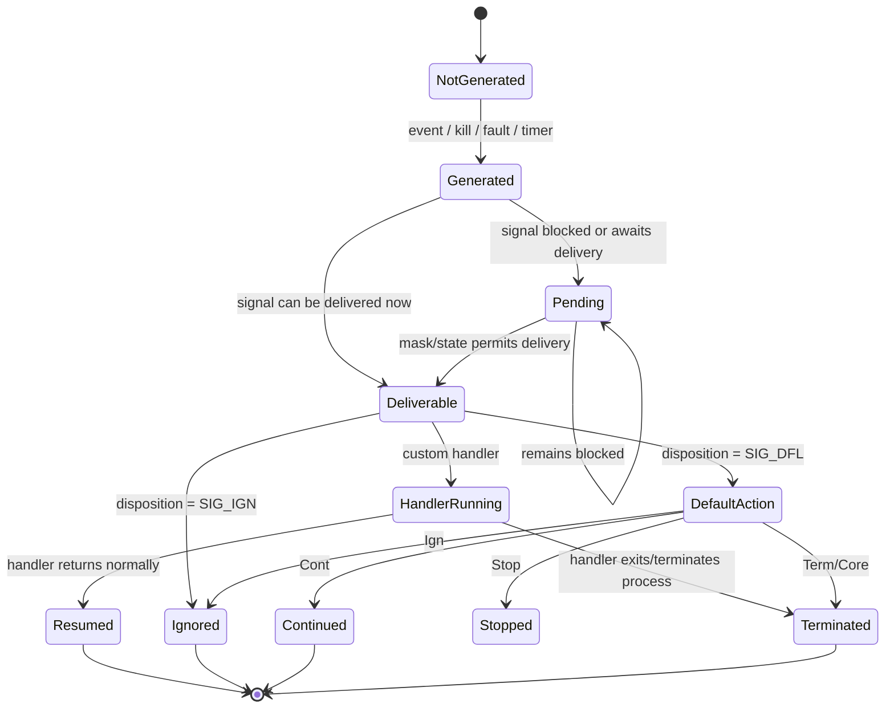
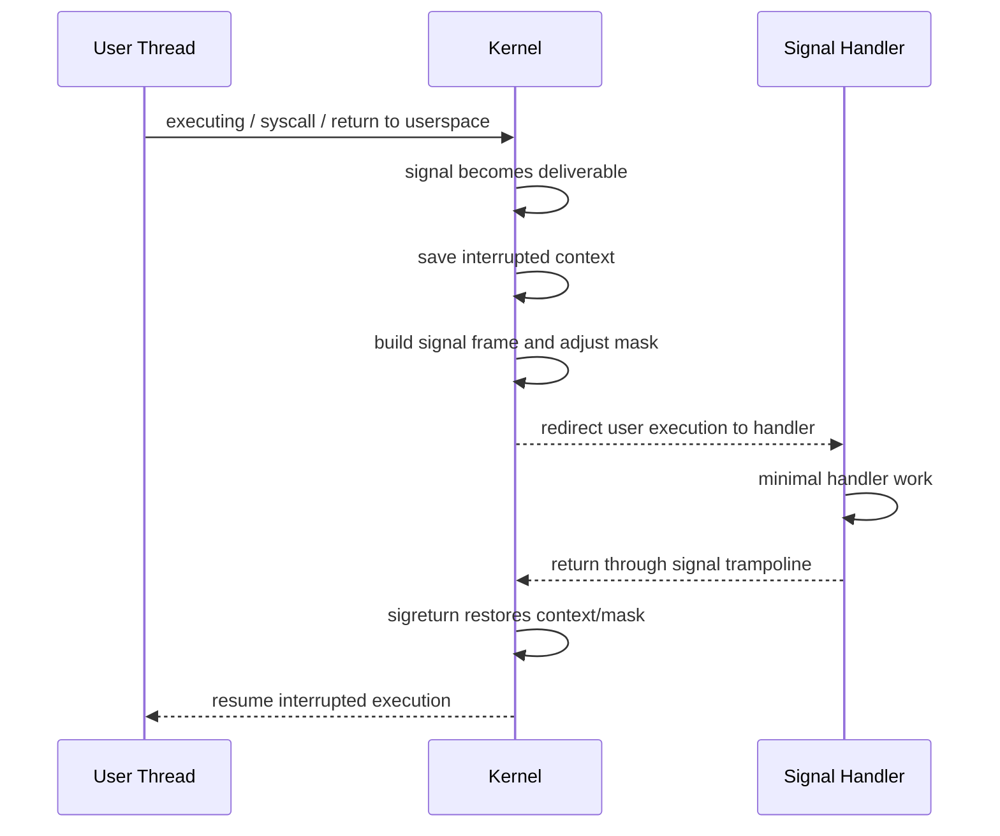

# Chủ đề 5 — Signal trong Linux

> **Mục tiêu dễ hiểu:** Hiểu signal là cơ chế kernel báo một event bất đồng bộ cho process/thread và cách disposition, mask, pending trạng thái phối hợp.
>
> **Bạn cần biết trước:** Biết process vòng đời, PID và system-call error model từ Topic 3–4.
>
> **Các từ khóa sẽ gặp nhiều:**
> - **signal** = thông báo/event bất đồng bộ
> - **disposition** = hành động process đã cấu hình cho signal
> - **mask** = tập signal đang bị chặn tạm thời
> - **pending** = signal đã phát sinh nhưng chưa được deliver
>
> **Quy ước đọc thuật ngữ:** khi gặp `state`, `context`, `semantics`, `object`, hãy hiểu lần lượt là **trạng thái**, **ngữ cảnh**, **hành vi theo chuẩn**, **đối tượng/tài nguyên**. Tên API và thuật ngữ chuẩn như process, thread, socket, mutex được giữ nguyên để bạn quen dần với tài liệu kỹ thuật.
>
> **Cách đọc nếu bạn mới bắt đầu:**
> 1. Lượt đầu chỉ đọc các ô **“Nói đơn giản”**, sơ đồ ASCII/Mermaid và phần **Tổng kết**.
> 2. Lượt hai đọc các mục `###` để hiểu API/khái niệm cụ thể.
> 3. Các mục `####`, caveat POSIX/Linux và edge case có thể để lần đọc thứ ba. **Không cần hiểu hết trong một lượt.**
>
> Chương này chỉ có **lý thuyết**, không có lab hay bài tập thực hành. Thuật ngữ tiếng Anh được giữ khi đó là tên chuẩn, nhưng luôn ưu tiên giải thích ý nghĩa trước.
---

## Mục lục

- [1. Signal là gì và đi qua những trạng thái nào?](#1-signal-là-gì-và-đi-qua-những-trạng-thái-nào)
- [2. Process sẽ làm gì khi nhận Signal?](#2-process-sẽ-làm-gì-khi-nhận-signal)
- [3. Các nhóm Signal thường gặp](#3-các-nhóm-signal-thường-gặp)
- [4. Ba trạng thái cần nhớ: Disposition, Mask và Pending](#4-ba-trạng-thái-cần-nhớ-disposition-mask-và-pending)
- [5. `sigaction()`: cấu hình cách xử lý Signal](#5-sigaction-cấu-hình-cách-xử-lý-signal)
- [6. Tạo và thay đổi tập Signal](#6-tạo-và-thay-đổi-tập-signal)
- [7. Gửi Signal và kiểm tra Permission](#7-gửi-signal-và-kiểm-tra-permission)
- [8. Handler chen vào luồng chạy như thế nào?](#8-handler-chen-vào-luồng-chạy-như-thế-nào)
- [9. Vì sao Signal Handler phải rất hạn chế?](#9-vì-sao-signal-handler-phải-rất-hạn-chế)
- [10. Signal làm gián đoạn System Call như thế nào?](#10-signal-làm-gián-đoạn-system-call-như-thế-nào)
- [11. Nhìn toàn bộ vòng đời Signal bằng sơ đồ](#11-nhìn-toàn-bộ-vòng-đời-signal-bằng-sơ-đồ)
- [12. Khi Signal không hoạt động như mong đợi](#12-khi-signal-không-hoạt-động-như-mong-đợi)
- [13. Liên hệ với Embedded Linux](#13-liên-hệ-với-embedded-linux)
- [14. Tổng kết và Mô hình tư duy](#14-tổng-kết-và-mô-hình-tư-duy)
- [15. Tài liệu tham khảo](#15-tài-liệu-tham-khảo)

---

## 1. Signal là gì và đi qua những trạng thái nào?

> **Nói đơn giản:** Signal giống một thông báo ngắn do kernel hoặc process khác gửi tới execution context. Nó không mang payload lớn như IPC message.


### 1.1 Signal trong Unix/Linux thực chất là gì?


Signal là một cơ chế notification/control event có lịch sử rất lâu trong Unix.

Một signal cho biết:

```text
"một event thuộc loại X đã xảy ra đối với process/thread"
```

Ví dụ event có thể đến từ:

```text
terminal
another process
kernel
hardware exception
timer
child-process state change
broken IPC stream
```

Mô hình tư duy:

```text
Event
  |
  v
Signal generated
  |
  v
Kernel records signal state
  |
  v
Signal becomes deliverable
  |
  v
Disposition determines action
```

Signal **không phải** một arbitrary byte stream.

Nó chủ yếu mang:

```text
signal identity
optional metadata for interfaces that define it
```

Do đó signal phù hợp với:

```text
notification
control
lifecycle event
```

hơn là truyền large structured data.

---

### 1.2 Signal không phải function call


Một function call có control flow trực tiếp:

```text
caller
  |
  v
callee
  |
  v
return
```

Signal có model khác:

```text
normal execution
      |
      | signal becomes delivered
      v
execution temporarily redirected
      |
      v
signal handler/default action
      |
      v
possibly resume interrupted context
```

Không nên hình dung:

```text
process A "gọi handler()" trực tiếp trong process B
```

Khi A gửi signal, A chỉ yêu cầu kernel generate signal cho target.

Kernel quyết định delivery theo:

```text
target
signal mask
pending state
disposition
thread selection
scheduling point
```

---

### 1.3 Signal là asynchronous notification — nhưng không phải lúc nào cũng “asynchronous” theo nghĩa đơn giản


Nhiều signals là asynchronous so với instruction stream của target:

```text
SIGTERM
SIGINT
SIGCHLD
SIGUSR1
```

Target không nhất thiết đang execute code liên quan event tại lúc signal generated.

Nhưng một số signals phát sinh synchronously từ execution fault, ví dụ:

```text
SIGSEGV
SIGILL
SIGFPE
SIGBUS
```

Concept:

```text
instruction executes
      |
      v
CPU/kernel detects exceptional condition
      |
      v
signal generated for current thread
```

Vì vậy cách nói chính xác hơn:

> Signals là một event-notification/control mechanism; generation có thể asynchronous hoặc synchronous relative tới current execution.

---

### 1.4 Signal vòng đời: generation → pending → delivery


Linux `signal(7)` phân biệt ba concept quan trọng:

```text
Generation
Pending
Delivery
```

Mô hình tư duy:

```text
Signal event
    |
    v
GENERATED
    |
    v
Is it immediately deliverable?
   / \
 no  yes
 |    |
 v    v
PENDING
 |    |
 | mask/state allows later
 +---------+
           |
           v
       DELIVERED
           |
           v
      disposition
```

Đây là mô hình tư duy cốt lõi của toàn chapter.

---

### 1.5 Signal generation là gì?


Signal được **generated** khi một event/API tạo signal instance/condition cho process hoặc thread.

Sources có thể gồm:

```text
kill()
raise()
terminal driver
timer expiration
child-process state transition
kernel-detected fault
pipe/socket condition
```

Generation chưa đồng nghĩa:

```text
handler đã chạy
```

Signal có thể bị block nên phải pending trước.

---

### 1.6 Signal pending là gì?


`signal(7)`:

> Signal bị block thì không được delivered cho tới khi được unblock. Trong thời gian từ generation tới delivery, signal được gọi là pending.

Mô hình tư duy:

```text
signal generated
      |
 target blocks signal?
   /       \
 yes        no
 |          |
 v          v
pending   eligible for delivery
```

Pending state quan trọng vì:

```text
blocked != lost automatically
```

Nhưng standard signals có coalescing semantics; nhiều occurrences không nhất thiết tạo many queued instances.

---

### 1.7 Signal delivery là gì?


Delivery là lúc kernel áp dụng signal tới target execution context.

Nếu disposition:

```text
default
ignore
handler
```

kernel thực hiện behavior tương ứng.

Với user-installed handler:

```text
normal user code
      |
signal delivery
      |
      v
handler executes
      |
      v
return from signal handler
      |
      v
resume interrupted execution
```

Trừ khi handler:

```text
terminates process
long-jumps
execs
changes control flow
```

hoặc signal default action không cho resume.

---

## 2. Process sẽ làm gì khi nhận Signal?

> **Nói đơn giản:** Mỗi signal có default action; process có thể ignore hoặc cài handler với nhiều signal, nhưng `SIGKILL`/`SIGSTOP` là ngoại lệ quan trọng.


### 2.1 Signal disposition


Mỗi signal có một **disposition** trong process.

Disposition có thể là:

```text
default action
ignore
user-defined handler
```

Mô hình tư duy:

```text
signal delivered
      |
      v
look up disposition
   /       |        \
  /        |         \
default   ignore    handler
```

Disposition được set bằng interfaces như:

```text
sigaction()
```

`signal()` tồn tại nhưng có portability/history issues.

---

### 2.2 Default action của signal


Mỗi standard signal có default action.

Categories thường được man-page biểu diễn như:

```text
Term    terminate process
Ign     ignore
Core    terminate + core dump
Stop    stop process
Cont    continue process
```

Default action là semantics khi process chưa override disposition.

Ví dụ:

```text
SIGTERM  default terminate
SIGSTOP  stop
SIGCONT  continue
SIGCHLD  default ignore-like disposition semantics
SIGSEGV  core/terminate
```

Exact table cần xem `signal(7)`.

---

### 2.3 Ignore và catch


#### 2.3.1 Ignore

Disposition:

```text
SIG_IGN
```

Signal được discarded according to signal semantics.

#### 2.3.2 Catch

Disposition points tới handler.

```text
signal delivered
      |
      v
user handler executes
```

Important:

```text
ignored signal
```

khác:

```text
blocked signal
```

Ignored signal không chờ để handler chạy sau.

Blocked signal có thể trở thành pending và được delivered khi unblock.

---

### 2.4 `SIGKILL` và `SIGSTOP` là trường hợp đặc biệt


POSIX/Linux định nghĩa:

```text
SIGKILL
SIGSTOP
```

không thể:

```text
caught
blocked
ignored
```

Lý do system-design:

```text
kernel/admin phải luôn có hard control
```

Do đó:

```text
SIGTERM
```

có thể cho application cleanup,

còn:

```text
SIGKILL
```

không cho user-space handler chạy cleanup.

Mô hình tư duy:

```text
SIGTERM
   |
user-defined graceful path possible

SIGKILL
   |
kernel-enforced termination
no signal handler
```

---

## 3. Các nhóm Signal thường gặp

> **Nói đơn giản:** Một số signal là control event (`SIGINT`, `SIGTERM`), một số phản ánh fault (`SIGSEGV`, `SIGILL`, `SIGFPE`). Không nên coi tất cả giống nhau.


### 3.1 Signal number và signal name


Signals có symbolic names:

```text
SIGINT
SIGTERM
SIGCHLD
SIGSEGV
```

và integer numbers.

Application/source code nên ưu tiên symbolic constants.

Ví dụ:

```text
SIGTERM
```

không phải magic integer.

---

### 3.2 Không nên hard-code signal number giữa các architecture


`signal(7)` lưu ý signal numbers có thể khác giữa architectures.

Một số signals như:

```text
SIGKILL
SIGSTOP
```

có common numbers trên many systems, nhưng portable code vẫn dùng symbolic names.

Mô hình tư duy:

```text
meaning
  |
  v
SIGTERM
```

thay vì:

```text
hard-coded 15 everywhere
```

---

### 3.3 Những standard signals quan trọng


Nhóm thường gặp:

```text
SIGINT    interactive interrupt
SIGTERM   termination request
SIGKILL   forced termination
SIGSTOP   forced stop
SIGCONT   continue
SIGTSTP   terminal stop request
SIGHUP    hangup/session-related signal
SIGCHLD   child state change
SIGPIPE   broken pipe write
SIGALRM   timer alarm
SIGUSR1   application-defined
SIGUSR2   application-defined
SIGSEGV   invalid memory access fault class
SIGBUS    bus/memory access fault class
SIGILL    illegal instruction
SIGFPE    arithmetic exception class
```

Không nên chỉ học “signal X = action Y”.

Quan trọng hơn là biết:

```text
source
default action
whether catchable/blockable
typical lifecycle role
```

---

### 3.4 `SIGINT`, `SIGTERM`, `SIGKILL`: ba semantics rất khác nhau


#### 3.4.1 `SIGINT`

Thường được terminal driver generate khi interactive user gửi interrupt character như `Ctrl+C`, target tới foreground process group.

Nó là:

```text
interactive interrupt request
```

không phải universal “kill”.

#### 3.4.2 `SIGTERM`

General termination request.

Application có thể:

```text
catch
cleanup
flush application state
shutdown services
```

#### 3.4.3 `SIGKILL`

Immediate kernel-enforced termination.

Không handler.

Không cleanup bằng signal handler.

ASCII:

```text
SIGINT
  user-interactive interruption

SIGTERM
  graceful termination request

SIGKILL
  forced termination
```

---

### 3.5 `SIGCHLD` và process vòng đời


Khi child:

```text
terminates
stops
continues
```

parent có thể nhận `SIGCHLD` theo signal/wait semantics.

Mô hình tư duy:

```text
Child state changes
       |
       v
kernel records child status
       |
       +--> SIGCHLD notification to parent
       |
       +--> wait()/waitpid() can collect status
```

Important:

> `SIGCHLD` notification và `wait()` reaping là hai pieces của cùng vòng đời nhưng không phải cùng operation.

Handler không tự động reap child trừ khi program thiết kế như vậy.

---

### 3.6 `SIGPIPE` và broken stream


Khi process ghi vào pipe/socket-like connection mà không còn reader phù hợp:

```text
write
  |
  v
no reader
  |
  +--> SIGPIPE
  |
  +--> EPIPE according to operation semantics
```

Default action của `SIGPIPE` là terminate process.

Programs/network libraries thường cần intentional policy:

```text
default terminate
ignore SIGPIPE and handle EPIPE
object-specific suppression
```

Topic 3 đã giới thiệu `EPIPE`.

Signal topic giải thích notification side.

---

### 3.7 `SIGSEGV`, `SIGBUS`, `SIGILL`, `SIGFPE`


Nhóm này thường liên quan synchronous execution faults.

#### 3.7.1 `SIGSEGV`

Invalid memory-reference/access class.

#### 3.7.2 `SIGBUS`

Bus/address-alignment/mapping-related memory fault class.

#### 3.7.3 `SIGILL`

Illegal instruction.

#### 3.7.4 `SIGFPE`

Arithmetic exception class, không chỉ floating point.

Important nuance từ `signal(7)`:

> Mapping từ hardware exception sang exact signal có architecture-specific details và không phải lúc nào intuitive.

Do đó không nên kết luận:

```text
mọi invalid access = SIGSEGV
```

trên mọi architecture/context.

---

## 4. Ba trạng thái cần nhớ: Disposition, Mask và Pending

> **Nói đơn giản:** Để hiểu signal, luôn tách ba thứ: disposition “làm gì”, mask “đang chặn gì”, pending “đang chờ gì”.

> **Hình dung:** Signal đã phát sinh nhưng đang bị mask giống một thông báo đã tới hộp thư nhưng bạn tạm bật “không làm phiền”. Nó ở pending cho tới khi có thể được deliver.


### 4.1 Signal disposition là process-wide


Theo POSIX/Linux threads model, signal disposition là process-wide.

Nếu một thread gọi:

```text
sigaction(SIGTERM, ...)
```

disposition áp dụng cho process, không chỉ riêng thread đó.

Mô hình tư duy:

```text
Process
 |
 +--> shared signal dispositions
 |
 +--> Thread A mask
 +--> Thread B mask
 +--> Thread C mask
```

Đây là distinction cực kỳ quan trọng trước khi học threads.

---

### 4.2 Signal mask là gì?


Signal mask là set các signals đang **blocked** đối với execution thread.

Mô hình tư duy:

```text
Thread signal mask

blocked:
  SIGUSR1
  SIGTERM

unblocked:
  SIGINT
  SIGCHLD
  ...
```

Nếu blocked signal generated:

```text
signal pending
```

cho tới khi eligible for delivery.

---

### 4.3 Signal mask là per-thread


`signal(7)`:

> Each thread has an independent signal mask.

Program thay đổi signal mask bằng các signal-mask APIs phù hợp; trong phạm vi chapter này, interface cốt lõi là `sigprocmask()`.

Mô hình tư duy:

```text
Process dispositions
      shared

Thread A mask:
  SIGUSR1 blocked

Thread B mask:
  SIGUSR1 unblocked
```

Process-directed `SIGUSR1` có thể được delivered tới eligible thread theo selection rules.

---

### 4.4 Blocked signal không đồng nghĩa ignored signal


Tách:

```text
BLOCKED
  signal generation recorded/pending
  delivery delayed

IGNORED
  disposition discards signal
```

ASCII:

```text
Generated signal
    |
    +--> disposition ignore -> discarded
    |
    +--> blocked -> pending
                     |
                  unblock
                     |
                  delivered
```

---

### 4.5 Pending signal và signal mask


Pending set là signal state chờ delivery.

Nếu signal đang blocked:

```text
generated
   ↓
pending
   ↓
later mask changes
   ↓
eligible
   ↓
delivered
```

`sigpending()` cho caller biết pending blocked signals theo interface semantics.

Pending state không phải general-purpose ordered queue cho standard signals.

---

## 5. `sigaction()`: cấu hình cách xử lý Signal

> **Nói đơn giản:** `sigaction()` là interface chính để cấu hình handler/disposition và mask/flags áp dụng trong lúc handler chạy.


### 5.1 `sigaction()` — interface chuẩn để thiết lập disposition


`sigaction()` là interface preferred cho reliable signal handling.

Concept:

```text
sigaction(signum, new_action, old_action)
```

Cho phép:

```text
set handler/default/ignore
configure handler mask
configure behavior flags
retrieve previous action
```

Mô hình tư duy:

```text
Signal number
      |
      v
Process disposition table
      |
      +--> handler / default / ignore
      +--> sa_mask
      +--> sa_flags
```

---

### 5.2 `struct sigaction`


Conceptual structure:

```c
struct sigaction {
    handler field;
    sigset_t sa_mask;
    int sa_flags;
    ...
};
```

Exact declarations/platform ABI differ.

Các phần quan trọng:

```text
handler
  what to execute

sa_mask
  extra signals blocked while handler runs

sa_flags
  modify delivery/handler semantics
```

---

### 5.3 `sa_handler` và `sa_sigaction`


Hai handler forms:

#### 5.3.1 `sa_handler`

Simple handler:

```text
handler(int signo)
```

#### 5.3.2 `sa_sigaction`

Khi `SA_SIGINFO` set:

```text
handler(int signo, siginfo_t *info, void *context)
```

Cung cấp metadata nhiều hơn.

Không set cả hai như hai independent handlers; chúng có thể share storage/union semantics tùy implementation.

---

### 5.4 `sa_mask`: signal nào bị block trong khi handler chạy?


Khi handler invoked, kernel xây effective mask gồm:

```text
current thread mask
+
sa_mask
+
signal currently being handled
```

signal current thường auto-block trong handler trừ khi `SA_NODEFER`.

Mô hình tư duy:

```text
before handler:
mask = M

during handler:
mask = M
     ∪ sa_mask
     ∪ {current_signal}
```

Sau handler normal return:

```text
previous mask restored
```

Điều này giúp hạn chế unintended handler reentrancy.

---

### 5.5 `SA_RESTART`


`SA_RESTART` yêu cầu kernel/libc restart một số interrupted blocking interfaces khi handler return.

Nhưng:

> Không phải mọi syscall/library function đều được restart.

Mô hình tư duy:

```text
blocking syscall
     |
signal handler
     |
     +--> restartable + SA_RESTART
     |        |
     |        v
     |   syscall resumes/restarts
     |
     +--> otherwise
              |
              v
          EINTR / special result
```

Detailed interface list xem `signal(7)`.

---

### 5.6 Vì sao `signal()` không nên là interface mặc định


Linux `signal(2)` man-page cảnh báo behavior lịch sử của `signal()` thay đổi giữa Unix versions.

Khuyến nghị:

```text
use sigaction()
```

`sigaction()` cho:

```text
predictable mask semantics
flags
metadata
portable POSIX control
```

Do đó trong mô hình tư duy hiện đại:

```text
sigaction = canonical API
signal    = legacy/simple interface with history caveats
```

---

## 6. Tạo và thay đổi tập Signal

> **Nói đơn giản:** `sigset_t` chỉ là cách biểu diễn một tập signal; `sigprocmask()` thay mask và `sigpending()` xem signal đang pending.


### 6.1 `sigset_t` và signal sets


Signal masks và nhiều APIs dùng abstract type:

```text
sigset_t
```

Operations conceptually:

```text
empty set
full set
add signal
remove signal
test membership
```

Không nên assume internal representation là one integer bitmask có size cố định.

Application phải dùng các `sigset_t` APIs thay vì phụ thuộc vào representation bên trong.

---

### 6.2 `sigprocmask()`


Single-threaded process có thể manipulate signal mask:

```text
SIG_BLOCK
SIG_UNBLOCK
SIG_SETMASK
```

Mô hình tư duy:

```text
old mask
  |
operation
  |
  v
new mask
```

#### 6.2.1 `SIG_BLOCK`

```text
new = old ∪ set
```

#### 6.2.2 `SIG_UNBLOCK`

```text
new = old - set
```

#### 6.2.3 `SIG_SETMASK`

```text
new = set
```

`SIGKILL` và `SIGSTOP` cannot be blocked; attempts to include them are silently ignored on Linux according to man-page behavior.

---

### 6.3 `sigpending()`


`sigpending()` returns set of signals that:

```text
are pending for calling thread/process context
and blocked from delivery
```

Mô hình tư duy:

```text
generated signal
    |
 blocked?
   / \
 yes  no
 |     |
pending delivered
 |
sigpending() can expose pending membership
```

It does not consume signal.

---

## 7. Gửi Signal và kiểm tra Permission

> **Nói đơn giản:** `kill()` gửi signal theo PID/target hành vi theo chuẩn và kernel còn kiểm tra quyền truy cập. Tên “kill” không có nghĩa mọi signal đều giết process.


### 7.1 `kill()` không có nghĩa đơn giản là “kill process”


System call name gây hiểu nhầm.

```c
kill(pid, sig)
```

means:

```text
send/generate a signal toward selected process/process group
```

Signal có thể là:

```text
SIGTERM
SIGUSR1
SIGSTOP
SIGCONT
0
...
```

Vì vậy `kill()` là **signal-sending interface**, không chỉ forced termination.

---

### 7.2 `kill()` target semantics theo PID argument


POSIX/Linux semantics conceptually:

```text
pid > 0
  target process with that PID

pid == 0
  target processes in caller's process group

pid == -1
  broad permitted process set with exclusions/rules

pid < -1
  target process group ID = -pid
```

Permissions and namespace rules apply.

Signal number:

```text
0
```

performs permission/existence checking without delivering a real signal according to `kill(2)` semantics.

---

### 7.3 `raise()`


`raise(sig)` sends signal to calling process/thread context according to C/POSIX semantics.

In modern glibc threading implementation it targets calling thread using underlying mechanisms.

Concept:

```text
current execution context
      |
    raise(sig)
      |
      v
signal generated for self
```

Useful distinction:

```text
kill()
  targets process/process group

raise()
  self-signal abstraction
```

---

### 7.4 Signal permission model


A process cannot arbitrarily signal every other process.

Kernel checks permissions/credentials.

Linux `kill(2)` uses rules involving:

```text
CAP_KILL
real/effective/saved user IDs
target credentials
special SIGCONT session rule
namespace context
```

Exact security rules matter for production.

Mô hình tư duy:

```text
sender
  |
  | request signal
  v
kernel permission check
  |
  +--> allowed -> generate signal
  |
  +--> denied -> EPERM
```

---

## 8. Handler chen vào luồng chạy như thế nào?

> **Nói đơn giản:** Handler chen vào control flow bất đồng bộ. Nó có thể chạy giữa lúc code bình thường đang ở một điểm khác, nên phải rất cẩn thận với shared/library trạng thái.

> **Hình dung:** Handler không chạy ở một “luồng bí mật” tách biệt. Nó chen vào execution context tại một thời điểm bất đồng bộ rồi trả control về code bị gián đoạn.


### 8.1 Signal-handler execution model


When kernel delivers signal with user handler, `signal(7)` describes conceptual steps.

Simplified:

```text
1. kernel notices deliverable signal
2. interrupted user context recorded
3. signal mask adjusted
4. signal frame prepared on user stack/alternate stack
5. instruction pointer redirected to handler
6. handler runs
7. handler returns through trampoline
8. sigreturn restores previous context/mask
9. interrupted execution resumes
```

This is fundamental:

> Handler execution is not a normal C call made by application code.

Kernel constructs a return path to restore interrupted execution state.

---

### 8.2 Handler có chạy “song song” với code bị interrupt không?


Trong a single thread:

```text
no
```

Handler temporarily interrupts that thread's normal execution.

```text
normal code
    |
    X paused
    |
handler
    |
return
    |
normal code resumes
```

But in multithreaded process:

```text
handler on Thread A
```

can run concurrently with Thread B/C.

Therefore global/shared state becomes a concurrency concern.

---

### 8.3 Handler reentrancy và nested signals


While handler runs, other signals can be delivered if unblocked.

Concept:

```text
Handler A running
   |
   +--> Signal B delivered
           |
           v
       Handler B
           |
         return
           |
           v
       Handler A resumes
```

Current signal itself is normally blocked during handler unless `SA_NODEFER`.

Thus handlers can nest.

This is one reason arbitrary library calls inside handlers are dangerous.

---

## 9. Vì sao Signal Handler phải rất hạn chế?

> **Nói đơn giản:** Không phải function nào cũng an toàn trong signal handler. Async-signal-safe là tập rất hạn chế được POSIX đảm bảo trong ngữ cảnh này.


### 9.1 Async-signal-safety


POSIX defines a set of functions that must be async-signal-safe.

A function is safe in handler context if it can be called without violating internal invariants when asynchronous signal interrupts code.

Examples in POSIX list include interfaces such as:

```text
_exit()
write()
kill()
sigaction()
sigprocmask()
```

depending exact standard revision/list.

Always consult current `signal-safety(7)` / POSIX list.

Do not infer safety from:

```text
"function looks simple"
```

---

### 9.2 Vì sao nhiều libc function không an toàn trong signal handler?


Example conceptual problem:

```text
main thread/code inside malloc()
      |
      | internal allocator state half-updated
      v
signal arrives
      |
      v
handler calls malloc()
      |
      v
same allocator state re-entered
      |
      v
corruption/deadlock/undefined behavior
```

Similarly:

```text
printf()
stdio buffering
locale
locks
dynamic allocation
```

may use internal non-reentrant state.

Signal handler can interrupt these operations at arbitrary point.

---

### 9.3 Signal handler nên làm gì ở mức thiết kế?


Good mô hình tư duy:

```text
handler = minimal notification bridge
```

Typical safe design:

```text
set small atomic flag
write minimal event to pipe/eventfd where permitted/design supports
record signal state using async-signal-safe operations
return quickly
```

Then normal control flow performs:

```text
logging
allocation
complex cleanup
I/O protocols
state transitions
```

Do not build large business logic inside handler.

---

### 9.4 `volatile sig_atomic_t`


C standard provides:

```text
sig_atomic_t
```

type that can be accessed atomically with respect to signal interruptions at language-required level.

Common pattern concept:

```text
volatile sig_atomic_t flag;
```

Handler sets flag.

Normal code observes flag.

Important nuance:

```text
volatile
```

does not make this a general multithreaded synchronization primitive.

It addresses compiler access semantics, not C11 thread-memory ordering.

For threads, use proper atomics/synchronization.

---

### 9.5 `errno` trong signal handler


Handler may call functions that alter `errno`.

If interrupted code expects its current `errno` preserved, handler should conceptually:

```text
save errno on entry
perform safe operations
restore errno before return
```

`signal-safety(7)` discusses errno handling.

Reason:

```text
errno is thread-local process execution state
```

handler executes in same thread context.

---

## 10. Signal làm gián đoạn System Call như thế nào?

> **Nói đơn giản:** Signal có thể interrupt blocking syscall và gây `EINTR`; `SA_RESTART` giúp một số call restart nhưng không phải mọi call/mọi trường hợp.


### 10.1 Signal interrupting system calls


A thread blocked in syscall/library function may receive handler-triggering signal.

After handler returns, operation may:

```text
restart automatically
```

or:

```text
fail with EINTR
```

or:

```text
return partial progress
```

depending:

```text
interface
SA_RESTART
object type
whether data already transferred
Linux-specific behavior
```

No one-line universal rule.

---

### 10.2 `EINTR`


`EINTR`:

```text
Interrupted system call
```

means operation was interrupted by signal before completing according to that API's semantics.

Important:

```text
EINTR
!=
hardware failure
```

It is control-flow interaction between signal delivery and blocking operation.

Retry policy depends on:

```text
operation
deadline/timeout
side effects
partial progress
application cancellation semantics
```

Do not blindly retry every `EINTR` forever.

---

### 10.3 `SA_RESTART` không restart mọi syscall


`signal(7)` lists Linux interfaces that are:

```text
restartable under SA_RESTART
```

and others that always fail with `EINTR` or have special behavior.

Examples of commonly restartable "slow" interfaces include certain:

```text
read/write/ioctl on slow devices
wait-family calls
some socket calls without timeout
```

while interfaces such as:

```text
poll/ppoll
select/pselect
epoll_wait/epoll_pwait
sigsuspend
sigtimedwait
```

have different interruption semantics.

Exact current list should be checked in `signal(7)`.

---

### 10.4 Partial I/O và signal interruption


Suppose `read()`/`write()` transfers some bytes before signal.

Operation may return:

```text
positive byte count
```

rather than:

```text
-1 / EINTR
```

according to interface semantics.

Mô hình tư duy:

```text
I/O starts
  |
  +--> transfers N bytes
  |
signal arrives
  |
  v
return N
```

Therefore robust I/O code must prioritize actual return value over assuming “signal happened => EINTR”.

---

## 11. Nhìn toàn bộ vòng đời Signal bằng sơ đồ

> **Nói đơn giản:** Các diagram ở đây chỉ để nối phát sinh → pending/mask → delivery → handler/default action thành một luồng duy nhất.


### 11.1 Signal vòng đời state machine




Notes:

```text
standard signal coalescing
thread/process pending distinctions
nested delivery
kernel internal state
```

được giản lược khỏi diagram.

---

### 11.2 Handler execution sequence




Sơ đồ mô tả high-level delivery model, không phải exact architecture implementation.

---

### 11.3 Signal mask transformation khi handler chạy


ASCII:

```text
Before delivery:

Thread mask
+----------------------+
| SIGTERM blocked      |
| SIGUSR2 blocked      |
+----------------------+


Handler for SIGUSR1 has:
sa_mask = { SIGCHLD }


During handler:

effective blocked set
=
old thread mask
+
SIGCHLD
+
SIGUSR1 itself
(unless SA_NODEFER)


After normal handler return:

old thread mask restored
```

This explains why same signal normally does not recursively re-enter its own handler.

---

## 12. Khi Signal không hoạt động như mong đợi

> **Nói đơn giản:** Khi handler “không chạy”, hãy kiểm tra signal có phát sinh không, bị block không, disposition gì và process còn sống không.


### 12.1 Error model và tư duy debug Signal


Debug by layers:

```text
1. Was signal generated?
      ↓
2. Correct target process/process group?
      ↓
3. Sender has permission?
      ↓
4. Signal blocked?
      ↓
5. Signal pending?
      ↓
6. Disposition default/ignore/handler?
      ↓
7. Correct thread eligible?
      ↓
8. Handler safe?
      ↓
9. Syscall interrupted/restarted?
      ↓
10. Process terminated/stopped/reaped?
```

#### 12.1.1 “Handler không chạy”

Possible causes:

```text
signal blocked
wrong target
signal ignored
process exited
different thread accepted it
signal coalesced
handler disposition replaced by exec
```

#### 12.1.2 “Signal gửi nhiều lần nhưng handler ít lần”

For standard signal:

```text
coalescing is expected
```

Do not treat standard signal as event counter.

#### 12.1.3 “Process hangs after adding signal handler”

Possible classes:

```text
handler called non-async-signal-safe function
deadlock due interrupted library lock
race in pause/check logic
wrong mask
signal recursively re-enters
```

#### 12.1.4 “read() suddenly returns -1”

Check:

```text
errno == EINTR?
SA_RESTART?
partial transfer happened?
```

#### 12.1.5 “SIGTERM không dừng process”

Possible:

```text
blocked
ignored
custom handler does not terminate
wrong target
permission/namespace issue
```

#### 12.1.6 “SIGKILL không dừng ngay”

`SIGKILL` cannot be caught/blocked, but a task in certain kernel uninterruptible states may not complete termination until it reaches a point where kernel can act on pending fatal signal.

Therefore “not instant in wall-clock time” does not mean process caught SIGKILL.

---

## 13. Liên hệ với Embedded Linux

> **Nói đơn giản:** SIGTERM/SIGINT thường được dùng cho graceful shutdown của service nhúng; fault signals giúp chẩn đoán crash.


### 13.1 Liên hệ với Embedded Linux


Signals appear everywhere in Embedded Linux userspace.

#### 13.1.1 Graceful service shutdown

Service manager sends:

```text
SIGTERM
```

Application transitions:

```text
Running
   |
SIGTERM
   |
   v
Stopping
   |
close application resources
stop workers
persist necessary state
   |
   v
Exit
```

Complex cleanup should occur in normal control flow, not large async handler.

---

#### 13.1.2 Reload configuration

Some daemons conventionally use:

```text
SIGHUP
```

to request reload.

This is application convention.

Kernel only delivers signal; application defines reload semantics.

---

#### 13.1.3 Child workers

Supervisor/daemon:

```text
parent
 |
 +--> worker A
 +--> worker B
```

receives `SIGCHLD` and reaps workers.

Failure to reap creates zombies.

---

#### 13.1.4 UART/TTY interactive applications

Terminal-generated:

```text
SIGINT
SIGTSTP
SIGHUP
```

matter for command-line/serial applications.

On embedded serial console:

```text
UART driver
   |
TTY subsystem
   |
foreground process group
   |
signal delivery
```

---

#### 13.1.5 Pipes and sockets

Broken communication can lead to:

```text
SIGPIPE
EPIPE
```

Network/IPC software must define intentional handling policy.

---

#### 13.1.6 Watchdog/service architecture

Signals can coordinate:

```text
shutdown
reload
child lifecycle
timeout notification
```

but hardware watchdog servicing itself should not be designed around unsafe complex signal-handler logic.

---

#### 13.1.7 Fault diagnostics

Signals like:

```text
SIGSEGV
SIGBUS
SIGILL
SIGABRT
```

can mark fatal application failures.

Production systems may have:

```text
core-dump policy
service restart policy
crash logging
supervision
```

but signal handler is not a magic way to safely recover arbitrary corrupted process state.

---

#### 13.1.8 Headless systems

Embedded Linux often lacks GUI.

Signals integrate with:

```text
shell
service manager
process supervisor
debugger
/proc
```

making them central to process control.

---

## 14. Tổng kết và Mô hình tư duy

> **Nói đơn giản:** Mô hình tư duy cần nhớ: generate → pending nếu bị chặn → deliver khi hợp lệ → default/ignore/handler.


```text
event
  ↓
signal generated
  ↓
pending?
  ↓
mask allows delivery
  ↓
disposition
  ├─ default
  ├─ ignore
  └─ handler
```

Các điểm cần giữ:
- Signal là asynchronous notification mechanism, không phải normal function call.
- Disposition quyết định default/ignore/handler; `SIGKILL` và `SIGSTOP` không thể catch/ignore/block theo normal rules.
- Signal mask quyết định signal nào tạm thời bị block.
- `sigaction()` là interface chuẩn để thiết lập handler/disposition và handler mask.
- `kill()` gửi signal theo PID-target semantics; `raise()` gửi signal cho chính execution context theo POSIX semantics.
- Handler chạy trong context bị interrupt nên chỉ được gọi async-signal-safe operations theo contract.
- Signal có thể interrupt blocking syscall và dẫn tới `EINTR`; `SA_RESTART` không phải blanket guarantee cho mọi syscall.

---

## 15. Tài liệu tham khảo

> **Nói đơn giản:** Nguồn tham khảo để kiểm chứng signal hành vi theo chuẩn và danh sách async-signal-safe.


- POSIX.1-2024 signal interfaces: https://pubs.opengroup.org/onlinepubs/9799919799/
- `signal(7)`: https://man7.org/linux/man-pages/man7/signal.7.html
- `sigaction(2)`: https://man7.org/linux/man-pages/man2/sigaction.2.html
- `sigprocmask(2)`: https://man7.org/linux/man-pages/man2/sigprocmask.2.html
- `sigpending(2)`: https://man7.org/linux/man-pages/man2/sigpending.2.html
- `kill(2)`: https://man7.org/linux/man-pages/man2/kill.2.html
- `raise(3)`: https://man7.org/linux/man-pages/man3/raise.3.html
- `signal-safety(7)`: https://man7.org/linux/man-pages/man7/signal-safety.7.html
- The Linux Programming Interface: https://man7.org/tlpi/

---

> **Điều hướng:** [← Chủ đề 4 — Process](README-topic-04.md) · [Chủ đề 6 — Multithreading →](README-topic-06.md)
