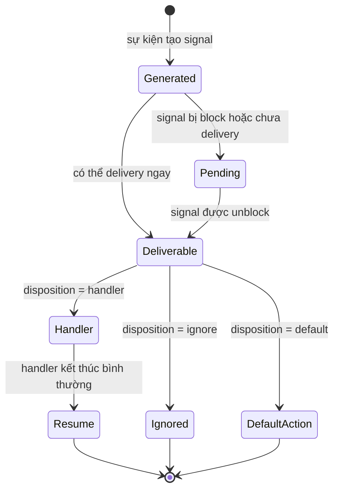

# Chủ đề 5 — Signal trong Linux

> **Mục tiêu:** hiểu `signal` là cơ chế thông báo bất đồng bộ của Unix/Linux, từ lúc signal được tạo (`signal generation`), có thể ở trạng thái `pending`, cho tới lúc xảy ra `signal delivery` và xử lý.
>
> **Quy ước ngôn ngữ:** phần giải thích dùng Tiếng Việt nhưng giữ `signal` bằng tiếng Anh để không nhầm với tín hiệu điện trong Embedded. Các thuật ngữ chuẩn `signal generation`, `pending`, `signal delivery`, `signal disposition`, `signal mask`, `handler`, `async-signal-safe`, cùng tên signal, API, cờ và mã lỗi được giữ nguyên để tra cứu đúng Linux/POSIX.
>
> **Phạm vi:** `signal generation` → `pending` → `signal delivery`, `signal disposition`, `signal mask`, `sigaction()`, `sigprocmask()`, `kill()`, `raise()`, hàm xử lý signal, async-signal-safety, `EINTR`, `SA_RESTART`, các signal quan trọng.
>
> Chương này chỉ có **lý thuyết**, không có bài thực hành.

Signal nên được hiểu là **một cơ chế thông báo do kernel chuyển tới tiến trình hoặc luồng**, chứ không phải một lời gọi hàm bình thường. Khi signal phát sinh, nó có thể ở trạng thái `pending`, bị chặn bởi `signal mask`, bị bỏ qua, thực hiện hành động mặc định hoặc làm chương trình chuyển sang một handler đã đăng ký.

Điểm khó nhất của signal không nằm ở tên `SIGINT` hay `SIGTERM`, mà ở thời điểm `signal delivery` và những giới hạn khi handler chen vào luồng thực thi hiện tại. Vì vậy chương này đi từ vòng đời signal tới `sigaction()`, `signal mask`, `EINTR` và quy tắc async-signal-safe.

**Cách đọc nếu bạn mới bắt đầu.** Trước hết hãy đọc phần **Nói đơn giản** ở đầu mỗi mục lớn để nắm câu hỏi mà mục đó đang giải quyết. Sau đó xem sơ đồ và ví dụ để hình thành mô hình trong đầu; chưa cần nhớ mọi cờ, mã lỗi hay trường hợp đặc biệt. Khi ý chính đã rõ, hãy đọc các mục `###` theo thứ tự và quay lại phần giải thích trước đó nếu gặp một thuật ngữ chưa quen.

---

## Mục lục

- [1. `signal` là gì?](#1-signal-là-gì)
- [2. Vòng đời của một `signal`](#2-vòng-đời-của-một-signal)
- [3. Tiến trình làm gì khi nhận `signal`?](#3-tiến-trình-làm-gì-khi-nhận-signal)
- [4. Các signal thường gặp](#4-các-signal-thường-gặp)
- [5. `disposition`, `signal mask` và trạng thái `pending`](#5-disposition-signal-mask-và-trạng-thái-pending)
- [6. `sigaction()`: cấu hình `signal disposition`](#6-sigaction-cấu-hình-signal-disposition)
- [7. `signal set` và `sigprocmask()`](#7-signal-set-và-sigprocmask)
- [8. Gửi signal bằng `kill()` và `raise()`](#8-gửi-signal-bằng-kill-và-raise)
- [9. `signal handler` chen vào luồng chạy như thế nào?](#9-signal-handler-chen-vào-luồng-chạy-như-thế-nào)
- [10. Vì sao hàm xử lý signal phải rất hạn chế?](#10-vì-sao-hàm-xử-lý-signal-phải-rất-hạn-chế)
- [11. Signal và `system call`: `EINTR`, `SA_RESTART`](#11-signal-và-system-call-eintr-sa_restart)
- [12. Tư duy gỡ lỗi signal](#12-tư-duy-gỡ-lỗi-signal)
- [13. Liên hệ với Embedded Linux](#13-liên-hệ-với-embedded-linux)
- [14. Tổng kết](#14-tổng-kết)
- [15. Tài liệu tham khảo](#15-tài-liệu-tham-khảo)

---

## 1. `signal` là gì?

> **Nói đơn giản:** `signal` là một thông báo bất đồng bộ mà Linux kernel hoặc tiến trình khác gửi tới tiến trình để báo một sự kiện như yêu cầu kết thúc, lỗi hay timer hết hạn.

### 1.1 `signal` không phải lời gọi hàm thông thường

Lời gọi hàm thông thường:

```text
code A
  |
gọi hàm
  |
hàm chạy
  |
trả về
  |
code A tiếp tục
```

`signal`:

```text
code đang chạy
    |
    | sự kiện xảy ra bất kỳ lúc thích hợp
    v
Linux kernel chuẩn bị signal delivery
    |
    v
handler/default action
    |
    v
có thể quay lại mã đang chạy trước đó hoặc thay đổi trạng thái tiến trình
```

Điểm khác biệt lớn là **thời điểm `signal delivery` xảy ra không nhất thiết do code hiện tại gọi trực tiếp**.

### 1.2 Nguồn tạo signal

`signal` có thể phát sinh do:

```text
một tiến trình gọi kill()
terminal tạo SIGINT/SIGTSTP
tiến trình con thay đổi trạng thái -> SIGCHLD
pipe/socket bị đóng -> SIGPIPE
lỗi CPU/bộ nhớ (`fault`) -> SIGSEGV/SIGILL/SIGFPE...
Linux kernel/subsystem tạo signal
```

### 1.3 “Bất đồng bộ” không phải lúc nào cũng có nghĩa ngẫu nhiên

Một số signal gắn chặt với instruction đang thực thi, ví dụ fault như `SIGSEGV`.

Một số signal đến từ sự kiện bên ngoài luồng thực thi hiện tại, như `SIGTERM` do tiến trình khác gửi.

Do đó nên phân biệt lỗi đồng bộ phát sinh từ chính luồng thực thi hiện tại với thông báo bất đồng bộ đến từ bên ngoài. Cả hai trường hợp đều có thể được biểu diễn qua cơ chế `signal`, nhưng nguyên nhân và cách suy luận khác nhau.

---

## 2. Vòng đời của một `signal`

> **Nói đơn giản:** Một `signal` đi qua các bước: `signal generation`, có thể ở trạng thái `pending` nếu đang bị block, sau đó `signal delivery` xảy ra để hệ thống áp dụng cách xử lý tương ứng.

Ba khái niệm nền tảng:

```text
signal generation
   |
   v
đang chờ
   |
   v
signal delivery
```

Trong tài liệu này:

```text
phát sinh
   |
   v
đang chờ
   |
   v
signal delivery/xử lý
```

### 2.1 `signal generation`

`signal generation` xảy ra khi một sự kiện/API tạo ra nó cho đối tượng đích.

### 2.2 `pending`

Nếu `signal delivery` chưa thể xảy ra ngay, nó có thể ở trạng thái đang chờ.

Một lý do quan trọng:

```text
signal đang bị chặn bởi `signal mask`
```

### 2.3 `signal delivery`

Khi signal đủ điều kiện được delivery, Linux kernel áp dụng cách xử lý tương ứng: `ignore`, `handler` và hành động mặc định.

### 2.4 Sơ đồ trạng thái



---

## 3. Tiến trình làm gì khi nhận `signal`?

> **Nói đơn giản:** Khi `signal delivery` xảy ra, tiến trình có thể dùng hành vi mặc định, bỏ qua hoặc chạy handler nếu signal cho phép cấu hình.

### 3.1 `signal disposition`

Mỗi `signal` có một **cách xử lý** (`disposition`).

Ba hướng chính: hành động mặc định, bỏ qua và chạy handler do ứng dụng cài.

### 3.2 `default action`

Tùy `signal`, `default action` có thể là: `terminate`, `terminate` + `core dump`, `ignore`, `stop` và `continue`.

Không phải mọi signal mặc định đều “kết thúc tiến trình”.

### 3.3 `ignore`

Ứng dụng có thể chọn bỏ qua một số `signal`.

Khi `signal disposition` là `ignore`, signal không làm handler chạy.

### 3.4 Xử lý bằng `handler`

Ứng dụng cài hàm xử lý cho một signal có thể bắt (`catch`).

Khi `signal delivery` xảy ra:

```text
Linux kernel tạm chuyển `control flow`
      |
      v
hàm xử lý signal
      |
      v
cơ chế `sigreturn`
      |
      v
mã bị gián đoạn tiếp tục
```

nếu signal/disposition không làm tiến trình kết thúc hoặc dừng.

### 3.5 `SIGKILL` và `SIGSTOP`

Hai signal này đặc biệt: không thể `catch`, `ignore` hoặc `block`.

Chúng dành cho cơ chế điều khiển bắt buộc của Linux kernel.

---

## 4. Các signal thường gặp

> **Nói đơn giản:** Bạn không cần nhớ tất cả signal. Hãy hiểu trước vài signal thường gặp như `SIGINT`, `SIGTERM`, `SIGKILL`, `SIGSEGV`, `SIGCHLD`.

### 4.1 Không `hard-code` số signal

Ứng dụng nên dùng các tên chuẩn như `SIGINT`, `SIGTERM` và `SIGKILL` thay vì `hard-code` một số signal cố định cho mọi kiến trúc.

### 4.2 `SIGINT`

Thường gắn với yêu cầu interrupt từ terminal, ví dụ `Ctrl+C` gửi tới `foreground process group`.

Ý nghĩa thực tế phụ thuộc ngữ cảnh terminal/`job control`.

### 4.3 `SIGTERM`

Là yêu cầu kết thúc có thể được ứng dụng bắt và xử lý.

Nó phù hợp với `graceful shutdown` của service vì chương trình có cơ hội: dừng nhận việc mới, flush dữ liệu/trạng thái cần thiết, đóng tài nguyên và thoát có kiểm soát.

### 4.4 `SIGKILL`

Linux kernel buộc tiến trình kết thúc; ứng dụng không có cơ hội chạy signal handler để thực hiện cleanup.

Vì vậy `SIGKILL` không phải lựa chọn đầu tiên cho quy trình shutdown bình thường.

### 4.5 `SIGCHLD`

`signal generation` liên quan tới việc tiến trình con thay đổi trạng thái.

Nó nối trực tiếp Topic 4:

```text
tiến trình con exit
   |
SIGCHLD
   |
tiến trình cha biết trạng thái đã thay đổi
   |
wait()/waitpid()
```

`SIGCHLD` là thông báo; `wait()` mới là cơ chế thu trạng thái và thu hồi (`reap`) tiến trình con.

### 4.6 `SIGPIPE`

Khi ghi vào pipe/socket stream khi không còn `reader` theo điều kiện tương ứng:

```text
SIGPIPE
```

có thể được tạo (`generated`).

Nếu signal không làm tiến trình terminate, thao tác ghi thường báo `EPIPE`.

### 4.7 `SIGSEGV`

Thường liên quan truy cập bộ nhớ không hợp lệ theo quy tắc bảo vệ bộ nhớ hoặc `memory mapping`.

### 4.8 `SIGBUS`

Có thể liên quan lỗi bus, alignment hoặc backing store của mapping không hợp lệ tùy kiến trúc/trường hợp.

### 4.9 `SIGILL`

Liên quan instruction không hợp lệ/không được hỗ trợ.

### 4.10 `SIGFPE`

Liên quan lớp `arithmetic exception`; tên lịch sử không có nghĩa nó chỉ dành cho floating-point.

---

## 5. `disposition`, `signal mask` và trạng thái `pending`

> **Nói đơn giản:** `signal mask` quyết định signal nào tạm thời bị chặn; đang chờ nghĩa là signal đã tới nhưng chưa được giao xử lý.

Ba trạng thái dễ nhầm:

`disposition` cho biết tiến trình sẽ xử lý signal như thế nào khi signal được phân phối; `signal mask` cho biết signal nào đang bị chặn; trạng thái **pending** cho biết signal nào đã phát sinh nhưng chưa xảy ra `signal delivery`.

### 5.1 `signal disposition` có phạm vi toàn tiến trình

Trong mô hình POSIX Threads, signal disposition được chia sẻ ở mức tiến trình.

Nếu một luồng thay handler của `SIGTERM`, nó thay disposition của toàn tiến trình.

### 5.2 `signal mask`

`signal mask` là `signal set` đang bị chặn đối với luồng hiện tại.

```text
SIGUSR1 blocked
    |
signal generated
    |
    v
đang chờ
    |
unblock
    |
    v
signal delivery
```

### 5.3 `signal mask` là riêng từng thread

Trong tiến trình đa luồng, mỗi luồng có signal mask riêng.

Topic 6 sẽ giải thích luồng sâu hơn.

### 5.4 `block` không đồng nghĩa `ignore`

`blocked`: giữ signal ở đang chờ cho tới khi đủ điều kiện để `signal delivery` xảy ra; `ignored`: disposition yêu cầu bỏ qua signal.

Hai cơ chế có ý nghĩa khác nhau.

---

## 6. `sigaction()`: cấu hình `signal disposition`

> **Nói đơn giản:** `sigaction()` là API chuẩn để cấu hình handler và các cờ liên quan. Nó rõ ràng và kiểm soát tốt hơn cách dùng `signal()` cũ.

### 6.1 Vì sao ưu tiên `sigaction()`?

`signal()` có lịch sử ngữ nghĩa khác nhau giữa các hệ thống cũ.

`sigaction()` là giao diện chuẩn và rõ ràng hơn để cấu hình: `handler`, tập signal block trong handler và flags.

### 6.2 `struct sigaction`

Các trường quan trọng về mặt khái niệm:

```text
sa_handler / sa_sigaction
sa_mask
sa_flags
```

### 6.3 `sa_handler`

Có thể chỉ: hàm handler, `SIG_DFL` và `SIG_IGN`.

### 6.4 `sa_mask`

Khi handler chạy, có thể tạm block thêm các signal chỉ định.

Theo mặc định, signal đang được xử lý cũng thường bị block trong chính handler của nó trừ khi dùng flag thay đổi ngữ nghĩa như `SA_NODEFER`.

### 6.5 `SA_RESTART`

`SA_RESTART` yêu cầu hệ thống tự khởi động lại một số `system call` khi chúng bị signal làm gián đoạn. Việc restart cụ thể phụ thuộc lời gọi và ngữ nghĩa của hệ thống.

Điểm cần nhớ:

> `SA_RESTART` không áp dụng cho mọi giao diện và mọi trường hợp.

### 6.6 `SA_SIGINFO`

Cho handler dạng mở rộng nhận thêm thông tin về nguồn signal/ngữ cảnh khi API cung cấp.

Chi tiết trường nào hợp lệ phụ thuộc loại signal và nguồn phát sinh.

---

## 7. `signal set` và `sigprocmask()`

> **Nói đơn giản:** `sigprocmask()` thay đổi tập signal đang bị chặn của tiến trình/luồng theo quy tắc POSIX tương ứng.

### 7.1 `sigset_t`

POSIX dùng `sigset_t` để biểu diễn tập signal.

Các API tập hợp cho phép: khởi tạo tập rỗng, khởi tạo tập đầy, thêm signal, xóa signal và kiểm tra một signal có thuộc tập hay không.

### 7.2 `sigprocmask()`

Trong tiến trình đơn luồng, API này thay signal mask.

Ba thao tác logic:

`SIG_BLOCK`: thêm signal vào mask; `SIG_UNBLOCK`: bỏ signal khỏi mask; `SIG_SETMASK`: thay mask bằng tập mới.

Trong chương trình đa luồng nên dùng API dành cho thread phù hợp như `pthread_sigmask()`.

### 7.3 `sigpending()`

`sigpending()` cho phép lấy tập signal đang ở trạng thái `pending` đối với ngữ cảnh gọi theo ngữ nghĩa POSIX.

Tập signal `pending` không phải một hàng đợi thông điệp tổng quát.

---

## 8. Gửi signal bằng `kill()` và `raise()`

> **Nói đơn giản:** `kill()` gửi signal tới tiến trình hoặc nhóm tiến trình; `raise()` gửi signal cho chính tiến trình hiện tại.

### 8.1 `kill()` không có nghĩa chỉ là “kết thúc tiến trình”

Tên lịch sử dễ gây hiểu nhầm.

`kill()` có nghĩa rộng hơn:

```text
gửi signal tới một tiến trình hoặc process group tùy giá trị PID
```

Signal được gửi có thể là:

```text
SIGTERM
SIGUSR1
SIGCONT
signal 0 để kiểm tra sự tồn tại/quyền truy cập theo ngữ nghĩa của `kill()`
```

### 8.2 Ý nghĩa của tham số PID

Ở mức khái niệm, `kill()` có thể nhắm: một PID cụ thể, process group của tiến trình gọi, một process group cụ thể hoặc một tập tiến trình theo các giá trị PID đặc biệt.

Cần đọc `kill(2)` khi dùng các giá trị đặc biệt.

### 8.3 Quyền gửi signal

Linux kernel kiểm tra các quy tắc về `credentials`, `capability` và `session` phù hợp.

Có PID đúng không đồng nghĩa tiến trình gọi có quyền gửi mọi signal.

### 8.4 `raise()`

`raise(sig)` yêu cầu gửi signal tới chính ngữ cảnh thực thi của chương trình theo POSIX ngữ nghĩa.

Nó hữu ích để kích hoạt luồng xử lý signal từ chính ứng dụng.

---

## 9. `signal handler` chen vào luồng chạy như thế nào?

> **Nói đơn giản:** Handler có thể chen vào lúc chương trình đang chạy một đoạn code khác, vì vậy mã trong handler phải giả định rằng trạng thái chương trình đang dang dở.

### 9.1 Chuyển luồng điều khiển (`control transfer`) do kernel sắp xếp

Khi delivery tới một luồng:

```text
luồng đang chạy
    |
Linux kernel lưu ngữ cảnh thực thi cần thiết
    |
tạo `signal frame` và chuẩn bị ngữ cảnh user space
    |
    v
handler chạy
    |
handler kết thúc
    |
cơ chế `sigreturn`
    |
    v
luồng tiếp tục
```

Ứng dụng không nên tự gọi `sigreturn()`.

### 9.2 `handler` không phải một thread riêng

Handler chạy trong ngữ cảnh của luồng nhận signal.

Nó dùng stack và trạng thái thanh ghi CPU của luồng theo signal-frame ngữ nghĩa.

### 9.3 `reentrancy`

Nếu các signal khác vẫn đủ điều kiện để `signal delivery` xảy ra trong khi handler chạy, handler có thể bị lồng bởi signal khác.

Đây là lý do mã trong handler phải cực kỳ cẩn trọng.

---

## 10. Vì sao hàm xử lý signal phải rất hạn chế?

> **Nói đơn giản:** Không phải hàm nào cũng an toàn khi gọi trong hàm xử lý signal. Vì vậy handler nên làm rất ít việc và chuyển xử lý phức tạp ra luồng bình thường.

### 10.1 `async-signal-safe`

POSIX định nghĩa một tập hàm `async-signal-safe`, tức là có thể gọi an toàn từ signal handler trong các điều kiện mà chuẩn quy định.

Nhiều hàm thư viện **không** async-signal-safe.

Các hàm như `malloc()` hoặc `stdio` có thể đang giữ trạng thái nội bộ hay mutex đúng lúc signal handler chen vào. Nếu handler gọi lại một hàm không async-signal-safe, nó có thể đụng vào trạng thái đang dở dang và gây deadlock hoặc lỗi khó đoán.

### 10.2 Ví dụ deadlock nội bộ

```text
mã thực thi bình thường
   |
hàm libc đang giữ mutex nội bộ
   |
signal interrupt
   |
handler gọi lại hàm cần cùng mutex
   |
   v
deadlock
```

### 10.3 Thiết kế handler

Nguyên tắc tốt:

```text
handler làm tối thiểu
  |
  +--> đặt cờ nhỏ an toàn
  +--> ghi vào cơ chế async-signal-safe phù hợp
  |
main loop/luồng xử lý logic phức tạp
```

### 10.4 `volatile sig_atomic_t`

Kiểu `sig_atomic_t` cho phép một số thao tác đọc/ghi đơn giản phù hợp giữa mã thực thi bình thường và hàm xử lý signal theo quy tắc của C/POSIX.

Nó **không** thay thế mutex/cơ chế đồng bộ atomic giữa nhiều luồng cho mọi bài toán.

### 10.5 `errno`

Handler có thể làm thay đổi `errno` nếu gọi hàm tác động tới nó.

Một handler cần bảo toàn `errno` nếu chương trình bị gián đoạn cần giá trị cũ sau khi handler kết thúc.

---

## 11. Signal và `system call`: `EINTR`, `SA_RESTART`

> **Nói đơn giản:** Signal có thể làm `system call` đang chờ bị gián đoạn và trả `EINTR`; một số trường hợp `SA_RESTART` khiến Linux kernel/libc tự khởi động lại lời gọi.

### 11.1 Signal có thể làm gián đoạn `system call` đang blocking

Ví dụ:

```text
luồng đang read()
     |
signal delivery
     |
handler chạy
     |
     v
`system call` được restart hoặc trả `EINTR` tùy API, cờ và trạng thái
```

### 11.2 `EINTR`

`EINTR` nghĩa lời gọi bị gián đoạn bởi signal trước khi hoàn tất theo ngữ nghĩa của API.

Không nên mặc định:

```text
EINTR -> retry vô điều kiện
```

Hãy xét:

```text
ứng dụng có đang yêu cầu shutdown không?
đã có partial I/O chưa?
deadline đã hết chưa?
handler có thay trạng thái điều khiển không?
```

### 11.3 `SA_RESTART`

Một số giao diện blocking có thể tự restart nếu `signal disposition` dùng `SA_RESTART`.

Nhưng danh sách phụ thuộc giao diện và Linux/POSIX ngữ nghĩa.

### 11.4 `partial I/O`

Nếu một lời gọi đã truyền được một phần dữ liệu trước khi signal đến, nó có thể trả số byte đã xử lý thay vì `EINTR`.

Do đó Topic 3 và Topic 5 liên kết trực tiếp:

```text
signal interruption
+
partial I/O
+
giá trị trả về
```

---

## 12. Tư duy gỡ lỗi signal

> **Nói đơn giản:** Debug signal cần hỏi: signal nào được gửi, có bị block không, disposition là gì, handler có chạy không và `system call` có bị `EINTR` không.

### 12.1 “Handler không chạy”

Kiểm tra:

```text
signal có thực sự phát sinh?
đúng tiến trình/luồng đích?
bị block?
disposition đúng?
tiến trình còn sống?
SIGKILL/SIGSTOP thì không có handler
```

### 12.2 “Gửi nhiều lần nhưng handler chạy ít hơn”

Standard signal không phải một hàng đợi đếm và bảo toàn từng lần phát sinh.

Nhiều lần phát sinh cùng một standard signal có thể không tạo thành nhiều mục `pending` riêng biệt.

### 12.3 “Chương trình treo sau khi thêm handler”

Nghi ngờ: handler gọi hàm không async-signal-safe, handler bị deadlock trên lock nội bộ và handler thực hiện logic quá lớn.

### 12.4 “`read()` đột nhiên trả -1”

Kiểm tra:

```text
errno == EINTR?
SA_RESTART?
chính sách shutdown?
```

### 12.5 “SIGTERM không dừng tiến trình”

`SIGTERM` có thể bị: caught, ignored và blocked tạm thời.

Không có ngữ nghĩa cưỡng bức giống `SIGKILL`.

### 12.6 “SIGKILL không biến mất ngay”

Nếu task đang ở trạng thái của Linux kernel đặc biệt như uninterruptible sleep, delivery/termination observable có thể chờ tới khi task thoát khỏi trạng thái đó.

Điều này không có nghĩa `SIGKILL` bị catch/ignore.

---

## 13. Liên hệ với Embedded Linux

> **Nói đơn giản:** Embedded Linux dùng signal để dừng service, reload cấu hình, nhận thông báo tiến trình con và xử lý timer/sự kiện hệ thống.

### 13.1 `graceful shutdown` của service

Service nhận `SIGTERM` có thể chuyển trạng thái:

```text
RUNNING
   |
SIGTERM
   |
   v
STOPPING
   |
cleanup có kiểm soát
   |
   v
EXIT
```

### 13.2 Reload cấu hình

Một số daemon dùng `SIGHUP` như **quy ước ứng dụng** để reload configuration.

Linux kernel không quy định universal meaning “SIGHUP luôn là reload config”.

### 13.3 Tiến trình con/worker

Một supervisor có thể kết hợp `fork()`, `SIGCHLD` và `waitpid()` để quản lý vòng đời các tiến trình con.

### 13.4 UART/TTY

`Ctrl+C` qua serial terminal có thể tạo `SIGINT` tới foreground tiến trình group nếu TTY được cấu hình theo canonical/job-control ngữ nghĩa.

### 13.5 Pipe/socket

Một stream bị đóng/hỏng có thể gây `SIGPIPE`, vì vậy mã mạng/service cần chính sách xử lý rõ ràng.

### 13.6 Chẩn đoán lỗi (`fault diagnostics`)

`SIGSEGV`, `SIGBUS`, `SIGILL` là dấu hiệu quan trọng khi debug crash trên thiết bị đích.

Tuy nhiên signal name chỉ mô tả lớp sự kiện; root cause vẫn cần backtrace, register, memory ánh xạ, logs và subsystem ngữ cảnh.

---

## 14. Tổng kết

> **Nói đơn giản:** Topic 05 cần để lại mô hình: `signal generation` → `pending`/blocked → `signal delivery` → mặc định/ignore/handler.

```text
Sự kiện/API
    |
    v
Signal phát sinh
    |
    +--> bị block -> pending
    |                 |
    |              unblock
    |                 |
    +-----------------+
    |
    v
Delivery
    |
    +--> mặc định action
    +--> ignore
    +--> handler
```

Các ý cần nhớ:

1. Signal là cơ chế thông báo/control, không phải lời gọi hàm thông thường.
2. Phải tách `generation`, `pending`, `delivery`.
3. Disposition quyết định hành động khi delivery.
4. Mask quyết định signal nào đang bị block.
5. Block khác ignore.
6. `SIGKILL` và `SIGSTOP` không thể catch/block/ignore.
7. `SIGTERM` là yêu cầu terminate có thể xử lý; `SIGKILL` là cưỡng bức Linux kernel-level.
8. `SIGCHLD` là notification; `wait()` thu trạng thái child.
9. `sigaction()` là giao diện chuẩn để cấu hình handler/flags/mask.
10. Handler chạy trong luồng ngữ cảnh nhận signal, không phải luồng riêng.
11. Chỉ gọi các thao tác `async-signal-safe` từ signal handler.
12. Signal có thể làm syscall trả `EINTR`; `SA_RESTART` không áp dụng cho mọi syscall.
13. Signal chuẩn ở trạng thái pending không phải một hàng đợi thông điệp bảo toàn mọi lần phát sinh.

---

## 15. Tài liệu tham khảo

> **Nói đơn giản:** Phần này liệt kê nguồn chuẩn về signal và các API POSIX liên quan.

- `signal(7)`: https://man7.org/linux/man-pages/man7/signal.7.html
- `sigaction(2)`: https://man7.org/linux/man-pages/man2/sigaction.2.html
- `sigprocmask(2)`: https://man7.org/linux/man-pages/man2/sigprocmask.2.html
- `sigpending(2)`: https://man7.org/linux/man-pages/man2/sigpending.2.html
- `kill(2)`: https://man7.org/linux/man-pages/man2/kill.2.html
- `signal-safety(7)`: https://man7.org/linux/man-pages/man7/signal-safety.7.html
- `wait(2)`: https://man7.org/linux/man-pages/man2/wait.2.html
- POSIX.1-2024: https://pubs.opengroup.org/onlinepubs/9799919799/
- The Linux Programming Interface: https://man7.org/tlpi/

> **Điều hướng:** [← Chủ đề 4 — Tiến trình](README-topic-04.md) · [Chủ đề 6 — Đa luồng →](README-topic-06.md)
