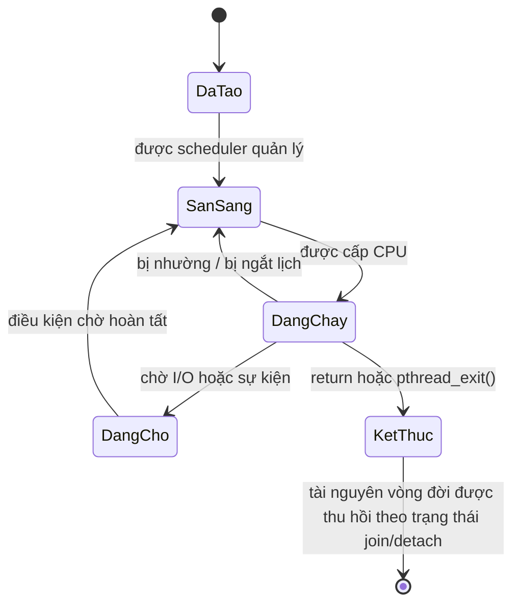

# Chủ đề 6 — Đa luồng trong Linux

> **Mục tiêu:** hiểu luồng (`thread`) là gì, vì sao một tiến trình có thể có nhiều luồng, các luồng dùng chung những gì, có những gì riêng, và vòng đời `pthread_create() → chạy → kết thúc → pthread_join()/detach` hoạt động ra sao.
>
> **Quy ước ngôn ngữ:** phần giải thích dùng Tiếng Việt. Giữ nguyên các thuật ngữ/API chuẩn như `thread`, `Pthreads`, `NPTL`, `pthread_t`, `joinable`, `detached`, `concurrency`, `parallelism`, `race condition`, `atomic operation`, `signal mask`, cùng tên hàm, `TID`, `PID` và đường dẫn `/proc` khi cần tra cứu.
>
> **Phạm vi:** tiến trình và luồng, `Pthreads`, `NPTL`, định danh luồng, không gian địa chỉ dùng chung, ngăn xếp riêng, tạo luồng, vòng đời, trạng thái joinable/detached, thuộc tính và kích thước ngăn xếp, `concurrency` và `parallelism`, `race condition` ở mức nhập môn, quan sát luồng trên Linux.
>
> Chương này chỉ có **lý thuyết**, không có bài thực hành. Mutex, condition variable, semaphore và các cơ chế đồng bộ chi tiết thuộc **Chủ đề 7**.

Một tiến trình có thể chứa nhiều luồng thực thi. Các luồng **dùng chung phần lớn tài nguyên của tiến trình** như không gian địa chỉ và `file descriptor`, nhưng mỗi luồng vẫn cần ngăn xếp, thanh ghi CPU, trạng thái lập lịch và định danh riêng. Chính việc “dùng chung nhiều nhưng chạy độc lập” tạo ra cả lợi ích lẫn rủi ro của multithreading.

Chương này tập trung vào mô hình luồng và vòng đời Pthreads: tạo bằng `pthread_create()`, kết thúc, `join` hoặc `detach`, chi phí ngăn xếp, khác biệt giữa `concurrency` và `parallelism`, rồi mới chạm tới `race condition` để chuẩn bị cho chủ đề đồng bộ tiếp theo.

**Cách đọc nếu bạn mới bắt đầu.** Trước hết hãy đọc phần **Nói đơn giản** ở đầu mỗi mục lớn để nắm câu hỏi mà mục đó đang giải quyết. Sau đó xem sơ đồ và ví dụ để hình thành mô hình trong đầu; chưa cần nhớ mọi cờ, mã lỗi hay trường hợp đặc biệt. Khi ý chính đã rõ, hãy đọc các mục `###` theo thứ tự và quay lại phần giải thích trước đó nếu gặp một thuật ngữ chưa quen.

---

## Mục lục

- [1. `Multithreading` là gì?](#1-multithreading-là-gì)
- [2. Tiến trình và luồng khác nhau thế nào?](#2-tiến-trình-và-luồng-khác-nhau-thế-nào)
- [3. POSIX Threads và NPTL](#3-posix-threads-và-nptl)
- [4. Định danh luồng: `pthread_t`, TID và PID](#4-định-danh-luồng-pthread_t-tid-và-pid)
- [5. Các luồng dùng chung gì và có gì riêng?](#5-các-luồng-dùng-chung-gì-và-có-gì-riêng)
- [6. `pthread_create()`: tạo một luồng mới](#6-pthread_create-tạo-một-luồng-mới)
- [7. Vòng đời và cách một luồng kết thúc](#7-vòng-đời-và-cách-một-luồng-kết-thúc)
- [8. Luồng joinable và detached](#8-luồng-joinable-và-detached)
- [9. Thuộc tính, ngăn xếp và chi phí của một luồng](#9-thuộc-tính-ngăn-xếp-và-chi-phí-của-một-luồng)
- [10. `concurrency` và `parallelism`](#10-concurrency-và-parallelism)
- [11. Vì sao dùng chung bộ nhớ dẫn tới `race condition`?](#11-vì-sao-dùng-chung-bộ-nhớ-dẫn-tới-race-condition)
- [12. Quan sát luồng trên Linux](#12-quan-sát-luồng-trên-linux)
- [13. Tư duy gỡ lỗi đa luồng](#13-tư-duy-gỡ-lỗi-đa-luồng)
- [14. Liên hệ với Embedded Linux](#14-liên-hệ-với-embedded-linux)
- [15. Tổng kết](#15-tổng-kết)
- [16. Tài liệu tham khảo](#16-tài-liệu-tham-khảo)

---

## 1. `Multithreading` là gì?

> **Nói đơn giản:** Multithreading nghĩa là một tiến trình có nhiều luồng thực thi. Các luồng chia sẻ phần lớn tài nguyên của tiến trình nhưng mỗi luồng vẫn có stack và trạng thái chạy riêng.

### 1.1 Từ một dòng thực thi tới nhiều dòng thực thi

Tiến trình chỉ có một luồng:

```text
Tiến trình
    |
    v
 Luồng A
```

Tiến trình đa luồng:

```text
                 Tiến trình
                     |
          +----------+----------+
          |          |          |
          v          v          v
       Luồng A    Luồng B    Luồng C
```

Các luồng cùng thuộc một tiến trình nhưng `scheduler` của Linux kernel có thể cho chúng chạy độc lập.

---

### 1.2 Vì sao cần nhiều luồng?

Một chương trình thực tế có thể phải làm nhiều việc: đọc thiết bị, xử lý dữ liệu, gửi mạng, ghi log và chờ yêu cầu người dùng.

Nếu mọi việc nằm trên một luồng duy nhất, một thao tác bị chặn có thể làm dòng thực thi đó đứng lại:

```text
Đọc thiết bị
    |
    | chờ dữ liệu
    v
các công việc sau chưa thể chạy
```

Với nhiều luồng:

```text
Luồng đọc thiết bị  ---> đang chờ I/O
Luồng xử lý         ---> vẫn có thể chạy
Luồng mạng          ---> vẫn có thể chạy
```

Đây là một lý do phổ biến để dùng đa luồng trong chương trình Linux.

---

### 1.3 Luồng không chỉ là “một hàm chạy nền”

Một luồng thường bắt đầu tại một hàm, nhưng bản thân luồng là **ngữ cảnh thực thi** có: bộ thanh ghi riêng, bộ đếm lệnh riêng, con trỏ ngăn xếp riêng, ngăn xếp riêng và trạng thái lập lịch riêng.

Hàm bắt đầu chỉ là nơi luồng đi vào mã chương trình.

---

## 2. Tiến trình và luồng khác nhau thế nào?

> **Nói đơn giản:** Tiến trình là vùng tài nguyên lớn; luồng là một luồng thực thi bên trong vùng đó. Tạo luồng thường nhẹ hơn tạo tiến trình nhưng việc chia sẻ dữ liệu làm tăng rủi ro tranh chấp.

### 2.1 Tiến trình là vùng chứa tài nguyên

Một tiến trình có những thành phần như: không gian địa chỉ ảo, mã chương trình, dữ liệu toàn cục, heap, bảng `file descriptor`, thư mục làm việc và cách xử lý signal.

Nếu tạo một **tiến trình khác**, hai tiến trình bình thường có không gian địa chỉ riêng.

---

### 2.2 Luồng nằm trong cùng tiến trình

Nhiều luồng cùng tiến trình nhìn thấy cùng phần lớn bộ nhớ:

```text
+------------------------------------------------+
|                  TIẾN TRÌNH                    |
|                                                |
|  Dùng chung:                                   |
|    mã chương trình                             |
|    dữ liệu toàn cục                            |
|    heap                                        |
|    vùng mmap                                   |
|    bảng file descriptor                        |
|                                                |
|  +----------------+   +----------------+       |
|  | Luồng A        |   | Luồng B        |       |
|  | ngăn xếp A     |   | ngăn xếp B     |       |
|  | thanh ghi A    |   | thanh ghi B    |       |
|  +----------------+   +----------------+       |
+------------------------------------------------+
```

Đây là khác biệt rất quan trọng với nhiều tiến trình.

---

### 2.3 Cùng không gian địa chỉ vừa là lợi thế vừa là rủi ro

Lợi thế:

```text
Luồng A tạo dữ liệu trên heap
             |
             v
Luồng B có thể truy cập trực tiếp
```

Không cần mặc định phải sao chép qua pipe/socket như giữa hai tiến trình tách biệt.

Rủi ro:

```text
Luồng A ghi sai bộ nhớ
        |
        v
có thể phá dữ liệu mà Luồng B/C đang dùng
        |
        v
cả tiến trình có thể hỏng
```

Các luồng cùng chung miền lỗi của tiến trình.

---

### 2.4 So sánh nhanh

| Thuộc tính | Hai tiến trình | Hai luồng cùng tiến trình |
|---|---|---|
| Không gian địa chỉ | Thường tách biệt | Dùng chung |
| Dữ liệu heap/toàn cục | Không dùng chung trực tiếp mặc định | Dùng chung |
| Ngăn xếp | Riêng | Riêng cho từng luồng |
| File bộ mô tả | Tùy quan hệ/kế thừa | Cùng bảng của tiến trình |
| Cách trao đổi dữ liệu | Thường cần IPC | Có thể truy cập bộ nhớ chung |
| Cách ly lỗi bộ nhớ | Tốt hơn | Thấp hơn |

---

## 3. POSIX Threads và NPTL

> **Nói đơn giản:** POSIX Threads (`pthread`) là API chuẩn; trên Linux, NPTL là phần triển khai phổ biến trong glibc/Linux kernel.

### 3.1 `Pthreads` là gì?

`POSIX Threads`, thường gọi là `Pthreads`, là giao diện chuẩn POSIX cho lập trình đa luồng.

Những API quan trọng trong chương này:

```text
pthread_create()
pthread_join()
pthread_detach()
pthread_exit()
pthread_self()
pthread_equal()
pthread_attr_*
```

Ứng dụng nên học và lập trình ở lớp `Pthreads`, thay vì phụ thuộc trực tiếp vào chi tiết nội bộ của Linux kernel.

---

### 3.2 Linux hiện đại dùng `NPTL`

Trên hệ GNU/Linux hiện đại, `glibc` triển khai `Pthreads` bằng `NPTL`:

```text
Ứng dụng
   |
   v
Pthreads API
   |
   v
glibc / NPTL
   |
   v
cơ chế luồng của Linux kernel
```

`NPTL` là **Native POSIX Luồng Library**.

---

### 3.3 Mô hình 1:1

`NPTL` sử dụng mô hình 1:1:

```text
Luồng POSIX A  ---->  tác vụ có thể lập lịch A trong nhân
Luồng POSIX B  ---->  tác vụ có thể lập lịch B trong nhân
Luồng POSIX C  ---->  tác vụ có thể lập lịch C trong nhân
```

Do đó trên máy nhiều lõi:

```text
CPU0 -> Luồng A
CPU1 -> Luồng B
```

hai luồng cùng tiến trình có thể thực sự chạy cùng lúc.

---

### 3.4 Không nên đồng nhất API POSIX với chi tiết nhân

Một ứng dụng bình thường nên nghĩ theo:

```text
pthread_create()
pthread_t
pthread_join()
```

Còn các khái niệm như `clone()` là lớp triển khai thấp hơn.

Hiểu lớp thấp hơn có ích khi gỡ lỗi, nhưng không nên lấy nó làm giao diện chính của chương trình.

---

## 4. Định danh luồng: `pthread_t`, TID và PID

> **Nói đơn giản:** `pthread_t`, TID và PID không phải lúc nào cũng là cùng một giá trị. Chúng phục vụ các lớp API và mục đích quan sát khác nhau.

### 4.1 `pthread_t`

`pthread_t` là kiểu định danh luồng của POSIX.

Ứng dụng nên xem nó như một giá trị **không cần biết biểu diễn nội bộ**.

Không nên giả định:

```text
pthread_t == int
pthread_t == PID
pthread_t == TID
```

---

### 4.2 `pthread_self()`

Một luồng có thể lấy định danh POSIX của chính mình bằng:

```text
pthread_self()
```

Đây vẫn là `pthread_t`, không phải Linux TID.

---

### 4.3 `pthread_equal()`

POSIX cung cấp:

```text
pthread_equal()
```

để so sánh hai `pthread_t` một cách đúng theo chuẩn.

Lý do: biểu diễn của `pthread_t` không nhất thiết là số nguyên đơn giản trên mọi hệ thống.

---

### 4.4 TID của Linux

Linux cấp một TID cho từng luồng/tác vụ.

Ví dụ:

```text
Tiến trình PID = 4200

Luồng chính:
  TID = 4200

Luồng phụ 1:
  TID = 4201

Luồng phụ 2:
  TID = 4202
```

`gettid()` trả về TID Linux của luồng gọi nó.

---

### 4.5 PID và nhóm luồng

Trong Linux, các luồng thuộc cùng một nhóm luồng. ID của nhóm này tương ứng với PID mà ứng dụng thường thấy qua `getpid()`.

Cách hình dung:

```text
             PID / TGID = 4200
                    |
          +---------+---------+
          |         |         |
       TID 4200  TID 4201  TID 4202
```

---

### 4.6 `pthread_t` không phải TID

Đây là điểm phải nhớ:

`pthread_t`: định danh ở lớp POSIX / thư viện; `TID`: định danh luồng ở lớp Linux kernel.

Chúng có liên hệ tới cùng một luồng nhưng không phải cùng một kiểu giá trị.

---

## 5. Các luồng dùng chung gì và có gì riêng?

> **Nói đơn giản:** Các luồng cùng tiến trình chia sẻ address space và nhiều `fd`, nhưng mỗi luồng có stack, trạng thái thanh ghi CPU và luồng thực thi riêng.

### 5.1 Phần dùng chung

Các luồng cùng tiến trình dùng chung nhiều tài nguyên:

```text
không gian địa chỉ
mã chương trình
dữ liệu toàn cục/static
heap
các vùng mmap
bảng file descriptor
thư mục làm việc hiện tại
umask
cách xử lý signal của tiến trình
nhiều thông tin định danh/tài nguyên tiến trình
```

Ví dụ:

```text
Luồng A mở fd 5
      |
      v
bảng fd của tiến trình
      |
      v
Luồng B cũng có thể dùng fd 5
```

---

### 5.2 Phần riêng của từng luồng

Mỗi luồng có những thành phần riêng như: ngăn xếp, thanh ghi CPU, bộ đếm lệnh, `TID`, `pthread_t`, `signal mask`, errno theo luồng và trạng thái lập lịch.

---

### 5.3 Ngăn xếp là riêng về mục đích sử dụng, nhưng vẫn nằm trong cùng không gian địa chỉ

```text
Không gian địa chỉ tiến trình

+---------------------------+
| Ngăn xếp Luồng A          |
+---------------------------+
| Ngăn xếp Luồng B          |
+---------------------------+
| Heap dùng chung           |
+---------------------------+
| Dữ liệu toàn cục          |
+---------------------------+
| Mã chương trình           |
+---------------------------+
```

Nếu Luồng A đưa cho Luồng B một con trỏ trỏ vào biến trên ngăn xếp A, Luồng B về mặt địa chỉ vẫn có thể truy cập nó.

Vấn đề là **vòng đời**: khi biến hoặc luồng A kết thúc, địa chỉ đó có thể không còn hợp lệ.

---

### 5.4 `errno` có ngữ nghĩa riêng cho từng luồng

Nếu hai luồng cùng gọi API:

```text
Luồng A -> errno = EINTR
Luồng B -> errno = EAGAIN
```

mỗi luồng phải đọc lỗi của chính lời gọi mà nó vừa thực hiện.

Một `errno` dùng chung duy nhất cho toàn tiến trình sẽ không phù hợp với đa luồng, nên thư viện cung cấp ngữ nghĩa riêng theo luồng.

---

### 5.5 `signal mask` là riêng từng luồng

Nhắc lại Chủ đề 5:

`cách xử lý signal (disposition)`: dùng chung ở cấp tiến trình; **`signal mask`**: riêng cho từng luồng.

Chi tiết kiến trúc signal với nhiều luồng không thuộc phạm vi chính của Topic 6.

---

## 6. `pthread_create()`: tạo một luồng mới

> **Nói đơn giản:** `pthread_create()` tạo luồng mới và chỉ định hàm bắt đầu. Sau đó luồng mới và luồng gọi có thể chạy xen kẽ hoặc song song.

### 6.1 Mô hình của `pthread_create()`

Giao diện khái niệm:

`pthread_create(`: nơi nhận pthread_t, thuộc tính, hàm bắt đầu, đối số ).

Sau khi thành công:

```text
Trước:
  Tiến trình -> Luồng A

Sau:
  Tiến trình -> Luồng A
             -> Luồng B
```

Không có tiến trình mới và không có không gian địa chỉ mới.

---

### 6.2 Hàm bắt đầu

Luồng mới bắt đầu chạy tại một hàm có dạng POSIX quy định.

Cách hình dung:

```text
pthread_create()
      |
      v
Luồng mới được tạo
      |
      v
hàm bắt đầu(đối số)
```

Sau đó luồng mới là một dòng thực thi độc lập về lập lịch.

---

### 6.3 Đối số không được tự động sao chép sâu

Đối số là một `void *`.

Nếu nó trỏ vào một đối tượng:

```text
Luồng tạo --------+
                  |
                  v
              Đối tượng
                  ^
                  |
Luồng mới --------+
```

hai luồng có thể đang nhìn cùng một vùng nhớ.

Do đó phải xác định rõ đối tượng sống bao lâu, luồng nào được phép thay đổi nó và thời điểm luồng mới bắt đầu đọc dữ liệu.

Cơ chế đồng bộ cụ thể thuộc Chủ đề 7.

---

### 6.4 Không được giả định luồng nào chạy trước

Sau khi `pthread_create()` thành công:

```text
luồng tạo
```

và:

```text
luồng mới
```

đều có thể được `scheduler` chọn.

Không được viết logic dựa vào suy đoán:

> “Luồng cha chắc chắn chạy thêm vài dòng trước khi luồng mới bắt đầu.”

POSIX không cho ứng dụng dựa vào giả định đó.

---

### 6.5 Một số trạng thái được kế thừa/sao chép

Theo Linux/Pthreads, luồng mới nhận một số trạng thái từ luồng tạo, ví dụ `signal mask` được sao chép.

Điểm cần nhớ:

Tạo một luồng mới không có nghĩa mọi trạng thái đều được tạo mới hoàn toàn; từng loại trạng thái có quy tắc dùng chung, kế thừa hoặc khởi tạo riêng.

---

### 6.6 Cách trả lỗi của nhiều hàm Pthreads

Nhiều API Pthreads dùng quy ước:

Nhiều hàm Pthreads trả `0` khi thành công và trả trực tiếp một mã lỗi khác `0` khi thất bại. Đây là quy ước khác với nhiều `system call` Linux, vốn thường trả `-1` và đặt mã lỗi trong `errno`.

Đây là điểm dễ nhầm khi học song song `system call` và Pthreads.

---

## 7. Vòng đời và cách một luồng kết thúc

> **Nói đơn giản:** Luồng có thể kết thúc bằng return từ hàm start hoặc gọi API kết thúc tương ứng; tài nguyên liên quan còn phụ thuộc trạng thái joinable/detached.

### 7.1 Vòng đời ở mức khái niệm



Đây là mô hình học tập, không phải toàn bộ trạng thái nội bộ của `scheduler` Linux.

---

### 7.2 Trả về từ hàm bắt đầu

Nếu hàm bắt đầu của luồng trả về:

```text
return giá_trị;
```

thì về mặt POSIX, luồng kết thúc như thể gọi:

```text
pthread_exit(giá_trị)
```

Giá trị này có thể được một luồng khác thu nhận bằng `pthread_join()` nếu luồng ở trạng thái phù hợp.

---

### 7.3 `pthread_exit()` chỉ kết thúc luồng gọi nó

```text
Luồng A -> pthread_exit()
            X

Luồng B -> tiếp tục
Luồng C -> tiếp tục
```

Khác với `exit()` ở cấp tiến trình.

---

### 7.4 `exit()` và trả về từ `main()` kết thúc cả tiến trình

Nếu một luồng gọi:

```text
exit()
```

thì tiến trình kết thúc.

Tương tự, khi `main()` trả về theo luồng thực thi thông thường, đó là kết thúc tiến trình chứ không chỉ “kết thúc riêng luồng main”.

Do đó:

`pthread_exit()`: kết thúc một luồng; `exit()/return từ main`: kết thúc tiến trình.

---

### 7.5 Luồng cuối cùng kết thúc

Nếu không còn luồng nào trong tiến trình:

```text
luồng cuối cùng kết thúc
        |
        v
tiến trình kết thúc
```

Vòng đời tiến trình và vòng đời luồng liên hệ nhưng không đồng nhất.

---

## 8. Luồng joinable và detached

> **Nói đơn giản:** Luồng joinable cần luồng khác `pthread_join()` để thu kết quả và giải phóng phần tài nguyên; detached tự giải phóng phần đó khi kết thúc.

### 8.1 Thread `joinable`

Luồng mới mặc định thường là joinable.

Vòng đời:

```text
Đang chạy
    |
    v
Đã kết thúc
nhưng còn trạng thái để join
    |
pthread_join()
    |
    v
thu hồi tài nguyên vòng đời còn lại
```

---

### 8.2 `pthread_join()`

Một luồng có thể gọi:

```text
pthread_join(thread, ...)
```

Nếu luồng đích chưa kết thúc:

```text
luồng gọi join
      |
      v
chờ
      |
thread đích kết thúc
      |
      v
join hoàn tất
```

`pthread_join()` vừa là chờ vòng đời, vừa cho phép nhận giá trị kết thúc của luồng đích.

---

### 8.3 Pthreads không có cây cha–con giống tiến trình

Luồng A tạo Luồng B không có nghĩa A là “cha” cố định theo kiểu PID/PPID.

Các luồng trong cùng tiến trình về mô hình POSIX là các luồng ngang hàng.

Do đó không nên đem nguyên cách hình dung:

```text
tiến trình parent/child
```

áp vào:

```text
Pthreads
```

---

### 8.4 Thread `detached`

Luồng detached không chờ một `pthread_join()` sau khi nó kết thúc.

```text
Đang chạy
    |
    v
Kết thúc
    |
    v
hệ thống tự thu hồi tài nguyên liên quan
```

---

### 8.5 `pthread_detach()` không có nghĩa “chạy nền”

Đây là nhầm lẫn phổ biến.

```text
detached
```

chỉ nói về **cách xử lý tài nguyên sau khi luồng kết thúc**.

Nó không nói rằng luồng: có ưu tiên thấp hơn, không chiếm CPU, không thể chạy song song và trở thành daemon.

---

### 8.6 Mỗi luồng cần một chính sách vòng đời rõ ràng

Thiết kế nên trả lời:

```text
Ai sẽ join luồng này?
```

hoặc:

```text
Luồng này có chủ ý detached không?
```

Nếu một luồng joinable kết thúc nhưng không bao giờ được join, một số tài nguyên liên quan tới vòng đời của nó có thể không được thu hồi đúng lúc.

---

## 9. Thuộc tính, ngăn xếp và chi phí của một luồng

> **Nói đơn giản:** Mỗi luồng cần stack và siêu dữ liệu quản lý. Vì vậy tạo hàng nghìn luồng không phải miễn phí dù luồng nhẹ hơn tiến trình.

### 9.1 `pthread_attr_t`

`pthread_attr_t` là đối tượng cấu hình dùng khi tạo luồng.

Nó có thể mô tả những thuộc tính như:

```text
trạng thái joinable/detached
kích thước ngăn xếp
vùng ngăn xếp
vùng bảo vệ
một số thuộc tính lập lịch
```

Sau khi luồng được tạo, đối tượng thuộc tính không phải là “đối tượng luồng”.

---

### 9.2 Mỗi luồng cần ngăn xếp riêng

Ngăn xếp lưu những thứ như:

```text
khung lời gọi hàm
biến cục bộ tự động
địa chỉ trả về
trạng thái theo ABI/compiler
```

Nếu có nhiều luồng:

```text
N luồng
  -> N vùng ngăn xếp
```

nên số lượng luồng ảnh hưởng tài nguyên bộ nhớ.

---

### 9.3 Kích thước ngăn xếp không phải một hằng số phổ quát

Kích thước mặc định phụ thuộc:

```text
hệ thống
kiến trúc
glibc/NPTL
resource limit
cấu hình tiến trình
```

Không nên viết tài liệu hoặc thiết kế với giả định:

> “Mọi luồng Linux luôn có stack mặc định đúng X MB.”

---

### 9.4 Guard region

Một vùng bảo vệ có thể đặt cạnh ngăn xếp để giúp phát hiện một số trường hợp tràn ngăn xếp.

```text
+------------------------+
| vùng ngăn xếp dùng được|
+------------------------+
| vùng bảo vệ            |
+------------------------+
```

Nó không phải lớp bảo vệ tuyệt đối chống mọi lỗi bộ nhớ.

---

### 9.5 Một luồng không “miễn phí”

Mỗi luồng có chi phí: ngăn xếp, trạng thái trong nhân, thông tin lập lịch, TLS và dữ liệu thư viện và các cấu trúc quản lý khác.

Vì vậy:

```text
càng nhiều luồng càng tốt
```

là một kết luận sai.

---

## 10. `concurrency` và `parallelism`

> **Nói đơn giản:** Concurrency là nhiều công việc tiến triển xen kẽ; parallelism là nhiều công việc thực sự chạy cùng lúc trên nhiều CPU/core.

### 10.1 `concurrency`

Nhiều công việc cùng tiến triển trong một khoảng thời gian.

Trên một lõi CPU:

```text
thời gian --->

Luồng A: ███      ██
Luồng B:    ████
Luồng C:        ███
```

Tại một thời điểm CPU lõi đó chỉ chạy một luồng, nhưng `scheduler` chuyển qua lại.

---

### 10.2 `parallelism`

Hai hoặc nhiều luồng thực sự chạy cùng lúc trên nhiều lõi:

```text
CPU0 -> Luồng A
CPU1 -> Luồng B
CPU2 -> Luồng C
```

Đa luồng tạo điều kiện cho song song, nhưng không đảm bảo song song luôn xảy ra.

---

### 10.3 Vì sao tác vụ I/O-bound thường hợp với nhiều luồng?

Nếu một luồng chờ I/O:

```text
Luồng A -> ngủ chờ socket
```

thì luồng khác có thể dùng CPU:

```text
Luồng B -> xử lý dữ liệu
```

Đây là đồng thời hữu ích ngay cả khi không có nhiều lõi.

---

### 10.4 Tác vụ CPU-bound và số lõi

Nếu máy chỉ có 2 lõi CPU nhưng có 100 luồng luôn ở trạng thái runnable, tối đa chỉ một số nhỏ luồng thực sự chạy đồng thời. Tạo thêm luồng không tạo thêm lõi CPU.

Nó có thể tăng: chuyển ngữ cảnh, áp lực cache và độ trễ lập lịch.

---

## 11. Vì sao dùng chung bộ nhớ dẫn tới `race condition`?

> **Nói đơn giản:** Khi hai luồng cùng truy cập dữ liệu có thể thay đổi mà không đồng bộ đúng, kết quả có thể phụ thuộc thời điểm chạy và sinh `race condition`.

### 11.1 Ví dụ tăng biến đếm

Nhìn ở mã nguồn:

```text
counter = counter + 1
```

nhưng về ý tưởng có thể gồm: đọc counter, cộng 1 và ghi lại counter.

Hai luồng có thể xen kẽ:

```text
counter ban đầu = 10

Luồng A                  Luồng B

đọc 10
                         đọc 10
cộng -> 11
                         cộng -> 11
ghi 11
                         ghi 11

kết quả = 11
```

Trong khi về về mặt logic ta mong:

```text
12
```

Đây là ví dụ kinh điển về `race condition`.

---

### 11.2 Một dòng C không tự động là `atomic operation`

Không được suy luận:

> “Vì câu lệnh chỉ có một dòng nên hai luồng không thể chen vào giữa.”

Compiler, CPU và mô hình bộ nhớ không hứa điều đó cho mọi phép toán.

---

### 11.3 Topic 6 chỉ cần nhận diện vấn đề

Chương này dừng ở câu hỏi:

```text
Vì sao có race?
```

Chủ đề 7 sẽ trả lời:

```text
Dùng mutex/condition variable/semaphore như thế nào về mặt lý thuyết để phối hợp?
```

Không nên học cơ chế đồng bộ trước khi hiểu rõ vì sao cần nó.

---

## 12. Quan sát luồng trên Linux

> **Nói đơn giản:** Linux cho phép quan sát từng luồng qua `/proc`, `ps` và `top` với các tùy chọn phù hợp.

### 12.1 `/proc/<pid>/task/`

Linux thể hiện các luồng của một tiến trình dưới:

```text
/proc/<pid>/task/<tid>/
```

Ví dụ:

`/proc/4200/task/`: 4200/ 4201/ 4202/.

Có thể hiểu:

```text
PID 4200
  |
  +--> TID 4200
  +--> TID 4201
  +--> TID 4202
```

---

### 12.2 `/proc/thread-self`

Linux cung cấp đường dẫn đại diện cho luồng đang truy cập:

```text
/proc/luồng-self
```

Nó cho phép biểu diễn “luồng hiện tại” trong `procfs`.

---

### 12.3 `ps` và `top`

Các công cụ quan sát có thể hiển thị:

```text
một dòng cho tiến trình
```

hoặc chế độ chi tiết theo:

```text
luồng / TID
```

Do `scheduler` làm việc với các thực thể luồng/tác vụ, mức sử dụng CPU có thể tập trung ở một luồng thay vì chia đều cho cả tiến trình.

---

### 12.4 Tên luồng không phải ID

Một luồng có thể có tên để dễ gỡ lỗi, ví dụ: sensor, network và logger.

Nhưng tên chỉ là nhãn quan sát.

Tên luồng chỉ phục vụ quan sát và gỡ lỗi; không nên dùng nó thay cho `pthread_t` hoặc TID trong các API yêu cầu định danh thực.

---

## 13. Tư duy gỡ lỗi đa luồng

> **Nói đơn giản:** Debug đa luồng cần tách lỗi vòng đời luồng, lỗi chia sẻ dữ liệu và lỗi đồng bộ thay vì coi mọi hiện tượng là 'luồng bị treo'.

### 13.1 Hãy tách vấn đề thành lớp

```text
Luồng có được tạo thành công?
        |
Định danh đang xem là pthread_t hay TID?
        |
Luồng đang chạy, chờ hay đã kết thúc?
        |
Joinable hay detached?
        |
Dữ liệu là dùng chung hay riêng?
        |
Đối tượng còn sống đủ lâu không?
        |
Có giả định thứ tự chạy không được bảo đảm không?
        |
Có `race condition` không?
```

---

### 13.2 “Luồng mới không chạy”

Có thể do:

```text
pthread_create() thất bại
main kết thúc quá sớm
luồng mới vừa vào đã chờ I/O
luồng mới kết thúc rất nhanh
thứ tự lập lịch khác dự đoán
```

Không nên kết luận chỉ từ việc “không thấy log”.

---

### 13.3 “Chương trình kết thúc dù luồng phụ vẫn còn”

Nếu `main()` trả về:

```text
tiến trình exit
```

nên các luồng phụ không giữ tiến trình tồn tại theo cách người mới thường tưởng.

---

### 13.4 “Số luồng/tài nguyên cứ tăng”

Cần nghĩ tới: liên tục tạo luồng mới, luồng không kết thúc, luồng joinable kết thúc nhưng không được join và ngăn xếp cấu hình quá lớn.

---

### 13.5 “Dữ liệu lúc đúng lúc sai”

Đây là dấu hiệu điển hình để nghĩ tới: `race condition`, đối tượng hết vòng đời, con trỏ dùng sau khi đối tượng không còn hợp lệ và nhiều luồng cùng thay đổi trạng thái.

Thay đổi thời điểm thực thi (`timing`) do thêm log có thể làm lỗi biến mất tạm thời nhưng không chứng minh lỗi đã được sửa.

---

## 14. Liên hệ với Embedded Linux

> **Nói đơn giản:** Embedded Linux thường dùng luồng để tách nhận dữ liệu, xử lý, logging hoặc giao tiếp. Thiết kế tốt cần cân bằng độ đơn giản và chi phí đồng bộ.

### 14.1 Mô hình ứng dụng nhúng thường gặp

```text
+----------------------------------+
| Ứng dụng Embedded Linux          |
|                                  |
| Luồng cảm biến                   |
| Luồng xử lý                      |
| Luồng mạng                       |
| Luồng ghi log                    |
+----------------------------------+
```

Các công việc này có thể chờ I/O độc lập nên đa luồng thường phù hợp.

---

### 14.2 Dùng chung `file descriptor` của thiết bị

Vì các luồng cùng bảng fd:

```text
Luồng A mở UART -> fd 5
Luồng B cũng có thể dùng fd 5
```

Nhưng điều đó không có nghĩa ứng dụng nên để mọi luồng đọc/ghi tùy ý.

Thiết kế cần xác định rõ luồng nào sở hữu thiết bị, luồng nào được gửi lệnh và luồng nào chịu trách nhiệm đọc phản hồi.

Cơ chế đồng bộ cụ thể thuộc Topic 7.

---

### 14.3 Giới hạn RAM

Trên board nhúng: RAM hữu hạn và số lõi hữu hạn.

Mỗi luồng thêm một ngăn xếp và trạng thái quản lý.

Vì vậy kiến trúc:

```text
1 chức năng = 1 luồng
```

không nên được dùng máy móc.

---

### 14.4 Nhiều lõi trên SoC

Các SoC như Cortex-A đa lõi có thể cho nhiều luồng CPU-bound chạy song song.

Nhưng tốc độ còn phụ thuộc: `cache`, băng thông bộ nhớ, cách chia công việc, đồng bộ và scheduler.

---

### 14.5 Ranh giới giữa `thread` và `process` là quyết định kiến trúc

Dùng luồng khi cần: chia sẻ dữ liệu nhanh và cùng một miền tài nguyên.

Dùng tiến trình riêng khi cần mạnh hơn về: cách ly lỗi, phân quyền và khởi động lại độc lập.

Một sản phẩm Embedded Linux thường kết hợp cả hai.

---

## 15. Tổng kết

> **Nói đơn giản:** Topic 06 cần để lại mô hình: một tiến trình → nhiều luồng → chia sẻ tài nguyên → cần quản lý vòng đời và chuẩn bị cho synchronization.

### 15.1 Mô hình chính

```text
                    TIẾN TRÌNH
                        |
       +----------------+----------------+
       |                                 |
       v                                 v
Tài nguyên dùng chung              Các luồng
--------------------              -----------------
không gian địa chỉ                 Luồng A
heap                                ngăn xếp A
global/static                       thanh ghi A
bảng fd                             TID A
cwd                                 pthread_t A
                                    signal mask A

                                    Luồng B
                                     ngăn xếp B
                                     thanh ghi B
                                     TID B
                                     pthread_t B
```

---

### 15.2 Vòng đời

```text
pthread_create()
      |
      v
luồng được tạo
      |
 chạy / chờ / được lập lịch
      |
      v
return hoặc pthread_exit()
      |
      v
đã kết thúc
   /           \
joinable      detached
   |             |
pthread_join  tự thu hồi
```

---

### 15.3 Những điểm phải nhớ

1. Luồng là một dòng thực thi bên trong tiến trình.
2. Các luồng cùng tiến trình dùng chung không gian địa chỉ.
3. Mỗi luồng có ngăn xếp và ngữ cảnh CPU riêng.
4. `Pthreads` là giao diện POSIX cho lập trình luồng.
5. Linux/glibc hiện đại dùng `NPTL`.
6. `pthread_t` không phải Linux TID.
7. `pthread_create()` không tạo một tiến trình mới.
8. Không được giả định luồng tạo hay luồng mới sẽ chạy trước.
9. `pthread_exit()` kết thúc luồng gọi nó; `exit()` kết thúc tiến trình.
10. Joinable và detached nói về vòng đời/thu hồi tài nguyên, không phải foreground/background.
11. Mỗi luồng cần ngăn xếp và tài nguyên quản lý riêng.
12. Đồng thời không đồng nghĩa song song.
13. Nhiều luồng dùng chung dữ liệu có thể tạo `race condition`.
14. Cơ chế đồng bộ chi tiết thuộc Topic 7.

---

## 16. Tài liệu tham khảo

> **Nói đơn giản:** Phần này liệt kê nguồn chuẩn về pthread và luồng trên Linux.

### POSIX.1-2024 / The Open Group

- https://pubs.opengroup.org/onlinepubs/9799919799/
- `pthread_create()`: https://pubs.opengroup.org/onlinepubs/9799919799/functions/pthread_create.html
- `pthread_join()`: https://pubs.opengroup.org/onlinepubs/9799919799/functions/pthread_join.html
- `pthread_detach()`: https://pubs.opengroup.org/onlinepubs/9799919799/functions/pthread_detach.html
- `pthread_exit()`: https://pubs.opengroup.org/onlinepubs/9799919799/functions/pthread_exit.html

Nguồn chuẩn cho ngữ nghĩa Pthreads có tính di động.

### Linux man-pages

- `pthreads(7)`: https://man7.org/linux/man-pages/man7/pthreads.7.html
- `pthread_create(3)`: https://man7.org/linux/man-pages/man3/pthread_create.3.html
- `pthread_self(3)`: https://man7.org/linux/man-pages/man3/pthread_self.3.html
- `pthread_equal(3)`: https://man7.org/linux/man-pages/man3/pthread_equal.3.html
- `gettid(2)`: https://man7.org/linux/man-pages/man2/gettid.2.html
- `nptl(7)`: https://man7.org/linux/man-pages/man7/nptl.7.html
- `pthread_attr_setstacksize(3)`: https://man7.org/linux/man-pages/man3/pthread_attr_setstacksize.3.html
- `proc_pid_task(5)`: https://man7.org/linux/man-pages/man5/proc_pid_task.5.html

### Tài liệu bổ sung uy tín

- GNU C Library Manual: https://www.gnu.org/software/libc/manual/
- Bootlin Embedded Linux: https://bootlin.com/doc/training/embedded-linux/
- The Linux Programming Interface: https://man7.org/tlpi/

### Cách ưu tiên nguồn

`POSIX`: ↓ Linux man-pages / glibc ↓ Tài liệu đào tạo kỹ thuật uy tín ↓ Cộng đồng để tìm tình huống thực tế.

Khi đọc bài cộng đồng về `pthread_t`, TID, stack hoặc scheduling, nên đối chiếu lại với POSIX/Linux man-pages trước khi coi đó là ngữ nghĩa chuẩn.

---

> **Điều hướng:** [← Chủ đề 5 — Signal](README-topic-05.md) · [Chủ đề 7 — Đồng bộ luồng →](README-topic-07.md)
