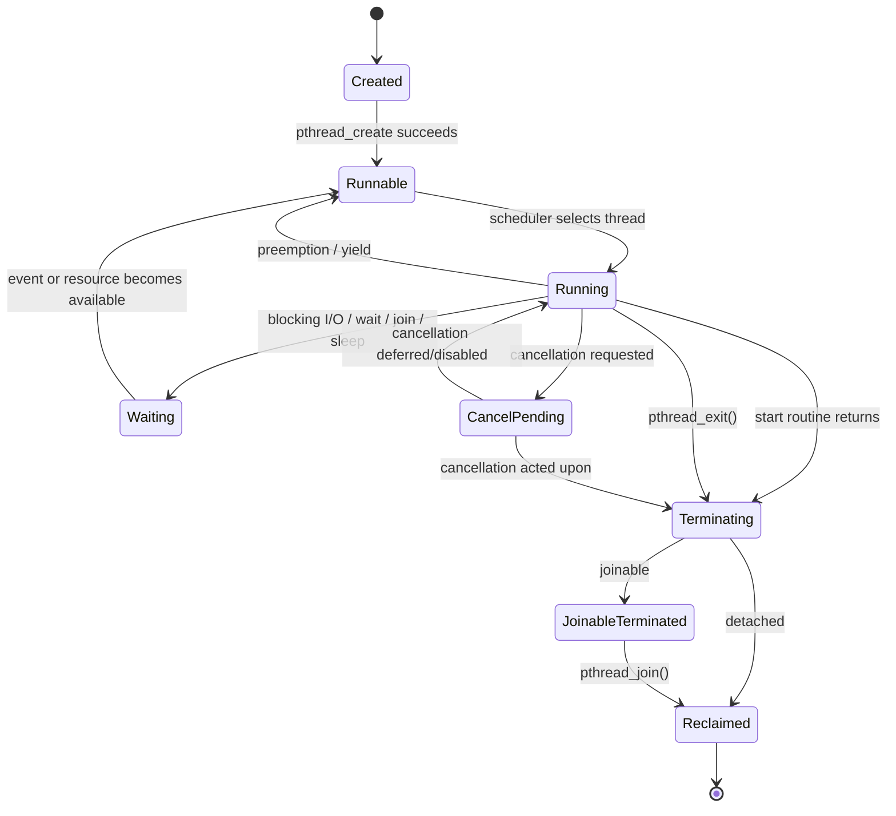

# Chủ đề 6 — Multithreading trong Linux

> **Phạm vi:** Linux/POSIX multithreading fundamentals — thread model, process vs thread, concurrency vs parallelism, POSIX Threads (Pthreads), Linux NPTL, thread identity, shared và per-thread state, `pthread_create()`, thread lifecycle, `pthread_exit()`, `pthread_join()`, `pthread_detach()`, thread attributes, stack, thread-specific data, cancellation, signal relationships, `fork()`/`execve()` trong multithreaded process, thread observability và các nguyên tắc kiến trúc cơ bản.
>
> Chương này chỉ trình bày **lý thuyết**. Không có lab, bài tập, chương trình mẫu hoàn chỉnh, hướng dẫn biên dịch hoặc thao tác thực hành.
>
> Mục tiêu của chương là xây mental model:
>
> `process → shared process resources + multiple independently schedulable threads`
>
> và:
>
> `pthread_create() → runnable/running/waiting → termination → join/detach → resource reclamation`
>
> Đồng thời phải phân biệt chính xác:
>
> `pthread_t ≠ Linux TID`
>
> `process-wide state ≠ per-thread state`
>
> `concurrency ≠ parallelism`
>
> `shared memory ≠ automatically synchronized memory`
>
> Đây là nền trực tiếp cho **Thread Synchronization**, mutex, condition variable, semaphore, producer-consumer, thread pool, daemon/service, IPC, Socket và kiến trúc ứng dụng Embedded Linux nhiều luồng.
>
> **Giới hạn chủ đề:** chương này chưa đi sâu vào mutex, condition variable, semaphore, rwlock, barrier, spinlock, futex algorithm, C/C++ atomic memory model, deadlock, priority inversion hay real-time synchronization. Các phần đó thuộc Topic 7 — Thread Synchronization. Race condition chỉ được giới thiệu đến mức đủ để hiểu vì sao synchronization là bắt buộc.
>
> **Cấu trúc tài liệu:** các mục `##` là khối kiến thức lớn; các concept chi tiết được đặt ở `###`/`####` để giữ mục lục gọn nhưng không giảm chiều sâu nội dung.
>
> **Điều hướng:** [← Chủ đề 5 — Signal](README-topic-05.md) · [Chủ đề 7 — Thread Synchronization →](README-topic-07.md)

---

## Mục lục

- [1. Multithreading Fundamentals](#1-multithreading-fundamentals)
- [2. Process và Thread](#2-process-và-thread)
- [3. POSIX Threads và Linux NPTL](#3-posix-threads-và-linux-nptl)
- [4. Thread Identity: `pthread_t`, TID và TGID](#4-thread-identity-pthread_t-tid-và-tgid)
- [5. Shared State và Per-thread State](#5-shared-state-và-per-thread-state)
- [6. Thread Creation với `pthread_create()`](#6-thread-creation-với-pthread_create)
- [7. Thread Lifecycle và Termination](#7-thread-lifecycle-và-termination)
- [8. Joinable và Detached Threads](#8-joinable-và-detached-threads)
- [9. Thread Attributes, Stack và Resource Footprint](#9-thread-attributes-stack-và-resource-footprint)
- [10. Scheduling, Concurrency và Parallelism](#10-scheduling-concurrency-và-parallelism)
- [11. Shared Mutable State và Race-condition Fundamentals](#11-shared-mutable-state-và-race-condition-fundamentals)
- [12. Thread Safety, Reentrancy và Ownership](#12-thread-safety-reentrancy-và-ownership)
- [13. Thread-specific Data và Thread-local Storage](#13-thread-specific-data-và-thread-local-storage)
- [14. Thread Cancellation và Cleanup](#14-thread-cancellation-và-cleanup)
- [15. Signals trong Multithreaded Process](#15-signals-trong-multithreaded-process)
- [16. `fork()` và `execve()` trong Multithreaded Process](#16-fork-và-execve-trong-multithreaded-process)
- [17. File Descriptors, CWD và Process-wide Resources](#17-file-descriptors-cwd-và-process-wide-resources)
- [18. Linux Thread Observability](#18-linux-thread-observability)
- [19. Threading Architecture và Resource Design](#19-threading-architecture-và-resource-design)
- [20. Error Model và Debugging](#20-error-model-và-debugging)
- [21. Liên hệ với Embedded Linux](#21-liên-hệ-với-embedded-linux)
- [22. Tổng kết và Mental Model](#22-tổng-kết-và-mental-model)
- [23. Tài liệu tham khảo](#23-tài-liệu-tham-khảo)

---

## 1. Multithreading Fundamentals

### 1.1 Multithreading thực chất là gì?

Một process single-threaded có một execution flow chính:

```text
Process
   |
   v
Thread A
```

Một process multithreaded có nhiều execution flows:

```text
Process
   |
   +--> Thread A
   |
   +--> Thread B
   |
   +--> Thread C
```

Các thread:

```text
share many process resources
```

nhưng mỗi thread có:

```text
independent execution context
```

Mental model quan trọng:

```text
PROCESS
   =
resource / address-space container
   +
one or more schedulable execution flows
```

Thread không phải một process hoàn chỉnh thứ hai.

Thread là một execution context nằm trong cùng process và dùng chung nhiều resource với các thread khác.

---

### 1.2 Vì sao multithreading tồn tại?

Một application thường có nhiều loại công việc độc lập hoặc có thể overlap:

```text
wait for network
read sensor/device
process data
update state
write log
serve client
handle control events
```

Nếu chỉ có một execution flow:

```text
task A blocks
      |
      v
whole application execution flow waits
```

Với nhiều threads:

```text
Thread A waits for I/O
Thread B continues processing
Thread C handles another event
```

Multithreading tạo khả năng:

```text
concurrency
parallel execution on multicore
low-overhead shared-memory communication
separation of logical responsibilities
```

Nhưng đồng thời tạo:

```text
race conditions
lifecycle complexity
shared-resource conflicts
debugging difficulty
```

---

### 1.3 Thread không phải “một function chạy nền”

Một thread thường bắt đầu tại một function gọi là:

```text
start routine
```

nhưng thread không phải function.

Function call:

```text
caller
  |
  v
function
  |
 return
  |
  v
caller continues
```

Thread:

```text
independent scheduler entity
      |
      +--> own stack
      +--> own register state
      +--> can block independently
      +--> can run concurrently
      +--> has own lifecycle
```

Start routine chỉ là:

```text
entry point của execution flow
```

---

### 1.4 Multithreading không tự động đồng nghĩa hiệu năng cao

Một program có nhiều thread nhưng vẫn có thể chậm hơn single-threaded program vì:

```text
context switching
synchronization
cache contention
shared-memory traffic
lock contention
thread creation/destruction
oversubscription
```

Do đó:

```text
more threads
    !=
more performance
```

Correct thread count phụ thuộc workload và hardware.

---

## 2. Process và Thread

### 2.1 Process là resource container

Topic 4 đã xây mental model:

```text
Process
 |
 +--> virtual address space
 +--> file descriptor table
 +--> cwd / root / umask
 +--> credentials
 +--> signal dispositions
 +--> resource limits
 +--> program image
```

Multithreading không tạo các container này từ đầu cho từng thread.

Thay vào đó nhiều thread cùng hoạt động trong một process container.

---

### 2.2 Thread là execution flow

Thread cần đủ state để kernel scheduler có thể:

```text
pause it
resume it
schedule it
block it
wake it
```

Mỗi thread cần ít nhất conceptually:

```text
register context
program counter
stack pointer
stack
scheduler state
thread identity
signal mask
```

---

### 2.3 Process vs thread — mental model

```text
+------------------------------------------------------+
|                      PROCESS                         |
|                                                      |
| Shared resources:                                    |
|   virtual address space                              |
|   executable mappings                                |
|   global/static data                                 |
|   heap                                               |
|   mmap regions                                       |
|   file descriptor table                              |
|   cwd / root                                         |
|   signal dispositions                                |
|   process credentials                                |
|                                                      |
|  +----------------+   +----------------+             |
|  | Thread A       |   | Thread B       |             |
|  |----------------|   |----------------|             |
|  | registers      |   | registers      |             |
|  | stack A        |   | stack B        |             |
|  | TID A          |   | TID B          |             |
|  | signal mask A  |   | signal mask B  |             |
|  | errno A        |   | errno B        |             |
|  +----------------+   +----------------+             |
+------------------------------------------------------+
```

---

### 2.4 Threads share failure domain

Separate processes have stronger address-space isolation.

Threads share one address space.

Therefore:

```text
Thread A writes invalid memory
        |
        v
process memory corrupted
        |
        v
Thread B/C may also fail
```

One thread's serious memory bug can crash the entire process.

This is one of the largest architectural differences between:

```text
multi-process
```

and:

```text
multi-threaded single process
```

---

## 3. POSIX Threads và Linux NPTL

### 3.1 POSIX Threads — Pthreads

POSIX defines a standardized threading interface usually called:

```text
POSIX Threads
Pthreads
```

Core APIs/concepts include:

```text
pthread_t
pthread_create()
pthread_join()
pthread_detach()
pthread_exit()
pthread_attr_t
pthread_self()
pthread_equal()
pthread_sigmask()
pthread_cancel()
thread-specific data
```

Future Topic 7 adds synchronization primitives such as:

```text
pthread_mutex_*
pthread_cond_*
```

---

### 3.2 POSIX abstraction vs Linux implementation

Portable application view:

```text
Application
    |
    v
POSIX Pthreads API
```

Linux implementation view:

```text
Application
    |
    v
glibc Pthreads
    |
    v
NPTL
    |
    v
Linux kernel task/thread mechanisms
```

These layers must not be mixed casually.

A program should normally reason with:

```text
pthread_t
pthread_create
pthread_join
```

rather than raw Linux:

```text
clone()
TID internals
futex internals
```

unless implementation-level work explicitly requires it.

---

### 3.3 NPTL

Modern GNU/Linux uses:

```text
NPTL
Native POSIX Threads Library
```

as glibc's POSIX threads implementation.

`nptl(7)` describes NPTL as the GNU C library POSIX threads implementation used on modern Linux systems.

NPTL provides POSIX semantics on top of Linux kernel facilities.

---

### 3.4 1:1 threading model

NPTL uses a 1:1 model conceptually:

```text
POSIX Thread A
      |
      v
Linux schedulable task A

POSIX Thread B
      |
      v
Linux schedulable task B
```

This means each POSIX thread is visible to kernel scheduler as an individual task/thread.

Consequences:

```text
threads can block independently
threads can receive CPU independently
threads can run simultaneously on multiple cores
each Linux thread has its own TID
```

---

### 3.5 Linux thread group

Linux groups threads belonging to one process into a:

```text
thread group
```

Concept:

```text
Thread Group
TGID = process-visible PID
 |
 +--> leader task
 +--> worker task
 +--> worker task
```

The Pthreads abstraction should remain the primary application-level model.

The thread-group model is mainly useful for understanding:

```text
PID/TID
/proc
signals
exec
scheduler visibility
```

---

## 4. Thread Identity: `pthread_t`, TID và TGID

### 4.1 Ba identifiers dễ bị nhầm

Linux multithreading involves at least three concepts:

```text
pthread_t
Linux TID
TGID / process PID
```

They are not interchangeable.

---

### 4.2 `pthread_t`

POSIX defines:

```text
pthread_t
```

as a thread identifier type.

Application should treat it as:

```text
opaque identifier
```

Do not assume it is:

```text
int
pid_t
pointer
Linux TID
```

Its representation is implementation-defined.

---

### 4.3 `pthread_self()`

`pthread_self()` returns the calling thread's POSIX thread ID.

Concept:

```text
Thread A
   |
pthread_self()
   |
   v
pthread_t A
```

The value corresponds to the POSIX thread ID returned through `pthread_create()` for that thread.

---

### 4.4 `pthread_equal()`

Because `pthread_t` is opaque, portable comparison uses:

```text
pthread_equal()
```

rather than relying on its representation.

Mental rule:

```text
pthread_t is an API token
not a kernel numeric identity
```

---

### 4.5 Linux TID

Linux provides:

```text
gettid()
```

which returns Linux thread ID:

```text
TID
```

In single-threaded process:

```text
TID == PID
```

typically because the only thread is thread-group leader.

In multithreaded process:

```text
same process PID/TGID
different TID per thread
```

Example:

```text
Process TGID/PID = 4200

Thread leader:
TID = 4200

Worker A:
TID = 4201

Worker B:
TID = 4202
```

---

### 4.6 `pthread_t` ≠ TID

`gettid(2)` explicitly notes:

```text
Linux TID is not the same thing
as POSIX pthread_t
```

Mental model:

```text
pthread_t
  library/POSIX identity

TID
  Linux kernel task identity
```

This distinction matters when connecting:

```text
Pthreads API
```

to:

```text
/proc/<pid>/task/<tid>
scheduler/debugger/kernel view
```

---

### 4.7 Thread-ID lifetime and reuse

Thread identifiers are not eternal historical identities.

Once thread lifecycle has ended and resources have been reclaimed:

```text
thread identifier may later be reused
```

Therefore stale `pthread_t` should not be treated as permanent identity.

---

## 5. Shared State và Per-thread State

### 5.1 Process-wide shared state

According to POSIX/Linux Pthreads model, threads in the same process share major resources such as:

```text
process ID / parent relationship
process group and session
controlling terminal
virtual address space
global/static data
heap
memory mappings
open file descriptors
signal dispositions
current working directory
root directory
umask
many process credentials
resource-limit context
```

Mental model:

```text
Thread A ----+
Thread B ----+--> Shared Process State
Thread C ----+
```

---

### 5.2 Per-thread state

Each thread has state such as:

```text
POSIX thread ID
Linux TID
register context
program counter
stack
signal mask
alternate signal stack
errno
scheduling state
thread-specific data values
CPU-time clock/state
```

Concept:

```text
Thread A                  Thread B

stack A                   stack B
registers A               registers B
signal mask A             signal mask B
errno A                   errno B
TSD A                     TSD B
```

---

### 5.3 Shared virtual address space

All threads in the process normally access the same mapped virtual address space.

```text
Thread A ----+
Thread B ----+--> same process virtual memory
Thread C ----+
```

Therefore any thread can potentially access:

```text
globals
heap objects
mmap regions
shared libraries
other thread stack addresses
```

if it has valid addresses and protections allow it.

---

### 5.4 Stack is per-thread, but still mapped in shared address space

Each thread has its own logical stack region:

```text
Process address space

+----------------------+
| Thread A stack       |
+----------------------+
| Thread B stack       |
+----------------------+
| Thread C stack       |
+----------------------+
| heap                 |
+----------------------+
| globals              |
+----------------------+
| libraries/code       |
+----------------------+
```

But all stacks exist inside the same process address space.

Therefore:

> “Stack is private to a thread's normal execution” does not mean other threads are physically unable to dereference its address.

This is important for lifetime reasoning.

---

### 5.5 Register context is per-thread

Each thread must have independent:

```text
program counter
stack pointer
general registers
floating-point/SIMD context
```

Otherwise scheduler could not stop one thread and run another independently.

---

### 5.6 `errno` is per-thread

Pthreads model gives each thread its own `errno` state.

Concept:

```text
Thread A:
errno = EINTR

Thread B:
errno = EAGAIN
```

This avoids unrelated system/library calls in one thread overwriting another thread's error state.

---

### 5.7 Signal disposition vs signal mask

From Topic 5:

```text
signal disposition
  process-wide

signal mask
  per-thread
```

This distinction becomes essential in multithreaded applications.

---

## 6. Thread Creation với `pthread_create()`

### 6.1 `pthread_create()` creates a thread, not a process

Conceptual interface:

```text
pthread_create(
    thread_id_output,
    attributes,
    start_routine,
    argument
)
```

Successful creation adds a new execution context inside same process.

```text
Before:

Process
 |
 +--> Thread A


After:

Process
 |
 +--> Thread A
 |
 +--> Thread B
```

No new independent process address space is created.

---

### 6.2 Start routine

New thread starts execution at:

```text
start_routine(argument)
```

Mental model:

```text
pthread_create()
      |
      v
new thread becomes schedulable
      |
      v
start routine
      |
      v
thread-specific control flow
```

Start routine is the first normal application function of the new thread.

---

### 6.3 Thread argument is a shared-memory reference unless copied by application

`pthread_create()` passes one `void *` argument.

The API does not automatically deep-copy arbitrary application structures.

If argument points to process memory:

```text
creator
   |
   +----> object <----+
                     |
                  new thread
```

Both threads can reference the same object.

This means correctness depends on:

```text
object lifetime
ownership
synchronization
```

---

### 6.4 Scheduling order after creation is not generally predetermined

Linux `pthread_create(3)` notes that without real-time scheduling constraints it is indeterminate whether:

```text
creator thread
```

or:

```text
newly created thread
```

executes next.

Therefore correctness must never rely on:

```text
"I called pthread_create(), so creator definitely executes one more statement first"
```

or the opposite.

---

### 6.5 New-thread signal state

Linux `pthread_create(3)` describes:

```text
signal mask
  copied from creating thread

pending signal set
  initially empty

alternate signal stack
  not inherited as an active alternate stack
```

This is a key bridge from Topic 5.

---

### 6.6 Additional Linux inheritance

Linux-specific details include inherited copies of execution context such as:

```text
CPU affinity mask
capability-set context
```

according to current Linux/glibc implementation semantics.

These are Linux-specific, not generic statements about every POSIX system.

---

### 6.7 `pthread_create()` return model differs from many system calls

Pthreads APIs commonly return:

```text
0
  success

nonzero error number
  failure
```

rather than:

```text
-1 + errno
```

This is a major error-model distinction.

For Pthreads calls, do not automatically assume:

```text
errno contains the error
```

unless that specific API says so.

---

## 7. Thread Lifecycle và Termination

### 7.1 High-level lifecycle

```text
Created
   |
   v
Runnable
   |
   v
Running
  /   \
 /     \
v       v
Waiting  Runnable
   \     /
    \   /
     v v
   Running
      |
      v
Terminating
      |
      v
Terminated
```

Termination then branches by:

```text
joinable
detached
```

---

### 7.2 Thread lifecycle state machine



This is a conceptual lifecycle, not a complete Linux scheduler-state diagram.

---

### 7.3 Returning from a start routine

POSIX specifies that when a created thread's start routine returns:

```text
effect is as if pthread_exit(return_value) were called
```

Therefore:

```text
start routine return
      |
      v
thread termination
```

not:

```text
return to pthread_create()
```

---

### 7.4 `pthread_exit()`

`pthread_exit(value)` terminates the **calling thread**.

Mental model:

```text
Thread A
  |
pthread_exit()
  |
  X

Thread B continues
Thread C continues
```

It is not process-wide termination.

---

### 7.5 `pthread_exit()` vs `exit()`

Critical distinction:

```text
pthread_exit()
    one thread terminates

exit()
    process terminates
    therefore all threads terminate
```

This distinction appears often in libraries and worker-thread design.

---

### 7.6 Returning from `main()`

Returning from `main()` has process-level termination semantics equivalent to `exit()`.

Therefore:

```text
main returns
   |
   v
process terminates
   |
   v
other threads do not keep process alive
```

If initial thread instead calls:

```text
pthread_exit()
```

other threads can continue.

---

### 7.7 Last thread termination

Linux `pthread_exit(3)` notes that when the last thread terminates, process terminates and process-wide cleanup occurs.

Mental model:

```text
Process exists
because at least one thread remains

last thread ends
      |
      v
process ends
```

---

### 7.8 Thread termination does not automatically release process-wide resources

When one thread ends, process-shared resources are not automatically closed/released simply because that thread happened to use them.

Examples:

```text
file descriptors
process-wide memory
shared synchronization objects
```

belong to process/shared-resource lifetime, not one thread's lifetime.

---

## 8. Joinable và Detached Threads

### 8.1 Detach state is a lifecycle contract

A thread is conceptually either:

```text
joinable
```

or:

```text
detached
```

This does **not** mean:

```text
joinable = foreground
detached = background
```

Detach state only controls:

```text
how termination resources are reclaimed
whether another thread can join and collect its result
```

---

### 8.2 Joinable thread

New thread is normally joinable by default unless attributes specify detached state.

Lifecycle:

```text
Running
   |
 terminate
   |
   v
Terminated joinable state
   |
   | pthread_join()
   v
Resources reclaimed
```

A terminated joinable thread is finished executing but still retains join-related resources.

---

### 8.3 `pthread_join()`

`pthread_join(target, ...)` waits until target joinable thread terminates.

If already terminated:

```text
join can return immediately
```

Join can retrieve:

```text
thread termination value
```

or:

```text
PTHREAD_CANCELED
```

for canceled target.

---

### 8.4 Threads are peers — no thread parent hierarchy

POSIX threads do not have a process-like permanent:

```text
PPID parent-child tree
```

The thread that calls `pthread_create()` is the creator, but this does not give it exclusive lifelong ownership of joining.

Linux `pthread_join(3)` states:

```text
threads in a process are peers
```

An appropriate thread can join another joinable thread according to API rules.

---

### 8.5 Multiple simultaneous joins

Multiple threads trying to join the same target concurrently results in undefined behavior according to the Linux/POSIX interface description.

A thread should therefore have clear lifecycle ownership.

---

### 8.6 Detached thread

Detached lifecycle:

```text
Running
   |
 terminate
   |
   v
automatic resource reclamation
```

No later `pthread_join()`.

---

### 8.7 `pthread_detach()`

Detaching changes joinable thread into detached state.

Once detached:

```text
cannot be joined
cannot be made joinable again
```

Detaching does not:

```text
stop thread
pause thread
change CPU priority
make it asynchronous
move it into another process
```

It only changes termination-resource semantics.

---

### 8.8 Every thread needs a lifecycle policy

For every application-created thread, architecture should answer:

```text
Who joins it?
```

or:

```text
Is it intentionally detached?
```

Failure to join a terminated joinable thread can leave system resources allocated.

Linux documentation sometimes calls this a:

```text
"zombie thread"
```

but this is not identical to Unix process-zombie semantics.

---

## 9. Thread Attributes, Stack và Resource Footprint

### 9.1 `pthread_attr_t`

`pthread_attr_t` is a thread-creation configuration object.

Concept:

```text
pthread_attr_t
     |
     +--> detach state
     +--> stack size
     +--> stack address
     +--> guard size
     +--> scheduling attributes
```

It is not the thread itself.

---

### 9.2 Attributes are consumed at creation

Concept:

```text
attributes object
     |
pthread_create()
     |
     v
thread created with configured properties
```

Changing/destroying the attributes object afterward does not retroactively mutate thread properties.

---

### 9.3 Thread stack

Each created thread has its own stack.

The stack stores execution state such as:

```text
function call frames
automatic local objects
return state
compiler/ABI data
```

Thread stack must exist for thread's entire execution lifetime.

---

### 9.4 Stack size is fixed at creation for normal Pthread-created threads

Linux `pthread_attr_setstacksize(3)` states a thread's stack size is fixed when the thread is created.

This matters because stack sizing affects:

```text
maximum recursion/call depth
large local objects
virtual-address-space consumption
maximum practical thread count
```

---

### 9.5 Linux default stack-size context

On NPTL, default new-thread stack size is influenced by process startup resource-limit context such as:

```text
RLIMIT_STACK
```

Linux `pthread_create(3)` documents the details.

The important mental model is:

> Default stack size is not a universal constant that should be assumed across all Linux systems and architectures.

---

### 9.6 Guard region

Thread stacks can have guard area.

Concept:

```text
+-----------------------+
| usable thread stack   |
+-----------------------+
| guard region          |
| protected/unmapped    |
+-----------------------+
```

Purpose:

```text
help detect some stack overflow growth
```

It is not a complete protection mechanism against all memory corruption.

---

### 9.7 Caller-supplied stack

POSIX allows thread attributes to specify caller-managed stack memory.

Mental model:

```text
Application memory region
       |
       v
used as thread stack
```

This transfers responsibility for:

```text
size
alignment
lifetime
address validity
```

to the application.

---

### 9.8 Thread resource footprint

Each thread consumes resources such as:

```text
stack virtual memory
potential resident stack pages
kernel task state
scheduler bookkeeping
TLS/TSD state
library/runtime bookkeeping
```

Therefore creating large numbers of threads has real cost.

---

## 10. Scheduling, Concurrency và Parallelism

### 10.1 Scheduler operates on individual Linux threads/tasks

Under NPTL 1:1 model:

```text
Thread A
Thread B
Thread C
```

are separately schedulable.

Kernel does not treat process as one indivisible execution unit.

---

### 10.2 Concurrency

Concurrency means multiple tasks make overlapping progress over time.

Single-core example:

```text
time --->

Thread A: ███       ███
Thread B:    █████
Thread C:         ██
```

Only one executes at an instant, but execution is interleaved.

---

### 10.3 Parallelism

On multicore:

```text
CPU0 -> Thread A
CPU1 -> Thread B
CPU2 -> Thread C
```

threads can execute simultaneously.

Parallelism exposes memory races more aggressively because operations can physically overlap.

---

### 10.4 Runnable vs running

Thread may be:

```text
runnable
```

but waiting in scheduler queue.

```text
Runnable queue:
 A
 B
 C

CPU0 currently executes B
```

A and C are runnable, but not running on CPU at that instant.

---

### 10.5 Blocking thread

A thread can block independently while another thread continues.

Example:

```text
Thread A
  wait for device/network
       |
       v
sleeping/blocking

Thread B
  keeps running
```

This is a major reason threading is useful for I/O-heavy applications.

---

### 10.6 Context switch

Thread switch concept:

```text
Thread A running
      |
save A execution context
      |
scheduler selects B
      |
restore B context
      |
Thread B running
```

Context includes:

```text
registers
program counter
stack pointer
scheduler state
architecture-specific CPU state
```

Same-address-space thread switch can avoid some work associated with switching unrelated process address spaces, but it is not free.

---

### 10.7 Scheduling order is not application synchronization

Scheduler may run threads in arbitrary valid interleavings.

Therefore:

```text
sleep()
yield()
creation order
CPU speed
```

must not be treated as correctness synchronization.

Correct ordering needs explicit synchronization/ownership protocol.

---

## 11. Shared Mutable State và Race-condition Fundamentals

### 11.1 Shared memory is the central benefit and central danger

Threads share memory, so data exchange can be direct:

```text
Thread A
   |
   v
shared object
   ^
   |
Thread B
```

No serialization into pipe/socket is required.

But concurrent mutation can become unsafe.

---

### 11.2 Simple-looking statement may contain multiple operations

Concept:

```text
counter = counter + 1
```

can conceptually require:

```text
load counter
compute +1
store result
```

Two threads can interleave:

```text
Thread A                 Thread B

load 10
                         load 10
compute 11
                         compute 11
store 11
                         store 11
```

Expected logical result after two increments:

```text
12
```

possible observed result:

```text
11
```

This is the classic lost-update race.

---

### 11.3 Shared memory has no automatic transaction boundary

Source code statement:

```text
state = state + 1
```

does not automatically mean:

```text
"all CPUs and threads observe this as one globally indivisible transaction"
```

Correctness depends on:

```text
language memory model
compiler transformations
CPU memory behavior
synchronization primitives
atomic operations
```

Detailed treatment belongs Topic 7.

---

### 11.4 Data race vs logical race

#### Data race

In languages such as C/C++, conflicting unsynchronized accesses to shared object with at least one write can create a language-level data race.

A data race can make behavior undefined under the language memory model.

#### Logical race

Even with individually synchronized accesses, higher-level ordering can be wrong.

Example mental model:

```text
check condition
   |
another thread changes state
   |
act based on stale assumption
```

So:

```text
atomic individual load/store
```

does not automatically make a multi-step algorithm correct.

---

### 11.5 Synchronization belongs next topic

Topic 7 will provide actual mechanisms:

```text
mutex
condition variable
semaphore
rwlock
barrier
deadlock analysis
priority inversion concepts
```

Topic 6 only establishes why those mechanisms are needed.

---

## 12. Thread Safety, Reentrancy và Ownership

### 12.1 Thread-safe function

A function is thread-safe when concurrent calls obey its specified semantics without corrupting shared state.

Possible designs:

```text
no mutable global state
internal synchronization
thread-local state
immutable data
caller-controlled ownership
```

---

### 12.2 Reentrant function

Reentrant function can be safely entered again before previous invocation has completed, under the relevant definition.

Thread safety and reentrancy are related but not identical.

For example:

```text
function protected by internal mutex
```

may be thread-safe,

but:

```text
signal handler interrupts it
and calls same function
```

may deadlock or violate async-signal-safety.

---

### 12.3 Thread-safe ≠ async-signal-safe

From Topic 5:

```text
thread-safe
```

only addresses thread concurrency.

```text
async-signal-safe
```

addresses asynchronous interruption by signal handlers.

These properties must not be conflated.

---

### 12.4 Thread confinement

One architecture reduces shared mutation by assigning one thread as owner:

```text
Object X
   |
owned by
   |
Thread A
```

Other threads do not mutate X directly.

They interact using:

```text
messages
queues
ownership handoff
```

This is a design principle, not a POSIX primitive.

---

### 12.5 Immutable shared state

Data that is initialized then never changed can often be shared safely for concurrent reads:

```text
configuration snapshot
lookup table
read-only metadata
```

Immutability reduces synchronization burden.

---

### 12.6 Ownership transfer

Concept:

```text
Thread A owns buffer
       |
       | transfer ownership
       v
Thread B owns buffer
```

If only one thread mutates object at a time, race surface is reduced.

Ownership must still be synchronized at the transfer boundary.

---

## 13. Thread-specific Data và Thread-local Storage

### 13.1 Why per-thread data is needed

Globals are shared:

```text
global variable
  one logical memory location
```

Sometimes library/app needs:

```text
same logical variable name
different value per thread
```

Examples:

```text
per-thread parser state
per-thread context pointer
per-thread temporary buffer
per-thread connection metadata
```

---

### 13.2 POSIX Thread-Specific Data

POSIX provides TSD:

```text
Thread-Specific Data
```

Mental model:

```text
Shared TSD key K
      |
      +--> Thread A value -> A_context
      |
      +--> Thread B value -> B_context
      |
      +--> Thread C value -> C_context
```

Key is visible to all threads.

Associated value is per-thread.

---

### 13.3 TSD key and value

Important distinction:

```text
pthread_key_t
  shared key/index concept

value for that key
  per-thread
```

Newly created thread initially associates:

```text
NULL
```

with defined TSD keys according to POSIX semantics.

---

### 13.4 TSD destructors

A key can have a destructor.

When thread terminates:

```text
non-NULL TSD value
      |
      v
destructor invoked
```

according to POSIX destructor rules.

Destructor order among multiple different keys is unspecified.

---

### 13.5 Destructor iterations

If destructor stores a new non-NULL value for a key, POSIX allows repeated destructor passes up to defined minimum iteration semantics.

Mental lesson:

> TSD destructor logic must not rely on one universal global destructor ordering.

---

### 13.6 Language-level Thread-local Storage

Languages/toolchains also provide TLS concepts such as:

```text
_Thread_local
thread_local
__thread
```

Mental distinction:

```text
TLS
  variable-oriented compiler/runtime mechanism

POSIX TSD
  dynamic key -> per-thread pointer mechanism
```

Both create per-thread state, but through different abstraction layers.

---

## 14. Thread Cancellation và Cleanup

### 14.1 Cancellation is a request

`pthread_cancel(target)` sends:

```text
cancellation request
```

It does not guarantee target thread is already terminated when caller returns.

Mental model:

```text
Thread A
  |
pthread_cancel(B)
  |
  v
cancellation request queued/pending
  |
  v
Thread B reacts according to its cancellation state/type
```

---

### 14.2 Cancellation state

Thread cancellation can be:

```text
enabled
disabled
```

If disabled:

```text
request may remain pending
```

until cancellation becomes enabled.

---

### 14.3 Cancellation type

When enabled:

```text
deferred
asynchronous
```

Default POSIX model is generally:

```text
enabled + deferred
```

---

### 14.4 Deferred cancellation

Deferred cancellation acts at:

```text
cancellation points
```

or explicit tests.

Mental model:

```text
cancel request
     |
     v
pending
     |
thread keeps executing
     |
reaches cancellation point
     |
     v
cleanup + termination
```

This provides more predictable cleanup boundaries.

---

### 14.5 Asynchronous cancellation

Asynchronous cancellation can occur at nearly arbitrary execution points.

This is difficult to make safe.

Thread may be:

```text
holding a lock
updating data structure
owning device/buffer
inside allocator
between invariant updates
```

Cancellation at such point can leave shared state inconsistent.

Therefore asynchronous cancellation is an advanced/high-risk design choice.

---

### 14.6 Cancellation points

POSIX defines specific interfaces as cancellation points.

Many blocking interfaces are included, but applications must not assume:

```text
"any function that may block is definitely a standard cancellation point"
```

The standard/API documentation is authoritative.

---

### 14.7 Cleanup handlers

Cleanup handlers allow thread to register cleanup actions around cancelable regions.

Concept:

```text
push cleanup A
push cleanup B

cancellation

cleanup B
cleanup A
```

They execute in stack/LIFO order according to Pthreads semantics.

---

### 14.8 Cancellation cleanup order

Linux `pthread_cancel(3)` describes acted-on cancellation:

```text
1. cleanup handlers run in reverse push order
2. TSD destructors run
3. thread terminates
```

This is an important lifecycle ordering.

---

### 14.9 Canceled thread join result

When canceled thread is joined:

```text
PTHREAD_CANCELED
```

is returned through the target-result mechanism.

Cancellation therefore integrates with normal joinable-thread lifecycle.

---

## 15. Signals trong Multithreaded Process

### 15.1 Signal model from Topic 5

Recall:

```text
signal dispositions
  process-wide

signal masks
  per-thread
```

This is the foundation.

---

### 15.2 New thread inherits creator's signal mask

At thread creation:

```text
creator mask
      |
      | copied
      v
new thread mask
```

After creation, each thread can change its own mask independently.

---

### 15.3 Process-directed signals

Signal directed to process can be delivered to one eligible thread that:

```text
does not block that signal
```

If multiple threads are eligible:

```text
application should not assume a specific one
```

without architecture that enforces it.

---

### 15.4 Thread-directed signals

Interfaces such as:

```text
pthread_kill()
```

can target specific POSIX thread.

Faults generated by execution of one thread are also typically thread-directed in relevant signal semantics.

---

### 15.5 Signal handler still uses process-wide disposition

Even if signal is delivered to Thread B:

```text
handler function/disposition
```

is process-wide configuration.

Handler runs on:

```text
receiving thread's execution context
```

and therefore interacts with that thread's:

```text
stack
signal mask
errno
current interrupted state
```

---

### 15.6 Dedicated signal-handling thread

Common architecture:

```text
+-----------------------------------+
| Process                           |
|                                   |
| Worker A  control signals blocked |
| Worker B  control signals blocked |
| Worker C  control signals blocked |
|                                   |
| Signal Thread                     |
|   synchronously waits for signals |
+-----------------------------------+
```

This can centralize:

```text
SIGTERM
SIGHUP
SIGCHLD
application control signals
```

in ordinary synchronous thread context.

---

### 15.7 Fault signals require separate reasoning

Signals such as:

```text
SIGSEGV
SIGBUS
SIGILL
```

are not merely application control events.

They arise from thread execution faults and should not automatically be treated like a graceful-control queue.

---

## 16. `fork()` và `execve()` trong Multithreaded Process

### 16.1 `fork()` creates child with only the calling thread

Suppose parent:

```text
Process P
 |
 +--> Thread A
 +--> Thread B  <-- calls fork()
 +--> Thread C
```

After fork:

```text
Parent:
 A B C

Child:
 B' only
```

Other parent threads are not recreated in child.

---

### 16.2 But memory image includes state produced by all threads

Child address space is created from entire process state using normal fork/COW semantics.

Therefore copied memory can contain:

```text
mutex marked locked
allocator internal lock
stdio internal state
library global state
```

that was being used by Thread A/C.

But A/C do not exist in child.

This creates the classic multithreaded-fork hazard.

---

### 16.3 Why deadlock is possible after fork

Concept:

```text
Thread A holds library mutex

Thread B calls fork()

Child contains only B

Copied mutex state:
locked by vanished Thread A

Child calls function needing that mutex
      |
      v
deadlock
```

The lock owner no longer exists in child.

---

### 16.4 Restriction before `execve()`

After `fork()` in child of a multithreaded process, POSIX/Linux guidance is:

```text
call only async-signal-safe functions
until execve()
```

This keeps child operations minimal and avoids inconsistent inherited library state.

---

### 16.5 `pthread_atfork()`

`pthread_atfork()` provides prepare/parent/child handlers around `fork()`.

It was intended to help restore consistent locking state.

However Linux man-pages explicitly note that restoring all possible library/application thread state is often difficult in practice.

Mental lesson:

```text
pthread_atfork
  can help specific controlled state

not
  universal fix for arbitrary multithreaded fork complexity
```

---

### 16.6 `execve()` replaces the multithreaded image

If a thread successfully calls `execve()`:

```text
old multithreaded program image
      |
      X
      |
      v
new program image
      |
      v
one initial execution thread
```

Other threads from old program do not survive the successful exec.

---

### 16.7 `fork → minimal child setup → exec`

Safe architectural mental model:

```text
Multithreaded Parent
       |
      fork
       |
       v
Child with one thread
       |
minimal async-signal-safe setup
       |
      exec
       |
       v
new clean program image
```

This directly connects Topics 4, 5 and 6.

---

## 17. File Descriptors, CWD và Process-wide Resources

### 17.1 File descriptor table is shared

Threads operate on same process fd table.

```text
Thread A ----+
Thread B ----+--> fd 7 -> socket
Thread C ----+
```

There is no automatic kernel concept:

```text
"fd 7 belongs only to Thread A"
```

unless application imposes logical ownership.

---

### 17.2 One thread can use fd created by another

Because fd table is shared:

```text
Thread A opens socket
Thread B can read/write it
Thread C can close it
```

Whether that is correct is application design.

---

### 17.3 `close()` is process-wide descriptor-table change

If Thread A:

```text
close(fd)
```

future fd lookups in other threads see that descriptor slot as closed.

Potential complexity:

```text
Thread B holds stale integer
fd number gets reused
Thread B accidentally refers new resource
```

Therefore shared fd lifecycle requires coordination.

---

### 17.4 In-progress I/O and close are subtler than “close instantly cancels every other thread”

Linux system calls may hold references to open file descriptions while in progress.

Therefore concurrent:

```text
close()
```

and:

```text
blocking read/write
```

have object/Linux-specific semantics.

The high-level rule remains:

> Do not design shared fd lifetime without synchronization/ownership protocol.

---

### 17.5 Current working directory is shared

Threads share process cwd.

```text
Thread A:
chdir("/tmp")

Thread B:
relative pathname resolution now observes changed cwd
```

This can create surprising races in libraries/applications using relative paths.

Directory-fd-based APIs can avoid dependence on mutable process-wide cwd.

---

### 17.6 `umask` is process-wide

Changing:

```text
umask
```

affects file-creation mode calculations process-wide.

It is not a per-thread setting.

---

### 17.7 Credentials: POSIX view vs Linux internal implementation

POSIX requires threads in a process to share credentials such as UID/GID state.

Linux kernel internally stores credential state per task in ways that require NPTL coordination.

`nptl(7)` explains glibc wrappers use internal signaling to make credential-changing operations appear process-wide as required by POSIX.

Application mental model:

```text
process-wide credentials
```

should be used for Pthreads programming.

---

## 18. Linux Thread Observability

### 18.1 `/proc/<pid>/task/`

Linux procfs exposes each thread:

```text
/proc/<pid>/task/<tid>/
```

Example mental model:

```text
Process PID/TGID 5000
 |
 +--> /proc/5000/task/5000
 +--> /proc/5000/task/5001
 +--> /proc/5000/task/5002
```

Each directory corresponds to Linux thread/task TID.

---

### 18.2 `/proc/thread-self`

Linux provides:

```text
/proc/thread-self
```

which refers to current thread's:

```text
/proc/self/task/<tid>
```

directory.

This is thread-aware counterpart to:

```text
/proc/self
```

---

### 18.3 Per-thread state through procfs

Thread task directories expose information analogous to process/task views:

```text
status
stat
stack-related/kernel state where permitted
scheduler/accounting data
fd-related process views
```

Some information is process-wide, some thread-specific.

---

### 18.4 `ps` and `top`

Monitoring tools can present:

```text
one row per process
```

or:

```text
one row per thread/task
```

depending view/options.

Thread-level observation helps identify:

```text
which thread consumes CPU
which thread is sleeping
which thread count is growing
which TID is stuck
```

---

### 18.5 Thread names

Linux/Pthreads ecosystems support thread-name concepts visible through tools/procfs in implementation-specific interfaces.

Thread names are diagnostic labels.

They are not thread identity.

Never use display name as replacement for:

```text
pthread_t
TID
```

---

### 18.6 NPTL internal real-time signals

`nptl(7)` documents that NPTL reserves the first two kernel real-time signals internally.

They support purposes including:

```text
thread cancellation
POSIX timer implementation context
process-wide credential synchronization
```

glibc hides these from normal applications and adjusts usable real-time signal range accordingly.

Mental lesson:

> Application should use `SIGRTMIN`/`SIGRTMAX` abstractions, not hard-code kernel real-time signal numbers.

---

### 18.7 NPTL and futex — only implementation context

Linux pthread synchronization is built partly on:

```text
futex
```

mechanisms.

High-level mental model:

```text
Pthread synchronization object
        |
fast userspace state
        |
kernel wait/wake when necessary
        |
        v
      futex
```

Application-level synchronization should normally use Pthreads APIs.

Raw futex programming is outside Topic 6.

---

## 19. Threading Architecture và Resource Design

### 19.1 Thread-per-responsibility

Application may decompose:

```text
Sensor Thread
Network Thread
Control Thread
Logger Thread
```

Advantages:

```text
clear responsibility boundaries
simple blocking I/O model
easy overlap of independent waits
```

Risks:

```text
shared-state coupling
too many threads
implicit ownership
shutdown complexity
```

---

### 19.2 Thread-per-connection/task

A simple server model can map:

```text
task/request
    |
    v
new thread
```

This is conceptually simple but thread count may grow with load.

Resource use becomes potentially unbounded.

---

### 19.3 Thread pool

Thread pool separates:

```text
task lifetime
```

from:

```text
thread lifetime
```

Mental model:

```text
              Work Queue
                  |
        +---------+---------+
        |         |         |
        v         v         v
     Worker A  Worker B  Worker C
```

Workers are long-lived.

Tasks are short-lived work items.

---

### 19.4 Bounded concurrency

A bounded pool can cap:

```text
simultaneously active workers
stack footprint
scheduler load
CPU contention
```

This is especially useful in resource-constrained systems.

---

### 19.5 CPU-bound workload

For CPU-heavy work:

```text
available cores
```

becomes a major upper bound on useful parallelism.

Too many CPU-bound threads can increase:

```text
context switches
cache pressure
scheduler overhead
contention
```

---

### 19.6 I/O-bound workload

I/O-heavy threads spend significant time sleeping.

More threads than CPU cores can still be useful because:

```text
one thread waits
another thread runs
```

But very large thread counts still consume memory and scheduler resources.

---

### 19.7 Oversubscription

Example:

```text
2 CPU cores
100 CPU-bound runnable threads
```

Possible result:

```text
heavy scheduling
cache churn
poor latency predictability
no throughput gain
```

Therefore:

```text
thread count
```

is a resource-design parameter.

---

### 19.8 Thread vs process architectural boundary

Choose thread when:

```text
fast shared-memory communication is useful
same failure/security domain is acceptable
shared resources simplify architecture
```

Choose separate process when stronger:

```text
fault isolation
privilege isolation
restart isolation
address-space isolation
```

is more important.

Many real systems combine both.

---

## 20. Error Model và Debugging

### 20.1 First question: which abstraction is failing?

Debug hierarchy:

```text
thread creation?
      ↓
thread identity?
      ↓
lifecycle?
      ↓
shared vs per-thread state?
      ↓
resource lifetime?
      ↓
scheduling/order assumption?
      ↓
race?
      ↓
signal/cancellation?
      ↓
fork/exec interaction?
```

---

### 20.2 Pthreads error-return model

Many Pthreads APIs return:

```text
0
```

on success,

and:

```text
error number directly
```

on failure.

This differs from classic:

```text
-1 and errno
```

system-call pattern.

This distinction should be checked per function rather than assumed.

---

### 20.3 Thread appears not to start

Possible conceptual causes:

```text
pthread_create failed
process terminated early
main returned
thread immediately blocks
thread immediately exits
scheduler order differs from expectation
```

Do not infer from lack of visible output alone.

---

### 20.4 Main exits while workers still exist

Returning from `main()` terminates process.

Therefore worker existence does not prevent process-level exit.

This is lifecycle, not scheduler failure.

---

### 20.5 Thread resource count keeps growing

Possible architecture issues:

```text
joinable terminated threads never joined
unbounded thread creation
large stack configuration
TSD/resource leak
thread never terminates
```

---

### 20.6 `pthread_join()` never returns

Possible causes:

```text
target still legitimately running
target blocked forever
deadlock
target waits for joining thread
cyclic join dependency
lifecycle assumption wrong
```

Join is a blocking synchronization operation.

---

### 20.7 Detached thread cannot be joined

This is correct semantics.

Detach state is irreversible lifecycle choice.

---

### 20.8 Wrong thread identity

Typical confusion:

```text
pthread_t printed/interpreted as TID
PID mistaken for TID
thread name treated as identity
```

Use correct abstraction for the interface being debugged.

---

### 20.9 Signal delivered to unexpected thread

Check:

```text
process-directed or thread-directed?
which thread masks it?
which threads are eligible?
```

Signal disposition alone does not determine receiving thread.

---

### 20.10 Forked child deadlocks before exec

Strong clue:

```text
multithreaded fork
+
copied locked library/application state
+
non-async-signal-safe call in child
```

This is a classic systems bug pattern.

---

### 20.11 Shared fd behaves unexpectedly

Check:

```text
another thread closed it?
another thread changed object state?
fd number reused?
shared open file description?
multiple threads doing I/O?
```

This connects Topic 3 to Topic 6.

---

### 20.12 CWD suddenly changes

Check whether another thread/process code called:

```text
chdir()
```

because cwd is process-wide.

---

### 20.13 Intermittent data corruption

Strong suspicion:

```text
shared mutable state race
object lifetime race
use-after-free
unsynchronized ownership transfer
```

Race bugs often disappear or change when:

```text
logging added
debugger attached
timing changes
CPU count changes
```

Timing-dependent disappearance is not evidence that race is fixed.

---

## 21. Liên hệ với Embedded Linux

### 21.1 Typical Embedded Linux application decomposition

An application might have:

```text
+----------------------------------+
| Embedded Application             |
|                                  |
| Sensor/Input Thread              |
| Protocol/Network Thread          |
| Control Thread                   |
| Logger Thread                    |
| UI/IPC Thread                    |
+----------------------------------+
```

This can map naturally to independent blocking activities.

---

### 21.2 Device I/O concurrency

Threads may interact with:

```text
UART
I2C
SPI
CAN
GPIO interfaces
camera/audio device
socket
file
```

Because fd table is shared, architecture must define:

```text
one owner thread?
multiple synchronized users?
request queue?
```

Kernel does not know application-level packet/message ownership.

---

### 21.3 Blocking I/O design

A simple embedded userspace design may use:

```text
one thread waits for device input
one thread processes data
one thread sends output
```

Blocking thread can sleep without burning CPU while other threads continue.

This can be easier to understand than one highly complex event loop for small/medium applications.

---

### 21.4 Memory budget

Per-thread resource costs matter on devices with:

```text
limited RAM
32-bit virtual address space
small swap/no swap
many long-running services
```

Thread count and stack size should therefore be budgeted.

---

### 21.5 Fault isolation

A multi-threaded application has one address-space failure domain.

If one thread causes:

```text
SIGSEGV
heap corruption
global memory corruption
```

entire application may fail.

For safety/reliability boundaries, separate processes may be more appropriate.

---

### 21.6 Shutdown architecture

Service manager may send:

```text
SIGTERM
```

A dedicated signal thread can turn this into normal application state transition:

```text
SIGTERM
   |
   v
Signal Thread
   |
   v
shutdown request
   |
   +--> stop sensor
   +--> stop network
   +--> stop worker queue
   +--> join workers
   |
   v
process exits
```

Actual synchronization mechanisms belong Topic 7.

---

### 21.7 Thread pool for gateways/servers

Embedded gateways may process:

```text
network clients
protocol frames
telemetry jobs
storage jobs
```

A bounded worker pool can provide:

```text
bounded memory footprint
controlled concurrency
predictable worker count
```

instead of unbounded thread-per-request creation.

---

### 21.8 Multicore SoC utilization

Embedded Linux SoCs often have multiple ARM cores.

Independent CPU-heavy threads can potentially execute in parallel.

But performance depends on:

```text
core count
cache hierarchy
memory bandwidth
synchronization
CPU affinity
scheduler policy
```

Thread creation alone does not guarantee parallel speedup.

---

### 21.9 Real-time considerations

Later real-time topics must account for threads as scheduling entities.

Important future concepts:

```text
thread priority
scheduling policy
CPU affinity
priority inversion
bounded blocking
real-time mutex protocols
```

These should not be mixed prematurely into basic multithreading.

---

### 21.10 Headless debugging

On embedded target, thread state can be observed through:

```text
/proc/<pid>/task/<tid>
process monitoring tools
debuggers
logs
```

This is useful when:

```text
one worker spins CPU
one thread blocks forever
thread count grows
signals go to unexpected thread
```

---

## 22. Tổng kết và Mental Model

### 22.1 Shared vs per-thread model

```text
+----------------------------------------------------------+
|                         PROCESS                          |
|                                                          |
| SHARED                                                   |
| -------------------------------------------------------  |
| virtual address space                                    |
| code / global data / heap                                |
| mmap regions                                             |
| file descriptor table                                    |
| cwd / root / umask                                       |
| signal dispositions                                      |
| process credentials                                      |
| resource-limit context                                   |
|                                                          |
| +-----------------------+  +-----------------------+     |
| | THREAD A              |  | THREAD B              |     |
| |-----------------------|  |-----------------------|     |
| | pthread_t A           |  | pthread_t B           |     |
| | Linux TID A           |  | Linux TID B           |     |
| | registers / PC A      |  | registers / PC B      |     |
| | stack A               |  | stack B               |     |
| | signal mask A         |  | signal mask B         |     |
| | errno A               |  | errno B               |     |
| | TSD values A          |  | TSD values B          |     |
| | scheduler state A     |  | scheduler state B     |     |
| +-----------------------+  +-----------------------+     |
+----------------------------------------------------------+
```

---

### 22.2 Identity model

```text
POSIX API identity:
pthread_t

Linux kernel thread identity:
TID

Process-visible identity:
TGID / PID
```

Example:

```text
Process PID/TGID = 3000

Thread leader
  pthread_t = opaque A
  TID = 3000

Worker
  pthread_t = opaque B
  TID = 3001
```

---

### 22.3 Lifecycle model

```text
pthread_create()
      |
      v
   Runnable
      |
      v
   Running
     /   \
    /     \
Waiting   Runnable
    \      /
     \    /
      v  v
    Running
      |
      +--> return
      +--> pthread_exit()
      +--> cancellation
      |
      v
 Terminated
   /       \
joinable   detached
   |          |
join       auto-reclaim
   |          |
   +----+-----+
        |
        v
    reclaimed
```

---

### 22.4 Concurrency correctness model

```text
Shared mutable object
        |
  accessed by
        |
 multiple threads
        |
        v
ordering/interleaving matters
        |
        v
race possible
        |
        v
requires synchronization or ownership protocol
        |
        v
Topic 7
```

---

### 22.5 Signal model

```text
Process:
  signal dispositions shared

Thread A:
  signal mask A

Thread B:
  signal mask B

Process-directed signal:
  delivered to one eligible thread
```

---

### 22.6 Fork model

```text
Multithreaded parent
 |
 +--> A
 +--> B -- fork()
 +--> C

       |
       v

Child
 |
 +--> B' only

memory still contains copied state
from entire process
       |
       v
minimal async-signal-safe operations
       |
       v
execve()
```

---

### 22.7 Các nguyên tắc cốt lõi

1. Process là resource/address-space container; thread là schedulable execution flow trong process.

2. Multithreading tạo nhiều execution flows nhưng không tạo independent process address spaces.

3. Threads share process virtual address space.

4. Threads share global/static data, heap, mappings và file-descriptor table.

5. Mỗi thread có stack riêng.

6. Mỗi thread có register context và program counter riêng.

7. Mỗi thread có Linux TID riêng.

8. POSIX `pthread_t` là opaque identifier và không phải Linux TID.

9. User-visible process PID trên Linux corresponds to thread-group ID/TGID model.

10. `getpid()` và `gettid()` answer different identity questions.

11. POSIX thread comparison should use `pthread_equal()` rather than representation assumptions.

12. Thread identifiers can be reused after thread lifecycle ends.

13. POSIX Pthreads is the portable API abstraction.

14. NPTL is modern glibc's POSIX threads implementation on Linux.

15. NPTL uses a 1:1 model in which POSIX threads map to Linux schedulable tasks.

16. Thread creation does not define deterministic execution order between creator and child thread.

17. New thread starts at a start routine but the thread is not synonymous with that function.

18. Start-routine argument is not an automatic deep copy of arbitrary application data.

19. New thread inherits a copy of creator's signal mask.

20. New thread starts with empty pending signal set according to Linux Pthreads semantics.

21. Returning from a created thread's start routine behaves like `pthread_exit(return_value)`.

22. `pthread_exit()` terminates calling thread, not whole process.

23. `exit()` or returning from `main()` terminates the process and therefore all threads.

24. A new thread is normally joinable unless created detached.

25. Joinable thread retains lifecycle resources until successfully joined.

26. Detached thread automatically releases those thread resources when it terminates.

27. Detached does not mean background and joinable does not mean foreground.

28. Threads are peers; Pthreads does not have a permanent process-like parent/child hierarchy.

29. Every created thread should have intentional join/detach policy.

30. `pthread_attr_t` is a creation-configuration object, not a thread object.

31. Thread stack size is an important resource parameter.

32. Default thread stack size is system/runtime dependent and should not be assumed universally.

33. Guard areas help detect some stack overflows but do not make stack corruption impossible.

34. Kernel scheduler schedules individual threads/tasks.

35. Concurrency means overlapping progress; parallelism means simultaneous execution.

36. Single-core systems can still benefit from concurrency.

37. Multicore systems can run threads truly in parallel.

38. More threads do not automatically yield more performance.

39. Shared mutable memory creates race-condition risk.

40. One source statement is not automatically a cross-thread atomic transaction.

41. Correct shared-state algorithms require synchronization/ownership rules.

42. Thread-safe, reentrant and async-signal-safe are different properties.

43. Thread confinement and immutable shared data can reduce synchronization complexity.

44. TSD keys are process-visible while values are per-thread.

45. TLS and POSIX TSD solve related per-thread-state problems at different abstraction layers.

46. `pthread_cancel()` sends a cancellation request; it does not universally kill target instantly.

47. Deferred cancellation acts at cancellation points.

48. Asynchronous cancellation is difficult to make safe because it may interrupt arbitrary invariant updates.

49. Cancellation cleanup runs cleanup handlers before TSD destructors, then thread terminates.

50. Signal dispositions are process-wide; signal masks are per-thread.

51. Process-directed signals are delivered to one eligible thread.

52. Dedicated signal-wait thread is a common multithreaded architecture.

53. After `fork()` in multithreaded process, child initially contains only calling thread.

54. Copied child memory may contain locks owned by vanished parent threads.

55. Therefore child after multithreaded `fork()` should use only async-signal-safe functions until `execve()`.

56. Successful `execve()` replaces old multithreaded image and other old threads do not survive.

57. File descriptor table is shared between threads.

58. `close()` in one thread changes process-wide descriptor-table state.

59. Current working directory is process-wide; `chdir()` affects all threads.

60. POSIX credentials are process-wide at application abstraction level.

61. Linux exposes threads via `/proc/<pid>/task/<tid>`.

62. `/proc/thread-self` identifies current accessing thread's procfs task directory.

63. NPTL reserves internal real-time signals; applications must not hard-code real-time signal numbers.

64. Pthread synchronization on Linux may use futex internally, but applications should normally use Pthreads APIs.

65. Thread pools separate task lifetime from thread lifetime.

66. Bounded thread pools help control memory/scheduler footprint.

67. CPU-bound and I/O-bound workloads have different useful thread-count characteristics.

68. Oversubscription can reduce performance and predictability.

69. Thread vs process is an architectural tradeoff between low-cost sharing and stronger isolation.

70. In Embedded Linux, thread stack count, device ownership, shutdown flow and resource lifetime should be explicitly designed.

71. Mental model cốt lõi:

```text
Process
  |
  +--> shared memory/resources
  |
  +--> Thread A: stack + registers + TID + mask
  |
  +--> Thread B: stack + registers + TID + mask
```

và:

```text
pthread_create
   ↓
run / block / schedule
   ↓
return / pthread_exit / cancel
   ↓
terminated
   ↓
join or detached reclamation
```

---

## 23. Tài liệu tham khảo

Nguồn của chapter được ưu tiên theo thứ tự:

```text
POSIX / The Open Group
        ↓
Linux man-pages
        ↓
GNU C Library / NPTL documentation
        ↓
Linux kernel-facing documentation
        ↓
recognized Embedded Linux training material
        ↓
reputable community discussion for edge cases
```

Community documentation chỉ được dùng để:

```text
nhận diện race/lifecycle symptom
tìm implementation caveat
tìm terminology để quay lại upstream docs
đối chiếu real-world debugging cases
```

Không dùng community answer thay POSIX/Linux man-pages khi xác định Pthreads semantics.

---

### 23.1 POSIX / The Open Group

#### POSIX.1-2024

- https://pubs.opengroup.org/onlinepubs/9799919799/

Đây là authority chính cho portable POSIX Threads semantics.

Các nhóm interface quan trọng:

```text
pthread_create()
pthread_join()
pthread_detach()
pthread_exit()
pthread_self()
pthread_equal()
pthread attributes
thread-specific data
thread cancellation
pthread_sigmask()
fork()/exec interactions
```

---

#### `pthread_create()`

- https://pubs.opengroup.org/onlinepubs/9799919799/functions/pthread_create.html

Nguồn cho:

```text
thread creation inside process
start routine
argument
attributes
thread ID
return from start routine -> pthread_exit semantics
creator/new-thread scheduling relationship
```

---

#### `pthread_join()`

- https://pubs.opengroup.org/onlinepubs/9799919799/functions/pthread_join.html

Nguồn cho:

```text
waiting for joinable thread
termination value
target-thread lifecycle
simultaneous join caveat
```

---

#### `pthread_detach()`

- https://pubs.opengroup.org/onlinepubs/9799919799/functions/pthread_detach.html

Nguồn cho detached-thread resource-reclamation semantics.

---

#### `pthread_exit()`

- https://pubs.opengroup.org/onlinepubs/9799919799/functions/pthread_exit.html

Nguồn cho:

```text
calling-thread termination
termination value
cleanup/TSD lifecycle
```

---

### 23.2 Linux man-pages — Pthreads overview

#### `pthreads(7)`

- https://man7.org/linux/man-pages/man7/pthreads.7.html

Đây là Linux reference trung tâm cho Topic 6.

Dùng cho:

```text
threads share global memory/data/heap
per-thread stack
process-wide attributes
per-thread attributes
thread-safety model
NPTL
Linux threading implementation history
```

---

### 23.3 Thread creation and lifecycle

#### `pthread_create(3)`

- https://man7.org/linux/man-pages/man3/pthread_create.3.html

Nguồn cho Linux-specific details:

```text
new thread signal mask inheritance
empty pending-signal set
alternate signal-stack inheritance behavior
CPU affinity/capability inheritance
joinable default
scheduling-order indeterminacy
default stack-size context
```

---

#### `pthread_join(3)`

- https://man7.org/linux/man-pages/man3/pthread_join.3.html

Nguồn cho:

```text
join blocking behavior
target return value
PTHREAD_CANCELED
threads as peers
resource leak from unjoined terminated joinable threads
```

---

#### `pthread_detach(3)`

- https://man7.org/linux/man-pages/man3/pthread_detach.3.html

Nguồn cho:

```text
automatic terminated-thread resource release
irreversible detached state
join prohibition
lifecycle-policy requirement
```

---

#### `pthread_exit(3)`

- https://man7.org/linux/man-pages/man3/pthread_exit.3.html

Nguồn cho:

```text
terminate calling thread
cleanup handlers
TSD destructors
process-shared resources remain
last-thread termination
```

---

### 23.4 Thread identity

#### `pthread_self(3)`

- https://man7.org/linux/man-pages/man3/pthread_self.3.html

Nguồn cho:

```text
pthread_t
calling-thread POSIX ID
opaque representation
difference from Linux TID
```

---

#### `pthread_equal(3)`

- https://man7.org/linux/man-pages/man3/pthread_equal.3.html

Nguồn cho portable `pthread_t` comparison.

---

#### `gettid(2)`

- https://man7.org/linux/man-pages/man2/gettid.2.html

Nguồn Linux-specific cho:

```text
TID
PID/TGID relationship
single-threaded vs multithreaded identity
pthread_t != Linux TID
```

---

### 23.5 Linux NPTL

#### `nptl(7)`

- https://man7.org/linux/man-pages/man7/nptl.7.html

Nguồn cho:

```text
NPTL as modern glibc POSIX threads implementation
internal real-time signals
credential synchronization
glibc hiding reserved signals
```

---

#### `clone(2)`

- https://man7.org/linux/man-pages/man2/clone.2.html

Dùng chỉ để hiểu implementation model:

```text
thread groups
CLONE_THREAD
resource sharing
TGID/TID
exec behavior at Linux task-group level
```

Portable application code should remain at Pthreads layer.

---

### 23.6 Thread attributes and stack

#### `pthread_attr_init(3)`

- https://man7.org/linux/man-pages/man3/pthread_attr_init.3.html

Nguồn cho `pthread_attr_t` lifecycle/configuration model.

---

#### `pthread_attr_setdetachstate(3)`

- https://man7.org/linux/man-pages/man3/pthread_attr_setdetachstate.3.html

Nguồn cho creation-time joinable/detached state.

---

#### `pthread_attr_setstacksize(3)`

- https://man7.org/linux/man-pages/man3/pthread_attr_setstacksize.3.html

Nguồn cho:

```text
stack-size attribute
creation-time fixed stack size
PTHREAD_STACK_MIN constraints
```

---

#### `pthread_attr_setstack(3)`

- https://man7.org/linux/man-pages/man3/pthread_attr_setstack.3.html

Nguồn cho caller-managed thread stack.

---

#### `pthread_attr_setguardsize(3)`

- https://man7.org/linux/man-pages/man3/pthread_attr_setguardsize.3.html

Nguồn cho guard-area semantics.

---

### 23.7 Thread-specific Data

#### `pthread_key_create(3)`

- https://man7.org/linux/man-pages/man3/pthread_key_create.3.html

Nguồn cho:

```text
TSD key
per-thread values
initial NULL state
destructor behavior
destructor iterations
```

---

#### POSIX `pthread_key_create()`

- https://pubs.opengroup.org/onlinepubs/9799919799/functions/pthread_key_create.html

Authority cho portable TSD semantics.

---

### 23.8 Thread cancellation

#### `pthread_cancel(3)`

- https://man7.org/linux/man-pages/man3/pthread_cancel.3.html

Nguồn cho:

```text
cancellation request
cleanup-handler ordering
TSD destructor ordering
PTHREAD_CANCELED
Linux NPTL cancellation implementation context
```

---

#### `pthread_setcancelstate(3)`

- https://man7.org/linux/man-pages/man3/pthread_setcancelstate.3.html

Nguồn cho:

```text
cancelability enabled/disabled
deferred/asynchronous types
async-cancel-safety risk
```

---

#### `pthread_cleanup_push(3)`

- https://man7.org/linux/man-pages/man3/pthread_cleanup_push.3.html

Nguồn cho cancellation cleanup handlers.

---

### 23.9 Signals and threads

#### `signal(7)`

- https://man7.org/linux/man-pages/man7/signal.7.html

Dùng cho:

```text
process-wide dispositions
per-thread masks
process-directed signals
thread-directed signals
eligible-thread selection
```

---

#### `pthread_sigmask(3)`

- https://man7.org/linux/man-pages/man3/pthread_sigmask.3.html

Nguồn cho per-thread signal-mask control.

---

#### `pthread_kill(3)`

- https://man7.org/linux/man-pages/man3/pthread_kill.3.html

Nguồn cho thread-directed signal sending.

---

### 23.10 `fork()` and `exec()` with threads

#### `fork(2)`

- https://man7.org/linux/man-pages/man2/fork.2.html

Nguồn cho:

```text
child receives only calling thread after fork
multithreaded child restrictions
async-signal-safe requirement before exec
```

---

#### `pthread_atfork(3)`

- https://man7.org/linux/man-pages/man3/pthread_atfork.3.html

Nguồn cho:

```text
fork handlers
inherited mutex/state problem
practical difficulty of restoring all threaded state
```

---

#### `execve(2)`

- https://man7.org/linux/man-pages/man2/execve.2.html

Nguồn cho program-image replacement semantics.

---

### 23.11 Linux procfs thread view

#### `proc_pid_task(5)`

- https://man7.org/linux/man-pages/man5/proc_pid_task.5.html

Nguồn cho:

```text
/proc/<pid>/task/<tid>
/proc/<tid>
/proc/thread-self
```

---

### 23.12 Futex implementation context

#### `futex(2)`

- https://man7.org/linux/man-pages/man2/futex.2.html

Dùng **chỉ ở mức implementation context**:

```text
userspace synchronization state
kernel-assisted wait/wake
building block for threading runtimes
```

Raw futex programming không thuộc Topic 6.

---

### 23.13 GNU C Library

#### GNU C Library Manual

- https://www.gnu.org/software/libc/manual/

Nguồn bổ sung cho:

```text
POSIX threads
thread lifecycle
thread-local state
signals
process/thread relationships
```

Exact Linux behavior vẫn ưu tiên Linux man-pages.

---

### 23.14 Bootlin

#### Embedded Linux System Development

- https://bootlin.com/training/embedded-linux/
- https://bootlin.com/doc/training/embedded-linux/

Dùng để đặt multithreading vào Embedded Linux userspace context:

```text
applications
services
process/thread architecture
resource-constrained systems
```

---

#### Real-Time Linux with PREEMPT_RT

- https://bootlin.com/training/preempt-rt/
- https://bootlin.com/doc/training/preempt-rt/

Dùng như nguồn nối sang các chủ đề nâng cao:

```text
thread scheduling
priority
real-time synchronization
priority inversion
```

Các phần này chưa thuộc Topic 6.

---

### 23.15 The Linux Programming Interface / man7.org

- https://man7.org/tlpi/
- https://man7.org/training/

Michael Kerrisk là maintainer lâu năm của Linux man-pages và tác giả *The Linux Programming Interface*.

Nguồn này hữu ích để hệ thống hóa:

```text
POSIX Threads
thread lifecycle
thread IDs
join/detach
signals + threads
cancellation
fork/exec with threads
```

Exact semantics vẫn ưu tiên POSIX và Linux man-pages.

---

### 23.16 Reputable community references

#### Unix & Linux Stack Exchange

- https://unix.stackexchange.com/

Có giá trị để nghiên cứu edge cases như:

```text
PID vs TID confusion
/proc thread views
signals delivered to unexpected thread
fork with threads
thread stack/resource behavior
```

---

#### Stack Overflow

- https://stackoverflow.com/

Có thể giúp nhận diện common mistakes:

```text
argument lifetime bugs
unjoined-thread resource leaks
pthread_t vs TID confusion
main returning too early
cancellation misuse
shared fd/cwd races
```

Community answers cần được kiểm chứng lại với:

```text
POSIX
Linux man-pages
glibc/NPTL docs
```

---

### 23.17 Nguyên tắc kiểm chứng khi đọc tài liệu Multithreading

Khi hai nguồn có vẻ mâu thuẫn, cần hỏi:

```text
1. POSIX abstraction hay Linux/NPTL implementation?
2. pthread_t hay Linux TID?
3. process PID/TGID hay per-thread TID?
4. process-wide state hay per-thread state?
5. joinable hay detached?
6. thread đang running hay đã terminated?
7. return from thread start routine hay return from main?
8. signal disposition hay thread signal mask?
9. process-directed hay thread-directed signal?
10. trước fork hay sau fork?
11. child-before-exec hay normal multithreaded context?
12. cancellation enabled hay disabled?
13. deferred hay asynchronous cancellation?
14. shared mutable state có synchronization không?
15. single-core concurrency hay multicore parallelism?
16. POSIX guarantee hay Linux-specific detail?
17. kernel/glibc version nào?
```

Đây là đặc biệt quan trọng vì từ “thread” xuất hiện ở nhiều abstraction layers:

```text
POSIX pthread
glibc/NPTL thread
Linux task
thread-group member
scheduler entity
/proc task directory
```

Các lớp này liên hệ chặt chẽ nhưng không hoàn toàn đồng nhất.

---

> **Điều hướng:** [← Chủ đề 5 — Signal](README-topic-05.md) · [Chủ đề 7 — Thread Synchronization →](README-topic-07.md)
