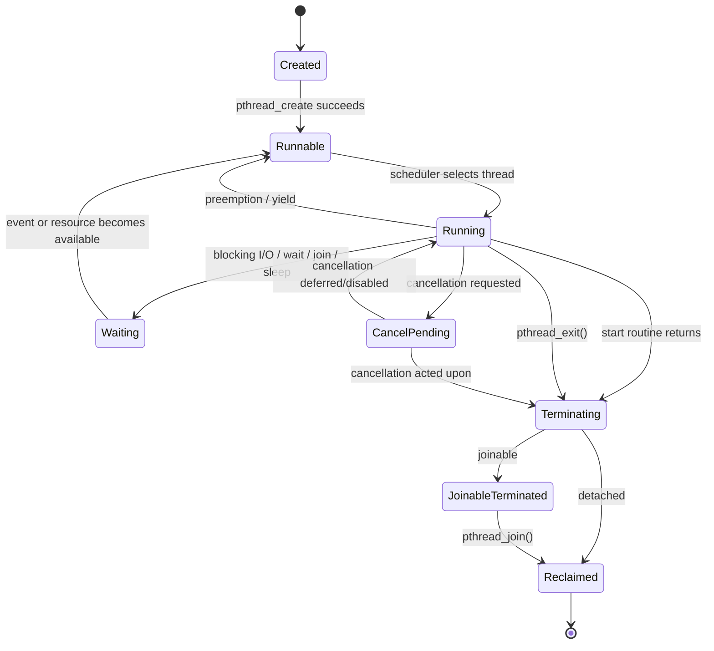

# Chủ đề 6 — Multithreading trong Linux

> **Mục tiêu dễ hiểu:** Hiểu nhiều thread cùng sống trong một process: chúng chia sẻ gì, có gì riêng, được tạo/kết thúc/join/detach ra sao.
>
> **Bạn cần biết trước:** Biết process và virtual address space ở mức Topic 4. Chưa cần biết mutex.
>
> **Các từ khóa sẽ gặp nhiều:**
> - **thread** = luồng thực thi có thể được scheduler chạy độc lập
> - **shared state** = memory/resources dùng chung trong process
> - **pthread_t** = ID ở lớp POSIX
> - **TID** = ID thread ở lớp Linux kernel
>
> **Quy ước đọc thuật ngữ:** khi gặp `state`, `context`, `semantics`, `object`, hãy hiểu lần lượt là **trạng thái**, **ngữ cảnh**, **hành vi theo chuẩn**, **đối tượng/tài nguyên**. Tên API và thuật ngữ chuẩn như process, thread, socket, mutex được giữ nguyên để bạn quen dần với tài liệu kỹ thuật.
>
> **Cách đọc nếu bạn mới bắt đầu:**
> 1. Lượt đầu chỉ đọc các ô **“Nói đơn giản”**, sơ đồ ASCII/Mermaid và phần **Tổng kết**.
> 2. Lượt hai đọc các mục `###` để hiểu API/khái niệm cụ thể.
> 3. Các mục `####`, caveat POSIX/Linux và edge case có thể để lần đọc thứ ba. **Không cần hiểu hết trong một lượt.**
>
> Chương này chỉ có **lý thuyết**, không có lab hay bài tập thực hành. Thuật ngữ tiếng Anh được giữ khi đó là tên chuẩn, nhưng luôn ưu tiên giải thích ý nghĩa trước.
---

## Mục lục

- [1. Multithreading là gì?](#1-multithreading-là-gì)
- [2. Process và Thread khác nhau ở đâu?](#2-process-và-thread-khác-nhau-ở-đâu)
- [3. POSIX Threads (Pthreads) là lớp API nào?](#3-posix-threads-pthreads-là-lớp-api-nào)
- [4. Thread Identity: `pthread_t`, TID và PID](#4-thread-identity-pthread_t-tid-và-pid)
- [5. Các Thread chia sẻ gì và có gì riêng?](#5-các-thread-chia-sẻ-gì-và-có-gì-riêng)
- [6. Tạo Thread với `pthread_create()`](#6-tạo-thread-với-pthread_create)
- [7. Thread chạy và kết thúc như thế nào?](#7-thread-chạy-và-kết-thúc-như-thế-nào)
- [8. Joinable và Detached Thread](#8-joinable-và-detached-thread)
- [9. Stack, Attributes và chi phí của một Thread](#9-stack-attributes-và-chi-phí-của-một-thread)
- [10. Concurrency và Parallelism](#10-concurrency-và-parallelism)
- [11. Shared Memory dẫn đến Race Condition như thế nào?](#11-shared-memory-dẫn-đến-race-condition-như-thế-nào)
- [12. Quan sát Thread trên Linux](#12-quan-sát-thread-trên-linux)
- [13. Khi Thread có vấn đề: tư duy Debugging](#13-khi-thread-có-vấn-đề-tư-duy-debugging)
- [14. Liên hệ với Embedded Linux](#14-liên-hệ-với-embedded-linux)
- [15. Tổng kết và Mô hình tư duy](#15-tổng-kết-và-mô-hình-tư-duy)
- [16. Tài liệu tham khảo](#16-tài-liệu-tham-khảo)

---

## 1. Multithreading là gì?

> **Nói đơn giản:** Multithreading nghĩa một process có nhiều luồng thực thi. Lợi ích là concurrency/shared memory; cái giá là race và vòng đời phức tạp hơn.


### 1.1 Multithreading thực chất là gì?

Một process single-threaded có một execution flow chính:

```text
Process
   |
   v
Thread A
```

Một process multithreaded có nhiều execution flows:

```text
Process
   |
   +--> Thread A
   |
   +--> Thread B
   |
   +--> Thread C
```

Các thread:

```text
share many process resources
```

nhưng mỗi thread có:

```text
independent execution context
```

Mô hình tư duy quan trọng:

```text
PROCESS
   =
resource / address-space container
   +
one or more schedulable execution flows
```

Thread không phải một process hoàn chỉnh thứ hai.

Thread là một execution context nằm trong cùng process và dùng chung nhiều resource với các thread khác.

---

### 1.2 Vì sao multithreading tồn tại?

Một application thường có nhiều loại công việc độc lập hoặc có thể overlap:

```text
wait for network
read sensor/device
process data
update state
write log
serve client
handle control events
```

Nếu chỉ có một execution flow:

```text
task A blocks
      |
      v
whole application execution flow waits
```

Với nhiều threads:

```text
Thread A waits for I/O
Thread B continues processing
Thread C handles another event
```

Multithreading tạo khả năng:

```text
concurrency
parallel execution on multicore
low-overhead shared-memory communication
separation of logical responsibilities
```

Nhưng đồng thời tạo:

```text
race conditions
lifecycle complexity
shared-resource conflicts
debugging difficulty
```

---

### 1.3 Thread không phải “một function chạy nền”

Một thread thường bắt đầu tại một function gọi là:

```text
start routine
```

nhưng thread không phải function.

Function call:

```text
caller
  |
  v
function
  |
 return
  |
  v
caller continues
```

Thread:

```text
independent scheduler entity
      |
      +--> own stack
      +--> own register state
      +--> can block independently
      +--> can run concurrently
      +--> has own lifecycle
```

Start routine chỉ là:

```text
entry point của execution flow
```

---

### 1.4 Multithreading không tự động đồng nghĩa hiệu năng cao

Một program có nhiều thread nhưng vẫn có thể chậm hơn single-threaded program vì:

```text
context switching
synchronization
cache contention
shared-memory traffic
lock contention
thread creation/destruction
oversubscription
```

Do đó:

```text
more threads
    !=
more performance
```

Correct thread count phụ thuộc workload và hardware.

---

## 2. Process và Thread khác nhau ở đâu?

> **Nói đơn giản:** Process là “container tài nguyên”; thread là “luồng đang chạy” bên trong. Các thread cùng process không có address space riêng như hai process độc lập.

> **Hình dung:** Process là căn phòng chung; heap/global/fd là đồ dùng chung. Mỗi thread là một người làm việc trong phòng, có “bàn làm việc” riêng là stack/register trạng thái.


### 2.1 Process là resource container

Topic 4 đã xây mô hình tư duy:

```text
Process
 |
 +--> virtual address space
 +--> file descriptor table
 +--> cwd / root / umask
 +--> credentials
 +--> signal dispositions
 +--> resource limits
 +--> program image
```

Multithreading không tạo các container này từ đầu cho từng thread.

Thay vào đó nhiều thread cùng hoạt động trong một process container.

---

### 2.2 Thread là execution flow

Thread cần đủ state để kernel scheduler có thể:

```text
pause it
resume it
schedule it
block it
wake it
```

Mỗi thread cần ít nhất conceptually:

```text
register context
program counter
stack pointer
stack
scheduler state
thread identity
signal mask
```

---

### 2.3 Process vs thread — mô hình tư duy

```text
+------------------------------------------------------+
|                      PROCESS                         |
|                                                      |
| Shared resources:                                    |
|   virtual address space                              |
|   executable mappings                                |
|   global/static data                                 |
|   heap                                               |
|   mmap regions                                       |
|   file descriptor table                              |
|   cwd / root                                         |
|   signal dispositions                                |
|   process credentials                                |
|                                                      |
|  +----------------+   +----------------+             |
|  | Thread A       |   | Thread B       |             |
|  |----------------|   |----------------|             |
|  | registers      |   | registers      |             |
|  | stack A        |   | stack B        |             |
|  | TID A          |   | TID B          |             |
|  | signal mask A  |   | signal mask B  |             |
|  | errno A        |   | errno B        |             |
|  +----------------+   +----------------+             |
+------------------------------------------------------+
```

---

### 2.4 Threads share failure domain

Separate processes have stronger address-space isolation.

Threads share one address space.

Therefore:

```text
Thread A writes invalid memory
        |
        v
process memory corrupted
        |
        v
Thread B/C may also fail
```

One thread's serious memory bug can crash the entire process.

This is one of the largest architectural differences between:

```text
multi-process
```

and:

```text
multi-threaded single process
```

---

## 3. POSIX Threads (Pthreads) là lớp API nào?

> **Nói đơn giản:** Pthreads là API chuẩn POSIX cho thread. Trên Linux, glibc/NPTL triển khai API này trên kernel thread/task mechanisms.


### 3.1 POSIX Threads — Pthreads

POSIX defines a standardized threading interface usually called:

```text
POSIX Threads
Pthreads
```

Core APIs/concepts include:

```text
pthread_t
pthread_create()
pthread_join()
pthread_detach()
pthread_exit()
pthread_attr_t
pthread_self()
pthread_equal()
```

Future Topic 7 adds synchronization primitives such as:

```text
pthread_mutex_*
pthread_cond_*
```

---

### 3.2 POSIX abstraction vs Linux implementation

Portable application view:

```text
Application
    |
    v
POSIX Pthreads API
```

Linux implementation view:

```text
Application
    |
    v
glibc Pthreads
    |
    v
NPTL
    |
    v
Linux kernel task/thread mechanisms
```

These layers must not be mixed casually.

A program should normally reason with:

```text
pthread_t
pthread_create
pthread_join
```

rather than relying on Linux implementation internals that are outside the Pthreads API contract.

---

### 3.3 NPTL

Modern GNU/Linux uses:

```text
NPTL
Native POSIX Threads Library
```

as glibc's POSIX threads implementation.

`nptl(7)` describes NPTL as the GNU C library POSIX threads implementation used on modern Linux systems.

NPTL provides POSIX semantics on top of Linux kernel facilities.

---

## 4. Thread Identity: `pthread_t`, TID và PID

> **Nói đơn giản:** `pthread_t`, Linux TID và process PID/TGID là các identity ở những lớp khác nhau. Đừng ép chúng thành cùng một số.


### 4.1 Ba identifiers dễ bị nhầm

Linux multithreading involves at least three concepts:

```text
pthread_t
Linux TID
TGID / process PID
```

They are not interchangeable.

---

### 4.2 `pthread_t`

POSIX defines:

```text
pthread_t
```

as a thread identifier type.

Application should treat it as:

```text
opaque identifier
```

Do not assume it is:

```text
int
pid_t
pointer
Linux TID
```

Its representation is implementation-defined.

---

### 4.3 `pthread_self()`

`pthread_self()` returns the calling thread's POSIX thread ID.

Concept:

```text
Thread A
   |
pthread_self()
   |
   v
pthread_t A
```

The value corresponds to the POSIX thread ID returned through `pthread_create()` for that thread.

---

### 4.4 `pthread_equal()`

Because `pthread_t` is opaque, portable comparison uses:

```text
pthread_equal()
```

rather than relying on its representation.

Mental rule:

```text
pthread_t is an API token
not a kernel numeric identity
```

---

### 4.5 Linux TID

Linux provides:

```text
gettid()
```

which returns Linux thread ID:

```text
TID
```

In single-threaded process:

```text
TID == PID
```

typically because the only thread is thread-group leader.

In multithreaded process:

```text
same process PID/TGID
different TID per thread
```

Example:

```text
Process TGID/PID = 4200

Thread leader:
TID = 4200

Worker A:
TID = 4201

Worker B:
TID = 4202
```

---

### 4.6 `pthread_t` ≠ TID

`gettid(2)` explicitly notes:

```text
Linux TID is not the same thing
as POSIX pthread_t
```

Mô hình tư duy:

```text
pthread_t
  library/POSIX identity

TID
  Linux kernel task identity
```

This distinction matters when connecting:

```text
Pthreads API
```

to:

```text
/proc/<pid>/task/<tid>
scheduler/debugger/kernel view
```

---

### 4.7 Thread-ID lifetime and reuse

Thread identifiers are not eternal historical identities.

Once thread vòng đời has ended and resources have been reclaimed:

```text
thread identifier may later be reused
```

Therefore stale `pthread_t` should not be treated as permanent identity.

---

## 5. Các Thread chia sẻ gì và có gì riêng?

> **Nói đơn giản:** Threads share heap/globals/fd/cwd..., nhưng mỗi thread có stack, register trạng thái, signal mask và execution trạng thái riêng.


### 5.1 Process-wide shared state

According to POSIX/Linux Pthreads model, threads in the same process share major resources such as:

```text
process ID / parent relationship
process group and session
controlling terminal
virtual address space
global/static data
heap
memory mappings
open file descriptors
signal dispositions
current working directory
root directory
umask
many process credentials
resource-limit context
```

Mô hình tư duy:

```text
Thread A ----+
Thread B ----+--> Shared Process State
Thread C ----+
```

---

### 5.2 Per-thread state

Each thread has state such as:

```text
POSIX thread ID
Linux TID
register context
program counter
stack
signal mask
alternate signal stack
errno
scheduling state
CPU-time clock/state
```

Concept:

```text
Thread A                  Thread B

stack A                   stack B
registers A               registers B
signal mask A             signal mask B
errno A                   errno B
TSD A                     TSD B
```

---

### 5.3 Shared virtual address space

All threads in the process normally access the same mapped virtual address space.

```text
Thread A ----+
Thread B ----+--> same process virtual memory
Thread C ----+
```

Therefore any thread can potentially access:

```text
globals
heap objects
mmap regions
shared libraries
other thread stack addresses
```

if it has valid addresses and protections allow it.

---

### 5.4 Stack is per-thread, but still mapped in shared address space

Each thread has its own logical stack region:

```text
Process address space

+----------------------+
| Thread A stack       |
+----------------------+
| Thread B stack       |
+----------------------+
| Thread C stack       |
+----------------------+
| heap                 |
+----------------------+
| globals              |
+----------------------+
| libraries/code       |
+----------------------+
```

But all stacks exist inside the same process address space.

Therefore:

> “Stack is private to a thread's normal execution” does not mean other threads are physically unable to dereference its address.

This is important for lifetime reasoning.

---

### 5.5 Register context is per-thread

Each thread must have independent:

```text
program counter
stack pointer
general registers
floating-point/SIMD context
```

Otherwise scheduler could not stop one thread and run another independently.

---

### 5.6 `errno` is per-thread

Pthreads model gives each thread its own `errno` state.

Concept:

```text
Thread A:
errno = EINTR

Thread B:
errno = EAGAIN
```

This avoids unrelated system/library calls in one thread overwriting another thread's error state.

---

## 6. Tạo Thread với `pthread_create()`

> **Nói đơn giản:** `pthread_create()` tạo một thread mới bắt đầu ở start routine. Argument thường là pointer vào bộ nhớ process, nên lifetime vẫn phải hợp lệ.


### 6.1 `pthread_create()` creates a thread, not a process

Conceptual interface:

```text
pthread_create(
    thread_id_output,
    attributes,
    start_routine,
    argument
)
```

Successful creation adds a new execution context inside same process.

```text
Before:

Process
 |
 +--> Thread A


After:

Process
 |
 +--> Thread A
 |
 +--> Thread B
```

No new independent process address space is created.

---

### 6.2 Start routine

New thread starts execution at:

```text
start_routine(argument)
```

Mô hình tư duy:

```text
pthread_create()
      |
      v
new thread becomes schedulable
      |
      v
start routine
      |
      v
thread-specific control flow
```

Start routine is the first normal application function of the new thread.

---

### 6.3 Thread argument is a shared-memory reference unless copied by application

`pthread_create()` passes one `void *` argument.

The API does not automatically deep-copy arbitrary application structures.

If argument points to process memory:

```text
creator
   |
   +----> object <----+
                     |
                  new thread
```

Both threads can reference the same object.

This means correctness depends on:

```text
object lifetime
ownership
synchronization
```

---

### 6.4 Scheduling order after creation is not generally predetermined

Linux `pthread_create(3)` notes that without real-time scheduling constraints it is indeterminate whether:

```text
creator thread
```

or:

```text
newly created thread
```

executes next.

Therefore correctness must never rely on:

```text
"I called pthread_create(), so creator definitely executes one more statement first"
```

or the opposite.

---

### 6.5 `pthread_create()` return model differs from many system calls

Pthreads APIs commonly return:

```text
0
  success

nonzero error number
  failure
```

rather than:

```text
-1 + errno
```

This is a major error-model distinction.

For Pthreads calls, do not automatically assume:

```text
errno contains the error
```

unless that specific API says so.

---

## 7. Thread chạy và kết thúc như thế nào?

> **Nói đơn giản:** Thread có thể run, block, wake và terminate độc lập. Return khỏi start routine tương đương kết thúc thread, không phải kết thúc toàn process.


### 7.1 High-level vòng đời

```text
Created
   |
   v
Runnable
   |
   v
Running
  /   \
 /     \
v       v
Waiting  Runnable
   \     /
    \   /
     v v
   Running
      |
      v
Terminating
      |
      v
Terminated
```

Termination then branches by:

```text
joinable
detached
```

---

### 7.2 Thread vòng đời state machine



This is a conceptual vòng đời, not a complete Linux scheduler-state diagram.

---

### 7.3 Returning from a start routine

POSIX specifies that when a created thread's start routine returns:

```text
effect is as if pthread_exit(return_value) were called
```

Therefore:

```text
start routine return
      |
      v
thread termination
```

not:

```text
return to pthread_create()
```

---

### 7.4 `pthread_exit()`

`pthread_exit(value)` terminates the **calling thread**.

Mô hình tư duy:

```text
Thread A
  |
pthread_exit()
  |
  X

Thread B continues
Thread C continues
```

It is not process-wide termination.

---

### 7.5 `pthread_exit()` vs `exit()`

Critical distinction:

```text
pthread_exit()
    one thread terminates

exit()
    process terminates
    therefore all threads terminate
```

This distinction appears often in libraries and worker-thread design.

---

### 7.6 Returning from `main()`

Returning from `main()` has process-level termination semantics equivalent to `exit()`.

Therefore:

```text
main returns
   |
   v
process terminates
   |
   v
other threads do not keep process alive
```

If initial thread instead calls:

```text
pthread_exit()
```

other threads can continue.

---

### 7.7 Last thread termination

Linux `pthread_exit(3)` notes that when the last thread terminates, process terminates and process-wide cleanup occurs.

Mô hình tư duy:

```text
Process exists
because at least one thread remains

last thread ends
      |
      v
process ends
```

---

### 7.8 Thread termination does not automatically release process-wide resources

When one thread ends, process-shared resources are not automatically closed/released simply because that thread happened to use them.

Examples:

```text
file descriptors
process-wide memory
shared synchronization objects
```

belong to process/shared-resource lifetime, not one thread's lifetime.

---

## 8. Joinable và Detached Thread

> **Nói đơn giản:** Joinable thread cần một thread khác `join` để thu result/reclaim vòng đời tài nguyên; detached thread tự được reclaim sau khi kết thúc.

> **Đừng nhầm:** `detached` không có nghĩa “background”. Nó chỉ nói ai chịu trách nhiệm thu hồi tài nguyên sau khi thread kết thúc.


### 8.1 Detach state is a vòng đời contract

A thread is conceptually either:

```text
joinable
```

or:

```text
detached
```

This does **not** mean:

```text
joinable = foreground
detached = background
```

Detach state only controls:

```text
how termination resources are reclaimed
whether another thread can join and collect its result
```

---

### 8.2 Joinable thread

New thread is normally joinable by default unless attributes specify detached state.

Vòng đời:

```text
Running
   |
 terminate
   |
   v
Terminated joinable state
   |
   | pthread_join()
   v
Resources reclaimed
```

A terminated joinable thread is finished executing but still retains join-related resources.

---

### 8.3 `pthread_join()`

`pthread_join(target, ...)` waits until target joinable thread terminates.

If already terminated:

```text
join can return immediately
```

Join can retrieve the target thread's termination value when requested.

---

### 8.4 Threads are peers — no thread parent hierarchy

POSIX threads do not have a process-like permanent:

```text
PPID parent-child tree
```

The thread that calls `pthread_create()` is the creator, but this does not give it exclusive lifelong ownership of joining.

Linux `pthread_join(3)` states:

```text
threads in a process are peers
```

An appropriate thread can join another joinable thread according to API rules.

---

### 8.5 Multiple simultaneous joins

Multiple threads trying to join the same target concurrently results in undefined behavior according to the Linux/POSIX interface description.

A thread should therefore have clear vòng đời ownership.

---

### 8.6 Detached thread

Detached vòng đời:

```text
Running
   |
 terminate
   |
   v
automatic resource reclamation
```

No later `pthread_join()`.

---

### 8.7 `pthread_detach()`

Detaching changes joinable thread into detached state.

Once detached:

```text
cannot be joined
cannot be made joinable again
```

Detaching does not:

```text
stop thread
pause thread
change CPU priority
make it asynchronous
move it into another process
```

It only changes termination-resource semantics.

---

### 8.8 Every thread needs a vòng đời policy

For every application-created thread, architecture should answer:

```text
Who joins it?
```

or:

```text
Is it intentionally detached?
```

Failure to join a terminated joinable thread can leave system resources allocated.

Linux documentation sometimes calls this a:

```text
"zombie thread"
```

but this is not identical to Unix process-zombie semantics.

---

## 9. Stack, Attributes và chi phí của một Thread

> **Nói đơn giản:** Mỗi thread cần stack và kernel/runtime bookkeeping, nên “tạo càng nhiều thread càng tốt” là sai.


### 9.1 `pthread_attr_t`

`pthread_attr_t` is a thread-creation configuration object.

Concept:

```text
pthread_attr_t
     |
     +--> detach state
     +--> stack size
     +--> stack address
     +--> guard size
     +--> scheduling attributes
```

It is not the thread itself.

---

### 9.2 Attributes are consumed at creation

Concept:

```text
attributes object
     |
pthread_create()
     |
     v
thread created with configured properties
```

Changing/destroying the attributes object afterward does not retroactively mutate thread properties.

---

### 9.3 Thread stack

Each created thread has its own stack.

The stack stores execution state such as:

```text
function call frames
automatic local objects
return state
compiler/ABI data
```

Thread stack must exist for thread's entire execution lifetime.

---

### 9.4 Stack size is fixed at creation for normal Pthread-created threads

Linux `pthread_attr_setstacksize(3)` states a thread's stack size is fixed when the thread is created.

This matters because stack sizing affects:

```text
maximum recursion/call depth
large local objects
virtual-address-space consumption
maximum practical thread count
```

---

### 9.5 Linux default stack-size context

On NPTL, default new-thread stack size is influenced by process startup resource-limit context such as:

```text
RLIMIT_STACK
```

Linux `pthread_create(3)` documents the details.

The important mô hình tư duy is:

> Default stack size is not a universal constant that should be assumed across all Linux systems and architectures.

---

### 9.6 Guard region

Thread stacks can have guard area.

Concept:

```text
+-----------------------+
| usable thread stack   |
+-----------------------+
| guard region          |
| protected/unmapped    |
+-----------------------+
```

Purpose:

```text
help detect some stack overflow growth
```

It is not a complete protection mechanism against all memory corruption.

---

### 9.7 Caller-supplied stack

POSIX allows thread attributes to specify caller-managed stack memory.

Mô hình tư duy:

```text
Application memory region
       |
       v
used as thread stack
```

This transfers responsibility for:

```text
size
alignment
lifetime
address validity
```

to the application.

---

### 9.8 Thread resource footprint

Each thread consumes resources such as:

```text
stack virtual memory
potential resident stack pages
kernel task state
scheduler bookkeeping
TLS/TSD state
library/runtime bookkeeping
```

Therefore creating large numbers of threads has real cost.

---

## 10. Concurrency và Parallelism

> **Nói đơn giản:** Concurrency là nhiều công việc tiến triển xen kẽ; parallelism là thực sự chạy đồng thời trên nhiều core. Hai khái niệm không đồng nhất.


### 10.1 Scheduler operates on individual Linux threads/tasks

Under NPTL 1:1 model:

```text
Thread A
Thread B
Thread C
```

are separately schedulable.

Kernel does not treat process as one indivisible execution unit.

---

### 10.2 Concurrency

Concurrency means multiple tasks make overlapping progress over time.

Single-core example:

```text
time --->

Thread A: ███       ███
Thread B:    █████
Thread C:         ██
```

Only one executes at an instant, but execution is interleaved.

---

### 10.3 Parallelism

On multicore:

```text
CPU0 -> Thread A
CPU1 -> Thread B
CPU2 -> Thread C
```

threads can execute simultaneously.

Parallelism exposes memory races more aggressively because operations can physically overlap.

---

### 10.4 Runnable vs running

Thread may be:

```text
runnable
```

but waiting in scheduler queue.

```text
Runnable queue:
 A
 B
 C

CPU0 currently executes B
```

A and C are runnable, but not running on CPU at that instant.

---

### 10.5 Blocking thread

A thread can block independently while another thread continues.

Example:

```text
Thread A
  wait for device/network
       |
       v
sleeping/blocking

Thread B
  keeps running
```

This is a major reason threading is useful for I/O-heavy applications.

---

### 10.6 Context switch

Thread switch concept:

```text
Thread A running
      |
save A execution context
      |
scheduler selects B
      |
restore B context
      |
Thread B running
```

Context includes:

```text
registers
program counter
stack pointer
scheduler state
architecture-specific CPU state
```

Same-address-space thread switch can avoid some work associated with switching unrelated process address spaces, but it is not free.

---

### 10.7 Scheduling order is not application synchronization

Scheduler may run threads in arbitrary valid interleavings.

Therefore:

```text
sleep()
yield()
creation order
CPU speed
```

must not be treated as correctness synchronization.

Correct ordering needs explicit synchronization/ownership protocol.

---

## 11. Shared Memory dẫn đến Race Condition như thế nào?

> **Nói đơn giản:** Vì bộ nhớ được share, hai thread sửa cùng trạng thái mà không có giao thức có thể race. Topic 7 sẽ học cách đồng bộ.


### 11.1 Shared memory is the central benefit and central danger

Threads share memory, so data exchange can be direct:

```text
Thread A
   |
   v
shared object
   ^
   |
Thread B
```

No serialization into pipe/socket is required.

But concurrent mutation can become unsafe.

---

### 11.2 Simple-looking statement may contain multiple operations

Concept:

```text
counter = counter + 1
```

can conceptually require:

```text
load counter
compute +1
store result
```

Two threads can interleave:

```text
Thread A                 Thread B

load 10
                         load 10
compute 11
                         compute 11
store 11
                         store 11
```

Expected logical result after two increments:

```text
12
```

possible observed result:

```text
11
```

This is the classic lost-update race.

---

### 11.3 Shared memory has no automatic transaction boundary

Source code statement:

```text
state = state + 1
```

does not automatically mean:

```text
"all CPUs and threads observe this as one globally indivisible transaction"
```

Correctness depends on:

```text
language memory model
compiler transformations
CPU memory behavior
synchronization primitives
atomic operations
```

Detailed treatment belongs Topic 7.

---

### 11.4 Data race vs logical race

#### 11.4.1 Data race

In languages such as C/C++, conflicting unsynchronized accesses to shared object with at least one write can create a language-level data race.

A data race can make behavior undefined under the language memory model.

#### 11.4.2 Logical race

Even with individually synchronized accesses, higher-level ordering can be wrong.

Example mô hình tư duy:

```text
check condition
   |
another thread changes state
   |
act based on stale assumption
```

So:

```text
atomic individual load/store
```

does not automatically make a multi-step algorithm correct.

---

### 11.5 Synchronization belongs next topic

Topic 7 will provide actual mechanisms:

```text
mutex
condition variable
semaphore
rwlock
barrier
deadlock analysis
priority inversion concepts
```

Topic 6 only establishes why those mechanisms are needed.

---

## 12. Quan sát Thread trên Linux

> **Nói đơn giản:** Linux cho phép quan sát từng thread qua `/proc/<pid>/task/<tid>` và các tool có thread view.


### 12.1 `/proc/<pid>/task/`

Linux procfs exposes each thread:

```text
/proc/<pid>/task/<tid>/
```

Example mô hình tư duy:

```text
Process PID/TGID 5000
 |
 +--> /proc/5000/task/5000
 +--> /proc/5000/task/5001
 +--> /proc/5000/task/5002
```

Each directory corresponds to Linux thread/task TID.

---

### 12.2 `/proc/thread-self`

Linux provides:

```text
/proc/thread-self
```

which refers to current thread's:

```text
/proc/self/task/<tid>
```

directory.

This is thread-aware counterpart to:

```text
/proc/self
```

---

### 12.3 Per-thread state through procfs

Thread task directories expose information analogous to process/task views:

```text
status
stat
stack-related/kernel state where permitted
scheduler/accounting data
fd-related process views
```

Some information is process-wide, some thread-specific.

---

### 12.4 `ps` and `top`

Monitoring tools can present:

```text
one row per process
```

or:

```text
one row per thread/task
```

depending view/options.

Thread-level observation helps identify:

```text
which thread consumes CPU
which thread is sleeping
which thread count is growing
which TID is stuck
```

---

### 12.5 Thread names

Linux/Pthreads ecosystems support thread-name concepts visible through tools/procfs in implementation-specific interfaces.

Thread names are diagnostic labels.

They are not thread identity.

Never use display name as replacement for:

```text
pthread_t
TID
```

---

## 13. Khi Thread có vấn đề: tư duy Debugging

> **Nói đơn giản:** Debug thread nên hỏi: thread có được tạo không, còn sống không, đang block hay run, join/detach đúng chưa, trạng thái có race không?


### 13.1 First question: which abstraction is failing?

Debug hierarchy:

```text
thread creation?
      ↓
thread identity?
      ↓
lifecycle?
      ↓
shared vs per-thread state?
      ↓
resource lifetime?
      ↓
scheduling/order assumption?
      ↓
race?
      ↓
signal/cancellation?
      ↓
fork/exec interaction?
```

---

### 13.2 Pthreads error-return model

Many Pthreads APIs return:

```text
0
```

on success,

and:

```text
error number directly
```

on failure.

This differs from classic:

```text
-1 and errno
```

system-call pattern.

This distinction should be checked per function rather than assumed.

---

### 13.3 Thread appears not to start

Possible conceptual causes:

```text
pthread_create failed
process terminated early
main returned
thread immediately blocks
thread immediately exits
scheduler order differs from expectation
```

Do not infer from lack of visible output alone.

---

### 13.4 Main exits while workers still exist

Returning from `main()` terminates process.

Therefore worker existence does not prevent process-level exit.

This is vòng đời, not scheduler failure.

---

### 13.5 Thread resource count keeps growing

Possible architecture issues:

```text
joinable terminated threads never joined
unbounded thread creation
large stack configuration
TSD/resource leak
thread never terminates
```

---

### 13.6 `pthread_join()` never returns

Possible causes:

```text
target still legitimately running
target blocked forever
deadlock
target waits for joining thread
cyclic join dependency
lifecycle assumption wrong
```

Join is a blocking synchronization operation.

---

### 13.7 Detached thread cannot be joined

This is correct semantics.

Detach state is irreversible vòng đời choice.

---

### 13.8 Wrong thread identity

Typical confusion:

```text
pthread_t printed/interpreted as TID
PID mistaken for TID
thread name treated as identity
```

Use correct abstraction for the interface being debugged.

---

### 13.9 Intermittent data corruption

Strong suspicion:

```text
shared mutable state race
object lifetime race
use-after-free
unsynchronized ownership transfer
```

Race bugs often disappear or change when:

```text
logging added
debugger attached
timing changes
CPU count changes
```

Timing-dependent disappearance is not evidence that race is fixed.

---

## 14. Liên hệ với Embedded Linux

> **Nói đơn giản:** Embedded app thường tách sensor/network/control thành thread, nhưng phải tính RAM stack, fault domain và blocking behavior.


### 14.1 Typical Embedded Linux application decomposition

An application might have:

```text
+----------------------------------+
| Embedded Application             |
|                                  |
| Sensor/Input Thread              |
| Protocol/Network Thread          |
| Control Thread                   |
| Logger Thread                    |
| UI/IPC Thread                    |
+----------------------------------+
```

This can map naturally to independent blocking activities.

---

### 14.2 Device I/O concurrency

Threads may interact with:

```text
UART
I2C
SPI
CAN
GPIO interfaces
camera/audio device
socket
file
```

Because fd table is shared, architecture must define:

```text
one owner thread?
multiple synchronized users?
request queue?
```

Kernel does not know application-level packet/message ownership.

---

### 14.3 Blocking I/O design

A simple embedded userspace design may use:

```text
one thread waits for device input
one thread processes data
one thread sends output
```

Blocking thread can sleep without burning CPU while other threads continue.

This can be easier to understand than one highly complex event loop for small/medium applications.

---

### 14.4 Memory budget

Per-thread resource costs matter on devices with:

```text
limited RAM
32-bit virtual address space
small swap/no swap
many long-running services
```

Thread count and stack size should therefore be budgeted.

---

### 14.5 Fault isolation

A multi-threaded application has one address-space failure domain.

If one thread causes:

```text
SIGSEGV
heap corruption
global memory corruption
```

entire application may fail.

For safety/reliability boundaries, separate processes may be more appropriate.

---

### 14.6 Multicore SoC utilization

Embedded Linux SoCs often have multiple ARM cores.

Independent CPU-heavy threads can potentially execute in parallel.

But performance depends on:

```text
core count
cache hierarchy
memory bandwidth
synchronization
CPU affinity
scheduler policy
```

Thread creation alone does not guarantee parallel speedup.

---

### 14.7 Headless debugging

On embedded target, thread state can be observed through:

```text
/proc/<pid>/task/<tid>
process monitoring tools
debuggers
logs
```

This is useful when:

```text
one worker spins CPU
one thread blocks forever
thread count grows
signals go to unexpected thread
```

---

## 15. Tổng kết và Mô hình tư duy

> **Nói đơn giản:** Hãy nhớ: một process, nhiều execution flows; shared address space nhưng per-thread stack/registers/vòng đời.


```text
Process
  ├─ shared: address space, globals, heap, open resources
  ├─ Thread A: stack + registers + execution state
  └─ Thread B: stack + registers + execution state
```

Vòng đời:

```text
pthread_create
   ↓
runnable / running / waiting
   ↓
return or pthread_exit
   ↓
terminated
   ├─ joinable → pthread_join → reclaimed
   └─ detached → automatic reclamation
```

Các điểm cần giữ:
- Thread là schedulable execution flow trong cùng process.
- Threads share address space nhưng có stack/register execution context riêng.
- Pthreads là portable POSIX API; Linux NPTL là implementation detail ở mức cần biết.
- `pthread_create()` không tạo process mới và không bảo đảm creator/new thread chạy theo một thứ tự cố định.
- Joinable/detached là vòng đời-resource policy, không phải foreground/background.
- Multicore cho phép parallelism; single-core vẫn có concurrency.
- Shared mutable data tạo race risk; giải pháp synchronization thuộc Topic 7.

---

## 16. Tài liệu tham khảo

> **Nói đơn giản:** Nguồn tham khảo để kiểm chứng POSIX Pthreads và Linux-specific identity/trạng thái.


- POSIX.1-2024 Pthreads interfaces: https://pubs.opengroup.org/onlinepubs/9799919799/
- `pthreads(7)`: https://man7.org/linux/man-pages/man7/pthreads.7.html
- `pthread_create(3)`: https://man7.org/linux/man-pages/man3/pthread_create.3.html
- `pthread_join(3)`: https://man7.org/linux/man-pages/man3/pthread_join.3.html
- `pthread_detach(3)`: https://man7.org/linux/man-pages/man3/pthread_detach.3.html
- `pthread_exit(3)`: https://man7.org/linux/man-pages/man3/pthread_exit.3.html
- `pthread_self(3)`: https://man7.org/linux/man-pages/man3/pthread_self.3.html
- `pthread_attr_setstacksize(3)`: https://man7.org/linux/man-pages/man3/pthread_attr_setstacksize.3.html
- `proc_pid_task(5)`: https://man7.org/linux/man-pages/man5/proc_pid_task.5.html

---

> **Điều hướng:** [← Chủ đề 5 — Signal](README-topic-05.md) · [Chủ đề 7 — Thread Synchronization →](README-topic-07.md)
