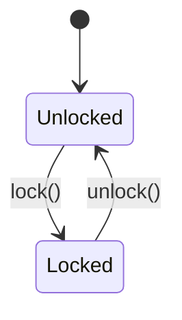
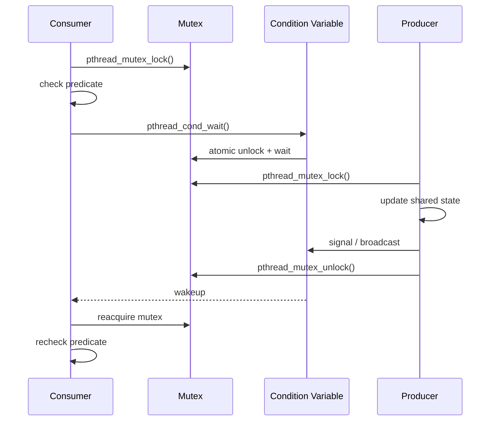
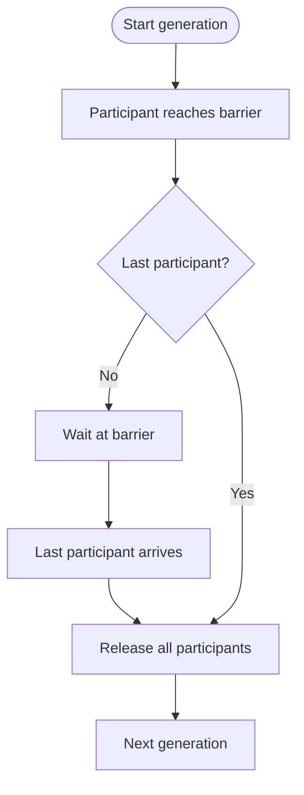

# Chủ đề 7 — Đồng bộ luồng trong Linux

> **Mục tiêu:** hiểu vì sao nhiều luồng dùng chung dữ liệu cần đồng bộ, và nắm đúng vai trò của `mutex`, `condition variable`, `semaphore`, `barrier`, cùng các vấn đề như `race condition`, `deadlock`, `starvation` và `priority inversion`.
>
> **Quy ước ngôn ngữ:** phần giải thích dùng Tiếng Việt. Các thuật ngữ đồng bộ cần giữ đúng nghĩa như `race condition`, `data race`, `critical section`, `atomicity`, `memory visibility`, `mutex`, `condition variable`, `predicate`, `semaphore`, `barrier`, `deadlock`, `starvation`, `livelock`, `lock ordering`, `contention`, `priority inversion` và tên API/Pthreads được giữ bằng tiếng Anh.
>
> **Phạm vi:** `race condition`, `critical section`, `atomicity` ở mức khái niệm, `memory visibility` giữa các luồng, `mutex`, `condition variable`, `semaphore`, mô hình `producer–consumer`, `barrier`, `deadlock`, `starvation`, `livelock`, `lock ordering`, `lock granularity`, `contention` và priority inversion ở mức tổng quan.
>
> Chương này chỉ có **lý thuyết**, không có bài thực hành. Các chủ đề nâng cao như raw `futex`, lock-free, RCU, kernel `spinlock` và mô hình atomic C/C++ chi tiết không thuộc phạm vi chương này.

Đồng bộ chỉ trở nên dễ hiểu khi bắt đầu từ **trạng thái dùng chung cần luôn đúng**. Mutex không “khóa một biến” theo nghĩa tự động; ứng dụng dùng mutex để bảo vệ một vùng trạng thái và các `invariant` của nó. Condition Variable không chứa điều kiện; nó giúp luồng ngủ trong khi chờ một predicate trên dữ liệu dùng chung thay đổi. Semaphore lại phù hợp với mô hình đếm tài nguyên hoặc token.

Vì vậy chương này không học từng API riêng lẻ. Nó đi từ `race condition` và `critical section` đến `mutex`, `condition variable`, `semaphore`, `producer–consumer`, rồi mới phân tích `deadlock`, `starvation`, `livelock` và `priority inversion`.

Nếu bạn mới bắt đầu, hãy đọc theo thứ tự từ mục lớn tới mục nhỏ và xem sơ đồ trước khi đi vào các chi tiết API. Mỗi sơ đồ chỉ giữ những thành phần cần thiết để tạo mô hình trong đầu; đoạn văn ngay bên dưới sẽ giải thích luồng dữ liệu, trạng thái hoặc quan hệ giữa các object. Sau khi đã hiểu mô hình, hãy quay lại tên API, flag và mã lỗi để gắn chúng vào đúng vị trí thay vì học thuộc rời rạc.

---

## Mục lục

- [1. Vì sao cần đồng bộ luồng?](#1-vì-sao-cần-đồng-bộ-luồng)
- [2. `race condition`, `data race` và `critical section`](#2-race-condition-data-race-và-critical-section)
- [3. Đồng bộ còn liên quan tới `memory visibility`](#3-đồng-bộ-còn-liên-quan-tới-memory-visibility)
- [4. Mutex: chỉ một luồng được sở hữu vùng bảo vệ](#4-mutex-chỉ-một-luồng-được-sở-hữu-vùng-bảo-vệ)
- [5. Vòng đời và thao tác của Mutex](#5-vòng-đời-và-thao-tác-của-mutex)
- [6. Các loại Mutex cơ bản](#6-các-loại-mutex-cơ-bản)
- [7. `Condition variable`: ngủ để chờ trạng thái thay đổi](#7-condition-variable-ngủ-để-chờ-trạng-thái-thay-đổi)
- [8. Predicate, spurious wakeup và lost wakeup](#8-predicate-spurious-wakeup-và-lost-wakeup)
- [9. `signal`, `broadcast` và chờ có thời hạn](#9-signal-broadcast-và-chờ-có-thời-hạn)
- [10. `Semaphore`: bộ đếm tài nguyên hoặc token](#10-semaphore-bộ-đếm-tài-nguyên-hoặc-token)
- [11. Khi nào dùng `mutex`, `condition variable` hay `semaphore`?](#11-khi-nào-dùng-mutex-condition-variable-hay-semaphore)
- [12. Mô hình `producer–consumer`](#12-mô-hình-producerconsumer)
- [13. `Barrier`: các luồng chờ nhau ở cuối một giai đoạn](#13-barrier-các-luồng-chờ-nhau-ở-cuối-một-giai-đoạn)
- [14. `Deadlock`](#14-deadlock)
- [15. `Starvation` và `livelock`](#15-starvation-và-livelock)
- [16. `Lock ordering`, `critical-section granularity` và `contention`](#16-lock-ordering-critical-section-granularity-và-contention)
- [17. `Priority inversion` và `priority inheritance`](#17-priority-inversion-và-priority-inheritance)
- [18. Tư duy gỡ lỗi đồng bộ](#18-tư-duy-gỡ-lỗi-đồng-bộ)
- [19. Liên hệ với Embedded Linux](#19-liên-hệ-với-embedded-linux)
- [20. Tổng kết](#20-tổng-kết)
- [21. Tài liệu tham khảo](#21-tài-liệu-tham-khảo)

---

## 1. Vì sao cần đồng bộ luồng?

Khi nhiều luồng cùng dùng dữ liệu, kết quả có thể sai nếu chúng truy cập không đúng thứ tự. Đồng bộ (`synchronization`) tạo ra quy tắc để các luồng phối hợp an toàn.

### 1.1 Vấn đề bắt đầu từ dữ liệu dùng chung có thể thay đổi

```text
Thread A --------+
                |
                v
        shared state
                ^
                |
Thread B --------+
```

Nếu dữ liệu chỉ đọc và không thay đổi, vấn đề đơn giản hơn nhiều.

Nếu dữ liệu có thể bị ghi, các bước đọc, sửa và ghi của nhiều luồng có thể xen kẽ nhau. Khi đó thứ tự thực thi trở thành một phần của tính đúng đắn của chương trình.

---

### 1.2 Đồng bộ không chỉ là “khóa một biến”

Một cấu trúc thường có nhiều trường liên hệ nhau:

```text
head
tail
size
buffer[]
```

Nếu đây là một hàng đợi, các trường phải cùng thỏa mãn một quy tắc nhất quán.

Vì vậy thứ cần bảo vệ thường là:

```text
một trạng thái / một invariant
```

chứ không phải chỉ một biến đơn lẻ.

---

### 1.3 Ba câu hỏi trước khi chọn cơ chế đồng bộ

```text
1. Dữ liệu/trạng thái nào được dùng chung?
2. Những thao tác nào không được phép chồng lên nhau?
3. Thread phải chờ condition/predicate nào mới được tiếp tục?
```

Sau đó mới lựa chọn: mutex, condition variable, semaphore và barrier.

---

## 2. `race condition`, `data race` và `critical section`

`race condition` là kết quả phụ thuộc thời điểm thực thi; `data race` là một dạng truy cập bộ nhớ không được đồng bộ đúng; `critical section` là đoạn mã cần được bảo vệ.

### 2.1 `race condition`

`race condition` xảy ra khi kết quả đúng/sai phụ thuộc vào thời điểm và thứ tự các thao tác đồng thời.

Ví dụ:

```text
balance = 100

Thread A                  Thread B
đọc 100                  đọc 100
cộng 10                  trừ 20
ghi 110                  ghi 80
```

Kết quả cuối có thể là:

```text
80
```

và cập nhật của A bị mất.

Nếu thứ tự khác, kết quả có thể khác.

---

### 2.2 `data race` là khái niệm chặt hơn

Ở mức mô hình bộ nhớ của ngôn ngữ, `data race` liên quan tới nhiều luồng truy cập cùng một vị trí nhớ, có ít nhất một thao tác ghi và không có đồng bộ phù hợp.

Đối với C/C++, data race có thể dẫn tới hành vi không xác định theo chuẩn ngôn ngữ.

Topic này không đi sâu vào memory order của C11/C++.

---

### 2.3 Race ở mức logic vẫn có thể xảy ra dù từng lần truy cập đã được khóa

Ví dụ: khóa, kiểm tra: tài nguyên còn trống, mở khóa, ... luồng khác thay đổi tài nguyên ..., khóa, sử dụng dựa trên kết quả kiểm tra cũ và mở khóa.

Từng lần đọc/ghi có thể được bảo vệ, nhưng toàn bộ logic nghiệp vụ:

```text
kiểm tra -> hành động
```

Hai bước này phải được xem như **một quyết định logic thống nhất** nếu hành động chỉ còn đúng khi kết quả kiểm tra vẫn đúng. Nếu nhả lock ở giữa, thread khác có thể thay đổi state và làm kết quả kiểm tra cũ mất hiệu lực. Đây là kiểu race ở mức protocol: từng access riêng lẻ có thể đã được lock, nhưng phạm vi transaction logic vẫn quá nhỏ.

---

### 2.4 `critical section`

`critical section` là đoạn mã thay đổi/đọc trạng thái mà các thao tác xung đột không được phép cùng thực hiện.

```text
Thread A
   |
lock(mutex)
   |
   v
+---------------------------+
|     CRITICAL SECTION      |
| cập nhật shared state     |
+---------------------------+
   |
unlock(mutex)
```

Trong sơ đồ, `lock(mutex)` và `unlock(mutex)` tạo biên cho đoạn code mà các thread cạnh tranh không được thực hiện đồng thời. Tuy nhiên mutex không tự biết `shared state` nào cần bảo vệ; **protocol của chương trình** mới quy định mọi access liên quan phải dùng cùng mutex. Nếu một đường code đọc/ghi shared state mà bỏ qua protocol, critical section còn lại không thể bảo đảm tính đúng đắn.

---

### 2.5 `critical section` nên bao quanh `invariant` cần giữ đúng

Không nên hỏi:

> “Biến nào cần mutex?”

Nên hỏi:

> “Thao tác nào phải được xem như một bước nhất quán so với các luồng khác?”

Ví dụ với một hàng đợi, thao tác ghi phần tử, cập nhật `tail` và cập nhật `size` thường phải được xem như một lần chuyển trạng thái thống nhất và được bảo vệ cùng nhau.

---

## 3. Đồng bộ còn liên quan tới `memory visibility`

Đồng bộ không chỉ ngăn hai luồng sửa cùng lúc. Nó còn giúp đảm bảo một luồng nhìn thấy thay đổi dữ liệu mà luồng khác đã công bố đúng cách.

### 3.1 Vì sao “A ghi trước, B đọc sau” chưa đủ nếu không có đồng bộ?

Trong mã nguồn:

```text
data = 123;
ready = 1;
```

người đọc dễ nghĩ luồng khác chắc chắn thấy theo đúng thứ tự này.

Nhưng khi có nhiều CPU/compiler, thứ tự và khả năng quan sát giữa các luồng phải dựa vào mô hình bộ nhớ và thao tác đồng bộ được chuẩn quy định.

---

### 3.2 Mutex tạo quan hệ đồng bộ

Cách hình dung:

```text
Thread A                        Thread B

lock(M)
cập nhật shared data
unlock(M)  ------------------>  lock(M)
                                  |
                                  v
                           đọc protected state
```

Không nên xem `pthread_mutex_unlock()` chỉ như việc đổi một cờ từ 1 về 0.

API đồng bộ có ngữ nghĩa bộ nhớ mạnh hơn cách hiểu đó.

---

### 3.3 `atomicity` ở mức khái niệm

Một thao tác “nguyên tử” theo nghĩa giao thức là:

```text
các Thread khác không quan sát thấy invalid intermediate state
```

Mutex có thể làm cho một nhóm thao tác trở thành `critical section` nguyên vẹn **theo giao thức khóa**.

Điều này khác với khái niệm atomic instruction/atomic type ở cấp CPU/ngôn ngữ, vốn là chủ đề sâu hơn.

---

## 4. Mutex: chỉ một luồng được sở hữu vùng bảo vệ

Mutex giống một chìa khóa: tại một thời điểm chỉ một luồng giữ khóa và đi vào vùng dữ liệu được bảo vệ.

### 4.1 Mutex là gì?

`mutex` bắt nguồn từ:

```text
mutual exclusion
```

Có thể hình dung quy tắc sở hữu của mutex bằng mô hình ngắn sau:

```text
mutex ở trạng thái locked
  -> chỉ một thread là owner tại một thời điểm
```

Khi mutex đang `Locked`, thread đang giữ mutex là owner. Các thread khác không được đi vào critical section được bảo vệ bởi cùng mutex cho tới khi ownership kết thúc bằng `unlock()`.

Các luồng khác muốn lấy cùng mutex phải chờ hoặc nhận trạng thái “đang bận”, tùy API.

---

### 4.2 Trạng thái cơ bản



Sơ đồ cố ý chỉ giữ hai trạng thái để nhấn mạnh bản chất của mutex: tại một thời điểm mutex hoặc **không có owner** (`Unlocked`) hoặc **đang thuộc quyền sở hữu của một thread** (`Locked`). `lock()` không đơn thuần đổi một biến cờ; nếu mutex đã bị thread khác sở hữu, caller có thể phải chờ theo semantics của loại mutex đó. Tương tự, `unlock()` là hành động kết thúc quyền sở hữu và có thể làm một waiter khác trở nên runnable. Dữ liệu được bảo vệ nằm **ngoài mutex**; mutex chỉ là cơ chế để các thread tuân theo cùng một protocol truy cập.

Trong sơ đồ, `lock()` tương ứng với thao tác lấy mutex bằng `pthread_mutex_lock()`, còn `unlock()` tương ứng với `pthread_mutex_unlock()` do owner thực hiện.

Khi đang bị khóa:

```text
Thread A owns M
Thread B lock(M) -> wait
Thread C lock(M) -> wait
```

Hai trạng thái `Unlocked` và `Locked` mô tả ownership chứ không mô tả giá trị dữ liệu. Khi một thread lock thành công, nó có quyền vào vùng bảo vệ; thread khác phải tuân theo cùng mutex trước khi thao tác trên invariant đó. Chỉ khi owner unlock, quyền sở hữu mới có thể được chuyển cho waiter khác. Vì vậy câu hỏi đúng luôn là “mutex này bảo vệ invariant nào?”, không phải “mutex đang khóa biến nào?”.

---

### 4.3 `ownership` — quyền sở hữu

Đây là điểm phân biệt mutex với semaphore.

```text
Thread A: lock(M)
      |
      v
A becomes owner of M
      |
      v
Thread A: unlock(M)
```

Không nên thiết kế theo kiểu Thread A khóa mutex rồi Thread B mở khóa thay. Mutex có ownership; vi phạm quy tắc sở hữu thường là lỗi giao thức và có thể dẫn tới hành vi không xác định tùy loại mutex.

---

### 4.4 Mutex không tự biết dữ liệu nào nó “bảo vệ”

Linux kernel/thư viện không biết:

```text
mutex M bảo vệ biến X
```

Đó là quy ước của chương trình.

Nếu Thread A đọc `X` dưới mutex `M` nhưng Thread B lại ghi `X` mà không dùng cùng mutex, thì `M` không thể bảo vệ truy cập của B. Tất cả phía truy cập trạng thái được bảo vệ phải tuân theo cùng giao thức.

Mọi bên phải tuân thủ cùng một giao thức.

---

## 5. Vòng đời và thao tác của Mutex

Mutex phải được khởi tạo, lock, unlock và hủy đúng vòng đời. Quên unlock có thể làm luồng khác chờ mãi.

### 5.1 Khởi tạo

Trước khi dùng, mutex phải ở trạng thái đã khởi tạo hợp lệ.

```text
uninitialized memory
      |
      v
initialize mutex
      |
      v
valid mutex
```

Có thể có khởi tạo tĩnh hoặc động tùy API/đối tượng.

---

### 5.2 `pthread_mutex_lock()`

Nếu mutex đang mở:

```text
lock
  -> lấy mutex
```

Nếu mutex do luồng khác giữ:

```text
lock
  -> chờ cho tới khi có thể lấy
```

Đây là hành vi chặn thông thường.

---

### 5.3 `pthread_mutex_trylock()`

`trylock` thay đổi cách ứng xử khi mutex đang bận:

```text
mutex available?
    /      \
  yes       no
   |         |
acquire   return EBUSY
```

Nó không phải “mutex nhanh hơn”; nó là **không chờ** trong trường hợp mutex đang bị giữ.

---

### 5.4 `pthread_mutex_unlock()`

Luồng sở hữu giải phóng mutex:

```text
M is locked by A
      |
A calls unlock(M)
      |
      v
M becomes unlocked
```

Sau đó một luồng đang chờ có thể được chạy và lấy mutex theo quy tắc lập lịch/triển khai.

Không nên giả định thứ tự chờ luôn FIFO nếu tài liệu không bảo đảm.

---

### 5.5 Hủy mutex

Chỉ được hủy khi vòng đời của nó đã an toàn: không còn luồng sử dụng, không còn luồng chờ và không còn bị khóa.

Một đối tượng đồng bộ cũng có vòng đời. Hủy quá sớm là một loại race về vòng đời tài nguyên.

---

### 5.6 Quy ước trả lỗi của Pthreads

Nhiều hàm mutex trả:

Các hàm Pthreads thường trả `0` khi thành công và trả trực tiếp mã lỗi khác `0` khi có lỗi hoặc trạng thái đặc biệt; chúng không nhất thiết dùng mẫu `-1`/`errno`:

```text
-1 + errno
```

---

## 6. Các loại Mutex cơ bản

Một số loại mutex khác nhau ở cách phản ứng khi lock lặp hoặc phát hiện lỗi. Fresher chỉ cần hiểu mặc định mutex trước, sau đó mới đọc loại đặc biệt.

### 6.1 Vì sao có nhiều loại?

Một câu hỏi khó là:

```text
Nếu Thread A đã giữ M rồi lại lock M lần nữa thì sao?
```

POSIX có các loại mutex để định nghĩa hành vi khác nhau.

---

### 6.2 `PTHREAD_MUTEX_NORMAL`

Nếu một luồng gọi `pthread_mutex_lock()` lần nữa trên chính mutex `NORMAL` mà nó đang giữ, luồng đó có thể tự deadlock.

---

### 6.3 `PTHREAD_MUTEX_ERRORCHECK`

Loại `ERRORCHECK` giúp phát hiện một số lỗi sử dụng như khóa lại mutex mình đang giữ hoặc mở khóa khi không phải chủ sở hữu, thay vì để lỗi biểu hiện theo cách khó chẩn đoán hơn.

Nó hỗ trợ chẩn đoán, không thay thế thiết kế đúng.

---

### 6.4 `PTHREAD_MUTEX_RECURSIVE`

Cho phép cùng một luồng khóa nhiều lần.

```text
A lock   -> recursion count = 1
A lock   -> recursion count = 2
A unlock -> recursion count = 1
A unlock -> recursion count = 0 -> mutex becomes unlocked
```

Cần số lần `unlock` tương ứng với số lần `lock`.

Recursive mutex có trường hợp sử dụng riêng; lạm dụng nó có thể che giấu cấu trúc khóa rối.

---

### 6.5 `PTHREAD_MUTEX_DEFAULT`

Không nên mặc định cho rằng mọi hành vi biên của `DEFAULT` giống hệt một loại có tên cụ thể trên mọi hệ thống.

Khi chương trình phụ thuộc vào hành vi đặc biệt, nên dùng loại được quy định rõ.

---

## 7. `Condition variable`: ngủ để chờ trạng thái thay đổi

Condition Variable cho luồng ngủ khi điều kiện chưa đúng và được đánh thức khi trạng thái có thể đã thay đổi. Nó luôn đi cùng một điều kiện dữ liệu cụ thể.

### 7.1 Vấn đề của việc kiểm tra liên tục

Giả sử consumer chờ hàng đợi có dữ liệu.

Cách tệ:

```text
while queue rỗng:
    kiểm tra tiếp
    kiểm tra tiếp
    kiểm tra tiếp
```

Đây là busy-wait và tốn CPU.

Ta muốn:

```text
queue empty
    |
consumer waits
    |
producer thêm data
    |
wake consumer
```

---

### 7.2 `condition variable` không chứa điều kiện nghiệp vụ

Nó không tự biết hàng đợi đã có dữ liệu, bộ đệm còn chỗ hay hệ thống đã nhận yêu cầu dừng. Những điều đó phải được biểu diễn bằng dữ liệu dùng chung và kiểm tra bằng predicate.

Điều kiện thật nằm trong dữ liệu dùng chung.

Ví dụ, với một hàng đợi, predicate có thể là `queue_size > 0`: điều kiện này đúng khi hàng đợi đang có dữ liệu để consumer lấy ra.

`condition variable` chỉ là cơ chế chờ/đánh thức gắn với việc kiểm tra predicate đó.

---

### 7.3 Vì sao phải đi cùng mutex?

Predicate nằm trong dữ liệu dùng chung nên phải được kiểm tra một cách nhất quán.

Mô hình:

```text
Shared data
      |
      +--> predicate
      |
     Mutex
      |
Condition Variable
```

Condition Variable không chứa dữ liệu và cũng không lưu “điều kiện đã đúng”. Predicate nằm trong shared state và phải được kiểm tra khi giữ mutex; condition variable chỉ cung cấp cơ chế ngủ/đánh thức hiệu quả khi predicate chưa đúng. Mutex bảo đảm việc kiểm tra và thay đổi shared state có trật tự, còn wait operation đóng khoảng hở giữa **nhả mutex** và **bắt đầu chờ**.

---

### 7.4 `pthread_cond_wait()` làm hai việc quan trọng

Luồng đang giữ mutex gọi `pthread_cond_wait()`.

Về mặt khái niệm, `pthread_cond_wait()` phải nhả mutex và chuyển luồng sang trạng thái chờ như một thao tác được phối hợp nguyên tử. Nhờ đó không xuất hiện khoảng hở mà một thông báo đánh thức có thể bị bỏ lỡ giữa lúc kiểm tra điều kiện và lúc bắt đầu ngủ.

Khi thức dậy:

```text
pthread_cond_wait()
```

sẽ lấy lại mutex trước khi trả về cho mã gọi.

---

### 7.5 Chuỗi hoạt động



Sơ đồ sequence này cần đọc theo thời gian từ trên xuống dưới. Consumer giữ mutex để kiểm tra predicate; nếu predicate chưa đúng, `pthread_cond_wait()` thực hiện hai việc gắn liền về mặt semantics: **nhả mutex và đưa thread vào trạng thái chờ**. Producer sau đó có thể lấy mutex, thay đổi shared state rồi `signal`/`broadcast`. Khi consumer thức dậy, nó phải reacquire mutex trước khi `pthread_cond_wait()` trả về, sau đó **kiểm tra lại predicate**. Chính vòng `check → wait → reacquire → recheck` này ngăn khoảng hở dễ gây lost wakeup và cũng xử lý đúng spurious wakeup.

---

## 8. Predicate, spurious wakeup và lost wakeup

Luồng phải kiểm tra điều kiện trong vòng lặp vì wakeup không đồng nghĩa điều kiện chắc chắn đúng. Đây là cách tránh spurious wakeup và nhiều lỗi lost wakeup.

### 8.1 `predicate` là điều kiện logic thực sự

Ví dụ consumer:

```text
queue_size > 0
```

Producer có thể dùng:

```text
queue_size < capacity
```

Hoặc một hệ thống đang shutdown:

```text
stop_requested == true
```

---

### 8.2 Thức dậy không có nghĩa điều kiện chắc chắn đúng

POSIX cho phép **spurious wakeup**.

Ngoài ra nhiều luồng có thể cùng thức dậy, nhưng luồng khác lấy mutex trước và tiêu thụ tài nguyên.

Vì vậy:

```text
pthread_cond_wait() trả về
```

không được hiểu là:

```text
predicate chắc chắn đúng
```

---

### 8.3 Vì sao dùng `while`, không chỉ `if`?

Mental pattern:

```text
lock(mutex)

while predicate == false:
    wait(condition variable)

// pthread_cond_wait() đã reacquire mutex trước khi return
// kiểm tra lại predicate

thực hiện thao tác
unlock(mutex)
```

`while` bắt buộc luồng kiểm tra lại predicate sau mỗi lần thức.

---

### 8.4 Lost wakeup là gì?

Một lỗi kinh điển xảy ra nếu Thread A kiểm tra và thấy chưa có dữ liệu, sau đó Thread B thêm dữ liệu và phát tín hiệu đúng vào khoảng thời gian trước khi Thread A thực sự đi ngủ.

A có thể ngủ dù sự kiện đã xảy ra.

Đây là “mất đánh thức” (`lost wakeup`).

---

### 8.5 Mutex + condition wait đóng khoảng hở quan trọng

Đúng giao thức:

```text
A giữ mutex
A thấy predicate sai
A gọi cond_wait
  -> nhả mutex + chuyển sang chờ theo ngữ nghĩa nguyên tử

B chỉ thay predicate khi lấy được cùng mutex
```

Nhờ đó trạng thái và chờ được phối hợp đúng.

---

## 9. `signal`, `broadcast` và chờ có thời hạn

`signal` đánh thức ít nhất một luồng đang chờ (`waiter`) phù hợp; `broadcast` đánh thức nhiều luồng đang chờ. Timed wait thêm giới hạn thời gian chờ.

### 9.1 `pthread_cond_signal()`

Dùng để đánh thức ít nhất một luồng đang chờ thích hợp.

Không nên phụ thuộc vào việc:

```text
Thread nào cụ thể sẽ được chọn
```

nếu chuẩn/triển khai không cam kết.

---

### 9.2 `pthread_cond_broadcast()`

Đánh thức tất cả các luồng đang chờ condition variable đó.

```text
broadcast
   |
   +--> Waiter A --+
   +--> Waiter B --+--> cạnh tranh để reacquire mutex
   +--> Waiter C --+
```

Mỗi luồng vẫn phải kiểm tra lại predicate sau khi lấy mutex.

---

### 9.3 Khi nào dùng `signal`, khi nào dùng `broadcast`?

Về tư duy:

```text
state mới chỉ cho phép một waiter tiến lên
  -> signal có thể phù hợp

state mới có thể cho nhiều waiter cùng tiến lên
  -> broadcast có thể phù hợp
```

Nhưng lựa chọn chính xác phụ thuộc predicate và thiết kế.

---

### 9.4 Chờ có thời hạn

Timed wait cho phép chờ tới một thời điểm giới hạn.

```text
chờ điều kiện
   |
   +--> signaled / woken
   |
   +--> timeout
```

Dù trả về vì timeout, ứng dụng vẫn nên kiểm tra trạng thái theo giao thức, vì thời điểm timeout và thay đổi predicate có thể gần nhau.

---

## 10. `Semaphore`: bộ đếm tài nguyên hoặc token

Semaphore là một bộ đếm. Giá trị lớn hơn 0 có thể xem như số 'vé' tài nguyên còn sẵn để luồng lấy.

### 10.1 Mô hình bộ đếm

```text
semaphore = 3
```

có thể đại diện cho: 3 buffer còn trống, 3 tài nguyên còn dùng được và 3 token cho phép.

---

### 10.2 `sem_wait()`

```text
giá trị > 0?
   /      \
có        không
 |          |
giảm 1      chờ
 |          |
tiếp tục   đợi sem_post()
```

Semaphore hoạt động như một bộ đếm token. Nếu giá trị lớn hơn 0, `sem_wait()` lấy một token và giảm bộ đếm; nếu bằng 0, caller phải chờ cho tới khi một thread/process khác `sem_post()` thêm token. Khác mutex, semaphore không nhất thiết biểu diễn ownership của critical section; nó thường phù hợp hơn khi cần đếm số resource khả dụng hoặc số event chưa được tiêu thụ.

---

### 10.3 `sem_post()`

Tăng số đếm và có thể làm một luồng đang chờ có cơ hội tiếp tục.

Semaphore không yêu cầu “chính luồng đã wait phải là luồng post” theo mô hình sở hữu như mutex.

---

### 10.4 Binary semaphore vẫn không hoàn toàn là mutex

Nếu semaphore chỉ dùng giá trị 0/1, hình thức có vẻ giống mutex.

Nhưng:

`Mutex`: có ownership; `Semaphore`: có count/token không có ownership kiểu mutex.

Sự khác biệt này quan trọng với thiết kế và `priority inheritance` trong hệ thống real-time.

---

## 11. Khi nào dùng `mutex`, `condition variable` hay `semaphore`?

Mutex hợp để bảo vệ dữ liệu, Condition Variable hợp để chờ trạng thái thay đổi, Semaphore hợp để đếm tài nguyên/sự kiện. Chọn theo bài toán, không theo thói quen.

### 11.1 `mutex`

Câu hỏi:

```text
Ai được vào vùng cập nhật trạng thái ngay lúc này?
```

Dùng khi cần: loại trừ lẫn nhau và bảo vệ `invariant` dữ liệu.

---

### 11.2 `condition variable`

Câu hỏi:

```text
Khi nào Thread này nên wait/wakeup để kiểm tra lại state?
```

Nó thường đi với mutex và predicate.

---

### 11.3 `semaphore`

Câu hỏi:

```text
Có bao nhiêu đơn vị tài nguyên/token đang sẵn sàng?
```

Dùng khi bản chất bài toán là số đếm.

---

### 11.4 Bảng so sánh

| Cơ chế | Trạng thái cốt lõi | Có chủ sở hữu? | Dùng để hình dung |
|---|---|---:|---|
| Mutex | khóa/mở | Có | bảo vệ `critical section` |
| Condition Variable | danh sách chờ/thông báo | Không đứng riêng | chờ predicate thay đổi |
| Semaphore | số đếm | Không kiểu mutex | token/tài nguyên/sự kiện đếm được |
| Barrier | số người đã tới giai đoạn | Không | chờ mọi thành viên tới điểm hẹn |

---

## 12. Mô hình `producer–consumer`

Producer–Consumer là mô hình kinh điển: producer đưa dữ liệu vào hàng đợi, consumer lấy ra; mutex bảo vệ hàng đợi và condition variable/semaphore điều phối chờ.

### 12.1 Kiến trúc

```text
Producer
    |
    v
+-------------------+
|   Shared queue    |
+-------------------+
    |
    v
Consumer
```

Trong producer–consumer, queue là shared state, mutex bảo vệ cấu trúc queue và condition variable biểu diễn các mốc trạng thái như `not_empty`/`not_full`. Producer không “gửi trực tiếp” cho consumer; nó cập nhật queue rồi thông báo rằng predicate có thể đã thay đổi. Consumer thức dậy, kiểm tra lại predicate và tự lấy item dưới mutex. Tách vai trò như vậy giúp pipeline mở rộng sang nhiều producer hoặc consumer mà vẫn có protocol rõ ràng.

---

### 12.2 Những trạng thái cần bảo vệ

Ví dụ hàng đợi vòng:

```text
buffer[]
head
tail
count
capacity
```

Các trường liên hệ nhau nên cần một giao thức nhất quán.

---

### 12.3 `mutex` bảo vệ hàng đợi

```text
Producer:
  lock(mutex)
  thêm phần tử
  cập nhật count/tail
  unlock(mutex)

Consumer:
  lock(mutex)
  lấy phần tử
  cập nhật count/head
  unlock(mutex)
```

---

### 12.4 `condition variable` cho `not_empty`

Consumer không nên busy-wait khi hàng đợi rỗng.

```text
count == 0
   |
consumer chờ not_empty
   |
producer thêm data
   |
signal not_empty
```

---

### 12.5 Có thể có `not_full`

Nếu hàng đợi hữu hạn:

```text
count == capacity
```

producer cũng cần chờ khi hết chỗ.

`not_empty` được dùng để đánh thức consumer khi đã có dữ liệu, còn `not_full` được dùng để đánh thức producer khi queue đã có chỗ trống.

---

### 12.6 Vì sao ví dụ này quan trọng?

Producer–consumer cho thấy các primitive không tồn tại tách rời:

`mutex`: bảo vệ trạng thái; `condition variable`: cho phép chờ trạng thái.

Khi đã hiểu mô hình này, nhiều kiến trúc luồng xử lý hàng đợi, audio pipeline, sensor pipeline sẽ dễ hiểu hơn.

---

## 13. `Barrier`: các luồng chờ nhau ở cuối một giai đoạn

Barrier buộc một nhóm luồng chờ nhau tại một mốc trước khi tất cả cùng đi tiếp sang giai đoạn sau.

### 13.1 `barrier` giải quyết bài toán khác mutex

Giả sử ba luồng làm Phase 1.

Không luồng nào được sang Phase 2 trước khi cả ba hoàn thành Phase 1.

```text
Thread A --------> barrier --\
Thread B ------> barrier -----+--> all participants arrived --> Phase 2
Thread C ----------> barrier -/
```

Ba thread trong sơ đồ có thể hoàn thành Phase 1 ở thời điểm khác nhau, nhưng barrier tạo một mốc mà **không thread nào vượt qua sớm**. Thread đến trước phải đợi thread cuối cùng; khi đủ participant, cả nhóm được release sang Phase 2. Barrier vì thế đồng bộ **tiến độ giữa các phase**, không thay thế mutex để bảo vệ dữ liệu dùng chung trong từng phase.

---

### 13.2 Mô hình trạng thái



Hãy xem mỗi lần barrier được sử dụng là một **generation**. Mỗi thread đi tới barrier được tính là một participant của generation hiện tại. Nếu nó chưa phải participant cuối cùng, thread đó phải chờ, trong khi các thread khác tiếp tục chạy cho tới khi cũng đi tới barrier. Participant cuối cùng làm cho điều kiện barrier được thỏa mãn; tại thời điểm đó barrier release toàn bộ những thread đang chờ và tất cả có thể bước sang phase tiếp theo. Nếu cùng barrier được tái sử dụng, bộ đếm và trạng thái chờ thuộc về một generation mới. Vì vậy barrier chỉ đồng bộ **tiến độ giữa các phase**; nó không thay thế mutex trong việc bảo vệ shared data.

---

### 13.3 `PTHREAD_BARRIER_SERIAL_THREAD`

Khi barrier đủ người, một luồng được chọn nhận giá trị đặc biệt:

Một luồng nhận giá trị `PTHREAD_BARRIER_SERIAL_THREAD`, còn các luồng còn lại nhận giá trị thành công thông thường.

Điều này cho phép một luồng thực hiện phần việc “một lần” giữa hai giai đoạn nếu thiết kế cần.

---

### 13.4 `barrier` có thể chờ vô hạn nếu thiếu thành viên

Nếu barrier cần 4 luồng nhưng chỉ 3 luồng tới:

```text
A -> waiting
B -> waiting
C -> waiting
D -> never reaches barrier
```

thì các luồng còn lại không thể qua barrier.

Vòng đời thành viên phải được thiết kế đồng bộ với barrier.

---

## 14. `Deadlock`

Deadlock xảy ra khi các luồng chờ tài nguyên của nhau theo vòng kín nên không ai tiến tiếp được.

### 14.1 Ví dụ hai mutex

```text
Thread A owns M1
Thread B owns M2

A waits for M2
B waits for M1
```

Wait-for graph:

```text
A --waits for--> B
^               |
|               |
+---waits for---+
```

Wait-for graph tạo thành một vòng: A giữ `M1` và chờ `M2`, trong khi B giữ `M2` và chờ `M1`. Không bên nào có thể tự giải phóng resource mà bên kia cần, nên hệ thống không tiến được. Đây là hình ảnh trực quan của circular wait và là lý do quy tắc lock ordering nhất quán có thể phá điều kiện tạo vòng.

---

### 14.2 Bốn điều kiện Coffman

Mô hình kinh điển chỉ ra bốn điều kiện cần đồng thời cho deadlock loại tài nguyên: 1. Loại trừ lẫn nhau, 2. Giữ tài nguyên trong khi chờ tài nguyên khác, 3. Không cưỡng bức lấy lại tài nguyên và 4. Có vòng chờ khép kín.

Phá được ít nhất một điều kiện có thể loại bỏ lớp deadlock đó.

---

### 14.3 Tự `deadlock`

Một luồng cũng có thể tự khóa mình: A giữ mutex NORMAL M và A lại lock M.

A đang chờ mutex mà chỉ chính A có thể mở.

---

### 14.4 `deadlock` không chỉ xảy ra với mutex

Ví dụ:

```text
A pthread_join(B)
B chờ A hoàn tất một điều kiện
```

hoặc:

```text
barrier chờ thành viên không còn chạy
```

Đều là vấn đề tiến triển, dù không nhất thiết tạo bởi hai mutex.

---

## 15. `Starvation` và `livelock`

Starvation là một luồng bị thiếu cơ hội chạy/tài nguyên trong thời gian dài; livelock là các luồng vẫn hoạt động nhưng cứ phản ứng lẫn nhau mà không hoàn thành việc.

### 15.1 `starvation`

Một luồng không bị khóa chết toàn hệ thống nhưng liên tục không giành được tài nguyên/cơ hội chạy.

```text
A, B, C liên tục lấy tài nguyên
D luôn bị bỏ lại
```

Các luồng khác vẫn tiến triển.

---

### 15.2 `starvation` khác deadlock

```text
Deadlock:
  một nhóm không ai tiến triển được

Starvation:
  hệ thống vẫn chạy
  nhưng một bên có thể bị chờ vô hạn
```

---

### 15.3 `livelock`

Các luồng vẫn chạy và phản ứng với nhau, nhưng không tạo tiến triển hữu ích.

```text
A thấy xung đột -> yield
B thấy xung đột -> yield
A thử lại -> yield
B thử lại -> yield
...
```

CPU có thể bận dù công việc không hoàn thành.

---

### 15.4 Tính công bằng không phải lúc nào cũng được bảo đảm

Không nên tự giả định: mutex luôn cấp theo FIFO và luồng chờ lâu nhất luôn được chạy trước.

Trừ khi chuẩn hoặc chính sách lập lịch nêu rõ.

---

## 16. `Lock ordering`, `critical-section granularity` và `contention`

Giữ `lock ordering` nhất quán và vùng `critical section` ngắn giúp giảm `deadlock` và `contention`.

### 16.1 Quy tắc `lock ordering`

Một kỹ thuật quan trọng để tránh vòng chờ: luôn khóa M1 trước M2 và luôn khóa M2 trước M3.

Không cho phép đường ngược:

```text
M3 -> M1
```

Mũi tên ngược như vậy phá vỡ thứ tự khóa đã thống nhất và có thể kết hợp với các đường `M1 -> M2 -> M3` ở thread khác để tạo circular wait. Cách phòng tránh là chọn **một thứ tự toàn cục** cho các mutex và buộc mọi code path cần nhiều lock phải lấy chúng theo cùng chiều.

Cách hình dung:

```text
M1 -> M2 -> M3
```

là một thứ tự toàn cục không có vòng.

---

### 16.2 `coarse-grained locking`

Một mutex bảo vệ một vùng trạng thái lớn.

Ưu điểm: dễ hiểu, dễ giữ `invariant` và ít quan hệ lock-order.

Nhược điểm: nhiều luồng phải chờ cùng một khóa và ít song song hơn.

---

### 16.3 `fine-grained locking`

Nhiều mutex bảo vệ các phần nhỏ.

Ưu điểm:

```text
có thể tăng mức đồng thời
```

Nhược điểm: khó suy luận hơn, dễ deadlock hơn và nhiều quan hệ sở hữu hơn.

---

### 16.4 `contention`

Nếu nhiều luồng thường xuyên muốn cùng mutex:

```text
mutex trở thành điểm nóng
```

Hệ quả có thể là: thời gian chờ cao, ít chạy song song và nhiều chuyển lịch.

---

### 16.5 Đừng giữ khóa qua thao tác không xác định thời gian nếu không cần

Ví dụ rủi ro:

```text
lock(mutex)
    |
blocking I/O có thể chờ rất lâu
    |
unlock(mutex)
```

Các luồng khác phải chờ trong toàn bộ thời gian I/O.

Càng nghiêm trọng nếu gọi:

```text
callback không biết trước
network I/O
filesystem I/O
```

trong vùng khóa.

---

## 17. `Priority inversion` và `priority inheritance`

Priority inversion xảy ra khi luồng ưu tiên cao phải chờ tài nguyên do luồng ưu tiên thấp giữ; priority inheritance là một cơ chế giảm vấn đề này.

### 17.1 `priority inversion` là gì?

Giả sử:

```text
H = high-priority thread
M = medium-priority thread
L = low-priority thread
```

L đang giữ mutex mà H cần.

```text
L owns mutex
H runs -> blocks on mutex held by L
M runs -> preempts L
L không được scheduled để unlock mutex
H tiếp tục phải chờ
```

H bị chậm gián tiếp bởi M dù M không giữ mutex đó.

---

### 17.2 Sơ đồ

```text
High priority H:   [blocked on mutex held by L] ----------------
Medium priority M:        RUN RUN RUN RUN
Low priority L:     owns M      not scheduled      RUN -> unlock(M)
```

Timeline cho thấy high-priority thread H bị block bởi mutex do low-priority thread L giữ. Vấn đề trở nên nghiêm trọng khi medium-priority thread M liên tục được scheduler chạy thay cho L: L không có CPU để unlock, nên H dù có priority cao nhất vẫn phải chờ. Đây chính là priority inversion; nguyên nhân không chỉ là mutex contention mà là tương tác giữa ownership và scheduler priority.

---

### 17.3 `PTHREAD_PRIO_INHERIT`

POSIX có cơ chế priority inheritance cho mutex phù hợp.

Ý tưởng:

```text
H blocks on mutex held by L
       |
       v
L receives temporary priority boost
       |
L runs and finishes critical section
       |
unlock(mutex)
       |
       v
H can continue
```

Với priority inheritance, khi H bị block trên mutex do L giữ, L có thể tạm thời thừa hưởng priority cần thiết để hoàn tất critical section và unlock sớm hơn. Sau khi giải phóng mutex, priority tạm thời được bỏ. Cơ chế này giảm một dạng priority inversion nhưng không biến thiết kế khóa kém thành an toàn; critical section vẫn nên ngắn và lock ordering vẫn phải rõ ràng.

---

### 17.4 Đây là chủ đề real-time, không phải “tăng tốc mutex”

Priority inheritance dùng để giảm/bó buộc một dạng priority inversion trong hệ thống ưu tiên thời gian thực.

Nó không giải quyết: `deadlock`, `race condition` do quên lock và thiết kế `lock ordering` sai.

---

## 18. Tư duy gỡ lỗi đồng bộ

Debug synchronization cần biết luồng nào đang giữ khóa, luồng nào đang chờ, điều kiện dữ liệu hiện tại là gì và thứ tự lock có nhất quán không.

### 18.1 Phân loại triệu chứng trước

```text
Data corruption ngẫu nhiên
  -> nghĩ tới race condition / lifetime bug

Chương trình đứng, CPU thấp
  -> nghĩ deadlock/indefinite wait

CPU 100% nhưng không tiến triển
  -> nghĩ busy-loop/livelock

Một thread luôn chậm
  -> nghĩ tới starvation / priority inversion / contention
```

Bản đồ này biến triệu chứng runtime thành nhóm giả thuyết. Data corruption ngẫu nhiên thường hướng tới race/lifetime; chương trình đứng với CPU thấp thường hướng tới blocking/deadlock; CPU cao nhưng không tiến triển có thể là busy loop hoặc livelock. Phân loại trước giúp chọn công cụ đúng thay vì thêm log ở mọi nơi mà không có giả thuyết.

---

### 18.2 Câu hỏi gỡ lỗi theo thứ tự

```text
Shared data nào đang sai?
       |
Mọi access có tuân cùng synchronization protocol?
       |
Mutex nào bảo vệ invariant nào?
       |
Lock ordering có nhất quán không?
       |
Condition predicate là gì?
       |
Predicate có luôn kiểm tra trong while không?
       |
Có thread nào đang wait cho event không thể xảy ra?
       |
Có giữ lock quá lâu không?
```

Các câu hỏi đi từ **shared state** tới **synchronization protocol** rồi tới điểm chờ. Mục tiêu là xác nhận mọi code path có bảo vệ cùng invariant theo cùng quy tắc hay không, mutex nào đang được giữ và thread đang block ở primitive nào. Khi đã vẽ được ownership/wait relationship, phần lớn lỗi synchronization trở nên cụ thể hơn rất nhiều.

---

### 18.3 “Thêm log thì hết lỗi”

Đây là dấu hiệu đáng nghi của lỗi đồng thời.

Log thay đổi:

```text
timing
I/O
scheduler
`lock contention`
```

nên race có thể tạm biến mất.

Không được coi đó là bằng chứng logic đã đúng.

---

### 18.4 Condition variable thức nhưng predicate sai

Đây có thể hoàn toàn hợp lệ do: spurious wakeup, broadcast, luồng khác lấy tài nguyên trước và trạng thái thay đổi lại trước khi lấy mutex.

Giải pháp về logic là:

```text
luôn kiểm tra lại predicate
```

---

### 18.5 `pthread_mutex_trylock()` trả `EBUSY`

Thông thường nghĩa là:

```text
mutex đang bị giữ
```

Đây là trạng thái mong đợi của try-lock, không nhất thiết là lỗi hệ thống nghiêm trọng.

---

## 19. Liên hệ với Embedded Linux

Embedded Linux có nhiều I/O thread nhạy cảm về thời gian; synchronization sai có thể gây treo, trễ bất thường hoặc dữ liệu sai rất khó tái hiện.

### 19.1 Hàng đợi sensor

```text
Sensor thread
     |
     v
+-----------------+
| sample queue    |
+-----------------+
     |
     v
Processing thread
```

Trong mô hình này Sensor thread là producer còn Processing thread là consumer. `sample queue` là shared state nên mọi thao tác làm thay đổi cấu trúc queue cần tuân theo cùng một synchronization protocol, thường là mutex. Khi queue đang rỗng, Processing thread không nên busy-loop; nó có thể chờ một condition variable biểu diễn việc predicate “queue không rỗng” thay đổi. Sensor thread thêm sample dưới mutex rồi signal/broadcast condition thích hợp để đánh thức consumer. Như vậy mutex bảo vệ **tính nhất quán của dữ liệu**, còn condition variable hỗ trợ **wait/wake theo trạng thái dữ liệu**.

---

### 19.2 Một thiết bị có nhiều người dùng

Ví dụ với SPI/UART: Thread A và Thread B cùng muốn gửi một frame qua cùng peripheral.

Nếu một transaction gồm nhiều bước, `critical section` nên bảo vệ **toàn bộ logic của transaction** chứ không chỉ một lần `write()` ngẫu nhiên.

---

### 19.3 Logger tập trung

Thay vì mọi luồng cùng giữ lock và ghi file lâu:

```text
Thread A --\
Thread B ----> log queue -> Thread logger
Thread C --/
```

có thể dùng ownership rõ hơn.

Đây là ví dụ cách kiến trúc giảm `contention`, không phải một quy tắc bắt buộc.

---

### 19.4 Shutdown

Ứng dụng có nhiều luồng cần một trạng thái dùng chung:

```text
RUNNING
   |
stop_requested = true
   |
   v
STOPPING
   |
wake waiting threads
   |
join
   |
   v
STOPPED
```

Cơ chế đồng bộ giúp quá trình shutdown không phụ thuộc thời điểm thực thi ngẫu nhiên.

---

### 19.5 Real-time

Trong Embedded Linux thời gian thực:

```text
mutex + priority
```

không thể xem tách rời.

Priority inversion có thể làm một luồng ưu tiên cao trễ quá giới hạn, nên các giao thức như `PTHREAD_PRIO_INHERIT` trở nên quan trọng hơn.

---

## 20. Tổng kết

Topic 07 cần để lại mô hình: dữ liệu chia sẻ → vùng cần bảo vệ → mutex/condition/semaphore → tránh race và deadlock.

### 20.1 Bản đồ chọn cơ chế

```text
Bài toán đồng bộ là gì?
        |
        +--> Chỉ một thread được sửa trạng thái?
        |       -> Mutex
        |
        +--> Chờ một condition/predicate của data?
        |       -> Condition Variable + Mutex
        |
        +--> Đếm số resource/token?
        |       -> Semaphore
        |
        +--> Mọi thread phải rendezvous ở cuối phase?
                -> Barrier
```

Bản đồ không nên được dùng như bảng tra API tuyệt đối; nó là cách đặt đúng câu hỏi. Nếu cần mutual exclusion cho shared state, bắt đầu từ mutex; nếu thread phải ngủ cho tới khi predicate trên shared state thay đổi, dùng condition variable cùng mutex; nếu bài toán là đếm token/resource, semaphore phù hợp hơn; nếu nhiều thread phải gặp nhau ở ranh giới phase, barrier là công cụ đúng hơn.

---

### 20.2 Condition Variable

```text
Shared data
      |
  predicate
      |
  mutex bảo vệ
      |
condition variable hỗ trợ wait/wake
      |
wake -> reacquire mutex -> kiểm tra lại predicate
```

Hãy đọc sơ đồ theo quan hệ giữa ba thành phần. **Shared data** là trạng thái thật của chương trình; **predicate** là điều kiện logic mà thread đang chờ, chẳng hạn `queue_not_empty`; mutex bảo vệ cả dữ liệu và quá trình kiểm tra/thay đổi predicate. Condition variable không chứa dữ liệu và cũng không ghi nhớ rằng predicate đang đúng; nó chỉ cung cấp cơ chế ngủ và đánh thức hiệu quả. Sau khi wake, thread phải reacquire mutex và kiểm tra predicate một lần nữa vì trạng thái có thể đã đổi hoặc wakeup có thể là spurious.

Điểm phải nhớ:

```text
được đánh thức != predicate chắc chắn đúng
```

---

### 20.3 Deadlock

```text
A giữ M1, chờ M2
B giữ M2, chờ M1

=> vòng chờ
=> không ai tiến triển
```

Deadlock trong sơ đồ hình thành vì dependency tạo thành vòng kín: A chỉ có thể tiếp tục khi lấy được M2, nhưng M2 đang do B giữ; B lại chỉ tiếp tục khi lấy được M1, trong khi M1 do A giữ. Không có thread nào tự giải phóng lock mà nó đang giữ vì cả hai đều đang chờ. Đây là lý do một **lock ordering nhất quán** giữa mọi code path là biện pháp thiết kế quan trọng khi phải giữ nhiều mutex.

---

### 20.4 Những điểm phải nhớ

1. Đồng bộ bảo vệ `invariant` và thứ tự truy cập dữ liệu dùng chung.
2. `race condition` phụ thuộc `timing`/`interleaving`.
3. Một câu lệnh C không tự động là một transaction nguyên tử giữa các luồng.
4. Mutex cung cấp quyền sở hữu và loại trừ lẫn nhau.
5. Tất cả bên truy cập dữ liệu phải cùng tuân thủ quy ước khóa.
6. Condition variable dùng để chờ predicate thay đổi, không chứa predicate.
7. `pthread_cond_wait()` phối hợp nhả mutex và đi ngủ, rồi lấy lại mutex trước khi trả về.
8. Luôn kiểm tra predicate trong vòng lặp vì có spurious wakeup và các race ở mức logic khác.
9. Semaphore mô hình hóa số đếm token/tài nguyên.
10. Binary semaphore vẫn khác mutex về ownership.
11. Producer–consumer thường kết hợp mutex và condition variable.
12. Barrier dùng cho đồng bộ theo giai đoạn.
13. Deadlock là vòng phụ thuộc không thể tiến triển.
14. Starvation và livelock khác deadlock.
15. `Lock ordering` nhất quán giúp ngăn vòng deadlock.
16. `critical section` quá lớn làm tăng `contention`.
17. Priority inversion đặc biệt quan trọng trong hệ real-time.
18. `PTHREAD_PRIO_INHERIT` là một cơ chế giảm priority inversion, không phải thuốc chữa mọi lỗi đồng bộ.

---

## 21. Tài liệu tham khảo

Phần này liệt kê nguồn chuẩn về mutex, condition variable, semaphore và đồng bộ POSIX.

### POSIX.1-2024 / The Open Group

- https://pubs.opengroup.org/onlinepubs/9799919799/
- `pthread_mutex_lock()`: https://pubs.opengroup.org/onlinepubs/9799919799/functions/pthread_mutex_lock.html
- Condition Variable: https://pubs.opengroup.org/onlinepubs/9799919799/functions/pthread_cond_clockwait.html
- `<pthread.h>`: https://pubs.opengroup.org/onlinepubs/9799919799/basedefs/pthread.h.html

Nguồn cho ngữ nghĩa chuẩn của mutex, condition variable, barrier, protocol ưu tiên và memory synchronization.

### Linux man-pages

- `pthreads(7)`: https://man7.org/linux/man-pages/man7/pthreads.7.html
- `pthread_mutex_lock(3p)`: https://man7.org/linux/man-pages/man3/pthread_mutex_lock.3p.html
- `pthread_cond_wait(3)`: https://man7.org/linux/man-pages/man3/pthread_cond_wait.3.html
- `sem_overview(7)`: https://man7.org/linux/man-pages/man7/sem_overview.7.html
- `pthread_barrier_wait(3p)`: https://man7.org/linux/man-pages/man3/pthread_barrier_wait.3p.html
- `pthread_mutexattr_setprotocol(3p)`: https://man7.org/linux/man-pages/man3/pthread_mutexattr_setprotocol.3p.html

### Tài liệu Embedded Linux / Linux system programming

- Bootlin PREEMPT_RT: https://bootlin.com/doc/training/preempt-rt/
- Bootlin Embedded Linux: https://bootlin.com/doc/training/embedded-linux/
- The Linux Programming Interface: https://man7.org/tlpi/

### Nguồn cộng đồng

- Unix & Linux Stack Exchange: https://unix.stackexchange.com/
- Stack Overflow: https://stackoverflow.com/

Các nguồn cộng đồng hữu ích để tìm trường hợp deadlock, lost wakeup hoặc lỗi producer–consumer thực tế, nhưng cần đối chiếu lại với POSIX/man-pages trước khi kết luận về ngữ nghĩa chuẩn.

---

> **Điều hướng:** [← Chủ đề 6 — Đa luồng](README-topic-06.md) · [Chủ đề 8 — Giao tiếp liên tiến trình →](README-topic-08.md)
