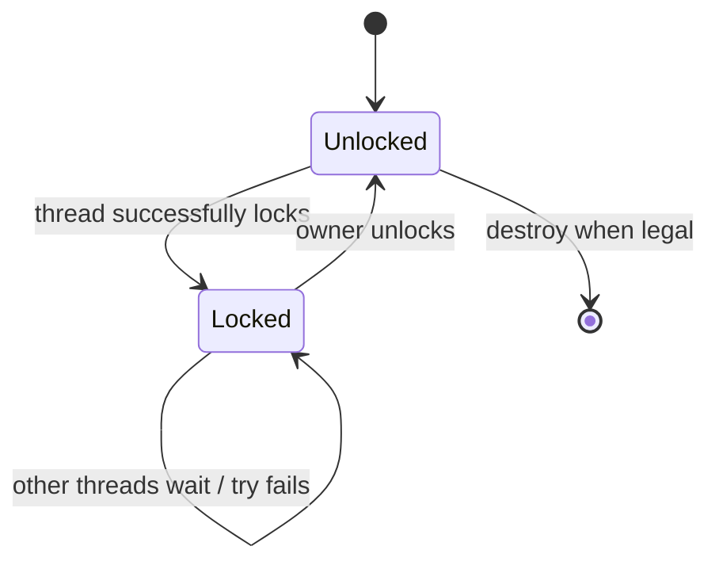
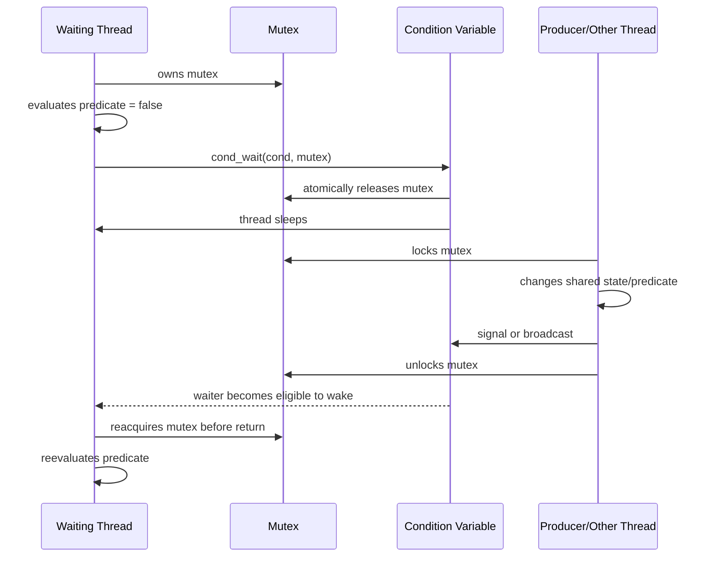
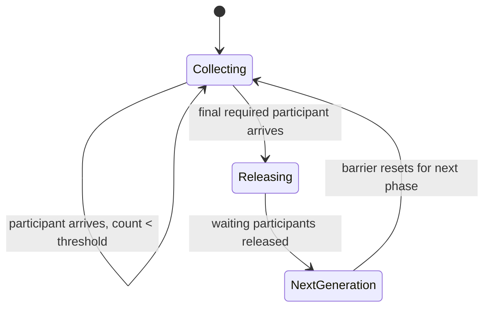
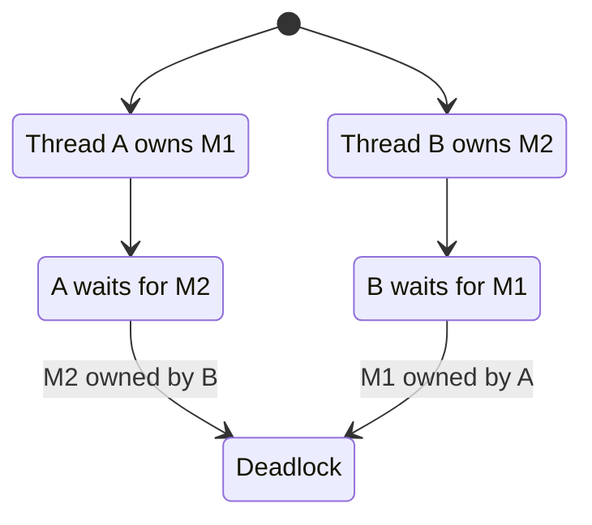

# Chủ đề 7 — Thread Synchronization trong Linux

> **Phạm vi:** POSIX thread synchronization fundamentals: race/atomicity, mutex, semaphore, condition variable, producer–consumer reasoning, barrier, deadlock, starvation và priority inversion ở mức nền tảng.
>
> Chương này chỉ trình bày **lý thuyết**. Không có lab, bài tập, chương trình mẫu hoàn chỉnh hoặc hướng dẫn thao tác thực hành.
>
> **Giới hạn chủ đề:** Không đi sâu vào robust mutex, rwlock, spinlock, futex internals, process-shared synchronization hoặc real-time locking protocols; IPC thuộc Topic 8.
>
> **Nguyên tắc bố cục:** `##` chỉ dành cho các khối kiến thức lớn; `###/####` dùng cho concept chi tiết. Các phần trùng hoặc thuộc topic khác đã được loại khỏi chapter này.
>
> **Điều hướng:** [← Chủ đề 6 — Multithreading](README-topic-06.md) · [Chủ đề 8 — IPC →](README-topic-08.md)

---

## Mục lục

- [1. Vì sao Thread Synchronization tồn tại?](#1-vì-sao-thread-synchronization-tồn-tại)
- [2. Race Condition, Data Race và Critical Section](#2-race-condition-data-race-và-critical-section)
- [3. Memory Synchronization và Visibility](#3-memory-synchronization-và-visibility)
- [4. Mutex — Mutual Exclusion](#4-mutex-mutual-exclusion)
- [5. Mutex Lifecycle và Lock Operations](#5-mutex-lifecycle-và-lock-operations)
- [6. Mutex Types](#6-mutex-types)
- [7. Condition Variable — Chờ trạng thái, không “giữ dữ liệu”](#7-condition-variable-chờ-trạng-thái-không-giữ-dữ-liệu)
- [8. Predicate, Spurious Wakeup và Lost Wakeup](#8-predicate-spurious-wakeup-và-lost-wakeup)
- [9. Signal, Broadcast và Timed Condition Wait](#9-signal-broadcast-và-timed-condition-wait)
- [10. Semaphore](#10-semaphore)
- [11. Mutex, Condition Variable và Semaphore khác nhau thế nào?](#11-mutex-condition-variable-và-semaphore-khác-nhau-thế-nào)
- [12. Producer–Consumer Model](#12-producerconsumer-model)
- [13. Barrier và Phase Synchronization](#13-barrier-và-phase-synchronization)
- [14. Deadlock](#14-deadlock)
- [15. Starvation và Livelock](#15-starvation-và-livelock)
- [16. Lock Ordering, Granularity và Contention](#16-lock-ordering-granularity-và-contention)
- [17. Priority Inversion và Priority Inheritance Overview](#17-priority-inversion-và-priority-inheritance-overview)
- [18. Error Model và Tư duy Debug Synchronization](#18-error-model-và-tư-duy-debug-synchronization)
- [19. Liên hệ với Embedded Linux](#19-liên-hệ-với-embedded-linux)
- [20. Tổng kết và Mental Model](#20-tổng-kết-và-mental-model)
- [21. Tài liệu tham khảo](#21-tài-liệu-tham-khảo)

---

## 1. Vì sao Thread Synchronization tồn tại?

Topic 6 đã xây mental model:

```text
Process
 |
 +--> Thread A
 +--> Thread B
 +--> Thread C
 |
 +--> shared:
        heap
        globals
        mappings
        file descriptors
        process state
```

Khả năng chia sẻ này rất mạnh.

Nhưng chính nó tạo ra vấn đề:

```text
Thread A
   |
   v
shared mutable state
   ^
   |
Thread B
```

Nếu A và B truy cập cùng mutable state mà không có protocol, kết quả có thể phụ thuộc vào:

```text
scheduler interleaving
CPU core timing
compiler transformations
memory visibility
operation atomicity
```

Do đó synchronization tồn tại để thiết lập:

```text
who may access
when they may access
what state must be true
what ordering must hold
when another thread may proceed
```

---

### 1.1 Synchronization không chỉ là “khóa biến”

Một cách hiểu quá hẹp:

> “Mutex dùng để khóa một biến.”

Thực tế synchronization bảo vệ **invariant** hoặc **protocol**.

Ví dụ conceptual state:

```text
queue_head
queue_tail
queue_size
buffer contents
```

Có thể cùng tạo thành một invariant:

```text
queue_size
must correspond to
number of valid elements between head and tail
```

Critical section phải bảo vệ toàn bộ state transition cần tính nhất quán, không chỉ một field riêng lẻ.

---

### 1.2 Ba câu hỏi cốt lõi của synchronization

Mọi synchronization design nên trả lời:

```text
1. Shared state nào cần consistency?
2. Thread nào được quyền thay đổi state đó?
3. Điều kiện nào cho phép thread tiếp tục?
```

Từ đó mới chọn primitive:

```text
mutex
condition variable
semaphore
barrier
```

---

### 1.3 Synchronization primitive không thay business-state model

Một mutex chỉ biết:

```text
locked / unlocked
owner
```

Nó không biết:

```text
queue empty?
buffer full?
device ready?
shutdown requested?
job completed?
```

Các điều kiện đó vẫn nằm trong shared application state.

Synchronization primitive chỉ tạo protocol an toàn để đọc/thay đổi state.

---

## 2. Race Condition, Data Race và Critical Section

### 2.1 Race condition

Race condition là khi correctness phụ thuộc vào relative timing/order giữa concurrent operations.

Concept:

```text
Thread A                 Thread B

observe state X
                         modify state X
act based on old state
```

Không phải mọi race condition đều là một single-variable “increment bug”.

Race có thể xảy ra ở level:

```text
resource lifetime
state machine
check-then-act
file descriptor ownership
queue protocol
shutdown sequence
```

---

### 2.2 Lost update

Classic conceptual operation:

```text
counter = counter + 1
```

có thể tương ứng:

```text
load
modify
store
```

Interleaving:

```text
Initial counter = 100

Thread A                  Thread B

load 100
                          load 100
compute 101
                          compute 101
store 101
                          store 101

Final = 101
```

Logically expected:

```text
102
```

One update was lost.

---

### 2.3 Data race

POSIX memory-synchronization model requires applications to restrict conflicting non-lock-free accesses to shared memory so that one thread does not read/modify a location while another might modify it unless proper synchronization applies.

At language level, C/C++ additionally define their own data-race rules.

Mental model:

```text
same memory location
      |
multiple concurrent accesses
      |
at least one write
      |
no valid synchronization
      |
      v
data race / undefined language-level behavior risk
```

Exact C/C++ memory-model details are outside Topic 7.

---

### 2.4 Logical race can exist even without a raw data race

Suppose accesses individually protected, but protocol is:

```text
lock
check state
unlock

... time passes ...

lock
act assuming old state
unlock
```

Another thread can change state between check and action.

No single access must necessarily be unsynchronized, yet algorithm can still be wrong.

This is a:

```text
logical race
```

or:

```text
check-then-act race
```

---

### 2.5 Critical section

A critical section is code/state transition that must not overlap incompatibly with another operation.

Mental model:

```text
Thread A
   |
lock
   |
   v
+----------------------+
|   CRITICAL SECTION   |
| shared-state update  |
+----------------------+
   |
unlock
```

Another thread:

```text
lock
  |
blocked until ownership available
```

---

### 2.6 Critical section should protect invariants

Correct question is not:

```text
"which variable needs a lock?"
```

but:

```text
"which invariant/state transition must be atomic with respect to other threads?"
```

This avoids the common error of locking individual fields while leaving multi-field consistency broken.

---

## 3. Memory Synchronization và Visibility

### 3.1 Mutual exclusion and memory visibility are related

Synchronization must do more than stop simultaneous entry.

Thread B needs to observe state written by Thread A in a properly synchronized way.

Concept:

```text
Thread A

lock
write shared data
unlock
        |
        | synchronization relation
        v
Thread B

lock
read shared data
unlock
```

POSIX explicitly defines memory synchronization effects for successful synchronization operations.

---

### 3.2 Why plain source-code order is insufficient as cross-thread contract

Inside one thread, code appears ordered:

```text
data = new_value
ready = true
```

But another thread reading shared state without synchronization cannot simply assume a portable cross-thread visibility contract from textual order alone.

Compiler and CPU memory models matter.

Therefore application requires synchronization primitives or atomics that establish defined ordering.

---

### 3.3 POSIX memory synchronization

POSIX.1-2024 identifies successful synchronization functions that synchronize memory with respect to other threads.

Relevant examples include:

```text
pthread_mutex_lock()
pthread_mutex_unlock()

pthread_cond_wait()
pthread_cond_signal()
pthread_cond_broadcast()

pthread_barrier_wait()

sem_wait()
sem_post()

pthread_create()
pthread_join()
```

with operation-specific semantics.

The lesson:

> A synchronization operation is both a scheduling/ownership mechanism and a memory-ordering boundary defined by the API contract.

---

### 3.4 Mutex acquire/release mental model

Conceptually:

```text
Thread A                     Thread B

modify protected data
       |
mutex unlock  ---------->  mutex lock
                               |
                               v
                         observe protected state
```

Do not reduce this to:

```text
"unlock just changes one Boolean from 1 to 0"
```

High-level primitive has stronger abstract semantics.

---

### 3.5 Condition-variable wait also synchronizes through mutex release/reacquire

`pthread_cond_wait()`:

```text
atomically releases associated mutex
waits
reacquires mutex before returning
```

The mutex release/reacquisition is part of memory synchronization.

This is why the condition-variable pattern is built around:

```text
predicate + mutex + condition variable
```

rather than condition variable alone.

---

## 4. Mutex — Mutual Exclusion

### 4.1 Mutex is an ownership-based synchronization primitive

`mutex` means:

```text
MUTual EXclusion
```

Core abstract states:

```text
Unlocked

Locked
  owner = one thread
```

Normal mutex cannot simultaneously be owned by two different threads.

---

### 4.2 Mutex state machine



Exact relock/non-owner behavior depends on mutex type.

---

### 4.3 Ownership matters

Semaphore can represent a count without a strict owner.

Mutex concept includes ownership:

```text
Thread A acquires mutex
      |
      v
Thread A owns mutex
      |
      v
Thread A unlocks
```

This ownership is what distinguishes mutex semantics from a simple counter and allows the implementation to reason about which thread currently owns the critical section.

---

### 4.4 Lock contention

If mutex is free:

```text
lock
  |
  v
acquire immediately
```

If mutex is held:

```text
lock
  |
  v
wait/block
  |
owner releases
  |
  v
eventually acquire
```

Exact scheduling order among waiters is governed by implementation/scheduling policy constraints, not a generic FIFO guarantee.

---

### 4.5 Mutex protects a protocol, not magically the memory object

Shared object has no intrinsic link to mutex unless application consistently follows the protocol.

Wrong design:

```text
Thread A uses mutex M to access object X

Thread B accesses X directly
```

Mutex M cannot prevent B's unsynchronized access.

Correctness requires all relevant participants to honor the same protection protocol.

---

## 5. Mutex Lifecycle và Lock Operations

### 5.1 Initialization

A mutex must be in valid initialized state before use.

Concept:

```text
uninitialized storage
      |
initialize
      |
      v
valid mutex object
```

A mutex can also be statically initialized where POSIX initializer is applicable.

---

### 5.2 `pthread_mutex_lock()`

Core semantics:

```text
if mutex available
   acquire

if held by another thread
   block until available
```

On successful normal acquisition:

```text
calling thread becomes owner
```

---

### 5.3 `pthread_mutex_trylock()`

Try-lock does not wait for normal contention.

Mental model:

```text
mutex free?
  /    \
yes     no
 |       |
acquire  return EBUSY
```

Try-lock is not “faster mutex”.

It changes:

```text
blocking semantics
```

---

### 5.4 Timed locking

POSIX provides timed/clock-aware mutex lock interfaces.

Concept:

```text
attempt lock
    |
    +--> acquired before deadline
    |
    +--> deadline reached
            |
            v
        timeout result
```

The chapter focuses on semantics, not clock API usage.

---

### 5.5 `pthread_mutex_unlock()`

Unlock releases mutex according to ownership/type semantics.

For normal ownership protocol:

```text
owner
  |
unlock
  |
  v
mutex available
```

Non-owner unlock can be:

```text
error
or undefined behavior
```

depending mutex type/attributes.

This is why mutex type matters.

---

### 5.6 Destruction

Mutex must not be destroyed while still:

```text
locked
in use
waited on
```

outside the API's valid lifecycle conditions.

General lifecycle rule:

```text
initialize
   ↓
use
   ↓
ensure no users/waiters
   ↓
destroy
```

Synchronization object lifetime is itself a synchronization problem.

---

### 5.7 Pthreads return model

Most Pthread mutex functions use:

```text
0
  success

error number
  failure/special condition
```

rather than the common system-call pattern:

```text
-1 + errno
```

Therefore the return value of each Pthreads synchronization call must be checked according to that API's contract.

---

## 6. Mutex Types

### 6.1 Why mutex type exists

Relocking a mutex already owned by current thread can mean different things depending on type.

POSIX standard mutex types include:

```text
PTHREAD_MUTEX_NORMAL
PTHREAD_MUTEX_ERRORCHECK
PTHREAD_MUTEX_RECURSIVE
PTHREAD_MUTEX_DEFAULT
```

---

### 6.2 `PTHREAD_MUTEX_NORMAL`

Concept:

```text
thread locks mutex
then same thread tries to lock again
```

For normal mutex:

```text
deadlock
```

is the defined relock behavior in POSIX mutex-type table.

Non-owner unlock behavior is undefined for non-robust normal mutex.

---

### 6.3 `PTHREAD_MUTEX_ERRORCHECK`

Designed to detect selected misuse.

Examples:

```text
same thread relocks own mutex
  -> error

non-owner unlock
  -> error
```

It can help detect programming mistakes, at possible implementation cost.

It is not a substitute for correct design.

---

### 6.4 `PTHREAD_MUTEX_RECURSIVE`

Same owner can acquire repeatedly.

Mutex maintains conceptual:

```text
lock count
```

Example:

```text
first lock
count = 1

second lock by same thread
count = 2

unlock
count = 1

unlock
count = 0 -> mutex released
```

Recursive mutex solves specific recursive ownership patterns.

It can also hide poorly structured locking if used indiscriminately.

---

### 6.5 `PTHREAD_MUTEX_DEFAULT`

Important nuance:

`PTHREAD_MUTEX_DEFAULT` should not simply be assumed identical to one particular named type in all edge cases.

POSIX defines implementation latitude for behaviors marked undefined in the mutex-type table.

Therefore portable reasoning should not depend on:

```text
"default behaves exactly like ERRORCHECK"
```

or another specific type.

---

## 7. Condition Variable — Chờ trạng thái, không “giữ dữ liệu”

### 7.1 What condition variable represents

Condition variable is a synchronization object that lets threads sleep until shared-state predicate may have changed.

It does not itself store application predicate.

Mental model:

```text
Shared data
   |
   +--> predicate:
        queue_not_empty?
        buffer_has_space?
        shutdown?
        state == READY?

Mutex protects shared data

Condition variable
   provides waiting/wakeup mechanism
```

---

### 7.2 Condition variable is paired with a mutex

Canonical conceptual trio:

```text
shared state
     +
mutex
     +
condition variable
```

The mutex protects:

```text
predicate and state transition
```

The condition variable enables:

```text
sleep until state may have changed
```

---

### 7.3 Why not just repeatedly check?

Busy loop:

```text
while condition false:
    keep checking
```

consumes CPU.

Condition wait enables:

```text
condition false
   |
   v
thread sleeps
   |
state changes
   |
notification
   |
   v
thread becomes runnable
```

---

### 7.4 Atomic unlock-and-wait

Core semantic:

```text
pthread_cond_wait()
```

atomically with respect to the synchronization relationship:

```text
release mutex
+
begin waiting
```

This closes the race window between:

```text
"condition false"
```

and:

```text
"go to sleep"
```

---

### 7.5 Condition wait sequence



This is the central mental model for condition variables.

---

## 8. Predicate, Spurious Wakeup và Lost Wakeup

### 8.1 The predicate belongs to shared data

POSIX explicitly describes a Boolean predicate associated with every condition wait.

Examples:

```text
queue_size > 0

buffer_space > 0

state == READY

shutdown_requested == true
```

The condition variable itself does not equal that predicate.

---

### 8.2 Wakeup does not mean predicate is true

POSIX permits:

```text
spurious wakeups
```

Therefore:

```text
cond_wait returns
```

does **not** mean:

```text
condition is definitely satisfied
```

Thread must reevaluate predicate.

---

### 8.3 Why predicate must be checked in a loop

Conceptual pattern:

```text
lock mutex

while predicate is false:
    wait

predicate is now true under mutex
perform protected transition

unlock mutex
```

The `while` concept is essential because:

```text
spurious wakeup
another waiter consumed resource first
state changed again before mutex reacquired
broadcast woke multiple threads
timeout races with state transition
```

can make predicate false on return.

---

### 8.4 Spurious wakeup is part of contract, not a bug to “filter away”

Application should not rely on:

```text
one signal = exactly one waiter returns with true predicate
```

Condition variable is a hint:

```text
"shared state may have changed; check it"
```

---

### 8.5 Lost wakeup — conceptual problem

Naive protocol:

```text
Thread A checks predicate false
Thread B changes state and signals
Thread A starts sleeping afterward
```

If check and wait are not coordinated, notification can occur before A actually sleeps.

Then A may sleep indefinitely despite state already being true.

This is the classic lost-wakeup race.

---

### 8.6 Mutex + atomic wait transition prevents the critical gap

Correct condition-variable protocol places predicate test under mutex.

`pthread_cond_wait()` releases mutex and enters wait atomically relative to signaler's mutex/condition operations.

Concept:

```text
waiter holds mutex
   |
predicate false
   |
cond_wait atomically:
 unlock + wait
```

Another thread cannot slip a protected state transition into an unsafe gap between:

```text
unlock
```

and:

```text
wait registration
```

under the defined condition-variable semantics.

---

## 9. Signal, Broadcast và Timed Condition Wait

### 9.1 `pthread_cond_signal()`

Conceptually wakes:

```text
at least one appropriate waiter
```

when waiters exist, according to condition-variable semantics.

Do not assume a portable deterministic waiter identity.

---

### 9.2 `pthread_cond_broadcast()`

Makes all current waiters eligible to wake.

Concept:

```text
condition variable
  |
  +--> waiter A
  +--> waiter B
  +--> waiter C

broadcast
  |
  v
A/B/C may all compete to reacquire mutex
```

After reacquiring mutex each waiter must:

```text
reevaluate predicate
```

---

### 9.3 Signal vs broadcast is an application-state decision

Use conceptual signal when:

```text
state transition can satisfy one waiter
```

Broadcast when:

```text
state change may allow many/all waiters to make progress
```

But exact best choice depends predicate and architecture.

---

### 9.4 Notification does not transfer mutex ownership directly

Signal/broadcast does not mean awakened waiter immediately runs inside protected section.

Waiter must:

```text
reacquire mutex
```

before `pthread_cond_wait()` returns.

Therefore:

```text
signal
   !=
handoff lock immediately to chosen waiter
```

---

### 9.5 Timed wait

Timed condition wait adds deadline.

Mental model:

```text
wait for:
 predicate may become true
 OR
 deadline expires
```

On timeout, the API still follows mutex reacquisition semantics before returning.

---

### 9.6 Timeout result still requires predicate reevaluation

POSIX rationale notes race between:

```text
timeout expiration
```

and:

```text
predicate state change
```

Therefore even timeout return does not always permit simplistic conclusion that predicate is false.

Correct design reevaluates application state.

---

### 9.7 Clock choice matters conceptually

Timed condition APIs can use clock attributes or explicit clock-aware interfaces.

Two important time sources:

```text
CLOCK_REALTIME
  can be affected by wall-clock changes

CLOCK_MONOTONIC
  progresses monotonically for elapsed-time style reasoning
```

Exact API use is outside this theory chapter, but timeout semantics depend on clock.

---

## 10. Semaphore

### 10.1 Semaphore is a counter-based synchronization primitive

POSIX semaphore model:

```text
integer value
never below zero
```

Core operations:

```text
wait
  decrement if value > 0
  otherwise block

post
  increment
  possibly wake waiter
```

---

### 10.2 Semaphore state model

```text
value = N
```

represents available count/tokens/resources.

Example abstraction:

```text
N free slots
N available buffers
N permits
N queued events/tokens
```

---

### 10.3 `sem_wait()` concept

```text
value > 0?
   /   \
 yes    no
 |       |
decrement block
 |        |
return   wait until post
```

Semaphore does not have mutex-style ownership.

---

### 10.4 `sem_post()` concept

```text
increment semaphore count
```

and if waiters exist, one or more implementation/scheduling effects may make waiting thread progress according to API semantics.

---

### 10.5 Binary semaphore is not automatically identical to mutex

If semaphore count is constrained conceptually to 0/1, it may look like a mutex.

But important differences remain:

```text
mutex:
  owner concept

semaphore:
  counter/tokens
  no ownership requirement in same sense
```

This matters for:

```text
priority inheritance
unlock/post discipline
resource ownership semantics
```

---

### 10.6 Semaphore as resource count

Example conceptual model:

```text
Pool contains 4 resources

semaphore value = 4

Thread A takes one -> 3
Thread B takes one -> 2
Thread C returns one -> 3
```

This is different from condition variable:

```text
predicate-based state waiting
```

---

## 11. Mutex, Condition Variable và Semaphore khác nhau thế nào?

### 11.1 Mutex

Primary abstraction:

```text
exclusive ownership
```

Question answered:

```text
"Who may enter this protected state transition now?"
```

---

### 11.2 Condition variable

Primary abstraction:

```text
wait until shared-state predicate may have changed
```

Question answered:

```text
"When should this thread sleep/wake to re-check state?"
```

Requires external shared state and usually mutex.

---

### 11.3 Semaphore

Primary abstraction:

```text
counted permits/resources/events
```

Question answered:

```text
"How many units are currently available?"
```

---

### 11.4 Comparison table

| Primitive | Core state | Ownership? | Typical meaning |
|---|---|---:|---|
| Mutex | locked/unlocked | Yes | exclusive critical section |
| Condition variable | wait queue/event relationship | No standalone ownership | wait for predicate |
| Semaphore | nonnegative count | No mutex-style owner | permits/resources/events |
| RW lock | readers or one writer | lock ownership semantics | read-heavy shared state |
| Barrier | arrival count/phase | No | all participants reach phase |

---

### 11.5 Primitive choice should follow state semantics

Do not select synchronization primitive by:

```text
"which API I remember"
```

Choose from model:

```text
exclusive ownership?
predicate wait?
resource count?
many readers?
phase rendezvous?
```

---

## 12. Producer–Consumer Model

### 12.1 Bài toán producer–consumer

Producer–consumer là một mô hình synchronization kinh điển trong đó một hoặc nhiều producer tạo dữ liệu/work item và một hoặc nhiều consumer lấy chúng từ shared buffer/queue.

```text
Producer(s)
    |
    v
+-----------------------+
| Shared bounded queue  |
+-----------------------+
    |
    v
Consumer(s)
```

Có hai loại state cần bảo vệ:

```text
queue invariant
  head / tail / size / payload

availability predicate
  not_empty
  not_full
```

### 12.2 Primitive nào làm nhiệm vụ gì?

Mental model chuẩn:

```text
mutex
  bảo vệ queue invariant và state transition

condition variable
  cho thread ngủ khi not_empty/not_full chưa đúng

semaphore
  có thể biểu diễn số item hoặc số slot khả dụng
```

Producer–consumer không phải tên của một primitive riêng; nó là một synchronization protocol được xây từ các primitive phù hợp.

### 12.3 Vì sao không busy-wait?

Nếu consumer liên tục kiểm tra:

```text
while queue_empty:
    keep checking
```

CPU bị tiêu tốn dù chưa có việc.

Condition variable hoặc semaphore cho phép:

```text
state unavailable
   ↓
thread sleeps
   ↓
state changes
   ↓
thread becomes eligible to continue
```

Đây là ví dụ tổng hợp cho race condition, mutex, predicate và notification.

## 13. Barrier và Phase Synchronization

### 13.1 Barrier answers a different question

Barrier does not protect one object like mutex.

It synchronizes **phases**:

```text
all participating threads must reach point P
before any continue into next phase
```

---

### 13.2 Barrier mental model

```text
Phase 1

Thread A ---------> barrier --\
Thread B -------> barrier -----+--> all arrived --> Phase 2
Thread C ------------> barrier/
```

Early arrivals wait.

Last required arrival releases the phase.

---

### 13.3 Barrier state machine



This is conceptual; exact implementation may use generation counters and other state.

---

### 13.4 `PTHREAD_BARRIER_SERIAL_THREAD`

POSIX `pthread_barrier_wait()` returns a special:

```text
PTHREAD_BARRIER_SERIAL_THREAD
```

to one unspecified participant after threshold is reached, while others receive zero.

This permits one participant to perform a serial phase if architecture needs it.

---

### 13.5 Barrier vs join

`pthread_join()` waits for:

```text
one target thread's termination
```

Barrier waits for:

```text
all configured participants to reach a synchronization phase
```

The threads continue after barrier.

---

### 13.6 Barrier risks

If one expected participant never arrives:

```text
all others can wait indefinitely
```

Therefore barrier protocols require stable participant-count/lifecycle design.

---

## 14. Deadlock

### 14.1 Deadlock definition

Deadlock is a state where participants wait for each other in a cycle and no one can make progress.

Classic:

```text
Thread A owns M1
Thread B owns M2

A waits for M2
B waits for M1
```

---

### 14.2 Wait-for graph

```text
Thread A
   |
 waits M2
   |
   v
Thread B
   |
 waits M1
   |
   v
Thread A
```

Cycle:

```text
A -> B -> A
```

means no thread can release the resource the other needs because both are blocked.

---

### 14.3 Mermaid deadlock model



---

### 14.4 Coffman conditions

Classic deadlock requires four conditions simultaneously:

```text
mutual exclusion
hold and wait
no preemption
circular wait
```

Breaking at least one can prevent that class of deadlock.

---

### 14.5 Self-deadlock

With normal mutex:

```text
Thread A locks M
Thread A attempts lock M again
```

can deadlock.

This is not a multi-thread cycle; same thread waits for resource only it can release.

---

### 14.6 Join deadlock

Synchronization deadlock is broader than mutexes.

Example:

```text
Thread A joins B
Thread B waits for A
```

No mutex is required for a cyclic wait.

---

### 14.7 Condition-variable deadlock

Possible if:

```text
waiter waits for predicate
but thread capable of making predicate true is permanently blocked
```

Again root issue is dependency cycle/progress failure.

---

## 15. Starvation và Livelock

### 15.1 Starvation

Thread is theoretically able to make progress but repeatedly loses access to needed resource.

Example:

```text
Thread W waits for write access
new readers repeatedly acquire
W never gets scheduled/acquires
```

Whether this can occur depends primitive/scheduler implementation and workload.

---

### 15.2 Starvation ≠ deadlock

Deadlock:

```text
system participants form dependency preventing progress
```

Starvation:

```text
some participants keep progressing
one participant is indefinitely denied progress
```

---

### 15.3 Livelock

Threads remain active and keep changing state, but no useful progress occurs.

Concept:

```text
A detects conflict -> backs off
B detects conflict -> backs off
A retries
B retries
repeat forever
```

CPU may be busy, unlike classic sleeping deadlock.

---

### 15.4 Livelock vs busy contention

Temporary retries are normal.

Livelock means protocol can remain in:

```text
continuous reaction without useful forward progress
```

---

### 15.5 Fairness is not automatic

Synchronization primitive may not promise:

```text
strict FIFO order
equal waiting time
no starvation
```

unless specification/scheduler policy states so.

Correctness should not rely on undocumented fairness.

---

## 16. Lock Ordering, Granularity và Contention

### 16.1 Global lock ordering

One major deadlock-prevention technique is a consistent lock hierarchy.

Instead of:

```text
A locks M1 then M2
B locks M2 then M1
```

define:

```text
always M1 before M2
```

Then circular wait is structurally prevented for those locks.

---

### 16.2 Lock-order graph

```text
Allowed:

M1 -> M2 -> M3

Forbidden:
M3 -> M1
```

Design should maintain acyclic dependency order.

---

### 16.3 Coarse-grained locking

One large mutex protects broad state.

Advantages:

```text
simple reasoning
fewer lock-order interactions
easier invariants
```

Costs:

```text
more contention
less concurrency
longer blocking
```

---

### 16.4 Fine-grained locking

Many locks protect subsets.

Advantages:

```text
more parallelism
less contention on unrelated data
```

Costs:

```text
more complexity
deadlock risk
ownership confusion
harder invariants
```

---

### 16.5 Lock granularity is a design tradeoff

Do not optimize prematurely.

A coarse correct design is often preferable initially to a fine-grained fragile design.

Refine only when:

```text
measured contention
latency requirements
throughput requirements
```

justify complexity.

---

### 16.6 Keep critical sections conceptually bounded

Long critical section means:

```text
others wait longer
```

Especially problematic if critical section contains:

```text
slow I/O
unbounded computation
blocking operation
callbacks into unknown code
```

Holding locks across uncertain operations increases deadlock and latency risk.

---

### 16.7 Do not assume “small source code” means short lock hold time

One line can call:

```text
allocator
filesystem
logging
driver/library path
```

and block.

Critical-section cost must be reasoned about in runtime behavior, not line count.

---

## 17. Priority Inversion và Priority Inheritance Overview

### 17.1 Priority inversion

Suppose:

```text
High-priority H needs mutex M
Low-priority L owns M
Medium-priority M does not need mutex
```

Timeline:

```text
L locks mutex
H becomes runnable and blocks on mutex
M runs and preempts L
L cannot run to release mutex
H waits indirectly behind M
```

This is priority inversion.

---

### 17.2 ASCII timeline

```text
Priority

High H:       waits for [mutex owned by L] -----------------
Medium M:              RUN RUN RUN RUN RUN
Low L:       owns Mtx       cannot run          eventually runs
```

H effectively suffers delay caused by medium thread even though M does not own needed resource.

---

### 17.3 Priority inheritance

With:

```text
PTHREAD_PRIO_INHERIT
```

mutex protocol can temporarily boost lock owner relative to waiting higher-priority thread needs.

Concept:

```text
H blocks on mutex held by L
      |
      v
L temporarily inherits higher priority
      |
L runs
      |
releases mutex
      |
      v
H proceeds
```

Purpose:

```text
bound/reduce inversion
```

not general performance acceleration.

---

## 18. Error Model và Tư duy Debug Synchronization

### 18.1 Start with symptom classification

Synchronization bug can appear as:

```text
wrong data
hang
high CPU
low throughput
latency spike
one thread never progresses
all threads stopped
rare crash
timing-sensitive behavior
```

Different symptoms suggest different classes.

---

### 18.2 Debug hierarchy

```text
1. Shared state invariant?
      ↓
2. All accesses use same synchronization protocol?
      ↓
3. Correct primitive?
      ↓
4. Correct ownership?
      ↓
5. Lock order consistent?
      ↓
6. Wait predicate correct?
      ↓
7. Predicate checked in loop?
      ↓
8. Notification state transition correct?
      ↓
9. Lifecycle/destruction race?
      ↓
10. Cancellation/signal/fork interaction?
      ↓
11. Starvation/priority inversion?
      ↓
12. Actual contention/performance issue?
```

---

### 18.3 Program hangs with no CPU

Likely classes:

```text
deadlock
condition waiter never receives useful state transition
barrier participant missing
join cycle
blocking resource wait
```

Need identify wait-for relationships.

---

### 18.4 Program consumes 100% CPU while “stuck”

Possible:

```text
busy-wait
livelock
retry loop
incorrect nonblocking synchronization loop
```

This differs from sleeping deadlock.

---

### 18.5 Data is intermittently wrong

Possible:

```text
data race
missing lock
wrong lock protecting same object
check-then-act race
object lifetime race
predicate accessed outside mutex protocol
```

---

### 18.6 Adding logging “fixes” bug

Classic concurrency clue.

Logging changes:

```text
timing
scheduler interleaving
I/O blocking
memory layout
lock contention
```

A disappearing bug under logging is not fixed.

It may strongly suggest:

```text
race
lifetime issue
undefined behavior
```

---

### 18.7 Condition wait wakes but state is false

This can be correct.

Reasons:

```text
spurious wakeup
broadcast
another waiter consumed resource
state changed again before mutex reacquired
```

Correct response is predicate reevaluation.

---

### 18.8 Condition wait never wakes despite state true

Investigate protocol:

```text
state changed without mutex?
notification omitted?
wrong condition variable?
predicate changed before waiter protocol?
waiter missed due incorrect check/sleep sequence?
```

With proper mutex+condition protocol, reason through state transition rather than assuming condition variable stores an event history.

---

### 18.9 `pthread_mutex_trylock()` returns `EBUSY`

This usually means:

```text
mutex currently unavailable
```

not necessarily system error.

Try-lock changes control-flow contract.

---

### 18.10 `EDEADLK`

Some mutex types/interfaces can detect selected self/deadlock conditions and return:

```text
EDEADLK
```

But do not rely on runtime deadlock detection as general deadlock prevention.

Many deadlocks remain undetected by primitive.

---

### 18.11 Pthread synchronization functions generally do not use `errno` as main return channel

As with Topic 6:

```text
0
  success

error number directly
  failure/special condition
```

Check each API contract.

POSIX mutex functions explicitly state they do not return `EINTR`.

---

### 18.12 Performance bug: correct but slow

Look for:

```text
one global lock serializes all work
long critical sections
lock held during I/O
too many threads
false sharing/cache contention
priority inversion
```

Correctness and performance are separate dimensions.

---

## 19. Liên hệ với Embedded Linux

### 19.1 Sensor pipeline

Example architecture:

```text
Sensor Thread
    |
 shared sample queue
    |
Processing Thread
    |
 output queue
    |
Network/Logger Thread
```

Synchronization responsibilities may include:

```text
queue ownership
buffer availability
new-data notification
shutdown state
```

---

### 19.2 Producer-consumer mental model

```text
Producer
   |
   v
+--------------------+
| Shared Queue       |
| protected state    |
+--------------------+
   |
   v
Consumer
```

Typical conceptual primitives:

```text
mutex
  protects queue invariant

condition variable
  wait for not-empty / not-full predicates
```

or another queue primitive designed internally with equivalent synchronization.

---

### 19.3 UART/device ownership

Multiple threads writing same UART/file descriptor may create application-level interleaving.

Even if system call itself is thread-safe at library/kernel level, protocol frames may not remain intact as application messages.

Therefore choose:

```text
single device-owner thread
```

or:

```text
explicit synchronization
```

around higher-level transaction boundaries.

---

### 19.4 I2C/SPI transaction integrity

Peripheral protocol often requires a multi-step logical transaction.

Correct critical section may be:

```text
select device
configure operation
perform transfer
update shared driver/application state
```

not simply:

```text
lock one register variable
```

The protected invariant should correspond to protocol transaction.

---

### 19.5 Logger design

If many worker threads log through shared state:

```text
mutex-protected logger
```

may serialize work.

Alternative architecture:

```text
workers
  |
message queue
  |
single logger thread
```

trades lock contention for ownership/message-passing design.

---

### 19.6 Shutdown

Graceful shutdown involves shared lifecycle state:

```text
RUNNING
   |
shutdown requested
   |
   v
STOPPING
   |
workers wake
   |
finish/abort work safely
   |
join
   |
   v
STOPPED
```

Condition variables or event mechanisms can wake sleepers when shutdown predicate changes.

---

### 19.7 Resource-constrained targets

Contention costs matter because embedded CPU may have:

```text
few cores
lower clock
limited memory
strict latency targets
```

Over-engineered fine-grained locking can be worse than simple coarse-grained design.

Correctness first, then measurement-driven refinement.

---

## 20. Tổng kết và Mental Model

```text
shared mutable state
        ↓
 concurrent access
        ↓
race / ordering problem
        ↓
synchronization protocol
   ├─ mutex      → exclusive ownership
   ├─ condition  → wait for predicate/state change
   ├─ semaphore  → counted availability
   └─ barrier    → phase rendezvous
```

Các điểm cần giữ:
- Critical section phải bảo vệ invariant/state transition, không chỉ một biến riêng lẻ.
- Mutex cung cấp ownership + mutual exclusion và memory-synchronization semantics.
- Condition variable luôn được hiểu cùng predicate và mutex; wakeup không chứng minh predicate đã true.
- Predicate phải được kiểm tra lại sau wakeup; spurious wakeup là một phần của contract.
- Semaphore là counter/permit abstraction, không có mutex-style owner semantics.
- Producer–consumer là bài toán điển hình: mutex bảo vệ queue invariant, condition/semaphore biểu diễn availability.
- Barrier đồng bộ các participant tại phase boundary.
- Deadlock cần được phòng bằng dependency/lock-order design; starvation và priority inversion là các liveness/scheduling problems khác.

---

## 21. Tài liệu tham khảo

- POSIX.1-2024 Threads and Memory Synchronization: https://pubs.opengroup.org/onlinepubs/9799919799/
- `pthread_mutex_lock(3p)`: https://man7.org/linux/man-pages/man3/pthread_mutex_lock.3p.html
- `pthread_cond_wait(3p)`: https://man7.org/linux/man-pages/man3/pthread_cond_wait.3p.html
- `sem_overview(7)`: https://man7.org/linux/man-pages/man7/sem_overview.7.html
- `pthread_barrier_wait(3p)`: https://man7.org/linux/man-pages/man3/pthread_barrier_wait.3p.html
- `pthreads(7)`: https://man7.org/linux/man-pages/man7/pthreads.7.html
- Bootlin PREEMPT_RT training (priority inversion context): https://bootlin.com/training/preempt-rt/
- The Linux Programming Interface: https://man7.org/tlpi/

---

> **Điều hướng:** [← Chủ đề 6 — Multithreading](README-topic-06.md) · [Chủ đề 8 — IPC →](README-topic-08.md)
