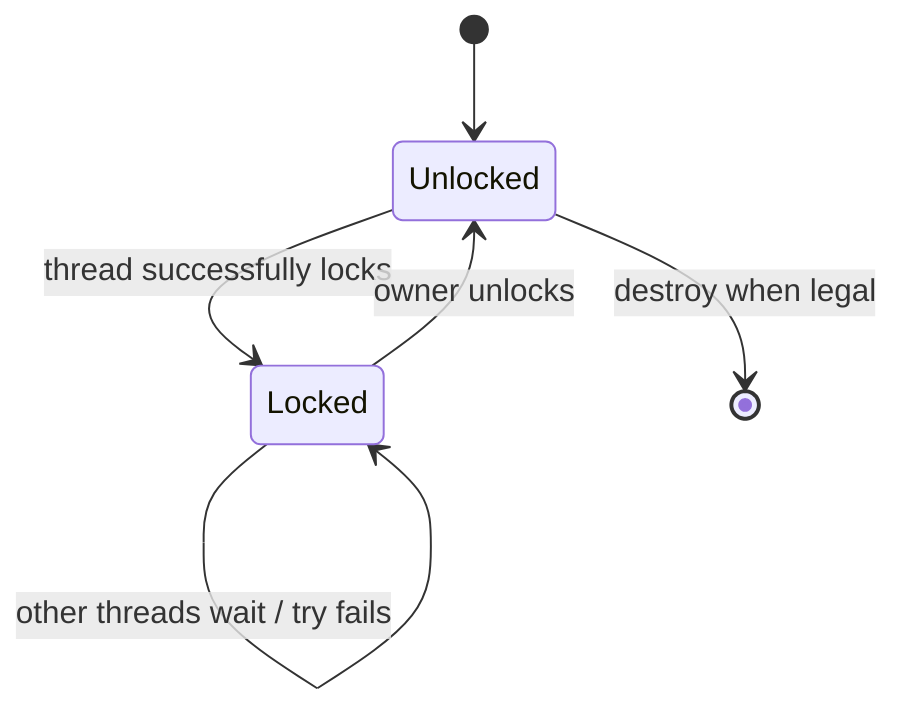
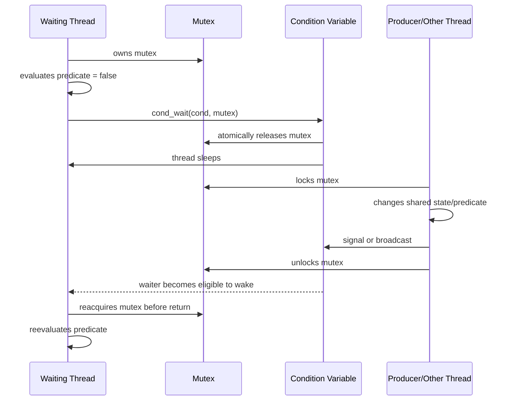
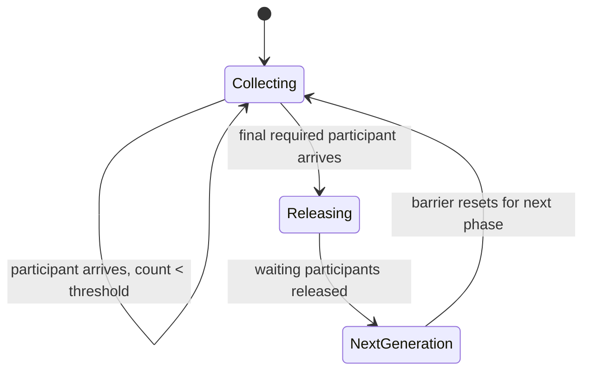
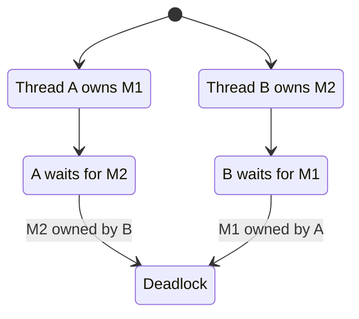

# Chủ đề 7 — Thread Synchronization trong Linux

> **Phạm vi:** POSIX/Linux thread synchronization fundamentals — race condition, data race, critical section, memory synchronization, mutex, condition variable, semaphore, read-write lock, barrier, one-time initialization, spin lock, robust/process-shared synchronization, deadlock, starvation, livelock, priority inversion và Linux futex ở mức implementation model.
>
> Chương này chỉ trình bày **lý thuyết**. Không có lab, bài tập, chương trình mẫu hoàn chỉnh, hướng dẫn biên dịch hoặc thao tác thực hành.
>
> Mục tiêu của chương là xây mental model:
>
> `shared mutable state → concurrent access → ordering problem → synchronization protocol`
>
> và:
>
> `mutex = ownership + mutual exclusion`
>
> `condition variable = wait for a predicate/state transition`
>
> `semaphore = counted availability/event resource`
>
> `rwlock = multiple readers or one writer`
>
> `barrier = phase rendezvous`
>
> Đồng thời phải hiểu rằng synchronization không chỉ ngăn hai thread “chạm vào cùng biến” mà còn tạo **memory synchronization/visibility ordering** giữa các thread theo POSIX memory synchronization rules.
>
> **Giới hạn chủ đề:** chương này chưa đi sâu vào C11/C++ atomic memory orders, lock-free algorithms, RCU, sequence lock, kernel spinlock internals, raw `futex()` programming, PREEMPT_RT implementation internals hay formal concurrency verification. Các nội dung này chỉ được nhắc để đặt đúng mental model.
>
> **Cấu trúc tài liệu:** `##` là các khối kiến thức lớn; chi tiết đi xuống `###/####` để giữ mục lục gọn, đồng nhất với Topic 01–06.
>
> **Điều hướng:** [← Chủ đề 6 — Multithreading](README-topic-06.md) · [Chủ đề 8 →](README-topic-08.md)

---

## Mục lục

- [1. Vì sao Thread Synchronization tồn tại?](#1-vì-sao-thread-synchronization-tồn-tại)
- [2. Race Condition, Data Race và Critical Section](#2-race-condition-data-race-và-critical-section)
- [3. Memory Synchronization và Visibility](#3-memory-synchronization-và-visibility)
- [4. Mutex — Mutual Exclusion](#4-mutex--mutual-exclusion)
- [5. Mutex Lifecycle và Lock Operations](#5-mutex-lifecycle-và-lock-operations)
- [6. Mutex Types và Attributes](#6-mutex-types-và-attributes)
- [7. Robust Mutex và Owner Failure](#7-robust-mutex-và-owner-failure)
- [8. Condition Variable — Chờ trạng thái, không “giữ dữ liệu”](#8-condition-variable--chờ-trạng-thái-không-giữ-dữ-liệu)
- [9. Predicate, Spurious Wakeup và Lost Wakeup](#9-predicate-spurious-wakeup-và-lost-wakeup)
- [10. Signal, Broadcast và Timed Condition Wait](#10-signal-broadcast-và-timed-condition-wait)
- [11. Semaphore](#11-semaphore)
- [12. Mutex, Condition Variable và Semaphore khác nhau thế nào?](#12-mutex-condition-variable-và-semaphore-khác-nhau-thế-nào)
- [13. Read-Write Lock](#13-read-write-lock)
- [14. Barrier và Phase Synchronization](#14-barrier-và-phase-synchronization)
- [15. One-time Initialization với `pthread_once()`](#15-one-time-initialization-với-pthread_once)
- [16. Spin Lock — Busy Waiting](#16-spin-lock--busy-waiting)
- [17. Deadlock](#17-deadlock)
- [18. Starvation và Livelock](#18-starvation-và-livelock)
- [19. Lock Ordering, Granularity và Contention](#19-lock-ordering-granularity-và-contention)
- [20. Priority Inversion và Real-time Mutex Protocols](#20-priority-inversion-và-real-time-mutex-protocols)
- [21. Process-shared Synchronization](#21-process-shared-synchronization)
- [22. Cancellation, Signals và Synchronization Objects](#22-cancellation-signals-và-synchronization-objects)
- [23. Linux Futex — Implementation Model](#23-linux-futex--implementation-model)
- [24. Error Model và Tư duy Debug Synchronization](#24-error-model-và-tư-duy-debug-synchronization)
- [25. Liên hệ với Embedded Linux](#25-liên-hệ-với-embedded-linux)
- [26. Tổng kết và Mental Model](#26-tổng-kết-và-mental-model)
- [27. Tài liệu tham khảo](#27-tài-liệu-tham-khảo)

---

## 1. Vì sao Thread Synchronization tồn tại?

Topic 6 đã xây mental model:

```text
Process
 |
 +--> Thread A
 +--> Thread B
 +--> Thread C
 |
 +--> shared:
        heap
        globals
        mappings
        file descriptors
        process state
```

Khả năng chia sẻ này rất mạnh.

Nhưng chính nó tạo ra vấn đề:

```text
Thread A
   |
   v
shared mutable state
   ^
   |
Thread B
```

Nếu A và B truy cập cùng mutable state mà không có protocol, kết quả có thể phụ thuộc vào:

```text
scheduler interleaving
CPU core timing
compiler transformations
memory visibility
operation atomicity
```

Do đó synchronization tồn tại để thiết lập:

```text
who may access
when they may access
what state must be true
what ordering must hold
when another thread may proceed
```

---

### 1.1 Synchronization không chỉ là “khóa biến”

Một cách hiểu quá hẹp:

> “Mutex dùng để khóa một biến.”

Thực tế synchronization bảo vệ **invariant** hoặc **protocol**.

Ví dụ conceptual state:

```text
queue_head
queue_tail
queue_size
buffer contents
```

Có thể cùng tạo thành một invariant:

```text
queue_size
must correspond to
number of valid elements between head and tail
```

Critical section phải bảo vệ toàn bộ state transition cần tính nhất quán, không chỉ một field riêng lẻ.

---

### 1.2 Ba câu hỏi cốt lõi của synchronization

Mọi synchronization design nên trả lời:

```text
1. Shared state nào cần consistency?
2. Thread nào được quyền thay đổi state đó?
3. Điều kiện nào cho phép thread tiếp tục?
```

Từ đó mới chọn primitive:

```text
mutex
condition variable
semaphore
rwlock
barrier
...
```

---

### 1.3 Synchronization primitive không thay business-state model

Một mutex chỉ biết:

```text
locked / unlocked
owner
```

Nó không biết:

```text
queue empty?
buffer full?
device ready?
shutdown requested?
job completed?
```

Các điều kiện đó vẫn nằm trong shared application state.

Synchronization primitive chỉ tạo protocol an toàn để đọc/thay đổi state.

---

## 2. Race Condition, Data Race và Critical Section

### 2.1 Race condition

Race condition là khi correctness phụ thuộc vào relative timing/order giữa concurrent operations.

Concept:

```text
Thread A                 Thread B

observe state X
                         modify state X
act based on old state
```

Không phải mọi race condition đều là một single-variable “increment bug”.

Race có thể xảy ra ở level:

```text
resource lifetime
state machine
check-then-act
file descriptor ownership
queue protocol
shutdown sequence
```

---

### 2.2 Lost update

Classic conceptual operation:

```text
counter = counter + 1
```

có thể tương ứng:

```text
load
modify
store
```

Interleaving:

```text
Initial counter = 100

Thread A                  Thread B

load 100
                          load 100
compute 101
                          compute 101
store 101
                          store 101

Final = 101
```

Logically expected:

```text
102
```

One update was lost.

---

### 2.3 Data race

POSIX memory-synchronization model requires applications to restrict conflicting non-lock-free accesses to shared memory so that one thread does not read/modify a location while another might modify it unless proper synchronization applies.

At language level, C/C++ additionally define their own data-race rules.

Mental model:

```text
same memory location
      |
multiple concurrent accesses
      |
at least one write
      |
no valid synchronization
      |
      v
data race / undefined language-level behavior risk
```

Exact C/C++ memory-model details are outside Topic 7.

---

### 2.4 Logical race can exist even without a raw data race

Suppose accesses individually protected, but protocol is:

```text
lock
check state
unlock

... time passes ...

lock
act assuming old state
unlock
```

Another thread can change state between check and action.

No single access must necessarily be unsynchronized, yet algorithm can still be wrong.

This is a:

```text
logical race
```

or:

```text
check-then-act race
```

---

### 2.5 Critical section

A critical section is code/state transition that must not overlap incompatibly with another operation.

Mental model:

```text
Thread A
   |
lock
   |
   v
+----------------------+
|   CRITICAL SECTION   |
| shared-state update  |
+----------------------+
   |
unlock
```

Another thread:

```text
lock
  |
blocked until ownership available
```

---

### 2.6 Critical section should protect invariants

Correct question is not:

```text
"which variable needs a lock?"
```

but:

```text
"which invariant/state transition must be atomic with respect to other threads?"
```

This avoids the common error of locking individual fields while leaving multi-field consistency broken.

---

## 3. Memory Synchronization và Visibility

### 3.1 Mutual exclusion and memory visibility are related

Synchronization must do more than stop simultaneous entry.

Thread B needs to observe state written by Thread A in a properly synchronized way.

Concept:

```text
Thread A

lock
write shared data
unlock
        |
        | synchronization relation
        v
Thread B

lock
read shared data
unlock
```

POSIX explicitly defines memory synchronization effects for successful synchronization operations.

---

### 3.2 Why plain source-code order is insufficient as cross-thread contract

Inside one thread, code appears ordered:

```text
data = new_value
ready = true
```

But another thread reading shared state without synchronization cannot simply assume a portable cross-thread visibility contract from textual order alone.

Compiler and CPU memory models matter.

Therefore application requires synchronization primitives or atomics that establish defined ordering.

---

### 3.3 POSIX memory synchronization

POSIX.1-2024 identifies successful synchronization functions that synchronize memory with respect to other threads.

Relevant examples include:

```text
pthread_mutex_lock()
pthread_mutex_unlock()

pthread_cond_wait()
pthread_cond_signal()
pthread_cond_broadcast()

pthread_rwlock_*()

pthread_barrier_wait()

sem_wait()
sem_post()

pthread_create()
pthread_join()

pthread_once()
```

with operation-specific semantics.

The lesson:

> A synchronization operation is both a scheduling/ownership mechanism and a memory-ordering boundary defined by the API contract.

---

### 3.4 Mutex acquire/release mental model

Conceptually:

```text
Thread A                     Thread B

modify protected data
       |
mutex unlock  ---------->  mutex lock
                               |
                               v
                         observe protected state
```

Do not reduce this to:

```text
"unlock just changes one Boolean from 1 to 0"
```

High-level primitive has stronger abstract semantics.

---

### 3.5 Condition-variable wait also synchronizes through mutex release/reacquire

`pthread_cond_wait()`:

```text
atomically releases associated mutex
waits
reacquires mutex before returning
```

The mutex release/reacquisition is part of memory synchronization.

This is why the condition-variable pattern is built around:

```text
predicate + mutex + condition variable
```

rather than condition variable alone.

---

## 4. Mutex — Mutual Exclusion

### 4.1 Mutex is an ownership-based synchronization primitive

`mutex` means:

```text
MUTual EXclusion
```

Core abstract states:

```text
Unlocked

Locked
  owner = one thread
```

Normal mutex cannot simultaneously be owned by two different threads.

---

### 4.2 Mutex state machine



Exact relock/non-owner behavior depends on mutex type and robustness attributes.

---

### 4.3 Ownership matters

Semaphore can represent a count without a strict owner.

Mutex concept includes ownership:

```text
Thread A acquires mutex
      |
      v
Thread A owns mutex
      |
      v
Thread A unlocks
```

This ownership enables semantics such as:

```text
recursive locking
error checking
robust owner-death detection
priority inheritance protocols
```

---

### 4.4 Lock contention

If mutex is free:

```text
lock
  |
  v
acquire immediately
```

If mutex is held:

```text
lock
  |
  v
wait/block
  |
owner releases
  |
  v
eventually acquire
```

Exact scheduling order among waiters is governed by implementation/scheduling policy constraints, not a generic FIFO guarantee.

---

### 4.5 Mutex protects a protocol, not magically the memory object

Shared object has no intrinsic link to mutex unless application consistently follows the protocol.

Wrong design:

```text
Thread A uses mutex M to access object X

Thread B accesses X directly
```

Mutex M cannot prevent B's unsynchronized access.

Correctness requires all relevant participants to honor the same protection protocol.

---

## 5. Mutex Lifecycle và Lock Operations

### 5.1 Initialization

A mutex must be in valid initialized state before use.

Concept:

```text
uninitialized storage
      |
initialize
      |
      v
valid mutex object
```

A mutex can also be statically initialized where POSIX initializer is applicable.

---

### 5.2 `pthread_mutex_lock()`

Core semantics:

```text
if mutex available
   acquire

if held by another thread
   block until available
```

On successful normal acquisition:

```text
calling thread becomes owner
```

Robust mutex has additional successful-but-recovery-needed `EOWNERDEAD` semantics discussed later.

---

### 5.3 `pthread_mutex_trylock()`

Try-lock does not wait for normal contention.

Mental model:

```text
mutex free?
  /    \
yes     no
 |       |
acquire  return EBUSY
```

Try-lock is not “faster mutex”.

It changes:

```text
blocking semantics
```

---

### 5.4 Timed locking

POSIX provides timed/clock-aware mutex lock interfaces.

Concept:

```text
attempt lock
    |
    +--> acquired before deadline
    |
    +--> deadline reached
            |
            v
        timeout result
```

The chapter focuses on semantics, not clock API usage.

---

### 5.5 `pthread_mutex_unlock()`

Unlock releases mutex according to ownership/type semantics.

For normal ownership protocol:

```text
owner
  |
unlock
  |
  v
mutex available
```

Non-owner unlock can be:

```text
error
or undefined behavior
```

depending mutex type/attributes.

This is why mutex type matters.

---

### 5.6 Destruction

Mutex must not be destroyed while still:

```text
locked
in use
waited on
```

outside the API's valid lifecycle conditions.

General lifecycle rule:

```text
initialize
   ↓
use
   ↓
ensure no users/waiters
   ↓
destroy
```

Synchronization object lifetime is itself a synchronization problem.

---

### 5.7 Pthreads return model

Most Pthread mutex functions use:

```text
0
  success

error number
  failure/special condition
```

rather than:

```text
-1 + errno
```

Robust mutex makes this especially important because:

```text
EOWNERDEAD
```

means:

```text
mutex was acquired
but protected state requires recovery
```

not simply “nothing happened”.

---

## 6. Mutex Types và Attributes

### 6.1 Why mutex type exists

Relocking a mutex already owned by current thread can mean different things depending on type.

POSIX standard mutex types include:

```text
PTHREAD_MUTEX_NORMAL
PTHREAD_MUTEX_ERRORCHECK
PTHREAD_MUTEX_RECURSIVE
PTHREAD_MUTEX_DEFAULT
```

---

### 6.2 `PTHREAD_MUTEX_NORMAL`

Concept:

```text
thread locks mutex
then same thread tries to lock again
```

For normal mutex:

```text
deadlock
```

is the defined relock behavior in POSIX mutex-type table.

Non-owner unlock behavior is undefined for non-robust normal mutex.

---

### 6.3 `PTHREAD_MUTEX_ERRORCHECK`

Designed to detect selected misuse.

Examples:

```text
same thread relocks own mutex
  -> error

non-owner unlock
  -> error
```

It can help detect programming mistakes, at possible implementation cost.

It is not a substitute for correct design.

---

### 6.4 `PTHREAD_MUTEX_RECURSIVE`

Same owner can acquire repeatedly.

Mutex maintains conceptual:

```text
lock count
```

Example:

```text
first lock
count = 1

second lock by same thread
count = 2

unlock
count = 1

unlock
count = 0 -> mutex released
```

Recursive mutex solves specific recursive ownership patterns.

It can also hide poorly structured locking if used indiscriminately.

---

### 6.5 `PTHREAD_MUTEX_DEFAULT`

Important nuance:

`PTHREAD_MUTEX_DEFAULT` should not simply be assumed identical to one particular named type in all edge cases.

POSIX defines implementation latitude for behaviors marked undefined in the mutex-type table.

Therefore portable reasoning should not depend on:

```text
"default behaves exactly like ERRORCHECK"
```

or another specific type.

---

### 6.6 Mutex attributes

`pthread_mutexattr_t` can configure properties such as:

```text
type
process-shared state
robustness
protocol
priority ceiling
```

depending supported POSIX options.

Attribute object is:

```text
configuration
```

not the mutex itself.

---

### 6.7 `PTHREAD_PROCESS_PRIVATE`

Synchronization object is intended for threads within one process.

This is common default for mutexes/condition variables/rwlocks.

---

### 6.8 `PTHREAD_PROCESS_SHARED`

When synchronization object lives in appropriate shared memory and is configured process-shared, it can synchronize threads in different processes.

This is discussed in Section 21.

---

## 7. Robust Mutex và Owner Failure

### 7.1 The owner-death problem

Normal mutex:

```text
Thread A locks mutex
      |
Thread A terminates unexpectedly
      |
mutex remains locked / protected state may be inconsistent
```

A waiter may block forever with a stalled mutex.

---

### 7.2 Robust mutex concept

With:

```text
PTHREAD_MUTEX_ROBUST
```

next thread trying to lock after owner death can acquire mutex and receive:

```text
EOWNERDEAD
```

Mental model:

```text
Owner dies while holding robust mutex
       |
       v
protected state = potentially inconsistent
       |
next locker
       |
       +--> acquires mutex
       +--> receives EOWNERDEAD
```

This provides a **recovery opportunity**, not automatic recovery.

---

### 7.3 `EOWNERDEAD` means lock acquired

This is one of the most important robust-mutex nuances.

Do not interpret:

```text
nonzero return
```

as simply:

```text
mutex not acquired
```

For `EOWNERDEAD`:

```text
caller owns mutex
+
state requires consistency recovery
```

---

### 7.4 Consistency recovery

New owner must repair protected state and then mark it consistent using the relevant robust-mutex consistency interface.

Mental model:

```text
EOWNERDEAD
   |
   v
caller owns mutex
   |
validate / repair protected invariant
   |
mark consistent
   |
unlock
```

---

### 7.5 `ENOTRECOVERABLE`

If new owner unlocks robust mutex without making inconsistent state consistent, mutex can become permanently non-recoverable.

Future lock attempts can return:

```text
ENOTRECOVERABLE
```

The only legal path may then be destruction/reinitialization under proper lifecycle control.

---

### 7.6 Robust mutex is not crash-proof data storage

Robust mutex only gives detection/recovery protocol for owner death.

It does not guarantee:

```text
protected data is automatically transactionally restored
persistent storage integrity
rollback
application invariant repair
```

Application must define recovery logic.

---

## 8. Condition Variable — Chờ trạng thái, không “giữ dữ liệu”

### 8.1 What condition variable represents

Condition variable is a synchronization object that lets threads sleep until shared-state predicate may have changed.

It does not itself store application predicate.

Mental model:

```text
Shared data
   |
   +--> predicate:
        queue_not_empty?
        buffer_has_space?
        shutdown?
        state == READY?

Mutex protects shared data

Condition variable
   provides waiting/wakeup mechanism
```

---

### 8.2 Condition variable is paired with a mutex

Canonical conceptual trio:

```text
shared state
     +
mutex
     +
condition variable
```

The mutex protects:

```text
predicate and state transition
```

The condition variable enables:

```text
sleep until state may have changed
```

---

### 8.3 Why not just repeatedly check?

Busy loop:

```text
while condition false:
    keep checking
```

consumes CPU.

Condition wait enables:

```text
condition false
   |
   v
thread sleeps
   |
state changes
   |
notification
   |
   v
thread becomes runnable
```

---

### 8.4 Atomic unlock-and-wait

Core semantic:

```text
pthread_cond_wait()
```

atomically with respect to the synchronization relationship:

```text
release mutex
+
begin waiting
```

This closes the race window between:

```text
"condition false"
```

and:

```text
"go to sleep"
```

---

### 8.5 Condition wait sequence



This is the central mental model for condition variables.

---

## 9. Predicate, Spurious Wakeup và Lost Wakeup

### 9.1 The predicate belongs to shared data

POSIX explicitly describes a Boolean predicate associated with every condition wait.

Examples:

```text
queue_size > 0

buffer_space > 0

state == READY

shutdown_requested == true
```

The condition variable itself does not equal that predicate.

---

### 9.2 Wakeup does not mean predicate is true

POSIX permits:

```text
spurious wakeups
```

Therefore:

```text
cond_wait returns
```

does **not** mean:

```text
condition is definitely satisfied
```

Thread must reevaluate predicate.

---

### 9.3 Why predicate must be checked in a loop

Conceptual pattern:

```text
lock mutex

while predicate is false:
    wait

predicate is now true under mutex
perform protected transition

unlock mutex
```

The `while` concept is essential because:

```text
spurious wakeup
another waiter consumed resource first
state changed again before mutex reacquired
broadcast woke multiple threads
timeout races with state transition
```

can make predicate false on return.

---

### 9.4 Spurious wakeup is part of contract, not a bug to “filter away”

Application should not rely on:

```text
one signal = exactly one waiter returns with true predicate
```

Condition variable is a hint:

```text
"shared state may have changed; check it"
```

---

### 9.5 Lost wakeup — conceptual problem

Naive protocol:

```text
Thread A checks predicate false
Thread B changes state and signals
Thread A starts sleeping afterward
```

If check and wait are not coordinated, notification can occur before A actually sleeps.

Then A may sleep indefinitely despite state already being true.

This is the classic lost-wakeup race.

---

### 9.6 Mutex + atomic wait transition prevents the critical gap

Correct condition-variable protocol places predicate test under mutex.

`pthread_cond_wait()` releases mutex and enters wait atomically relative to signaler's mutex/condition operations.

Concept:

```text
waiter holds mutex
   |
predicate false
   |
cond_wait atomically:
 unlock + wait
```

Another thread cannot slip a protected state transition into an unsafe gap between:

```text
unlock
```

and:

```text
wait registration
```

under the defined condition-variable semantics.

---

## 10. Signal, Broadcast và Timed Condition Wait

### 10.1 `pthread_cond_signal()`

Conceptually wakes:

```text
at least one appropriate waiter
```

when waiters exist, according to condition-variable semantics.

Do not assume a portable deterministic waiter identity.

---

### 10.2 `pthread_cond_broadcast()`

Makes all current waiters eligible to wake.

Concept:

```text
condition variable
  |
  +--> waiter A
  +--> waiter B
  +--> waiter C

broadcast
  |
  v
A/B/C may all compete to reacquire mutex
```

After reacquiring mutex each waiter must:

```text
reevaluate predicate
```

---

### 10.3 Signal vs broadcast is an application-state decision

Use conceptual signal when:

```text
state transition can satisfy one waiter
```

Broadcast when:

```text
state change may allow many/all waiters to make progress
```

But exact best choice depends predicate and architecture.

---

### 10.4 Notification does not transfer mutex ownership directly

Signal/broadcast does not mean awakened waiter immediately runs inside protected section.

Waiter must:

```text
reacquire mutex
```

before `pthread_cond_wait()` returns.

Therefore:

```text
signal
   !=
handoff lock immediately to chosen waiter
```

---

### 10.5 Timed wait

Timed condition wait adds deadline.

Mental model:

```text
wait for:
 predicate may become true
 OR
 deadline expires
```

On timeout, the API still follows mutex reacquisition semantics before returning.

---

### 10.6 Timeout result still requires predicate reevaluation

POSIX rationale notes race between:

```text
timeout expiration
```

and:

```text
predicate state change
```

Therefore even timeout return does not always permit simplistic conclusion that predicate is false.

Correct design reevaluates application state.

---

### 10.7 Clock choice matters conceptually

Timed condition APIs can use clock attributes or explicit clock-aware interfaces.

Two important time sources:

```text
CLOCK_REALTIME
  can be affected by wall-clock changes

CLOCK_MONOTONIC
  progresses monotonically for elapsed-time style reasoning
```

Exact API use is outside this theory chapter, but timeout semantics depend on clock.

---

## 11. Semaphore

### 11.1 Semaphore is a counter-based synchronization primitive

POSIX semaphore model:

```text
integer value
never below zero
```

Core operations:

```text
wait
  decrement if value > 0
  otherwise block

post
  increment
  possibly wake waiter
```

---

### 11.2 Semaphore state model

```text
value = N
```

represents available count/tokens/resources.

Example abstraction:

```text
N free slots
N available buffers
N permits
N queued events/tokens
```

---

### 11.3 `sem_wait()` concept

```text
value > 0?
   /   \
 yes    no
 |       |
decrement block
 |        |
return   wait until post
```

Semaphore does not have mutex-style ownership.

---

### 11.4 `sem_post()` concept

```text
increment semaphore count
```

and if waiters exist, one or more implementation/scheduling effects may make waiting thread progress according to API semantics.

---

### 11.5 Binary semaphore is not automatically identical to mutex

If semaphore count is constrained conceptually to 0/1, it may look like a mutex.

But important differences remain:

```text
mutex:
  owner concept

semaphore:
  counter/tokens
  no ownership requirement in same sense
```

This matters for:

```text
priority inheritance
unlock/post discipline
resource ownership semantics
```

---

### 11.6 Named vs unnamed POSIX semaphores

POSIX semaphores come in:

```text
named
unnamed
```

Unnamed semaphore can be:

```text
thread-shared within one process
```

or:

```text
process-shared in appropriate shared memory
```

depending initialization.

---

### 11.7 Semaphore as resource count

Example conceptual model:

```text
Pool contains 4 resources

semaphore value = 4

Thread A takes one -> 3
Thread B takes one -> 2
Thread C returns one -> 3
```

This is different from condition variable:

```text
predicate-based state waiting
```

---

## 12. Mutex, Condition Variable và Semaphore khác nhau thế nào?

### 12.1 Mutex

Primary abstraction:

```text
exclusive ownership
```

Question answered:

```text
"Who may enter this protected state transition now?"
```

---

### 12.2 Condition variable

Primary abstraction:

```text
wait until shared-state predicate may have changed
```

Question answered:

```text
"When should this thread sleep/wake to re-check state?"
```

Requires external shared state and usually mutex.

---

### 12.3 Semaphore

Primary abstraction:

```text
counted permits/resources/events
```

Question answered:

```text
"How many units are currently available?"
```

---

### 12.4 Comparison table

| Primitive | Core state | Ownership? | Typical meaning |
|---|---|---:|---|
| Mutex | locked/unlocked | Yes | exclusive critical section |
| Condition variable | wait queue/event relationship | No standalone ownership | wait for predicate |
| Semaphore | nonnegative count | No mutex-style owner | permits/resources/events |
| RW lock | readers or one writer | lock ownership semantics | read-heavy shared state |
| Barrier | arrival count/phase | No | all participants reach phase |

---

### 12.5 Primitive choice should follow state semantics

Do not select synchronization primitive by:

```text
"which API I remember"
```

Choose from model:

```text
exclusive ownership?
predicate wait?
resource count?
many readers?
phase rendezvous?
```

---

## 13. Read-Write Lock

### 13.1 Motivation

Some data structures are:

```text
read frequently
write rarely
```

A normal mutex allows:

```text
only one thread
```

even when multiple threads only read.

RW lock allows:

```text
multiple readers simultaneously
or
one exclusive writer
```

---

### 13.2 RW lock state model

```text
UNLOCKED

READ-LOCKED:
  one or more readers
  no writer

WRITE-LOCKED:
  exactly one writer
  no readers
```

ASCII:

```text
          +--------------------+
          |     Unlocked       |
          +----------+---------+
                     |
          +----------+----------+
          |                     |
        read                  write
          |                     |
          v                     v
+------------------+   +------------------+
| Reader(s) active |   | Writer active    |
| R1 R2 R3 ...     |   | W1 only          |
+------------------+   +------------------+
```

---

### 13.3 Read lock

Read lock may succeed if no conflicting writer condition prevents it according to POSIX scheduling/implementation rules.

Multiple threads can hold read locks concurrently.

---

### 13.4 Write lock

Writer requires exclusive access.

It cannot coexist with:

```text
any reader
another writer
```

---

### 13.5 RW lock is not automatically faster than mutex

RW lock has additional bookkeeping and contention complexity.

It may help when:

```text
read sections are substantial
writes are relatively rare
many readers would otherwise serialize
```

For tiny critical sections or write-heavy workloads, normal mutex may be simpler/faster.

---

### 13.6 Writer starvation and preference nuances

If readers continually arrive, writer fairness matters.

POSIX scheduling rules constrain some cases, while behavior may be implementation-defined in others when writers are waiting.

Therefore portable application should not build correctness on undocumented:

```text
reader preference
writer preference
strict FIFO fairness
```

---

### 13.7 Recursive read locking nuance

POSIX allows a thread to hold multiple read locks on same rwlock, requiring matching unlock operations.

This does not imply arbitrary upgrade from:

```text
read lock
```

to:

```text
write lock
```

is safe or supported.

---

### 13.8 Lock upgrade/downgrade is not a generic portable atomic primitive

Naive upgrade:

```text
hold read lock
then request write lock
```

can deadlock depending semantics because writer requires all readers gone, including potentially caller's own read lock.

Portable designs should not assume atomic upgrade unless explicitly supported by another abstraction.

---

## 14. Barrier và Phase Synchronization

### 14.1 Barrier answers a different question

Barrier does not protect one object like mutex.

It synchronizes **phases**:

```text
all participating threads must reach point P
before any continue into next phase
```

---

### 14.2 Barrier mental model

```text
Phase 1

Thread A ---------> barrier --\
Thread B -------> barrier -----+--> all arrived --> Phase 2
Thread C ------------> barrier/
```

Early arrivals wait.

Last required arrival releases the phase.

---

### 14.3 Barrier state machine



This is conceptual; exact implementation may use generation counters and other state.

---

### 14.4 `PTHREAD_BARRIER_SERIAL_THREAD`

POSIX `pthread_barrier_wait()` returns a special:

```text
PTHREAD_BARRIER_SERIAL_THREAD
```

to one unspecified participant after threshold is reached, while others receive zero.

This permits one participant to perform a serial phase if architecture needs it.

---

### 14.5 Barrier vs join

`pthread_join()` waits for:

```text
one target thread's termination
```

Barrier waits for:

```text
all configured participants to reach a synchronization phase
```

The threads continue after barrier.

---

### 14.6 Barrier risks

If one expected participant never arrives:

```text
all others can wait indefinitely
```

Therefore barrier protocols require stable participant-count/lifecycle design.

---

## 15. One-time Initialization với `pthread_once()`

### 15.1 The initialization race

Multiple threads can simultaneously discover:

```text
"global subsystem is not initialized"
```

Naive:

```text
if not_initialized:
    initialize()
```

can execute initialization multiple times.

---

### 15.2 `pthread_once()` abstraction

Concept:

```text
many threads
   |
pthread_once(control, init)
   |
   +--> exactly one successful initialization execution
   |
   +--> others synchronize with completed initialization
```

This is useful for:

```text
library global state
singleton-style immutable configuration
lazy subsystem setup
```

---

### 15.3 `pthread_once()` is not just a Boolean flag

It provides synchronization semantics.

It solves:

```text
exactly-once initialization
+
memory synchronization for initialized state
```

according to POSIX rules.

---

### 15.4 Initialization routine constraints

The initialization routine should establish valid state before other once callers proceed.

If initialization contains cancellation or abnormal control behavior, POSIX defines nuanced semantics.

The important mental rule:

> `pthread_once()` is a synchronization primitive for one-time initialization, not merely a convenience wrapper around `if`.

---

## 16. Spin Lock — Busy Waiting

### 16.1 Blocking lock vs spinning

Mutex under contention can cause waiter to sleep/block.

Spin lock instead repeatedly checks lock state while consuming CPU:

```text
while lock unavailable:
    keep spinning
```

---

### 16.2 Spin mental model

```text
Thread B

try lock
  |
busy loop
  |
busy loop
  |
busy loop
  |
owner releases
  |
acquire
```

CPU remains active.

---

### 16.3 When spinning can theoretically make sense

If expected wait is extremely short and sleeping/wakeup overhead would dominate, spinning can be useful in suitable low-level environments.

But user-space application conditions vary.

---

### 16.4 Why spin lock can be harmful

If lock holder cannot run because waiter consumes the only available CPU/core context or if critical section is long:

```text
spinning wastes CPU
```

On single-core or heavily oversubscribed systems, spin-based waiting can be especially poor.

---

### 16.5 Pthread spin locks

POSIX defines:

```text
pthread_spin_*
```

interfaces on systems that support them.

They are specialized primitives.

Default application-level synchronization should not automatically choose spinlocks just because they sound “faster”.

---

## 17. Deadlock

### 17.1 Deadlock definition

Deadlock is a state where participants wait for each other in a cycle and no one can make progress.

Classic:

```text
Thread A owns M1
Thread B owns M2

A waits for M2
B waits for M1
```

---

### 17.2 Wait-for graph

```text
Thread A
   |
 waits M2
   |
   v
Thread B
   |
 waits M1
   |
   v
Thread A
```

Cycle:

```text
A -> B -> A
```

means no thread can release the resource the other needs because both are blocked.

---

### 17.3 Mermaid deadlock model



---

### 17.4 Coffman conditions

Classic deadlock requires four conditions simultaneously:

```text
mutual exclusion
hold and wait
no preemption
circular wait
```

Breaking at least one can prevent that class of deadlock.

---

### 17.5 Self-deadlock

With normal mutex:

```text
Thread A locks M
Thread A attempts lock M again
```

can deadlock.

This is not a multi-thread cycle; same thread waits for resource only it can release.

---

### 17.6 Join deadlock

Synchronization deadlock is broader than mutexes.

Example:

```text
Thread A joins B
Thread B waits for A
```

No mutex is required for a cyclic wait.

---

### 17.7 Condition-variable deadlock

Possible if:

```text
waiter waits for predicate
but thread capable of making predicate true is permanently blocked
```

Again root issue is dependency cycle/progress failure.

---

## 18. Starvation và Livelock

### 18.1 Starvation

Thread is theoretically able to make progress but repeatedly loses access to needed resource.

Example:

```text
Thread W waits for write access
new readers repeatedly acquire
W never gets scheduled/acquires
```

Whether this can occur depends primitive/scheduler implementation and workload.

---

### 18.2 Starvation ≠ deadlock

Deadlock:

```text
system participants form dependency preventing progress
```

Starvation:

```text
some participants keep progressing
one participant is indefinitely denied progress
```

---

### 18.3 Livelock

Threads remain active and keep changing state, but no useful progress occurs.

Concept:

```text
A detects conflict -> backs off
B detects conflict -> backs off
A retries
B retries
repeat forever
```

CPU may be busy, unlike classic sleeping deadlock.

---

### 18.4 Livelock vs busy contention

Temporary retries are normal.

Livelock means protocol can remain in:

```text
continuous reaction without useful forward progress
```

---

### 18.5 Fairness is not automatic

Synchronization primitive may not promise:

```text
strict FIFO order
equal waiting time
no starvation
```

unless specification/scheduler policy states so.

Correctness should not rely on undocumented fairness.

---

## 19. Lock Ordering, Granularity và Contention

### 19.1 Global lock ordering

One major deadlock-prevention technique is a consistent lock hierarchy.

Instead of:

```text
A locks M1 then M2
B locks M2 then M1
```

define:

```text
always M1 before M2
```

Then circular wait is structurally prevented for those locks.

---

### 19.2 Lock-order graph

```text
Allowed:

M1 -> M2 -> M3

Forbidden:
M3 -> M1
```

Design should maintain acyclic dependency order.

---

### 19.3 Coarse-grained locking

One large mutex protects broad state.

Advantages:

```text
simple reasoning
fewer lock-order interactions
easier invariants
```

Costs:

```text
more contention
less concurrency
longer blocking
```

---

### 19.4 Fine-grained locking

Many locks protect subsets.

Advantages:

```text
more parallelism
less contention on unrelated data
```

Costs:

```text
more complexity
deadlock risk
ownership confusion
harder invariants
```

---

### 19.5 Lock granularity is a design tradeoff

Do not optimize prematurely.

A coarse correct design is often preferable initially to a fine-grained fragile design.

Refine only when:

```text
measured contention
latency requirements
throughput requirements
```

justify complexity.

---

### 19.6 Keep critical sections conceptually bounded

Long critical section means:

```text
others wait longer
```

Especially problematic if critical section contains:

```text
slow I/O
unbounded computation
blocking operation
callbacks into unknown code
```

Holding locks across uncertain operations increases deadlock and latency risk.

---

### 19.7 Do not assume “small source code” means short lock hold time

One line can call:

```text
allocator
filesystem
logging
driver/library path
```

and block.

Critical-section cost must be reasoned about in runtime behavior, not line count.

---

## 20. Priority Inversion và Real-time Mutex Protocols

### 20.1 Priority inversion

Suppose:

```text
High-priority H needs mutex M
Low-priority L owns M
Medium-priority M does not need mutex
```

Timeline:

```text
L locks mutex
H becomes runnable and blocks on mutex
M runs and preempts L
L cannot run to release mutex
H waits indirectly behind M
```

This is priority inversion.

---

### 20.2 ASCII timeline

```text
Priority

High H:       waits for [mutex owned by L] -----------------
Medium M:              RUN RUN RUN RUN RUN
Low L:       owns Mtx       cannot run          eventually runs
```

H effectively suffers delay caused by medium thread even though M does not own needed resource.

---

### 20.3 Priority inheritance

With:

```text
PTHREAD_PRIO_INHERIT
```

mutex protocol can temporarily boost lock owner relative to waiting higher-priority thread needs.

Concept:

```text
H blocks on mutex held by L
      |
      v
L temporarily inherits higher priority
      |
L runs
      |
releases mutex
      |
      v
H proceeds
```

Purpose:

```text
bound/reduce inversion
```

not general performance acceleration.

---

### 20.4 Priority protection / ceiling

POSIX also defines priority-protection/ceiling concepts such as:

```text
PTHREAD_PRIO_PROTECT
```

where mutex has a priority ceiling and ownership changes scheduling priority according to protocol.

This requires disciplined real-time design.

---

### 20.5 Priority protocols are not default magic

They require:

```text
mutex attributes
scheduler support
appropriate permissions/policies
system-wide priority design
```

They do not fix arbitrary lock-order deadlock.

---

### 20.6 Why mutex ownership matters for real-time protocols

Bootlin real-time material emphasizes mutex ownership as foundation for priority inheritance.

Semaphore lacks same owner model.

This is one reason semaphore should not be used as a drop-in mutex replacement for real-time ownership-sensitive locking.

---

## 21. Process-shared Synchronization

### 21.1 Synchronization can cross process boundaries

POSIX synchronization objects can support:

```text
PTHREAD_PROCESS_SHARED
```

where applicable.

Object must reside in memory visible/shared by cooperating processes.

Mental model:

```text
Process A                 Process B
   |                         |
   +---- shared memory ------+
             |
          mutex/rwlock/
          condition object
```

---

### 21.2 Shared memory alone is not enough

Putting mutex object into shared memory does not automatically make it process-shared.

Synchronization object must be initialized with proper:

```text
pshared attribute
```

and implementation must support it.

---

### 21.3 Process-private synchronization

Default/common:

```text
PTHREAD_PROCESS_PRIVATE
```

means object intended for threads in one process.

Using process-private object across processes is not a portable synchronization protocol.

---

### 21.4 Unnamed semaphore `pshared`

POSIX unnamed semaphore initialization has direct:

```text
pshared
```

selection.

Concept:

```text
pshared = 0
  threads in one process

pshared != 0
  processes sharing semaphore memory
```

subject to POSIX support.

---

### 21.5 Process-shared robust mutex

Robustness becomes especially relevant when shared-memory mutex owner process/thread can terminate unexpectedly.

Next locker can detect owner death and repair shared state.

But recovery logic must be application-defined.

---

### 21.6 Shared synchronization object lifetime

Cross-process lifecycle is more difficult.

All participants must agree on:

```text
initialization ownership
when object is ready
who may destroy it
whether any waiter remains
shared memory lifetime
crash recovery
```

Synchronization-object lifecycle itself must be coordinated.

---

## 22. Cancellation, Signals và Synchronization Objects

### 22.1 Cancellation can break resource ownership if not designed carefully

Thread can be canceled while owning:

```text
mutex
buffer
application resource
```

If cancellation occurs at cancellation point inside protected protocol and no cleanup releases state, other threads may deadlock.

---

### 22.2 Deferred cancellation is easier to structure

Because cancellation occurs at defined points, application can install cleanup handlers around resource ownership.

Concept:

```text
acquire resource
register cleanup
perform cancelable work
release resource
remove cleanup
```

This is lifecycle theory; implementation mechanics belong Pthreads API docs.

---

### 22.3 `pthread_cond_wait()` and cancellation

Condition wait is a cancellation point.

POSIX semantics ensure mutex reacquisition occurs as part of cancellation handling context before relevant cleanup handlers execute.

This allows cleanup code to reason about protected state/mutex ownership consistently.

---

### 22.4 Mutex operations themselves and cancellation

Pthread mutex lock/unlock are designed with specific cancellation behavior; do not assume any blocking-looking function is automatically a cancellation point.

Always check POSIX list.

---

### 22.5 Signals do not replace synchronization

Signal handler interrupting a thread that holds mutex can create complex constraints.

Normal mutex functions are **not generally async-signal-safe**.

Therefore signal handler should not casually lock application mutexes.

From Topic 5:

```text
async handler
  minimal safe work

normal thread context
  synchronization/complex state transitions
```

---

### 22.6 Dedicated signal thread integrates better with ordinary synchronization

If control signals are synchronously accepted in a dedicated thread:

```text
Signal Thread
    |
normal pthread context
    |
mutex / condition / queue coordination
```

then ordinary synchronization APIs can be used without async-signal-handler restrictions.

---

## 23. Linux Futex — Implementation Model

### 23.1 Futex means Fast Userspace Mutex

Linux `futex(7)` describes futex as a building block for fast userspace locking and semaphores.

It is lower-level than:

```text
pthread_mutex_t
pthread_cond_t
pthread_rwlock_t
```

Most application programmers should not use raw futex directly.

---

### 23.2 Why futex exists

Goal:

```text
uncontended case
  stay in userspace

contended case
  involve kernel to sleep/wake waiters
```

This avoids syscall on every lock/unlock in common uncontended cases.

---

### 23.3 Simplified mutex implementation mental model

```text
Shared lock word
      |
      +--> free
      +--> locked
      +--> contended state
```

Fast path:

```text
atomic userspace operation
      |
success?
  |
 yes
  |
lock acquired
```

Contended path:

```text
atomic operation fails
      |
      v
futex wait
      |
kernel sleeps thread
```

Unlock may:

```text
change userspace state
+
futex wake if waiters
```

---

### 23.4 Atomic compare-and-block

Linux `futex(2)` emphasizes the futex wait operation as an atomic compare-and-block mechanism relative to the futex word.

Concept:

```text
if shared value is still expected:
    block

else:
    do not sleep
```

This solves same class of:

```text
check-then-sleep race
```

at low-level implementation.

---

### 23.5 Futex is identified by shared memory

A futex word is memory accessible to participants.

Threads in same process naturally share address space.

Different processes can use mappings referring to same underlying shared futex storage.

---

### 23.6 Kernel does not own uncontended lock state in the same way as a high-level lock object

Futex fast path can remain purely userspace.

Kernel is mainly needed for:

```text
waiting
waking
contention arbitration
special futex operations
```

This is why futex is efficient building block.

---

### 23.7 NPTL and futex

Linux `pthreads(7)` notes NPTL synchronization primitives such as:

```text
mutexes
thread joining
```

are implemented using Linux futex mechanisms.

Mental model:

```text
Application
    |
Pthreads primitive
    |
glibc/NPTL
    |
fast atomic userspace path
    |
futex kernel path when needed
```

---

### 23.8 Do not program against raw futex unless building synchronization runtime-level code

`futex(7)` explicitly says raw futexes are not easy-to-use end-user abstractions.

They require deep knowledge of:

```text
atomic operations
memory ordering
race-free wait/wake protocol
ABI details
robust-list semantics
priority-inheritance futexes
```

Topic 7 stops at implementation mental model.

---

## 24. Error Model và Tư duy Debug Synchronization

### 24.1 Start with symptom classification

Synchronization bug can appear as:

```text
wrong data
hang
high CPU
low throughput
latency spike
one thread never progresses
all threads stopped
rare crash
timing-sensitive behavior
```

Different symptoms suggest different classes.

---

### 24.2 Debug hierarchy

```text
1. Shared state invariant?
      ↓
2. All accesses use same synchronization protocol?
      ↓
3. Correct primitive?
      ↓
4. Correct ownership?
      ↓
5. Lock order consistent?
      ↓
6. Wait predicate correct?
      ↓
7. Predicate checked in loop?
      ↓
8. Notification state transition correct?
      ↓
9. Lifecycle/destruction race?
      ↓
10. Cancellation/signal/fork interaction?
      ↓
11. Starvation/priority inversion?
      ↓
12. Actual contention/performance issue?
```

---

### 24.3 Program hangs with no CPU

Likely classes:

```text
deadlock
condition waiter never receives useful state transition
barrier participant missing
join cycle
blocking resource wait
robust mutex owner issue
```

Need identify wait-for relationships.

---

### 24.4 Program consumes 100% CPU while “stuck”

Possible:

```text
spinlock/busy wait
livelock
retry loop
incorrect nonblocking synchronization loop
```

This differs from sleeping deadlock.

---

### 24.5 Data is intermittently wrong

Possible:

```text
data race
missing lock
wrong lock protecting same object
check-then-act race
object lifetime race
predicate accessed outside mutex protocol
```

---

### 24.6 Adding logging “fixes” bug

Classic concurrency clue.

Logging changes:

```text
timing
scheduler interleaving
I/O blocking
memory layout
lock contention
```

A disappearing bug under logging is not fixed.

It may strongly suggest:

```text
race
lifetime issue
undefined behavior
```

---

### 24.7 Condition wait wakes but state is false

This can be correct.

Reasons:

```text
spurious wakeup
broadcast
another waiter consumed resource
state changed again before mutex reacquired
```

Correct response is predicate reevaluation.

---

### 24.8 Condition wait never wakes despite state true

Investigate protocol:

```text
state changed without mutex?
notification omitted?
wrong condition variable?
predicate changed before waiter protocol?
waiter missed due incorrect check/sleep sequence?
```

With proper mutex+condition protocol, reason through state transition rather than assuming condition variable stores an event history.

---

### 24.9 `pthread_mutex_trylock()` returns `EBUSY`

This usually means:

```text
mutex currently unavailable
```

not necessarily system error.

Try-lock changes control-flow contract.

---

### 24.10 Robust mutex returns `EOWNERDEAD`

This is:

```text
acquired + recovery required
```

not ordinary acquisition failure.

Protected invariant must be inspected/repaired.

---

### 24.11 Robust mutex returns `ENOTRECOVERABLE`

Previous recovery path failed to mark state consistent before releasing robust mutex.

Object/state protocol may require reinitialization under controlled lifecycle.

---

### 24.12 `EDEADLK`

Some mutex types/interfaces can detect selected self/deadlock conditions and return:

```text
EDEADLK
```

But do not rely on runtime deadlock detection as general deadlock prevention.

Many deadlocks remain undetected by primitive.

---

### 24.13 Pthread synchronization functions generally do not use `errno` as main return channel

As with Topic 6:

```text
0
  success

error number directly
  failure/special condition
```

Check each API contract.

POSIX mutex functions explicitly state they do not return `EINTR`.

---

### 24.14 Performance bug: correct but slow

Look for:

```text
one global lock serializes all work
long critical sections
lock held during I/O
rwlock writer/read contention
too many threads
false sharing/cache contention
priority inversion
```

Correctness and performance are separate dimensions.

---

## 25. Liên hệ với Embedded Linux

### 25.1 Sensor pipeline

Example architecture:

```text
Sensor Thread
    |
 shared sample queue
    |
Processing Thread
    |
 output queue
    |
Network/Logger Thread
```

Synchronization responsibilities may include:

```text
queue ownership
buffer availability
new-data notification
shutdown state
```

---

### 25.2 Producer-consumer mental model

```text
Producer
   |
   v
+--------------------+
| Shared Queue       |
| protected state    |
+--------------------+
   |
   v
Consumer
```

Typical conceptual primitives:

```text
mutex
  protects queue invariant

condition variable
  wait for not-empty / not-full predicates
```

or another queue primitive designed internally with equivalent synchronization.

---

### 25.3 UART/device ownership

Multiple threads writing same UART/file descriptor may create application-level interleaving.

Even if system call itself is thread-safe at library/kernel level, protocol frames may not remain intact as application messages.

Therefore choose:

```text
single device-owner thread
```

or:

```text
explicit synchronization
```

around higher-level transaction boundaries.

---

### 25.4 I2C/SPI transaction integrity

Peripheral protocol often requires a multi-step logical transaction.

Correct critical section may be:

```text
select device
configure operation
perform transfer
update shared driver/application state
```

not simply:

```text
lock one register variable
```

The protected invariant should correspond to protocol transaction.

---

### 25.5 Logger design

If many worker threads log through shared state:

```text
mutex-protected logger
```

may serialize work.

Alternative architecture:

```text
workers
  |
message queue
  |
single logger thread
```

trades lock contention for ownership/message-passing design.

---

### 25.6 Shutdown

Graceful shutdown involves shared lifecycle state:

```text
RUNNING
   |
shutdown requested
   |
   v
STOPPING
   |
workers wake
   |
finish/abort work safely
   |
join
   |
   v
STOPPED
```

Condition variables or event mechanisms can wake sleepers when shutdown predicate changes.

---

### 25.7 Watchdog-related architecture

A hardware watchdog should not be serviced merely because one arbitrary worker thread is still alive.

System health may depend on:

```text
all critical tasks progressing
deadlock absence
deadline completion
I/O health
```

Synchronization/liveness architecture affects watchdog correctness.

---

### 25.8 Resource-constrained targets

Contention costs matter because embedded CPU may have:

```text
few cores
lower clock
limited memory
strict latency targets
```

Over-engineered fine-grained locking can be worse than simple coarse-grained design.

Correctness first, then measurement-driven refinement.

---

### 25.9 Real-time Embedded Linux

Priority inversion becomes critical when high-priority thread blocks on mutex held by lower-priority thread.

Bootlin PREEMPT_RT training recommends ownership-aware POSIX mutexes and explicit priority inheritance when real-time locking needs it.

This belongs to real-time design rather than ordinary default synchronization.

---

### 25.10 Avoid semaphores as generic mutex substitute in priority-sensitive design

Because semaphore lacks mutex ownership model, priority inheritance cannot naturally track one owner in the same way.

For ownership-based mutual exclusion in real-time user-space design:

```text
pthread_mutex_t
```

with appropriate protocol is the relevant abstraction.

---

### 25.11 Process-shared synchronization on embedded services

Multiple cooperating processes can share:

```text
shared-memory state
+
process-shared mutex/condition/semaphore
```

But crash recovery and lifecycle become much harder.

Robust mutex may help detect owner death, but shared state still needs recovery semantics.

---

### 25.12 Thread pool and bounded work

An embedded gateway can use:

```text
bounded worker pool
+
work queue
```

Synchronization must define:

```text
queue not empty
queue not full
shutdown
worker lifecycle
```

Bounded resource design is often more predictable than unbounded thread creation.

---

## 26. Tổng kết và Mental Model

### 26.1 Synchronization selection map

```text
What problem are we solving?
          |
          +--> Exclusive ownership?
          |       |
          |       v
          |     Mutex
          |
          +--> Wait for shared-state predicate?
          |       |
          |       v
          |   Condition variable + Mutex
          |
          +--> Count available resources/tokens?
          |       |
          |       v
          |    Semaphore
          |
          +--> Many readers / one writer?
          |       |
          |       v
          |     RW lock
          |
          +--> All participants reach same phase?
                  |
                  v
               Barrier
```

---

### 26.2 Condition-variable mental model

```text
Shared State
     |
predicate
     |
Mutex protects predicate
     |
Condition Variable
     |
sleep / wake hint
     |
wake
     |
reacquire mutex
     |
recheck predicate
```

Most important rule:

```text
WAKEUP != PREDICATE TRUE
```

---

### 26.3 Mutex mental model

```text
Unlocked
   |
Thread A lock
   |
   v
Locked by A
   |
Thread B waits
   |
A unlocks
   |
   v
one eligible waiter may acquire
```

Mutex means:

```text
ownership + exclusion + memory synchronization
```

---

### 26.4 Semaphore mental model

```text
count = N available permits

wait:
  consume one or block

post:
  return/add one permit
```

Semaphore means:

```text
counted availability
```

not ownership.

---

### 26.5 Deadlock mental model

```text
A owns X
A waits Y

B owns Y
B waits X

=> cycle
=> no progress
```

Prevention focuses on dependency structure, not hoping scheduler order avoids it.

---

### 26.6 Linux implementation mental model

```text
Application
    |
Pthread Mutex / Cond / RWLock / Join
    |
glibc / NPTL
    |
atomic userspace fast path
    |
contention?
  /       \
 no        yes
 |          |
return    futex wait/wake
             |
             v
           kernel
```

---

### 26.7 Các nguyên tắc cốt lõi

1. Synchronization protects shared-state invariants, not merely individual variables.

2. Race condition means correctness depends on concurrent timing/order.

3. Data race is a stricter memory-access conflict concept; logical races can exist even when individual accesses are synchronized.

4. Critical section is the state transition that must be mutually exclusive relative to conflicting operations.

5. Synchronization also establishes memory visibility/order, not only scheduler blocking.

6. Source-code order alone is not a portable cross-thread synchronization contract.

7. Mutex is ownership-based mutual exclusion.

8. A mutex has one owner at a time under normal locked state.

9. All threads accessing protected state must honor same locking protocol.

10. `pthread_mutex_lock()` may block under contention.

11. `pthread_mutex_trylock()` returns immediately when normal acquisition would block.

12. Mutex type changes relock/non-owner-unlock semantics.

13. `PTHREAD_MUTEX_NORMAL`, `ERRORCHECK`, `RECURSIVE`, and `DEFAULT` are distinct concepts.

14. Recursive mutex maintains lock count and requires matching unlocks.

15. `PTHREAD_MUTEX_DEFAULT` must not be assumed to have one universal edge-case behavior.

16. Mutex attributes configure type, sharing, robustness and real-time protocols where supported.

17. Robust mutex detects owner death; it does not automatically repair protected state.

18. `EOWNERDEAD` means robust mutex was acquired and state recovery is required.

19. Failing to mark recovered robust state consistent can lead to `ENOTRECOVERABLE`.

20. Condition variable is a wait/notification mechanism for predicates over shared state.

21. Condition variable does not store application predicate.

22. Condition variable should be associated with mutex-protected predicate state.

23. `pthread_cond_wait()` atomically releases mutex and begins waiting relative to condition-variable synchronization semantics.

24. Condition wait reacquires mutex before returning.

25. Wakeup does not imply predicate is true.

26. Spurious wakeups are permitted.

27. Predicate must therefore be reevaluated in a loop.

28. Lost wakeup comes from incorrect check-then-sleep protocol.

29. Mutex + condition wait's atomic unlock/wait transition closes the critical race window.

30. `pthread_cond_signal()` and `pthread_cond_broadcast()` differ in how many waiters become eligible to progress.

31. Every awakened waiter still needs to reacquire mutex and re-check predicate.

32. Timed condition waits still require predicate re-evaluation.

33. Semaphore is a nonnegative counter of permits/resources/events.

34. Semaphore wait consumes a permit or blocks when count is zero.

35. Semaphore post increments availability.

36. Binary semaphore is not semantically identical to ownership-based mutex.

37. RW lock permits multiple concurrent readers or one exclusive writer.

38. RW lock is useful for suitable read-heavy workloads, not automatically faster than mutex.

39. RW lock fairness/writer preference should not be assumed beyond documented semantics.

40. Generic atomic read-to-write lock upgrade should not be assumed portable.

41. Barrier synchronizes participants at phase boundaries.

42. Barrier is not a mutual-exclusion primitive.

43. Missing barrier participant can block all other participants indefinitely.

44. `pthread_once()` provides synchronized exactly-once initialization semantics.

45. Spin lock busy-waits instead of sleeping.

46. Spin locks can waste CPU and are specialized primitives.

47. Deadlock is a progress failure caused by cyclic/unresolvable wait dependencies.

48. Deadlock can involve mutexes, joins, condition protocols, or other resources.

49. Consistent global lock ordering is a major deadlock-prevention method.

50. Coarse locking simplifies correctness but can reduce concurrency.

51. Fine-grained locking increases concurrency potential but adds complexity and deadlock risk.

52. Critical sections should not contain unbounded/blocking operations without deliberate design.

53. Starvation means one participant is indefinitely denied progress while others may progress.

54. Livelock means participants remain active but fail to make useful progress.

55. Fairness is not a universal implicit guarantee of synchronization primitives.

56. Priority inversion occurs when high-priority thread indirectly waits behind lower/medium-priority activity due lock ownership.

57. Priority inheritance can temporarily raise mutex owner priority to reduce inversion.

58. Priority-protection/ceiling is another POSIX real-time mutex protocol.

59. Real-time mutex protocols require explicit scheduler/priority architecture.

60. Process-shared synchronization requires both shared storage and correct `pshared` configuration.

61. Shared synchronization object lifetime must itself be coordinated.

62. Robust process-shared mutex helps detect dead owners but recovery remains application responsibility.

63. Cancellation can break ownership protocols unless cleanup is designed.

64. Condition wait is a cancellation point with mutex reacquisition semantics relevant to cleanup.

65. Normal pthread mutex operations should not be casually called from asynchronous signal handlers.

66. Dedicated synchronous signal thread works better with ordinary synchronization APIs.

67. Linux futex is a low-level building block, not the normal application API.

68. Futex fast path can stay in userspace when uncontended.

69. Kernel futex wait/wake is used for contended cases.

70. Futex wait implements atomic compare-and-block style behavior around shared futex word.

71. NPTL uses futex mechanisms to implement higher-level thread synchronization.

72. Correct synchronization and efficient synchronization are separate goals.

73. Debugging should first classify: race, deadlock, starvation, livelock, lifecycle, or contention.

74. Logging/timing changes can hide concurrency bugs without fixing them.

75. Embedded Linux synchronization should protect logical device/protocol transactions, not just C variables.

76. Resource-constrained targets benefit from simple, bounded synchronization architecture.

77. Real-time systems need explicit analysis of priority inversion and bounded blocking.

78. Mental model cốt lõi:

```text
shared mutable state
        |
multiple threads
        |
        v
need synchronization protocol
        |
        +--> ownership       -> mutex
        +--> predicate wait  -> condition variable
        +--> counted permits -> semaphore
        +--> readers/writer  -> rwlock
        +--> phase rendezvous-> barrier
```

---

## 27. Tài liệu tham khảo

Nguồn được ưu tiên theo thứ tự:

```text
POSIX.1-2024 / The Open Group
        ↓
Linux man-pages
        ↓
GNU libc / NPTL and Linux futex documentation
        ↓
recognized Embedded Linux / real-time Linux training
        ↓
reputable community discussion for debugging edge cases
```

Community source chỉ dùng để:

```text
nhận diện symptom
tìm concurrency edge case
đối chiếu real-world behavior
```

Exact synchronization semantics phải quay lại POSIX/Linux upstream documentation.

---

### 27.1 POSIX.1-2024 — Threading and Memory Synchronization

#### POSIX General Information — Threads

- https://pubs.opengroup.org/onlinepubs/9799919799/functions/V2_chap02.html

Nguồn cho:

```text
multiple flows of control in one shared address space
thread synchronization primitives
mutex concept
condition variables
read-write locks
thread-safety
```

---

#### POSIX General Concepts — Memory Synchronization

- https://pubs.opengroup.org/onlinepubs/9799919799/basedefs/V1_chap04.html

Đây là nguồn rất quan trọng cho Topic 7.

Dùng để xác định:

```text
data-race avoidance requirement
memory synchronization effects of mutex operations
condition wait/reacquire
rwlocks
barriers
semaphores
pthread_create/join
pthread_once
```

Mental model:

```text
synchronization primitive
  controls execution
  +
  synchronizes memory
```

---

### 27.2 POSIX Mutex

#### `pthread_mutex_lock()`

- https://pubs.opengroup.org/onlinepubs/9799919799/functions/pthread_mutex_lock.html

Nguồn cho:

```text
lock/trylock/unlock
blocking
mutex ownership
NORMAL
ERRORCHECK
RECURSIVE
DEFAULT
robust mutex return states
EOWNERDEAD
ENOTRECOVERABLE
EDEADLK
```

Particularly important is POSIX mutex-type table defining relock and non-owner-unlock behavior.

---

#### `<pthread.h>`

- https://pubs.opengroup.org/onlinepubs/9799919799/basedefs/pthread.h.html

Nguồn cho standardized types/constants:

```text
PTHREAD_MUTEX_NORMAL
PTHREAD_MUTEX_ERRORCHECK
PTHREAD_MUTEX_RECURSIVE
PTHREAD_MUTEX_ROBUST
PTHREAD_PROCESS_SHARED
PTHREAD_PRIO_INHERIT
PTHREAD_PRIO_PROTECT
pthread_cond_t
pthread_rwlock_t
pthread_barrier_t
pthread_spinlock_t
```

---

### 27.3 Condition Variables

#### POSIX condition wait

- https://pubs.opengroup.org/onlinepubs/9799919799/functions/pthread_cond_clockwait.html

Nguồn trung tâm cho:

```text
pthread_cond_wait()
pthread_cond_timedwait()
pthread_cond_clockwait()
atomic mutex release + wait
mutex reacquisition
Boolean predicate
spurious wakeups
predicate re-evaluation
timeout race
```

POSIX explicitly states that return from condition wait does not imply predicate is true.

---

#### Linux `pthread_cond_wait(3)`

- https://man7.org/linux/man-pages/man3/pthread_cond_wait.3.html

Nguồn Linux/glibc context cho:

```text
condition-variable semantics
mutex association
atomic unlock-and-wait
timed waiting
```

Exact modern portable semantics are checked against POSIX.1-2024.

---

### 27.4 POSIX Semaphores

#### `sem_overview(7)`

- https://man7.org/linux/man-pages/man7/sem_overview.7.html

Nguồn Linux overview:

```text
semaphore nonnegative integer
sem_wait decrement/block
sem_post increment
named vs unnamed
thread/process synchronization
```

---

#### POSIX `sem_init()`

- https://pubs.opengroup.org/onlinepubs/9799919799.2024edition/functions/sem_init.html

Nguồn for unnamed semaphore initialization and:

```text
pshared == 0
  shared by threads in process

pshared != 0
  process-shared when stored/accessed appropriately
```

---

### 27.5 Read-Write Locks

#### POSIX Threads — Read-Write Locks

- https://pubs.opengroup.org/onlinepubs/9799919799/functions/V2_chap02.html

Defines core abstraction:

```text
multiple simultaneous readers
or
one exclusive writer
```

Typically for data read more frequently than modified.

---

#### `pthread_rwlock_rdlock()`

- https://pubs.opengroup.org/onlinepubs/9799919799/functions/pthread_rwlock_rdlock.html

Nguồn cho:

```text
reader acquisition
blocked writers
try-read behavior
multiple read locks
scheduling/fairness nuances
EAGAIN/EDEADLK
```

---

### 27.6 Barriers

#### POSIX barrier rationale

- https://pubs.opengroup.org/onlinepubs/9799919799/xrat/V4_xsh_chap01.html

Nguồn cho phase-synchronization rationale.

---

#### `pthread_barrier_wait(3p)`

- https://man7.org/linux/man-pages/man3/pthread_barrier_wait.3p.html

Nguồn cho:

```text
required participant count
blocking until threshold
PTHREAD_BARRIER_SERIAL_THREAD
barrier reset for next phase
```

---

### 27.7 Robust Mutexes

#### `pthread_mutexattr_setrobust(3)`

- https://man7.org/linux/man-pages/man3/pthread_mutexattr_setrobust.3.html

Nguồn cho Linux/POSIX robust mutex:

```text
PTHREAD_MUTEX_STALLED
PTHREAD_MUTEX_ROBUST
owner death
EOWNERDEAD
pthread_mutex_consistent()
ENOTRECOVERABLE
```

---

#### POSIX rationale — Robust Mutexes

- https://pubs.opengroup.org/onlinepubs/9799919799/xrat/V4_xsh_chap01.html

Nguồn giải thích motivation:

```text
owner dies holding process-shared mutex
waiters otherwise may block indefinitely
robust mutex gives recovery notification
```

---

### 27.8 Priority Inheritance and Priority Protection

#### POSIX mutex protocol attribute

- https://man7.org/linux/man-pages/man3/pthread_mutexattr_setprotocol.3p.html

Nguồn cho protocol attribute:

```text
PTHREAD_PRIO_NONE
PTHREAD_PRIO_INHERIT
PTHREAD_PRIO_PROTECT
```

where supported by POSIX real-time thread options.

---

#### Bootlin PREEMPT_RT training

- https://bootlin.com/training/preempt-rt/
- https://bootlin.com/doc/training/preempt-rt/

Bootlin's current PREEMPT_RT training material emphasizes:

```text
pthread_mutex_t for multithreaded locking
mutex ownership
priority inheritance
explicit PTHREAD_PRIO_INHERIT configuration
```

Useful for Embedded Linux real-time context.

---

### 27.9 Futex

#### `futex(7)`

- https://man7.org/linux/man-pages/man7/futex.7.html

Central high-level futex reference.

Dùng cho:

```text
fast userspace locking
futex as primitive building block
user-space uncontended path
kernel arbitration in contended path
higher-level mutex/cond/rwlock/barrier/semaphore abstractions
```

It explicitly recommends that most programmers rely on library abstractions such as NPTL rather than raw futex.

---

#### `futex(2)`

- https://man7.org/linux/man-pages/man2/futex.2.html

Nguồn for:

```text
atomic compare-and-block
futex wait/wake
shared futex word
lock implementation model
```

Topic 7 uses this only for implementation mental model.

---

#### `pthreads(7)`

- https://man7.org/linux/man-pages/man7/pthreads.7.html

Nguồn xác nhận modern Linux NPTL threading implementation and use of futex mechanisms for synchronization primitives such as mutexes and thread joining.

---

### 27.10 One-time Initialization

#### POSIX system interfaces index / `pthread_once()`

- https://pubs.opengroup.org/onlinepubs/9799919799/idx/functions.html

`pthread_once()` is part of POSIX synchronization APIs.

Memory-synchronization rules are defined in POSIX General Concepts.

---

### 27.11 Spin Locks

#### POSIX system interfaces

- https://pubs.opengroup.org/onlinepubs/9799919799/idx/functions.html

Includes:

```text
pthread_spin_init()
pthread_spin_lock()
pthread_spin_trylock()
pthread_spin_unlock()
pthread_spin_destroy()
```

Spin locks are treated as specialized synchronization primitive rather than default general-purpose mutex replacement.

---

### 27.12 Thread Cancellation Context

#### `pthread_cancel(3)`

- https://man7.org/linux/man-pages/man3/pthread_cancel.3.html

Nguồn for:

```text
deferred cancellation
cleanup-handler order
TSD destructor order
```

---

#### POSIX condition wait

- https://pubs.opengroup.org/onlinepubs/9799919799/functions/pthread_cond_clockwait.html

Important for cancellation semantics around condition-variable mutex reacquisition.

---

### 27.13 Linux Pthreads/NPTL

#### `pthreads(7)`

- https://man7.org/linux/man-pages/man7/pthreads.7.html

Nguồn tổng quát cho:

```text
Pthreads on Linux
NPTL
thread synchronization
futex implementation context
```

---

### 27.14 Bootlin Embedded Linux

#### Embedded Linux System Development

- https://bootlin.com/training/embedded-linux/
- https://bootlin.com/doc/training/embedded-linux/

Used for broader Embedded Linux userspace/threading context.

Historical Bootlin/Free Electrons POSIX material also demonstrates mutex and condition-variable synchronization as foundational POSIX multithreading topics, but current POSIX/man-pages remain authoritative for semantics.

---

### 27.15 The Linux Programming Interface / man7.org

- https://man7.org/tlpi/
- https://man7.org/training/

Michael Kerrisk's *The Linux Programming Interface* and Linux system-programming training material are reputable explanatory sources for:

```text
POSIX threads
mutexes
condition variables
process-shared synchronization
signals and threads
```

Exact interface semantics still defer to POSIX/Linux man-pages.

---

### 27.16 Reputable Community Sources

#### Unix & Linux Stack Exchange

- https://unix.stackexchange.com/

Useful to identify real-world debugging patterns:

```text
deadlock
pthread condition-variable confusion
process-shared mutex issues
futex waits in traces
priority inversion observations
```

---

#### Stack Overflow

- https://stackoverflow.com/

Useful for discovering common synchronization mistakes:

```text
using if instead of while around cond_wait
unlock by non-owner
recursive-mutex misuse
lost wakeups
incorrect semaphore/mutex substitution
lock-order deadlocks
```

Community answers must be verified against:

```text
POSIX.1-2024
Linux man-pages
glibc/NPTL documentation
```

---

### 27.17 Nguyên tắc kiểm chứng khi đọc tài liệu Thread Synchronization

Khi hai nguồn có vẻ mâu thuẫn, hỏi:

```text
1. POSIX guarantee hay Linux-specific behavior?
2. Mutex type nào?
3. Robust hay non-robust?
4. Process-private hay process-shared?
5. Mutex ownership hay semaphore count?
6. Condition-variable predicate nằm ở đâu?
7. Predicate có được bảo vệ bởi cùng mutex không?
8. Wait return do signal, broadcast, spurious wakeup hay timeout?
9. Primitive có fairness guarantee nào thật sự được specification nêu?
10. Scheduler policy/priority có liên quan không?
11. Thread cancellation có thể xảy ra ở điểm đó không?
12. Signal-handler context hay normal thread context?
13. Deadlock, starvation hay livelock?
14. Correctness bug hay contention/performance problem?
15. User-space Pthreads abstraction hay raw futex implementation?
16. POSIX memory synchronization hay C/C++ language memory model?
17. Kernel/glibc version nào?
```

Đây là quan trọng vì “synchronization” xuất hiện ở nhiều layers:

```text
application invariant
POSIX primitive
libc/NPTL implementation
CPU atomic instructions
Linux futex
scheduler
language memory model
```

Các layer liên hệ chặt chẽ nhưng không đồng nhất.

---

> **Điều hướng:** [← Chủ đề 6 — Multithreading](README-topic-06.md) · [Chủ đề 8 →](README-topic-08.md)
