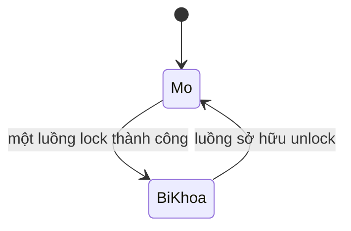
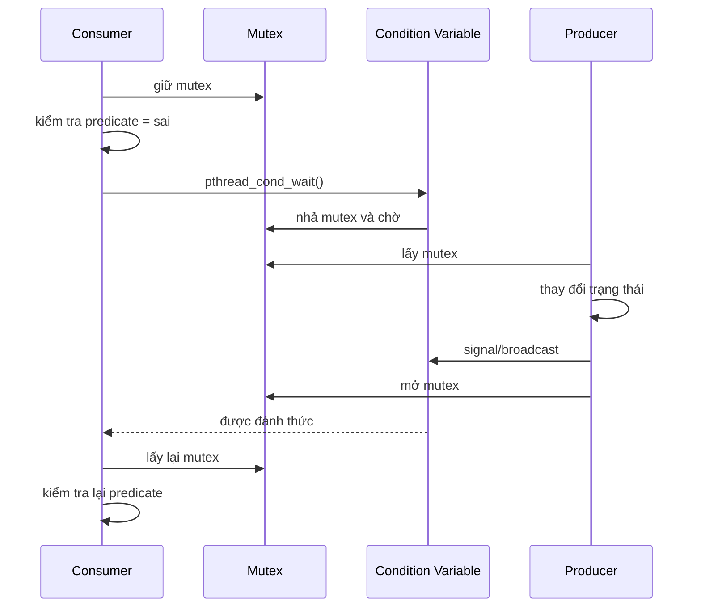
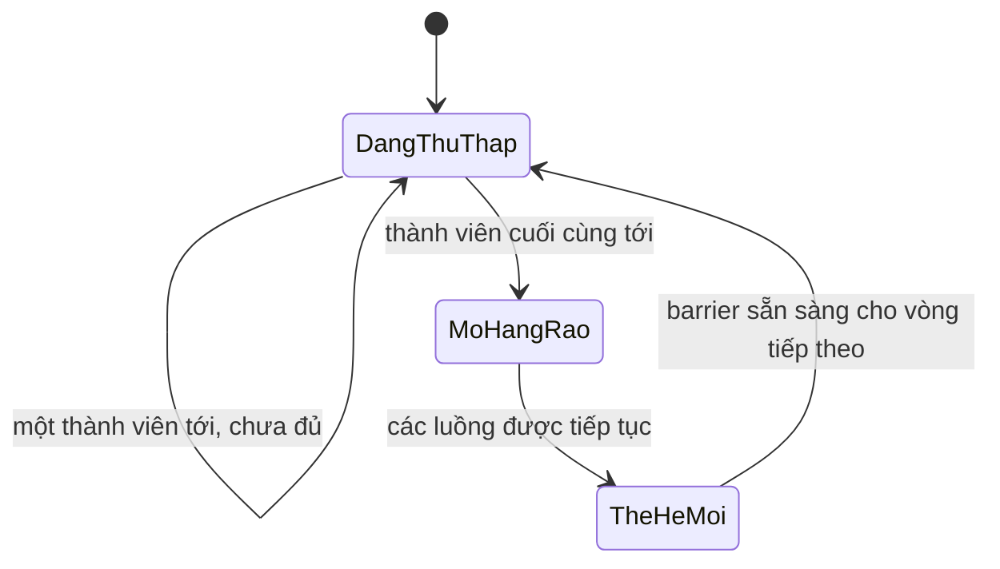

# Chủ đề 7 — Đồng bộ luồng trong Linux

> **Mục tiêu:** hiểu vì sao nhiều luồng dùng chung dữ liệu cần đồng bộ, và nắm đúng vai trò của `mutex`, `condition variable`, `semaphore`, `barrier`, cùng các vấn đề như điều kiện tranh chấp, deadlock, starvation và priority inversion.
>
> **Quy ước ngôn ngữ:** phần giải thích dùng Tiếng Việt. Giữ nguyên các tên chuẩn cần tra cứu như `POSIX`, `Pthreads`, `pthread_mutex_t`, `pthread_cond_t`, `sem_t`, `PTHREAD_PRIO_INHERIT`, tên API và mã lỗi.
>
> **Phạm vi:** điều kiện tranh chấp, vùng tới hạn, tính nguyên tử ở mức khái niệm, khả năng nhìn thấy dữ liệu giữa các luồng, mutex, condition variable, semaphore, mô hình producer–consumer, barrier, deadlock, starvation, livelock, thứ tự khóa, mức độ chi tiết của khóa, tranh chấp tài nguyên và priority inversion ở mức tổng quan.
>
> Chương này chỉ có **lý thuyết**, không có bài thực hành. Các chủ đề nâng cao như raw `futex`, lock-free, RCU, spinlock nhân Linux và mô hình atomic C/C++ chi tiết không thuộc phạm vi chương này.

---

## Mục lục

- [1. Vì sao cần đồng bộ luồng?](#1-vì-sao-cần-đồng-bộ-luồng)
- [2. Điều kiện tranh chấp, data race và vùng tới hạn](#2-điều-kiện-tranh-chấp-data-race-và-vùng-tới-hạn)
- [3. Đồng bộ còn liên quan tới khả năng nhìn thấy dữ liệu](#3-đồng-bộ-còn-liên-quan-tới-khả-năng-nhìn-thấy-dữ-liệu)
- [4. Mutex: chỉ một luồng được sở hữu vùng bảo vệ](#4-mutex-chỉ-một-luồng-được-sở-hữu-vùng-bảo-vệ)
- [5. Vòng đời và thao tác của Mutex](#5-vòng-đời-và-thao-tác-của-mutex)
- [6. Các loại Mutex cơ bản](#6-các-loại-mutex-cơ-bản)
- [7. Condition Variable: ngủ để chờ trạng thái thay đổi](#7-condition-variable-ngủ-để-chờ-trạng-thái-thay-đổi)
- [8. Predicate, spurious wakeup và lost wakeup](#8-predicate-spurious-wakeup-và-lost-wakeup)
- [9. Signal, broadcast và chờ có thời hạn](#9-signal-broadcast-và-chờ-có-thời-hạn)
- [10. Semaphore: bộ đếm tài nguyên hoặc token](#10-semaphore-bộ-đếm-tài-nguyên-hoặc-token)
- [11. Khi nào dùng Mutex, Condition Variable hay Semaphore?](#11-khi-nào-dùng-mutex-condition-variable-hay-semaphore)
- [12. Mô hình Producer–Consumer](#12-mô-hình-producerconsumer)
- [13. Barrier: các luồng chờ nhau ở cuối một giai đoạn](#13-barrier-các-luồng-chờ-nhau-ở-cuối-một-giai-đoạn)
- [14. Deadlock](#14-deadlock)
- [15. Starvation và Livelock](#15-starvation-và-livelock)
- [16. Thứ tự khóa, độ lớn vùng tới hạn và tranh chấp](#16-thứ-tự-khóa-độ-lớn-vùng-tới-hạn-và-tranh-chấp)
- [17. Priority Inversion và Priority Inheritance](#17-priority-inversion-và-priority-inheritance)
- [18. Tư duy gỡ lỗi đồng bộ](#18-tư-duy-gỡ-lỗi-đồng-bộ)
- [19. Liên hệ với Embedded Linux](#19-liên-hệ-với-embedded-linux)
- [20. Tổng kết](#20-tổng-kết)
- [21. Tài liệu tham khảo](#21-tài-liệu-tham-khảo)

---

## 1. Vì sao cần đồng bộ luồng?

> **Nói đơn giản:** nhiều luồng có thể cùng nhìn thấy một vùng dữ liệu. Nếu chúng cùng đọc/ghi mà không thống nhất “ai được làm gì, vào lúc nào”, trạng thái có thể sai dù từng luồng riêng lẻ nhìn có vẻ đúng.

### 1.1 Vấn đề bắt đầu từ dữ liệu dùng chung có thể thay đổi

```text
Luồng A --------+
                |
                v
        trạng thái dùng chung
                ^
                |
Luồng B --------+
```

Nếu dữ liệu chỉ đọc và không thay đổi, vấn đề đơn giản hơn nhiều.

Nếu có ghi:

```text
đọc
sửa
ghi
```

thì thứ tự xen kẽ giữa các luồng trở thành một phần của tính đúng đắn.

---

### 1.2 Đồng bộ không chỉ là “khóa một biến”

Một cấu trúc thường có nhiều trường liên hệ nhau:

```text
head
tail
size
buffer[]
```

Nếu đây là một hàng đợi, các trường phải cùng thỏa mãn một quy tắc nhất quán.

Vì vậy thứ cần bảo vệ thường là:

```text
một trạng thái / một bất biến
```

chứ không phải chỉ một biến đơn lẻ.

---

### 1.3 Ba câu hỏi trước khi chọn cơ chế đồng bộ

```text
1. Dữ liệu/trạng thái nào được dùng chung?
2. Những thao tác nào không được phép chồng lên nhau?
3. Luồng phải chờ điều kiện nào mới được tiếp tục?
```

Sau đó mới lựa chọn:

```text
mutex
condition variable
semaphore
barrier
```

---

## 2. Điều kiện tranh chấp, data race và vùng tới hạn

### 2.1 Điều kiện tranh chấp (`race condition`)

Điều kiện tranh chấp xảy ra khi kết quả đúng/sai phụ thuộc vào thời điểm và thứ tự các thao tác đồng thời.

Ví dụ:

```text
balance = 100

Luồng A                  Luồng B
đọc 100                  đọc 100
cộng 10                  trừ 20
ghi 110                  ghi 80
```

Kết quả cuối có thể là:

```text
80
```

và cập nhật của A bị mất.

Nếu thứ tự khác, kết quả có thể khác.

---

### 2.2 `data race` là khái niệm chặt hơn

Ở mức mô hình bộ nhớ của ngôn ngữ, `data race` liên quan tới nhiều luồng truy cập cùng một vị trí nhớ, có ít nhất một thao tác ghi và không có đồng bộ phù hợp.

Đối với C/C++, data race có thể dẫn tới hành vi không xác định theo chuẩn ngôn ngữ.

Topic này không đi sâu vào memory order của C11/C++.

---

### 2.3 Race logic vẫn có thể xảy ra dù từng lần truy cập đã được khóa

Ví dụ:

```text
khóa
kiểm tra: resource còn trống
mở khóa

... luồng khác thay đổi resource ...

khóa
sử dụng dựa trên kết quả kiểm tra cũ
mở khóa
```

Từng lần đọc/ghi có thể được bảo vệ, nhưng toàn bộ logic:

```text
kiểm tra -> hành động
```

không nguyên vẹn.

---

### 2.4 Vùng tới hạn (`critical section`)

Vùng tới hạn là đoạn mã thay đổi/đọc trạng thái mà các thao tác xung đột không được phép cùng thực hiện.

```text
Luồng A
   |
khóa
   |
   v
+-------------------------+
|      VÙNG TỚI HẠN      |
| cập nhật trạng thái     |
+-------------------------+
   |
mở khóa
```

---

### 2.5 Vùng tới hạn nên bao quanh bất biến cần giữ đúng

Không nên hỏi:

> “Biến nào cần mutex?”

Nên hỏi:

> “Thao tác nào phải được xem như một bước nhất quán so với các luồng khác?”

Ví dụ với hàng đợi:

```text
ghi phần tử
cập nhật tail
cập nhật size
```

có thể là một chuyển trạng thái cần bảo vệ chung.

---

## 3. Đồng bộ còn liên quan tới khả năng nhìn thấy dữ liệu

> **Nói đơn giản:** mutex không chỉ ngăn hai luồng cùng vào một đoạn mã; các phép đồng bộ còn tạo ra quy tắc để thay đổi bộ nhớ của luồng này được luồng kia quan sát đúng theo chuẩn.

### 3.1 Vì sao “A ghi trước, B đọc sau” chưa đủ nếu không có đồng bộ?

Trong mã nguồn:

```text
data = 123;
ready = 1;
```

người đọc dễ nghĩ luồng khác chắc chắn thấy theo đúng thứ tự này.

Nhưng khi có nhiều CPU/compiler, thứ tự và khả năng quan sát giữa các luồng phải dựa vào mô hình bộ nhớ và thao tác đồng bộ được chuẩn quy định.

---

### 3.2 Mutex tạo quan hệ đồng bộ

Mental model:

```text
Luồng A                        Luồng B

khóa M
sửa dữ liệu
mở khóa M  ----------------->  khóa M
                                  |
                                  v
                           đọc trạng thái đã bảo vệ
```

Không nên xem `pthread_mutex_unlock()` chỉ như việc đổi một cờ từ 1 về 0.

API đồng bộ có ngữ nghĩa bộ nhớ mạnh hơn cách hiểu đó.

---

### 3.3 Tính nguyên tử (`atomicity`) ở mức khái niệm

Một thao tác “nguyên tử” theo nghĩa giao thức là:

```text
các luồng khác không quan sát thấy trạng thái trung gian không hợp lệ
```

Mutex có thể làm cho một nhóm thao tác trở thành vùng tới hạn nguyên vẹn **theo giao thức khóa**.

Điều này khác với khái niệm atomic instruction/atomic type ở cấp CPU/ngôn ngữ, vốn là chủ đề sâu hơn.

---

## 4. Mutex: chỉ một luồng được sở hữu vùng bảo vệ

### 4.1 Mutex là gì?

`mutex` bắt nguồn từ:

```text
mutual exclusion
```

Nói đơn giản:

```text
một mutex đang khóa
  -> chỉ một luồng sở hữu nó
```

Các luồng khác muốn lấy cùng mutex phải chờ hoặc nhận trạng thái “đang bận”, tùy API.

---

### 4.2 Trạng thái cơ bản



Khi đang bị khóa:

```text
Luồng A sở hữu M
Luồng B muốn M -> chờ
Luồng C muốn M -> chờ
```

---

### 4.3 Ownership — quyền sở hữu

Đây là điểm phân biệt mutex với semaphore.

```text
Luồng A lock M
   |
   v
A là chủ sở hữu M
   |
   v
A unlock M
```

Không nên thiết kế kiểu:

```text
A lock
B unlock thay A
```

vì hành vi phụ thuộc loại mutex và thường là lỗi giao thức.

---

### 4.4 Mutex không tự biết dữ liệu nào nó “bảo vệ”

Kernel/thư viện không biết:

```text
mutex M bảo vệ biến X
```

Đó là quy ước của chương trình.

Nếu:

```text
Luồng A đọc X dưới mutex M
Luồng B ghi X không dùng M
```

thì mutex không thể bảo vệ truy cập của B.

Mọi bên phải tuân thủ cùng một giao thức.

---

## 5. Vòng đời và thao tác của Mutex

### 5.1 Khởi tạo

Trước khi dùng, mutex phải ở trạng thái đã khởi tạo hợp lệ.

```text
bộ nhớ chưa khởi tạo
      |
      v
khởi tạo mutex
      |
      v
mutex hợp lệ
```

Có thể có khởi tạo tĩnh hoặc động tùy API/đối tượng.

---

### 5.2 `pthread_mutex_lock()`

Nếu mutex đang mở:

```text
lock
  -> lấy mutex
```

Nếu mutex do luồng khác giữ:

```text
lock
  -> chờ cho tới khi có thể lấy
```

Đây là hành vi chặn thông thường.

---

### 5.3 `pthread_mutex_trylock()`

`trylock` thay đổi cách ứng xử khi mutex đang bận:

```text
mutex mở?
  /    \
có      không
 |        |
lấy      trả EBUSY
```

Nó không phải “mutex nhanh hơn”; nó là **không chờ** trong trường hợp mutex đang bị giữ.

---

### 5.4 `pthread_mutex_unlock()`

Luồng sở hữu giải phóng mutex:

```text
đang khóa bởi A
      |
A unlock
      |
      v
mở
```

Sau đó một luồng đang chờ có thể được chạy và lấy mutex theo quy tắc lập lịch/triển khai.

Không nên giả định thứ tự chờ luôn FIFO nếu tài liệu không bảo đảm.

---

### 5.5 Hủy mutex

Chỉ được hủy khi vòng đời của nó đã an toàn:

```text
không còn luồng sử dụng
không còn luồng chờ
không còn bị khóa
```

Một synchronization object cũng có vòng đời. Hủy quá sớm là một loại race về vòng đời tài nguyên.

---

### 5.6 Quy ước trả lỗi của Pthreads

Nhiều hàm mutex trả:

```text
0
  thành công

mã lỗi khác 0
  lỗi/trạng thái đặc biệt
```

không nhất thiết là:

```text
-1 + errno
```

---

## 6. Các loại Mutex cơ bản

### 6.1 Vì sao có nhiều loại?

Một câu hỏi khó là:

```text
Nếu Luồng A đã giữ M rồi lại lock M lần nữa thì sao?
```

POSIX có các loại mutex để định nghĩa hành vi khác nhau.

---

### 6.2 `PTHREAD_MUTEX_NORMAL`

Nếu cùng luồng khóa lại mutex mà chính nó đang giữ:

```text
A lock M
A lock M lần nữa
```

có thể tự deadlock theo ngữ nghĩa `NORMAL`.

---

### 6.3 `PTHREAD_MUTEX_ERRORCHECK`

Loại này giúp phát hiện một số lỗi sử dụng, ví dụ:

```text
khóa lại mutex mình đang giữ
mở khóa khi không phải chủ sở hữu
```

thay vì để lỗi biểu hiện khó hiểu hơn.

Nó hỗ trợ chẩn đoán, không thay thế thiết kế đúng.

---

### 6.4 `PTHREAD_MUTEX_RECURSIVE`

Cho phép cùng một luồng khóa nhiều lần.

```text
A lock -> số đếm 1
A lock -> số đếm 2
A unlock -> 1
A unlock -> 0, mutex thực sự mở
```

Cần số lần `unlock` tương ứng với số lần `lock`.

Recursive mutex có trường hợp sử dụng riêng; lạm dụng nó có thể che giấu cấu trúc khóa rối.

---

### 6.5 `PTHREAD_MUTEX_DEFAULT`

Không nên mặc định cho rằng mọi hành vi biên của `DEFAULT` giống hệt một loại có tên cụ thể trên mọi hệ thống.

Khi chương trình phụ thuộc vào hành vi đặc biệt, nên dùng loại được quy định rõ.

---

## 7. Condition Variable: ngủ để chờ trạng thái thay đổi

> **Nói đơn giản:** mutex trả lời “ai được sửa/đọc trạng thái lúc này?”, còn `condition variable` giúp một luồng ngủ cho tới khi trạng thái mà nó quan tâm **có thể đã thay đổi**.

### 7.1 Vấn đề của việc kiểm tra liên tục

Giả sử consumer chờ hàng đợi có dữ liệu.

Cách tệ:

```text
while queue rỗng:
    kiểm tra tiếp
    kiểm tra tiếp
    kiểm tra tiếp
```

Đây là busy-wait và tốn CPU.

Ta muốn:

```text
queue rỗng
    |
consumer ngủ
    |
producer thêm dữ liệu
    |
đánh thức consumer
```

---

### 7.2 Condition variable không chứa điều kiện nghiệp vụ

Nó không tự biết:

```text
queue có dữ liệu?
buffer còn chỗ?
shutdown được yêu cầu?
```

Điều kiện thật nằm trong dữ liệu dùng chung.

Ví dụ:

```text
predicate:
queue_size > 0
```

`condition variable` chỉ là cơ chế chờ/đánh thức gắn với việc kiểm tra predicate đó.

---

### 7.3 Vì sao phải đi cùng mutex?

Predicate nằm trong dữ liệu dùng chung nên phải được kiểm tra một cách nhất quán.

Mô hình:

```text
Dữ liệu dùng chung
      |
      +--> predicate
      |
     Mutex
      |
Condition Variable
```

---

### 7.4 `pthread_cond_wait()` làm hai việc quan trọng

Luồng đang giữ mutex gọi `pthread_cond_wait()`.

Về khái niệm:

```text
1. nhả mutex
2. bắt đầu chờ
```

hai bước được phối hợp nguyên tử theo ngữ nghĩa condition variable để không tạo khoảng hở lost wakeup.

Khi thức dậy:

```text
pthread_cond_wait()
```

sẽ lấy lại mutex trước khi trả về cho mã gọi.

---

### 7.5 Chuỗi hoạt động



---

## 8. Predicate, spurious wakeup và lost wakeup

### 8.1 Predicate là điều kiện logic thật

Ví dụ consumer:

```text
queue_size > 0
```

Producer có thể dùng:

```text
queue_size < capacity
```

Hoặc một hệ thống shutdown:

```text
stop_requested == true
```

---

### 8.2 Thức dậy không có nghĩa điều kiện chắc chắn đúng

POSIX cho phép **spurious wakeup**.

Ngoài ra nhiều luồng có thể cùng thức dậy, nhưng luồng khác lấy mutex trước và tiêu thụ tài nguyên.

Vì vậy:

```text
pthread_cond_wait() trả về
```

không được hiểu là:

```text
predicate chắc chắn đúng
```

---

### 8.3 Vì sao dùng `while`, không chỉ `if`?

Mental pattern:

```text
khóa mutex

while predicate sai:
    chờ condition variable

// tới đây đã lấy lại mutex
// kiểm tra cho thấy predicate đúng

thực hiện thao tác
mở mutex
```

`while` bắt buộc luồng kiểm tra lại predicate sau mỗi lần thức.

---

### 8.4 Lost wakeup là gì?

Nếu làm sai kiểu:

```text
Luồng A kiểm tra: chưa có dữ liệu

Luồng B thêm dữ liệu và báo hiệu

Luồng A mới bắt đầu ngủ
```

A có thể ngủ dù sự kiện đã xảy ra.

Đây là “mất đánh thức” (`lost wakeup`).

---

### 8.5 Mutex + condition wait đóng khoảng hở quan trọng

Đúng giao thức:

```text
A giữ mutex
A thấy predicate sai
A gọi cond_wait
  -> nhả mutex + chuyển sang chờ theo ngữ nghĩa nguyên tử

B chỉ thay predicate khi lấy được cùng mutex
```

Nhờ đó trạng thái và chờ được phối hợp đúng.

---

## 9. Signal, broadcast và chờ có thời hạn

### 9.1 `pthread_cond_signal()`

Dùng để đánh thức ít nhất một luồng đang chờ thích hợp.

Không nên phụ thuộc vào việc:

```text
luồng nào cụ thể sẽ được chọn
```

nếu chuẩn/triển khai không cam kết.

---

### 9.2 `pthread_cond_broadcast()`

Đánh thức tất cả các luồng đang chờ condition variable đó.

```text
              broadcast
                  |
         +--------+--------+
         |        |        |
       Chờ A    Chờ B    Chờ C
         |        |        |
         +--- cùng tranh lấy mutex ---+
```

Mỗi luồng vẫn phải kiểm tra lại predicate sau khi lấy mutex.

---

### 9.3 Khi nào signal và khi nào broadcast?

Về tư duy:

```text
state mới chỉ cho phép một waiter tiến lên
  -> signal có thể phù hợp

state mới có thể cho nhiều waiter cùng tiến lên
  -> broadcast có thể phù hợp
```

Nhưng lựa chọn chính xác phụ thuộc predicate và thiết kế.

---

### 9.4 Chờ có thời hạn

Timed wait cho phép chờ tới một thời điểm giới hạn.

```text
chờ điều kiện
   |
   +--> được báo / thức
   |
   +--> hết thời gian
```

Dù trả về vì timeout, ứng dụng vẫn nên kiểm tra trạng thái theo giao thức, vì thời điểm timeout và thay đổi predicate có thể gần nhau.

---

## 10. Semaphore: bộ đếm tài nguyên hoặc token

> **Nói đơn giản:** semaphore giữ một số đếm không âm. `wait` lấy một đơn vị; nếu hết thì chờ. `post` trả/thêm một đơn vị.

### 10.1 Mô hình bộ đếm

```text
semaphore = 3
```

có thể đại diện cho:

```text
3 buffer còn trống
3 tài nguyên còn dùng được
3 token cho phép
```

---

### 10.2 `sem_wait()`

```text
giá trị > 0?
   /      \
có        không
 |          |
giảm 1      chờ
 |          |
tiếp tục   đợi sem_post()
```

---

### 10.3 `sem_post()`

Tăng số đếm và có thể làm một waiter có cơ hội tiếp tục.

Semaphore không yêu cầu “chính luồng đã wait phải là luồng post” theo mô hình sở hữu như mutex.

---

### 10.4 Binary semaphore vẫn không hoàn toàn là mutex

Nếu semaphore chỉ dùng giá trị 0/1, hình thức có vẻ giống mutex.

Nhưng:

```text
Mutex
  có ownership

Semaphore
  có count/token
  không có ownership kiểu mutex
```

Sự khác biệt này quan trọng với thiết kế và real-time priority inheritance.

---

## 11. Khi nào dùng Mutex, Condition Variable hay Semaphore?

### 11.1 Mutex

Câu hỏi:

```text
Ai được vào vùng cập nhật trạng thái ngay lúc này?
```

Dùng khi cần:

```text
loại trừ lẫn nhau
bảo vệ bất biến dữ liệu
```

---

### 11.2 Condition Variable

Câu hỏi:

```text
Khi nào luồng này nên ngủ và thức để kiểm tra lại trạng thái?
```

Nó thường đi với mutex và predicate.

---

### 11.3 Semaphore

Câu hỏi:

```text
Có bao nhiêu đơn vị tài nguyên/token đang sẵn sàng?
```

Dùng khi bản chất bài toán là số đếm.

---

### 11.4 Bảng so sánh

| Cơ chế | Trạng thái cốt lõi | Có chủ sở hữu? | Dùng để hình dung |
|---|---|---:|---|
| Mutex | khóa/mở | Có | bảo vệ vùng tới hạn |
| Condition Variable | danh sách chờ/thông báo | Không đứng riêng | chờ predicate thay đổi |
| Semaphore | số đếm | Không kiểu mutex | token/tài nguyên/sự kiện đếm được |
| Barrier | số người đã tới giai đoạn | Không | chờ mọi thành viên tới điểm hẹn |

---

## 12. Mô hình Producer–Consumer

> **Nói đơn giản:** producer tạo dữ liệu, consumer lấy dữ liệu. Một hàng đợi dùng chung phải vừa tránh race vừa cho consumer ngủ khi rỗng và producer ngủ/chờ khi đầy.

### 12.1 Kiến trúc

```text
Producer
    |
    v
+-------------------+
| Hàng đợi dùng chung|
+-------------------+
    |
    v
Consumer
```

---

### 12.2 Những trạng thái cần bảo vệ

Ví dụ hàng đợi vòng:

```text
buffer[]
head
tail
count
capacity
```

Các trường liên hệ nhau nên cần một giao thức nhất quán.

---

### 12.3 Mutex bảo vệ hàng đợi

```text
Producer:
  khóa
  thêm phần tử
  cập nhật count/tail
  mở khóa

Consumer:
  khóa
  lấy phần tử
  cập nhật count/head
  mở khóa
```

---

### 12.4 Condition Variable cho `not_empty`

Consumer không nên busy-wait khi hàng đợi rỗng.

```text
count == 0
   |
consumer chờ not_empty
   |
producer thêm dữ liệu
   |
báo not_empty
```

---

### 12.5 Có thể có `not_full`

Nếu hàng đợi hữu hạn:

```text
count == capacity
```

producer cũng cần chờ khi hết chỗ.

```text
not_empty
  cho consumer

not_full
  cho producer
```

---

### 12.6 Vì sao ví dụ này quan trọng?

Producer–consumer cho thấy các primitive không tồn tại tách rời:

```text
mutex
  bảo vệ trạng thái

condition variable
  cho phép chờ trạng thái
```

Khi đã hiểu mô hình này, nhiều kiến trúc worker queue, audio pipeline, sensor pipeline sẽ dễ hiểu hơn.

---

## 13. Barrier: các luồng chờ nhau ở cuối một giai đoạn

### 13.1 Barrier giải quyết bài toán khác mutex

Giả sử ba luồng làm Phase 1.

Không luồng nào được sang Phase 2 trước khi cả ba hoàn thành Phase 1.

```text
Luồng A --------> barrier --\
Luồng B ------> barrier -----+--> tất cả đã tới --> Giai đoạn 2
Luồng C ----------> barrier -/
```

---

### 13.2 Mô hình trạng thái



---

### 13.3 `PTHREAD_BARRIER_SERIAL_THREAD`

Khi barrier đủ người, một luồng được chọn nhận giá trị đặc biệt:

```text
PTHREAD_BARRIER_SERIAL_THREAD
```

các luồng còn lại nhận giá trị thành công thông thường.

Điều này cho phép một luồng thực hiện phần việc “một lần” giữa hai giai đoạn nếu thiết kế cần.

---

### 13.4 Barrier có thể chờ vô hạn nếu thiếu thành viên

Nếu barrier cần 4 luồng nhưng chỉ 3 luồng tới:

```text
A -> chờ
B -> chờ
C -> chờ
D -> không bao giờ tới
```

thì các luồng còn lại không thể qua barrier.

Vòng đời thành viên phải được thiết kế đồng bộ với barrier.

---

## 14. Deadlock

> **Nói đơn giản:** deadlock là tình huống các bên đang chờ tài nguyên của nhau theo một vòng khép kín, nên không ai có thể tiến tiếp.

### 14.1 Ví dụ hai mutex

```text
Luồng A giữ M1
Luồng B giữ M2

A chờ M2
B chờ M1
```

Wait-for graph:

```text
A --chờ--> B
^          |
|          |
+---chờ----+
```

---

### 14.2 Bốn điều kiện Coffman

Mô hình kinh điển chỉ ra bốn điều kiện cần đồng thời cho deadlock loại tài nguyên:

```text
1. Loại trừ lẫn nhau
2. Giữ tài nguyên trong khi chờ tài nguyên khác
3. Không cưỡng bức lấy lại tài nguyên
4. Có vòng chờ khép kín
```

Phá được ít nhất một điều kiện có thể loại bỏ lớp deadlock đó.

---

### 14.3 Tự deadlock

Một luồng cũng có thể tự khóa mình:

```text
A giữ mutex NORMAL M
A lại lock M
```

A đang chờ mutex mà chỉ chính A có thể mở.

---

### 14.4 Deadlock không chỉ xảy ra với mutex

Ví dụ:

```text
A pthread_join(B)
B chờ A hoàn tất một điều kiện
```

hoặc:

```text
barrier chờ thành viên không còn chạy
```

Đều là vấn đề tiến triển, dù không nhất thiết tạo bởi hai mutex.

---

## 15. Starvation và Livelock

### 15.1 Starvation

Một luồng không bị khóa chết toàn hệ thống nhưng liên tục không giành được tài nguyên/cơ hội chạy.

```text
A, B, C liên tục lấy tài nguyên
D luôn bị bỏ lại
```

Các luồng khác vẫn tiến triển.

---

### 15.2 Starvation khác deadlock

```text
Deadlock:
  một nhóm không ai tiến triển được

Starvation:
  hệ thống vẫn chạy
  nhưng một bên có thể bị chờ vô hạn
```

---

### 15.3 Livelock

Các luồng vẫn chạy và phản ứng với nhau, nhưng không tạo tiến triển hữu ích.

```text
A thấy xung đột -> nhường
B thấy xung đột -> nhường
A thử lại -> nhường
B thử lại -> nhường
...
```

CPU có thể bận dù công việc không hoàn thành.

---

### 15.4 Tính công bằng không phải lúc nào cũng được bảo đảm

Không nên tự giả định:

```text
mutex luôn cấp theo FIFO
waiter lâu nhất luôn được chạy trước
```

Trừ khi chuẩn hoặc chính sách lập lịch nêu rõ.

---

## 16. Thứ tự khóa, độ lớn vùng tới hạn và tranh chấp

### 16.1 Quy tắc thứ tự khóa

Một kỹ thuật quan trọng để tránh vòng chờ:

```text
luôn khóa M1 trước M2
luôn khóa M2 trước M3
```

Không cho phép đường ngược:

```text
M3 -> M1
```

Mental model:

```text
M1 -> M2 -> M3
```

là một thứ tự toàn cục không có vòng.

---

### 16.2 Khóa thô (`coarse-grained`)

Một mutex bảo vệ một vùng trạng thái lớn.

Ưu điểm:

```text
dễ hiểu
dễ giữ bất biến
ít quan hệ lock-order
```

Nhược điểm:

```text
nhiều luồng phải chờ cùng một khóa
ít song song hơn
```

---

### 16.3 Khóa mịn (`fine-grained`)

Nhiều mutex bảo vệ các phần nhỏ.

Ưu điểm:

```text
có thể tăng mức đồng thời
```

Nhược điểm:

```text
khó reasoning hơn
dễ deadlock hơn
nhiều quan hệ sở hữu hơn
```

---

### 16.4 Tranh chấp (`contention`)

Nếu nhiều luồng thường xuyên muốn cùng mutex:

```text
mutex trở thành điểm nóng
```

Hệ quả có thể là:

```text
thời gian chờ cao
ít chạy song song
nhiều chuyển lịch
```

---

### 16.5 Đừng giữ khóa qua thao tác không xác định thời gian nếu không cần

Ví dụ rủi ro:

```text
khóa mutex
   |
gọi I/O có thể chặn rất lâu
   |
mở mutex
```

Các luồng khác phải chờ trong toàn bộ thời gian I/O.

Càng nghiêm trọng nếu gọi:

```text
callback không biết trước
network I/O
filesystem I/O
```

trong vùng khóa.

---

## 17. Priority Inversion và Priority Inheritance

### 17.1 Priority inversion là gì?

Giả sử:

```text
H = luồng ưu tiên cao
M = luồng ưu tiên trung bình
L = luồng ưu tiên thấp
```

L đang giữ mutex mà H cần.

```text
L giữ mutex
H chạy -> chờ mutex của L
M chạy -> chiếm CPU trước L
L không được chạy để mở mutex
H tiếp tục phải chờ
```

H bị chậm gián tiếp bởi M dù M không giữ mutex đó.

---

### 17.2 Sơ đồ

```text
Ưu tiên cao H:       [chờ mutex do L giữ] ----------------
Ưu tiên vừa M:              CHẠY CHẠY CHẠY CHẠY
Ưu tiên thấp L:      giữ M       chưa chạy       chạy -> mở M
```

---

### 17.3 `PTHREAD_PRIO_INHERIT`

POSIX có cơ chế priority inheritance cho mutex phù hợp.

Ý tưởng:

```text
H chờ mutex do L giữ
       |
       v
L tạm thời được nâng ưu tiên
       |
L chạy để hoàn tất vùng tới hạn
       |
L mở mutex
       |
       v
H có thể tiếp tục
```

---

### 17.4 Đây là chủ đề real-time, không phải “tăng tốc mutex”

Priority inheritance dùng để giảm/bó buộc một dạng priority inversion trong hệ thống ưu tiên thời gian thực.

Nó không giải quyết:

```text
deadlock
race condition do quên lock
thiết kế lock-order sai
```

---

## 18. Tư duy gỡ lỗi đồng bộ

### 18.1 Phân loại triệu chứng trước

```text
Dữ liệu sai ngẫu nhiên
  -> nghĩ race/lifetime

Chương trình đứng, CPU thấp
  -> nghĩ deadlock/wait vô hạn

CPU 100% nhưng không tiến triển
  -> nghĩ busy-loop/livelock

Một luồng luôn chậm
  -> nghĩ starvation/priority inversion/contention
```

---

### 18.2 Câu hỏi gỡ lỗi theo thứ tự

```text
Dữ liệu dùng chung nào đang sai?
       |
Mọi truy cập có dùng cùng protocol không?
       |
Mutex nào bảo vệ invariant nào?
       |
Có lock-order nhất quán không?
       |
Condition predicate là gì?
       |
Predicate có luôn kiểm tra trong while không?
       |
Có luồng nào chờ một sự kiện không thể xảy ra không?
       |
Có giữ lock quá lâu không?
```

---

### 18.3 “Thêm log thì hết lỗi”

Đây là dấu hiệu đáng nghi của lỗi đồng thời.

Log thay đổi:

```text
timing
I/O
scheduler
lock contention
```

nên race có thể tạm biến mất.

Không được coi đó là bằng chứng logic đã đúng.

---

### 18.4 Condition variable thức nhưng predicate sai

Đây có thể hoàn toàn hợp lệ do:

```text
spurious wakeup
broadcast
luồng khác lấy tài nguyên trước
trạng thái thay đổi lại trước khi lấy mutex
```

Giải pháp về logic là:

```text
luôn kiểm tra lại predicate
```

---

### 18.5 `pthread_mutex_trylock()` trả `EBUSY`

Thông thường nghĩa là:

```text
mutex đang bị giữ
```

Đây là trạng thái mong đợi của try-lock, không nhất thiết là lỗi hệ thống nghiêm trọng.

---

## 19. Liên hệ với Embedded Linux

### 19.1 Hàng đợi sensor

```text
Luồng cảm biến
     |
     v
+-----------------+
| hàng đợi mẫu    |
+-----------------+
     |
     v
Luồng xử lý
```

Có thể cần:

```text
mutex
  bảo vệ hàng đợi

condition variable
  báo có mẫu mới
```

---

### 19.2 Một thiết bị có nhiều người dùng

Ví dụ SPI/UART:

```text
Luồng A muốn gửi frame
Luồng B cũng muốn gửi frame
```

Nếu transaction gồm nhiều bước, vùng tới hạn nên bảo vệ **toàn bộ transaction logic** chứ không chỉ một lần `write()` ngẫu nhiên.

---

### 19.3 Logger tập trung

Thay vì mọi luồng cùng giữ lock và ghi file lâu:

```text
Luồng A --\
Luồng B ----> hàng đợi log -> Luồng logger
Luồng C --/
```

có thể dùng ownership rõ hơn.

Đây là ví dụ cách kiến trúc giảm contention, không phải một quy tắc bắt buộc.

---

### 19.4 Shutdown

Ứng dụng có nhiều luồng cần một trạng thái dùng chung:

```text
RUNNING
   |
stop_requested = true
   |
   v
STOPPING
   |
đánh thức các luồng đang chờ
   |
join
   |
   v
STOPPED
```

Synchronization giúp shutdown không phụ thuộc timing ngẫu nhiên.

---

### 19.5 Real-time

Trong Embedded Linux thời gian thực:

```text
mutex + priority
```

không thể xem tách rời.

Priority inversion có thể làm một luồng ưu tiên cao trễ quá giới hạn, nên các protocol như `PTHREAD_PRIO_INHERIT` trở nên quan trọng hơn.

---

## 20. Tổng kết

### 20.1 Bản đồ chọn cơ chế

```text
Bài toán đồng bộ là gì?
        |
        +--> Chỉ một luồng được sửa trạng thái?
        |       -> Mutex
        |
        +--> Chờ một điều kiện của dữ liệu?
        |       -> Condition Variable + Mutex
        |
        +--> Đếm số tài nguyên/token?
        |       -> Semaphore
        |
        +--> Mọi luồng phải gặp nhau ở cuối giai đoạn?
                -> Barrier
```

---

### 20.2 Condition Variable

```text
Dữ liệu dùng chung
      |
  predicate
      |
  mutex bảo vệ
      |
condition variable giúp ngủ/thức
      |
thức -> lấy lại mutex -> kiểm tra lại predicate
```

Điểm phải nhớ:

```text
được đánh thức != predicate chắc chắn đúng
```

---

### 20.3 Deadlock

```text
A giữ M1, chờ M2
B giữ M2, chờ M1

=> vòng chờ
=> không ai tiến triển
```

---

### 20.4 Những điểm phải nhớ

1. Đồng bộ bảo vệ bất biến và thứ tự truy cập dữ liệu dùng chung.
2. Race condition phụ thuộc timing/interleaving.
3. Một câu lệnh C không tự động là một transaction nguyên tử giữa các luồng.
4. Mutex cung cấp quyền sở hữu và loại trừ lẫn nhau.
5. Tất cả bên truy cập dữ liệu phải cùng tuân thủ protocol khóa.
6. Condition variable dùng để chờ predicate thay đổi, không chứa predicate.
7. `pthread_cond_wait()` phối hợp nhả mutex và đi ngủ, rồi lấy lại mutex trước khi trả về.
8. Luôn kiểm tra predicate trong vòng lặp vì có spurious wakeup và các race logic khác.
9. Semaphore mô hình hóa số đếm token/tài nguyên.
10. Binary semaphore vẫn khác mutex về ownership.
11. Producer–consumer thường kết hợp mutex và condition variable.
12. Barrier dùng cho đồng bộ theo giai đoạn.
13. Deadlock là vòng phụ thuộc không thể tiến triển.
14. Starvation và livelock khác deadlock.
15. Thứ tự khóa nhất quán giúp ngăn vòng deadlock.
16. Vùng tới hạn quá lớn làm tăng contention.
17. Priority inversion đặc biệt quan trọng trong hệ real-time.
18. `PTHREAD_PRIO_INHERIT` là một cơ chế giảm priority inversion, không phải thuốc chữa mọi lỗi đồng bộ.

---

## 21. Tài liệu tham khảo

### POSIX.1-2024 / The Open Group

- https://pubs.opengroup.org/onlinepubs/9799919799/
- `pthread_mutex_lock()`: https://pubs.opengroup.org/onlinepubs/9799919799/functions/pthread_mutex_lock.html
- Condition Variable: https://pubs.opengroup.org/onlinepubs/9799919799/functions/pthread_cond_clockwait.html
- `<pthread.h>`: https://pubs.opengroup.org/onlinepubs/9799919799/basedefs/pthread.h.html

Nguồn cho ngữ nghĩa chuẩn của mutex, condition variable, barrier, protocol ưu tiên và memory synchronization.

### Linux man-pages

- `pthreads(7)`: https://man7.org/linux/man-pages/man7/pthreads.7.html
- `pthread_mutex_lock(3p)`: https://man7.org/linux/man-pages/man3/pthread_mutex_lock.3p.html
- `pthread_cond_wait(3)`: https://man7.org/linux/man-pages/man3/pthread_cond_wait.3.html
- `sem_overview(7)`: https://man7.org/linux/man-pages/man7/sem_overview.7.html
- `pthread_barrier_wait(3p)`: https://man7.org/linux/man-pages/man3/pthread_barrier_wait.3p.html
- `pthread_mutexattr_setprotocol(3p)`: https://man7.org/linux/man-pages/man3/pthread_mutexattr_setprotocol.3p.html

### Tài liệu Embedded Linux / Linux system programming

- Bootlin PREEMPT_RT: https://bootlin.com/doc/training/preempt-rt/
- Bootlin Embedded Linux: https://bootlin.com/doc/training/embedded-linux/
- The Linux Programming Interface: https://man7.org/tlpi/

### Nguồn cộng đồng

- Unix & Linux Stack Exchange: https://unix.stackexchange.com/
- Stack Overflow: https://stackoverflow.com/

Các nguồn cộng đồng hữu ích để tìm trường hợp deadlock, lost wakeup hoặc lỗi producer–consumer thực tế, nhưng cần đối chiếu lại với POSIX/man-pages trước khi kết luận về ngữ nghĩa chuẩn.

---

> **Điều hướng:** [← Chủ đề 6 — Đa luồng](README-topic-06.md) · [Chủ đề 8 — Giao tiếp liên tiến trình →](README-topic-08.md)
