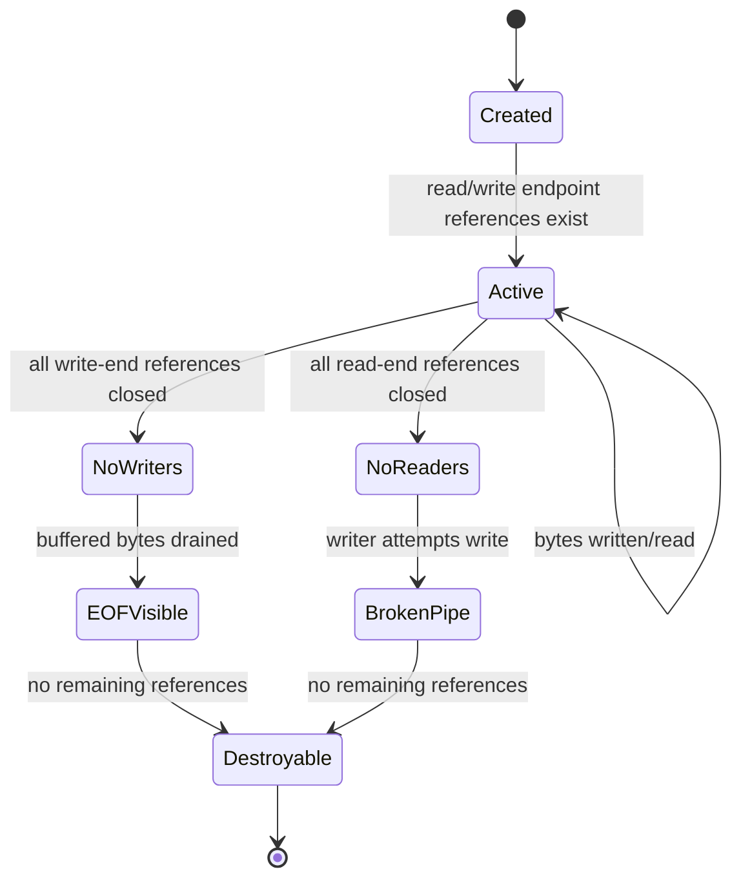
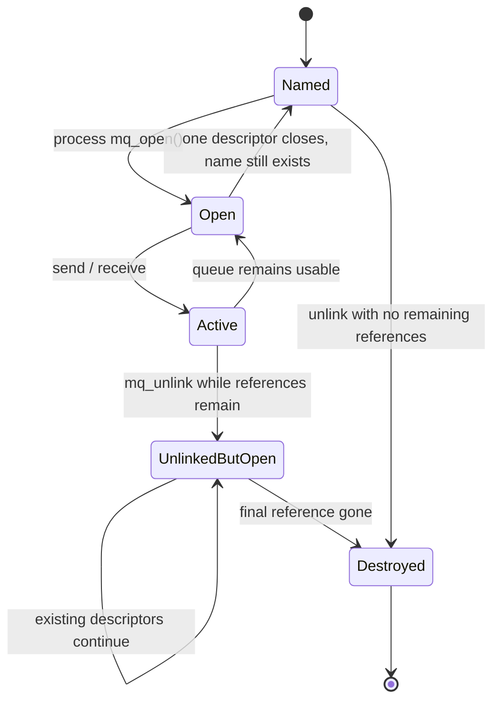
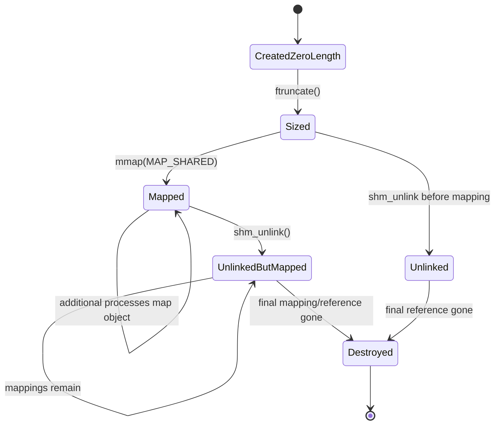

# Chủ đề 8 — Interprocess Communication (IPC) trong Linux

> **Phạm vi:** Linux/POSIX IPC fundamentals: unnamed pipe, FIFO, POSIX message queue, POSIX shared memory, shared-memory synchronization, blocking/backpressure và trade-off giữa các cơ chế.
>
> Chương này chỉ trình bày **lý thuyết**. Không có lab, bài tập, chương trình mẫu hoàn chỉnh hoặc hướng dẫn thao tác thực hành.
>
> **Giới hạn chủ đề:** Không đi sâu vào System V IPC internals, Unix-domain sockets, descriptor passing hoặc container namespaces; Unix-domain socket được học cùng Socket Programming ở Topic 9.
>
> **Nguyên tắc bố cục:** `##` chỉ dành cho các khối kiến thức lớn; `###/####` dùng cho concept chi tiết. Các phần trùng hoặc thuộc topic khác đã được loại khỏi chapter này.
>
> **Điều hướng:** [← Chủ đề 7 — Thread Synchronization](README-topic-07.md) · [Chủ đề 9 — Socket Programming →](README-topic-09.md)

---

## Mục lục

- [1. IPC Fundamentals](#1-ipc-fundamentals)
- [2. Các chiều thiết kế của một IPC Mechanism](#2-các-chiều-thiết-kế-của-một-ipc-mechanism)
- [3. Unnamed Pipe](#3-unnamed-pipe)
- [4. FIFO — Named Pipe](#4-fifo-named-pipe)
- [5. POSIX Message Queue](#5-posix-message-queue)
- [6. Shared Memory Fundamentals](#6-shared-memory-fundamentals)
- [7. Synchronization trong Shared Memory](#7-synchronization-trong-shared-memory)
- [8. IPC Blocking, Backpressure và Flow Control](#8-ipc-blocking-backpressure-và-flow-control)
- [9. So sánh và lựa chọn IPC Mechanism](#9-so-sánh-và-lựa-chọn-ipc-mechanism)
- [10. Error Model và Tư duy Debug IPC](#10-error-model-và-tư-duy-debug-ipc)
- [11. Liên hệ với Embedded Linux](#11-liên-hệ-với-embedded-linux)
- [12. Tổng kết và Mental Model](#12-tổng-kết-và-mental-model)
- [13. Tài liệu tham khảo](#13-tài-liệu-tham-khảo)

---

## 1. IPC Fundamentals

### 1.1 Vì sao process cần IPC?

Topic 4 đã xây mental model:

```text
Process A
  virtual address space A

Process B
  virtual address space B
```

Hai process bình thường không trực tiếp nhìn thấy private memory của nhau.

Isolation này rất quan trọng cho:

```text
fault containment
security
address-space protection
independent lifecycle
```

Nhưng một hệ thống thực tế thường gồm nhiều process phải phối hợp:

```text
sensor service
logger
network service
supervisor
UI
database
worker
```

Do đó cần cơ chế:

```text
Interprocess Communication
IPC
```

---

### 1.2 IPC là communication + coordination

IPC thường phục vụ hai loại mục đích:

```text
Data transfer
  gửi bytes/messages/state

Coordination
  báo event
  wake peer
  indicate completion
  control lifecycle
```

Một mechanism có thể làm tốt cả hai hoặc chỉ phù hợp một phần.

Ví dụ:

```text
Pipe
  stream data + EOF lifecycle

Message queue
  discrete messages + priority

Shared memory
  common data region
  but needs separate synchronization

Unix socket
  bidirectional data + local connection semantics
```

---

### 1.3 IPC không chỉ dành cho unrelated processes

Communication có thể giữa:

```text
parent ↔ child

siblings created by same parent

independent long-running services

client ↔ local server
```

Một unnamed pipe tự nhiên phù hợp với related processes vì các endpoint thường được truyền qua descriptor inheritance.

Một số có names để unrelated processes rendezvous:

```text
FIFO pathname
POSIX message queue name
POSIX shared-memory name
Unix pathname socket
```

---

### 1.4 IPC object vs communication endpoint

Important distinction:

```text
IPC object/channel
```

không phải lúc nào cũng giống:

```text
file descriptor
```

Examples:

```text
pipe
  object + read/write fd endpoints

FIFO
  filesystem name → open endpoints

POSIX MQ
  queue object + mqd_t descriptor

shared memory
  object → fd → mmap mapping

Unix socket
  socket endpoint fd
```

The handle is how process refers to communication object.

The object has its own lifecycle and semantics.

---

### 1.5 IPC overview

```text
                         IPC
                          |
       +------------------+------------------+
       |                  |                  |
       v                  v                  v
   Byte Stream         Messages         Shared State
       |                  |                  |
   Pipe/FIFO          Message Queue       Shared Memory
       |
       +------------------------------------------+
                                                  |
                                             Unix Socket
                                       stream / datagram /
                                         sequenced packet
```

---

## 2. Các chiều thiết kế của một IPC Mechanism

### 2.1 Stream vs message-oriented

A stream gives:

```text
bytes
```

without preserving application message boundaries.

Examples:

```text
pipe
FIFO
SOCK_STREAM
```

A message-oriented mechanism preserves units:

```text
message 1
message 2
message 3
```

Examples:

```text
POSIX message queue
SOCK_DGRAM
SOCK_SEQPACKET
```

Shared memory is neither naturally stream nor message.

Application defines structure.

---

### 2.2 Named vs unnamed

Unnamed pipe thường yêu cầu các process nhận endpoint thông qua descriptor inheritance hoặc một setup có sẵn.

Named:

```text
FIFO pathname
POSIX MQ name
POSIX SHM name
Unix pathname socket
```

allows processes to locate/rendezvous through a stable name.

---

### 2.3 Unidirectional vs bidirectional

Portable POSIX pipe:

```text
one read end
one write end
```

so it should be treated as:

```text
unidirectional
```

Unix sockets:

```text
bidirectional
```

A bidirectional protocol over pipes generally needs:

```text
two pipes
```

---

### 2.4 Copy-based communication vs shared memory

Stream/message IPC usually follows conceptual path:

```text
Sender userspace
      |
      v
kernel-managed IPC buffer/state
      |
      v
Receiver userspace
```

Shared memory:

```text
Process A mapping ----+
                      |
                      +--> same shared memory object/pages
                      |
Process B mapping ----+
```

After mapping, communication can occur by memory accesses rather than one kernel IPC transfer per message.

But synchronization responsibility becomes larger.

---

### 2.5 Persistent name vs live communication state

Names and communication data do not always have same lifetime.

Example FIFO:

```text
filesystem FIFO entry persists
```

but:

```text
pipe data only exists while FIFO is open/active
```

The named filesystem entry is not a persistent data file.

---

### 2.6 Blocking and nonblocking semantics

Many IPC operations can block because peer/resource is not ready.

Examples:

```text
empty pipe read
full pipe write
empty message queue receive
full message queue send
socket receive with no data
FIFO open waiting for peer
```

Nonblocking mode changes:

```text
wait
```

into:

```text
return immediately with readiness-style error/state
```

where supported.

---

### 2.7 Backpressure

Finite receiver capacity means producer sometimes must slow down.

This is:

```text
backpressure
```

Mental model:

```text
Producer
   |
   v
finite IPC buffer
   |
   v
Consumer

consumer slower than producer
      |
buffer fills
      |
producer blocks/fails/queues elsewhere
```

Backpressure is a fundamental IPC design property.

---

### 2.8 Lifetime and cleanup

Each IPC mechanism has questions:

```text
When is object created?
Who owns the name?
What keeps it alive?
When does peer observe EOF/disconnect?
When is kernel state destroyed?
What remains after process crashes?
```

Ignoring lifecycle creates many IPC bugs.

---

## 3. Unnamed Pipe

### 3.1 Pipe abstraction

POSIX `pipe()` creates an interprocess channel and returns two descriptors:

```text
fd[0]
  read end

fd[1]
  write end
```

Mental model:

```text
Writer
   |
 write(fd[1])
   |
   v
+----------------------+
|      Pipe Buffer     |
+----------------------+
   |
 read(fd[0])
   |
   v
Reader
```

---

### 3.2 Portable directionality

POSIX defines pipe with read and write ends.

Portable mental model:

```text
write end ─────────────> read end
```

Linux uses this unidirectional model.

Some historical systems may support bidirectional pipe behavior, but portable applications must not depend on it.

---

### 3.3 Pipe creates file descriptors, not pathname

Unnamed pipe has no pathname used for rendezvous.

Therefore endpoints normally reach processes through:

```text
fork inheritance
descriptor duplication
descriptor passing
existing process setup
```

Classic parent-child model:

```text
Parent
   |
 pipe()
   |
 fork()
  /   \
 /     \
P       C

both initially inherit references
to both pipe ends
```

Application then conceptually closes unneeded ends.

---

### 3.4 File descriptor inheritance is part of pipe topology

Suppose:

```text
Parent wants to write
Child wants to read
```

Desired topology:

```text
Parent:
  write end open
  read end unused

Child:
  read end open
  write end unused
```

If unused duplicated write ends remain open, EOF detection can be delayed.

Thus fd lifetime is part of communication semantics.

---

### 3.5 Pipe is a kernel communication object

Data written into pipe is held in kernel-managed pipe buffers.

Pipe is not:

```text
temporary regular file
```

and cannot be treated as seekable storage.

---

### 3.6 Pipe I/O Semantics

#### 3.6.1 Pipe is a byte stream

Linux `pipe(7)` explicitly states:

```text
there is no concept of message boundaries
```

Suppose writer conceptually does:

```text
write "ABC"
write "DEF"
```

Reader might observe:

```text
"ABCDEF"
```

or consume:

```text
"AB"
then
"CDEF"
```

depending read sizes/timing.

Application must define framing if it needs logical messages.

---

#### 3.6.2 FIFO order means byte order, not application records

Bytes are consumed in order.

Mental model:

```text
written:

A B C D E F

read stream:

A B C D E F
```

But the pipe does not record:

```text
write #1 = ABC
write #2 = DEF
```

as permanent message metadata.

---

#### 3.6.3 `read()` on pipe

Concept:

```text
pipe has data?
   /      \
 yes       no
 |          |
return      writers exist?
bytes        /       \
            yes       no
            |          |
          block       EOF
          or EAGAIN   read returns 0
```

Blocking/nonblocking state changes exact result.

---

#### 3.6.4 Empty pipe is not always EOF

Important distinction:

```text
empty pipe
```

can mean:

```text
temporarily no data
```

or:

```text
no writers remain
```

If writer references still exist:

```text
blocking read waits
```

If all write-end references are closed:

```text
read returns 0
```

EOF is a **lifetime condition**, not merely buffer emptiness.

---

#### 3.6.5 `lseek()` does not apply

Pipe represents a flowing stream, not a random-access byte-addressable regular file.

Therefore:

```text
lseek(pipe_fd, ...)
```

is not meaningful and fails.

---

#### 3.6.6 Pipe is not a message protocol

If application sends structured objects:

```text
header
payload
header
payload
```

it must define framing using:

```text
fixed-size records
length prefix
delimiter
state machine
```

The pipe only provides ordered bytes.

---

### 3.7 Pipe Lifetime, EOF và `SIGPIPE`

#### 3.7.1 Pipe lifetime depends on open references

Kernel tracks references to both ends.

Mental model:

```text
Read-end references:  R
Write-end references: W
```

Communication state depends on whether:

```text
R > 0
W > 0
```

---

#### 3.7.2 EOF condition

If:

```text
W == 0
```

and buffered data has been consumed:

```text
reader sees EOF
read() returns 0
```

This is why leaked write descriptors can cause a reader to wait unexpectedly.

---

#### 3.7.3 Broken pipe condition

If:

```text
R == 0
```

and process writes:

```text
SIGPIPE is generated
```

Default SIGPIPE action is process termination.

If SIGPIPE is ignored/handled as appropriate:

```text
write() fails with EPIPE
```

This connects Topic 3 and Topic 5.

---

#### 3.7.4 Closing one descriptor is not enough if duplicates exist

Because:

```text
dup()
fork()
```

can create multiple descriptor references to same pipe end.

Example:

```text
Parent write fd ----+
                    +--> pipe write end
Child write fd -----+
```

Closing one still leaves writer reference alive.

EOF only occurs after **all** write-end references disappear.

---

#### 3.7.5 Pipe lifecycle state machine



This is a simplified lifecycle model; kernel reference details are more complex.

---

### 3.8 Pipe Capacity, Backpressure và Atomic Write

#### 3.8.1 Pipe has finite capacity

A pipe is not infinite storage.

Concept:

```text
+--------------------------+
| finite kernel pipe buffer|
+--------------------------+
```

If producer is faster:

```text
buffer fills
```

then writer must:

```text
block
```

or under nonblocking mode:

```text
return readiness/error result
```

---

#### 3.8.2 Capacity is implementation-specific

Linux pipe capacity has changed across kernel versions and can be affected by resource limits/configuration.

Therefore portable application should not treat:

```text
"pipe holds exactly X bytes"
```

as a protocol assumption.

---

#### 3.8.3 `PIPE_BUF` is not pipe capacity

Very important:

```text
PIPE_BUF
```

is related to **atomic write guarantees**.

It is not:

```text
total pipe buffer capacity
```

These are different concepts.

---

#### 3.8.4 Atomic writes up to `PIPE_BUF`

POSIX requires writes up to the relevant `PIPE_BUF` limit to be atomic with respect to interleaving from other pipe writers.

Concept:

```text
Writer A writes record A <= PIPE_BUF
Writer B writes record B <= PIPE_BUF

Reader sees:
AAAA...BBBB...
or
BBBB...AAAA...
```

not arbitrary byte interleaving inside those individual writes.

---

#### 3.8.5 Writes larger than `PIPE_BUF`

A larger write can be interleaved with data from another writer.

Conceptually:

```text
A chunk
B chunk
A chunk
B chunk
```

Therefore `PIPE_BUF` can be important for multi-writer record framing.

---

#### 3.8.6 Linux value vs POSIX requirement

POSIX requires:

```text
PIPE_BUF >= 512 bytes
```

Linux commonly defines pipe `PIPE_BUF` as:

```text
4096 bytes
```

Application portability should rely on symbolic/system-defined value, not hard-coded Linux number.

---

#### 3.8.7 Atomic write does not mean atomic application transaction

Even if one `write()` is atomic:

```text
multiple writes
```

making one logical message are not automatically atomic together.

Example:

```text
write(header)
write(payload)
```

another writer can potentially insert data between operations.

---

#### 3.8.8 Backpressure is useful, not merely a limitation

Blocking when buffer fills can naturally constrain producer:

```text
fast producer
   |
pipe full
   |
producer sleeps
   |
consumer catches up
```

This is implicit flow control.

But it can also create deadlock if both sides wait on full/empty channels incorrectly.

---

## 4. FIFO — Named Pipe

### 4.1 FIFO is a pipe with filesystem rendezvous name

FIFO means:

```text
First In First Out special file
```

Common term:

```text
named pipe
```

Mental model:

```text
Filesystem namespace

/tmp/service.fifo
        |
        v
FIFO special file
        |
        v
kernel pipe object while opened
```

---

### 4.2 FIFO pathname does not store communication data

Linux `fifo(7)` emphasizes:

```text
data passes internally through kernel
```

The filesystem FIFO entry has no regular-file data contents.

It acts as:

```text
reference/rendezvous point
```

for processes to open the same channel.

---

### 4.3 FIFO allows unrelated processes to rendezvous

Unlike an unnamed pipe, processes do not need to inherit pre-created descriptors.

They can independently know:

```text
same FIFO pathname
```

and open it subject to permissions.

---

### 4.4 FIFO permissions

FIFO is a filesystem object with:

```text
owner
group
permission bits
```

and creation mode affected by:

```text
umask
```

This makes filesystem access policy part of IPC access control.

---

### 4.5 FIFO and pipe share I/O semantics after open

Linux `pipe(7)` states that after creation/opening differences are resolved:

```text
pipe and FIFO I/O semantics are the same
```

Therefore FIFO is also:

```text
byte stream
no message boundaries
finite capacity
EOF based on writer references
SIGPIPE/EPIPE based on reader references
not seekable
```

---

### 4.6 FIFO Open/Lifetime Semantics

#### 4.6.1 Opening FIFO is itself synchronization

In blocking mode, opening one side normally waits for peer side.

Concept:

```text
Reader:
open FIFO for read
      |
      | no writer yet
      v
     wait


Writer:
open FIFO for write
      |
      v
rendezvous
```

Opening the FIFO can therefore participate in process coordination.

---

#### 4.6.2 Blocking read-only open

POSIX semantics:

```text
open FIFO O_RDONLY
without O_NONBLOCK
```

waits until a writer opens the FIFO.

---

#### 4.6.3 Blocking write-only open

Likewise:

```text
open FIFO O_WRONLY
without O_NONBLOCK
```

waits until a reader opens the FIFO.

---

#### 4.6.4 Nonblocking open

With nonblocking mode:

```text
read-only open
  can return without waiting for writer

write-only open
  fails if no reader exists
```

On Linux this write-side failure is:

```text
ENXIO
```

---

#### 4.6.5 Linux read-write open is nonportable

Linux allows opening a FIFO:

```text
O_RDWR
```

even without another process on peer side.

POSIX leaves this behavior undefined.

Therefore portable IPC design should not rely on self-opening FIFO as both ends.

---

#### 4.6.6 FIFO name lifetime vs data lifetime

The pathname can remain after processes close it:

```text
FIFO special-file name persists
```

until explicitly removed.

But kernel communication state/data is not a persistent regular-file log.

Concept:

```text
pathname lifetime
      !=
buffered communication-data lifetime
```

---

#### 4.6.7 Exactly one active pipe object per opened FIFO pathname on Linux

Linux `fifo(7)` explains kernel maintains one pipe object for a FIFO special file while it is opened by at least one process.

Thus multiple openers rendezvous on same active FIFO channel.

---

## 5. POSIX Message Queue

### 5.1 Why message queue differs from pipe

Pipe:

```text
A B C D E F
```

Message queue:

```text
[message A]
[message B]
[message C]
```

Message boundaries are part of the abstraction.

---

### 5.2 Message queue is kernel-managed discrete storage

Concept:

```text
Sender
  |
  | send message
  v
+-----------------------+
| Kernel Message Queue  |
|-----------------------|
| message 1             |
| message 2             |
| message 3             |
+-----------------------+
  |
  | receive message
  v
Receiver
```

---

### 5.3 Message-oriented communication simplifies framing

With a queue, application does not need stream parser merely to recover message boundaries.

Receiver gets:

```text
one selected message
```

per receive operation according to queue semantics.

---

### 5.4 Message queue is not shared memory

Sender does not generally hand receiver direct access to sender buffer.

Conceptually:

```text
send message into queue
receive message from queue
```

Queue is an IPC object holding discrete messages.

---

### 5.5 Message queue is bounded

A queue has limits such as:

```text
maximum messages
maximum message size
resource/accounting limits
```

Thus it also implements backpressure.

---

### 5.6 POSIX Message Queue

#### 5.6.1 POSIX message queue naming

POSIX message queue is identified by a name.

Portable Linux/POSIX style:

```text
/name
```

Processes knowing same queue name can open same queue.

---

#### 5.6.2 `mq_open()` returns `mqd_t`

Message queue descriptor:

```text
mqd_t
```

is the handle used by:

```text
mq_send()
mq_receive()
mq_getattr()
mq_setattr()
mq_close()
```

Application should treat `mqd_t` as POSIX abstraction.

---

#### 5.6.3 Linux implementation detail: `mqd_t` is fd-like

On Linux, message queue descriptors are implemented as file descriptors and can integrate with Linux fd readiness mechanisms.

But:

> POSIX does not require message queue descriptor to be a file descriptor.

Therefore portable architecture must not equate:

```text
mqd_t == ordinary fd
```

as a universal rule.

---

#### 5.6.4 Open message queue description

Linux `mq_overview(7)` explains message queue descriptors refer to:

```text
open message queue descriptions
```

After `fork()`:

```text
parent mqd
child mqd
```

can refer to same open message queue description and share associated flags such as:

```text
mq_flags
```

This resembles Topic 3 open-file-description thinking.

---

#### 5.6.5 Queue attributes

Important attributes include concepts such as:

```text
mq_maxmsg
  maximum number of messages

mq_msgsize
  maximum message size

mq_curmsgs
  current queued messages

mq_flags
  e.g. nonblocking state
```

Exact limits are system/resource dependent.

---

#### 5.6.6 Message priority

Each POSIX message has:

```text
priority
```

Receiver selects:

```text
oldest message among highest-priority available messages
```

Thus queue is not simply:

```text
global FIFO regardless of priority
```

FIFO ordering applies among messages at same selected priority level.

---

#### 5.6.7 Priority is queue selection metadata

Application may model:

```text
urgent control message
normal telemetry
background work
```

but priority semantics should be used carefully.

High-priority traffic can potentially delay lower-priority traffic if continuously produced.

---

### 5.7 Message Queue Blocking, Priority và Lifetime

#### 5.7.1 Empty queue receive

Default blocking behavior:

```text
queue empty
   |
mq_receive()
   |
   v
wait until message arrives
```

unless interrupted or timeout/nonblocking rules apply.

---

#### 5.7.2 Nonblocking receive

If:

```text
O_NONBLOCK
```

is active and queue empty:

```text
mq_receive()
  -> EAGAIN
```

No message is removed.

---

#### 5.7.3 Full queue send

If queue already contains maximum messages:

```text
mq_send()
```

normally blocks until space becomes available.

With:

```text
O_NONBLOCK
```

send fails immediately with:

```text
EAGAIN
```

---

#### 5.7.4 Timed operations

POSIX message queues provide timed send/receive variants.

Concept:

```text
wait for queue space/message
        |
        +--> condition becomes available
        |
        +--> deadline expires
```

This bounds blocking time.

---

#### 5.7.5 Queue persistence

Linux POSIX message queues have kernel persistence.

If not:

```text
mq_unlink()
```

queue can remain until system shutdown.

Therefore:

```text
all processes close queue
```

does not necessarily destroy queue object/name.

This differs from unnamed pipe.

---

#### 5.7.6 `mq_close()` vs `mq_unlink()`

Conceptual distinction:

```text
mq_close()
  release this process's descriptor/reference

mq_unlink()
  remove queue name
```

The object can continue to exist while existing references remain according to unlink semantics.

Naming and open-reference lifetime are separate.

---

#### 5.7.7 Message queue lifecycle state machine



This is a conceptual lifecycle; exact kernel reference management is implementation-specific.

---

#### 5.7.8 Linux `/dev/mqueue` is implementation detail

Linux can expose POSIX queues through:

```text
mqueue virtual filesystem
```

commonly mounted under:

```text
/dev/mqueue
```

This helps administration/observation.

It is not a portable POSIX requirement that every implementation represents queues there.

---

## 6. Shared Memory Fundamentals

### 6.1 Shared memory changes the communication model

Pipe/message queue:

```text
sender operation
   |
kernel communication object
   |
receiver operation
```

Shared memory:

```text
Process A virtual memory
      |
      +----> shared object/pages <----+
                                      |
                               Process B mapping
```

Processes directly access common mapped data.

---

### 6.2 Shared memory removes message-transfer abstraction

There is no inherent:

```text
send()
receive()
message boundary
queue
```

Once mapped:

```text
load/store memory
```

becomes data access mechanism.

Application defines structure.

---

### 6.3 Shared memory can reduce copying/IPC transition overhead

After setup, data can be accessed from shared mapped pages rather than copied into and out of a kernel message/stream buffer for each logical transfer.

This can make shared memory attractive for:

```text
large data
high throughput
low-latency local sharing
```

But performance is workload/cache/synchronization dependent.

Do not treat:

```text
shared memory = always fastest
```

as universal rule.

---

### 6.4 Shared memory provides data sharing, not coordination

If Process A writes:

```text
buffer
```

Process B still needs to know:

```text
when data is valid
which slot is ready
who owns it
whether producer is finished
whether buffer is full
```

Therefore shared memory commonly requires separate synchronization.

---

### 6.5 Shared memory structure

Concept:

```text
+------------------------------------+
| Shared Memory Region               |
|------------------------------------|
| control metadata                   |
| producer index                     |
| consumer index                     |
| state flags                        |
| payload buffers                    |
| optional synchronization objects   |
+------------------------------------+
```

Application defines memory layout.

---

### 6.6 POSIX Shared Memory Lifecycle

#### 6.6.1 POSIX shared-memory object

POSIX shared memory provides a named memory object.

Core conceptual sequence:

```text
shm_open
   |
   v
shared-memory object fd
   |
ftruncate
   |
set object size
   |
mmap(MAP_SHARED)
   |
process mapping
```

---

#### 6.6.2 New object starts with size zero

Linux/POSIX documentation states newly created shared-memory object initially has:

```text
length = 0
```

Object size is established using:

```text
ftruncate()
```

before expected mapping/use.

---

#### 6.6.3 `shm_open()` resembles `open()`

It returns a file descriptor referring to shared-memory object.

This fd is used for:

```text
size management
mmap
metadata operations
```

---

#### 6.6.4 Mapping and descriptor lifetime are separate

After successful:

```text
mmap()
```

the shared-memory object fd can be closed without invalidating the mapping.

Mental model:

```text
fd
 |
 mmap
 |
 v
mapping reference

close(fd)
 |
mapping remains
```

This mirrors general mmap reference semantics from Topic 3/4 memory concepts.

---

#### 6.6.5 `shm_unlink()` removes the name

Concept:

```text
shm_unlink(name)
```

removes namespace entry.

Existing mappings/references can remain usable.

Object is finally destroyed when unlink has occurred and remaining references/mappings are gone according to object lifetime semantics.

---

#### 6.6.6 Linux persistence

Linux `shm_overview(7)` describes POSIX SHM objects as kernel-persistent until:

```text
system shutdown
```

or:

```text
object has been unlinked and all mappings/references are gone
```

---

#### 6.6.7 Linux `/dev/shm`

Linux commonly implements POSIX shared-memory objects in:

```text
tmpfs
```

normally mounted under:

```text
/dev/shm
```

This is Linux implementation behavior, not reason to treat shared-memory object as ordinary persistent disk file.

---

#### 6.6.8 Shared-memory lifecycle state machine



The diagram focuses naming/mapping lifetime rather than every kernel reference.

---

### 6.7 `mmap()` và `MAP_SHARED`

#### 6.7.1 `mmap()` connects process address space to memory object

POSIX:

```text
mmap()
```

establishes mapping between:

```text
process virtual address range
```

and:

```text
memory object
```

---

#### 6.7.2 `MAP_SHARED`

With:

```text
MAP_SHARED
```

writes affect the shared underlying memory object and are visible through other shared mappings according to synchronization/memory semantics.

Concept:

```text
Process A map
  write X
     |
     v
shared object
     |
     v
Process B map
  can observe X
```

---

#### 6.7.3 `MAP_PRIVATE` is not IPC shared-write mapping

`MAP_PRIVATE` means modifications are private to calling process mapping and do not modify underlying object in shared fashion.

Therefore it is not equivalent to:

```text
POSIX shared writable memory
```

for process communication.

---

#### 6.7.4 Mapping addresses can differ between processes

Important:

```text
Process A:
shared region mapped at VA 0xAAAA...

Process B:
same object mapped at VA 0xBBBB...
```

Processes need not map it at same virtual address.

Therefore raw process-local pointers stored inside shared-memory structures can be invalid in another process.

---

#### 6.7.5 Prefer location-independent shared structures conceptually

Shared structure should use concepts such as:

```text
offsets
indices
fixed layout
relative positions
```

rather than assuming same virtual address in every process.

Example:

```text
BAD conceptual shared field:
pointer = 0x7f123456

BETTER:
offset = 4096 from region base
```

Exact data-structure design is application-specific.

---

#### 6.7.6 Object size matters

Mapping can extend beyond current object size, but accessing pages beyond valid object backing can result in:

```text
SIGBUS
```

on Linux/POSIX-relevant conditions.

Therefore underlying shared object resizing is itself a synchronization/lifecycle concern.

---

#### 6.7.7 `close()` does not unmap

Once mapping exists:

```text
close(fd)
```

removes fd reference, not mapping.

Mapping is removed by:

```text
munmap()
```

or process/address-space teardown.

---

## 7. Synchronization trong Shared Memory

### 7.1 Shared memory without synchronization is incomplete for mutable state

Two processes can concurrently write same memory.

Example:

```text
Process A            Process B

read index = 5
                     read index = 5
write slot 5
                     write slot 5
increment
                     increment
```

Shared memory does not prevent:

```text
race conditions
```

---

### 7.2 Same synchronization principles as threads

Topic 7 applies conceptually:

```text
mutex
semaphore
condition variable
atomic protocol
ownership
barrier
```

But synchronization objects must be configured appropriately for:

```text
process-shared use
```

when stored in shared mappings.

---

### 7.3 `PTHREAD_PROCESS_SHARED`

POSIX synchronization objects such as mutex/condition/rwlock can be configured for process-shared use where supported.

Concept:

```text
Shared memory
  |
  +--> pthread mutex [PROCESS_SHARED]
  +--> condition variable [PROCESS_SHARED]
  +--> application data
```

Both processes map same synchronization object storage.

---

### 7.4 POSIX semaphore

A process-shared unnamed semaphore can also live in shared memory.

This is a common conceptual pair:

```text
shared memory
+
semaphore
```

---

### 7.5 Data plane vs synchronization plane

Useful architecture distinction:

```text
Data plane:
  shared memory payload

Control/synchronization plane:
  mutex / semaphore / condition / event mechanism
```

Shared memory answers:

```text
where is data?
```

Synchronization answers:

```text
when and by whom may it be read/written?
```

---

### 7.6 Crash recovery

If process dies while owning shared synchronization/resource state:

```text
other processes may block
shared invariant may be inconsistent
```

Nếu một process chết giữa state transition, application vẫn phải có policy để phát hiện và phục hồi shared invariant khi cần.

---

### 7.7 Shared memory does not provide event notification by itself

If producer changes memory:

```text
consumer sleeping somewhere else
```

nothing inherently wakes consumer.

Application may use:

```text
condition variable
semaphore
eventfd
socket/pipe control channel
```

depending architecture.

Topic 8 stays focused on core IPC mechanisms, so these are conceptual complements.

---

## 8. IPC Blocking, Backpressure và Flow Control

### 8.1 All buffered IPC channels face producer/consumer imbalance

General model:

```text
Producer rate > Consumer rate
        |
        v
buffer/queue grows
        |
finite capacity reached
        |
        v
backpressure required
```

Different mechanisms implement this differently.

---

### 8.2 Pipe/FIFO

Finite kernel pipe capacity.

Full:

```text
writer blocks
```

or nonblocking:

```text
EAGAIN / partial semantics
```

depending request size/mode.

---

### 8.3 POSIX Message Queue

Finite:

```text
mq_maxmsg
```

Full queue:

```text
send blocks
```

or:

```text
EAGAIN
```

in nonblocking mode.

---

### 8.4 Shared memory has no automatic backpressure

A shared-memory buffer can be overwritten unless application protocol tracks:

```text
free slots
used slots
producer index
consumer index
ownership
```

Backpressure must be explicitly implemented.

This is both power and risk.

---

### 8.5 Blocking is not always bad

Blocking can simplify control:

```text
nothing useful to do
   |
sleep
   |
resource ready
   |
wake
```

This avoids busy waiting.

But blocking graph can deadlock if processes wait cyclically.

---

### 8.6 Nonblocking does not eliminate flow-control responsibility

Nonblocking simply changes:

```text
sleep
```

to:

```text
return "not ready"
```

Application must decide:

```text
retry?
wait for readiness?
drop data?
buffer elsewhere?
apply backpressure upstream?
```

---

### 8.7 IPC protocol should define overload behavior

A robust architecture must answer:

```text
What if producer is permanently faster?

Block?
Drop newest?
Drop oldest?
Reject request?
Bound queue?
Backpressure source?
```

No IPC primitive can choose correct application policy automatically.

---

## 9. So sánh và lựa chọn IPC Mechanism

### 9.1 High-level comparison

| Mechanism | Data model | Named? | Direction | Message boundaries | Typical kernel persistence |
|---|---|---:|---|---:|---|
| Pipe | byte stream | No | one-way portable model | No | endpoint/reference lifetime |
| FIFO | byte stream | Yes, filesystem | one-way stream model | No | pathname persists until unlink |
| POSIX MQ | messages | Yes | sender/receiver queue | Yes | kernel-persistent until unlink/shutdown on Linux |
| POSIX SHM | shared memory | Yes | common region | Application-defined | object persists by name/reference rules |
| Unix stream socket | byte stream | pathname/abstract/unnamed | bidirectional | No | endpoint lifetime; pathname may persist |
| Unix datagram socket | messages | pathname/abstract/unnamed | bidirectional | Yes | endpoint/name rules |
| Unix seqpacket socket | records | pathname/abstract/unnamed | bidirectional | Yes | endpoint/name rules |

---

### 9.2 Pipe — natural strengths

Good conceptual fit when:

```text
simple ordered byte stream
related processes
shell-like pipeline
one-direction data flow
EOF lifecycle useful
```

Limitations:

```text
no message boundaries
portable one-way model
rendezvous usually via inherited fd
```

---

### 9.3 FIFO — natural strengths

Good when:

```text
pipe semantics desired
but unrelated processes need filesystem name
```

Tradeoffs:

```text
pathname lifecycle
open rendezvous semantics
filesystem permissions
still no message boundaries
```

---

### 9.4 Message queue — natural strengths

Good when:

```text
discrete messages
priority matters
kernel should hold queued messages
producer and consumer lifetimes may differ
```

Tradeoffs:

```text
bounded message size/count
copying/queue overhead
kernel resource limits
persistence cleanup
```

---

### 9.5 Shared memory — natural strengths

Good when:

```text
large data
high throughput
many accesses to same data
copying should be minimized
```

Tradeoffs:

```text
synchronization required
data structure/lifetime complexity
crash recovery
no inherent message framing
no inherent wakeup
```

---

### 9.6 Related vs unrelated processes

A useful first decision:

```text
Related processes?
   |
   +--> unnamed pipe can be natural

Unrelated independently started services?
   |
   +--> named FIFO
   +--> named MQ
   +--> named SHM
   +--> pathname Unix socket
```

This is not an absolute rule, but a useful design heuristic.

---

### 9.7 Data size and communication pattern

Conceptual guide:

```text
small discrete control messages
  -> message queue / datagram-style socket

continuous byte stream
  -> pipe/FIFO/stream socket

large shared datasets
  -> shared memory
```

Actual choice must include lifecycle/security/backpressure requirements.

---

### 9.8 Do not choose solely by benchmark speed

The “fastest” mechanism is not always the best architecture.

Correct choice considers:

```text
complexity
fault isolation
message semantics
security
resource limits
debuggability
recovery
throughput
latency
portability
```

---

## 10. Error Model và Tư duy Debug IPC

### 10.1 Debug by layers

```text
1. Same IPC object/name?
      ↓
2. Permissions correct?
      ↓
3. Endpoint/reference alive?
      ↓
4. Blocking or nonblocking?
      ↓
5. Peer exists?
      ↓
6. Buffer/queue full or empty?
      ↓
7. Message/stream framing correct?
      ↓
8. Lifetime/unlink correct?
      ↓
9. Synchronization correct?
      ↓
10. Namespace/container boundary?
```

---

### 10.2 Pipe reader waits forever

Possible:

```text
writer genuinely still active
unused write-end descriptor leaked
another process inherited write end
protocol never writes expected bytes
```

EOF needs all writer references closed.

---

### 10.3 Pipe writer gets `EPIPE` / `SIGPIPE`

Interpret:

```text
no readers remain
```

not:

```text
pipe buffer full
```

Full buffer has different blocking/EAGAIN behavior.

---

### 10.4 Pipe messages appear merged

Expected if application assumed:

```text
one write = one message
```

Pipe is byte stream.

Need application framing.

---

### 10.5 FIFO open blocks unexpectedly

Check:

```text
read side waiting for writer?
write side waiting for reader?
O_NONBLOCK?
peer process reached open?
```

Opening FIFO is part of synchronization.

---

### 10.6 FIFO pathname exists but communication fails

Path existence only means:

```text
FIFO special-file rendezvous object exists
```

It does not prove:

```text
reader exists
writer exists
data flowing
permissions correct
```

Same lesson as device-node existence from Topic 2.

---

### 10.7 POSIX MQ send blocks

Likely:

```text
queue full
```

Need distinguish from:

```text
permission failure
invalid descriptor
message too large
resource limits
```

---

### 10.8 MQ receive blocks

Likely:

```text
queue empty
```

under blocking mode.

Nonblocking equivalent:

```text
EAGAIN
```

---

### 10.9 Message priority surprises ordering

Receiver selects:

```text
highest priority first
```

not strict arrival order across all priorities.

Check message priority before assuming queue corruption.

---

### 10.10 Shared-memory changes not coherent logically

Possible causes:

```text
missing synchronization
wrong MAP_PRIVATE vs MAP_SHARED
process mapped different object/name
stale ownership protocol
data race
wrong offsets/layout
```

---

### 10.11 Shared-memory process gets `SIGBUS`

Possible conceptual cause:

```text
mapping accesses beyond valid backing object size
object truncated/resized unexpectedly
```

Object size lifecycle must be coordinated.

---

### 10.12 Shared-memory raw pointer works in one process but not another

Likely because:

```text
same object mapped at different virtual addresses
```

Process-local pointer values are not portable shared-memory addresses.

Use relative/offset-based data structures when appropriate.

---

## 11. Liên hệ với Embedded Linux

### 11.1 Multi-service embedded architecture

An embedded product may split:

```text
sensor-service
control-service
network-service
logger
UI
update-agent
supervisor
```

IPC forms the internal communication fabric.

---

### 11.2 Pipe for parent-child worker topology

Supervisor can create workers and connect simple streams:

```text
Supervisor
    |
   pipe
    |
  Worker
```

Useful for:

```text
log collection
one-way command/data flow
child output capture
```

---

### 11.3 FIFO for simple named endpoint

A minimal embedded system can use FIFO when:

```text
processes start independently
filesystem name is convenient
byte-stream semantics are sufficient
```

But FIFO is usually less expressive than Unix socket for complex local services.

---

### 11.4 Message queue for control messages

POSIX MQ can naturally represent:

```text
commands
events
job descriptors
priority notifications
```

when preserving message boundaries matters.

Example architecture:

```text
Control Service
      |
    message
      |
      v
+----------------+
| command queue  |
+----------------+
      |
      v
Worker Service
```

---

### 11.5 Shared memory for large sensor/audio/video data

Large buffers can be expensive to copy repeatedly through message channels.

Shared memory may suit:

```text
camera frames
audio blocks
sensor arrays
telemetry ring buffer
large inference tensors
```

Control metadata can be exchanged separately.

---

### 11.6 Shared-memory data plane + control channel

Common conceptual architecture:

```text
            Shared Memory
       +--------------------+
       | large payload      |
       | ring/buffer slots  |
       +--------------------+
          ^              |
          |              v
     Producer          Consumer

Control:
 semaphore / condition /
 small socket messages
```

This separates:

```text
bulk data
```

from:

```text
availability/control notification
```

---

### 11.7 Reliability and restart

IPC mechanism affects service restart behavior.

Examples:

```text
Pipe:
  dies with endpoint topology

FIFO:
  pathname may remain

POSIX MQ:
  queue may remain after process exit

POSIX SHM:
  object may remain

pathname Unix socket:
  stale path may remain after crash
```

Supervisor/restart architecture needs cleanup policy.

---

### 11.8 Memory budget

Embedded targets have limited:

```text
kernel memory
RAM
queue capacity
pipe buffers
socket buffers
shared-memory region
```

IPC resource sizing should be bounded.

Unbounded producer design eventually becomes:

```text
memory-pressure problem
```

regardless of API.

---

### 11.9 Backpressure is part of system stability

A telemetry producer faster than uplink must have a policy.

```text
Sensor
  1000 samples/s
       |
       v
Network
  100 samples/s
```

Without backpressure/drop/buffer policy:

```text
queue eventually fills
```

IPC mechanism exposes this mismatch but cannot solve product policy automatically.

---

### 11.10 Fault isolation vs throughput

Shared memory gives tight coupling:

```text
high-performance shared data
```

but increases complexity.

Socket/message queue gives clearer transfer boundaries.

An embedded architecture should choose according to:

```text
safety
maintainability
throughput
latency
restart behavior
security
```

---

## 12. Tổng kết và Mental Model

```text
Process A
   |
   +--> Pipe/FIFO -------- bytes --------> Process B
   |
   +--> Message Queue ---- messages -----> Process B
   |
   +--> Shared Memory <--- shared pages --> Process B
                              |
                         synchronization
```

Các điểm cần giữ:
- Pipe là unnamed ordered byte stream; portable model là one-way.
- EOF của pipe phụ thuộc việc tất cả writer references đã đóng; write không còn reader có thể gây `SIGPIPE`/`EPIPE`.
- FIFO giữ pipe I/O semantics nhưng có filesystem pathname để unrelated processes rendezvous.
- POSIX message queue giữ message boundaries và có bounded queue semantics.
- POSIX shared memory cho nhiều process map cùng memory object; nó không tự cung cấp synchronization hoặc event notification.
- Shared-memory mutable state cần semaphore/mutex/condition hoặc ownership protocol phù hợp.
- IPC choice phải dựa vào data model, lifetime, blocking/backpressure và synchronization cost.

---

## 13. Tài liệu tham khảo

- POSIX.1-2024 IPC interfaces: https://pubs.opengroup.org/onlinepubs/9799919799/
- `pipe(7)`: https://man7.org/linux/man-pages/man7/pipe.7.html
- `fifo(7)`: https://man7.org/linux/man-pages/man7/fifo.7.html
- `mq_overview(7)`: https://man7.org/linux/man-pages/man7/mq_overview.7.html
- `shm_overview(7)`: https://man7.org/linux/man-pages/man7/shm_overview.7.html
- `shm_open(3)`: https://man7.org/linux/man-pages/man3/shm_open.3.html
- `mmap(2)`: https://man7.org/linux/man-pages/man2/mmap.2.html
- `sem_overview(7)`: https://man7.org/linux/man-pages/man7/sem_overview.7.html
- The Linux Programming Interface: https://man7.org/tlpi/

---

> **Điều hướng:** [← Chủ đề 7 — Thread Synchronization](README-topic-07.md) · [Chủ đề 9 — Socket Programming →](README-topic-09.md)
