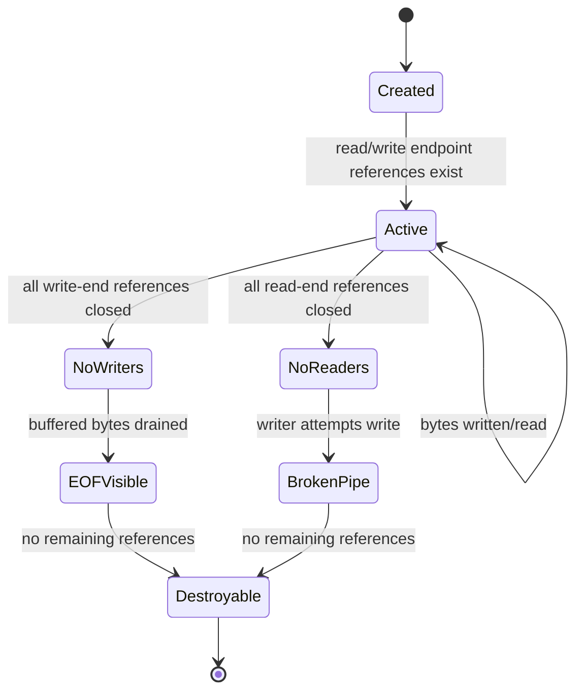
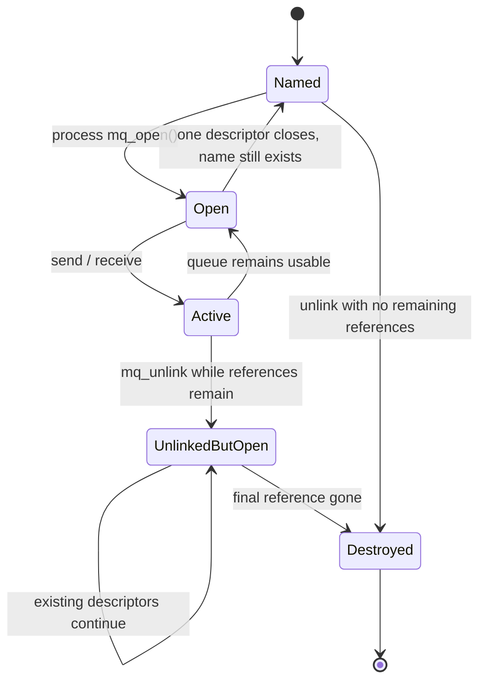
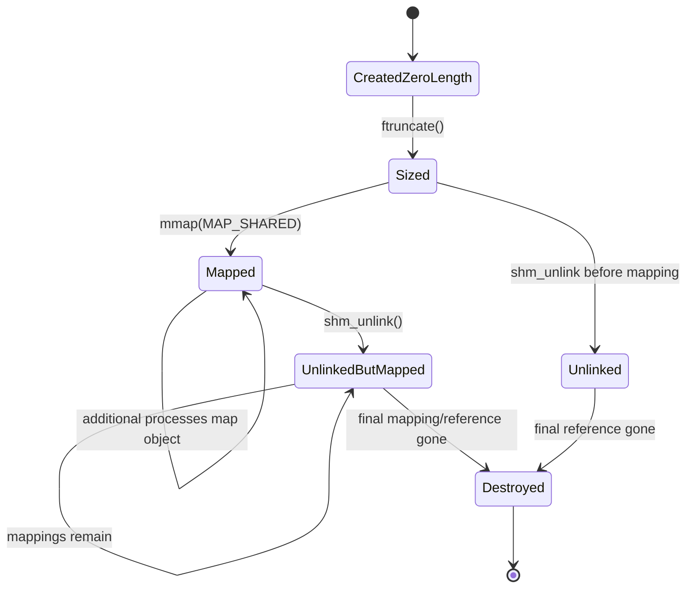

# Chủ đề 8 — Interprocess Communication (IPC) trong Linux

> **Phạm vi:** Linux/POSIX Interprocess Communication fundamentals — IPC model, unnamed pipe, FIFO (named pipe), POSIX message queue, shared memory và Unix domain socket.
>
> Chương này chỉ trình bày **lý thuyết**. Không có lab, bài tập, chương trình mẫu hoàn chỉnh, hướng dẫn biên dịch hoặc thao tác thực hành.
>
> Mục tiêu của chương là xây mental model:
>
> `process isolation → need to exchange data/control → IPC object/channel → communication semantics → lifecycle + blocking + synchronization`
>
> và phân biệt chính xác:
>
> `pipe/FIFO = byte stream`
>
> `message queue = discrete messages`
>
> `shared memory = common mapped memory, synchronization required`
>
> `Unix domain socket = local socket communication with stream/message options`
>
> Đồng thời phải hiểu rằng một IPC mechanism không chỉ khác nhau ở API. Chúng khác nhau ở:
>
> `naming`
>
> `message boundaries`
>
> `directionality`
>
> `copy/shared-memory model`
>
> `blocking and backpressure`
>
> `kernel persistence`
>
> `object lifetime`
>
> `security/permissions`
>
> `synchronization responsibility`
>
> **Giới hạn chủ đề:** chương này không đi sâu vào networking qua TCP/IP, advanced socket event loops (`select/poll/epoll`), `io_uring`, distributed IPC, D-Bus, RPC framework, netlink, shared-memory lock-free queue, zero-copy framework hoặc kernel IPC internals. System V IPC chỉ được dùng để đối chiếu với POSIX message queue/shared memory khi cần.
>
> **Cấu trúc tài liệu:** các mục `##` là các khối kiến thức lớn; phần chi tiết nằm ở `###/####` để giữ mục lục gọn và thống nhất với Topic 01–07.
>
> **Điều hướng:** [← Chủ đề 7 — Thread Synchronization](README-topic-07.md) · [Chủ đề 9 →](README-topic-09.md)

---

## Mục lục

- [1. IPC Fundamentals](#1-ipc-fundamentals)
- [2. Các chiều thiết kế của một IPC Mechanism](#2-các-chiều-thiết-kế-của-một-ipc-mechanism)
- [3. Unnamed Pipe](#3-unnamed-pipe)
- [4. FIFO — Named Pipe](#4-fifo--named-pipe)
- [5. POSIX Message Queue](#5-posix-message-queue)
- [6. POSIX và System V Message Queue](#6-posix-và-system-v-message-queue)
- [7. Shared Memory Fundamentals](#7-shared-memory-fundamentals)
- [8. Synchronization trong Shared Memory](#8-synchronization-trong-shared-memory)
- [9. POSIX và System V Shared Memory](#9-posix-và-system-v-shared-memory)
- [10. Unix Domain Socket Fundamentals](#10-unix-domain-socket-fundamentals)
- [11. Unix Socket Naming và Lifetime](#11-unix-socket-naming-và-lifetime)
- [12. `socketpair()`, Full-duplex IPC và Ancillary Data](#12-socketpair-full-duplex-ipc-và-ancillary-data)
- [13. IPC Blocking, Backpressure và Flow Control](#13-ipc-blocking-backpressure-và-flow-control)
- [14. So sánh và lựa chọn IPC Mechanism](#14-so-sánh-và-lựa-chọn-ipc-mechanism)
- [15. Error Model và Tư duy Debug IPC](#15-error-model-và-tư-duy-debug-ipc)
- [16. Liên hệ với Embedded Linux](#16-liên-hệ-với-embedded-linux)
- [17. Tổng kết và Mental Model](#17-tổng-kết-và-mental-model)
- [18. Tài liệu tham khảo](#18-tài-liệu-tham-khảo)

---

## 1. IPC Fundamentals

### 1.1 Vì sao process cần IPC?

Topic 4 đã xây mental model:

```text
Process A
  virtual address space A

Process B
  virtual address space B
```

Hai process bình thường không trực tiếp nhìn thấy private memory của nhau.

Isolation này rất quan trọng cho:

```text
fault containment
security
address-space protection
independent lifecycle
```

Nhưng một hệ thống thực tế thường gồm nhiều process phải phối hợp:

```text
sensor service
logger
network service
supervisor
UI
database
worker
```

Do đó cần cơ chế:

```text
Interprocess Communication
IPC
```

---

### 1.2 IPC là communication + coordination

IPC thường phục vụ hai loại mục đích:

```text
Data transfer
  gửi bytes/messages/state

Coordination
  báo event
  wake peer
  indicate completion
  control lifecycle
```

Một mechanism có thể làm tốt cả hai hoặc chỉ phù hợp một phần.

Ví dụ:

```text
Pipe
  stream data + EOF lifecycle

Message queue
  discrete messages + priority

Shared memory
  common data region
  but needs separate synchronization

Unix socket
  bidirectional data + local connection semantics
```

---

### 1.3 IPC không chỉ dành cho unrelated processes

Communication có thể giữa:

```text
parent ↔ child

siblings created by same parent

independent long-running services

client ↔ local server
```

Một số IPC objects tự nhiên phù hợp với related processes:

```text
unnamed pipe
socketpair
```

Một số có names để unrelated processes rendezvous:

```text
FIFO pathname
POSIX message queue name
POSIX shared-memory name
Unix pathname socket
```

---

### 1.4 IPC object vs communication endpoint

Important distinction:

```text
IPC object/channel
```

không phải lúc nào cũng giống:

```text
file descriptor
```

Examples:

```text
pipe
  object + read/write fd endpoints

FIFO
  filesystem name → open endpoints

POSIX MQ
  queue object + mqd_t descriptor

shared memory
  object → fd → mmap mapping

Unix socket
  socket endpoint fd
```

The handle is how process refers to communication object.

The object has its own lifecycle and semantics.

---

### 1.5 IPC overview

```text
                         IPC
                          |
       +------------------+------------------+
       |                  |                  |
       v                  v                  v
   Byte Stream         Messages         Shared State
       |                  |                  |
   Pipe/FIFO          Message Queue       Shared Memory
       |
       +------------------------------------------+
                                                  |
                                             Unix Socket
                                       stream / datagram /
                                         sequenced packet
```

---

## 2. Các chiều thiết kế của một IPC Mechanism

### 2.1 Stream vs message-oriented

A stream gives:

```text
bytes
```

without preserving application message boundaries.

Examples:

```text
pipe
FIFO
SOCK_STREAM
```

A message-oriented mechanism preserves units:

```text
message 1
message 2
message 3
```

Examples:

```text
POSIX message queue
SOCK_DGRAM
SOCK_SEQPACKET
```

Shared memory is neither naturally stream nor message.

Application defines structure.

---

### 2.2 Named vs unnamed

Unnamed:

```text
pipe
socketpair
```

usually requires processes to obtain endpoints through inheritance or descriptor transfer.

Named:

```text
FIFO pathname
POSIX MQ name
POSIX SHM name
Unix pathname socket
```

allows processes to locate/rendezvous through a stable name.

---

### 2.3 Unidirectional vs bidirectional

Portable POSIX pipe:

```text
one read end
one write end
```

so it should be treated as:

```text
unidirectional
```

Unix sockets:

```text
bidirectional
```

A bidirectional protocol over pipes generally needs:

```text
two pipes
```

---

### 2.4 Copy-based communication vs shared memory

Stream/message IPC usually follows conceptual path:

```text
Sender userspace
      |
      v
kernel-managed IPC buffer/state
      |
      v
Receiver userspace
```

Shared memory:

```text
Process A mapping ----+
                      |
                      +--> same shared memory object/pages
                      |
Process B mapping ----+
```

After mapping, communication can occur by memory accesses rather than one kernel IPC transfer per message.

But synchronization responsibility becomes larger.

---

### 2.5 Persistent name vs live communication state

Names and communication data do not always have same lifetime.

Example FIFO:

```text
filesystem FIFO entry persists
```

but:

```text
pipe data only exists while FIFO is open/active
```

The named filesystem entry is not a persistent data file.

---

### 2.6 Blocking and nonblocking semantics

Many IPC operations can block because peer/resource is not ready.

Examples:

```text
empty pipe read
full pipe write
empty message queue receive
full message queue send
socket receive with no data
FIFO open waiting for peer
```

Nonblocking mode changes:

```text
wait
```

into:

```text
return immediately with readiness-style error/state
```

where supported.

---

### 2.7 Backpressure

Finite receiver capacity means producer sometimes must slow down.

This is:

```text
backpressure
```

Mental model:

```text
Producer
   |
   v
finite IPC buffer
   |
   v
Consumer

consumer slower than producer
      |
buffer fills
      |
producer blocks/fails/queues elsewhere
```

Backpressure is a fundamental IPC design property.

---

### 2.8 Lifetime and cleanup

Each IPC mechanism has questions:

```text
When is object created?
Who owns the name?
What keeps it alive?
When does peer observe EOF/disconnect?
When is kernel state destroyed?
What remains after process crashes?
```

Ignoring lifecycle creates many IPC bugs.

---

## 3. Unnamed Pipe

### 3.1 Pipe abstraction

POSIX `pipe()` creates an interprocess channel and returns two descriptors:

```text
fd[0]
  read end

fd[1]
  write end
```

Mental model:

```text
Writer
   |
 write(fd[1])
   |
   v
+----------------------+
|      Pipe Buffer     |
+----------------------+
   |
 read(fd[0])
   |
   v
Reader
```

---

### 3.2 Portable directionality

POSIX defines pipe with read and write ends.

Portable mental model:

```text
write end ─────────────> read end
```

Linux uses this unidirectional model.

Some historical systems may support bidirectional pipe behavior, but portable applications must not depend on it.

---

### 3.3 Pipe creates file descriptors, not pathname

Unnamed pipe has no pathname used for rendezvous.

Therefore endpoints normally reach processes through:

```text
fork inheritance
descriptor duplication
descriptor passing
existing process setup
```

Classic parent-child model:

```text
Parent
   |
 pipe()
   |
 fork()
  /   \
 /     \
P       C

both initially inherit references
to both pipe ends
```

Application then conceptually closes unneeded ends.

---

### 3.4 File descriptor inheritance is part of pipe topology

Suppose:

```text
Parent wants to write
Child wants to read
```

Desired topology:

```text
Parent:
  write end open
  read end unused

Child:
  read end open
  write end unused
```

If unused duplicated write ends remain open, EOF detection can be delayed.

Thus fd lifetime is part of communication semantics.

---

### 3.5 Pipe is a kernel communication object

Data written into pipe is held in kernel-managed pipe buffers.

Pipe is not:

```text
temporary regular file
```

and cannot be treated as seekable storage.

---

### 3.1 Pipe I/O Semantics

#### 3.1.1 Pipe is a byte stream

Linux `pipe(7)` explicitly states:

```text
there is no concept of message boundaries
```

Suppose writer conceptually does:

```text
write "ABC"
write "DEF"
```

Reader might observe:

```text
"ABCDEF"
```

or consume:

```text
"AB"
then
"CDEF"
```

depending read sizes/timing.

Application must define framing if it needs logical messages.

---

#### 3.1.2 FIFO order means byte order, not application records

Bytes are consumed in order.

Mental model:

```text
written:

A B C D E F

read stream:

A B C D E F
```

But the pipe does not record:

```text
write #1 = ABC
write #2 = DEF
```

as permanent message metadata.

---

#### 3.1.3 `read()` on pipe

Concept:

```text
pipe has data?
   /      \
 yes       no
 |          |
return      writers exist?
bytes        /       \
            yes       no
            |          |
          block       EOF
          or EAGAIN   read returns 0
```

Blocking/nonblocking state changes exact result.

---

#### 3.1.4 Empty pipe is not always EOF

Important distinction:

```text
empty pipe
```

can mean:

```text
temporarily no data
```

or:

```text
no writers remain
```

If writer references still exist:

```text
blocking read waits
```

If all write-end references are closed:

```text
read returns 0
```

EOF is a **lifetime condition**, not merely buffer emptiness.

---

#### 3.1.5 `lseek()` does not apply

Pipe represents a flowing stream, not a random-access byte-addressable regular file.

Therefore:

```text
lseek(pipe_fd, ...)
```

is not meaningful and fails.

---

#### 3.1.6 Pipe is not a message protocol

If application sends structured objects:

```text
header
payload
header
payload
```

it must define framing using:

```text
fixed-size records
length prefix
delimiter
state machine
```

The pipe only provides ordered bytes.

---

### 3.2 Pipe Lifetime, EOF và `SIGPIPE`

#### 3.2.1 Pipe lifetime depends on open references

Kernel tracks references to both ends.

Mental model:

```text
Read-end references:  R
Write-end references: W
```

Communication state depends on whether:

```text
R > 0
W > 0
```

---

#### 3.2.2 EOF condition

If:

```text
W == 0
```

and buffered data has been consumed:

```text
reader sees EOF
read() returns 0
```

This is why leaked write descriptors can cause a reader to wait unexpectedly.

---

#### 3.2.3 Broken pipe condition

If:

```text
R == 0
```

and process writes:

```text
SIGPIPE is generated
```

Default SIGPIPE action is process termination.

If SIGPIPE is ignored/handled as appropriate:

```text
write() fails with EPIPE
```

This connects Topic 3 and Topic 5.

---

#### 3.2.4 Closing one descriptor is not enough if duplicates exist

Because:

```text
dup()
fork()
```

can create multiple descriptor references to same pipe end.

Example:

```text
Parent write fd ----+
                    +--> pipe write end
Child write fd -----+
```

Closing one still leaves writer reference alive.

EOF only occurs after **all** write-end references disappear.

---

#### 3.2.5 Pipe lifecycle state machine



This is a simplified lifecycle model; kernel reference details are more complex.

---

### 3.3 Pipe Capacity, Backpressure và Atomic Write

#### 3.3.1 Pipe has finite capacity

A pipe is not infinite storage.

Concept:

```text
+--------------------------+
| finite kernel pipe buffer|
+--------------------------+
```

If producer is faster:

```text
buffer fills
```

then writer must:

```text
block
```

or under nonblocking mode:

```text
return readiness/error result
```

---

#### 3.3.2 Capacity is implementation-specific

Linux pipe capacity has changed across kernel versions and can be affected by resource limits/configuration.

Therefore portable application should not treat:

```text
"pipe holds exactly X bytes"
```

as a protocol assumption.

---

#### 3.3.3 `PIPE_BUF` is not pipe capacity

Very important:

```text
PIPE_BUF
```

is related to **atomic write guarantees**.

It is not:

```text
total pipe buffer capacity
```

These are different concepts.

---

#### 3.3.4 Atomic writes up to `PIPE_BUF`

POSIX requires writes up to the relevant `PIPE_BUF` limit to be atomic with respect to interleaving from other pipe writers.

Concept:

```text
Writer A writes record A <= PIPE_BUF
Writer B writes record B <= PIPE_BUF

Reader sees:
AAAA...BBBB...
or
BBBB...AAAA...
```

not arbitrary byte interleaving inside those individual writes.

---

#### 3.3.5 Writes larger than `PIPE_BUF`

A larger write can be interleaved with data from another writer.

Conceptually:

```text
A chunk
B chunk
A chunk
B chunk
```

Therefore `PIPE_BUF` can be important for multi-writer record framing.

---

#### 3.3.6 Linux value vs POSIX requirement

POSIX requires:

```text
PIPE_BUF >= 512 bytes
```

Linux commonly defines pipe `PIPE_BUF` as:

```text
4096 bytes
```

Application portability should rely on symbolic/system-defined value, not hard-coded Linux number.

---

#### 3.3.7 Atomic write does not mean atomic application transaction

Even if one `write()` is atomic:

```text
multiple writes
```

making one logical message are not automatically atomic together.

Example:

```text
write(header)
write(payload)
```

another writer can potentially insert data between operations.

---

#### 3.3.8 Backpressure is useful, not merely a limitation

Blocking when buffer fills can naturally constrain producer:

```text
fast producer
   |
pipe full
   |
producer sleeps
   |
consumer catches up
```

This is implicit flow control.

But it can also create deadlock if both sides wait on full/empty channels incorrectly.

---

## 4. FIFO — Named Pipe

### 4.1 FIFO is a pipe with filesystem rendezvous name

FIFO means:

```text
First In First Out special file
```

Common term:

```text
named pipe
```

Mental model:

```text
Filesystem namespace

/tmp/service.fifo
        |
        v
FIFO special file
        |
        v
kernel pipe object while opened
```

---

### 4.2 FIFO pathname does not store communication data

Linux `fifo(7)` emphasizes:

```text
data passes internally through kernel
```

The filesystem FIFO entry has no regular-file data contents.

It acts as:

```text
reference/rendezvous point
```

for processes to open the same channel.

---

### 4.3 FIFO allows unrelated processes to rendezvous

Unlike an unnamed pipe, processes do not need to inherit pre-created descriptors.

They can independently know:

```text
same FIFO pathname
```

and open it subject to permissions.

---

### 4.4 FIFO permissions

FIFO is a filesystem object with:

```text
owner
group
permission bits
```

and creation mode affected by:

```text
umask
```

This makes filesystem access policy part of IPC access control.

---

### 4.5 FIFO and pipe share I/O semantics after open

Linux `pipe(7)` states that after creation/opening differences are resolved:

```text
pipe and FIFO I/O semantics are the same
```

Therefore FIFO is also:

```text
byte stream
no message boundaries
finite capacity
EOF based on writer references
SIGPIPE/EPIPE based on reader references
not seekable
```

---

### 4.1 FIFO Open/Lifetime Semantics

#### 4.1.1 Opening FIFO is itself synchronization

In blocking mode, opening one side normally waits for peer side.

Concept:

```text
Reader:
open FIFO for read
      |
      | no writer yet
      v
     wait


Writer:
open FIFO for write
      |
      v
rendezvous
```

Opening the FIFO can therefore participate in process coordination.

---

#### 4.1.2 Blocking read-only open

POSIX semantics:

```text
open FIFO O_RDONLY
without O_NONBLOCK
```

waits until a writer opens the FIFO.

---

#### 4.1.3 Blocking write-only open

Likewise:

```text
open FIFO O_WRONLY
without O_NONBLOCK
```

waits until a reader opens the FIFO.

---

#### 4.1.4 Nonblocking open

With nonblocking mode:

```text
read-only open
  can return without waiting for writer

write-only open
  fails if no reader exists
```

On Linux this write-side failure is:

```text
ENXIO
```

---

#### 4.1.5 Linux read-write open is nonportable

Linux allows opening a FIFO:

```text
O_RDWR
```

even without another process on peer side.

POSIX leaves this behavior undefined.

Therefore portable IPC design should not rely on self-opening FIFO as both ends.

---

#### 4.1.6 FIFO name lifetime vs data lifetime

The pathname can remain after processes close it:

```text
FIFO special-file name persists
```

until explicitly removed.

But kernel communication state/data is not a persistent regular-file log.

Concept:

```text
pathname lifetime
      !=
buffered communication-data lifetime
```

---

#### 4.1.7 Exactly one active pipe object per opened FIFO pathname on Linux

Linux `fifo(7)` explains kernel maintains one pipe object for a FIFO special file while it is opened by at least one process.

Thus multiple openers rendezvous on same active FIFO channel.

---

## 5. POSIX Message Queue

### 5.1 Why message queue differs from pipe

Pipe:

```text
A B C D E F
```

Message queue:

```text
[message A]
[message B]
[message C]
```

Message boundaries are part of the abstraction.

---

### 5.2 Message queue is kernel-managed discrete storage

Concept:

```text
Sender
  |
  | send message
  v
+-----------------------+
| Kernel Message Queue  |
|-----------------------|
| message 1             |
| message 2             |
| message 3             |
+-----------------------+
  |
  | receive message
  v
Receiver
```

---

### 5.3 Message-oriented communication simplifies framing

With a queue, application does not need stream parser merely to recover message boundaries.

Receiver gets:

```text
one selected message
```

per receive operation according to queue semantics.

---

### 5.4 Message queue is not shared memory

Sender does not generally hand receiver direct access to sender buffer.

Conceptually:

```text
send message into queue
receive message from queue
```

Queue is an IPC object holding discrete messages.

---

### 5.5 Message queue is bounded

A queue has limits such as:

```text
maximum messages
maximum message size
resource/accounting limits
```

Thus it also implements backpressure.

---

### 5.1 POSIX Message Queue

#### 5.1.1 POSIX message queue naming

POSIX message queue is identified by a name.

Portable Linux/POSIX style:

```text
/name
```

Processes knowing same queue name can open same queue.

---

#### 5.1.2 `mq_open()` returns `mqd_t`

Message queue descriptor:

```text
mqd_t
```

is the handle used by:

```text
mq_send()
mq_receive()
mq_getattr()
mq_setattr()
mq_close()
```

Application should treat `mqd_t` as POSIX abstraction.

---

#### 5.1.3 Linux implementation detail: `mqd_t` is fd-like

On Linux, message queue descriptors are implemented as file descriptors and can integrate with Linux fd readiness mechanisms.

But:

> POSIX does not require message queue descriptor to be a file descriptor.

Therefore portable architecture must not equate:

```text
mqd_t == ordinary fd
```

as a universal rule.

---

#### 5.1.4 Open message queue description

Linux `mq_overview(7)` explains message queue descriptors refer to:

```text
open message queue descriptions
```

After `fork()`:

```text
parent mqd
child mqd
```

can refer to same open message queue description and share associated flags such as:

```text
mq_flags
```

This resembles Topic 3 open-file-description thinking.

---

#### 5.1.5 Queue attributes

Important attributes include concepts such as:

```text
mq_maxmsg
  maximum number of messages

mq_msgsize
  maximum message size

mq_curmsgs
  current queued messages

mq_flags
  e.g. nonblocking state
```

Exact limits are system/resource dependent.

---

#### 5.1.6 Message priority

Each POSIX message has:

```text
priority
```

Receiver selects:

```text
oldest message among highest-priority available messages
```

Thus queue is not simply:

```text
global FIFO regardless of priority
```

FIFO ordering applies among messages at same selected priority level.

---

#### 5.1.7 Priority is queue selection metadata

Application may model:

```text
urgent control message
normal telemetry
background work
```

but priority semantics should be used carefully.

High-priority traffic can potentially delay lower-priority traffic if continuously produced.

---

### 5.2 Message Queue Blocking, Priority và Lifetime

#### 5.2.1 Empty queue receive

Default blocking behavior:

```text
queue empty
   |
mq_receive()
   |
   v
wait until message arrives
```

unless interrupted or timeout/nonblocking rules apply.

---

#### 5.2.2 Nonblocking receive

If:

```text
O_NONBLOCK
```

is active and queue empty:

```text
mq_receive()
  -> EAGAIN
```

No message is removed.

---

#### 5.2.3 Full queue send

If queue already contains maximum messages:

```text
mq_send()
```

normally blocks until space becomes available.

With:

```text
O_NONBLOCK
```

send fails immediately with:

```text
EAGAIN
```

---

#### 5.2.4 Timed operations

POSIX message queues provide timed send/receive variants.

Concept:

```text
wait for queue space/message
        |
        +--> condition becomes available
        |
        +--> deadline expires
```

This bounds blocking time.

---

#### 5.2.5 Queue persistence

Linux POSIX message queues have kernel persistence.

If not:

```text
mq_unlink()
```

queue can remain until system shutdown.

Therefore:

```text
all processes close queue
```

does not necessarily destroy queue object/name.

This differs from unnamed pipe.

---

#### 5.2.6 `mq_close()` vs `mq_unlink()`

Conceptual distinction:

```text
mq_close()
  release this process's descriptor/reference

mq_unlink()
  remove queue name
```

The object can continue to exist while existing references remain according to unlink semantics.

Naming and open-reference lifetime are separate.

---

#### 5.2.7 Message queue lifecycle state machine



This is a conceptual lifecycle; exact kernel reference management is implementation-specific.

---

#### 5.2.8 Linux `/dev/mqueue` is implementation detail

Linux can expose POSIX queues through:

```text
mqueue virtual filesystem
```

commonly mounted under:

```text
/dev/mqueue
```

This helps administration/observation.

It is not a portable POSIX requirement that every implementation represents queues there.

---

## 6. POSIX và System V Message Queue

### 6.1 System V IPC

Linux supports older System V IPC mechanisms:

```text
message queues
semaphores
shared memory
```

System V message queue API includes concepts around:

```text
msgget()
msgsnd()
msgrcv()
msgctl()
```

---

### 6.2 POSIX MQ and System V MQ solve similar problem

Both provide:

```text
kernel-managed discrete messages
```

between processes.

But APIs and naming/selection models differ.

---

### 6.3 POSIX MQ

Conceptually emphasizes:

```text
named queue
mqd_t descriptor
message priorities
mq_* API
```

---

### 6.4 System V MQ

Conceptually emphasizes:

```text
key / IPC identifier
message type field
System V IPC identifier namespace
msg* APIs
```

---

### 6.5 Linux man-pages recommendation context

`mq_overview(7)` describes POSIX message queues as a better-designed alternative API, while System V queues remain widely available, especially on older UNIX systems.

For modern Linux learning:

```text
POSIX MQ
```

is usually the cleaner conceptual starting point.

---

### 6.6 IPC namespaces

Linux IPC namespaces isolate:

```text
System V IPC objects
POSIX message queues
```

Processes in different IPC namespaces do not see the same such objects.

This matters in:

```text
containers
service isolation
```

but detailed namespace management belongs a later advanced topic.

---

## 7. Shared Memory Fundamentals

### 7.1 Shared memory changes the communication model

Pipe/message queue:

```text
sender operation
   |
kernel communication object
   |
receiver operation
```

Shared memory:

```text
Process A virtual memory
      |
      +----> shared object/pages <----+
                                      |
                               Process B mapping
```

Processes directly access common mapped data.

---

### 7.2 Shared memory removes message-transfer abstraction

There is no inherent:

```text
send()
receive()
message boundary
queue
```

Once mapped:

```text
load/store memory
```

becomes data access mechanism.

Application defines structure.

---

### 7.3 Shared memory can reduce copying/IPC transition overhead

After setup, data can be accessed from shared mapped pages rather than copied into and out of a kernel message/stream buffer for each logical transfer.

This can make shared memory attractive for:

```text
large data
high throughput
low-latency local sharing
```

But performance is workload/cache/synchronization dependent.

Do not treat:

```text
shared memory = always fastest
```

as universal rule.

---

### 7.4 Shared memory provides data sharing, not coordination

If Process A writes:

```text
buffer
```

Process B still needs to know:

```text
when data is valid
which slot is ready
who owns it
whether producer is finished
whether buffer is full
```

Therefore shared memory commonly requires separate synchronization.

---

### 7.5 Shared memory structure

Concept:

```text
+------------------------------------+
| Shared Memory Region               |
|------------------------------------|
| control metadata                   |
| producer index                     |
| consumer index                     |
| state flags                        |
| payload buffers                    |
| optional synchronization objects   |
+------------------------------------+
```

Application defines memory layout.

---

### 7.1 POSIX Shared Memory Lifecycle

#### 7.1.1 POSIX shared-memory object

POSIX shared memory provides a named memory object.

Core conceptual sequence:

```text
shm_open
   |
   v
shared-memory object fd
   |
ftruncate
   |
set object size
   |
mmap(MAP_SHARED)
   |
process mapping
```

---

#### 7.1.2 New object starts with size zero

Linux/POSIX documentation states newly created shared-memory object initially has:

```text
length = 0
```

Object size is established using:

```text
ftruncate()
```

before expected mapping/use.

---

#### 7.1.3 `shm_open()` resembles `open()`

It returns a file descriptor referring to shared-memory object.

This fd is used for:

```text
size management
mmap
metadata operations
```

---

#### 7.1.4 Mapping and descriptor lifetime are separate

After successful:

```text
mmap()
```

the shared-memory object fd can be closed without invalidating the mapping.

Mental model:

```text
fd
 |
 mmap
 |
 v
mapping reference

close(fd)
 |
mapping remains
```

This mirrors general mmap reference semantics from Topic 3/4 memory concepts.

---

#### 7.1.5 `shm_unlink()` removes the name

Concept:

```text
shm_unlink(name)
```

removes namespace entry.

Existing mappings/references can remain usable.

Object is finally destroyed when unlink has occurred and remaining references/mappings are gone according to object lifetime semantics.

---

#### 7.1.6 Linux persistence

Linux `shm_overview(7)` describes POSIX SHM objects as kernel-persistent until:

```text
system shutdown
```

or:

```text
object has been unlinked and all mappings/references are gone
```

---

#### 7.1.7 Linux `/dev/shm`

Linux commonly implements POSIX shared-memory objects in:

```text
tmpfs
```

normally mounted under:

```text
/dev/shm
```

This is Linux implementation behavior, not reason to treat shared-memory object as ordinary persistent disk file.

---

#### 7.1.8 Shared-memory lifecycle state machine



The diagram focuses naming/mapping lifetime rather than every kernel reference.

---

### 7.2 `mmap()` và `MAP_SHARED`

#### 7.2.1 `mmap()` connects process address space to memory object

POSIX:

```text
mmap()
```

establishes mapping between:

```text
process virtual address range
```

and:

```text
memory object
```

---

#### 7.2.2 `MAP_SHARED`

With:

```text
MAP_SHARED
```

writes affect the shared underlying memory object and are visible through other shared mappings according to synchronization/memory semantics.

Concept:

```text
Process A map
  write X
     |
     v
shared object
     |
     v
Process B map
  can observe X
```

---

#### 7.2.3 `MAP_PRIVATE` is not IPC shared-write mapping

`MAP_PRIVATE` means modifications are private to calling process mapping and do not modify underlying object in shared fashion.

Therefore it is not equivalent to:

```text
POSIX shared writable memory
```

for process communication.

---

#### 7.2.4 Mapping addresses can differ between processes

Important:

```text
Process A:
shared region mapped at VA 0xAAAA...

Process B:
same object mapped at VA 0xBBBB...
```

Processes need not map it at same virtual address.

Therefore raw process-local pointers stored inside shared-memory structures can be invalid in another process.

---

#### 7.2.5 Prefer location-independent shared structures conceptually

Shared structure should use concepts such as:

```text
offsets
indices
fixed layout
relative positions
```

rather than assuming same virtual address in every process.

Example:

```text
BAD conceptual shared field:
pointer = 0x7f123456

BETTER:
offset = 4096 from region base
```

Exact data-structure design is application-specific.

---

#### 7.2.6 Object size matters

Mapping can extend beyond current object size, but accessing pages beyond valid object backing can result in:

```text
SIGBUS
```

on Linux/POSIX-relevant conditions.

Therefore underlying shared object resizing is itself a synchronization/lifecycle concern.

---

#### 7.2.7 `close()` does not unmap

Once mapping exists:

```text
close(fd)
```

removes fd reference, not mapping.

Mapping is removed by:

```text
munmap()
```

or process/address-space teardown.

---

## 8. Synchronization trong Shared Memory

### 8.1 Shared memory without synchronization is incomplete for mutable state

Two processes can concurrently write same memory.

Example:

```text
Process A            Process B

read index = 5
                     read index = 5
write slot 5
                     write slot 5
increment
                     increment
```

Shared memory does not prevent:

```text
race conditions
```

---

### 8.2 Same synchronization principles as threads

Topic 7 applies conceptually:

```text
mutex
semaphore
condition variable
atomic protocol
ownership
barrier
```

But synchronization objects must be configured appropriately for:

```text
process-shared use
```

when stored in shared mappings.

---

### 8.3 `PTHREAD_PROCESS_SHARED`

POSIX synchronization objects such as mutex/condition/rwlock can be configured for process-shared use where supported.

Concept:

```text
Shared memory
  |
  +--> pthread mutex [PROCESS_SHARED]
  +--> condition variable [PROCESS_SHARED]
  +--> application data
```

Both processes map same synchronization object storage.

---

### 8.4 POSIX semaphore

A process-shared unnamed semaphore can also live in shared memory.

This is a common conceptual pair:

```text
shared memory
+
semaphore
```

---

### 8.5 Data plane vs synchronization plane

Useful architecture distinction:

```text
Data plane:
  shared memory payload

Control/synchronization plane:
  mutex / semaphore / condition / event mechanism
```

Shared memory answers:

```text
where is data?
```

Synchronization answers:

```text
when and by whom may it be read/written?
```

---

### 8.6 Crash recovery

If process dies while owning shared synchronization/resource state:

```text
other processes may block
shared invariant may be inconsistent
```

Robust mutex from Topic 7 can detect selected owner-death cases.

But application still must recover data invariant.

---

### 8.7 Shared memory does not provide event notification by itself

If producer changes memory:

```text
consumer sleeping somewhere else
```

nothing inherently wakes consumer.

Application may use:

```text
condition variable
semaphore
eventfd
socket/pipe control channel
```

depending architecture.

Topic 8 stays focused on core IPC mechanisms, so these are conceptual complements.

---

## 9. POSIX và System V Shared Memory

### 9.1 POSIX shared memory

Core API model:

```text
name
  |
shm_open()
  |
fd
  |
ftruncate()
  |
mmap()
```

It integrates naturally with file-descriptor/mmap model.

---

### 9.2 System V shared memory

Older System V model uses concepts around:

```text
shmget()
shmat()
shmdt()
shmctl()
```

and IPC identifiers/keys.

---

### 9.3 Both solve common-memory problem

Both let processes access:

```text
same shared memory region
```

but setup, naming and lifecycle APIs differ.

---

### 9.4 POSIX interface is often easier to connect to existing Linux concepts

It reuses mental models already learned:

```text
name
file descriptor
ftruncate
mmap
unlink-like lifetime
```

System V is still important in legacy software and some existing systems.

---

### 9.5 System V IPC namespace

Linux IPC namespaces isolate System V IPC objects.

POSIX shared memory is implemented through filesystem/tmpfs semantics and interacts more naturally with filesystem/mount namespace concepts rather than being one of the POSIX MQ/System V objects isolated by IPC namespace.

Detailed namespace behavior belongs advanced container topics.

---

## 10. Unix Domain Socket Fundamentals

### 10.1 Local sockets

Unix domain sockets use:

```text
AF_UNIX
```

also known as:

```text
AF_LOCAL
```

for communication between processes on the same machine.

Mental model:

```text
Process A
   |
Unix socket endpoint
   |
   v
local kernel socket subsystem
   |
   v
Unix socket endpoint
   |
Process B
```

---

### 10.2 Same socket programming abstraction as networking

Unix sockets reuse socket concepts:

```text
socket()
bind()
listen()
accept()
connect()
send()/recv()
read()/write()
shutdown()
close()
```

But address family is local-machine IPC rather than IP network.

This makes Unix sockets attractive for:

```text
local client/server architecture
```

that may resemble network protocol design.

---

### 10.3 Bidirectional communication

Unlike portable pipe:

```text
Unix stream socket
```

is naturally full-duplex.

Concept:

```text
Process A <==========> Process B
          two-way
```

Both endpoints can send and receive.

---

### 10.4 Connection-oriented and connectionless options

Unix domain supports several socket types, notably:

```text
SOCK_STREAM
SOCK_DGRAM
SOCK_SEQPACKET
```

Each gives different communication semantics.

---

### 10.1 Unix Socket Types và Message Boundaries

#### 10.1.1 `SOCK_STREAM`

Properties:

```text
connection-oriented
reliable
ordered
bidirectional
byte stream
```

Like pipe, it does **not** preserve application message boundaries.

Application needs framing.

---

#### 10.1.2 `SOCK_DGRAM`

Unix-domain datagram socket preserves:

```text
datagram/message boundaries
```

Linux `unix(7)` also documents AF_UNIX datagram sockets as reliable and non-reordering on Linux.

Important distinction:

Generic Internet-style datagram intuition should not be blindly transferred to Linux AF_UNIX datagrams.

---

#### 10.1.3 `SOCK_SEQPACKET`

Properties:

```text
connection-oriented
reliable
ordered
preserves record/message boundaries
```

This combines:

```text
connection semantics
+
message framing
```

---

#### 10.1.4 Comparison

| Type | Connection | Bidirectional | Message boundary |
|---|---:|---:|---:|
| `SOCK_STREAM` | Yes | Yes | No |
| `SOCK_DGRAM` | No connection requirement in datagram model | Yes in endpoint sense | Yes |
| `SOCK_SEQPACKET` | Yes | Yes | Yes |

Exact support/behavior should always be checked for target platform.

---

#### 10.1.5 Stream framing problem

For stream socket:

```text
send logical message A
send logical message B
```

receiver sees ordered bytes, not guaranteed receive-call alignment.

Exactly like pipe:

```text
send call boundaries
  !=
receive call boundaries
```

---

## 11. Unix Socket Naming và Lifetime

### 11.1 Three Linux naming forms

Linux `unix(7)` describes:

```text
unnamed
pathname
abstract namespace
```

---

### 11.2 Unnamed socket

Sockets created by:

```text
socketpair()
```

are unnamed.

No filesystem rendezvous name.

Endpoints are handed/inherited directly.

---

### 11.3 Pathname Unix socket

Server can bind socket to filesystem pathname.

Concept:

```text
/run/my-service.sock
       |
       v
socket filesystem entry
       |
       v
local server endpoint
```

Client knowing pathname can connect.

---

### 11.4 Filesystem permissions

Pathname socket creates filesystem object.

On Linux, normal filesystem ownership/mode rules participate in access control.

Creation mode is affected by:

```text
umask
```

---

### 11.5 Pathname entry lifetime

Closing socket does not necessarily remove pathname entry.

Application normally manages:

```text
unlink()
```

of pathname.

Stale socket pathname after crash can therefore affect future bind attempts.

---

### 11.6 Linux abstract namespace

Linux-specific abstract Unix sockets use a name whose first `sun_path` byte is NUL.

They are:

```text
not filesystem pathnames
```

Therefore:

```text
filesystem ownership/mode/umask
```

do not control them in same way.

---

### 11.7 Abstract sockets are nonportable

Abstract namespace is a Linux extension.

Portable Unix-domain design should generally use standardized/pathname-compatible concepts unless Linux specificity is intentional.

---

### 11.8 Abstract lifetime

Linux abstract socket names disappear automatically when all references are closed.

This differs from pathname socket file requiring filesystem cleanup.

---

## 12. `socketpair()`, Full-duplex IPC và Ancillary Data

### 12.1 `socketpair()`

`socketpair()` creates:

```text
two connected socket endpoints
```

Concept:

```text
fd A <==========> fd B
```

On Linux, AF_UNIX is common domain for this.

---

### 12.2 Similar use case to pipe, but bidirectional

Pipe:

```text
A --------> B
```

Socket pair:

```text
A <=======> B
```

This makes socketpair useful for related-process bidirectional control/data channels.

---

### 12.3 Socket pair can preserve messages depending type

A socket pair may be created with socket type whose semantics determine:

```text
stream
datagram
sequenced packet
```

Thus it can offer stronger message semantics than a byte-stream pipe.

---

### 12.4 File descriptor passing

Linux/Unix domain sockets support ancillary data that can transfer file descriptors.

This is one of their most powerful IPC properties.

Mental model:

```text
Process A
  owns fd X
      |
send ancillary fd
      |
      v
Unix domain socket
      |
      v
Process B
  receives a new fd reference
  to underlying kernel object
```

The integer fd number itself is not copied as universal identity.

Receiver gets its own descriptor entry referring to transferred resource.

---

### 12.5 What can be transferred conceptually?

A descriptor may refer to objects such as:

```text
regular file
pipe end
socket
device
event object
shared-memory fd
```

depending system/permissions/object semantics.

This enables capability-like designs:

```text
broker opens privileged resource
passes fd to less-privileged worker
```

Detailed security architecture is outside Topic 8.

---

### 12.6 Credentials

Linux Unix sockets also support peer/ancillary credential mechanisms such as:

```text
SO_PEERCRED
SCM_CREDENTIALS
```

under Linux-specific semantics.

This allows local services to reason about peer process credentials without inventing an application password merely to identify local OS principal.

---

### 12.7 Ancillary data is an advanced extension of socket message model

`sendmsg()/recvmsg()` use control messages to carry metadata such as:

```text
SCM_RIGHTS
SCM_CREDENTIALS
```

The main Topic 8 point is:

> Unix domain sockets can transport not only application bytes but selected kernel object references/metadata.

---

## 13. IPC Blocking, Backpressure và Flow Control

### 13.1 All buffered IPC channels face producer/consumer imbalance

General model:

```text
Producer rate > Consumer rate
        |
        v
buffer/queue grows
        |
finite capacity reached
        |
        v
backpressure required
```

Different mechanisms implement this differently.

---

### 13.2 Pipe/FIFO

Finite kernel pipe capacity.

Full:

```text
writer blocks
```

or nonblocking:

```text
EAGAIN / partial semantics
```

depending request size/mode.

---

### 13.3 POSIX Message Queue

Finite:

```text
mq_maxmsg
```

Full queue:

```text
send blocks
```

or:

```text
EAGAIN
```

in nonblocking mode.

---

### 13.4 Unix socket

Socket send/receive buffering is finite.

If peer does not read sufficiently:

```text
sender may eventually block
```

or receive nonblocking readiness result.

Thus even local socket protocol needs flow-control thinking.

---

### 13.5 Shared memory has no automatic backpressure

A shared-memory buffer can be overwritten unless application protocol tracks:

```text
free slots
used slots
producer index
consumer index
ownership
```

Backpressure must be explicitly implemented.

This is both power and risk.

---

### 13.6 Blocking is not always bad

Blocking can simplify control:

```text
nothing useful to do
   |
sleep
   |
resource ready
   |
wake
```

This avoids busy waiting.

But blocking graph can deadlock if processes wait cyclically.

---

### 13.7 Nonblocking does not eliminate flow-control responsibility

Nonblocking simply changes:

```text
sleep
```

to:

```text
return "not ready"
```

Application must decide:

```text
retry?
wait for readiness?
drop data?
buffer elsewhere?
apply backpressure upstream?
```

---

### 13.8 IPC protocol should define overload behavior

A robust architecture must answer:

```text
What if producer is permanently faster?

Block?
Drop newest?
Drop oldest?
Reject request?
Bound queue?
Backpressure source?
```

No IPC primitive can choose correct application policy automatically.

---

## 14. So sánh và lựa chọn IPC Mechanism

### 14.1 High-level comparison

| Mechanism | Data model | Named? | Direction | Message boundaries | Typical kernel persistence |
|---|---|---:|---|---:|---|
| Pipe | byte stream | No | one-way portable model | No | endpoint/reference lifetime |
| FIFO | byte stream | Yes, filesystem | one-way stream model | No | pathname persists until unlink |
| POSIX MQ | messages | Yes | sender/receiver queue | Yes | kernel-persistent until unlink/shutdown on Linux |
| POSIX SHM | shared memory | Yes | common region | Application-defined | object persists by name/reference rules |
| Unix stream socket | byte stream | pathname/abstract/unnamed | bidirectional | No | endpoint lifetime; pathname may persist |
| Unix datagram socket | messages | pathname/abstract/unnamed | bidirectional | Yes | endpoint/name rules |
| Unix seqpacket socket | records | pathname/abstract/unnamed | bidirectional | Yes | endpoint/name rules |

---

### 14.2 Pipe — natural strengths

Good conceptual fit when:

```text
simple ordered byte stream
related processes
shell-like pipeline
one-direction data flow
EOF lifecycle useful
```

Limitations:

```text
no message boundaries
portable one-way model
rendezvous usually via inherited fd
```

---

### 14.3 FIFO — natural strengths

Good when:

```text
pipe semantics desired
but unrelated processes need filesystem name
```

Tradeoffs:

```text
pathname lifecycle
open rendezvous semantics
filesystem permissions
still no message boundaries
```

---

### 14.4 Message queue — natural strengths

Good when:

```text
discrete messages
priority matters
kernel should hold queued messages
producer and consumer lifetimes may differ
```

Tradeoffs:

```text
bounded message size/count
copying/queue overhead
kernel resource limits
persistence cleanup
```

---

### 14.5 Shared memory — natural strengths

Good when:

```text
large data
high throughput
many accesses to same data
copying should be minimized
```

Tradeoffs:

```text
synchronization required
data structure/lifetime complexity
crash recovery
no inherent message framing
no inherent wakeup
```

---

### 14.6 Unix domain socket — natural strengths

Good when:

```text
local client/server
bidirectional communication
network-like programming model
stream or record semantics
multiple clients
fd/credential passing
```

Tradeoffs:

```text
protocol/framing still required for stream
connection lifecycle
socket pathname cleanup
more complex API than pipe
```

---

### 14.7 Related vs unrelated processes

A useful first decision:

```text
Related processes?
   |
   +--> pipe/socketpair can be natural

Unrelated independently started services?
   |
   +--> named FIFO
   +--> named MQ
   +--> named SHM
   +--> pathname Unix socket
```

This is not an absolute rule, but a useful design heuristic.

---

### 14.8 Data size and communication pattern

Conceptual guide:

```text
small discrete control messages
  -> message queue / datagram-style socket

continuous byte stream
  -> pipe/FIFO/stream socket

large shared datasets
  -> shared memory

local service RPC-like channel
  -> Unix domain socket
```

Actual choice must include lifecycle/security/backpressure requirements.

---

### 14.9 Do not choose solely by benchmark speed

The “fastest” mechanism is not always the best architecture.

Correct choice considers:

```text
complexity
fault isolation
message semantics
security
resource limits
debuggability
recovery
throughput
latency
portability
```

---

## 15. Error Model và Tư duy Debug IPC

### 15.1 Debug by layers

```text
1. Same IPC object/name?
      ↓
2. Permissions correct?
      ↓
3. Endpoint/reference alive?
      ↓
4. Blocking or nonblocking?
      ↓
5. Peer exists?
      ↓
6. Buffer/queue full or empty?
      ↓
7. Message/stream framing correct?
      ↓
8. Lifetime/unlink correct?
      ↓
9. Synchronization correct?
      ↓
10. Namespace/container boundary?
```

---

### 15.2 Pipe reader waits forever

Possible:

```text
writer genuinely still active
unused write-end descriptor leaked
another process inherited write end
protocol never writes expected bytes
```

EOF needs all writer references closed.

---

### 15.3 Pipe writer gets `EPIPE` / `SIGPIPE`

Interpret:

```text
no readers remain
```

not:

```text
pipe buffer full
```

Full buffer has different blocking/EAGAIN behavior.

---

### 15.4 Pipe messages appear merged

Expected if application assumed:

```text
one write = one message
```

Pipe is byte stream.

Need application framing.

---

### 15.5 FIFO open blocks unexpectedly

Check:

```text
read side waiting for writer?
write side waiting for reader?
O_NONBLOCK?
peer process reached open?
```

Opening FIFO is part of synchronization.

---

### 15.6 FIFO pathname exists but communication fails

Path existence only means:

```text
FIFO special-file rendezvous object exists
```

It does not prove:

```text
reader exists
writer exists
data flowing
permissions correct
```

Same lesson as device-node existence from Topic 2.

---

### 15.7 POSIX MQ send blocks

Likely:

```text
queue full
```

Need distinguish from:

```text
permission failure
invalid descriptor
message too large
resource limits
```

---

### 15.8 MQ receive blocks

Likely:

```text
queue empty
```

under blocking mode.

Nonblocking equivalent:

```text
EAGAIN
```

---

### 15.9 Message priority surprises ordering

Receiver selects:

```text
highest priority first
```

not strict arrival order across all priorities.

Check message priority before assuming queue corruption.

---

### 15.10 Shared-memory changes not coherent logically

Possible causes:

```text
missing synchronization
wrong MAP_PRIVATE vs MAP_SHARED
process mapped different object/name
stale ownership protocol
data race
wrong offsets/layout
```

---

### 15.11 Shared-memory process gets `SIGBUS`

Possible conceptual cause:

```text
mapping accesses beyond valid backing object size
object truncated/resized unexpectedly
```

Object size lifecycle must be coordinated.

---

### 15.12 Shared-memory raw pointer works in one process but not another

Likely because:

```text
same object mapped at different virtual addresses
```

Process-local pointer values are not portable shared-memory addresses.

Use relative/offset-based data structures when appropriate.

---

### 15.13 Unix socket `connect()` fails despite pathname existing

Possible:

```text
stale socket pathname
server not listening
permissions
wrong socket type
namespace/context mismatch
```

Filesystem name existence is not equivalent to live server.

---

### 15.14 Unix stream protocol sees split/combined messages

Expected stream behavior.

Like pipe:

```text
send boundaries
  !=
receive boundaries
```

Application framing is required.

---

### 15.15 Local socket gets `EPIPE`/SIGPIPE

Stream peer has closed relevant connection side.

This is local-socket lifecycle behavior, not network-routing failure.

---

### 15.16 IPC works outside container but not inside

Possible Linux namespace isolation:

```text
IPC namespace
mount namespace
network namespace
filesystem namespace
```

affects different IPC types differently.

Do not assume all IPC namespaces are shared across isolated environments.

---

## 16. Liên hệ với Embedded Linux

### 16.1 Multi-service embedded architecture

An embedded product may split:

```text
sensor-service
control-service
network-service
logger
UI
update-agent
supervisor
```

IPC forms the internal communication fabric.

---

### 16.2 Pipe for parent-child worker topology

Supervisor can create workers and connect simple streams:

```text
Supervisor
    |
   pipe
    |
  Worker
```

Useful for:

```text
log collection
one-way command/data flow
child output capture
```

---

### 16.3 FIFO for simple named endpoint

A minimal embedded system can use FIFO when:

```text
processes start independently
filesystem name is convenient
byte-stream semantics are sufficient
```

But FIFO is usually less expressive than Unix socket for complex local services.

---

### 16.4 Message queue for control messages

POSIX MQ can naturally represent:

```text
commands
events
job descriptors
priority notifications
```

when preserving message boundaries matters.

Example architecture:

```text
Control Service
      |
    message
      |
      v
+----------------+
| command queue  |
+----------------+
      |
      v
Worker Service
```

---

### 16.5 Shared memory for large sensor/audio/video data

Large buffers can be expensive to copy repeatedly through message channels.

Shared memory may suit:

```text
camera frames
audio blocks
sensor arrays
telemetry ring buffer
large inference tensors
```

Control metadata can be exchanged separately.

---

### 16.6 Shared-memory data plane + control channel

Common conceptual architecture:

```text
            Shared Memory
       +--------------------+
       | large payload      |
       | ring/buffer slots  |
       +--------------------+
          ^              |
          |              v
     Producer          Consumer

Control:
 semaphore / condition /
 small socket messages
```

This separates:

```text
bulk data
```

from:

```text
availability/control notification
```

---

### 16.7 Unix domain socket for local daemon/service

A local service can expose:

```text
/run/device-service.sock
```

and multiple clients connect.

Concept:

```text
Client A ---\
Client B ----> Local Service
Client C ---/
```

This resembles network client/server architecture but stays on same host.

---

### 16.8 Unix socket and privilege separation

One privileged service can open:

```text
device
special file
socket
```

then pass selected fd through Unix domain socket to less-privileged process under carefully designed security policy.

This can reduce how much code needs broad privileges.

---

### 16.9 Reliability and restart

IPC mechanism affects service restart behavior.

Examples:

```text
Pipe:
  dies with endpoint topology

FIFO:
  pathname may remain

POSIX MQ:
  queue may remain after process exit

POSIX SHM:
  object may remain

pathname Unix socket:
  stale path may remain after crash
```

Supervisor/restart architecture needs cleanup policy.

---

### 16.10 Memory budget

Embedded targets have limited:

```text
kernel memory
RAM
queue capacity
pipe buffers
socket buffers
shared-memory region
```

IPC resource sizing should be bounded.

Unbounded producer design eventually becomes:

```text
memory-pressure problem
```

regardless of API.

---

### 16.11 Backpressure is part of system stability

A telemetry producer faster than uplink must have a policy.

```text
Sensor
  1000 samples/s
       |
       v
Network
  100 samples/s
```

Without backpressure/drop/buffer policy:

```text
queue eventually fills
```

IPC mechanism exposes this mismatch but cannot solve product policy automatically.

---

### 16.12 Fault isolation vs throughput

Shared memory gives tight coupling:

```text
high-performance shared data
```

but increases complexity.

Socket/message queue gives clearer transfer boundaries.

An embedded architecture should choose according to:

```text
safety
maintainability
throughput
latency
restart behavior
security
```

---

## 17. Tổng kết và Mental Model

### 17.1 Overall IPC map

```text
                          PROCESS A
                              |
           +------------------+------------------+
           |                  |                  |
           v                  v                  v
       Byte Stream         Messages         Shared Memory
           |                  |                  |
      +----+----+             |                  |
      |         |             |                  |
    Pipe       FIFO        POSIX MQ          POSIX SHM
      |         |             |                  |
      +---------+-------------+------------------+
                          |
                          v
                    PROCESS B


Unix Domain Socket:
  local bidirectional endpoint model
  with stream/datagram/seqpacket semantics
```

---

### 17.2 Naming map

```text
Unnamed:
  pipe
  socketpair

Named by filesystem:
  FIFO
  pathname Unix socket

Named IPC object:
  POSIX message queue
  POSIX shared memory

Linux-specific non-filesystem local socket name:
  abstract AF_UNIX socket
```

---

### 17.3 Data semantics map

```text
Pipe/FIFO
  bytes
  no message boundaries

POSIX MQ
  messages
  priority

Shared memory
  arbitrary application-defined memory layout

AF_UNIX SOCK_STREAM
  bytes

AF_UNIX SOCK_DGRAM
  messages

AF_UNIX SOCK_SEQPACKET
  ordered records
```

---

### 17.4 Lifetime map

```text
Pipe
  endpoint references determine life

FIFO
  filesystem name persists;
  active pipe data does not become file contents

POSIX MQ
  named kernel object;
  Linux kernel-persistent until unlink/shutdown

POSIX SHM
  named memory object;
  unlink separates name lifetime from mapping/reference lifetime

Pathname Unix socket
  endpoint closes;
  filesystem pathname may need unlink

Abstract Unix socket
  Linux-specific;
  disappears when references close
```

---

### 17.5 Shared-memory synchronization map

```text
Shared Memory
      |
      v
common bytes/pages
      |
      +--> data structure
      |
      +--> synchronization needed
             |
             +--> mutex
             +--> semaphore
             +--> condition variable
             +--> application ownership protocol
```

---

### 17.6 Mechanism-selection mental model

```text
Need IPC
  |
  +--> related processes + simple byte stream?
  |       -> Pipe
  |
  +--> named byte stream rendezvous?
  |       -> FIFO
  |
  +--> discrete queued messages?
  |       -> POSIX Message Queue
  |
  +--> large/common shared data?
  |       -> Shared Memory
  |
  +--> local client/server or bidirectional protocol?
          -> Unix Domain Socket
```

This is a learning heuristic, not an absolute decision tree.

---

### 17.7 Các nguyên tắc cốt lõi

1. IPC exists because isolated processes need controlled ways to exchange data and coordinate.

2. IPC mechanisms differ in semantics, not merely function names.

3. The first distinctions to ask are stream/message/shared-memory, named/unnamed, one-way/two-way, and persistence/lifetime.

4. IPC data transfer and synchronization are related but distinct concerns.

5. Unnamed pipe provides read and write endpoints.

6. Portable pipe semantics should be treated as unidirectional.

7. Pipe is a byte stream.

8. Pipe does not preserve application message boundaries.

9. `read()` size need not match previous `write()` size.

10. Pipe EOF occurs when all writer references have disappeared and buffered data is exhausted.

11. Pipe write with no readers generates SIGPIPE and normally fails with EPIPE if signal does not terminate caller.

12. Descriptor leaks after fork can delay EOF/SIGPIPE lifecycle behavior.

13. Pipe is not seekable.

14. Pipe has finite capacity.

15. Pipe capacity is not the same thing as `PIPE_BUF`.

16. POSIX atomic-write guarantee applies to suitable writes no larger than `PIPE_BUF`.

17. Larger multi-writer pipe writes may interleave.

18. Backpressure is a core property of finite IPC channels.

19. FIFO is a named pipe represented by a filesystem special file.

20. FIFO pathname is a rendezvous point; communication data is not stored as regular filesystem contents.

21. Pipe and FIFO have the same I/O semantics after they are opened.

22. FIFO opening can block waiting for peer endpoint.

23. FIFO filesystem permissions are part of access control.

24. Linux FIFO `O_RDWR` self-open behavior is nonportable and should not be a generic POSIX assumption.

25. Message queue preserves discrete messages.

26. POSIX message queues use named kernel queue objects and `mqd_t` descriptors.

27. POSIX MQ message priority affects receive ordering.

28. Receiver gets oldest message among the highest available priority.

29. Empty blocking MQ receive waits for a message.

30. Full blocking MQ send waits for capacity.

31. Nonblocking MQ operations can return EAGAIN when queue state would otherwise block.

32. POSIX MQ has finite message-count and message-size attributes.

33. On Linux POSIX MQ has kernel persistence until unlink/shutdown conditions.

34. `mq_close()` and `mq_unlink()` affect descriptor/name lifetime differently.

35. Linux implements MQ descriptors as file descriptors, but POSIX does not require this.

36. System V message queue is an older alternative with different API/naming model.

37. Shared memory lets processes map the same memory object.

38. Shared memory has no inherent message framing.

39. Shared memory has no inherent event notification.

40. Shared memory has no automatic mutual exclusion.

41. POSIX shared memory is created/opened with `shm_open()` and mapped with `mmap()`.

42. New POSIX shared-memory object starts with size zero and is typically sized explicitly.

43. `MAP_SHARED` is required for shared-write mapping semantics.

44. Closing SHM fd after mapping does not remove the mapping.

45. `shm_unlink()` removes the name while existing mappings can continue.

46. Linux POSIX SHM is commonly implemented on tmpfs under `/dev/shm`.

47. Same shared object may map to different virtual addresses in different processes.

48. Raw absolute pointers stored in shared memory are therefore generally unsafe as cross-process references.

49. Shared-memory data structures should use location-independent representation when needed.

50. Access beyond valid backing object size can cause SIGBUS.

51. Shared mutable memory requires process-shared synchronization/ownership rules.

52. POSIX/System V shared memory solve similar problems with different APIs.

53. Unix domain sockets provide local-machine socket IPC.

54. AF_UNIX is also known as AF_LOCAL.

55. Unix sockets are naturally bidirectional.

56. `SOCK_STREAM` is a connection-oriented byte stream and does not preserve messages.

57. `SOCK_DGRAM` preserves datagram boundaries.

58. Linux AF_UNIX datagrams are reliable and ordered according to Linux `unix(7)` semantics.

59. `SOCK_SEQPACKET` is connection-oriented and preserves ordered records.

60. Unix sockets can be unnamed, pathname-named, or use Linux abstract namespace.

61. Pathname Unix sockets participate in filesystem ownership/permission semantics.

62. Pathname socket files may require explicit unlink cleanup.

63. Linux abstract Unix sockets are nonportable and do not use filesystem permission semantics.

64. Abstract socket names disappear when all open references disappear.

65. `socketpair()` creates connected socket endpoints and is natural for related processes.

66. Unix sockets can pass file descriptors using ancillary data.

67. Unix sockets can expose peer/ancillary credentials using system-specific mechanisms.

68. File-descriptor passing transfers access to an underlying kernel resource, not a globally meaningful integer fd number.

69. Every bounded IPC buffer needs a backpressure policy.

70. Nonblocking I/O does not remove the need for flow control; it only changes waiting behavior.

71. Message/stream framing must match mechanism semantics.

72. Names existing in filesystem do not prove live peer availability.

73. IPC cleanup and restart policy must be designed explicitly.

74. IPC namespaces can change visibility of System V IPC and POSIX MQ objects on Linux.

75. Shared memory usually provides strongest coupling and highest synchronization responsibility.

76. Unix domain sockets provide a flexible local service/client architecture.

77. No IPC mechanism is universally “best” or “fastest” for every architecture.

78. Mechanism choice should consider data model, lifecycle, security, backpressure, portability, throughput and fault isolation.

79. Mental model cốt lõi:

```text
Process A
   |
   | IPC mechanism
   v
kernel/shared object
   |
   v
Process B
```

with one of:

```text
bytes        -> Pipe / FIFO / Stream Socket
messages     -> MQ / Datagram / Seqpacket Socket
shared state -> Shared Memory + Synchronization
```

---

## 18. Tài liệu tham khảo

Nguồn được ưu tiên theo thứ tự:

```text
POSIX.1-2024 / The Open Group
        ↓
Linux man-pages
        ↓
Linux kernel/user ABI documentation
        ↓
The Linux Programming Interface / man7 training
        ↓
recognized Embedded Linux material
        ↓
reputable community discussion for edge cases
```

Community source chỉ dùng để:

```text
tìm symptom
nhận diện common IPC bug
đối chiếu real-world behavior
```

Exact semantics phải quay lại POSIX/Linux upstream references.

---

### 18.1 POSIX.1-2024 / The Open Group

#### POSIX.1-2024

- https://pubs.opengroup.org/onlinepubs/9799919799/

Đây là chuẩn chính cho portable semantics của:

```text
pipe
FIFO
message queues
shared memory
mmap
sockets
file descriptor behavior
```

---

### 18.2 Pipe

#### POSIX `pipe()` / `pipe2()`

- https://pubs.opengroup.org/onlinepubs/9799919799/functions/pipe.html

Nguồn cho:

```text
interprocess channel
read/write descriptors
FIFO byte order
portable pipe direction model
pipe2 descriptor/status flags
```

---

#### Linux `pipe(7)`

- https://man7.org/linux/man-pages/man7/pipe.7.html

Nguồn Linux chính cho:

```text
pipe and FIFO overview
byte-stream semantics
blocking read/write
EOF
SIGPIPE/EPIPE
capacity
PIPE_BUF
nonblocking behavior
unseekable nature
```

---

### 18.3 FIFO

#### POSIX FIFO definition

- https://pubs.opengroup.org/onlinepubs/9799919799/basedefs/V1_chap03.html

POSIX defines FIFO special file as a file type whose written data is read in first-in-first-out order.

---

#### POSIX `mkfifo()`

- https://pubs.opengroup.org/onlinepubs/9699919799.2018edition/functions/mkfifo.html

Nguồn cho:

```text
FIFO special-file creation
pathname
permissions
umask effect
```

---

#### Linux `fifo(7)`

- https://man7.org/linux/man-pages/man7/fifo.7.html

Nguồn cho:

```text
named-pipe semantics
filesystem entry is rendezvous point
data kept internally by kernel
blocking open
nonblocking open
Linux O_RDWR FIFO extension
same I/O semantics as pipe
```

---

### 18.4 POSIX Message Queues

#### Linux `mq_overview(7)`

- https://man7.org/linux/man-pages/man7/mq_overview.7.html

Nguồn tổng quan chính:

```text
POSIX MQ
queue names
mqd_t
mq_send/mq_receive
priorities
attributes
kernel persistence
Linux /dev/mqueue
fork/open-message-queue-description semantics
Linux fd implementation detail
```

---

#### `mq_open(3)`

- https://man7.org/linux/man-pages/man3/mq_open.3.html

Nguồn cho:

```text
create/open
permissions
O_NONBLOCK
queue attributes
descriptor creation
```

---

#### `mq_send(3)`

- https://www.man7.org/linux/man-pages/man3/mq_send.3.html

Nguồn cho:

```text
message sending
priority
full-queue blocking
EAGAIN
timed send
```

---

#### `mq_receive(3)`

- https://man7.org/linux/man-pages/man3/mq_receive.3.html

Nguồn cho:

```text
highest-priority message selection
oldest message at selected priority
empty-queue blocking
O_NONBLOCK/EAGAIN
timed receive
```

---

### 18.5 System V IPC

#### `sysvipc(7)`

- https://man7.org/linux/man-pages/man7/sysvipc.7.html

Nguồn cho three classic System V IPC mechanisms:

```text
message queues
semaphores
shared memory
```

Topic 8 only uses this to compare older System V APIs with POSIX IPC.

---

#### `ipc_namespaces(7)`

- https://man7.org/linux/man-pages/man7/ipc_namespaces.7.html

Nguồn Linux-specific cho:

```text
IPC namespace isolation
System V IPC objects
POSIX message queue namespaces
/proc IPC-related state
```

---

### 18.6 POSIX Shared Memory

#### `shm_overview(7)`

- https://man7.org/linux/man-pages/man7/shm_overview.7.html

Nguồn tổng quan chính:

```text
shared-memory communication
shm_open
ftruncate
mmap
munmap
shm_unlink
persistence
/dev/shm
need for synchronization
System V comparison
```

---

#### `shm_open(3)`

- https://man7.org/linux/man-pages/man3/shm_open.3.html

Nguồn cho:

```text
named POSIX SHM
new object size zero
fd lifetime
mmap relationship
shm_unlink semantics
Linux tmpfs implementation
```

---

#### POSIX `mmap()`

- https://pubs.opengroup.org/onlinepubs/9799919799/functions/mmap.html

Nguồn cực kỳ quan trọng cho:

```text
mapping memory objects
MAP_SHARED vs MAP_PRIVATE
different mapping addresses
shared memory objects
mapping lifetime
object-size access/SIGBUS caveat
synchronization requirements
```

---

### 18.7 Unix Domain Sockets

#### Linux `unix(7)`

- https://man7.org/linux/man-pages/man7/unix.7.html

Nguồn Linux chính cho:

```text
AF_UNIX / AF_LOCAL
local IPC
SOCK_STREAM
SOCK_DGRAM
SOCK_SEQPACKET
pathname sockets
unnamed sockets
Linux abstract namespace
filesystem permissions
abstract lifetime
SCM_RIGHTS
SCM_CREDENTIALS
```

---

#### POSIX `<sys/socket.h>`

- https://pubs.opengroup.org/onlinepubs/9799919799.2024edition/basedefs/sys_socket.h.html

Nguồn cho standardized socket abstractions:

```text
AF_UNIX
SOCK_STREAM
SOCK_DGRAM
SOCK_SEQPACKET
socket address structures
send/receive message flags
```

---

#### `socketpair(2)`

- https://man7.org/linux/man-pages/man2/socketpair.2.html

Nguồn cho:

```text
connected unnamed socket pair
AF_UNIX support
full connected endpoint model
POSIX.1-2024 status
```

---

### 18.8 File I/O foundation

#### `read(2)`

- https://man7.org/linux/man-pages/man2/read.2.html

#### `write(2)`

- https://man7.org/linux/man-pages/man2/write.2.html

#### `open(2)`

- https://man7.org/linux/man-pages/man2/open.2.html

These references connect IPC to Topic 3 concepts:

```text
blocking
O_NONBLOCK
partial I/O
EOF
file-descriptor lifecycle
```

---

### 18.9 Linux/UNIX System Programming — man7.org

#### Michael Kerrisk — Linux/UNIX System Programming Fundamentals

- https://www.man7.org/training/

- https://www.man7.org/training/download/Linux_System_Programming-man7.org-mkerrisk-NDC-TechTown-2020.pdf

The course material covers areas including:

```text
pipes
FIFOs
IPC
file descriptors
process communication
```

Michael Kerrisk is the longtime maintainer/author of Linux man-pages and author of *The Linux Programming Interface*.

Exact semantics still defer to POSIX/man-pages.

---

### 18.10 The Linux Programming Interface

- https://man7.org/tlpi/

Useful conceptual reference for:

```text
pipes/FIFOs
System V IPC
POSIX IPC
sockets
shared memory
process communication
```

---

### 18.11 Bootlin

#### Embedded Linux System Development

- https://bootlin.com/training/embedded-linux/
- https://bootlin.com/doc/training/embedded-linux/

Used to place IPC in broader Embedded Linux userspace architecture:

```text
multiple processes/services
device-facing applications
system integration
local communication
```

Exact IPC API semantics remain sourced from POSIX/man-pages.

---

### 18.12 Reputable Community Sources

#### Unix & Linux Stack Exchange

- https://unix.stackexchange.com/

Useful for identifying real-world cases:

```text
FIFO open hangs
pipe EOF delayed by inherited fd
stale Unix socket path
shared-memory lifetime
System V/POSIX IPC differences
```

---

#### Stack Overflow

- https://stackoverflow.com/

Useful for common design mistakes:

```text
assuming pipe write boundary is message boundary
forgetting FIFO peer-open behavior
MQ priority-order confusion
raw pointers in shared memory
missing shared-memory synchronization
Unix stream framing bugs
```

Community answers must be verified against:

```text
POSIX.1-2024
Linux man-pages
upstream system documentation
```

---

### 18.13 Nguyên tắc kiểm chứng khi đọc tài liệu IPC

Khi hai nguồn có vẻ mâu thuẫn, hỏi:

```text
1. POSIX guarantee hay Linux-specific behavior?
2. Pipe, FIFO, MQ, SHM hay Unix socket?
3. Byte stream hay message-oriented?
4. Blocking hay O_NONBLOCK?
5. Endpoint references còn tồn tại không?
6. Name lifetime hay object/data lifetime?
7. Related processes hay unrelated processes?
8. Message queue POSIX hay System V?
9. Shared memory POSIX hay System V?
10. MAP_SHARED hay MAP_PRIVATE?
11. Shared-memory synchronization đã đúng chưa?
12. Unix socket pathname hay abstract namespace?
13. SOCK_STREAM, SOCK_DGRAM hay SOCK_SEQPACKET?
14. Same IPC namespace/mount/network namespace?
15. Portable POSIX behavior hay Linux implementation extension?
16. Kernel/glibc version nào?
```

Đây là đặc biệt quan trọng vì IPC nằm trên nhiều abstraction layers:

```text
process lifecycle
file descriptors
filesystem namespace
kernel buffers
memory mappings
signals
thread/process synchronization
Linux namespaces
application protocol
```

Các layer liên hệ chặt chẽ nhưng không đồng nhất.

---

> **Điều hướng:** [← Chủ đề 7 — Thread Synchronization](README-topic-07.md) · [Chủ đề 9 →](README-topic-09.md)
