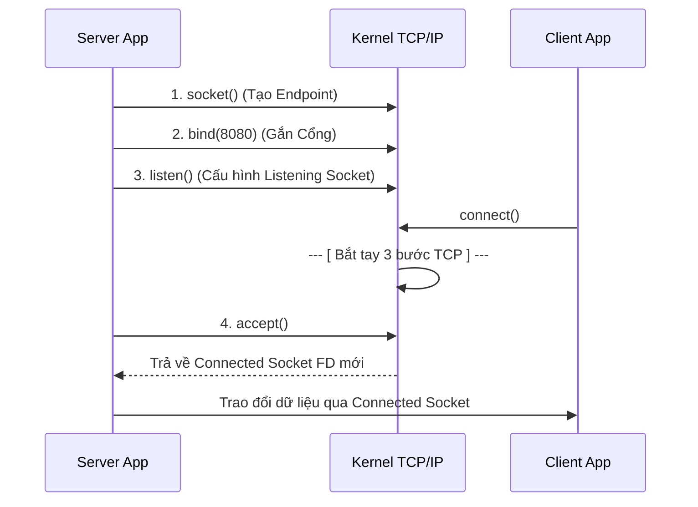
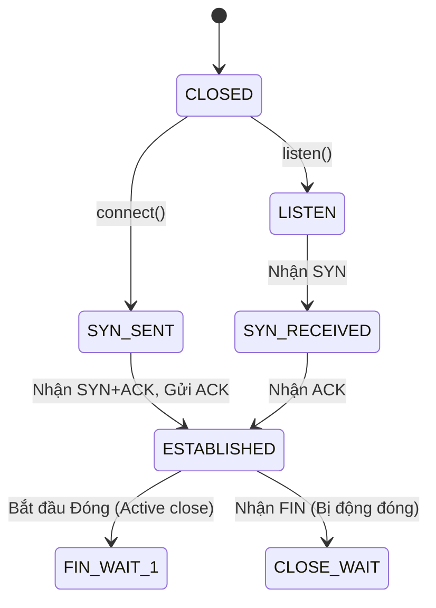

# Chủ đề 9 — Socket Programming trong Linux

> **Mục tiêu:** Hiểu socket là gì; cách TCP server/client hình thành kết nối; sự khác biệt về mô hình dữ liệu giữa TCP (`byte stream`) và UDP (`datagram`); cấu trúc địa chỉ `sockaddr`, khái niệm `network byte order`; và cách một kết nối được đóng ở cấp độ giao thức.
>
> **Quy ước ngôn ngữ:** Phần giải thích dùng Tiếng Việt. Giữ nguyên các thuật ngữ mạng/socket chuẩn để dễ tra cứu quốc tế: `socket`, `server`, `client`, `endpoint`, `address family`, `socket address`, `network byte order`, `byte stream`, `datagram`, `message framing`, `backpressure`, `partial I/O`, `half-close`, `orderly shutdown` cùng tên các API, giao thức, cấu trúc, trạng thái TCP và mã lỗi.
>
> **Phạm vi:** Các khái niệm cơ sở: API Socket, `address family`, kiểu/giao thức, địa chỉ IP, Cổng (Port), kiến trúc Byte order, hàm phân giải tên miền `getaddrinfo()`. Sự khác biệt TCP/UDP. Vòng đời TCP Server/Client, quá trình bắt tay (Handshake), bản chất `byte stream` và bài toán `message framing`, `partial I/O`. Đóng kết nối an toàn (Graceful shutdown). Ngữ nghĩa UDP Datagram và Unix Domain Socket.
>
> Chương này là **lý thuyết nền tảng** chuẩn bị cho lập trình mạng. Không có bài thực hành. Các cơ chế nâng cao như `O_NONBLOCK`, `select()`, `poll()`, `epoll()` và vòng lặp sự kiện (Event loop) sẽ thuộc **Chủ đề 10**.

Socket là một `endpoint` giao tiếp do Kernel quản lý. Khi tạo một Socket, ứng dụng phải khai báo ba tham số cốt lõi: **Họ địa chỉ (Domain/Address family)**, **Kiểu truyền tải (Type)**, và **Giao thức (Protocol)**. Sau đó, Socket sẽ được gán một địa chỉ cục bộ hoặc kết nối tới một đầu cuối (`endpoint`) phụ thuộc vào vai trò của ứng dụng.

Chương này đi theo vòng đời của một kênh giao tiếp: từ lúc tạo `socket()`, gán địa chỉ, thiết lập trạng thái bằng chuỗi `bind() → listen() → accept()` hoặc `connect()`. Quan trọng nhất, bạn sẽ nhận ra một điểm cốt lõi trong lập trình mạng: TCP cung cấp một luồng dữ liệu (Byte Stream) không tự bảo toàn ranh giới thông điệp của ứng dụng, trái ngược với mô hình truyền từng gói tin nguyên vẹn (Datagram) của UDP.

---

## Mục lục

- [1. Socket Programming là gì?](#1-socket-programming-là-gì)
- [2. `address family`, kiểu và giao thức quyết định `socket` ra sao?](#2-address-family-kiểu-và-giao-thức-quyết-định-socket-ra-sao)
- [3. `socket` có `file descriptor` nhưng không phải tệp thông thường](#3-socket-có-file-descriptor-nhưng-không-phải-tệp-thông-thường)
- [4. `socket address` và `sockaddr`](#4-socket-address-và-sockaddr)
- [5. `network byte order`: vì sao phải đổi `byte order`?](#5-network-byte-order-vì-sao-phải-đổi-byte-order)
- [6. `getaddrinfo()`: từ tên máy tới `socket address`](#6-getaddrinfo-từ-tên-máy-tới-socket-address)
- [7. Địa chỉ IP, cổng và `endpoint`](#7-địa-chỉ-ip-cổng-và-endpoint)
- [8. `bind()`: chọn địa chỉ và cổng cục bộ](#8-bind-chọn-địa-chỉ-và-cổng-cục-bộ)
- [9. TCP và UDP khác nhau ở mô hình dữ liệu nào?](#9-tcp-và-udp-khác-nhau-ở-mô-hình-dữ-liệu-nào)
- [10. TCP `server`: `socket → bind → listen → accept`](#10-tcp-server-socket--bind--listen--accept)
- [11. TCP `client`: `socket → connect`](#11-tcp-client-socket--connect)
- [12. Bắt tay TCP và các trạng thái quan trọng](#12-bắt-tay-tcp-và-các-trạng-thái-quan-trọng)
- [13. TCP là `byte stream`: ứng dụng phải tự chia thông điệp](#13-tcp-là-byte-stream-ứng-dụng-phải-tự-chia-thông-điệp)
- [14. Bộ đệm, `backpressure` và `partial I/O` trong TCP](#14-bộ-đệm-backpressure-và-partial-io-trong-tcp)
- [15. Đóng TCP đúng cách: `shutdown()`, FIN, RST và `TIME_WAIT`](#15-đóng-tcp-đúng-cách-shutdown-fin-rst-và-time_wait)
- [16. UDP: mỗi lần gửi là một `datagram`](#16-udp-mỗi-lần-gửi-là-một-datagram)
- [17. UDP `bind()`, `connect()`, `sendto()` và `recvfrom()`](#17-udp-bind-connect-sendto-và-recvfrom)
- [18. `send()` và `recv()`: API truyền nhận dữ liệu cơ bản](#18-send-và-recv-api-truyền-nhận-dữ-liệu-cơ-bản)
- [19. Unix Domain Socket: cùng API nhưng giao tiếp cục bộ](#19-unix-domain-socket-cùng-api-nhưng-giao-tiếp-cục-bộ)
- [20. Tư duy gỡ lỗi Socket theo từng lớp](#20-tư-duy-gỡ-lỗi-socket-theo-từng-lớp)
- [21. Liên hệ với Embedded Linux](#21-liên-hệ-với-embedded-linux)
- [22. Tổng kết và mô hình tư duy](#22-tổng-kết-và-mô-hình-tư-duy)
- [23. Tài liệu tham khảo](#23-tài-liệu-tham-khảo)

---

## 1. Socket Programming là gì?

Socket là giao diện nối liền ứng dụng Userspace với mạng truyền thông (hoặc hệ thống IPC nội bộ) được quản lý bởi Linux Kernel.

### 1.1 Socket nằm ở đâu trong hệ thống?

```text
[ Ứng dụng (Trình duyệt Web, Game) ]
                 |
        [ API Socket Chuẩn ]
                 |
[ Socket Object (Được Kernel quản lý) ]
                 |
   +-------------+-------------+
   |             |             |
 [ TCP ]      [ UDP ]  [ Unix Domain Socket ]
   |             |
   +------+------+
          |
        [ IP ] (Định tuyến mạng)
          |
    [ Card Mạng vật lý (NIC) ]
```

> **Đọc sơ đồ:** Ứng dụng thao tác với mạng thông qua Socket API. Tùy vào cấu hình, Socket sẽ chuyển giao dữ liệu xuống các giao thức tương ứng (TCP, UDP) và các tầng mạng bên dưới do Kernel thực hiện. Việc hàm gửi (send) trả về báo cáo thành công thường chỉ mang ý nghĩa Kernel đã chấp nhận dữ liệu vào bộ đệm của nó; nó không chứng minh ứng dụng phía đích đã thực sự nhận hoặc xử lý dữ liệu đó.

### 1.2 Socket là một Đầu cuối (`endpoint`)

Giao tiếp mạng diễn ra giữa các đầu cuối:
```text
[ Ứng dụng A ]                        [ Ứng dụng B ]
      |                                      |
[ Socket (Đầu cuối A) ] ========> [ Socket (Đầu cuối B) ]
```
Socket đóng vai trò là một `endpoint` (điểm cuối giao tiếp). Đối với TCP, hai endpoint tạo thành một luồng truyền tải hai chiều có kết nối. Đối với UDP, một socket có thể được dùng để trao đổi các gói tin với nhiều endpoint khác nhau tùy thuộc vào thiết kế của ứng dụng.

### 1.3 Lập trình Socket không chỉ là gọi TCP/UDP

Socket là một **Bộ giao diện API dùng chung**.
Cùng một bộ hàm C `socket()`, `bind()`, `read()`, `write()`, bạn có thể dùng để:
*   Giao tiếp mạng có kết nối (TCP/IP).
*   Giao tiếp mạng không kết nối (UDP).
*   Giao tiếp IPC nội bộ giữa các tiến trình trên cùng hệ điều hành (Unix Domain Socket - UDS).

### 1.4 `client` và `server` là vai trò, không phải là loại Socket

Không có các định nghĩa kiểu như `SOCK_CLIENT` hay `SOCK_SERVER` lúc tạo Socket.
Vai trò được hình thành thông qua **chuỗi hành vi** của ứng dụng:

*   **TCP Server:** Chủ động gắn với một địa chỉ/cổng và chờ kết nối.
    Chuỗi gọi hàm: `socket` -> `bind` -> `listen` -> `accept`.
*   **TCP Client:** Chủ động kết nối tới một máy chủ.
    Chuỗi gọi hàm: `socket` -> `connect`.

*(Sau khi thiết lập kết nối xong, cả hai phía đều sở hữu một socket đã kết nối và đều có thể gọi `send`/`recv` một cách bình đẳng)*.

---

## 2. `address family`, kiểu và giao thức quyết định `socket` ra sao?

Khi tạo một Socket qua hàm `socket(domain, type, protocol)`, bạn cung cấp 3 tham số để xác định ngữ nghĩa của kênh giao tiếp.

### 2.1 Ba thành phần phân loại

*   `domain` (Họ địa chỉ / Address Family): Giao tiếp bằng không gian tên (namespace) nào? (IPv4, IPv6, hay Local/Unix)?
*   `type` (Kiểu truyền tải): Truyền dữ liệu dưới dạng luồng (`stream`) hay từng gói độc lập (`datagram`)?
*   `protocol` (Giao thức): Tên cụ thể của giao thức là gì (nếu có nhiều lựa chọn)?

### 2.2 Các `Address Family` phổ biến (Domain)

*   `AF_INET`: Dành cho mạng Internet IPv4. Sử dụng địa chỉ IP (Vd: `192.168.1.5`) và Cổng (16 bit).
*   `AF_INET6`: Dành cho mạng Internet IPv6. Sử dụng địa chỉ 128 bit kèm một số trường đặc tả ngữ cảnh mạng (scope).
*   `AF_UNIX` (hay `AF_LOCAL`): Dành cho IPC nội bộ trên cùng hệ thống, thường sử dụng đường dẫn file (pathname) hoặc abstract namespace làm "địa chỉ".

### 2.3 Các Kiểu truyền tải (Type)

*   `SOCK_STREAM`: Mô hình luồng dữ liệu 2 chiều, đảm bảo thứ tự.
*   `SOCK_DGRAM`: Mô hình giữ nguyên ranh giới từng gói tin (datagram).

### 2.4 Tham số `protocol = 0` nghĩa là gì?

Thường lập trình viên truyền số `0` ở tham số thứ 3. Ý nghĩa là yêu cầu Kernel tự chọn giao thức mặc định phù hợp với cặp Domain + Type đã khai báo.
*   `AF_INET` + `SOCK_STREAM` + `0` --> Kernel chọn: **TCP**.
*   `AF_INET` + `SOCK_DGRAM`  + `0` --> Kernel chọn: **UDP**.

> Cần phải phân tích đồng thời cả 3 tham số. Không nên tự động kết luận "`SOCK_STREAM` thì 100% là TCP", vì `SOCK_STREAM` kết hợp với `AF_UNIX` sẽ trở thành một kênh IPC cục bộ dựa trên byte stream.

---

## 3. `socket` có `file descriptor` nhưng không phải tệp thông thường

Mọi Socket sau khi khởi tạo thành công đều trả về một bộ mô tả tệp (`file descriptor` - `fd`). Điều này cho phép ứng dụng sử dụng các hàm I/O tiêu chuẩn của UNIX.

### 3.1 Sự đồng nhất qua `fd`

Giả sử `socket()` trả về `fd = 7`. Trong bảng file descriptor của tiến trình:
```text
fd 0 -> stdin
fd 1 -> stdout
fd 3 -> tệp thông thường
fd 7 -> socket
```
Số `fd` chỉ là một mã quản lý (handle) ở không gian ứng dụng. Khi gọi các hàm chung như `read()`, `write()`, `close()`, Kernel sẽ dựa vào đối tượng thực sự mà `fd` tham chiếu để thực hiện hành động thích hợp.

### 3.2 Lăng kính Kernel

```text
    (Ứng dụng)
    fd = 7
       |
       v
[ Open file description ]
       |
       v
[ Kernel Socket Object ]
       |
       +---> Trạng thái TCP / UDP / Unix Domain Socket
       +---> Bộ đệm gửi / nhận
       +---> Địa chỉ Endpoint
```

Socket là một cấu trúc dữ liệu nội bộ trên RAM, lưu trữ toàn bộ trạng thái của một kết nối mạng. Vì `fd` trỏ qua cấu trúc quản lý chung, nếu bạn dùng `dup()` hoặc `fork()`, nhiều `fd` (của một hay nhiều tiến trình) có thể cùng trỏ về một Kernel Socket Object. Do đó, việc gọi `close()` trên một `fd` chưa chắc đã đóng hoàn toàn kết nối nếu vẫn còn các tham chiếu (references) khác.

### 3.3 Socket không hỗ trợ mọi thao tác của Tệp

Dù dùng chung API `read/write`, bạn không thể coi Internet Socket như tệp lưu trữ trên đĩa. Đặc biệt, nó không có khái niệm "vị trí con trỏ tệp" (file offset), do đó bạn không thể gọi lệnh `lseek()` trên một socket để tua lại luồng dữ liệu.

---

## 4. `socket address` và `sockaddr`

Giống như gửi thư cần có địa chỉ nhà, giao tiếp mạng yêu cầu ứng dụng chỉ định địa chỉ (Socket Address).

### 4.1 Cấu trúc Địa chỉ tổng quát

Vì API Socket dùng chung cho nhiều `address family` (IPv4, IPv6, Unix Domain), hệ thống sử dụng một cấu trúc dữ liệu tổng quát là `struct sockaddr` tại giao diện API.
Lập trình viên thường khởi tạo các cấu trúc đặc thù (như `sockaddr_in`), sau đó ép kiểu con trỏ về `struct sockaddr*` khi gọi hàm.

### 4.2 Cấu trúc IPv4: `sockaddr_in`

```text
[ struct sockaddr_in ]
  |
  +--> sin_family = AF_INET (Định dạng IPv4)
  |
  +--> sin_port = 8080      (Cổng giao vận)
  |
  +--> sin_addr = 1.1.1.1   (Địa chỉ IPv4 - Dạng nhị phân)
```
> Các trường này gộp lại để tạo thành một endpoint duy nhất; Cổng và IP không hoạt động rời rạc.

### 4.3 Cấu trúc IPv6: `sockaddr_in6`

```text
[ struct sockaddr_in6 ]
  |
  +--> sin6_family = AF_INET6
  +--> sin6_port = 443
  +--> sin6_addr = (Địa chỉ IPv6)
  +--> sin6_scope_id (Hỗ trợ định tuyến các dải IPv6 có phạm vi cục bộ)
```

### 4.4 Kích thước động và biến `socklen_t`

Do kích thước cấu trúc của từng `address family` là khác nhau, các API socket yêu cầu bạn phải truyền kèm kích thước cấu trúc địa chỉ thông qua kiểu `socklen_t` để đảm bảo Kernel phân giải đúng độ dài vùng nhớ.

---

## 5. `network byte order`: vì sao phải đổi `byte order`?

Các hệ thống máy tính có kiến trúc vi xử lý khác nhau có thể lưu trữ các số nguyên nhiều byte theo các thứ tự khác nhau. Nếu hai máy truyền trực tiếp cách biểu diễn dữ liệu trong RAM mà không có quy ước chung, cùng một chuỗi byte có thể bị hiểu thành hai giá trị khác nhau.

### 5.1 Little-endian và Big-endian

Giá trị 16-bit `0x1234` gồm hai byte `0x12` và `0x34`. Tùy kiến trúc CPU, chúng có thể được lưu trong RAM theo hai cách:

```text
Little-endian:  34 12
Big-endian:     12 34
```

* **Little-endian:** byte có trọng số thấp được đặt ở địa chỉ thấp hơn. Đây là cách phổ biến trên x86 và nhiều hệ ARM hiện đại.
* **Big-endian:** byte có trọng số cao được đặt ở địa chỉ thấp hơn.

Điểm quan trọng là giá trị logic vẫn là `0x1234`; khác biệt nằm ở cách các byte của số nguyên được biểu diễn trong bộ nhớ.

### 5.2 `Host Byte Order` và `Network Byte Order`

`Host Byte Order` là thứ tự byte mà CPU hiện tại sử dụng. Vì các host có thể dùng endianness khác nhau, các giao thức Internet quy định một cách biểu diễn chung cho một số trường số nguyên nhiều byte trên đường truyền: **Network Byte Order**, tương đương **Big-endian**.

Ví dụ Port `8080` có giá trị hexadecimal là `0x1F90`. Trên một host little-endian, cách biểu diễn trong RAM có thể là `90 1F`, nhưng khi đặt vào field mạng yêu cầu Network Byte Order, cách biểu diễn trên mạng cần tương ứng với `1F 90`.

```text
Host Order              Network Order
(little-endian)          (big-endian)

90 1F       --->         1F 90
          htons()
```

Mục đích của các hàm chuyển đổi là để code không phải tự kiểm tra CPU hiện tại đang dùng little-endian hay big-endian.

### 5.3 Các hàm chuyển đổi cơ bản

Ứng dụng sử dụng các hàm chuẩn sau khi thao tác với các field số nguyên có yêu cầu byte order rõ ràng:

* `htons()` (**Host To Network Short**): Host → Network cho giá trị 16-bit, điển hình là Port.
* `htonl()` (**Host To Network Long**): Host → Network cho giá trị 32-bit.
* `ntohs()` (**Network To Host Short**): Network → Host cho giá trị 16-bit.
* `ntohl()` (**Network To Host Long**): Network → Host cho giá trị 32-bit.

Ví dụ khi chuẩn bị địa chỉ IPv4 cho Socket:

```c
struct sockaddr_in addr;

addr.sin_family = AF_INET;
addr.sin_port = htons(8080);
```

`8080` là giá trị mà chương trình xử lý ở phía host; `sin_port` cần được biểu diễn theo Network Byte Order nên phải qua `htons()`.

Chiều ngược lại, nếu đọc một Port đang ở Network Byte Order và muốn dùng như số nguyên bình thường trong chương trình:

```c
printf("%u\n", ntohs(addr.sin_port));
```

> **Quy tắc thực dụng:** Chỉ chuyển đổi khi API hoặc giao thức quy định field đó ở Network Byte Order. Không gọi `htons()`/`htonl()` hai lần lên cùng một giá trị.

### 5.4 `inet_pton()` và `inet_ntop()` khác nhóm `hton*()` như thế nào?

Địa chỉ IP thường được con người nhập ở dạng văn bản, ví dụ `"192.168.1.10"`, trong khi Socket API cần địa chỉ ở dạng binary phù hợp với address family.

* `inet_pton()` (**Presentation to Network**): chuyển địa chỉ IP từ chuỗi văn bản sang binary network address.
* `inet_ntop()` (**Network to Presentation**): chuyển binary network address ngược lại thành chuỗi dễ đọc.

Ví dụ:

```c
struct sockaddr_in addr;

addr.sin_family = AF_INET;
addr.sin_port = htons(8080);
inet_pton(AF_INET, "192.168.1.10", &addr.sin_addr);
```

Hai thao tác có mục đích khác nhau:

```text
8080
  |
htons()
  |
  +----> sin_port

"192.168.1.10"
       |
   inet_pton()
       |
       +----> sin_addr
```

`htons()` chuyển **byte order của một số nguyên**, còn `inet_pton()` chuyển **địa chỉ IP dạng văn bản sang dạng binary mà Socket API sử dụng**.

### 5.5 Không phải dữ liệu nào gửi qua Socket cũng cần `hton*()`

Các hàm `hton*()` không được áp dụng mù quáng lên toàn bộ payload. Ví dụ chuỗi ký tự:

```c
send(fd, "HELLO", 5, 0);
```

không cần đi qua `htons()` hay `htonl()`. Endianness chỉ trở thành vấn đề khi giao thức của bạn chứa các field số nguyên nhiều byte và cần một wire format thống nhất.

Ví dụ một protocol tự định nghĩa header `length` 32-bit:

```c
uint32_t length = 100;
uint32_t net_length = htonl(length);

send(fd, &net_length, sizeof(net_length), 0);
```

Phía nhận chuyển ngược lại:

```c
uint32_t net_length;
recv(fd, &net_length, sizeof(net_length), 0);

uint32_t length = ntohl(net_length);
```

Vì vậy, khi thiết kế protocol giữa các hệ thống khác kiến trúc CPU, cần định nghĩa rõ **độ rộng field**, **endianness**, và **message framing** thay vì phụ thuộc vào layout bộ nhớ nội bộ của một máy cụ thể.

---

## 6. `getaddrinfo()`: từ tên máy tới `socket address`

Hàm `getaddrinfo()` giúp chuyển **tên máy/tên miền + dịch vụ (hoặc Port)** thành một danh sách `socket address` phù hợp để chương trình dùng với `socket()`, `connect()` hoặc `bind()`. Điểm quan trọng là hàm này có thể trả về cả IPv4 lẫn IPv6, nhờ đó code không phải tự xử lý riêng từng kiểu địa chỉ ngay từ đầu.

### 6.1 Input và output của `getaddrinfo()`

Prototype rút gọn:

```c
int getaddrinfo(const char *node,
                const char *service,
                const struct addrinfo *hints,
                struct addrinfo **res);
```

Có thể hiểu các tham số như sau:

* `node`: tên máy hoặc địa chỉ cần phân giải, ví dụ `"example.com"`.
* `service`: tên dịch vụ hoặc Port ở dạng chuỗi, ví dụ `"443"` hoặc `"https"`.
* `hints`: mô tả loại kết quả mong muốn, như IPv4/IPv6 và `SOCK_STREAM`/`SOCK_DGRAM`.
* `res`: nhận danh sách các kết quả phù hợp.

Ví dụ về luồng phân giải:

```text
[ "example.com" + "443" + hints ]
                |
                v
          getaddrinfo()
                |
                v
       danh sách candidate
          |             |
          v             v
      IPv6/TCP       IPv4/TCP
      Port 443       Port 443
```

Mỗi candidate chứa đủ thông tin để chương trình tạo socket tương ứng, trong đó `ai_family`, `ai_socktype`, `ai_protocol` mô tả loại socket và `ai_addr` chứa `socket address` có thể truyền cho `connect()` hoặc `bind()`.

### 6.2 `hints`: yêu cầu loại địa chỉ mong muốn

`hints` giúp giới hạn loại kết quả mà ứng dụng cần. Ví dụ một TCP Client thường có thể khai báo:

```c
struct addrinfo hints = {0};

hints.ai_family = AF_UNSPEC;
hints.ai_socktype = SOCK_STREAM;
```

Ở đây:

* `AF_UNSPEC`: không ép riêng IPv4 hay IPv6.
* `SOCK_STREAM`: yêu cầu socket kiểu stream, với Internet socket thông thường sẽ tương ứng với TCP.

### 6.3 Vì sao `getaddrinfo()` trả về nhiều candidate?

Một tên miền có thể ánh xạ tới nhiều địa chỉ. Khi dùng `AF_UNSPEC`, danh sách kết quả có thể chứa cả IPv6 và IPv4.

Client không nên mặc định candidate đầu tiên chắc chắn dùng được. Thiết kế phổ biến là thử lần lượt:

```text
getaddrinfo()
      |
      v
candidate 1 -> socket() -> connect() -> fail
      |
      v
candidate 2 -> socket() -> connect() -> success
```

Vì vậy, Client thường lặp qua danh sách `addrinfo`, tạo socket theo từng candidate và gọi `connect()` cho tới khi có một kết nối thành công. Cách này giúp chương trình ít phụ thuộc cứng vào riêng IPv4 hoặc IPv6.

### 6.4 `AI_PASSIVE`: chuẩn bị địa chỉ cho Server

Server thường cần một địa chỉ cục bộ để truyền vào `bind()`. Khi dùng:

```c
hints.ai_flags = AI_PASSIVE;
```

và để `node = NULL`, `getaddrinfo()` có thể tạo địa chỉ wildcard phù hợp, chẳng hạn:

```text
0.0.0.0:8080    (IPv4)
[::]:8080       (IPv6)
```

Luồng tư duy của Server là:

```text
NULL + "8080" + AI_PASSIVE
            |
            v
      getaddrinfo()
            |
            v
   local socket address
            |
            v
          bind()
```

Trong khi Client thường dùng kết quả của `getaddrinfo()` cho `connect()`, Server thường dùng kết quả này cho `bind()`.

### 6.5 Phân giải thành công không đồng nghĩa kết nối thành công

`getaddrinfo()` thành công chỉ cho biết tên máy/dịch vụ đã được chuyển thành một hoặc nhiều `socket address` hợp lệ. Nó không chứng minh:

* đường mạng tới máy đích đang thông;
* server đang chạy;
* Port đích đang mở;
* TCP handshake sẽ thành công.

Những điều đó chỉ được xác định ở các bước tiếp theo, đặc biệt là khi Client gọi `connect()`.

```text
getaddrinfo() thành công
        |
        v
Có địa chỉ để thử kết nối
        |
        v
     connect()
        |
   thành công / lỗi
```

---

## 7. Địa chỉ IP, cổng và `endpoint`

Một kết nối mạng được định hình bởi tập hợp các tọa độ gọi là Endpoint.

### 7.1 Vai trò của IP và Port

Về cơ bản:
*   **Địa chỉ IP:** Chỉ định giao diện mạng hoặc thiết bị máy chủ nào sẽ nhận gói tin.
*   **Cổng (Port):** Quyết định dịch vụ giao vận (process/service) nào trên thiết bị đó sẽ xử lý gói tin.

### 7.2 Không gian độc lập của Cổng

Cổng (Port) là một giá trị 16-bit (từ `0` đến `65535`).
Không gian cổng TCP và UDP là độc lập. Cổng `TCP 5000` và `UDP 5000` trên cùng một máy là hai `endpoint` hoàn toàn khác nhau.

### 7.3 TCP 4-tuple

Một kết nối TCP không được xác định chỉ bằng IP và Port của Server. Kernel phân biệt từng kết nối thông qua **4-tuple** gồm:

```text
1. Địa chỉ IP Cục bộ (Local IP).
2. Cổng Cục bộ (Local Port).
3. Địa chỉ IP Đối tác (Remote IP).
4. Cổng Đối tác (Remote Port).
```

Ví dụ, từ phía Server nhìn một kết nối:

```text
Server 10.0.0.5:80 <=====> Client 192.168.1.20:53000
```

tương ứng với:

```text
Local IP    = 10.0.0.5
Local Port  = 80
Remote IP   = 192.168.1.20
Remote Port = 53000
```

Chỉ cần một thành phần trong 4-tuple khác đi thì Kernel có thể xem đó là một kết nối TCP khác.

### 7.4 Làm sao một Server cổng 80 phục vụ nhiều người?

Nhiều Client có thể cùng lúc kết nối tới cùng một Server tại cùng IP và Port 80:

```text
(Connection 1): Server IP X : Port 80 <=====> Client IP A : Port 44215
(Connection 2): Server IP X : Port 80 <=====> Client IP B : Port 19022
(Connection 3): Server IP X : Port 80 <=====> Client IP A : Port 56000
```

Phía Server đều dùng cùng một địa chỉ và Port 80, nhưng phía Client có IP và/hoặc Port khác nhau. Client thường được Kernel cấp một **cổng tạm thời (`ephemeral port`)**, vì vậy 4-tuple của mỗi kết nối vẫn khác nhau.

Do đó Kernel có thể quản lý từng kết nối như một luồng TCP độc lập. Khi Server gọi `accept()`, mỗi kết nối được chấp nhận sẽ có một **connected socket** riêng, trong khi listening socket trên Port 80 vẫn tiếp tục chờ các kết nối mới.

---

## 8. `bind()`: chọn địa chỉ và cổng cục bộ

`bind()` gán một **địa chỉ cục bộ (`local endpoint`)** cho Socket. Với Internet Socket, địa chỉ này thường gồm **địa chỉ IP cục bộ + Cổng (Port)**.

Có thể hiểu ngắn gọn: `bind()` trả lời câu hỏi **"Socket này sẽ sử dụng địa chỉ nào ở phía local?"**. Nó không tạo kết nối tới máy khác; việc thiết lập peer thuộc về `connect()` hoặc, ở phía TCP Server, chuỗi `listen()` / `accept()`.

### 8.1 Gán địa chỉ cục bộ

Prototype rút gọn:

```c
int bind(int fd, const struct sockaddr *addr, socklen_t addrlen);
```

Luồng cơ bản:

```text
[ socket() -> Socket chưa có local endpoint cố định ]
                         |
                         v
              bind(Local Address)
                         |
                         v
           [ Socket có Local Endpoint ]
```

Ví dụ một Server có thể `bind()` vào:

```text
192.168.1.50:8080
```

Khi dùng `getaddrinfo()` ở phần trước, `ai_addr` và `ai_addrlen` của một candidate phù hợp có thể được truyền trực tiếp cho `bind()`.

### 8.2 Khi nào dùng `bind()`?

**Server thường phải `bind()`** vì Client cần biết một địa chỉ/cổng ổn định để gửi dữ liệu hoặc tạo kết nối tới. Ví dụ một TCP Server có thể gắn với Port `8080`, sau đó mới gọi `listen()`.

**Client thường không cần tự `bind()`**. Nếu Client gọi `connect()` mà chưa `bind()`, Kernel sẽ tự chọn một địa chỉ IP nguồn phù hợp và cấp một **Cổng tạm thời (`ephemeral port`)**.

Ví dụ:

```text
Client                         Server
192.168.1.20:53124  <------>  10.0.0.5:80
                 ^
                 |
       ephemeral port do Kernel chọn
```

Client vẫn có thể tự `bind()` khi ứng dụng thực sự cần kiểm soát local address hoặc local port, nhưng đây không phải trường hợp thông thường.

### 8.3 Cổng `0` và địa chỉ `wildcard`

*   **Cổng `0`:** Khi truyền Port `0` cho `bind()`, ứng dụng yêu cầu Kernel tự chọn một Port khả dụng, thường từ dải `ephemeral port` của hệ thống. Sau khi `bind()` thành công, Socket thực tế sẽ mang một Port cụ thể do Kernel cấp.
*   **`0.0.0.0` (`INADDR_ANY`):** Là địa chỉ IPv4 `wildcard`. Khi Server `bind()` vào `0.0.0.0:8080`, Socket không bị giới hạn vào một IPv4 cục bộ cụ thể; nó có thể nhận lưu lượng phù hợp gửi tới Port `8080` qua các địa chỉ IPv4 cục bộ của máy.

Ví dụ một thiết bị có:

```text
eth0  = 192.168.1.50
wlan0 = 10.0.0.20
```

thì:

```text
bind(0.0.0.0:8080)
```

có ý nghĩa khác với:

```text
bind(192.168.1.50:8080)
```

Trường hợp thứ hai chỉ gắn Socket với địa chỉ IPv4 cụ thể `192.168.1.50`.

### 8.4 Giải mã lỗi `bind()`

*   **`EADDRINUSE`:** Địa chỉ/cổng yêu cầu hiện không thể được gán cho Socket. Nguyên nhân thường gặp là một Socket khác đã chiếm tổ hợp địa chỉ/cổng đó; với TCP, trạng thái của các kết nối trước và các tùy chọn tái sử dụng địa chỉ cũng có thể ảnh hưởng.
*   **`EADDRNOTAVAIL`:** Địa chỉ IP cụ thể mà ứng dụng yêu cầu `bind()` không khả dụng như một địa chỉ cục bộ trong ngữ cảnh mạng hiện tại của tiến trình.

Có thể nhớ ngắn gọn:

```text
EADDRINUSE     -> địa chỉ/cổng đang không thể dùng vì bị xung đột
EADDRNOTAVAIL  -> địa chỉ local yêu cầu không khả dụng trên hệ thống
```

---

## 9. TCP và UDP khác nhau ở mô hình dữ liệu nào?

Để vận dụng mạng tốt, cần hiểu sự khác biệt cơ bản giữa TCP và UDP, không chỉ dừng ở tính "Đáng tin cậy/Nhanh".

| Đặc trưng cốt lõi | TCP (`SOCK_STREAM`) | UDP (`SOCK_DGRAM`) |
| :--- | :--- | :--- |
| **Bản chất truyền** | Thiết lập kết nối (Connection-oriented) | Đẩy các gói Datagram độc lập. Không cần TCP handshake. |
| **Mô hình Dữ liệu** | Luồng dữ liệu (Byte stream). Không bảo lưu ranh giới thông điệp. | Từng gói tin nguyên vẹn, giữ ranh giới đóng gói. |
| **Thứ tự & Tin cậy**| Cung cấp truyền dẫn đáng tin cậy, bảo toàn thứ tự byte trong luồng. | Dữ liệu có thể rớt, bị lặp, đến sai thứ tự. Ứng dụng phải tự chịu trách nhiệm nếu cần xử lý. |
| **Quản trị tắc nghẽn** | Có cơ chế Flow control và Congestion control. | Không tự có. Đẩy dữ liệu quá nhanh có thể gây quá tải mạng, ứng dụng UDP cần tuân thủ giao thức điều tiết của riêng mình. |

> **Lưu ý:** Việc TCP đánh dấu truyền thành công chỉ chứng tỏ dữ liệu được tiếp nhận ở mức giao vận (Transport layer). Nó không chứng minh logic nghiệp vụ ở ứng dụng đối tác (Ví dụ: lưu database, chạy hàm thành công) đã hoàn tất.

---

## 10. TCP `server`: `socket → bind → listen → accept`

Vòng đời mẫu mực của một TCP Server.

### 10.1 Chuỗi hành động thiết lập



> **Đọc sơ đồ:**
> Hàm `listen()` biến Socket ban đầu thành một **Listening Socket**. Tại đây, Kernel tiếp nhận các yêu cầu kết nối tới cổng dịch vụ và đưa vào hàng chờ.
> Hàm `accept()` lôi kết nối đã hoàn thành bắt tay ra, và sinh ra một File Descriptor hoàn toàn mới: **Connected Socket**.
> Việc đọc/ghi dữ liệu với Client đó sẽ diễn ra trên `Connected Socket` này. Socket Lắng nghe (Listening Socket) ban đầu vẫn tồn tại và không bị thay thế, sẵn sàng tiếp tục `accept` các yêu cầu của Client khác.

### 10.2 Biến `backlog` trong `listen()`

Hàm `listen(fd, backlog)` thiết lập giới hạn cho **Hàng đợi các kết nối đã hoàn tất quá trình bắt tay TCP và đang chờ ứng dụng gọi lệnh `accept()`**. Nó không mô tả tổng số Client tối đa mà server phục vụ trong suốt vòng đời của mình.

---

## 11. TCP `client`: `socket → connect`

### 11.1 Chuỗi hành động kết nối

```text
  [ Tên miền / Tên Dịch vụ ]
        |
   getaddrinfo()
        |
        v
    socket()      (Khởi tạo Endpoint)
        |
  connect(Server Address)  ---> Tiến trình cố gắng bắt tay TCP
        |
        v
[ Connected Socket ] ---> (Giao tiếp Dữ liệu)
```

Ở chế độ mặc định, lệnh `connect()` thực hiện "Mở chủ động" (Active open) và sẽ chặn luồng thực thi (Block) cho tới khi kết nối TCP với máy chủ thành công, hoặc gặp lỗi (như timeout, bị từ chối kết nối).

### 11.2 `connect()` chỉ là thành công ở tầng giao vận

Khi `connect()` trên một TCP socket trả về thành công, điều đó có nghĩa là **kết nối TCP tới endpoint phía Server đã được thiết lập ở tầng giao vận (Transport layer)**. Trong trường hợp thông thường, quá trình bắt tay TCP đã hoàn tất và socket phía Client đã chuyển sang trạng thái `ESTABLISHED`.

Điều này **không đồng nghĩa với việc ứng dụng phía Server đã xử lý yêu cầu thành công**. Sau khi kết nối TCP được thiết lập, Client vẫn phải trao đổi dữ liệu theo giao thức tầng ứng dụng; các vấn đề như phiên bản giao thức không tương thích, thông tin đăng nhập sai hoặc Server xử lý yêu cầu thất bại vẫn có thể xảy ra.

Có thể nhớ ngắn gọn:

```text
connect() thành công
        |
        v
Kết nối TCP ở tầng giao vận đã được thiết lập
        |
        v
Ứng dụng mới tiếp tục send()/recv() và xử lý giao thức riêng
```

---

## 12. Bắt tay TCP và các trạng thái quan trọng

TCP hoạt động theo một `state machine`.

### 12.1 Bắt tay 3 bước (Three-way Handshake)

```text
  [ Máy Khách (Active Open) ]             [ Máy Chủ (LISTEN) ]
       |                                           |
       | --- 1. [ Cờ SYN ] ----------------------> |
       |                                           |
       | <--- 2. [ Cờ SYN + Cờ ACK ] ------------- |
       |                                           |
       | --- 3. [ Cờ ACK ] ----------------------> |
       v                                           v
[ ESTABLISHED ]                             [ ESTABLISHED ]
```

Sự tương tác này đồng bộ hóa trạng thái sequence-number giữa hai thiết bị. Trong mô hình thông thường, sau khi cả hai chạm tới ngưỡng **`ESTABLISHED`**, luồng truyền tải byte mới sẵn sàng để ứng dụng thao tác.

### 12.2 Mô hình trạng thái TCP rút gọn



Sơ đồ giúp bạn hình dung các trạng thái xuất hiện khi gỡ lỗi thông qua lệnh `ss` hoặc `netstat`.

---

## 13. TCP là `byte stream`: ứng dụng phải tự chia thông điệp

Đây là nguyên tắc quan trọng bậc nhất của TCP Socket: **TCP bảo toàn thứ tự các byte trong dòng dữ liệu, nhưng KHÔNG bảo toàn ranh giới của các lệnh gửi (send).**

### 13.1 Không thể giả định gửi / nhận 1:1

Bạn không được phép suy diễn "1 lệnh send() = 1 lệnh recv()".

Giả sử ứng dụng Server gọi lệnh Gửi:
```c
send(fd, "DATA_1", 6, 0);
send(fd, "DATA_2", 6, 0);
```
Client khi gọi hàm `recv()` có thể nhận thành:
```text
recv -> "DATA_1DATA_2" (Gộp chung)
```
Hoặc:
```text
recv lần 1 -> "DATA_"
recv lần 2 -> "1DATA_2" (Phân mảnh đứt gãy)
```

Cả hai cách nhận đều hợp lệ đối với TCP. TCP là `byte stream`, không phải một cơ chế truyền thông điệp có sẵn ranh giới. Do đó Receiver không được giả định rằng một thông điệp sẽ luôn đến nguyên vẹn trong một lần gọi `recv()`.

### 13.2 Phân khung Thông điệp (Message Framing)

Vì TCP không có khái niệm Thông điệp (Message), ứng dụng phải tự thiết kế một giao thức (`protocol`) để phân tách luồng byte thành các thông điệp.
Một trong các phương pháp phổ biến là **Length-Prefix Framing** (Chỉ định độ dài trước):

```text
[ Độ dài=6 | Dữ liệu=LENH_A ] [ Độ dài=6 | Dữ liệu=LENH_B ]
```
Ứng dụng phía thu sẽ thiết kế một bộ đệm vòng lặp:
1. Đọc đúng n-byte ban đầu để trích xuất Kích thước.
2. Vòng lặp liên tục gọi `recv()` cho tới khi thu thập đủ Kích thước byte Payload được công bố.
3. Bóc tách ra để xử lý, và tiếp tục lặp.

Quy tắc Framing này còn dùng làm biên ranh giới để kiểm tra bắt lỗi (nếu độ dài gửi tới là một con số phi thực tế).

---

## 14. Bộ đệm, `backpressure` và `partial I/O` trong TCP

Hiểu rõ hành vi trả về của hàm I/O.

### 14.1 Lệnh `send()` không bảo đảm Dữ liệu đã truyền đi

```text
[ App gọi send(100 byte) ]
       |
       v
[ Kernel chấp nhận chép 100 byte vào TCP Send Buffer Nội bộ ]
       |
       |----> TCP lo việc phân đoạn, đàm phán, gửi sang mạng...
       v
[ Receive Buffer của máy Đích ]
       |
       v
[ App Đích gọi recv() ]
```

Khi lệnh `send()` trả về số lượng byte hợp lệ, điều đó chứng tỏ lớp TCP Stack cục bộ đã tiếp nhận tiến trình gửi. Nó không chứng minh phần mềm đích đã thực sự nhận hoặc xử lý dữ liệu đó.

### 14.2 Partial I/O (Chỉ xử lý một phần)

Thao tác Stream I/O có thể xử lý ít dữ liệu hơn mức bạn yêu cầu:
*   **`send()` bị thiếu:** Cố gửi 4000 byte, nhưng `send` trả về `1500`. Ở chế độ chặn (blocking), hệ thống có thể chờ thêm để nạp phần còn lại, nhưng nhiều yếu tố vẫn có thể khiến hàm trả về kết quả chưa trọn vẹn. Lập trình viên phải duy trì một vòng lặp để tiếp tục gửi phần còn thiếu dựa trên số byte trả về thực tế.
*   **`recv()` bị thiếu:** Đòi rút 4000 byte, nhưng `recv` trả về `100`. Lý do: Mạng mới chỉ tải về kịp được 100 byte nằm trên đệm Receive Buffer, hàm trả ra dữ liệu ngay thay vì bắt ứng dụng đứng chờ. Lại cần dùng vòng lặp để thu thập.

### 14.3 EOF trên TCP Stream: `recv() == 0`

Khi lệnh `recv()` trả về con số `0`, đây là trạng thái báo hiệu sự kết thúc.
Ngữ nghĩa: **Toàn bộ dữ liệu tồn đọng trong luồng đã được ứng dụng đọc sạch, và thiết bị đối tác (Peer) đã thực hiện quy trình đóng van gửi một cách có trật tự (Gửi cờ FIN). Không còn byte mới nào xuất hiện trên chiều kết nối này nữa.**
> Lưu ý: Điều này khác biệt hoàn toàn với "nhận một gói tin TCP có payload độ dài 0".

### 14.4 Backpressure do Bộ đệm hữu hạn

Nếu tiến trình gửi dữ liệu nhanh hơn tốc độ tiêu thụ/xử lý của đối tác, Send Buffer cục bộ dần bị lấp đầy. Lúc này, lệnh `send()` sẽ chuyển sang ngủ chờ không gian trống (trong chế độ chặn), hoặc báo lỗi chưa sẵn sàng (trong chế độ không chặn). Đây là cơ chế điều tiết tự nhiên của mạng.

---

## 15. Đóng TCP đúng cách: `shutdown()`, FIN, RST và `TIME_WAIT`

TCP là giao thức **hai chiều toàn phần (`full-duplex`)**. Có thể hình dung một kết nối TCP gồm hai chiều truyền độc lập:

```text
Client  -------------------->  Server   (Client gửi)
Client  <--------------------  Server   (Server gửi)
```

Vì vậy, đóng TCP không nhất thiết có nghĩa cả hai chiều phải kết thúc cùng lúc.

### 15.1 Hàm `shutdown()` khác `close()`

*   `shutdown()`: Yêu cầu Kernel thay đổi trạng thái truyền/nhận của Socket. Có thể ngừng hướng gửi (`SHUT_WR`), hướng nhận (`SHUT_RD`) hoặc cả hai (`SHUT_RDWR`).
*   `close()`: Giải phóng một `file descriptor` của tiến trình. Nếu Socket còn được tham chiếu bởi FD khác, chẳng hạn do `dup()` hoặc `fork()`, một lần `close()` chưa chắc làm kết nối TCP phía dưới kết thúc ngay.

Có thể nhớ ngắn gọn: `shutdown()` điều khiển **hướng giao tiếp**, còn `close()` giải phóng **tham chiếu FD** của tiến trình.

### 15.2 `Half-close` với `SHUT_WR`

Vì TCP có hai chiều độc lập, một phía có thể đóng **chỉ chiều gửi của mình** nhưng vẫn tiếp tục nhận dữ liệu. Trạng thái đó gọi là `half-close`.

Khi Client gọi:

```c
shutdown(fd, SHUT_WR);
```

ý nghĩa là: **Client sẽ không gửi thêm byte nào nữa, nhưng vẫn có thể tiếp tục gọi `recv()` để nhận dữ liệu từ Server**.

```text
Client                         Server

      X -------------------->       (Client không gửi thêm)
        <--------------------       (Server vẫn có thể gửi)
```

Kernel sẽ thực hiện `orderly shutdown` trên chiều gửi và phát `FIN` sang peer. `FIN` nên được hiểu là: **"tôi đã gửi hết dữ liệu trên chiều này"**, không phải "toàn bộ kết nối đã biến mất".

Ví dụ:

```text
Client                         Server

send(Request)  -------------->
shutdown(SHUT_WR)
               ------ FIN --->

               <-------------  send(Response)
recv(Response)
```

Sau khi Server đã đọc hết dữ liệu còn lại và đã nhận `FIN`, `recv()` ở Server sẽ trả về `0`. Đây là EOF của **chiều Client → Server**. Server vẫn có thể gửi Response theo chiều ngược lại.

### 15.3 `CLOSE_WAIT`

Khi một phía nhận `FIN` từ peer, TCP phía local có thể chuyển sang trạng thái `CLOSE_WAIT`.

```text
Peer gửi FIN
     |
     v
Kernel local đã biết peer không gửi thêm
     |
     v
CLOSE_WAIT
     |
     v
Chờ application local hoàn tất và đóng phía của mình
```

Vì vậy, `CLOSE_WAIT` có nghĩa là **peer đã kết thúc chiều gửi của nó, nhưng application local vẫn chưa hoàn tất việc đóng phần kết nối của mình**. Trạng thái này có thể xuất hiện bình thường trong thời gian ngắn; nếu nhiều `CLOSE_WAIT` tồn tại lâu và tăng dần, cần kiểm tra việc quản lý vòng đời Socket/FD của ứng dụng.

### 15.4 `TIME_WAIT`

Phía thực hiện `active close` thường đi qua trạng thái `TIME_WAIT` sau quá trình trao đổi `FIN`/`ACK`.

`TIME_WAIT` là trạng thái bình thường của TCP. Kernel giữ thông tin kết nối thêm một khoảng thời gian để xử lý an toàn các segment cũ có thể đến muộn và các tình huống liên quan tới ACK cuối của quá trình đóng.

Có thể phân biệt ngắn gọn:

```text
CLOSE_WAIT = đã nhận FIN, application local chưa đóng xong phía của mình.
TIME_WAIT  = TCP đang ở giai đoạn chờ cuối sau quá trình active close.
```

Do đó, có nhiều `TIME_WAIT` không tự động đồng nghĩa với rò rỉ Socket hoặc rò rỉ FD.

### 15.5 Reset bất thường: `RST`

`FIN` biểu thị việc kết thúc một chiều truyền theo quy trình có trật tự (`orderly shutdown`). Ngược lại, `RST` dùng để reset kết nối một cách bất thường/cưỡng bức.

Ứng dụng cần phân biệt:

```text
FIN -> đọc hết dữ liệu rồi recv() == 0  -> EOF bình thường.
RST -> kết nối bị reset                -> có thể gặp ECONNRESET.
```

Hai trường hợp có ngữ nghĩa khác nhau: `FIN` cho biết peer đã kết thúc chiều gửi một cách có trật tự, còn `RST` báo rằng kết nối bị phá vỡ/reset thay vì kết thúc theo quy trình bình thường.

---

## 16. UDP: mỗi lần gửi là một `datagram`

UDP không quản lý theo byte. Nó gửi các gói tin (Datagram) đóng gói độc lập.

### 16.1 Ranh giới bảo toàn

*   Sender gửi: Datagram A, Datagram B.
*   Receiver khi gọi lệnh `recv` sẽ bóc ra được đúng gói A và B rời rạc (nếu không có sự cố mạng). UDP giữ ranh giới đóng gói, Kernel không ghép các Datagram thành một dòng `byte stream` như TCP.

### 16.2 UDP không cần thiết lập kết nối

Sender UDP không cần gọi:
```text
SYN -> SYN/ACK -> ACK
```
Sender có thể gửi một datagram mà không cần thực hiện TCP handshake trước. Đổi lại sự linh hoạt này, bạn không nhận được các bảo đảm về việc kết nối mạng đã thiết lập, việc truyền lại nếu thất lạc (Retransmission) hay tự động sắp xếp thứ tự như TCP.

### 16.3 Thiếu độ tin cậy

Một Datagram có thể: tới đích, bị rơi mất dọc đường, tới đích lặp lại hai lần, hoặc chạy chậm và tới sau một Datagram gửi sau.
Nếu ứng dụng chọn UDP nhưng lại yêu cầu tính Toàn vẹn dữ liệu, giao thức tầng Ứng dụng phải TỰ MÌNH chắp vá: Tự thiết kế hệ số Sequence, mã Timeout, và Retries.

### 16.4 Kiểm soát tắc nghẽn ở Không gian UDP

UDP không tự phanh lại khi mạng nghẽn (`Congestion control`) như TCP. Việc gửi dữ liệu ào ạt không kiểm soát có thể gây tắc nghẽn nghiêm trọng cho hạ tầng mạng. Theo RFC 8085, ứng dụng UDP cần tuân thủ cơ chế/chính sách kiểm soát tắc nghẽn phù hợp do chính ứng dụng đó triển khai.

---

## 17. UDP `bind()`, `connect()`, `sendto()` và `recvfrom()`

Dù không bắt tay mạng, API của UDP vẫn hỗ trợ một số thiết lập luồng đi.

### 17.1 UDP Server thường sử dụng `bind()`

```text
socket(SOCK_DGRAM)
      |
bind(Local Port)
      |
      v
recvfrom() / sendto()
```

UDP server sẽ `bind` vào một cổng cục bộ để nhận các datagram gửi tới. Nó không dùng `listen()` và không tạo connected FD riêng qua `accept()`. Một socket UDP đã gắn cổng có thể giao tiếp với nhiều đối tác khác nhau.

### 17.2 `sendto()` và `recvfrom()`

*   `sendto()`: Gửi gói tin đi, luôn đính kèm địa chỉ Tọa độ Đích (IP:Port) trên mỗi lệnh gọi. Cho phép một UDP socket gửi datagram tới các đích khác nhau.
*   `recvfrom()`: Nhận datagram và trả về cả payload lẫn địa chỉ nguồn của gói tin. Đây là cơ sở bắt buộc để Server UDP biết địa chỉ truy vết nhằm gửi phản hồi.

### 17.3 `connect()` với UDP

Bạn hoàn toàn có quyền gọi `connect()` lên một UDP Socket. Nhưng:
Lệnh `connect()` ở đây KHÔNG HỀ phát sóng lên Internet để bắt tay kết nối như TCP. Nó thực hiện các thao tác quản lý dưới Kernel:
1. Thiết lập Cấu hình Đích Mặc định (Default Destination).
2. Cho phép Kernel gắn/lọc liên kết nhận, bỏ qua mọi gói tin không thuộc về Đối tác này.
3. Cho phép dùng trực tiếp `send()` và `recv()` với peer đã cấu hình.
4. Giúp báo lỗi ICMP bất đồng bộ trên hệ thống Linux rõ ràng hơn đối với Socket cụ thể đó.

*(Tất nhiên, cấu hình kiểu này không mang lại bất cứ tính an toàn nào của luồng TCP, nó vẫn là UDP).*

---

## 18. `send()` và `recv()`: API truyền nhận dữ liệu cơ bản

Lựa chọn cặp hàm giao tiếp tùy thuộc vào Trạng thái của Socket.

### 18.1 `send()` và `sendto()`

*   Dùng `send()`: Phù hợp khi Socket đã xác định được Điểm đích (Peer). Ví dụ: TCP Connected socket hoặc UDP Socket đã chạy qua lệnh `connect()`.
*   Dùng `sendto()`: Chuyên dùng để linh hoạt gửi mỗi Datagram cho một máy chủ đích độc lập thông qua một UDP Socket thuần.

### 18.2 Lưu ý kích thước Datagram của `recvfrom()`

Nếu kích thước Datagram gửi tới lớn hơn vùng đệm (buffer) mà bạn khai báo trong lệnh `recv()`/`recvfrom()` của UDP:
Với TCP, phần dữ liệu còn lại nằm yên đó để bạn đọc ở vòng lặp sau.
Với UDP, phần Byte bị vượt ngưỡng (tràn buffer) **có thể bị loại bỏ vĩnh viễn** khỏi luồng do mỗi Datagram luôn đóng ranh giới riêng biệt. Lỗi cắt cụt (Truncation) sẽ xảy ra.

---

## 19. Unix Domain Socket: cùng API nhưng giao tiếp cục bộ

Lập trình Mạng nhưng không cần ra khỏi Máy.

### 19.1 IPC qua mô hình Socket

Socket API không chỉ dành cho mạng IP. Với `AF_UNIX` (hay `AF_LOCAL`), cùng bộ API có thể được dùng cho giao tiếp liên tiến trình (IPC) cục bộ trên một hệ thống.

### 19.2 Tính tương đồng nhưng Bản chất khác biệt

Mô hình thiết lập TCP Server: `socket(AF_UNIX) -> bind -> listen -> accept`.
Địa chỉ của nó không phải IP/Port; có thể là một pathname hoặc abstract namespace, ví dụ: `/tmp/db_engine.sock`.

> Cùng bộ API, nhưng AF_UNIX khác AF_INET ở không gian tên địa chỉ, tính giới hạn trong nội bộ thiết bị (local-only), khả năng xác thực quyền (credentials/permissions) và cơ chế truyền tải của Kernel. Unix Domain Socket giúp bạn thiết kế giao thức linh hoạt mà không mở ranh giới phơi bày mạng.

---

## 20. Tư duy gỡ lỗi Socket theo từng lớp

Khi gỡ lỗi socket, hãy đi theo từng lớp: địa chỉ/cổng → trạng thái socket → TCP/UDP → I/O → giao thức ứng dụng. Không nên gom mọi triệu chứng thành một kết luận chung chung là “mạng hỏng”.

### 20.1 Lỗi do `bind()`: `EADDRINUSE` vs `EADDRNOTAVAIL`

*   **`EADDRINUSE` (Address in use):** Khả năng cao Cổng (Port) đã bị tiến trình khác chiếm dụng, hoặc Socket cũ đang ở trạng thái TCP ngầm như `TIME_WAIT`. (Cần cấu hình `SO_REUSEADDR` trước khi `bind` để tái sử dụng).
*   **`EADDRNOTAVAIL`:** Lỗi này xảy ra khi bạn ráng ghim (bind) một Tọa độ Địa chỉ IP không hề thuộc về Máy tính cục bộ (Namespace / Interface không đúng).

### 20.2 Lỗi do `connect()`: `ECONNREFUSED`

Nếu `connect()` trả về `ECONNREFUSED`, yêu cầu kết nối đã bị phía đích từ chối; một nguyên nhân thường gặp là không có `listening socket` phù hợp tại cổng đích.

*(Phân biệt với `ETIMEDOUT`, khi quá trình kết nối không nhận được phản hồi trong thời gian cho phép; nguyên nhân có thể nằm ở đường mạng, thiết bị đích hoặc firewall).*

### 20.3 Khi `accept()` tiếp tục chờ

Điều này thường có nghĩa là chưa có kết nối phù hợp sẵn sàng để `accept()` trả về.
Hãy rà soát lại: Máy Khách đã gọi lệnh `connect()` chưa? Cổng Router có chặn Mạng tường lửa không? Hay có thể quá trình Bắt Tay 3 Bước (3-way handshake) còn dang dở?

### 20.4 `EINTR` khi thao tác blocking bị ngắt

Khi ứng dụng gọi các lệnh làm ngưng đọng luồng hệ thống (Blocking) như `read()`, `write()`, `accept()`, một signal (Topic 05) có thể đến và ngắt thao tác đó. Hàm mạng lúc này sẽ trả về lỗi `-1` kèm `errno = EINTR`.
Lập trình viên CẦN PHÂN TÍCH kỹ ngữ nghĩa của lệnh: Không nên viết vòng lặp `while(retry)` gọi lại hàm mù quáng khi gặp `EINTR`. Bạn phải kiểm tra ngữ nghĩa xem liệu Signal đó có phải là Tín hiệu Tắt Server hay không, cũng như lưu tâm đến số lượng byte I/O đã chạy dở dang (Partial I/O).

---

## 21. Liên hệ với Embedded Linux

Nhiều thiết bị Embedded Linux cần giao tiếp với dịch vụ mạng, gateway hoặc các thiết bị khác.

### 21.1 Thiết bị Nhúng đóng vai trò Client

Khi là một thiết bị gọi API lên Cloud. Vòng đời Client phải đối mặt với độ trễ (latency) và bất ổn hạ tầng:
Mất mạng WiFi / Ngắt mạng 4G? Hàm `getaddrinfo` Time-out. Lỗi Cáp bị tuột (Rớt kết nối)? Ứng dụng phải tự Code logic Back-off (Thử lại kết nối sau khoảng thời gian tăng dần, tránh retry quá dày).

### 21.2 Giới hạn tài nguyên (`bounded resources`)

Thiết bị nhúng (ví dụ Camera IP) có giới hạn về RAM, socket buffer, số lượng luồng và CPU.
Mỗi kết nối TCP đồng thời (Concurrent Connection) đều tiêu tốn một phần không gian lưu trữ trạng thái trong Linux Kernel. Việc quản lý kém vòng đời kết nối sẽ dẫn tới rò rỉ (leak) tài nguyên, sớm muộn cũng gây tình trạng cạn kiệt (Resource Exhaustion như `EMFILE` / `ENFILE`). Đừng lầm tưởng Leak FD sẽ đâm thẳng ra Kernel Panic ngay lập tức.

### 21.3 `Serialization` và ranh giới giao thức

Như phân tích ở Mục 5, thiết bị Nhúng sử dụng vô vàn các chủng loại chip khác nhau: `ARM`, `MIPS`, `x86`.
Nguyên tắc quan trọng: **Giao thức phải định nghĩa rõ ràng về độ rộng của biến, kiến trúc `Endianness` (Quy ước Byte), và ranh giới đóng gói dữ liệu (Framing) độc lập với hệ điều hành**.
Không nên sao chép trực tiếp cấu trúc `struct` trong bộ nhớ C/C++ thành mảng byte rồi dùng nó như wire format, vì các hệ thống có thể khác nhau về layout và biểu diễn dữ liệu. Hãy dùng một định dạng serialization được quy ước rõ ràng, chẳng hạn Protocol Buffers hoặc JSON.

### 21.4 Graceful shutdown khi dừng service

Khi một Dịch vụ (Service) nhận `SIGTERM` từ tiến trình `init` của hệ thống:
Mô hình chuẩn: Nó ngừng nhận các kết nối mới, từ chối tải công việc mới, hoàn tất quá trình I/O đang dang dở, gọi `shutdown()` ngắt hướng truyền/nhận, đóng toàn bộ File Descriptor an toàn rồi mới thoát vòng lặp.

### 21.5 Application heartbeat và TCP keepalive

`TCP keepalive` dùng để kiểm tra trạng thái kết nối TCP sau các khoảng không hoạt động.
Điều đó không bảo đảm service ở tầng ứng dụng phía bên kia vẫn phản hồi bình thường. Một thiết kế nhúng chuẩn mực thường phải triển khai Heartbeat ở Tầng Ứng dụng (Application protocol) để xác minh xem bộ máy xử lý của đối tác có thực sự còn sống.

---

## 22. Tổng kết và mô hình tư duy

Có thể tóm tắt chương bằng mô hình sau:

### 22.1 Vòng đời TCP Server/Client cơ bản

```text
    [ MÁY CHỦ - SERVER ]                             [ MÁY KHÁCH - CLIENT ]

        socket()                                          socket()
           |                                                 |
   bind() (Gán cổng cục bộ)                                |
           |                                                 |
  listen() (Chuyển thành Listening Socket)                        |
           |                                                 |
       accept()  <---------- (TCP handshake) ----------- connect()
 (Trả về connected fd mới)                                 |
           |                                                 v
    [ Connected Socket fd ]                         [ Connected Socket ]
           |                                                 |
      recv() / read() <------ (Nhận byte stream) ------ send() / write()
           |                                                 |
      send() / write() -----> (Gửi byte stream) ------> recv() / read()
           |                                                 |
    shutdown() / close() <--- (orderly shutdown) -----> shutdown() / close()
```
> **Đọc sơ đồ:** Client tạo socket trước khi gọi `connect()` để bắt đầu quá trình thiết lập kết nối TCP. Phía server giữ listening socket riêng; `accept()` trả về một connected socket mới cho kết nối vừa được chấp nhận. I/O với từng client diễn ra trên connected socket, trong khi listening socket tiếp tục chờ các kết nối khác.

### 22.2 Các điểm cần nhớ
1. `socket()` tạo một communication endpoint và trả về `file descriptor` để tiến trình tham chiếu tới endpoint đó.
2. `bind()` gán local address/port cho socket theo address family tương ứng.
3. `accept()` lấy một kết nối từ hàng đợi và trả về **một FD mới** cho connected socket; listening socket ban đầu vẫn tiếp tục lắng nghe.
4. TCP là `byte stream`: không có quan hệ gửi 1 lần - nhận 1 lần. Ứng dụng phải tự thiết kế cơ chế `framing`.
5. UDP truyền các `datagram` rời rạc và giữ ranh giới từng datagram, nhưng không bảo đảm delivery, thứ tự hoặc loại bỏ duplicate.
6. `send()` trả về thành công chỉ cho biết local socket stack đã chấp nhận số byte tương ứng; điều đó không chứng minh peer application đã nhận hoặc xử lý dữ liệu.
7. `recv() == 0` trên TCP biểu thị EOF ở chiều nhận: peer đã thực hiện orderly shutdown hướng gửi.
8. `shutdown(fd, SHUT_WR)` ngừng hướng gửi nhưng vẫn cho phép tiếp tục nhận; `close()` giải phóng file descriptor của tiến trình.
9. `connect()` với UDP không tạo TCP handshake; nó thiết lập default peer, cho phép dùng `send()`/`recv()` và giúp liên kết một số lỗi mạng với socket cụ thể.
10. `getaddrinfo()` hỗ trợ phân giải địa chỉ theo cách ít phụ thuộc vào riêng IPv4 hoặc IPv6; các trường yêu cầu `network byte order` phải được chuyển đổi đúng theo ngữ nghĩa của API.

---

## 23. Tài liệu tham khảo

Phần này liệt kê nguồn chuẩn về socket, TCP, UDP và Unix Domain Socket.

### 23.1 POSIX và Linux Socket API

- POSIX.1-2024: https://pubs.opengroup.org/onlinepubs/9799919799/
- `socket(2)`: https://man7.org/linux/man-pages/man2/socket.2.html
- `socket(7)`: https://man7.org/linux/man-pages/man7/socket.7.html
- `bind(2)`: https://man7.org/linux/man-pages/man2/bind.2.html
- `listen(2)`: https://man7.org/linux/man-pages/man2/listen.2.html
- `accept(2)`: https://man7.org/linux/man-pages/man2/accept.2.html
- `connect(2)`: https://man7.org/linux/man-pages/man2/connect.2.html
- `send(2)`: https://man7.org/linux/man-pages/man2/send.2.html
- `recv(2)`: https://man7.org/linux/man-pages/man2/recv.2.html
- `shutdown(2)`: https://man7.org/linux/man-pages/man2/shutdown.2.html

### 23.2 Địa chỉ Internet và phân giải tên

- `ip(7)`: https://man7.org/linux/man-pages/man7/ip.7.html
- `ipv6(7)`: https://man7.org/linux/man-pages/man7/ipv6.7.html
- `getaddrinfo(3)`: https://man7.org/linux/man-pages/man3/getaddrinfo.3.html
- `inet_pton(3)`: https://man7.org/linux/man-pages/man3/inet_pton.3.html
- `byteorder(3)`: https://man7.org/linux/man-pages/man3/byteorder.3.html

### 23.3 TCP và UDP

- RFC 9293 — Transmission Control Protocol (TCP): https://www.rfc-editor.org/rfc/rfc9293.html
- `tcp(7)`: https://man7.org/linux/man-pages/man7/tcp.7.html
- RFC 768 — User Datagram Protocol: https://www.rfc-editor.org/rfc/rfc768.html
- RFC 8085 — UDP Usage Guidelines: https://www.rfc-editor.org/rfc/rfc8085.html
- `udp(7)`: https://man7.org/linux/man-pages/man7/udp.7.html

### 23.4 Unix Domain Socket

- `unix(7)`: https://man7.org/linux/man-pages/man7/unix.7.html

### 23.5 Nguồn giải thích bổ sung

- Linux man-pages project: https://www.kernel.org/doc/man-pages/
- The Linux Programming Interface / man7.org: https://man7.org/tlpi/
- Bootlin Embedded Linux training: https://bootlin.com/training/embedded-linux/
- Unix & Linux Stack Exchange: https://unix.stackexchange.com/
- Stack Overflow: https://stackoverflow.com/

> Các nguồn cộng đồng chỉ dùng để tham khảo cách giải thích hoặc tình huống lỗi thực tế; khi xác định hành vi chuẩn của API, ưu tiên POSIX, RFC và Linux man-pages.

---

> **Điều hướng:** [← Chủ đề 8 — IPC](README-topic-08.md)
