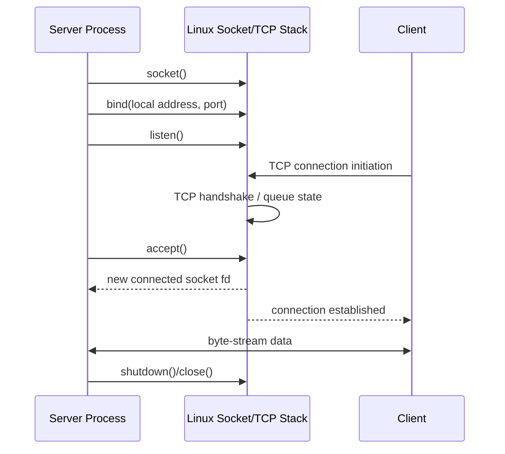
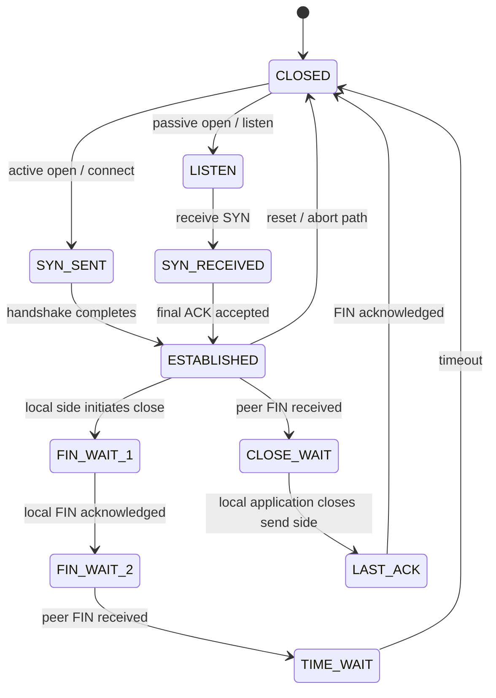

# Chủ đề 9 — Socket Programming trong Linux

> **Mục tiêu dễ hiểu:** Hiểu socket như một communication endpoint và xây mô hình tư duy TCP server/client, UDP datagram, địa chỉ/port và graceful shutdown.
>
> **Bạn cần biết trước:** Biết fd, blocking I/O và IPC. Networking cơ bản như IP/port sẽ được giải thích lại ở mức cần dùng.
>
> **Các từ khóa sẽ gặp nhiều:**
> - **socket** = endpoint giao tiếp có fd
> - **TCP** = reliable ordered byte stream
> - **UDP** = datagram/message transport không đảm bảo delivery/order
> - **bind** = gán local address
> - **listen/accept** = phía TCP server
> - **connect** = chọn/thiết lập peer tùy socket type
>
> **Quy ước đọc thuật ngữ:** khi gặp `state`, `context`, `semantics`, `object`, hãy hiểu lần lượt là **trạng thái**, **ngữ cảnh**, **hành vi theo chuẩn**, **đối tượng/tài nguyên**. Tên API và thuật ngữ chuẩn như process, thread, socket, mutex được giữ nguyên để bạn quen dần với tài liệu kỹ thuật.
>
> **Cách đọc nếu bạn mới bắt đầu:**
> 1. Lượt đầu chỉ đọc các ô **“Nói đơn giản”**, sơ đồ ASCII/Mermaid và phần **Tổng kết**.
> 2. Lượt hai đọc các mục `###` để hiểu API/khái niệm cụ thể.
> 3. Các mục `####`, caveat POSIX/Linux và edge case có thể để lần đọc thứ ba. **Không cần hiểu hết trong một lượt.**
>
> Chương này chỉ có **lý thuyết**, không có lab hay bài tập thực hành. Thuật ngữ tiếng Anh được giữ khi đó là tên chuẩn, nhưng luôn ưu tiên giải thích ý nghĩa trước.
---

## Mục lục

- [1. Socket Programming là gì?](#1-socket-programming-là-gì)
- [2. Domain, Type và Protocol quyết định Socket ra sao?](#2-domain-type-và-protocol-quyết-định-socket-ra-sao)
- [3. Socket có File Descriptor nhưng không phải Regular File](#3-socket-có-file-descriptor-nhưng-không-phải-regular-file)
- [4. Socket Address và `sockaddr`](#4-socket-address-và-sockaddr)
- [5. Network Byte Order: vì sao phải đổi thứ tự byte?](#5-network-byte-order-vì-sao-phải-đổi-thứ-tự-byte)
- [6. `getaddrinfo()`: từ Hostname tới Socket Address](#6-getaddrinfo-từ-hostname-tới-socket-address)
- [7. IP Address, Port và Endpoint](#7-ip-address-port-và-endpoint)
- [8. `bind()`: chọn Local Address/Port](#8-bind-chọn-local-addressport)
- [9. TCP và UDP khác nhau ở mô hình dữ liệu nào?](#9-tcp-và-udp-khác-nhau-ở-mô-hình-dữ-liệu-nào)
- [10. TCP Server: `socket → bind → listen → accept`](#10-tcp-server-socket-bind-listen-accept)
- [11. TCP Client: `socket → connect`](#11-tcp-client-socket-connect)
- [12. TCP Handshake và các State quan trọng](#12-tcp-handshake-và-các-state-quan-trọng)
- [13. TCP là Byte Stream: Application phải tự chia Message](#13-tcp-là-byte-stream-application-phải-tự-chia-message)
- [14. Buffer, Backpressure và Partial I/O trong TCP](#14-buffer-backpressure-và-partial-io-trong-tcp)
- [15. Đóng TCP đúng cách: `shutdown`, FIN, RST, TIME_WAIT](#15-đóng-tcp-đúng-cách-shutdown-fin-rst-time_wait)
- [16. UDP: mỗi lần gửi là một Datagram](#16-udp-mỗi-lần-gửi-là-một-datagram)
- [17. UDP `bind/connect/sendto/recvfrom` có ý nghĩa gì?](#17-udp-bindconnectsendtorecvfrom-có-ý-nghĩa-gì)
- [18. `send()` và `recv()` — API dữ liệu cơ bản](#18-send-và-recv-api-dữ-liệu-cơ-bản)
- [19. Unix Domain Socket: cùng API nhưng giao tiếp Local](#19-unix-domain-socket-cùng-api-nhưng-giao-tiếp-local)
- [20. Tư duy Debugging Socket theo từng Layer](#20-tư-duy-debugging-socket-theo-từng-layer)
- [21. Liên hệ với Embedded Linux](#21-liên-hệ-với-embedded-linux)
- [22. Tổng kết và Mô hình tư duy](#22-tổng-kết-và-mô-hình-tư-duy)
- [23. Tài liệu tham khảo](#23-tài-liệu-tham-khảo)

---

## 1. Socket Programming là gì?

> **Nói đơn giản:** Socket là endpoint giao tiếp. Cùng socket API có thể dùng cho TCP, UDP và Unix-domain local communication.

> **Hình dung:** Socket giống một đầu cắm giao tiếp mà kernel quản lý. File descriptor là số tay cầm để process chỉ tới đầu cắm đó.


### 1.1 Socket là gì?

Linux `socket(2)` mô tả:

```text
socket()
  creates an endpoint for communication
```

Từ khóa quan trọng là:

```text
endpoint
```

Socket là một đầu mút mà application dùng để giao tiếp thông qua một protocol/domain nhất định.

Mô hình tư duy:

```text
Application
    |
    v
Socket endpoint
    |
    v
Transport / local protocol
    |
    v
Peer endpoint
    |
    v
Peer application
```

---

### 1.2 Socket API là interface chung cho nhiều communication domains

Cùng nhóm API:

```text
socket()
bind()
connect()
listen()
accept()
send()
recv()
shutdown()
```

có thể được dùng với nhiều domain:

```text
AF_INET
  IPv4

AF_INET6
  IPv6

AF_UNIX
  local Unix-domain communication
```

Điều này tạo ra một abstraction thống nhất:

```text
socket operations
```

trong khi:

```text
address representation
protocol semantics
connection behavior
```

phụ thuộc domain/type/protocol.

---

### 1.3 Socket API không phải là TCP API riêng

Sai mô hình tư duy:

```text
socket = TCP
```

Đúng hơn:

```text
Socket API
   |
   +--> TCP
   +--> UDP
   +--> Unix domain socket
   +--> other Linux socket families
```

Ví dụ:

```text
AF_INET + SOCK_STREAM
```

thường maps tới TCP.

```text
AF_INET + SOCK_DGRAM
```

thường maps tới UDP.

---

### 1.4 Socket programming nằm giữa application và protocol stack

Simplified Linux data path:

```text
+--------------------------+
| Application              |
+------------+-------------+
             |
             | socket API
             v
+--------------------------+
| Linux socket layer       |
+------------+-------------+
             |
       +-----+-----+
       |           |
       v           v
      TCP         UDP
       |           |
       +-----+-----+
             |
             v
             IP
             |
             v
      routing / qdisc
             |
             v
        net_device
             |
             v
       NIC / PHY / link
```

Topic này tập trung vào:

```text
application ↔ socket ↔ transport
```

không đi sâu xuống network-driver layer.

---

### 1.5 Client và server là application roles, không phải socket types

Một common misunderstanding:

```text
client socket type
server socket type
```

Không tồn tại hai socket types như vậy.

Role được tạo bởi operation sequence.

Ví dụ TCP server:

```text
socket
bind
listen
accept
```

TCP client:

```text
socket
connect
```

Cả hai thường bắt đầu với:

```text
socket(AF_INET/AF_INET6, SOCK_STREAM, ...)
```

---

### 1.6 Protocol semantics phải được hiểu trước API sequence

Biết:

```text
socket()
bind()
listen()
```

nhưng không hiểu TCP byte stream, connection state, half-close hoặc UDP message boundaries thì vẫn chưa hiểu socket programming.

Chương này vì vậy đi theo hai lớp:

```text
Socket API semantics
+
Transport protocol semantics
```

---

## 2. Domain, Type và Protocol quyết định Socket ra sao?

> **Nói đơn giản:** `domain` chọn họ địa chỉ, `type` chọn kiểu stream/datagram, `giao thức` chọn giao thức cụ thể. Ba thứ cùng nhau quyết định hành vi theo chuẩn.


### 2.1 Ba tham số logic của `socket()`

Conceptual signature:

```text
socket(domain, type, protocol)
```

Ba thành phần trả lời ba câu hỏi khác nhau:

```text
domain
  address/protocol family nào?

type
  communication semantics nào?

protocol
  protocol cụ thể nào trong family/type đó?
```

---

### 2.2 Domain

Common domains:

```text
AF_INET
  IPv4 Internet sockets

AF_INET6
  IPv6 Internet sockets

AF_UNIX / AF_LOCAL
  local Unix domain sockets
```

Domain quyết định:

```text
address namespace
address structure
supported protocols
```

---

### 2.3 `AF_*` và `PF_*`

Modern POSIX/Linux application code conventionally uses:

```text
AF_INET
AF_INET6
AF_UNIX
```

Linux historical headers also expose:

```text
PF_INET
PF_INET6
...
```

`socket(2)` notes historical distinction between protocol family and address family, but modern standards use `AF_*` consistently for the socket-domain argument.

Mental rule:

```text
Use AF_* as the conceptual modern interface.
```

---

### 2.4 Socket type

Important types:

```text
SOCK_STREAM
SOCK_DGRAM
SOCK_SEQPACKET
```

For Internet sockets, primary focus:

```text
SOCK_STREAM
  TCP-style reliable byte stream

SOCK_DGRAM
  UDP-style datagram/message transport
```

---

### 2.5 `SOCK_STREAM`

Linux defines stream sockets as:

```text
sequenced
reliable
two-way
connection-based
byte streams
```

The word:

```text
byte stream
```

is critical.

It means:

```text
record/message boundaries are not preserved
```

---

### 2.6 `SOCK_DGRAM`

Datagram socket provides:

```text
message/datagram-oriented communication
```

Each datagram is an individual unit.

For UDP:

```text
delivery is not guaranteed
ordering is not guaranteed
duplicate protection is not guaranteed
```

---

### 2.7 Protocol argument

Often:

```text
protocol = 0
```

means kernel selects the normal protocol for chosen domain/type pair.

Concept:

```text
AF_INET + SOCK_STREAM + 0
    -> normal Internet stream protocol
    -> TCP

AF_INET + SOCK_DGRAM + 0
    -> normal Internet datagram protocol
    -> UDP
```

This is a common mapping, not a statement that every domain supports exactly one protocol/type combination.

---

### 2.8 Domain + type + protocol define semantics together

Mô hình tư duy:

```text
socket semantics
    =
domain
  + type
  + protocol
```

Example:

```text
SOCK_STREAM alone
```

does not tell you whether endpoint is:

```text
TCP
AF_UNIX stream
another stream-capable protocol
```

---

## 3. Socket có File Descriptor nhưng không phải Regular File

> **Nói đơn giản:** Socket được process giữ bằng file descriptor, nên `close`, `dup`, inheritance... theo fd model; nhưng socket không phải regular file có offset.


### 3.1 Successful `socket()` returns a file descriptor

Linux:

```text
socket()
   |
   v
file descriptor
```

Therefore socket participates in the same process fd table learned in Topic 3.

```text
Process
 |
 +--> fd 0
 +--> fd 1
 +--> fd 2
 +--> fd 7 ---> socket
```

---

### 3.2 Socket descriptor is a reference to kernel socket state

Concept:

```text
fd
 |
 v
open file description / kernel file object
 |
 v
socket object
 |
 v
protocol state
```

For TCP this protocol state can include:

```text
local endpoint
remote endpoint
connection state
send buffer
receive buffer
sequence state
error state
```

---

### 3.3 File-descriptor operations apply, but object semantics differ

Socket fd can use operations such as:

```text
close()
read()
write()
fcntl()
dup()
```

but socket is not a regular file.

It does not imply meaningful:

```text
filesystem pathname
file offset
lseek()
persistent contents
```

for Internet sockets.

---

### 3.4 `send()` vs `write()`

On a connected socket, Linux `send()` with zero flags is generally equivalent to:

```text
write()
```

for data transmission.

`send()` exists because sockets need additional per-call controls such as flags, while `sendto()` additionally carries an explicit destination for datagram-style communication.

---

### 3.5 `recv()` vs `read()`

Likewise:

```text
recv(..., flags = 0)
```

is generally similar to:

```text
read()
```

but receive APIs can expose:

```text
flags
source address
ancillary/control metadata
message-specific semantics
```

---

### 3.6 Descriptor duplication matters

If socket fd is duplicated by:

```text
dup
fork
descriptor passing
```

multiple fd entries can refer to same underlying socket/open-file state.

Concept:

```text
fd 7 ------+
           |
fd 10 -----+--> same socket state
```

Closing one fd does not necessarily destroy underlying socket while another reference remains.

---

### 3.7 `FD_CLOEXEC`

Like other descriptors, socket descriptor may leak across:

```text
execve()
```

unless close-on-exec policy is established.

This matters for service architecture because accidental fd inheritance can:

```text
keep connections alive
keep listening socket alive
delay EOF/disconnect
expose privileged resource to child
```

---

## 4. Socket Address và `sockaddr`

> **Nói đơn giản:** `sockaddr` là interface generic; IPv4 dùng `sockaddr_in`, IPv6 dùng `sockaddr_in6`. Address structure chứa family-specific fields.


### 4.1 Socket address is protocol-family-specific data

Functions such as:

```text
bind()
connect()
accept()
sendto()
recvfrom()
```

need addresses.

But different domains need different address forms.

Examples:

```text
IPv4
  IP address + port

IPv6
  IPv6 address + port + additional IPv6 fields

Unix domain
  pathname/abstract/local address
```

---

### 4.2 Generic `struct sockaddr`

POSIX defines generic address structure conceptually:

```text
struct sockaddr {
    sa_family_t sa_family;
    ...
};
```

It acts as generic socket-address interface.

It is not the natural structure application uses to manipulate IPv4 fields directly.

---

### 4.3 IPv4 `sockaddr_in`

Conceptual IPv4 structure:

```text
struct sockaddr_in
 |
 +--> sin_family
 |      AF_INET
 |
 +--> sin_port
 |      16-bit transport port
 |
 +--> sin_addr
        IPv4 address
```

Mô hình tư duy:

```text
IPv4 endpoint
   =
IPv4 address
   +
port
```

---

### 4.4 IPv6 `sockaddr_in6`

Conceptually:

```text
struct sockaddr_in6
 |
 +--> sin6_family
 +--> sin6_port
 +--> sin6_flowinfo
 +--> sin6_addr
 +--> sin6_scope_id
```

IPv6 address itself is:

```text
128 bits
```

and scope information matters particularly for scoped addresses such as link-local addresses.

---

### 4.5 Generic API uses pointer to `sockaddr`

Address-family-specific structures are passed through generic APIs conceptually as:

```text
sockaddr *
```

This is why APIs can support many families without one function per family.

---

### 4.6 `socklen_t`

Socket APIs carry address length separately:

```text
address pointer
+
socklen_t length
```

because address structures have family-specific sizes.

---

### 4.7 `sockaddr_storage`

POSIX defines:

```text
sockaddr_storage
```

large and properly aligned enough for supported socket-address structures.

This is useful when code needs storage for:

```text
unknown address family returned by API
```

Concept:

```text
sockaddr_storage
   |
   +--> may contain IPv4 sockaddr_in
   +--> may contain IPv6 sockaddr_in6
   +--> may contain another supported address
```

---

### 4.8 Address representation vs text representation

Kernel socket APIs normally operate on:

```text
binary address structures
```

Human users think in:

```text
"192.0.2.1"
"2001:db8::1"
"example.com"
```

Conversion/name-resolution layers bridge these forms.

---

## 5. Network Byte Order: vì sao phải đổi thứ tự byte?

> **Nói đơn giản:** Network byte order chuẩn hóa cách đặt byte của integer trên wire. Port 16-bit thường phải được biểu diễn theo network order.


### 5.1 Why byte order matters

Multi-byte integer can be stored differently by CPU architectures.

Example 16-bit number:

```text
0x1234
```

Possible memory layouts:

```text
Big-endian:
12 34

Little-endian:
34 12
```

A network protocol needs one standardized representation.

---

### 5.2 Network byte order is big-endian

Internet protocols conventionally encode relevant multi-byte integer fields in:

```text
network byte order
=
big-endian
```

Socket address fields such as IPv4:

```text
sin_port
sin_addr
```

are represented according to network-order requirements.

---

### 5.3 Host byte order

Host byte order is CPU/native representation used by local application.

Could be:

```text
little-endian
```

or another architecture-defined order.

Therefore:

```text
host order
```

must not be assumed identical to:

```text
network order
```

---

### 5.4 Conversion functions

Standard conversion family:

```text
htons()
  host-to-network short

htonl()
  host-to-network long

ntohs()
  network-to-host short

ntohl()
  network-to-host long
```

Mental map:

```text
Host value
   |
 htons / htonl
   |
   v
Network representation
   |
 ntohs / ntohl
   |
   v
Host value
```

---

### 5.5 Why port usually uses `htons()`

Transport port is:

```text
16 bits
```

therefore conceptual conversion:

```text
host integer port
    |
  htons()
    |
    v
sin_port
```

---

### 5.6 Do not double-convert

An address conversion/resolver API may already return fields in:

```text
network byte order
```

Application must know representation contract.

Blindly applying:

```text
hton*
```

multiple times is incorrect.

---

### 5.7 Text conversion APIs

For numeric IP addresses:

```text
inet_pton()
  presentation text -> binary network address

inet_ntop()
  binary network address -> presentation text
```

`inet_pton()` supports:

```text
AF_INET
AF_INET6
```

and writes binary address representation suitable for network use.

---

## 6. `getaddrinfo()`: từ Hostname tới Socket Address

> **Nói đơn giản:** `getaddrinfo()` biến hostname/service thành một hoặc nhiều candidate socket addresses, giúp code không khóa cứng vào IPv4.


### 6.1 Application should not hard-code IPv4 structure thinking everywhere

Modern applications may need:

```text
IPv4
IPv6
hostname
numeric address
service name
numeric port
```

`getaddrinfo()` provides protocol-independent translation.

---

### 6.2 Inputs

Conceptually:

```text
node
  host name or numeric network address

service
  service name or numeric port string

hints
  desired family/type/protocol constraints
```

Outputs:

```text
linked list of addrinfo candidates
```

---

### 6.3 `struct addrinfo`

Conceptual fields:

```text
ai_family
ai_socktype
ai_protocol
ai_addrlen
ai_addr
ai_next
```

Each result represents one candidate compatible with requested constraints.

---

### 6.4 `AF_UNSPEC`

When application is willing to support both:

```text
IPv4
IPv6
```

it can conceptually request:

```text
AF_UNSPEC
```

and evaluate returned addresses.

This avoids embedding IPv4-only assumptions in higher-level logic.

---

### 6.5 Server-side passive address resolution

For server addresses, resolver can produce:

```text
wildcard local addresses
```

suitable for:

```text
bind()
```

when passive-address semantics are requested.

Concept:

```text
service = desired service/port
node = none/local wildcard intent
      |
      v
getaddrinfo
      |
      v
addresses suitable for bind
```

---

### 6.6 Client-side resolution

Client:

```text
hostname/service
      |
      v
getaddrinfo()
      |
      v
candidate addresses
      |
      v
socket/connect attempts
```

A hostname can resolve to:

```text
multiple addresses
multiple address families
```

Therefore:

```text
hostname != one fixed IP address
```

---

### 6.7 Resolution is not the same as connection

Successful `getaddrinfo()` means:

```text
name/service translated into candidate addresses
```

It does not prove:

```text
host reachable
service running
TCP connect will succeed
application protocol is healthy
```

Those belong later stages.

---

### 6.8 `getnameinfo()`

Reverse/general presentation translation can map a socket address into:

```text
host representation
service representation
```

according to flags/resolution rules.

It is conceptually the reverse side of generic address handling.

---

## 7. IP Address, Port và Endpoint

> **Nói đơn giản:** Một Internet endpoint cần IP address + transport port. TCP connection còn gắn cả local và remote endpoint.


### 7.1 IP address identifies network-layer interface/address context

IP address answers approximately:

```text
which host/interface/address?
```

Port answers:

```text
which transport endpoint/service context on that host?
```

Together:

```text
IP address + port
```

form a transport endpoint address.

---

### 7.2 Port number is 16-bit transport namespace

TCP and UDP ports use:

```text
16-bit numbers
```

so range is:

```text
0 ... 65535
```

Port number has meaning within transport protocol context.

Concept:

```text
TCP port 5000
```

and:

```text
UDP port 5000
```

are separate transport namespaces.

---

### 7.3 Port does not belong permanently to a process

Port binding is kernel socket/protocol state.

A process may own multiple sockets:

```text
Process
 |
 +--> socket A local port 8000
 +--> socket B local port 9000
```

Another process can later use a port after prior binding/vòng đời permits.

Therefore:

```text
port != process ID
```

---

### 7.4 TCP connection identity

A TCP connection is commonly identified by endpoint tuple:

```text
local IP
local port
remote IP
remote port
```

Within TCP context this 4-tuple distinguishes connections.

Across protocol families, transport protocol itself is also part of overall demultiplexing context.

---

### 7.5 One listening port can serve many simultaneous TCP connections

Server may listen on:

```text
local :443
```

while accepted connections differ by remote endpoint:

```text
local A:443 <-> client X:51001
local A:443 <-> client Y:52200
local A:443 <-> client Z:60010
```

Thus:

```text
one server port
```

does not imply:

```text
only one TCP connection
```

---

### 7.6 Wildcard address

IPv4:

```text
INADDR_ANY
0.0.0.0
```

when used for binding means:

```text
accept traffic addressed to appropriate local IPv4 addresses
```

It is a local bind wildcard.

It should not be casually treated as a normal remote host destination.

---

### 7.7 Loopback

IPv4 loopback:

```text
127.0.0.1
```

IPv6 loopback:

```text
::1
```

represent local-host communication through IP networking stack.

This differs from:

```text
AF_UNIX
```

even though both stay on local machine.

---

## 8. `bind()`: chọn Local Address/Port

> **Nói đơn giản:** `bind()` chọn local address/port cho socket. Server thường bind cố định; client thường để kernel chọn local ephemeral endpoint.


### 8.1 Newly created socket initially has no application-assigned address

Linux `bind(2)` states:

```text
socket()
  creates socket in address family
  but no address is assigned yet
```

`bind()` assigns:

```text
local socket address
```

---

### 8.2 Bind answers “which local endpoint should this socket use?”

For IPv4:

```text
local IPv4 address
+
local port
```

For IPv6:

```text
local IPv6 address
+
local port
```

For Unix domain:

```text
local Unix socket address
```

---

### 8.3 Server bind

A server normally needs stable local endpoint so clients know where to connect/send.

Concept:

```text
Server socket
    |
 bind(local address, service port)
    |
    v
Known local endpoint
```

---

### 8.4 Client bind is often implicit for Internet sockets

A client often does not explicitly choose source address/port.

During:

```text
connect()
```

or suitable send operation, kernel can select:

```text
local source address
ephemeral source port
```

according to routing and protocol rules.

Thus client-side explicit `bind()` is optional in common cases.

---

### 8.5 Port zero

Binding Internet socket with:

```text
port = 0
```

can request kernel to select an ephemeral local port.

Concept:

```text
application:
"I need a local port, any valid available one"

kernel:
selects according to local ephemeral-port policy
```

---

### 8.6 `EADDRINUSE`

Typical bind error:

```text
EADDRINUSE
```

means requested local address/port combination cannot be assigned because of current binding/reuse rules.

Exact behavior depends on:

```text
protocol
address
socket options
existing socket state
TIME_WAIT/reuse context
```

---

### 8.7 `EADDRNOTAVAIL`

Can mean requested local address does not exist/is not locally assignable in current network namespace/interface context.

This is different from:

```text
port already in use
```

---

### 8.8 `getsockname()`

After implicit or explicit binding, application can query socket's current local address.

This is useful conceptually because:

```text
kernel may choose local address/port
```

rather than application knowing it in advance.

---

## 9. TCP và UDP khác nhau ở mô hình dữ liệu nào?

> **Nói đơn giản:** TCP là connection-oriented byte stream; UDP là datagram transport. “TCP reliable, UDP fast” là cách nhớ quá đơn giản và dễ hiểu sai.


### 9.1 TCP model

TCP provides:

```text
connection-oriented
reliable
ordered
full-duplex
byte-stream
```

transport.

Linux `tcp(7)` describes a reliable stream-oriented full-duplex connection over IP.

---

### 9.2 UDP model

UDP provides:

```text
connectionless datagram/message transport
```

with minimal protocol mechanism.

RFC 768 and RFC 8085 emphasize:

```text
delivery not guaranteed
duplicate protection not guaranteed
ordering not guaranteed
```

---

### 9.3 TCP vs UDP overview

| Property | TCP | UDP |
|---|---|---|
| Connection establishment | Yes | No transport handshake |
| Data model | Byte stream | Datagram/message |
| Ordering | Ordered byte stream | Not guaranteed |
| Retransmission | TCP handles loss recovery | Application/protocol responsibility |
| Duplicate suppression | TCP stream semantics | Not guaranteed by UDP |
| Message boundaries | No | Yes |
| Full duplex | Yes | Datagram send/receive |
| Congestion control | TCP provides protocol mechanisms | Application must follow UDP usage/congestion guidance |
| Connection state | Significant | Minimal transport association |

---

### 9.4 “UDP is faster” is too simplistic

UDP has less built-in transport machinery, but application may need to add:

```text
retransmission
ordering
duplicate detection
congestion control
session state
fragmentation avoidance
security
```

If application recreates TCP-like reliability, complexity can exceed using a full-featured transport.

RFC 8085 specifically warns UDP applications to handle congestion responsibly.

---

### 9.5 “TCP is reliable” has a precise scope

TCP guarantees an ordered reliable byte stream between TCP endpoints under protocol semantics.

It does **not** guarantee:

```text
receiver application processed data
receiver saved data persistently
business transaction succeeded
peer application generated correct response
```

Application protocol still needs:

```text
acknowledgment/state semantics
```

where business-level confirmation matters.

---

### 9.6 “UDP is unreliable” does not mean “random”

UDP still provides:

```text
datagram boundaries
port demultiplexing
checksum behavior
IP-based delivery attempt
```

But application cannot assume reliable arrival/order/uniqueness.

---

## 10. TCP Server: `socket → bind → listen → accept`

> **Nói đơn giản:** TCP server có hai loại socket: listening socket nhận connection mới và connected socket riêng cho từng client sau `accept()`.

> **Hình dung:** TCP server có một “quầy lễ tân” là listening socket. Mỗi lần `accept()` tạo một “phòng nói chuyện riêng” là connected socket cho một client.


### 10.1 High-level vòng đời

Classic server path:

```text
socket()
   |
   v
bind()
   |
   v
listen()
   |
   v
accept()
   |
   v
connected socket
   |
send/recv
   |
shutdown/close
```

This sequence is one of the most important system-programming mô hình tư duys.

---

### 10.2 `socket()`

Creates communication endpoint.

For TCP-over-IPv4 concept:

```text
domain   = AF_INET
type     = SOCK_STREAM
protocol = default TCP-compatible protocol
```

At this point socket is not yet a listening server.

---

### 10.3 `bind()`

Assigns known local endpoint.

Example concept:

```text
server address
+
service port
```

Without stable local endpoint, clients cannot predict server destination.

---

### 10.4 `listen()`

`listen()` marks a connection-mode socket as:

```text
passive/listening socket
```

Its role changes conceptually:

```text
active data endpoint?
   no

accept incoming connection requests?
   yes
```

---

### 10.5 Listening socket is not the per-client data socket

Critical distinction:

```text
Listening socket
  represents local service acceptance point

Accepted socket
  represents one connected peer relationship
```

ASCII:

```text
                 Listening Socket
                 local :8080
                       |
        +--------------+--------------+
        |              |              |
        v              v              v
 Accepted A       Accepted B      Accepted C
client X          client Y        client Z
```

---

### 10.6 `accept()`

`accept()`:

```text
removes/extracts one pending connection
creates a new connected socket
returns a new fd
```

Original listening socket remains listening.

This is fundamental:

```text
accept()
  does not turn listener into client connection
```

---

### 10.7 Server socket topology

```text
Process
 |
 +--> listening fd
 |      |
 |      +--> accepts future connections
 |
 +--> connected fd A
 |      |
 |      +--> peer A
 |
 +--> connected fd B
        |
        +--> peer B
```

Each accepted TCP socket has its own:

```text
remote endpoint
send/receive state
TCP connection state
```

---

### 10.8 `listen(backlog)` conceptual role

Backlog limits/hints how many pending incoming connections can wait before application accepts them.

But exact queue semantics are implementation-dependent.

POSIX allows implementation to:

```text
limit backlog
include incomplete connections differently
```

Linux modern TCP behavior specifically separates:

```text
completed connections waiting for accept
```

from:

```text
incomplete SYN/request queue
```

and Linux `listen(2)` documents backlog as limit for completely established sockets waiting to be accepted.

Therefore:

```text
backlog
```

must not be simplistically interpreted as:

```text
"maximum total number of clients server can ever support"
```

---

### 10.9 Accept queue is not worker limit

A server may eventually handle many connections over time.

Backlog is about:

```text
pending acceptance
```

not:

```text
total lifetime connection count
```

or necessarily:

```text
maximum concurrent application sessions
```

---

### 10.10 Server vòng đời sequence diagram



The diagram is a high-level API/protocol view, not a literal syscall-to-packet one-to-one mapping.

---

## 11. TCP Client: `socket → connect`

> **Nói đơn giản:** TCP client tạo socket rồi `connect()` tới server endpoint. Connection thành công mới chỉ nói transport đã nối, chưa nói ứng dụng request thành công.


### 11.1 High-level path

TCP client:

```text
resolve destination
      |
      v
socket()
      |
      v
connect()
      |
      v
connected socket
      |
      v
send/recv
      |
      v
shutdown/close
```

---

### 11.2 Client usually needs remote endpoint, not fixed local endpoint

Remote endpoint:

```text
server IP/address
server port
```

Local endpoint can often be selected automatically:

```text
source address
ephemeral source port
```

---

### 11.3 `connect()` for stream socket

For:

```text
SOCK_STREAM
```

`connect()` attempts to establish connection with socket bound/listening at remote address.

For TCP this means interaction with TCP connection establishment.

---

### 11.4 Blocking `connect()`

Default socket is blocking unless configured otherwise.

Therefore TCP `connect()` can wait until:

```text
connection established
```

or:

```text
failure/timeout
```

according to protocol/system behavior.

Nonblocking connection establishment belongs Topic 10.

---

### 11.5 Successful `connect()` does not mean application protocol succeeded

Successful TCP connection means transport connection exists.

It does not mean:

```text
server authenticated client
application request accepted
protocol version compatible
resource exists
business transaction succeeded
```

Transport and application protocols are separate layers.

---

### 11.6 Implicit local endpoint selection

If client socket was not explicitly bound:

```text
connect()
```

can cause kernel to assign local address/ephemeral port.

Routing influences which local address is appropriate.

---

### 11.7 Connection refused

Typical conceptual cause of:

```text
ECONNREFUSED
```

is destination actively indicates no listener/connection endpoint available for requested transport endpoint.

This differs from:

```text
timeout
```

where response may never arrive due to routing/filtering/unreachable conditions.

---

## 12. TCP Handshake và các State quan trọng

> **Nói đơn giản:** TCP có trạng thái machine và three-way handshake. Các trạng thái như ESTABLISHED, CLOSE_WAIT, TIME_WAIT giải thích nhiều hiện tượng khi debug.


### 12.1 TCP has a protocol state machine

TCP is not simply:

```text
"socket connected = true/false"
```

RFC 9293 defines states including:

```text
CLOSED
LISTEN
SYN-SENT
SYN-RECEIVED
ESTABLISHED
FIN-WAIT-1
FIN-WAIT-2
CLOSE-WAIT
CLOSING
LAST-ACK
TIME-WAIT
```

---

### 12.2 Three-way handshake

Basic connection establishment:

```text
Client                           Server

SYN ---------------------------->

    <---------------------- SYN + ACK

ACK ---------------------------->

ESTABLISHED                    ESTABLISHED
```

RFC 9293 defines this as the TCP three-way handshake.

---

### 12.3 Why three messages?

Handshake establishes synchronized connection state and sequence-number context and protects against confusion from stale/duplicate connection initiations.

It is not just:

```text
"three packets because TCP is slow"
```

It is part of TCP correctness.

---

### 12.4 Sequence-number space

TCP is a byte-stream protocol with sequence-numbered data.

Concept:

```text
byte stream
   |
   v
TCP segmentation
   |
sequence numbers
   |
receiver reorders/reassembles
   |
   v
ordered byte stream to application
```

Application normally does not manage TCP sequence numbers directly.

---

### 12.5 TCP segmentation is not application message segmentation

RFC 9293 explicitly notes individual TCP segments often do not correspond one-to-one with:

```text
send()
write()
```

calls.

Therefore packet boundaries, send boundaries and application-message boundaries are three different concepts.

---

### 12.6 Simplified TCP state machine



This is simplified for learning. RFC 9293 contains additional transitions such as simultaneous open/close and reset paths.

---

### 12.7 `LISTEN`

Server-side TCP endpoint waits for connection initiation.

This is protocol state associated with listening socket.

Accepted connected socket does not remain:

```text
LISTEN
```

---

### 12.8 `SYN-SENT`

Client has initiated active open and waits for handshake response.

---

### 12.9 `SYN-RECEIVED`

Peer has received SYN, sent SYN/ACK and is waiting for handshake completion.

---

### 12.10 `ESTABLISHED`

Both directions have synchronized transport state.

Application can exchange byte-stream data.

---

## 13. TCP là Byte Stream: Application phải tự chia Message

> **Nói đơn giản:** TCP không giữ message boundaries. ứng dụng phải tự framing bằng length, delimiter, fixed record hoặc giao thức grammar.

> **Đừng nhầm:** TCP chỉ giữ thứ tự byte. Nếu ứng dụng có message A/B/C thì ứng dụng phải tự ghi dấu ranh giới.


### 13.1 TCP is byte stream

The most important TCP programming rule:

```text
TCP does not preserve application message boundaries.
```

Suppose sender logically performs:

```text
send("ABC")
send("DEF")
```

Receiver may get:

```text
"ABCDEF"
```

or:

```text
"A"
"BCDE"
"F"
```

or another valid partition preserving byte order.

---

### 13.2 Send-call boundary is not receive-call boundary

False assumption:

```text
one send()
=
one recv()
```

Correct:

```text
send operations contribute bytes to stream
recv operations consume available bytes from stream
```

---

### 13.3 TCP only preserves order of bytes

If sender stream is:

```text
A B C D E F
```

receiver application observes:

```text
A B C D E F
```

in order if connection delivers successfully.

But it is application's job to know:

```text
where one logical message ends
```

---

### 13.4 Application framing

Common conceptual framing strategies:

```text
fixed-size records

length prefix
  [length][payload]

delimiter
  [payload]\n

self-describing protocol grammar
```

Socket/TCP does not choose framing automatically.

---

### 13.5 Length-prefix model

```text
TCP byte stream

+--------+--------------------+--------+-----------+
| len=20 | 20-byte payload    | len=5  | payload   |
+--------+--------------------+--------+-----------+
```

Receiver state machine:

```text
read enough header
      |
parse length
      |
read exactly logical payload amount
      |
next frame
```

This remains conceptual; implementation belongs later application work.

---

### 13.6 Framing and endian representation are related

If protocol stores integer length field:

```text
length = 32-bit integer
```

sender and receiver must agree on:

```text
byte order
field width
signedness
maximum allowed length
```

Network byte order is a common protocol convention.

---

### 13.7 Framing is also a security boundary

Untrusted peer can send:

```text
invalid length
huge length
malformed payload
partial frame
```

Application protocol must validate fields.

Socket reliability does not validate application message meaning.

---

## 14. Buffer, Backpressure và Partial I/O trong TCP

> **Nói đơn giản:** `send/recv` có thể xử lý ít byte hơn yêu cầu. Socket buffers hữu hạn nên TCP cũng có backpressure.


### 14.1 `send()` usually copies/queues data into socket send path

Successful:

```text
send()
```

does not mean remote application has already read the bytes.

At a high level:

```text
Application send
      |
      v
local socket send buffer / protocol state
      |
      v
TCP transmission
      |
      v
remote TCP
      |
      v
remote receive buffer
      |
      v
remote application recv
```

---

### 14.2 Send success is local/protocol progress, not business acknowledgment

A successful positive return from `send()` says local socket accepted that many bytes according to API semantics.

It does not prove:

```text
peer processed them
peer persisted them
peer application still logically accepts them
```

---

### 14.3 Partial send

For stream sockets:

```text
send(requested N bytes)
```

may return:

```text
M bytes
where 0 < M < N
```

especially under constraints/interruption/nonblocking state.

Therefore stream output is conceptually a loop/progress problem.

Topic 3 partial-I/O mô hình tư duy applies directly.

---

### 14.4 Partial receive

`recv()` normally returns:

```text
whatever data is currently available
up to requested size
```

rather than waiting for full requested buffer.

Thus:

```text
request 4096 bytes
```

can validly return:

```text
125 bytes
```

without error.

---

### 14.5 `recv() == 0` for stream socket

For connected stream socket:

```text
recv() returns 0
```

when peer has performed orderly shutdown of its sending direction and all prior received bytes have been consumed.

This is stream EOF semantics.

---

### 14.6 Zero-length datagram nuance

For datagram sockets, zero is different:

```text
zero-size datagram
```

is valid.

Therefore:

```text
recv returns 0
```

must be interpreted according to socket type/context.

On TCP stream:

```text
orderly EOF
```

On datagram:

```text
possibly valid zero-length datagram
```

---

### 14.7 Send buffer full

If socket send buffer cannot currently accept requested progress:

```text
blocking send
  waits

nonblocking send
  returns EAGAIN/EWOULDBLOCK
```

Detailed readiness handling belongs Topic 10.

---

### 14.8 Receive buffer empty

If no receive data:

```text
blocking recv
  waits

nonblocking recv
  returns EAGAIN/EWOULDBLOCK
```

unless stream EOF/error is already present.

---

### 14.9 Flow control and congestion control are not the same

TCP includes:

```text
flow control
  protect receiver from being overrun

congestion control
  adapt sending to network path congestion
```

These are transport concerns distinct from application buffering/backpressure.

Detailed algorithms are outside Topic 9.

---

### 14.10 Application-level backpressure still exists

Even though TCP has transport flow/congestion control, application can still produce faster than:

```text
socket
network
peer application
```

can consume.

Eventually:

```text
send buffers fill
send blocks / becomes non-ready
```

This propagates backpressure upward.

---

## 15. Đóng TCP đúng cách: `shutdown`, FIN, RST, TIME_WAIT

> **Nói đơn giản:** TCP full-duplex có thể đóng từng chiều. `shutdown()` khác `close()`, FIN khác RST, TIME_WAIT khác CLOSE_WAIT.


### 15.1 Full-duplex means two independent data directions

TCP connection:

```text
A ======> B
A <====== B
```

Two byte-stream directions can be closed independently.

This enables:

```text
half-close
```

---

### 15.2 `shutdown()`

POSIX/Linux:

```text
shutdown(fd, SHUT_RD)
  disable further receive operations

shutdown(fd, SHUT_WR)
  disable further send operations

shutdown(fd, SHUT_RDWR)
  disable both
```

This acts on socket connection directionality.

---

### 15.3 `shutdown()` vs `close()`

`shutdown()`:

```text
changes communication direction state
```

`close()`:

```text
releases this file descriptor reference
```

These are not identical operations.

If duplicate descriptors refer same socket:

```text
close(one fd)
```

may not terminate communication object because other references remain.

`shutdown()` affects socket connection state associated with underlying socket.

---

### 15.4 Half-close

Typical conceptual protocol:

```text
Client
  finished sending request
      |
      v
shutdown(SHUT_WR)
      |
TCP FIN sent when appropriate
      |
      v
Server sees stream EOF after prior bytes
      |
Server may still send response
      |
      v
Client continues recv
```

This is a powerful property of full-duplex streams.

---

### 15.5 FIN means “no more bytes in this direction”

TCP FIN does not mean:

```text
all connection state instantly disappears
```

It indicates closure of one byte-stream direction.

Peer can still have:

```text
remaining unread data
open reverse direction
```

---

### 15.6 Orderly close

RFC 9293 normal close uses FIN/ACK exchanges.

Concept:

```text
A                              B

FIN -------------------------->

    <----------------------- ACK

    <----------------------- FIN

ACK -------------------------->
```

Actual FIN/ACK can be combined/piggybacked depending traffic/state.

---

### 15.7 Half-closed TCP connection

RFC 9293 explicitly permits:

```text
one direction closed
other direction remains open
```

Thus:

```text
CLOSE-WAIT
FIN-WAIT
```

states are not inherently errors.

They represent normal portions of termination state machine.

---

### 15.8 `TIME_WAIT`

Active closer can enter:

```text
TIME-WAIT
```

after normal close.

Its purpose includes protecting protocol correctness from delayed duplicate segments and ensuring final acknowledgments can be handled.

RFC 9293 defines active close TIME-WAIT behavior and 2×MSL conceptual timeout.

---

### 15.9 `TIME_WAIT` is not automatically a socket leak

Seeing TIME_WAIT does not mean:

```text
application forgot close()
```

It is a normal TCP protocol state for active close.

Large TIME_WAIT populations can still matter operationally, but diagnosis must distinguish:

```text
normal protocol behavior
```

from:

```text
resource/lifecycle bugs
```

---

### 15.10 `CLOSE_WAIT`

If local endpoint receives peer FIN:

```text
local TCP enters CLOSE-WAIT
```

until local application closes its sending side.

Long-lived CLOSE_WAIT often indicates:

```text
application has observed peer close
but has not completed its own close lifecycle
```

Unlike TIME_WAIT, persistent CLOSE_WAIT is frequently application-vòng đời relevant.

---

### 15.11 Reset / abort

TCP can terminate via:

```text
RST
```

abortive path rather than normal FIN handshake.

Peer application should distinguish:

```text
orderly EOF
```

from:

```text
connection reset
```

because data/vòng đời meaning differs.

---

### 15.12 `SIGPIPE` / `EPIPE`

Sending on broken/shut-down stream can produce:

```text
EPIPE
```

and:

```text
SIGPIPE
```

unless signal behavior is suppressed/handled.

POSIX provides:

```text
MSG_NOSIGNAL
```

for per-send suppression of SIGPIPE while still returning error.

This connects Topic 5 signals with socket vòng đời.

---

## 16. UDP: mỗi lần gửi là một Datagram

> **Nói đơn giản:** UDP giữ từng datagram riêng nhưng có thể mất, trùng hoặc đến sai thứ tự. ứng dụng phải quyết định mức reliability/session cần thêm.


### 16.1 UDP is message-oriented

Unlike TCP:

```text
one UDP send
```

corresponds to:

```text
one UDP datagram
```

at transport-message abstraction.

Receiver obtains datagrams as discrete units.

---

### 16.2 Message boundary is preserved

Concept:

```text
Sender:

Datagram A
Datagram B
Datagram C

Receiver:

[A]
[B]
[C]
```

if those datagrams arrive.

They do not merge into one byte stream like TCP.

---

### 16.3 UDP does not guarantee delivery

Possible outcomes:

```text
datagram arrives
datagram lost
datagram duplicated
datagrams reordered
```

Application must be correct under expected network conditions.

---

### 16.4 UDP has no transport connection-establishment handshake

Normal UDP communication does not require:

```text
SYN
SYN-ACK
ACK
```

before sending data.

A sender can transmit datagram to destination immediately.

---

### 16.5 Minimal transport state is not zero system state

Kernel still tracks socket state such as:

```text
local address/port
optional connected peer
receive queue
send/error state
socket options
```

“Connectionless” does not mean “stateless in every implementation layer”.

---

## 17. UDP `bind/connect/sendto/recvfrom` có ý nghĩa gì?

> **Nói đơn giản:** UDP `connect()` chỉ gắn default peer/receive association; nó không có TCP handshake và không biến UDP thành reliable stream.


### 17.1 Basic unconnected UDP model

```text
socket(SOCK_DGRAM)
      |
      +--> sendto(destination, datagram)
      |
      +--> recvfrom() -> datagram + source address
```

No `listen()` or `accept()` is required.

---

### 17.2 UDP server usually uses `bind()`

Server wants stable local port:

```text
socket
  |
bind(local address, port)
  |
recvfrom/sendto
```

This lets clients know destination port.

---

### 17.3 UDP client may use implicit local bind

If no explicit bind:

```text
sendto()
```

or:

```text
connect()
```

can cause kernel to select:

```text
local source address
ephemeral port
```

---

### 17.4 `sendto()`

For unconnected datagram socket:

```text
sendto()
```

specifies destination per datagram.

Concept:

```text
Datagram 1 -> Peer A
Datagram 2 -> Peer B
Datagram 3 -> Peer C
```

same socket can communicate with different destinations.

---

### 17.5 `recvfrom()`

Returns:

```text
datagram
+
source address
```

This is useful for connectionless server:

```text
receive request
identify sender
send response to that sender
```

---

### 17.6 UDP `connect()` does not establish TCP-like connection

This is a critical distinction.

For UDP, Linux `connect()` sets:

```text
default destination
```

and filters/associates receive peer semantics.

There is no TCP handshake.

Mô hình tư duy:

```text
UDP connect()
   =
configure peer association
   ≠
establish reliable connection
```

---

### 17.7 Connected UDP can use `send()` / `recv()`

Once UDP socket is connected:

```text
send()
```

knows default destination.

```text
recv()
```

does not need return source address for normal peer data.

This can simplify code and error association.

---

### 17.8 Connected UDP can expose asynchronous network errors more directly

Linux UDP can report asynchronous network errors, including errors related to previous datagrams.

Connected UDP often gives clearer association of peer/errors, but it still does not gain TCP reliability.

---

### 17.9 UDP does not use `listen()` / `accept()`

Because there is no transport connection establishment requiring server to accept per-peer connections.

A single bound UDP socket can receive datagrams from many senders:

```text
Client A --\
Client B ---> UDP socket :port
Client C --/
```

Application chooses whether to maintain per-peer logical session state.

---

## 18. `send()` và `recv()` — API dữ liệu cơ bản

> **Nói đơn giản:** `send/recv` là API cơ bản cho connected socket; các biến thể khác thêm source/destination hoặc metadata. Topic này chỉ giữ phần cần cho roadmap.


### 18.1 Send family

```text
send()
sendto()
```

represent increasing flexibility.

---

### 18.2 `send()`

Useful when destination is already known by connected socket.

Adds per-call flags beyond normal `write()`.

---

### 18.3 `sendto()`

Adds explicit:

```text
destination address
```

for connectionless communication.

Common conceptual fit:

```text
UDP
```

---

### 18.4 Receive family

```text
recv()
recvfrom()
```

mirror receive needs.

---

### 18.5 `recv()`

Receives data when peer identity is already known/not needed.

---

### 18.6 `recvfrom()`

Can return:

```text
source address
```

especially useful with datagram sockets.

---

### 18.7 Datagram truncation

If receive buffer smaller than datagram, datagram semantics can cause excess data to be discarded and truncation indicated according to socket/API flags.

This differs fundamentally from TCP stream where unread bytes remain part of stream.

---

### 18.8 `send()` does not guarantee remote delivery

Linux `send(2)` explicitly notes no implicit indication of delivery failure is provided merely by successful send.

Transport/application confirmation must be considered separately.

---

## 19. Unix Domain Socket: cùng API nhưng giao tiếp Local

> **Nói đơn giản:** Unix-domain socket dùng cùng API `socket/bind/listen/accept/connect` nhưng giao tiếp local thay vì IP network. Đây là cầu nối giữa Topic 8 và 9.


### 19.1 Topic 8 already covered Unix-domain IPC semantics

Topic 9 only revisits it to show one key architectural point:

```text
same socket API
```

can address:

```text
local IPC
and
IP networking
```

---

### 19.2 Same high-level vòng đời

Unix stream server:

```text
socket(AF_UNIX, SOCK_STREAM)
bind(local Unix address)
listen()
accept()
```

Client:

```text
socket(AF_UNIX, SOCK_STREAM)
connect(local Unix address)
```

The API sequence resembles TCP server/client.

---

### 19.3 Semantics come from domain + type

Compare:

```text
AF_INET + SOCK_STREAM
  TCP-style Internet stream

AF_UNIX + SOCK_STREAM
  local Unix stream
```

Both are streams:

```text
message boundaries not preserved
```

but address namespace/protocol path/vòng đời differ.

---

### 19.4 Why this matters architecturally

Application can design a local service API with:

```text
socket client/server model
```

without exposing network interface.

This helps separate:

```text
service API semantics
```

from:

```text
network transport reachability
```

---

## 20. Tư duy Debugging Socket theo từng Layer

> **Nói đơn giản:** Debug socket theo lớp: fd → local address/bind → route/network → transport trạng thái → peer → ứng dụng framing/giao thức.


### 20.1 Socket errors occur at multiple layers

A failure can belong to:

```text
descriptor layer
address layer
local bind layer
routing/network layer
transport layer
peer lifecycle
application protocol
```

Debugging must identify layer before guessing cause.

---

### 20.2 Layered error mô hình tư duy

```text
Application protocol valid?
        ↓
Socket state correct?
        ↓
Transport state correct?
        ↓
Local address/port valid?
        ↓
Route/interface available?
        ↓
Peer reachable?
        ↓
Peer service listening/responding?
```

---

### 20.3 `socket()` errors

Possible categories:

```text
unsupported family/protocol
descriptor limits
memory/kernel-resource shortage
permission restrictions
```

If socket creation itself fails, network reachability is not yet the issue.

---

### 20.4 `bind()` — `EADDRINUSE`

Means local address assignment conflicts with current binding/reuse state.

Possible contexts:

```text
another listener/binding
existing socket state
restart/reuse semantics
port allocation conflict
```

---

### 20.5 `bind()` — `EADDRNOTAVAIL`

Requested address is not locally assignable in current network context.

Possible mental question:

```text
Does this address actually belong to this host/interface/namespace?
```

---

### 20.6 `connect()` — `ECONNREFUSED`

Peer/network returns refusal indicating no acceptable listening endpoint/service path.

Conceptually different from:

```text
ETIMEDOUT
```

where expected connection establishment response never completed within timeout.

---

### 20.7 `connect()` — `ENETUNREACH` / `EHOSTUNREACH`

These indicate routing/reachability class failures.

They are below application protocol layer.

---

### 20.8 `accept()` blocks forever

Possible conceptual reasons:

```text
no completed connection waiting
client never reaches server
wrong local address/port
firewall/routing issue
listener not actually in expected namespace
backlog/handshake issues
```

Need separate:

```text
server listening
```

from:

```text
client connection reaches it
```

---

### 20.9 `recv()` blocks

Could simply mean:

```text
connection exists
but no data/EOF/error currently available
```

Do not interpret every blocked receive as deadlock.

---

### 20.10 `recv() == 0` on TCP

Means orderly shutdown from peer's sending direction after buffered data is consumed.

It does **not** mean:

```text
"zero-byte packet received"
```

in TCP stream semantics.

---

### 20.11 `ECONNRESET`

Represents connection reset/abort class.

This is different from orderly FIN/EOF.

Application often should treat:

```text
EOF
```

and:

```text
reset
```

as different vòng đời outcomes.

---

### 20.12 `EPIPE` and SIGPIPE

Sending on stream whose local/peer state no longer permits send can cause:

```text
EPIPE
+
SIGPIPE
```

unless SIGPIPE is suppressed/handled.

Signal behavior must be part of error architecture.

---

### 20.13 `EINTR`

Blocking socket call can be interrupted by signal.

Topic 5 rules apply:

```text
SA_RESTART
specific syscall semantics
partial progress
application cancellation/deadline policy
```

Blind unconditional retry is not always correct.

---

### 20.14 UDP silent loss

UDP send success can be followed by:

```text
network loss
receiver loss
application drop
```

without sender receiving direct synchronous error.

Therefore absence of error does not prove datagram delivered.

---

### 20.15 UDP asynchronous errors

Linux may report asynchronous network errors from earlier UDP transmission.

Therefore an error returned on later operation may relate to previous datagram.

This surprises programmers expecting every UDP send error to map synchronously to current call.

---

### 20.16 Message framing bug

Symptoms:

```text
messages merged
messages split
parser sees partial header
```

on TCP usually indicate application assumed:

```text
send boundary = message boundary
```

Transport may be working perfectly.

---

### 20.17 Byte-order bug

Symptoms:

```text
expected port 8080 appears as another value
binary protocol fields misread
```

can arise from host/network byte-order confusion.

Always distinguish:

```text
host integer
network representation
presentation string
```

---

### 20.18 Wrong address-family size/structure

Common class:

```text
sockaddr_in used for IPv6 result
wrong addrlen
family mismatch
```

Generic code should follow:

```text
ai_addr
ai_addrlen
```

or family-aware storage semantics.

---

### 20.19 Server accepts but application fails

Transport connection exists.

Then debug moves upward:

```text
framing
protocol version
authentication
request parsing
state machine
timeout
business logic
```

Socket success is only one layer.

---

### 20.20 Many `TIME_WAIT` sockets

First interpretation:

```text
normal active-close TCP state
```

Then evaluate architecture if volume causes resource/port pressure.

Do not call every TIME_WAIT:

```text
leak
```

---

### 20.21 Many `CLOSE_WAIT` sockets

Often suggests:

```text
peer already closed sending direction
local application has not completed local close lifecycle
```

This is more likely application resource-management issue than TIME_WAIT itself.

---

## 21. Liên hệ với Embedded Linux

> **Nói đơn giản:** Embedded device có thể là TCP/UDP server hoặc client; tài nguyên limits, reconnect, backpressure và wire format phải được thiết kế rõ.


### 21.1 Embedded device as network server

An embedded target may expose:

```text
diagnostic service
configuration service
telemetry endpoint
device-control API
local gateway
```

using TCP/UDP sockets.

---

### 21.2 Embedded device as network client

Device may connect outbound to:

```text
cloud service
local gateway
management server
time/configuration service
```

Client vòng đời depends on:

```text
network availability
name resolution
connection retry
backoff
shutdown
reconnect
```

Higher-level retry architecture builds on Topic 9 socket semantics.

---

### 21.3 TCP control channel

TCP is natural when application needs:

```text
reliable ordered command stream
configuration exchange
request/response session
firmware metadata/control
remote shell-like protocol
```

Application still needs explicit message framing.

---

### 21.4 UDP telemetry/control

UDP can fit:

```text
small independent telemetry datagrams
discovery
multicast/broadcast-related protocols
latency-sensitive application-specific flows
```

provided protocol accounts for:

```text
loss
reordering
duplication
congestion
message size
```

---

### 21.5 Local service vs network service

Same socket-style architecture can choose:

```text
AF_UNIX
  local-only service

AF_INET/AF_INET6
  network-reachable service
```

This helps architect service boundary separately from reachability boundary.

---

### 21.6 Resource limits matter

Embedded target may have limited:

```text
RAM
socket buffers
file descriptors
threads
CPU
network bandwidth
```

Every connected TCP client consumes kernel/application state.

Unbounded connection architecture is dangerous.

---

### 21.7 TCP keepalive vs application heartbeat

TCP keepalive probes transport path after inactivity.

Application heartbeat can carry semantic health:

```text
service responsive?
sensor pipeline alive?
peer state current?
```

They solve different problems.

---

### 21.8 Graceful shutdown during service stop

Embedded service managed by init/systemd may receive:

```text
SIGTERM
```

Normal architecture:

```text
signal/control request
      |
stop accepting new work
      |
finish/cancel current protocol operations
      |
shutdown socket directions as required
      |
close descriptors
      |
exit
```

Complex synchronization belongs earlier Thread/Signal topics.

---

### 21.9 Network byte order matters on heterogeneous systems

Embedded devices can communicate with:

```text
x86 host
ARM target
MCU gateway
other architectures
```

Protocol fields must use defined wire representation.

Never transmit raw in-memory C struct and assume identical:

```text
endianness
padding
alignment
type widths
ABI
```

across peers.

---

### 21.10 Protocol serialization is separate from socket transport

Socket transports:

```text
bytes or datagrams
```

Application must define serialization:

```text
field widths
endianness
framing
version
validation
maximum sizes
```

This is especially important for long-lived embedded products.

---

### 21.11 IPv4/IPv6 portability

Embedded products may encounter:

```text
IPv4-only environment
dual-stack LAN
IPv6-capable deployment
```

Using generic address-resolution/address structures reduces protocol-family assumptions.

---

## 22. Tổng kết và Mô hình tư duy

> **Nói đơn giản:** Mô hình tư duy: socket fd + address + giao thức trạng thái; TCP là byte stream connection, UDP là datagrams.


```text
Application
   ↓
socket fd
   ↓
domain + type + protocol
   ├─ AF_INET/AF_INET6 + SOCK_STREAM → TCP
   ├─ AF_INET/AF_INET6 + SOCK_DGRAM  → UDP
   └─ AF_UNIX                         → local socket IPC
```

TCP server:

```text
socket → bind → listen → accept → connected socket → send/recv → shutdown/close
```

Các điểm cần giữ:
- Socket là communication endpoint represented by a file descriptor.
- Socket address gồm family-specific address data; Internet endpoints dùng IP + transport port.
- Internet protocol integer fields dùng network byte order where specified.
- TCP là reliable ordered full-duplex byte stream; nó không preserve application message boundaries.
- `accept()` trả về connected socket mới; listening socket vẫn tiếp tục listen.
- Stream `send()`/`recv()` có partial-I/O semantics và application phải tự framing.
- UDP giữ datagram boundaries nhưng không guarantee delivery/order/duplicate suppression.
- UDP `connect()` chỉ thiết lập peer/default-destination semantics, không tạo TCP-style handshake.
- `shutdown()` điều khiển direction của connected communication; graceful close cần phân biệt EOF, FIN và reset/error.

---

## 23. Tài liệu tham khảo

> **Nói đơn giản:** Nguồn tham khảo để kiểm chứng POSIX socket API, TCP/UDP RFC và Linux-specific behavior.


- POSIX.1-2024 Socket Interfaces: https://pubs.opengroup.org/onlinepubs/9799919799/
- `socket(2)`: https://man7.org/linux/man-pages/man2/socket.2.html
- `socket(7)`: https://man7.org/linux/man-pages/man7/socket.7.html
- `bind(2)`: https://man7.org/linux/man-pages/man2/bind.2.html
- `listen(2)`: https://man7.org/linux/man-pages/man2/listen.2.html
- `accept(2)`: https://man7.org/linux/man-pages/man2/accept.2.html
- `connect(2)`: https://man7.org/linux/man-pages/man2/connect.2.html
- `send(2)`: https://man7.org/linux/man-pages/man2/send.2.html
- `recv(2)`: https://man7.org/linux/man-pages/man2/recv.2.html
- `shutdown(2)`: https://man7.org/linux/man-pages/man2/shutdown.2.html
- `ip(7)`: https://man7.org/linux/man-pages/man7/ip.7.html
- `ipv6(7)`: https://man7.org/linux/man-pages/man7/ipv6.7.html
- `unix(7)`: https://man7.org/linux/man-pages/man7/unix.7.html
- `tcp(7)`: https://man7.org/linux/man-pages/man7/tcp.7.html
- `udp(7)`: https://man7.org/linux/man-pages/man7/udp.7.html
- RFC 9293 — TCP: https://www.rfc-editor.org/rfc/rfc9293.html
- RFC 768 — UDP: https://www.rfc-editor.org/rfc/rfc768.html
- `getaddrinfo(3)`: https://man7.org/linux/man-pages/man3/getaddrinfo.3.html

---

> **Điều hướng:** [← Chủ đề 8 — IPC](README-topic-08.md) · [Chủ đề 10 →](README-topic-10.md)
