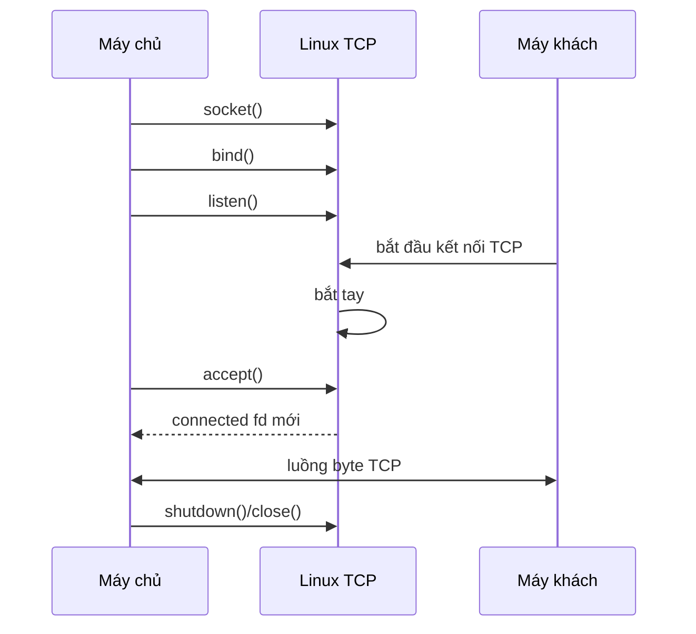
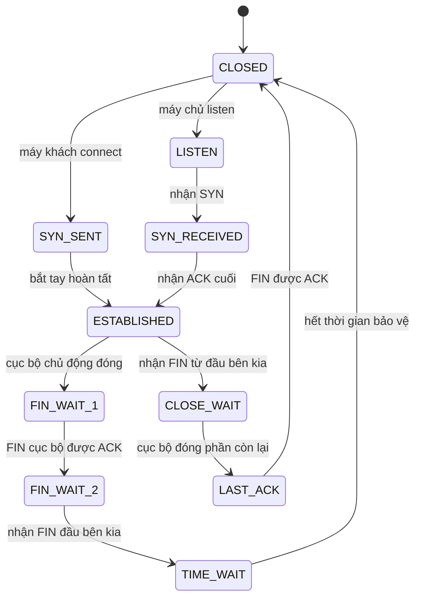

# Chủ đề 9 — Lập trình Socket trong Linux

> **Mục tiêu:** hiểu socket là gì, cách TCP máy chủ/máy khách hình thành kết nối, UDP khác TCP ở đâu, địa chỉ `sockaddr` và thứ tự byte mạng hoạt động thế nào, và cách một kết nối được đóng hoặc báo lỗi ở mức lý thuyết.
>
> **Quy ước ngôn ngữ:** phần giải thích dùng Tiếng Việt. Giữ nguyên các tên chuẩn cần tra cứu như `socket()`, `bind()`, `listen()`, `accept()`, `connect()`, `TCP`, `UDP`, `AF_INET`, `AF_INET6`, `AF_UNIX`, `SOCK_STREAM`, `SOCK_DGRAM`, `sockaddr`, `htons()`, `getaddrinfo()`, `FIN`, `RST`, `TIME_WAIT`.
>
> **Phạm vi:** socket API, miền địa chỉ/kiểu/giao thức, địa chỉ socket, IPv4/IPv6, cổng, byte order, `getaddrinfo()`, TCP và UDP, vòng đời máy chủ/máy khách, TCP bắt tay/trạng thái, luồng byte và đóng khung, I/O từng phần, graceful shutdown, UDP datagram, Unix Miền địa chỉ Socket ở mức socket API và xử lý lỗi cơ bản.
>
> Chương này chỉ có **lý thuyết**, không có bài thực hành. `O_NONBLOCK`, `select()`, `poll()`, `epoll()`, readiness model và event loop thuộc **Chủ đề 10**; Topic 9 chỉ nhắc ranh giới cần thiết.

> **Cách đọc tài liệu này nếu bạn mới bắt đầu:**
> 1. Đọc câu **Nói đơn giản** ở đầu mỗi mục lớn để biết mục đó đang giải quyết vấn đề gì.
> 2. Xem sơ đồ và ví dụ trước; chưa cần nhớ ngay mọi cờ, mã lỗi hay trường hợp đặc biệt.
> 3. Sau khi đã hiểu ý chính, mới đọc các mục `###` theo thứ tự. Nếu gặp thuật ngữ mới, hãy quay lại câu giải thích đầu mục thay vì cố học thuộc định nghĩa.

---

## Mục lục

- [1. Lập trình Socket là gì?](#1-lập-trình-socket-là-gì)
- [2. Miền địa chỉ, kiểu và giao thức quyết định Socket ra sao?](#2-miền-địa-chỉ-kiểu-và-giao-thức-quyết-định-socket-ra-sao)
- [3. Socket có `file descriptor` nhưng không phải tệp thông thường](#3-socket-có-file-descriptor-nhưng-không-phải-tệp-thông-thường)
- [4. Địa chỉ Socket và `sockaddr`](#4-địa-chỉ-socket-và-sockaddr)
- [5. Thứ tự byte mạng: vì sao phải đổi thứ tự byte?](#5-thứ-tự-byte-mạng-vì-sao-phải-đổi-thứ-tự-byte)
- [6. `getaddrinfo()`: từ tên máy tới địa chỉ Socket](#6-getaddrinfo-từ-tên-máy-tới-địa-chỉ-socket)
- [7. Địa chỉ IP, cổng và điểm cuối](#7-địa-chỉ-ip-cổng-và-điểm-cuối)
- [8. `bind()`: chọn địa chỉ và cổng cục bộ](#8-bind-chọn-địa-chỉ-và-cổng-cục-bộ)
- [9. TCP và UDP khác nhau ở mô hình dữ liệu nào?](#9-tcp-và-udp-khác-nhau-ở-mô-hình-dữ-liệu-nào)
- [10. Máy chủ TCP: `socket → bind → listen → accept`](#10-máy-chủ-tcp-socket--bind--listen--accept)
- [11. Máy khách TCP: `socket → connect`](#11-máy-khách-tcp-socket--connect)
- [12. Bắt tay TCP và các trạng thái quan trọng](#12-bắt-tay-tcp-và-các-trạng-thái-quan-trọng)
- [13. TCP là luồng byte: ứng dụng phải tự chia thông điệp](#13-tcp-là-luồng-byte-ứng-dụng-phải-tự-chia-thông-điệp)
- [14. Bộ đệm, áp lực ngược và I/O từng phần trong TCP](#14-bộ-đệm-áp-lực-ngược-và-io-từng-phần-trong-tcp)
- [15. Đóng TCP đúng cách: `shutdown()`, FIN, RST và `TIME_WAIT`](#15-đóng-tcp-đúng-cách-shutdown-fin-rst-và-time_wait)
- [16. UDP: mỗi lần gửi là một Datagram](#16-udp-mỗi-lần-gửi-là-một-datagram)
- [17. UDP `bind()`, `connect()`, `sendto()` và `recvfrom()`](#17-udp-bind-connect-sendto-và-recvfrom)
- [18. `send()` và `recv()`: API truyền nhận dữ liệu cơ bản](#18-send-và-recv-api-truyền-nhận-dữ-liệu-cơ-bản)
- [19. Unix Miền địa chỉ Socket: cùng API nhưng giao tiếp cục bộ](#19-unix-miền địa chỉ-socket-cùng-api-nhưng-giao-tiếp-cục-bộ)
- [20. Tư duy gỡ lỗi Socket theo từng lớp](#20-tư-duy-gỡ-lỗi-socket-theo-từng-lớp)
- [21. Liên hệ với Embedded Linux](#21-liên-hệ-với-embedded-linux)
- [22. Tổng kết và mô hình tư duy](#22-tổng-kết-và-mô-hình-tư-duy)
- [23. Tài liệu tham khảo](#23-tài-liệu-tham-khảo)

---

## 1. Lập trình Socket là gì?

> **Nói đơn giản:** Socket là một điểm giao tiếp do nhân Linux quản lý. Cùng một họ API có thể dùng cho TCP, UDP và Unix Domain Socket.

### 1.1 Socket nằm ở đâu trong hệ thống?

Mô hình đơn giản:

```text
Ứng dụng
   |
   | socket API
   v
Socket trong nhân Linux
   |
   +--> TCP
   |
   +--> UDP
   |
   +--> Unix Miền địa chỉ Socket
```

Với TCP/UDP qua IP:

```text
Ứng dụng
   |
Socket API
   |
TCP / UDP
   |
IP
   |
route / giao diện
   |
NIC / mạng
```

---

### 1.2 Socket là điểm cuối

`socket(2)` mô tả socket như một điểm cuối cho communication.

Hai phía:

```text
Ứng dụng A
   |
Socket A
   |
   +========== giao tiếp ==========+
                                |
                             Socket B
                                |
                           Ứng dụng B
```

---

### 1.3 Socket API không đồng nghĩa TCP

Cùng API socket có thể phục vụ:

```text
TCP
UDP
Unix Miền địa chỉ Socket
```

Do đó:

```text
socket = giao diện/đầu mút
TCP/UDP = giao thức với ngữ nghĩa riêng
```

---

### 1.4 Máy khách và Máy chủ là vai trò

Không có kiểu:

```text
SOCK_CLIENT
SOCK_SERVER
```

Vai trò hình thành bởi chuỗi thao tác.

TCP máy chủ:

```text
socket -> bind -> listen -> accept
```

TCP máy khách:

```text
socket -> connect
```

---

## 2. Miền địa chỉ, kiểu và giao thức quyết định Socket ra sao?

> **Nói đơn giản:** `domain` chọn họ địa chỉ, `type` chọn kiểu truyền như stream/datagram, còn `protocol` chọn giao thức cụ thể nếu cần.

### 2.1 `socket(domain, type, protocol)`

Ba tham số trả lời ba câu hỏi:

```text
miền địa chỉ
  dùng họ địa chỉ/giao thức nào?

kiểu
  kiểu giao tiếp nào?

giao thức
  giao thức cụ thể nào trong cặp trên?
```

---

### 2.2 `AF_INET`

Dùng cho:

```text
IPv4 Internet socket
```

Địa chỉ điển hình gồm:

```text
IPv4 địa chỉ
+
16-bit cổng
```

---

### 2.3 `AF_INET6`

Dùng cho:

```text
IPv6 Internet socket
```

IPv6 địa chỉ rộng 128 bit và có thêm một số trường địa chỉ/định tuyến cục bộ như scope trong cấu trúc địa chỉ socket.

---

### 2.4 `AF_UNIX` / `AF_LOCAL`

Dùng cho giao tiếp socket giữa các tiến trình trên cùng hệ thống Linux/Unix.

không gian tên địa chỉ khác IP:

```text
pathname
hoặc các dạng cục bộ khác tùy hệ thống
```

---

### 2.5 `SOCK_STREAM`

Kiểu luồng cung cấp mô hình:

```text
kết nối
hai chiều
chuỗi byte có thứ tự
```

Với Internet socket, `AF_INET/AF_INET6 + SOCK_STREAM` thông thường tương ứng TCP.

---

### 2.6 `SOCK_DGRAM`

Kiểu datagram giữ ranh giới từng datagram/thông điệp.

Với Internet socket, thông thường tương ứng UDP.

---

### 2.7 `protocol = 0`

Thường có nghĩa:

```text
nhân Linux chọn giao thức mặc định phù hợp với miền địa chỉ + kiểu
```

Ví dụ:

```text
AF_INET + SOCK_STREAM + 0
  -> TCP thông thường

AF_INET + SOCK_DGRAM + 0
  -> UDP thông thường
```

---

### 2.8 Phải nhìn cả ba thành phần

`SOCK_STREAM` một mình chưa nói rõ:

```text
TCP luồng?
AF_UNIX luồng?
```

Ngữ nghĩa đầy đủ là:

```text
miền địa chỉ + kiểu + giao thức
```

---

## 3. Socket có `file descriptor` nhưng không phải tệp thông thường

> **Nói đơn giản:** Socket được tiến trình giữ qua `file descriptor`, nên nhiều thao tác fd áp dụng được; nhưng socket không phải tệp thông thường có offset để `lseek()` như tệp trên đĩa.

### 3.1 `socket()` trả về fd

```text
socket()
   |
   v
fd = 7
```

fd 7 nằm trong cùng bảng bộ mô tả tệp của tiến trình:

```text
fd 0 -> stdin
fd 1 -> stdout
fd 2 -> stderr
fd 7 -> socket
```

---

### 3.2 fd trỏ tới trạng thái socket trong kernel

Cách hình dung:

```text
fd
 |
 v
open file description / nhân Linux file trạng thái
 |
 v
socket đối tượng
 |
 v
TCP/UDP/Unix trạng thái giao thức
```

Với TCP, trạng thái có thể gồm:

```text
điểm cuối cục bộ
điểm cuối từ xa
bộ đệm gửi
bộ đệm nhận
TCP trạng thái
trạng thái lỗi
```

---

### 3.3 Vì sao `read()`/`write()` có thể dùng trên socket?

Vì socket được biểu diễn qua fd và tích hợp vào mô hình I/O của Unix.

Một connected luồng socket có thể dùng:

```text
read()/write()
```

hoặc:

```text
recv()/send()
```

Các API socket-specific thêm khả năng như flags, source/destination và siêu dữ liệu.

---

### 3.4 Nhưng Socket không có vị trí đọc/ghi của tệp

Không nên suy ra:

```text
có fd -> là tệp thông thường
```

Internet socket không có nội dung persistent và không có vị trí seek kiểu tệp thông thường.

---

### 3.5 Nhiều fd có thể trỏ cùng socket

Do:

```text
dup()
fork()
truyền fd
```

có thể có:

```text
fd 7 ----+
         +--> cùng underlying socket
fd 10 ---+
```

Đóng một fd chưa chắc đóng kết nối nếu tham chiếu khác vẫn còn.

---

### 3.6 `FD_CLOEXEC`

Socket fd có thể sống qua `execve()` nếu không đặt close-on-exec.

Rò fd qua `exec` có thể gây:

```text
kết nối sống lâu bất ngờ
socket lắng nghe còn tham chiếu
child thừa quyền truy cập socket
```

---

## 4. Địa chỉ Socket và `sockaddr`

> **Nói đơn giản:** API socket dùng `sockaddr` như dạng chung, còn IPv4/IPv6 có cấu trúc riêng như `sockaddr_in` và `sockaddr_in6`.

### 4.1 Mỗi miền địa chỉ có cấu trúc địa chỉ riêng

IPv4:

```text
IP + cổng
```

IPv6:

```text
IPv6 địa chỉ + cổng + trường IPv6 liên quan
```

Unix Miền địa chỉ:

```text
cục bộ địa chỉ socket
```

API chung cần một cách truyền các cấu trúc khác nhau.

---

### 4.2 `struct sockaddr`

Đây là cấu trúc địa chỉ socket tổng quát dùng ở giao diện API.

Nó chứa ít nhất thông tin family và vùng dữ liệu địa chỉ tương ứng.

Ứng dụng IPv4 thường thao tác bằng `sockaddr_in`, sau đó truyền con trỏ theo kiểu chung mà API yêu cầu.

---

### 4.3 `sockaddr_in` cho IPv4

Mental structure:

```text
sockaddr_in
  |
  +--> sin_family = AF_INET
  |
  +--> sin_port
  |
  +--> sin_addr
```

Điểm cuối IPv4:

```text
IPv4 địa chỉ + TCP/UDP cổng
```

---

### 4.4 `sockaddr_in6` cho IPv6

Hiểu đơn giản:

```text
sockaddr_in6
  |
  +--> sin6_family
  +--> sin6_port
  +--> sin6_addr
  +--> sin6_scope_id
  +--> trường IPv6 khác
```

`scope_id` đặc biệt quan trọng với các địa chỉ có phạm vi như link-cục bộ.

---

### 4.5 `sockaddr_storage`

Nếu chương trình cần một bộ đệm đủ lớn cho nhiều family:

```text
sockaddr_storage
```

được thiết kế đủ lớn và đúng alignment cho các địa chỉ socket chuẩn được hỗ trợ.

---

### 4.6 `socklen_t`

Socket API thường nhận:

```text
pointer tới địa chỉ
+
độ dài địa chỉ
```

vì mỗi family có cấu trúc kích thước khác nhau.

Kiểu độ dài chuẩn là:

```text
socklen_t
```

---

### 4.7 Địa chỉ dạng chữ và dạng nhị phân

Con người dùng:

```text
192.168.1.10
2001:db8::1
```

Socket API làm việc với binary cấu trúc địa chỉ.

Các hàm như:

```text
inet_pton()
inet_ntop()
getaddrinfo()
```

nối hai thế giới này.

---

## 5. Thứ tự byte mạng: vì sao phải đổi thứ tự byte?

> **Nói đơn giản:** Máy tính có thể lưu số nhiều byte theo thứ tự khác nhau; network byte order tạo ra một quy ước chung để hai máy hiểu cùng giá trị.

### 5.1 Little-endian và big-endian

Giá trị 16-bit:

```text
0x1234
```

có thể nằm trong bộ nhớ:

```text
Big-endian:
12 34

Little-endian:
34 12
```

---

### 5.2 thứ tự byte mạng là big-endian

Các trường số của Internet giao thức dùng quy ước thứ tự byte mạng.

Ứng dụng không nên truyền raw integer host-order rồi mong mọi máy hiểu giống nhau.

---

### 5.3 Các hàm chuyển đổi

```text
htons()
  host -> mạng, 16 bit

htonl()
  host -> mạng, 32 bit

ntohs()
  mạng -> host, 16 bit

ntohl()
  mạng -> host, 32 bit
```

---

### 5.4 Vì sao cổng dùng `htons()`?

TCP/UDP cổng là 16 bit.

Cách hình dung:

```text
cổng dạng số host
   |
 htons()
   |
   v
sin_port
```

---

### 5.5 Không chuyển đổi hai lần

Nếu một API đã trả địa chỉ ở dạng cách biểu diễn trên mạng phù hợp, không được mù quáng gọi `hton*()` lại.

Mỗi field/API phải được đọc đúng hợp đồng biểu diễn của nó.

---

### 5.6 `inet_pton()` và `inet_ntop()`

```text
"192.0.2.1"
   |
inet_pton()
   |
   v
binary IPv4 địa chỉ
```

Ngược lại:

```text
địa chỉ nhị phân
   |
inet_ntop()
   |
   v
chuỗi để con người đọc
```

---

## 6. `getaddrinfo()`: từ tên máy tới địa chỉ Socket

> **Nói đơn giản:** `getaddrinfo()` biến hostname/service thành danh sách địa chỉ phù hợp, giúp chương trình hỗ trợ IPv4/IPv6 mà không tự hard-code từng cấu trúc.

### 6.1 Vì sao không nên gắn chương trình cứng vào IPv4?

Máy chủ có thể có:

```text
IPv4
IPv6
nhiều IP
DNS thay đổi
```

tên máy:

```text
example.com
```

không đồng nghĩa một IP duy nhất.

---

### 6.2 `getaddrinfo()` làm gì?

Hiểu đơn giản:

```text
tên máy + service/cổng + yêu cầu family/kiểu
             |
             v
        getaddrinfo()
             |
             v
    danh sách địa chỉ phù hợp
```

---

### 6.3 `struct addrinfo`

Mỗi candidate chứa thông tin như:

```text
ai_family
ai_socktype
ai_protocol
ai_addr
ai_addrlen
ai_next
```

Ứng dụng có thể duyệt nhiều candidate thay vì tự ghép `sockaddr_in` cho mọi trường hợp.

---

### 6.4 `AF_UNSPEC`

Nếu chấp nhận cả IPv4 và IPv6:

```text
AF_UNSPEC
```

cho phép resolver trả nhiều family phù hợp.

Đây là nền cho code ít phụ thuộc IPv4 hơn.

---

### 6.5 Máy khách resolution

```text
tên máy
  +
service
  |
  v
getaddrinfo()
  |
  v
candidate A
candidate B
candidate C
  |
  v
thử socket/connect theo chính sách ứng dụng
```

---

### 6.6 Máy chủ resolution

Với `AI_PASSIVE`, resolver có thể tạo cục bộ wildcard địa chỉ phù hợp cho `bind()` khi máy chủ không chỉ định một cục bộ IP cụ thể.

---

### 6.7 Resolve thành công không có nghĩa connect thành công

`getaddrinfo()` chỉ cho biết:

```text
có thể biểu diễn tên/service thành địa chỉ candidate
```

Nó không chứng minh:

```text
mạng thông
host sống
cổng mở
máy chủ đang chạy
giao thức ứng dụng đúng
```

---

## 7. Địa chỉ IP, cổng và điểm cuối

> **Nói đơn giản:** Một điểm cuối Internet có địa chỉ IP và port. Một kết nối TCP đầy đủ được phân biệt bởi cả điểm cuối cục bộ và điểm cuối phía bên kia.

### 7.1 IP và Cổng trả lời hai câu hỏi khác nhau

Đơn giản hóa:

```text
IP
  máy/địa chỉ mạng nào?

Cổng
  điểm cuối/service giao vận nào trên máy đó?
```

---

### 7.2 Cổng là 16 bit

Range:

```text
0 ... 65535
```

TCP cổng và UDP cổng là hai không gian tên giao vận riêng.

```text
TCP :5000
```

và:

```text
UDP :5000
```

không phải cùng một binding theo giao thức.

---

### 7.3 IANA cổng ranges

IANA chia registry thành:

```text
0–1023
  System Ports

1024–49151
  User/Registered Ports

49152–65535
  Dynamic/Private Ports
```

Đây là phân loại registry.

Range ephemeral mà Linux tự chọn cho máy khách có thể được cấu hình khác; không nên đồng nhất máy móc hai khái niệm.

---

### 7.4 Điểm cuối Internet

Điểm cuối có thể được nghĩ:

```text
giao thức family
+
IP địa chỉ
+
giao vận giao thức
+
cổng
```

Với một socket TCP cụ thể, kết nối được phân biệt bởi cục bộ/điểm cuối từ xas.

---

### 7.5 Một TCP kết nối thường được mô tả bằng 4-tuple

```text
cục bộ IP
cục bộ cổng
từ xa IP
từ xa cổng
```

Ví dụ một máy chủ cổng 8080 có thể phục vụ nhiều máy khách:

```text
192.168.1.10:8080 <-> 192.168.1.20:51001
192.168.1.10:8080 <-> 192.168.1.21:52311
192.168.1.10:8080 <-> 192.168.1.22:60002
```

---

### 7.6 Wildcard địa chỉ

IPv4:

```text
0.0.0.0 / INADDR_ANY
```

khi bind có nghĩa lắng nghe/nhận trên các cục bộ IPv4 địa chỉ phù hợp, không phải một “máy từ xa 0.0.0.0”.

---

### 7.7 Loopback

```text
127.0.0.1
::1
```

là địa chỉ loopback qua IP stack trên cùng host.

Nó khác `AF_UNIX`, dù đều dùng cho giao tiếp cục bộ.

---

## 8. `bind()`: chọn địa chỉ và cổng cục bộ

> **Nói đơn giản:** `bind()` gán địa chỉ/port cục bộ cho socket. Máy chủ thường cần điểm cuối ổn định; máy khách thường để nhân Linux tự chọn port tạm thời.

### 8.1 Socket mới chưa có địa chỉ cục bộ do ứng dụng chọn

`bind()` gán địa chỉ cục bộ/name cho socket.

```text
socket()
   |
   v
socket chưa bind cụ thể
   |
bind(địa chỉ cục bộ)
   |
   v
socket có điểm cuối cục bộ
```

---

### 8.2 Máy chủ thường cần `bind()`

Máy khách phải biết:

```text
máy chủ ở IP/địa chỉ nào?
cổng nào?
```

Do đó máy chủ cần điểm cuối ổn định.

---

### 8.3 Máy khách thường không cần tự bind

Nếu máy khách không bind trước, nhân Linux thường có thể tự chọn:

```text
cục bộ địa chỉ nguồn
+
ephemeral cổng nguồn
```

khi `connect()` hoặc truyền datagram phù hợp.

---

### 8.4 Cổng 0

Bind cổng 0 có thể yêu cầu nhân Linux chọn một cổng khả dụng.

```text
Ứng dụng:
"Tôi cần một cục bộ cổng, số cụ thể không quan trọng"
```

Nhân Linux chọn theo chính sách ephemeral-cổng của hệ thống.

---

### 8.5 `EADDRINUSE`

Thường chỉ ra địa chỉ cục bộ/cổng đang xung đột theo binding/reuse rule hiện tại.

Không nên chỉ nghĩ:

> “Có một chương trình khác dùng đúng cổng.”

Còn có trạng thái giao thức/socket option có thể ảnh hưởng.

---

### 8.6 `EADDRNOTAVAIL`

Thường liên quan tới địa chỉ yêu cầu không khả dụng/không thuộc cục bộ ngữ cảnh hiện tại.

Câu hỏi cần đặt:

```text
Địa chỉ này có thật sự là địa chỉ cục bộ trong namespace/giao diện này không?
```

---

## 9. TCP và UDP khác nhau ở mô hình dữ liệu nào?

> **Nói đơn giản:** TCP cung cấp luồng byte có thứ tự và tin cậy ở mức transport; UDP gửi từng datagram riêng nhưng không đảm bảo đến nơi hay đúng thứ tự.

### 9.1 TCP

TCP cung cấp:

```text
kết nối
hai chiều
đáng tin cậy ở mức luồng byte
đúng thứ tự
luồng byte
```

TCP tự xử lý nhiều cơ chế như retransmission và điều khiển tắc nghẽn.

---

### 9.2 UDP

UDP cung cấp:

```text
datagram
không có bắt tay kết nối kiểu TCP
không bảo đảm giao hàng
không bảo đảm thứ tự
không bảo đảm loại bỏ duplicate
```

Ứng dụng nhìn dữ liệu theo từng datagram.

---

### 9.3 Bảng so sánh

| Thuộc tính | TCP | UDP |
|---|---|---|
| Kết nối giao vận | Có | Không có bắt tay TCP-style |
| Mô hình dữ liệu | luồng byte | datagram |
| Thứ tự | được giữ | không bảo đảm |
| Mất gói | TCP phục hồi theo giao thức | ứng dụng/giao thức tự quyết |
| ranh giới thông điệp | Không | Có |
| điều khiển tắc nghẽn | TCP có | ứng dụng UDP phải tuân thủ guideline phù hợp |

---

### 9.4 “TCP đáng tin cậy” không có nghĩa logic nghiệp vụ thành công

TCP có thể xác nhận luồng byte đã được giao vận đầu bên kia xử lý ở mức giao thức, nhưng không chứng minh:

```text
ứng dụng từ xa đã parse xong
đã ghi database
đã lưu flash
đã thực hiện command thành công
```

Nếu cần xác nhận nghiệp vụ, giao thức ứng dụng phải có ACK/trạng thái riêng.

---

### 9.5 “UDP nhanh hơn TCP” là cách nói quá đơn giản

UDP ít cơ chế giao vận hơn, nhưng ứng dụng có thể phải tự bổ sung:

```text
trình tự
retry
timeout
duplicate detection
congestion handling
session trạng thái
```

Việc lựa chọn phải theo yêu cầu giao thức, không chỉ theo một benchmark latency nhỏ.

---

## 10. Máy chủ TCP: `socket → bind → listen → accept`

> **Nói đơn giản:** TCP máy chủ dùng socket lắng nghe để nhận kết nối mới. Mỗi `accept()` trả về một socket đã kết nối riêng cho một máy khách.

### 10.1 Bước 1 — `socket()`

Tạo điểm cuối:

```text
AF_INET/AF_INET6
+
SOCK_STREAM
```

Ở thời điểm này chưa phải listener.

---

### 10.2 Bước 2 — `bind()`

Chọn điểm cuối cục bộ:

```text
cục bộ IP/wildcard
+
cổng dịch vụ
```

---

### 10.3 Bước 3 — `listen()`

Chuyển socket luồng sang vai trò thụ động:

```text
socket lắng nghe
```

Nó nhận kết nối request chứ không phải là socket dữ liệu riêng của một máy khách.

---

### 10.4 Bước 4 — `accept()`

Khi có kết nối đã sẵn sàng:

```text
accept()
   |
   v
fd mới
```

fd mới là **socket đã kết nối** cho một đầu bên kia cụ thể.

---

### 10.5 socket lắng nghe và socket đã kết nối phải tách nhau trong đầu

```text
                 Listening fd
                    :8080
                      |
        +-------------+-------------+
        |             |             |
        v             v             v
 Connected A     Connected B     Connected C
 máy khách A         máy khách B        máy khách C
```

Listener tiếp tục dùng cho `accept()` các kết nối sau.

---

### 10.6 `backlog`

`listen(backlog)` liên quan tới hàng đợi kết nối đang chờ ứng dụng accept.

Không được hiểu:

```text
backlog = số máy khách tối đa suốt đời máy chủ
```

Trên Linux hiện đại, `listen(2)` mô tả backlog theo hàng đợi kết nối đã hoàn tất bắt tay chờ accept, trong khi SYN hàng đợi có quản lý riêng.

---

### 10.7 Chuỗi máy chủ



---

## 11. Máy khách TCP: `socket → connect`

> **Nói đơn giản:** TCP máy khách tạo socket rồi `connect()` tới máy chủ. Kết nối TCP thành công chỉ nói transport đã nối, chưa nói yêu cầu của ứng dụng đã thành công.

### 11.1 Chuỗi cơ bản

```text
tên máy/service
      |
getaddrinfo()
      |
      v
socket()
      |
connect(máy chủ địa chỉ)
      |
      v
socket đã kết nối
```

---

### 11.2 `connect()` với TCP

`connect()` bắt đầu active open tới điểm cuối từ xa.

Ở chế độ blocking thông thường, lời gọi có thể chờ tới khi:

```text
kết nối thành công
hoặc
lỗi/timeout
```

Nonblocking connect và `EINPROGRESS` thuộc Topic 10.

---

### 11.3 điểm cuối cục bộ có thể được kernel chọn

Máy khách thường chỉ chỉ định:

```text
từ xa địa chỉ + từ xa cổng
```

Nhân Linux dựa trên route để chọn:

```text
cục bộ địa chỉ nguồn
cục bộ cổng tạm thời
```

---

### 11.4 `connect()` thành công chỉ là thành công ở tầng TCP

Không chứng minh:

```text
máy chủ ứng dụng chấp nhận login
giao thức version đúng
request được xử lý
```

Đó là tầng giao thức ứng dụng.

---

## 12. Bắt tay TCP và các trạng thái quan trọng

> **Nói đơn giản:** TCP có trạng thái machine và three-way handshake. Các trạng thái như `ESTABLISHED`, `CLOSE_WAIT`, `TIME_WAIT` giúp giải thích nhiều hiện tượng khi debug.

### 12.1 TCP có máy trạng thái

Một kết nối TCP đi qua những trạng thái như:

```text
CLOSED
LISTEN
SYN-SENT
SYN-RECEIVED
ESTABLISHED
FIN-WAIT-1
FIN-WAIT-2
CLOSE-WAIT
LAST-ACK
TIME-WAIT
```

Không nên nghĩ TCP chỉ có:

```text
connected / disconnected
```

---

### 12.2 bắt tay ba bước

```text
Máy khách                         Máy chủ

SYN -------------------------->

    <--------------------- SYN + ACK

ACK -------------------------->

ESTABLISHED                 ESTABLISHED
```

Bắt tay đồng bộ trạng thái kết nối và trình tự number giữa hai điểm cuối.

---

### 12.3 `LISTEN`

Máy chủ passive socket đang chờ quá trình bắt đầu kết nối.

---

### 12.4 `SYN-SENT`

Máy khách đã gửi yêu cầu active open và đang chờ phản hồi bắt tay.

---

### 12.5 `SYN-RECEIVED`

Phía nhận đã nhận SYN, trả SYN/ACK và chờ hoàn tất bắt tay.

---

### 12.6 `ESTABLISHED`

Kết nối hai phía đã được thiết lập ở mức TCP và có thể truyền luồng byte.

---

### 12.7 máy trạng thái đơn giản



RFC 9293 có máy trạng thái đầy đủ hơn; sơ đồ trên phục vụ nhập môn.

---

## 13. TCP là luồng byte: ứng dụng phải tự chia thông điệp

> **Nói đơn giản:** TCP chỉ giữ thứ tự byte, không giữ ranh giới message của ứng dụng. Nếu ứng dụng có message, nó phải tự định nghĩa cách chia khung.

> **Đây là một trong những điểm quan trọng nhất của lập trình Socket.** TCP không giữ ranh giới giữa các lần `send()`.

### 13.1 Ví dụ

Sender:

```text
send("ABC")
send("DEF")
```

Receiver có thể thấy:

```text
recv -> "ABCDEF"
```

hoặc:

```text
recv -> "A"
recv -> "BCDE"
recv -> "F"
```

miễn thứ tự byte đúng.

---

### 13.2 `send()` ranh giới không phải `recv()` ranh giới

Sai:

```text
1 send = 1 recv
```

Đúng:

```text
send đưa byte vào luồng
recv lấy một số byte hiện có từ luồng
```

---

### 13.3 TCP segment cũng không phải thông điệp

Nhân Linux có thể:

```text
chia dữ liệu thành nhiều TCP segment
hoặc gộp dữ liệu ứng dụng vào segment
```

theo giao thức/MTU/bộ đệm/timing.

RFC 9293 nhấn mạnh TCP segment không tương ứng 1:1 với ứng dụng write/send.

---

### 13.4 đóng khung thông điệp ở tầng ứng dụng

Nếu ứng dụng có thông điệp:

```text
[M1][M2][M3]
```

phải tự mã hóa ranh giới vào luồng byte.

Các cách khái niệm:

```text
fixed-size frame
tiền tố độ dài
separator/delimiter
giao thức grammar
```

---

### 13.5 tiền tố độ dài

```text
+--------+------------------+--------+----------+
| len=20 | 20 byte payload  | len=5  | 5 byte   |
+--------+------------------+--------+----------+
```

Receiver phải có máy trạng thái:

```text
đọc đủ header
    |
parse length
    |
đọc đủ payload
    |
chuyển sang frame tiếp theo
```

---

### 13.6 Đóng khung cần giới hạn và kiểm tra

Đầu bên kia có thể gửi:

```text
length vô lý
frame thiếu
payload lỗi
```

Do đó đóng khung không chỉ là tiện lợi mà còn là biên kiểm tra dữ liệu không tin cậy.

---

## 14. Bộ đệm, áp lực ngược và I/O từng phần trong TCP

> **Nói đơn giản:** `send()`/`recv()` có thể xử lý ít byte hơn yêu cầu. Bộ đệm hữu hạn khiến chương trình phải đối mặt với partial I/O và áp lực ngược.

### 14.1 `send()` không gửi thẳng vào tay ứng dụng từ xa ngay lập tức

Mô hình đơn giản:

```text
Ứng dụng A
   |
send()
   |
   v
bộ đệm gửi / TCP cục bộ
   |
mạng
   |
bộ đệm nhận / TCP từ xa
   |
recv()
   |
   v
Ứng dụng B
```

---

### 14.2 Send thành công không có nghĩa đầu bên kia đã xử lý

Nếu `send()` trả số byte dương, cục bộ stack đã chấp nhận tiến triển tương ứng.

Nó không chứng minh:

```text
đầu bên kia ứng dụng đã recv
đã parse
đã ghi flash
giao dịch đã thành công
```

---

### 14.3 I/O từng phần khi gửi

```text
muốn gửi N byte
send() trả M
0 < M < N
```

đây có thể là tiến triển hợp lệ.

Ứng dụng luồng phải theo dõi:

```text
đã gửi bao nhiêu
còn bao nhiêu
```

---

### 14.4 `recv()` có thể trả ít hơn bộ đệm yêu cầu

Nếu gọi với bộ đệm 4096 byte nhưng hiện chỉ có 125 byte:

```text
recv() có thể trả 125
```

không cần chờ đủ 4096 trong ngữ nghĩa thông thường.

---

### 14.5 `recv() == 0` trên TCP

Khi mọi byte trước đó đã được đọc và đầu bên kia đã đóng orderly phía gửi:

```text
recv() -> 0
```

Đó là EOF của TCP luồng.

Không phải:

```text
"nhận một packet TCP có payload 0"
```

---

### 14.6 Bộ đệm hữu hạn tạo áp lực ngược

Nếu ứng dụng gửi nhanh hơn mạng/đầu bên kia đọc:

```text
bộ đệm gửi dần đầy
   |
   v
send blocking phải chờ
```

hoặc nonblocking sẽ báo chưa sẵn sàng.

---

### 14.7 TCP điều khiển luồng và điều khiển tắc nghẽn

Hai khái niệm khác nhau:

```text
điều khiển luồng
  tránh gửi quá khả năng nhận của đầu bên kia

điều khiển tắc nghẽn
  điều chỉnh theo khả năng đường mạng
```

Ứng dụng-level hàng đợi/áp lực ngược vẫn là lớp khác phía trên.

---

## 15. Đóng TCP đúng cách: `shutdown()`, FIN, RST và `TIME_WAIT`

> **Nói đơn giản:** TCP là full-duplex nên hai chiều có thể đóng riêng. `shutdown()` khác `close()`, FIN khác RST, và `TIME_WAIT` không đồng nghĩa socket bị leak.

### 15.1 TCP là song công toàn phần

Có hai chiều:

```text
A =====> B
A <===== B
```

mỗi chiều có thể được đóng độc lập.

---

### 15.2 `shutdown()`

```text
SHUT_RD
  ngừng phía nhận

SHUT_WR
  ngừng phía gửi

SHUT_RDWR
  ngừng cả hai
```

`shutdown()` thay đổi trạng thái truyền thông của socket.

---

### 15.3 `shutdown()` khác `close()`

```text
shutdown()
  điều khiển các hướng truyền dữ liệu

close()
  giải phóng một bộ mô tả tệp tham chiếu
```

Nếu cùng socket còn fd tham chiếu khác, `close()` một fd chưa chắc phá toàn bộ socket ngay.

---

### 15.4 đóng một chiều

Một phía có thể báo:

```text
"Tôi gửi xong rồi, nhưng vẫn muốn nhận"
```

Ví dụ:

```text
Máy khách gửi request
Máy khách shutdown(SHUT_WR)
        |
        v
Máy chủ đọc tới EOF request
Máy chủ vẫn gửi response
        |
        v
Máy khách vẫn recv response
```

---

### 15.5 FIN

FIN có nghĩa:

```text
không còn byte mới trong chiều gửi này
```

không có nghĩa toàn kết nối đối tượng biến mất ngay.

---

### 15.6 Đóng bình thường

Mô hình đơn giản:

```text
A                              B

FIN -------------------------->
    <----------------------- ACK
    <----------------------- FIN
ACK -------------------------->
```

FIN và ACK có thể được kết hợp tùy timing/trạng thái giao thức.

---

### 15.7 `CLOSE_WAIT`

Đầu bên kia đã gửi FIN, cục bộ TCP đã nhận.

```text
đầu bên kia: không gửi thêm
cục bộ ứng dụng: vẫn chưa đóng phía của mình
```

Nếu `CLOSE_WAIT` tồn tại lâu bất thường, thường nên kiểm tra ứng dụng có quên hoàn tất vòng đời socket hay không.

---

### 15.8 `TIME_WAIT`

Phía active close thường đi qua `TIME_WAIT` để bảo vệ correctness của TCP trước delayed duplicate và final ACK handling.

`TIME_WAIT` là trạng thái TCP bình thường.

Không nên kết luận:

```text
TIME_WAIT = fd leak
```

---

### 15.9 RST

`RST` biểu diễn đường kết thúc/reset không orderly như FIN.

Ứng dụng cần phân biệt:

```text
EOF orderly
```

với:

```text
ECONNRESET / reset
```

vì ý nghĩa dữ liệu có thể khác nhau.

---

### 15.10 `SIGPIPE` và `EPIPE`

Gửi trên luồng không còn khả năng gửi có thể tạo:

```text
SIGPIPE
+
EPIPE
```

nếu signal không kết thúc tiến trình trước.

Linux/Socket API cũng có cách per-call như `MSG_NOSIGNAL` để không phát `SIGPIPE` cho lần gửi đó mà vẫn nhận lỗi.

---

## 16. UDP: mỗi lần gửi là một Datagram

> **Nói đơn giản:** UDP giữ từng datagram riêng. Mỗi datagram có ranh giới rõ nhưng có thể mất, lặp hoặc đến sai thứ tự.

### 16.1 ranh giới thông điệp được giữ

Sender:

```text
Datagram A
Datagram B
Datagram C
```

Receiver, nếu nhận đủ, xử lý từng datagram riêng.

UDP không gộp chúng thành một luồng byte duy nhất.

---

### 16.2 Không có bắt tay ba bước

Sender UDP không cần:

```text
SYN -> SYN/ACK -> ACK
```

trước khi gửi datagram.

---

### 16.3 Không bảo đảm việc chuyển tới đích

Một datagram có thể:

```text
đến
mất
đến lặp
đến sau datagram gửi sau
```

Nếu ứng dụng cần reliability, nó phải chọn giao thức phù hợp hoặc xây logic phù hợp trên UDP.

---

### 16.4 UDP vẫn có trạng thái ở socket/kernel

“Connectionless” không có nghĩa socket không giữ gì.

Socket vẫn có thể có:

```text
địa chỉ cục bộ/cổng
connected đầu bên kia mặc định
receive queue
trạng thái lỗi
socket options
```

---

### 16.5 Kích thước datagram quan trọng

Datagram quá lớn có thể chạm:

```text
path MTU
fragmentation
EMSGSIZE
```

Fragmentation làm datagram nhạy với mất mát hơn vì mất một fragment có thể làm cả datagram không tái hợp được.

---

### 16.6 UDP và điều khiển tắc nghẽn

UDP không tự có TCP điều khiển tắc nghẽn.

RFC 8085 yêu cầu thiết kế UDP ứng dụng/giao thức phải ứng xử có trách nhiệm với congestion.

Không nên hiểu UDP là:

```text
"cứ gửi nhanh nhất có thể"
```

---

## 17. UDP `bind()`, `connect()`, `sendto()` và `recvfrom()`

> **Nói đơn giản:** UDP có thể `bind()` địa chỉ cục bộ và có thể `connect()` để cố định peer mặc dù không có handshake kết nối như TCP.

### 17.1 UDP máy chủ thường `bind()`

```text
socket(SOCK_DGRAM)
      |
bind(cục bộ cổng)
      |
      v
recvfrom()/sendto()
```

Máy khách biết cổng đó để gửi datagram tới.

---

### 17.2 UDP không cần `listen()`/`accept()`

Một socket UDP đã bind có thể nhận từ nhiều sender:

```text
Máy khách A ---\
Máy khách B ----> UDP socket :5000
Máy khách C ---/
```

Không có connected fd mới cho mỗi máy khách như TCP `accept()`.

---

### 17.3 `sendto()`

Mỗi lần gửi có thể chỉ rõ destination:

```text
Datagram 1 -> Đầu bên kia A
Datagram 2 -> Đầu bên kia B
Datagram 3 -> Đầu bên kia C
```

---

### 17.4 `recvfrom()`

Ngoài payload, có thể nhận địa chỉ nguồn của datagram.

```text
payload
+
sender địa chỉ
```

Đây là cơ sở để một UDP máy chủ biết phải trả response về đâu.

---

### 17.5 `connect()` trên UDP không tạo TCP kết nối

Đây là điểm rất dễ nhầm.

UDP `connect()` chủ yếu gắn socket với một đầu bên kia mặc định và thay đổi cách nhân Linux lọc/liên kết gửi nhận/lỗi.

Không có:

```text
TCP bắt tay
retransmission guarantee
đúng thứ tự luồng byte
```

---

### 17.6 UDP đã `connect()` có thể dùng `send()`/`recv()`

Sau khi `connect()`:

```text
send()
  dùng đầu bên kia mặc định

recv()
  nhận trong association đã chọn
```

nhưng giao vận vẫn là UDP.

---

### 17.7 UDP có thể báo lỗi bất đồng bộ

Linux có thể lưu/trả mạng error liên quan datagram trước đó ở thao tác sau.

Do đó một lỗi UDP không phải lúc nào cũng đồng bộ 1:1 với đúng lần `send()` hiện tại.

---

---

## 18. `send()` và `recv()`: API truyền nhận dữ liệu cơ bản

> **Nói đơn giản:** `send()` và `recv()` là API truyền nhận cơ bản cho socket đã có ngữ cảnh phù hợp. Giá trị trả về phải luôn được kiểm tra để biết số byte thực tế.

### 18.1 Nhóm hàm gửi dữ liệu

Hai API cơ bản cần phân biệt:

```text
send()
sendto()
```

`send()` phù hợp khi socket đã biết đầu bên kia, ví dụ TCP socket đã kết nối hoặc UDP socket đã gọi `connect()`.

`sendto()` cho phép chỉ rõ địa chỉ đích cho từng lần gửi, nên rất tự nhiên với UDP chưa kết nối.

---

### 18.2 `send()`

Mô hình tư duy:

```text
socket đã biết đầu bên kia
        |
      send()
        |
        v
nhân Linux nhận một phần/toàn bộ số byte được yêu cầu
```

Giá trị trả về cho biết số byte mà lời gọi đã chấp nhận xử lý. Với socket kiểu luồng, số byte này có thể nhỏ hơn số byte ứng dụng yêu cầu gửi.

---

### 18.3 `sendto()`

`sendto()` thêm một địa chỉ đích:

```text
dữ liệu
  +
địa chỉ đích
  |
  v
sendto()
```

Với UDP, cùng một socket chưa kết nối có thể gửi các datagram khác nhau tới các đích khác nhau.

---

### 18.4 Nhóm hàm nhận dữ liệu

Hai API cơ bản:

```text
recv()
recvfrom()
```

`recv()` nhận dữ liệu khi ứng dụng không cần lấy địa chỉ nguồn trên từng lần nhận.

`recvfrom()` ngoài dữ liệu còn có thể trả lại địa chỉ của bên đã gửi datagram.

---

### 18.5 `recv()`

Với TCP, `recv()` lấy các byte từ luồng nhận:

```text
TCP receive stream
       |
       v
    recv()
       |
       v
một số byte đang sẵn có
```

Không được giả định rằng một lần `recv()` sẽ trả đúng một thông điệp của ứng dụng.

---

### 18.6 `recvfrom()`

Với UDP chưa kết nối:

```text
Datagram
   |
   +--> payload
   |
   +--> địa chỉ nguồn
```

`recvfrom()` cho phép ứng dụng nhận cả hai. Đây là cơ sở để một máy chủ UDP biết phải gửi phản hồi về địa chỉ nào.

---

### 18.7 Bộ đệm nhận nhỏ hơn Datagram

UDP giữ ranh giới datagram. Nếu bộ đệm ứng dụng nhỏ hơn datagram nhận được, phần vượt quá kích thước bộ đệm có thể bị loại bỏ và API/cờ trạng thái có thể báo việc cắt ngắn dữ liệu.

Điều này khác TCP:

```text
TCP:
byte chưa đọc vẫn còn trong luồng

UDP:
mỗi datagram là một đơn vị riêng
```

---

### 18.8 `send()` thành công không bảo đảm đầu bên kia đã nhận/xử lý dữ liệu

Linux `send(2)` phân biệt rõ việc dữ liệu được socket cục bộ chấp nhận với việc dữ liệu đã được ứng dụng ở đầu bên kia xử lý.

Mô hình:

```text
send() thành công
      |
      v
socket cục bộ đã nhận dữ liệu từ ứng dụng
      |
      X
không đồng nghĩa
      |
      v
ứng dụng đầu bên kia đã xử lý thành công
```

Nếu giao thức ứng dụng cần xác nhận nghiệp vụ, nó phải tự định nghĩa thông điệp phản hồi/xác nhận phù hợp.

---

## 19. Unix Domain Socket: cùng API nhưng giao tiếp cục bộ

> **Nói đơn giản:** Unix Domain Socket dùng cùng phong cách API socket nhưng giao tiếp giữa tiến trình trên cùng máy, không đi qua mạng IP theo cách TCP/UDP Internet socket làm.

### 19.1 Mối liên hệ với Topic 8

Topic 8 đã giải thích Unix Domain Socket ở góc nhìn IPC. Trong Topic 9 chỉ cần giữ một ý quan trọng:

```text
cùng Socket API
      |
      +--> AF_INET / AF_INET6 : giao tiếp qua IP
      |
      +--> AF_UNIX            : giao tiếp cục bộ
```

Nhờ đó, cùng tư duy máy chủ/máy khách có thể được dùng cho cả dịch vụ mạng và dịch vụ chỉ chạy trên một máy.

---

### 19.2 Chuỗi API ở mức cao gần giống TCP

Máy chủ Unix Domain Socket kiểu luồng:

```text
socket(AF_UNIX, SOCK_STREAM)
        |
       bind
        |
      listen
        |
      accept
```

Máy khách:

```text
socket(AF_UNIX, SOCK_STREAM)
        |
      connect
```

Điểm khác nằm ở:

```text
miền địa chỉ
đường truyền cục bộ
quy tắc đặt tên/vòng đời
khả năng đặc thù của AF_UNIX
```

chứ không phải ở mô hình API cơ bản.

---

### 19.3 Miền địa chỉ + kiểu Socket quyết định ngữ nghĩa

So sánh:

```text
AF_INET + SOCK_STREAM
  -> TCP qua IP
  -> luồng byte

AF_UNIX + SOCK_STREAM
  -> giao tiếp cục bộ
  -> vẫn là luồng byte
```

Cả hai đều **không giữ ranh giới thông điệp của ứng dụng** khi dùng `SOCK_STREAM`.

---

### 19.4 Ý nghĩa trong kiến trúc hệ thống

Một dịch vụ có thể dùng mô hình máy chủ/máy khách nhưng không cần mở cổng ra mạng:

```text
Ứng dụng A
    |
AF_UNIX socket
    |
Dịch vụ cục bộ
```

Điều này giúp tách hai câu hỏi:

```text
API dịch vụ hoạt động thế nào?

và

Dịch vụ có cần được truy cập qua mạng không?
```

---

## 20. Tư duy gỡ lỗi Socket theo từng lớp

> **Nói đơn giản:** Debug socket nên đi từng lớp: địa chỉ/port → socket trạng thái → transport → I/O → giao thức ứng dụng, tránh gom mọi lỗi thành 'mạng hỏng'.

### 20.1 Một lỗi Socket có thể nằm ở nhiều lớp

```text
Giao thức ứng dụng
        |
Socket / fd
        |
TCP hoặc UDP
        |
IP / định tuyến
        |
Giao diện mạng
        |
Mạng vật lý / đầu bên kia
```

Cùng biểu hiện “không nhận được dữ liệu” có thể xuất phát từ những lớp rất khác nhau.

---

### 20.2 Mô hình gỡ lỗi theo lớp

```text
Giao thức ứng dụng đúng chưa?
        ↓
Socket đang ở trạng thái đúng chưa?
        ↓
TCP/UDP đang ở trạng thái nào?
        ↓
Địa chỉ/cổng cục bộ đúng chưa?
        ↓
Có route/giao diện mạng phù hợp không?
        ↓
Đầu bên kia có thể truy cập được không?
        ↓
Dịch vụ ở đầu bên kia có đang lắng nghe/phản hồi không?
```

---

### 20.3 Lỗi tại `socket()`

Nếu `socket()` thất bại, vấn đề còn xảy ra **trước khi** xét khả năng kết nối tới đầu bên kia.

Các nhóm nguyên nhân có thể gồm:

```text
họ địa chỉ/giao thức không được hỗ trợ
hết bộ mô tả tệp
tài nguyên nhân Linux không đủ
quyền không cho phép
```

---

### 20.4 `bind()` trả `EADDRINUSE`

Ý nghĩa chính:

```text
địa chỉ/cổng cục bộ được yêu cầu
không thể bind theo trạng thái hiện tại
```

Có thể liên quan tới:

```text
socket khác đang dùng
quy tắc tái sử dụng địa chỉ
trạng thái TCP trước đó
xung đột cấp cổng
```

---

### 20.5 `bind()` trả `EADDRNOTAVAIL`

Thường cần hỏi:

```text
Địa chỉ này có thực sự thuộc máy/giao diện/network namespace hiện tại không?
```

Đây không phải cùng một lỗi với “cổng đang được dùng”.

---

### 20.6 `connect()` trả `ECONNREFUSED`

`ECONNREFUSED` thường thuộc lớp:

```text
đích đã phản hồi
nhưng không có điểm lắng nghe phù hợp
```

Nó khác `ETIMEDOUT`, nơi quá trình thiết lập kết nối không hoàn tất trong thời gian cho phép.

---

### 20.7 `ENETUNREACH` và `EHOSTUNREACH`

Đây là các lỗi thuộc nhóm:

```text
định tuyến / khả năng tới mạng hoặc máy đích
```

Nó xảy ra thấp hơn tầng giao thức ứng dụng.

---

### 20.8 `accept()` chờ mãi

Có thể đơn giản là chưa có kết nối hoàn tất nào trong hàng đợi `accept()`.

Cần phân biệt:

```text
máy chủ đã listen
```

với:

```text
kết nối từ máy khách thực sự tới được máy chủ
```

Các nguyên nhân cần nghĩ tới:

```text
sai địa chỉ/cổng
máy khách chưa connect
định tuyến/firewall
khác network namespace
quá trình bắt tay TCP chưa hoàn tất
```

---

### 20.9 `recv()` chờ

Một `recv()` đang chặn không tự động có nghĩa deadlock.

Nó có thể chỉ có nghĩa:

```text
kết nối vẫn tồn tại
nhưng hiện chưa có dữ liệu, EOF hoặc lỗi để trả về
```

---

### 20.10 `recv() == 0` trên TCP

Trên TCP, sau khi các byte đã nhận trước đó được đọc hết:

```text
recv() == 0
```

có nghĩa đầu bên kia đã đóng có trật tự chiều gửi của nó.

Không nên hiểu đây là:

```text
"nhận được một gói TCP dài 0 byte"
```

---

### 20.11 `ECONNRESET`

`ECONNRESET` biểu thị kết nối bị đặt lại/huỷ theo kiểu bất thường.

Cần phân biệt:

```text
EOF do FIN
```

với:

```text
reset do RST
```

vì ý nghĩa vòng đời và dữ liệu khác nhau.

---

### 20.12 `EPIPE` và `SIGPIPE`

Khi gửi vào một luồng không còn cho phép gửi:

```text
EPIPE
+
SIGPIPE
```

có thể xuất hiện theo ngữ nghĩa POSIX/Linux.

Do đó xử lý `SIGPIPE` là một phần của thiết kế lỗi đối với socket kiểu luồng.

---

### 20.13 `EINTR`

Một lời gọi socket đang chặn có thể bị signal ngắt.

Cần áp dụng kiến thức Topic 5:

```text
SA_RESTART
ngữ nghĩa của từng lời gọi hệ thống
I/O đã tiến triển một phần hay chưa
chính sách timeout/hủy của ứng dụng
```

Không nên biến mọi `EINTR` thành một vòng lặp retry vô điều kiện mà không hiểu trạng thái ứng dụng.

---

### 20.14 UDP có thể mất Datagram mà phía gửi không thấy lỗi trực tiếp

`send()`/`sendto()` thành công không chứng minh datagram đã tới ứng dụng phía nhận.

Sau đó vẫn có thể xảy ra:

```text
mất trên mạng
bị phía nhận loại bỏ
ứng dụng phía nhận không xử lý
```

Đây là bản chất của mô hình UDP.

---

### 20.15 Lỗi UDP bất đồng bộ

Linux có thể báo một lỗi mạng liên quan tới datagram đã gửi trước đó ở một thao tác socket xảy ra sau đó.

Vì vậy không nên luôn giả định:

```text
lỗi trả về ở lần gọi N
= lỗi chỉ thuộc datagram của lần gọi N
```

---

### 20.16 Lỗi đóng khung thông điệp trên TCP

Triệu chứng:

```text
hai thông điệp dính vào nhau
một thông điệp bị tách thành nhiều lần recv
header chỉ nhận được một phần
```

thường có nghĩa ứng dụng đã giả định sai:

```text
một send() = một recv()
```

TCP có thể đang hoạt động hoàn toàn đúng.

---

### 20.17 Lỗi thứ tự byte

Triệu chứng có thể là:

```text
cổng 8080 xuất hiện thành giá trị khác
trường số nguyên trong giao thức bị đọc sai
```

Cần phân biệt ba dạng:

```text
giá trị số nguyên trên máy
cách biểu diễn theo thứ tự byte mạng
dạng chữ để con người đọc
```

---

### 20.18 Sai họ địa chỉ hoặc kích thước cấu trúc

Ví dụ lớp lỗi:

```text
dùng sockaddr_in cho kết quả IPv6
truyền sai addrlen
family không khớp cấu trúc
```

Khi dùng `getaddrinfo()`, nên tôn trọng trực tiếp:

```text
ai_addr
ai_addrlen
ai_family
```

thay vì tự giả định mọi địa chỉ đều là IPv4.

---

### 20.19 TCP đã kết nối nhưng ứng dụng vẫn lỗi

Khi TCP đã kết nối thành công, việc gỡ lỗi phải chuyển lên tầng ứng dụng:

```text
đóng khung thông điệp
phiên bản giao thức
xác thực
phân tích request
máy trạng thái của giao thức
timeout
logic nghiệp vụ
```

Socket thành công chỉ chứng minh một phần của toàn bộ hệ thống.

---

### 20.20 Có nhiều `TIME_WAIT`

Cách hiểu đầu tiên phải là:

```text
đây có thể là trạng thái TCP bình thường của phía chủ động đóng
```

Chỉ sau đó mới đánh giá xem số lượng lớn có gây áp lực lên tài nguyên/cổng hay không.

Không nên coi mọi `TIME_WAIT` là rò rỉ socket.

---

### 20.21 Có nhiều `CLOSE_WAIT`

`CLOSE_WAIT` thường cho thấy:

```text
đầu bên kia đã gửi FIN
nhưng ứng dụng cục bộ chưa hoàn tất việc đóng phía mình
```

Nếu trạng thái này tồn tại lâu với số lượng lớn, cần xem lại vòng đời bộ mô tả/kết nối trong ứng dụng.

---

## 21. Liên hệ với Embedded Linux

> **Nói đơn giản:** Embedded Linux dùng socket cho service cục bộ, telemetry, điều khiển từ xa, giao tiếp daemon và kết nối thiết bị với gateway/cloud.

### 21.1 Thiết bị Embedded Linux làm máy chủ mạng

Một thiết bị có thể cung cấp:

```text
dịch vụ chẩn đoán
dịch vụ cấu hình
điểm gửi telemetry
API điều khiển thiết bị
gateway cục bộ
```

qua TCP hoặc UDP.

---

### 21.2 Thiết bị Embedded Linux làm máy khách mạng

Thiết bị có thể chủ động kết nối tới:

```text
cloud
gateway trong mạng cục bộ
máy chủ quản lý
dịch vụ thời gian/cấu hình
```

Vòng đời phía máy khách phải tính tới:

```text
mạng có/không có
phân giải tên
kết nối thất bại
retry và backoff
reconnect
đóng dịch vụ
```

Topic 9 cung cấp nền ngữ nghĩa socket; kiến trúc timer/event loop sẽ thuộc các topic sau.

---

### 21.3 TCP làm kênh điều khiển

TCP phù hợp khi ứng dụng cần:

```text
luồng lệnh đáng tin cậy và đúng thứ tự
trao đổi cấu hình
request/response
điều khiển hoặc metadata firmware
```

Nhưng ứng dụng vẫn phải tự định nghĩa ranh giới thông điệp trên luồng byte TCP.

---

### 21.4 UDP cho telemetry hoặc điều khiển nhẹ

UDP có thể phù hợp với:

```text
các datagram telemetry độc lập
discovery
multicast/broadcast
luồng ưu tiên độ trễ thấp
```

khi giao thức ứng dụng đã tính tới:

```text
mất gói
đảo thứ tự
trùng dữ liệu
tắc nghẽn
kích thước datagram
```

---

### 21.5 Dịch vụ cục bộ và dịch vụ mạng

Cùng mô hình socket có thể chọn:

```text
AF_UNIX
  -> chỉ giao tiếp trên cùng máy

AF_INET / AF_INET6
  -> có thể giao tiếp qua IP
```

Điều này giúp tách thiết kế API của dịch vụ khỏi quyết định có cho phép truy cập qua mạng hay không.

---

### 21.6 Giới hạn tài nguyên rất quan trọng

Thiết bị Embedded Linux có thể bị giới hạn về:

```text
RAM
bộ mô tả tệp
bộ đệm socket
luồng
CPU
băng thông mạng
```

Mỗi kết nối TCP đồng thời đều tiêu tốn trạng thái trong nhân Linux và ứng dụng.

Vì vậy kiến trúc số kết nối không nên tăng vô hạn.

---

### 21.7 TCP keepalive khác heartbeat của ứng dụng

TCP keepalive kiểm tra đường truyền/kết nối sau một khoảng thời gian không hoạt động theo các tham số TCP.

Heartbeat của ứng dụng có thể kiểm tra ý nghĩa ở mức cao hơn:

```text
dịch vụ còn phản hồi không?
đường xử lý sensor còn sống không?
trạng thái đầu bên kia còn hợp lệ không?
```

Hai cơ chế giải quyết hai bài toán khác nhau.

---

### 21.8 Đóng dịch vụ có kiểm soát

Một dịch vụ có thể nhận `SIGTERM` từ `systemd`/init.

Mô hình lý thuyết:

```text
nhận yêu cầu dừng
      |
ngừng nhận công việc/kết nối mới
      |
hoàn tất hoặc hủy các thao tác đang chạy
      |
shutdown các chiều socket nếu cần
      |
close bộ mô tả
      |
tiến trình kết thúc
```

Đây là nơi kiến thức Signal, Luồng Synchronization và Socket gặp nhau.

---

### 21.9 Thứ tự byte mạng đặc biệt quan trọng khi các kiến trúc khác nhau giao tiếp

Thiết bị có thể giao tiếp giữa:

```text
x86
ARM
MCU
SoC khác
```

Không được gửi thẳng một `struct` C trong RAM rồi giả định hai phía có cùng:

```text
endianness
padding
alignment
kích thước kiểu dữ liệu
ABI
```

Giao thức phải định nghĩa định dạng dữ liệu trên đường truyền một cách độc lập với ABI của chương trình.

---

### 21.10 Tuần tự hóa dữ liệu là bài toán riêng với Socket

Socket chỉ truyền:

```text
luồng byte
hoặc
datagram
```

Ứng dụng vẫn phải định nghĩa:

```text
kích thước trường
thứ tự byte
cách đóng khung
phiên bản giao thức
kiểm tra dữ liệu đầu vào
giới hạn kích thước
```

Đây là điểm rất quan trọng với sản phẩm Embedded Linux cần duy trì lâu dài.

---

### 21.11 Khả năng hỗ trợ IPv4/IPv6

Một sản phẩm có thể gặp:

```text
mạng chỉ IPv4
mạng dual-stack
môi trường có IPv6
```

Dùng `getaddrinfo()` và các cấu trúc địa chỉ tổng quát giúp giảm việc gắn cứng chương trình vào IPv4.

---

## 22. Tổng kết và mô hình tư duy

> **Nói đơn giản:** Topic 09 cần để lại mô hình: tạo socket → gắn/chọn điểm cuối → kết nối hoặc chờ datagram → truyền nhận → đóng đúng cách.

### 22.1 Bản đồ tổng thể

```text
Ứng dụng
   |
   v
socket fd
   |
   v
miền địa chỉ + kiểu + giao thức
   |
   +--> AF_INET / AF_INET6 + SOCK_STREAM -> TCP
   |
   +--> AF_INET / AF_INET6 + SOCK_DGRAM  -> UDP
   |
   +--> AF_UNIX                          -> giao tiếp cục bộ
```

---

### 22.2 Máy chủ TCP

```text
socket()
   |
bind()
   |
listen()
   |
accept()
   |
   +--> socket đã kết nối với máy khách A
   |
   +--> socket đã kết nối với máy khách B
```

Điểm phải nhớ:

```text
socket lắng nghe
!=
socket đã kết nối trả về từ accept()
```

---

### 22.3 Máy khách TCP

```text
tên máy / địa chỉ
      |
 getaddrinfo()
      |
   socket()
      |
  connect()
      |
      v
kết nối TCP
```

---

### 22.4 TCP

```text
hướng kết nối
đáng tin cậy
đúng thứ tự
song công toàn phần
luồng byte
```

Điểm quan trọng nhất:

```text
TCP không giữ ranh giới thông điệp của ứng dụng
```

Do đó ứng dụng phải tự đóng khung thông điệp.

---

### 22.5 UDP

```text
Datagram A
Datagram B
Datagram C
```

Ranh giới từng datagram được giữ, nhưng không có bảo đảm chung về:

```text
chuyển tới đích
thứ tự
loại bỏ bản trùng
```

---

### 22.6 Đóng TCP

```text
shutdown()
  -> thay đổi chiều giao tiếp

close()
  -> giải phóng tham chiếu fd

FIN
  -> đóng có trật tự một chiều

RST
  -> đặt lại/hủy kết nối

TIME_WAIT
  -> trạng thái bình thường trong vòng đời TCP
```

---

### 22.7 Mười nguyên tắc cần nhớ nhất

1. `socket()` tạo một điểm cuối giao tiếp và trả về `file descriptor`.
2. `domain + type + protocol` cùng quyết định ngữ nghĩa của socket.
3. `bind()` chọn địa chỉ/cổng cục bộ.
4. Máy chủ TCP dùng chuỗi `socket → bind → listen → accept`.
5. Máy khách TCP dùng `socket → connect`.
6. `accept()` trả về **socket mới** cho từng kết nối; socket lắng nghe vẫn tiếp tục lắng nghe.
7. TCP là **luồng byte**, không phải hàng đợi thông điệp.
8. UDP giữ ranh giới datagram nhưng không bảo đảm chuyển tới đích/thứ tự.
9. `shutdown()` và `close()` giải quyết hai phần khác nhau của vòng đời socket.
10. Khi gỡ lỗi, phải xác định lỗi nằm ở fd, địa chỉ, TCP/UDP, IP/định tuyến hay giao thức ứng dụng.

---

## 23. Tài liệu tham khảo

> **Nói đơn giản:** Phần này liệt kê nguồn chuẩn về socket, TCP, UDP và Unix Domain Socket.

### 23.1 POSIX và Linux Socket API

- POSIX.1-2024: https://pubs.opengroup.org/onlinepubs/9799919799/
- `socket(2)`: https://man7.org/linux/man-pages/man2/socket.2.html
- `socket(7)`: https://man7.org/linux/man-pages/man7/socket.7.html
- `bind(2)`: https://man7.org/linux/man-pages/man2/bind.2.html
- `listen(2)`: https://man7.org/linux/man-pages/man2/listen.2.html
- `accept(2)`: https://man7.org/linux/man-pages/man2/accept.2.html
- `connect(2)`: https://man7.org/linux/man-pages/man2/connect.2.html
- `send(2)`: https://man7.org/linux/man-pages/man2/send.2.html
- `recv(2)`: https://man7.org/linux/man-pages/man2/recv.2.html
- `shutdown(2)`: https://man7.org/linux/man-pages/man2/shutdown.2.html

### 23.2 Địa chỉ Internet và phân giải tên

- `ip(7)`: https://man7.org/linux/man-pages/man7/ip.7.html
- `ipv6(7)`: https://man7.org/linux/man-pages/man7/ipv6.7.html
- `getaddrinfo(3)`: https://man7.org/linux/man-pages/man3/getaddrinfo.3.html
- `inet_pton(3)`: https://man7.org/linux/man-pages/man3/inet_pton.3.html
- `byteorder(3)`: https://man7.org/linux/man-pages/man3/byteorder.3.html

### 23.3 TCP và UDP

- RFC 9293 — Transmission Control Protocol (TCP): https://www.rfc-editor.org/rfc/rfc9293.html
- `tcp(7)`: https://man7.org/linux/man-pages/man7/tcp.7.html
- RFC 768 — User Datagram Protocol: https://www.rfc-editor.org/rfc/rfc768.html
- RFC 8085 — UDP Usage Guidelines: https://www.rfc-editor.org/rfc/rfc8085.html
- `udp(7)`: https://man7.org/linux/man-pages/man7/udp.7.html

### 23.4 Unix Domain Socket

- `unix(7)`: https://man7.org/linux/man-pages/man7/unix.7.html

### 23.5 Nguồn giải thích bổ sung

- Linux man-pages project: https://www.nhân Linux.org/doc/man-pages/
- The Linux Programming Giao diện / man7.org: https://man7.org/tlpi/
- Bootlin Embedded Linux training: https://bootlin.com/training/embedded-linux/
- Unix & Linux Stack Exchange: https://unix.stackexchange.com/
- Stack Overflow: https://stackoverflow.com/

> Các nguồn cộng đồng chỉ dùng để tham khảo cách giải thích hoặc tình huống lỗi thực tế; khi xác định hành vi chuẩn của API, ưu tiên POSIX, RFC và Linux man-pages.

---

> **Điều hướng:** [← Chủ đề 8 — IPC](README-topic-08.md) · [Chủ đề 10 →](README-topic-10.md)
