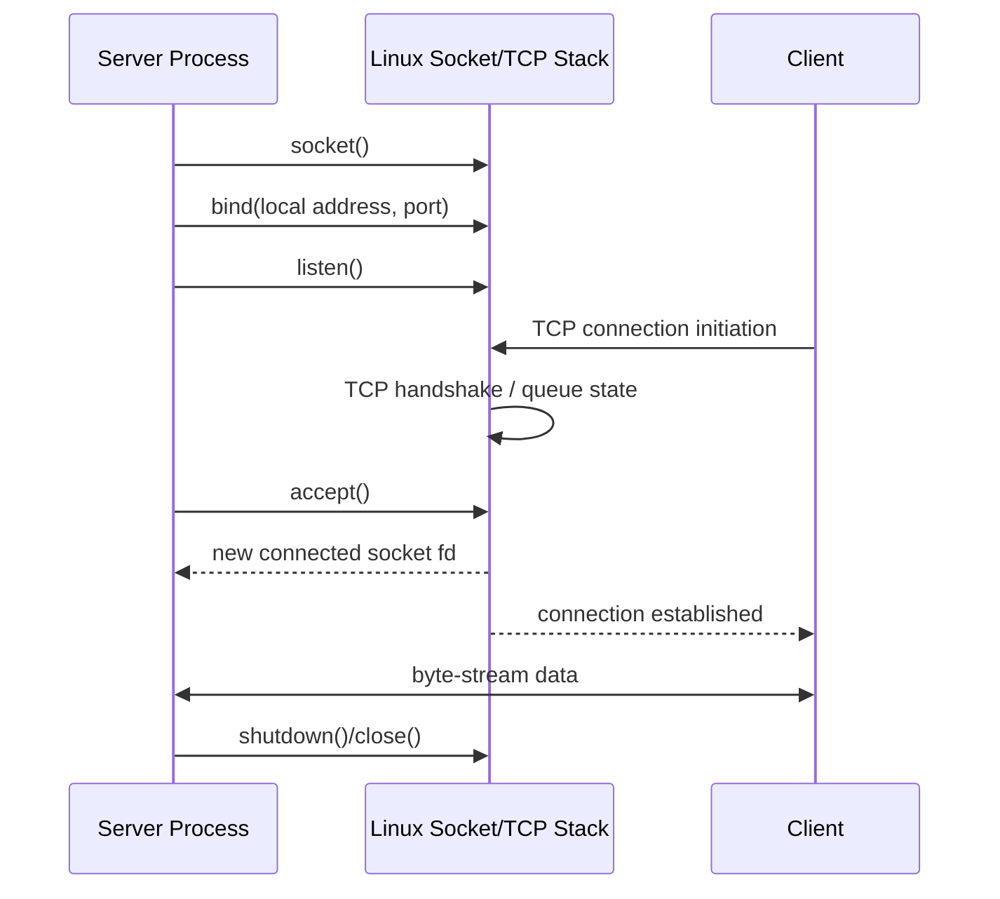
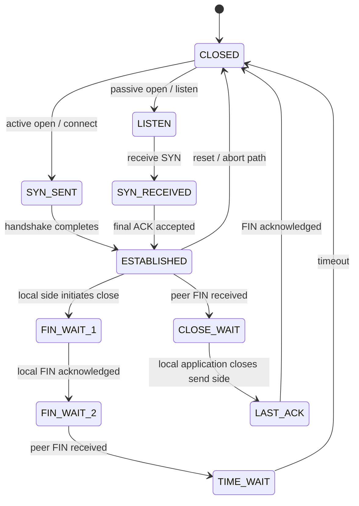

# Chủ đề 9 — Socket Programming trong Linux

> **Phạm vi:** Linux/POSIX Socket Programming fundamentals — socket abstraction, `socket()`, `bind()`, `listen()`, `accept()`, `connect()`, `send()`/`recv()`, TCP vs UDP, IPv4/IPv6 socket address model, network byte order, `sockaddr`, `getaddrinfo()`, ports/endpoints, TCP connection lifecycle, graceful shutdown/error handling và Unix domain socket trong unified socket API.
>
> Chương này chỉ trình bày **lý thuyết**. Không có lab, bài tập, chương trình mẫu hoàn chỉnh, hướng dẫn biên dịch, lệnh kiểm tra mạng hoặc thao tác thực hành.
>
> Mục tiêu của chương là xây mental model:
>
> `application → socket API → transport protocol → IP → network interface`
>
> và:
>
> `TCP server: socket → bind → listen → accept → connected socket → data → shutdown/close`
>
> `TCP client: socket → connect → connected socket → data → shutdown/close`
>
> `UDP: socket → optional bind/connect → send/receive datagrams`
>
> Đồng thời phải phân biệt chính xác:
>
> `socket descriptor ≠ TCP connection`
>
> `listening socket ≠ accepted connected socket`
>
> `TCP stream ≠ message queue`
>
> `UDP connect() ≠ TCP connection handshake`
>
> `host byte order ≠ network byte order`
>
> `IP address ≠ port ≠ socket ≠ application process`
>
> **Giới hạn chủ đề:** `O_NONBLOCK`, `select()`, `poll()`, `epoll()`, readiness model và event loop chỉ được nhắc ở mức liên hệ vì chúng thuộc Topic 10 — Non-blocking I/O & Multiplexing. Chương này cũng không đi sâu vào TLS, HTTP, QUIC, raw sockets, packet sockets, routing internals, congestion-control algorithms, advanced TCP tuning hoặc kernel network-driver internals.
>
> **Cấu trúc tài liệu:** các mục `##` là những khối kiến thức lớn; concept chi tiết nằm ở `###/####` để giữ mục lục gọn, đồng nhất với Topic 01–08.
>
> **Điều hướng:** [← Chủ đề 8 — IPC](README-topic-08.md) · [Chủ đề 10 — Non-blocking I/O & Multiplexing →](README-topic-10.md)

---

## Mục lục

- [1. Socket Programming Fundamentals](#1-socket-programming-fundamentals)
- [2. Socket Abstraction: Domain, Type và Protocol](#2-socket-abstraction-domain-type-và-protocol)
- [3. Socket là File Descriptor — nhưng không phải Regular File](#3-socket-là-file-descriptor--nhưng-không-phải-regular-file)
- [4. Socket Address Model và `sockaddr`](#4-socket-address-model-và-sockaddr)
- [5. Network Byte Order](#5-network-byte-order)
- [6. Name Resolution với `getaddrinfo()`](#6-name-resolution-với-getaddrinfo)
- [7. IP Address, Port và Endpoint](#7-ip-address-port-và-endpoint)
- [8. `bind()` và Local Address Assignment](#8-bind-và-local-address-assignment)
- [9. TCP và UDP — Hai Transport Models khác nhau](#9-tcp-và-udp--hai-transport-models-khác-nhau)
- [10. TCP Server Lifecycle](#10-tcp-server-lifecycle)
- [11. TCP Client Lifecycle](#11-tcp-client-lifecycle)
- [12. TCP Connection Establishment và State Model](#12-tcp-connection-establishment-và-state-model)
- [13. TCP Data Semantics và Application Framing](#13-tcp-data-semantics-và-application-framing)
- [14. TCP Flow, Buffering và Partial I/O](#14-tcp-flow-buffering-và-partial-io)
- [15. TCP Graceful Shutdown, Half-close và Connection Termination](#15-tcp-graceful-shutdown-half-close-và-connection-termination)
- [16. UDP Datagram Model](#16-udp-datagram-model)
- [17. UDP `bind()`, `connect()`, `sendto()` và `recvfrom()` Semantics](#17-udp-bind-connect-sendto-và-recvfrom-semantics)
- [18. `send()` / `recv()` Family và Message Metadata](#18-send--recv-family-và-message-metadata)
- [19. Socket Options và Socket State](#19-socket-options-và-socket-state)
- [20. Unix Domain Socket trong unified Socket API](#20-unix-domain-socket-trong-unified-socket-api)
- [21. Blocking Semantics và Ranh giới với Topic 10](#21-blocking-semantics-và-ranh-giới-với-topic-10)
- [22. Error Model và Tư duy Debug Socket](#22-error-model-và-tư-duy-debug-socket)
- [23. Liên hệ với Embedded Linux](#23-liên-hệ-với-embedded-linux)
- [24. Tổng kết và Mental Model](#24-tổng-kết-và-mental-model)
- [25. Tài liệu tham khảo](#25-tài-liệu-tham-khảo)

---

## 1. Socket Programming Fundamentals

### 1.1 Socket là gì?

Linux `socket(2)` mô tả:

```text
socket()
  creates an endpoint for communication
```

Từ khóa quan trọng là:

```text
endpoint
```

Socket là một đầu mút mà application dùng để giao tiếp thông qua một protocol/domain nhất định.

Mental model:

```text
Application
    |
    v
Socket endpoint
    |
    v
Transport / local protocol
    |
    v
Peer endpoint
    |
    v
Peer application
```

---

### 1.2 Socket API là interface chung cho nhiều communication domains

Cùng nhóm API:

```text
socket()
bind()
connect()
listen()
accept()
send()
recv()
shutdown()
```

có thể được dùng với nhiều domain:

```text
AF_INET
  IPv4

AF_INET6
  IPv6

AF_UNIX
  local Unix-domain communication
```

Điều này tạo ra một abstraction thống nhất:

```text
socket operations
```

trong khi:

```text
address representation
protocol semantics
connection behavior
```

phụ thuộc domain/type/protocol.

---

### 1.3 Socket API không phải là TCP API riêng

Sai mental model:

```text
socket = TCP
```

Đúng hơn:

```text
Socket API
   |
   +--> TCP
   +--> UDP
   +--> Unix domain socket
   +--> other Linux socket families
```

Ví dụ:

```text
AF_INET + SOCK_STREAM
```

thường maps tới TCP.

```text
AF_INET + SOCK_DGRAM
```

thường maps tới UDP.

---

### 1.4 Socket programming nằm giữa application và protocol stack

Simplified Linux data path:

```text
+--------------------------+
| Application              |
+------------+-------------+
             |
             | socket API
             v
+--------------------------+
| Linux socket layer       |
+------------+-------------+
             |
       +-----+-----+
       |           |
       v           v
      TCP         UDP
       |           |
       +-----+-----+
             |
             v
             IP
             |
             v
      routing / qdisc
             |
             v
        net_device
             |
             v
       NIC / PHY / link
```

Topic này tập trung vào:

```text
application ↔ socket ↔ transport
```

không đi sâu xuống network-driver layer.

---

### 1.5 Client và server là application roles, không phải socket types

Một common misunderstanding:

```text
client socket type
server socket type
```

Không tồn tại hai socket types như vậy.

Role được tạo bởi operation sequence.

Ví dụ TCP server:

```text
socket
bind
listen
accept
```

TCP client:

```text
socket
connect
```

Cả hai thường bắt đầu với:

```text
socket(AF_INET/AF_INET6, SOCK_STREAM, ...)
```

---

### 1.6 Protocol semantics phải được hiểu trước API sequence

Biết:

```text
socket()
bind()
listen()
```

nhưng không hiểu TCP byte stream, connection state, half-close hoặc UDP message boundaries thì vẫn chưa hiểu socket programming.

Chương này vì vậy đi theo hai lớp:

```text
Socket API semantics
+
Transport protocol semantics
```

---

## 2. Socket Abstraction: Domain, Type và Protocol

### 2.1 Ba tham số logic của `socket()`

Conceptual signature:

```text
socket(domain, type, protocol)
```

Ba thành phần trả lời ba câu hỏi khác nhau:

```text
domain
  address/protocol family nào?

type
  communication semantics nào?

protocol
  protocol cụ thể nào trong family/type đó?
```

---

### 2.2 Domain

Common domains:

```text
AF_INET
  IPv4 Internet sockets

AF_INET6
  IPv6 Internet sockets

AF_UNIX / AF_LOCAL
  local Unix domain sockets
```

Domain quyết định:

```text
address namespace
address structure
supported protocols
```

---

### 2.3 `AF_*` và `PF_*`

Modern POSIX/Linux application code conventionally uses:

```text
AF_INET
AF_INET6
AF_UNIX
```

Linux historical headers also expose:

```text
PF_INET
PF_INET6
...
```

`socket(2)` notes historical distinction between protocol family and address family, but modern standards use `AF_*` consistently for the socket-domain argument.

Mental rule:

```text
Use AF_* as the conceptual modern interface.
```

---

### 2.4 Socket type

Important types:

```text
SOCK_STREAM
SOCK_DGRAM
SOCK_SEQPACKET
```

For Internet sockets, primary focus:

```text
SOCK_STREAM
  TCP-style reliable byte stream

SOCK_DGRAM
  UDP-style datagram/message transport
```

---

### 2.5 `SOCK_STREAM`

Linux defines stream sockets as:

```text
sequenced
reliable
two-way
connection-based
byte streams
```

The word:

```text
byte stream
```

is critical.

It means:

```text
record/message boundaries are not preserved
```

---

### 2.6 `SOCK_DGRAM`

Datagram socket provides:

```text
message/datagram-oriented communication
```

Each datagram is an individual unit.

For UDP:

```text
delivery is not guaranteed
ordering is not guaranteed
duplicate protection is not guaranteed
```

---

### 2.7 Protocol argument

Often:

```text
protocol = 0
```

means kernel selects the normal protocol for chosen domain/type pair.

Concept:

```text
AF_INET + SOCK_STREAM + 0
    -> normal Internet stream protocol
    -> TCP

AF_INET + SOCK_DGRAM + 0
    -> normal Internet datagram protocol
    -> UDP
```

This is a common mapping, not a statement that every domain supports exactly one protocol/type combination.

---

### 2.8 Domain + type + protocol define semantics together

Mental model:

```text
socket semantics
    =
domain
  + type
  + protocol
```

Example:

```text
SOCK_STREAM alone
```

does not tell you whether endpoint is:

```text
TCP
AF_UNIX stream
another stream-capable protocol
```

---

## 3. Socket là File Descriptor — nhưng không phải Regular File

### 3.1 Successful `socket()` returns a file descriptor

Linux:

```text
socket()
   |
   v
file descriptor
```

Therefore socket participates in the same process fd table learned in Topic 3.

```text
Process
 |
 +--> fd 0
 +--> fd 1
 +--> fd 2
 +--> fd 7 ---> socket
```

---

### 3.2 Socket descriptor is a reference to kernel socket state

Concept:

```text
fd
 |
 v
open file description / kernel file object
 |
 v
socket object
 |
 v
protocol state
```

For TCP this protocol state can include:

```text
local endpoint
remote endpoint
connection state
send buffer
receive buffer
sequence state
error state
```

---

### 3.3 File-descriptor operations apply, but object semantics differ

Socket fd can use operations such as:

```text
close()
read()
write()
fcntl()
dup()
```

but socket is not a regular file.

It does not imply meaningful:

```text
filesystem pathname
file offset
lseek()
persistent contents
```

for Internet sockets.

---

### 3.4 `send()` vs `write()`

On a connected socket, Linux `send()` with zero flags is generally equivalent to:

```text
write()
```

for data transmission.

`send()` exists because sockets need additional per-call controls:

```text
flags
destination in sendto()
ancillary data in sendmsg()
```

---

### 3.5 `recv()` vs `read()`

Likewise:

```text
recv(..., flags = 0)
```

is generally similar to:

```text
read()
```

but receive APIs can expose:

```text
flags
source address
ancillary/control metadata
message-specific semantics
```

---

### 3.6 Descriptor duplication matters

If socket fd is duplicated by:

```text
dup
fork
descriptor passing
```

multiple fd entries can refer to same underlying socket/open-file state.

Concept:

```text
fd 7 ------+
           |
fd 10 -----+--> same socket state
```

Closing one fd does not necessarily destroy underlying socket while another reference remains.

---

### 3.7 `FD_CLOEXEC`

Like other descriptors, socket descriptor may leak across:

```text
execve()
```

unless close-on-exec policy is established.

This matters for service architecture because accidental fd inheritance can:

```text
keep connections alive
keep listening socket alive
delay EOF/disconnect
expose privileged resource to child
```

---

## 4. Socket Address Model và `sockaddr`

### 4.1 Socket address is protocol-family-specific data

Functions such as:

```text
bind()
connect()
accept()
sendto()
recvfrom()
```

need addresses.

But different domains need different address forms.

Examples:

```text
IPv4
  IP address + port

IPv6
  IPv6 address + port + additional IPv6 fields

Unix domain
  pathname/abstract/local address
```

---

### 4.2 Generic `struct sockaddr`

POSIX defines generic address structure conceptually:

```text
struct sockaddr {
    sa_family_t sa_family;
    ...
};
```

It acts as generic socket-address interface.

It is not the natural structure application uses to manipulate IPv4 fields directly.

---

### 4.3 IPv4 `sockaddr_in`

Conceptual IPv4 structure:

```text
struct sockaddr_in
 |
 +--> sin_family
 |      AF_INET
 |
 +--> sin_port
 |      16-bit transport port
 |
 +--> sin_addr
        IPv4 address
```

Mental model:

```text
IPv4 endpoint
   =
IPv4 address
   +
port
```

---

### 4.4 IPv6 `sockaddr_in6`

Conceptually:

```text
struct sockaddr_in6
 |
 +--> sin6_family
 +--> sin6_port
 +--> sin6_flowinfo
 +--> sin6_addr
 +--> sin6_scope_id
```

IPv6 address itself is:

```text
128 bits
```

and scope information matters particularly for scoped addresses such as link-local addresses.

---

### 4.5 Generic API uses pointer to `sockaddr`

Address-family-specific structures are passed through generic APIs conceptually as:

```text
sockaddr *
```

This is why APIs can support many families without one function per family.

---

### 4.6 `socklen_t`

Socket APIs carry address length separately:

```text
address pointer
+
socklen_t length
```

because address structures have family-specific sizes.

---

### 4.7 `sockaddr_storage`

POSIX defines:

```text
sockaddr_storage
```

large and properly aligned enough for supported socket-address structures.

This is useful when code needs storage for:

```text
unknown address family returned by API
```

Concept:

```text
sockaddr_storage
   |
   +--> may contain IPv4 sockaddr_in
   +--> may contain IPv6 sockaddr_in6
   +--> may contain another supported address
```

---

### 4.8 Address representation vs text representation

Kernel socket APIs normally operate on:

```text
binary address structures
```

Human users think in:

```text
"192.0.2.1"
"2001:db8::1"
"example.com"
```

Conversion/name-resolution layers bridge these forms.

---

## 5. Network Byte Order

### 5.1 Why byte order matters

Multi-byte integer can be stored differently by CPU architectures.

Example 16-bit number:

```text
0x1234
```

Possible memory layouts:

```text
Big-endian:
12 34

Little-endian:
34 12
```

A network protocol needs one standardized representation.

---

### 5.2 Network byte order is big-endian

Internet protocols conventionally encode relevant multi-byte integer fields in:

```text
network byte order
=
big-endian
```

Socket address fields such as IPv4:

```text
sin_port
sin_addr
```

are represented according to network-order requirements.

---

### 5.3 Host byte order

Host byte order is CPU/native representation used by local application.

Could be:

```text
little-endian
```

or another architecture-defined order.

Therefore:

```text
host order
```

must not be assumed identical to:

```text
network order
```

---

### 5.4 Conversion functions

Standard conversion family:

```text
htons()
  host-to-network short

htonl()
  host-to-network long

ntohs()
  network-to-host short

ntohl()
  network-to-host long
```

Mental map:

```text
Host value
   |
 htons / htonl
   |
   v
Network representation
   |
 ntohs / ntohl
   |
   v
Host value
```

---

### 5.5 Why port usually uses `htons()`

Transport port is:

```text
16 bits
```

therefore conceptual conversion:

```text
host integer port
    |
  htons()
    |
    v
sin_port
```

---

### 5.6 Do not double-convert

An address conversion/resolver API may already return fields in:

```text
network byte order
```

Application must know representation contract.

Blindly applying:

```text
hton*
```

multiple times is incorrect.

---

### 5.7 Text conversion APIs

For numeric IP addresses:

```text
inet_pton()
  presentation text -> binary network address

inet_ntop()
  binary network address -> presentation text
```

`inet_pton()` supports:

```text
AF_INET
AF_INET6
```

and writes binary address representation suitable for network use.

---

## 6. Name Resolution với `getaddrinfo()`

### 6.1 Application should not hard-code IPv4 structure thinking everywhere

Modern applications may need:

```text
IPv4
IPv6
hostname
numeric address
service name
numeric port
```

`getaddrinfo()` provides protocol-independent translation.

---

### 6.2 Inputs

Conceptually:

```text
node
  host name or numeric network address

service
  service name or numeric port string

hints
  desired family/type/protocol constraints
```

Outputs:

```text
linked list of addrinfo candidates
```

---

### 6.3 `struct addrinfo`

Conceptual fields:

```text
ai_family
ai_socktype
ai_protocol
ai_addrlen
ai_addr
ai_next
```

Each result represents one candidate compatible with requested constraints.

---

### 6.4 `AF_UNSPEC`

When application is willing to support both:

```text
IPv4
IPv6
```

it can conceptually request:

```text
AF_UNSPEC
```

and evaluate returned addresses.

This avoids embedding IPv4-only assumptions in higher-level logic.

---

### 6.5 Server-side passive address resolution

For server addresses, resolver can produce:

```text
wildcard local addresses
```

suitable for:

```text
bind()
```

when passive-address semantics are requested.

Concept:

```text
service = desired service/port
node = none/local wildcard intent
      |
      v
getaddrinfo
      |
      v
addresses suitable for bind
```

---

### 6.6 Client-side resolution

Client:

```text
hostname/service
      |
      v
getaddrinfo()
      |
      v
candidate addresses
      |
      v
socket/connect attempts
```

A hostname can resolve to:

```text
multiple addresses
multiple address families
```

Therefore:

```text
hostname != one fixed IP address
```

---

### 6.7 Resolution is not the same as connection

Successful `getaddrinfo()` means:

```text
name/service translated into candidate addresses
```

It does not prove:

```text
host reachable
service running
TCP connect will succeed
application protocol is healthy
```

Those belong later stages.

---

### 6.8 `getnameinfo()`

Reverse/general presentation translation can map a socket address into:

```text
host representation
service representation
```

according to flags/resolution rules.

It is conceptually the reverse side of generic address handling.

---

## 7. IP Address, Port và Endpoint

### 7.1 IP address identifies network-layer interface/address context

IP address answers approximately:

```text
which host/interface/address?
```

Port answers:

```text
which transport endpoint/service context on that host?
```

Together:

```text
IP address + port
```

form a transport endpoint address.

---

### 7.2 Port number is 16-bit transport namespace

TCP and UDP ports use:

```text
16-bit numbers
```

so range is:

```text
0 ... 65535
```

Port number has meaning within transport protocol context.

Concept:

```text
TCP port 5000
```

and:

```text
UDP port 5000
```

are separate transport namespaces.

---

### 7.3 IANA port ranges

RFC 6335/IANA divide transport port registry into:

```text
System Ports
  0–1023

User / Registered Ports
  1024–49151

Dynamic / Private Ports
  49152–65535
```

Important nuance:

> IANA's Dynamic/Private range is a registry classification. An operating system's local ephemeral-port allocator may use an implementation/configuration-specific range that is not identical to that registry interval.

Linux ephemeral selection is governed by Linux networking configuration.

---

### 7.4 Port does not belong permanently to a process

Port binding is kernel socket/protocol state.

A process may own multiple sockets:

```text
Process
 |
 +--> socket A local port 8000
 +--> socket B local port 9000
```

Another process can later use a port after prior binding/lifecycle permits.

Therefore:

```text
port != process ID
```

---

### 7.5 TCP connection identity

A TCP connection is commonly identified by endpoint tuple:

```text
local IP
local port
remote IP
remote port
```

Within TCP context this 4-tuple distinguishes connections.

Across protocol families, transport protocol itself is also part of overall demultiplexing context.

---

### 7.6 One listening port can serve many simultaneous TCP connections

Server may listen on:

```text
local :443
```

while accepted connections differ by remote endpoint:

```text
local A:443 <-> client X:51001
local A:443 <-> client Y:52200
local A:443 <-> client Z:60010
```

Thus:

```text
one server port
```

does not imply:

```text
only one TCP connection
```

---

### 7.7 Wildcard address

IPv4:

```text
INADDR_ANY
0.0.0.0
```

when used for binding means:

```text
accept traffic addressed to appropriate local IPv4 addresses
```

It is a local bind wildcard.

It should not be casually treated as a normal remote host destination.

---

### 7.8 Loopback

IPv4 loopback:

```text
127.0.0.1
```

IPv6 loopback:

```text
::1
```

represent local-host communication through IP networking stack.

This differs from:

```text
AF_UNIX
```

even though both stay on local machine.

---

## 8. `bind()` và Local Address Assignment

### 8.1 Newly created socket initially has no application-assigned address

Linux `bind(2)` states:

```text
socket()
  creates socket in address family
  but no address is assigned yet
```

`bind()` assigns:

```text
local socket address
```

---

### 8.2 Bind answers “which local endpoint should this socket use?”

For IPv4:

```text
local IPv4 address
+
local port
```

For IPv6:

```text
local IPv6 address
+
local port
```

For Unix domain:

```text
local Unix socket address
```

---

### 8.3 Server bind

A server normally needs stable local endpoint so clients know where to connect/send.

Concept:

```text
Server socket
    |
 bind(local address, service port)
    |
    v
Known local endpoint
```

---

### 8.4 Client bind is often implicit for Internet sockets

A client often does not explicitly choose source address/port.

During:

```text
connect()
```

or suitable send operation, kernel can select:

```text
local source address
ephemeral source port
```

according to routing and protocol rules.

Thus client-side explicit `bind()` is optional in common cases.

---

### 8.5 Port zero

Binding Internet socket with:

```text
port = 0
```

can request kernel to select an ephemeral local port.

Concept:

```text
application:
"I need a local port, any valid available one"

kernel:
selects according to local ephemeral-port policy
```

---

### 8.6 `EADDRINUSE`

Typical bind error:

```text
EADDRINUSE
```

means requested local address/port combination cannot be assigned because of current binding/reuse rules.

Exact behavior depends on:

```text
protocol
address
socket options
existing socket state
TIME_WAIT/reuse context
```

---

### 8.7 `EADDRNOTAVAIL`

Can mean requested local address does not exist/is not locally assignable in current network namespace/interface context.

This is different from:

```text
port already in use
```

---

### 8.8 `getsockname()`

After implicit or explicit binding, application can query socket's current local address.

This is useful conceptually because:

```text
kernel may choose local address/port
```

rather than application knowing it in advance.

---

## 9. TCP và UDP — Hai Transport Models khác nhau

### 9.1 TCP model

TCP provides:

```text
connection-oriented
reliable
ordered
full-duplex
byte-stream
```

transport.

Linux `tcp(7)` describes a reliable stream-oriented full-duplex connection over IP.

---

### 9.2 UDP model

UDP provides:

```text
connectionless datagram/message transport
```

with minimal protocol mechanism.

RFC 768 and RFC 8085 emphasize:

```text
delivery not guaranteed
duplicate protection not guaranteed
ordering not guaranteed
```

---

### 9.3 TCP vs UDP overview

| Property | TCP | UDP |
|---|---|---|
| Connection establishment | Yes | No transport handshake |
| Data model | Byte stream | Datagram/message |
| Ordering | Ordered byte stream | Not guaranteed |
| Retransmission | TCP handles loss recovery | Application/protocol responsibility |
| Duplicate suppression | TCP stream semantics | Not guaranteed by UDP |
| Message boundaries | No | Yes |
| Full duplex | Yes | Datagram send/receive |
| Congestion control | TCP provides protocol mechanisms | Application must follow UDP usage/congestion guidance |
| Connection state | Significant | Minimal transport association |

---

### 9.4 “UDP is faster” is too simplistic

UDP has less built-in transport machinery, but application may need to add:

```text
retransmission
ordering
duplicate detection
congestion control
session state
fragmentation avoidance
security
```

If application recreates TCP-like reliability, complexity can exceed using a full-featured transport.

RFC 8085 specifically warns UDP applications to handle congestion responsibly.

---

### 9.5 “TCP is reliable” has a precise scope

TCP guarantees an ordered reliable byte stream between TCP endpoints under protocol semantics.

It does **not** guarantee:

```text
receiver application processed data
receiver saved data persistently
business transaction succeeded
peer application generated correct response
```

Application protocol still needs:

```text
acknowledgment/state semantics
```

where business-level confirmation matters.

---

### 9.6 “UDP is unreliable” does not mean “random”

UDP still provides:

```text
datagram boundaries
port demultiplexing
checksum behavior
IP-based delivery attempt
```

But application cannot assume reliable arrival/order/uniqueness.

---

## 10. TCP Server Lifecycle

### 10.1 High-level lifecycle

Classic server path:

```text
socket()
   |
   v
bind()
   |
   v
listen()
   |
   v
accept()
   |
   v
connected socket
   |
send/recv
   |
shutdown/close
```

This sequence is one of the most important system-programming mental models.

---

### 10.2 `socket()`

Creates communication endpoint.

For TCP-over-IPv4 concept:

```text
domain   = AF_INET
type     = SOCK_STREAM
protocol = default TCP-compatible protocol
```

At this point socket is not yet a listening server.

---

### 10.3 `bind()`

Assigns known local endpoint.

Example concept:

```text
server address
+
service port
```

Without stable local endpoint, clients cannot predict server destination.

---

### 10.4 `listen()`

`listen()` marks a connection-mode socket as:

```text
passive/listening socket
```

Its role changes conceptually:

```text
active data endpoint?
   no

accept incoming connection requests?
   yes
```

---

### 10.5 Listening socket is not the per-client data socket

Critical distinction:

```text
Listening socket
  represents local service acceptance point

Accepted socket
  represents one connected peer relationship
```

ASCII:

```text
                 Listening Socket
                 local :8080
                       |
        +--------------+--------------+
        |              |              |
        v              v              v
 Accepted A       Accepted B      Accepted C
client X          client Y        client Z
```

---

### 10.6 `accept()`

`accept()`:

```text
removes/extracts one pending connection
creates a new connected socket
returns a new fd
```

Original listening socket remains listening.

This is fundamental:

```text
accept()
  does not turn listener into client connection
```

---

### 10.7 Server socket topology

```text
Process
 |
 +--> listening fd
 |      |
 |      +--> accepts future connections
 |
 +--> connected fd A
 |      |
 |      +--> peer A
 |
 +--> connected fd B
        |
        +--> peer B
```

Each accepted TCP socket has its own:

```text
remote endpoint
send/receive state
TCP connection state
```

---

### 10.8 `listen(backlog)` conceptual role

Backlog limits/hints how many pending incoming connections can wait before application accepts them.

But exact queue semantics are implementation-dependent.

POSIX allows implementation to:

```text
limit backlog
include incomplete connections differently
```

Linux modern TCP behavior specifically separates:

```text
completed connections waiting for accept
```

from:

```text
incomplete SYN/request queue
```

and Linux `listen(2)` documents backlog as limit for completely established sockets waiting to be accepted.

Therefore:

```text
backlog
```

must not be simplistically interpreted as:

```text
"maximum total number of clients server can ever support"
```

---

### 10.9 Accept queue is not worker limit

A server may eventually handle many connections over time.

Backlog is about:

```text
pending acceptance
```

not:

```text
total lifetime connection count
```

or necessarily:

```text
maximum concurrent application sessions
```

---

### 10.10 Server lifecycle sequence diagram



The diagram is a high-level API/protocol view, not a literal syscall-to-packet one-to-one mapping.

---

## 11. TCP Client Lifecycle

### 11.1 High-level path

TCP client:

```text
resolve destination
      |
      v
socket()
      |
      v
connect()
      |
      v
connected socket
      |
      v
send/recv
      |
      v
shutdown/close
```

---

### 11.2 Client usually needs remote endpoint, not fixed local endpoint

Remote endpoint:

```text
server IP/address
server port
```

Local endpoint can often be selected automatically:

```text
source address
ephemeral source port
```

---

### 11.3 `connect()` for stream socket

For:

```text
SOCK_STREAM
```

`connect()` attempts to establish connection with socket bound/listening at remote address.

For TCP this means interaction with TCP connection establishment.

---

### 11.4 Blocking `connect()`

Default socket is blocking unless configured otherwise.

Therefore TCP `connect()` can wait until:

```text
connection established
```

or:

```text
failure/timeout
```

according to protocol/system behavior.

Nonblocking connection establishment belongs Topic 10.

---

### 11.5 Successful `connect()` does not mean application protocol succeeded

Successful TCP connection means transport connection exists.

It does not mean:

```text
server authenticated client
application request accepted
protocol version compatible
resource exists
business transaction succeeded
```

Transport and application protocols are separate layers.

---

### 11.6 Implicit local endpoint selection

If client socket was not explicitly bound:

```text
connect()
```

can cause kernel to assign local address/ephemeral port.

Routing influences which local address is appropriate.

---

### 11.7 Connection refused

Typical conceptual cause of:

```text
ECONNREFUSED
```

is destination actively indicates no listener/connection endpoint available for requested transport endpoint.

This differs from:

```text
timeout
```

where response may never arrive due to routing/filtering/unreachable conditions.

---

## 12. TCP Connection Establishment và State Model

### 12.1 TCP has a protocol state machine

TCP is not simply:

```text
"socket connected = true/false"
```

RFC 9293 defines states including:

```text
CLOSED
LISTEN
SYN-SENT
SYN-RECEIVED
ESTABLISHED
FIN-WAIT-1
FIN-WAIT-2
CLOSE-WAIT
CLOSING
LAST-ACK
TIME-WAIT
```

---

### 12.2 Three-way handshake

Basic connection establishment:

```text
Client                           Server

SYN ---------------------------->

    <---------------------- SYN + ACK

ACK ---------------------------->

ESTABLISHED                    ESTABLISHED
```

RFC 9293 defines this as the TCP three-way handshake.

---

### 12.3 Why three messages?

Handshake establishes synchronized connection state and sequence-number context and protects against confusion from stale/duplicate connection initiations.

It is not just:

```text
"three packets because TCP is slow"
```

It is part of TCP correctness.

---

### 12.4 Sequence-number space

TCP is a byte-stream protocol with sequence-numbered data.

Concept:

```text
byte stream
   |
   v
TCP segmentation
   |
sequence numbers
   |
receiver reorders/reassembles
   |
   v
ordered byte stream to application
```

Application normally does not manage TCP sequence numbers directly.

---

### 12.5 TCP segmentation is not application message segmentation

RFC 9293 explicitly notes individual TCP segments often do not correspond one-to-one with:

```text
send()
write()
```

calls.

Therefore packet boundaries, send boundaries and application-message boundaries are three different concepts.

---

### 12.6 Simplified TCP state machine



This is simplified for learning. RFC 9293 contains additional transitions such as simultaneous open/close and reset paths.

---

### 12.7 `LISTEN`

Server-side TCP endpoint waits for connection initiation.

This is protocol state associated with listening socket.

Accepted connected socket does not remain:

```text
LISTEN
```

---

### 12.8 `SYN-SENT`

Client has initiated active open and waits for handshake response.

---

### 12.9 `SYN-RECEIVED`

Peer has received SYN, sent SYN/ACK and is waiting for handshake completion.

---

### 12.10 `ESTABLISHED`

Both directions have synchronized transport state.

Application can exchange byte-stream data.

---

## 13. TCP Data Semantics và Application Framing

### 13.1 TCP is byte stream

The most important TCP programming rule:

```text
TCP does not preserve application message boundaries.
```

Suppose sender logically performs:

```text
send("ABC")
send("DEF")
```

Receiver may get:

```text
"ABCDEF"
```

or:

```text
"A"
"BCDE"
"F"
```

or another valid partition preserving byte order.

---

### 13.2 Send-call boundary is not receive-call boundary

False assumption:

```text
one send()
=
one recv()
```

Correct:

```text
send operations contribute bytes to stream
recv operations consume available bytes from stream
```

---

### 13.3 TCP only preserves order of bytes

If sender stream is:

```text
A B C D E F
```

receiver application observes:

```text
A B C D E F
```

in order if connection delivers successfully.

But it is application's job to know:

```text
where one logical message ends
```

---

### 13.4 Application framing

Common conceptual framing strategies:

```text
fixed-size records

length prefix
  [length][payload]

delimiter
  [payload]\n

self-describing protocol grammar
```

Socket/TCP does not choose framing automatically.

---

### 13.5 Length-prefix model

```text
TCP byte stream

+--------+--------------------+--------+-----------+
| len=20 | 20-byte payload    | len=5  | payload   |
+--------+--------------------+--------+-----------+
```

Receiver state machine:

```text
read enough header
      |
parse length
      |
read exactly logical payload amount
      |
next frame
```

This remains conceptual; implementation belongs later application work.

---

### 13.6 Framing and endian representation are related

If protocol stores integer length field:

```text
length = 32-bit integer
```

sender and receiver must agree on:

```text
byte order
field width
signedness
maximum allowed length
```

Network byte order is a common protocol convention.

---

### 13.7 Framing is also a security boundary

Untrusted peer can send:

```text
invalid length
huge length
malformed payload
partial frame
```

Application protocol must validate fields.

Socket reliability does not validate application message meaning.

---

## 14. TCP Flow, Buffering và Partial I/O

### 14.1 `send()` usually copies/queues data into socket send path

Successful:

```text
send()
```

does not mean remote application has already read the bytes.

At a high level:

```text
Application send
      |
      v
local socket send buffer / protocol state
      |
      v
TCP transmission
      |
      v
remote TCP
      |
      v
remote receive buffer
      |
      v
remote application recv
```

---

### 14.2 Send success is local/protocol progress, not business acknowledgment

A successful positive return from `send()` says local socket accepted that many bytes according to API semantics.

It does not prove:

```text
peer processed them
peer persisted them
peer application still logically accepts them
```

---

### 14.3 Partial send

For stream sockets:

```text
send(requested N bytes)
```

may return:

```text
M bytes
where 0 < M < N
```

especially under constraints/interruption/nonblocking state.

Therefore stream output is conceptually a loop/progress problem.

Topic 3 partial-I/O mental model applies directly.

---

### 14.4 Partial receive

`recv()` normally returns:

```text
whatever data is currently available
up to requested size
```

rather than waiting for full requested buffer.

Thus:

```text
request 4096 bytes
```

can validly return:

```text
125 bytes
```

without error.

---

### 14.5 `recv() == 0` for stream socket

For connected stream socket:

```text
recv() returns 0
```

when peer has performed orderly shutdown of its sending direction and all prior received bytes have been consumed.

This is stream EOF semantics.

---

### 14.6 Zero-length datagram nuance

For datagram sockets, zero is different:

```text
zero-size datagram
```

is valid.

Therefore:

```text
recv returns 0
```

must be interpreted according to socket type/context.

On TCP stream:

```text
orderly EOF
```

On datagram:

```text
possibly valid zero-length datagram
```

---

### 14.7 Send buffer full

If socket send buffer cannot currently accept requested progress:

```text
blocking send
  waits

nonblocking send
  returns EAGAIN/EWOULDBLOCK
```

Detailed readiness handling belongs Topic 10.

---

### 14.8 Receive buffer empty

If no receive data:

```text
blocking recv
  waits

nonblocking recv
  returns EAGAIN/EWOULDBLOCK
```

unless stream EOF/error is already present.

---

### 14.9 Flow control and congestion control are not the same

TCP includes:

```text
flow control
  protect receiver from being overrun

congestion control
  adapt sending to network path congestion
```

These are transport concerns distinct from application buffering/backpressure.

Detailed algorithms are outside Topic 9.

---

### 14.10 Application-level backpressure still exists

Even though TCP has transport flow/congestion control, application can still produce faster than:

```text
socket
network
peer application
```

can consume.

Eventually:

```text
send buffers fill
send blocks / becomes non-ready
```

This propagates backpressure upward.

---

## 15. TCP Graceful Shutdown, Half-close và Connection Termination

### 15.1 Full-duplex means two independent data directions

TCP connection:

```text
A ======> B
A <====== B
```

Two byte-stream directions can be closed independently.

This enables:

```text
half-close
```

---

### 15.2 `shutdown()`

POSIX/Linux:

```text
shutdown(fd, SHUT_RD)
  disable further receive operations

shutdown(fd, SHUT_WR)
  disable further send operations

shutdown(fd, SHUT_RDWR)
  disable both
```

This acts on socket connection directionality.

---

### 15.3 `shutdown()` vs `close()`

`shutdown()`:

```text
changes communication direction state
```

`close()`:

```text
releases this file descriptor reference
```

These are not identical operations.

If duplicate descriptors refer same socket:

```text
close(one fd)
```

may not terminate communication object because other references remain.

`shutdown()` affects socket connection state associated with underlying socket.

---

### 15.4 Half-close

Typical conceptual protocol:

```text
Client
  finished sending request
      |
      v
shutdown(SHUT_WR)
      |
TCP FIN sent when appropriate
      |
      v
Server sees stream EOF after prior bytes
      |
Server may still send response
      |
      v
Client continues recv
```

This is a powerful property of full-duplex streams.

---

### 15.5 FIN means “no more bytes in this direction”

TCP FIN does not mean:

```text
all connection state instantly disappears
```

It indicates closure of one byte-stream direction.

Peer can still have:

```text
remaining unread data
open reverse direction
```

---

### 15.6 Orderly close

RFC 9293 normal close uses FIN/ACK exchanges.

Concept:

```text
A                              B

FIN -------------------------->

    <----------------------- ACK

    <----------------------- FIN

ACK -------------------------->
```

Actual FIN/ACK can be combined/piggybacked depending traffic/state.

---

### 15.7 Half-closed TCP connection

RFC 9293 explicitly permits:

```text
one direction closed
other direction remains open
```

Thus:

```text
CLOSE-WAIT
FIN-WAIT
```

states are not inherently errors.

They represent normal portions of termination state machine.

---

### 15.8 `TIME_WAIT`

Active closer can enter:

```text
TIME-WAIT
```

after normal close.

Its purpose includes protecting protocol correctness from delayed duplicate segments and ensuring final acknowledgments can be handled.

RFC 9293 defines active close TIME-WAIT behavior and 2×MSL conceptual timeout.

---

### 15.9 `TIME_WAIT` is not automatically a socket leak

Seeing TIME_WAIT does not mean:

```text
application forgot close()
```

It is a normal TCP protocol state for active close.

Large TIME_WAIT populations can still matter operationally, but diagnosis must distinguish:

```text
normal protocol behavior
```

from:

```text
resource/lifecycle bugs
```

---

### 15.10 `CLOSE_WAIT`

If local endpoint receives peer FIN:

```text
local TCP enters CLOSE-WAIT
```

until local application closes its sending side.

Long-lived CLOSE_WAIT often indicates:

```text
application has observed peer close
but has not completed its own close lifecycle
```

Unlike TIME_WAIT, persistent CLOSE_WAIT is frequently application-lifecycle relevant.

---

### 15.11 Reset / abort

TCP can terminate via:

```text
RST
```

abortive path rather than normal FIN handshake.

Peer application should distinguish:

```text
orderly EOF
```

from:

```text
connection reset
```

because data/lifecycle meaning differs.

---

### 15.12 `SIGPIPE` / `EPIPE`

Sending on broken/shut-down stream can produce:

```text
EPIPE
```

and:

```text
SIGPIPE
```

unless signal behavior is suppressed/handled.

POSIX provides:

```text
MSG_NOSIGNAL
```

for per-send suppression of SIGPIPE while still returning error.

This connects Topic 5 signals with socket lifecycle.

---

### 15.13 `SO_LINGER` is advanced close policy, not generic “graceful shutdown switch”

Socket option:

```text
SO_LINGER
```

influences behavior around unsent data and `close()` according to socket/protocol implementation.

It should not be confused with application-level graceful protocol shutdown.

A robust application protocol often needs its own:

```text
request completed
response completed
peer acknowledged business state
```

semantics regardless of TCP close policy.

---

## 16. UDP Datagram Model

### 16.1 UDP is message-oriented

Unlike TCP:

```text
one UDP send
```

corresponds to:

```text
one UDP datagram
```

at transport-message abstraction.

Receiver obtains datagrams as discrete units.

---

### 16.2 Message boundary is preserved

Concept:

```text
Sender:

Datagram A
Datagram B
Datagram C

Receiver:

[A]
[B]
[C]
```

if those datagrams arrive.

They do not merge into one byte stream like TCP.

---

### 16.3 UDP does not guarantee delivery

Possible outcomes:

```text
datagram arrives
datagram lost
datagram duplicated
datagrams reordered
```

Application must be correct under expected network conditions.

---

### 16.4 UDP has no transport connection-establishment handshake

Normal UDP communication does not require:

```text
SYN
SYN-ACK
ACK
```

before sending data.

A sender can transmit datagram to destination immediately.

---

### 16.5 Minimal transport state is not zero system state

Kernel still tracks socket state such as:

```text
local address/port
optional connected peer
receive queue
send/error state
socket options
```

“Connectionless” does not mean “stateless in every implementation layer”.

---

### 16.6 UDP checksum

UDP includes checksum mechanism.

For IPv6, checksum requirements are stricter in standard operation because IPv6 header lacks IPv4-style header checksum.

Application should not assume transport checksum provides cryptographic integrity or authentication.

It is error detection, not security.

---

### 16.7 Datagram size matters

UDP preserves datagram boundaries, so one datagram must fit protocol/path constraints.

Large datagrams can lead to:

```text
fragmentation
loss sensitivity
EMSGSIZE / path MTU issues
```

Linux UDP uses path MTU discovery by default and can return:

```text
EMSGSIZE
```

when attempted datagram exceeds discovered path MTU.

---

### 16.8 Fragmentation increases loss sensitivity

If one large IP datagram fragments into multiple pieces, losing one fragment can prevent complete original datagram reassembly.

RFC 8085 therefore recommends careful message-size design and avoidance of problematic fragmentation patterns.

---

### 16.9 UDP application must consider congestion control

UDP itself has no inherent TCP-like congestion-control mechanism.

RFC 8085 requires/recommends applications using UDP to behave responsibly under congestion.

Thus:

```text
UDP means no built-in congestion control
```

not:

```text
application may transmit without limits
```

---

## 17. UDP `bind()`, `connect()`, `sendto()` và `recvfrom()` Semantics

### 17.1 Basic unconnected UDP model

```text
socket(SOCK_DGRAM)
      |
      +--> sendto(destination, datagram)
      |
      +--> recvfrom() -> datagram + source address
```

No `listen()` or `accept()` is required.

---

### 17.2 UDP server usually uses `bind()`

Server wants stable local port:

```text
socket
  |
bind(local address, port)
  |
recvfrom/sendto
```

This lets clients know destination port.

---

### 17.3 UDP client may use implicit local bind

If no explicit bind:

```text
sendto()
```

or:

```text
connect()
```

can cause kernel to select:

```text
local source address
ephemeral port
```

---

### 17.4 `sendto()`

For unconnected datagram socket:

```text
sendto()
```

specifies destination per datagram.

Concept:

```text
Datagram 1 -> Peer A
Datagram 2 -> Peer B
Datagram 3 -> Peer C
```

same socket can communicate with different destinations.

---

### 17.5 `recvfrom()`

Returns:

```text
datagram
+
source address
```

This is useful for connectionless server:

```text
receive request
identify sender
send response to that sender
```

---

### 17.6 UDP `connect()` does not establish TCP-like connection

This is a critical distinction.

For UDP, Linux `connect()` sets:

```text
default destination
```

and filters/associates receive peer semantics.

There is no TCP handshake.

Mental model:

```text
UDP connect()
   =
configure peer association
   ≠
establish reliable connection
```

---

### 17.7 Connected UDP can use `send()` / `recv()`

Once UDP socket is connected:

```text
send()
```

knows default destination.

```text
recv()
```

does not need return source address for normal peer data.

This can simplify code and error association.

---

### 17.8 Connected UDP can expose asynchronous network errors more directly

Linux UDP can report asynchronous network errors, including errors related to previous datagrams.

Connected UDP often gives clearer association of peer/errors, but it still does not gain TCP reliability.

---

### 17.9 UDP does not use `listen()` / `accept()`

Because there is no transport connection establishment requiring server to accept per-peer connections.

A single bound UDP socket can receive datagrams from many senders:

```text
Client A --\
Client B ---> UDP socket :port
Client C --/
```

Application chooses whether to maintain per-peer logical session state.

---

### 17.10 Application-level session over UDP

Application may construct:

```text
session ID
sequence numbers
ACKs
timeouts
retransmission
authentication
```

above UDP.

That creates application protocol state, not TCP state.

---

## 18. `send()` / `recv()` Family và Message Metadata

### 18.1 Send family

```text
send()
sendto()
sendmsg()
```

represent increasing flexibility.

---

### 18.2 `send()`

Useful when destination is already known by connected socket.

Adds per-call flags beyond normal `write()`.

---

### 18.3 `sendto()`

Adds explicit:

```text
destination address
```

for connectionless communication.

Common conceptual fit:

```text
UDP
```

---

### 18.4 `sendmsg()`

Uses:

```text
struct msghdr
```

to support:

```text
destination address
scatter/gather iovec data
ancillary/control data
flags
```

This is flexible low-level message interface.

---

### 18.5 Receive family

```text
recv()
recvfrom()
recvmsg()
```

mirror receive needs.

---

### 18.6 `recv()`

Receives data when peer identity is already known/not needed.

---

### 18.7 `recvfrom()`

Can return:

```text
source address
```

especially useful with datagram sockets.

---

### 18.8 `recvmsg()`

Can return:

```text
data
source
control/ancillary information
message flags
```

Used by advanced APIs including Unix-domain fd passing and IP metadata features.

---

### 18.9 `MSG_PEEK`

Allows inspecting queued receive data without consuming it.

Concept:

```text
receive queue:
ABCDE

peek 3:
ABC returned
queue remains ABCDE
```

This changes consumption semantics but does not create new message framing for TCP.

---

### 18.10 `MSG_WAITALL`

Requests receive operation to try to satisfy full amount, but it is not an unconditional promise.

Signals, errors, disconnects, message boundaries and protocol conditions can still cause shorter return.

Application must still inspect actual return value.

---

### 18.11 Datagram truncation

If receive buffer smaller than datagram, datagram semantics can cause excess data to be discarded and truncation indicated according to socket/API flags.

This differs fundamentally from TCP stream where unread bytes remain part of stream.

---

### 18.12 `send()` does not guarantee remote delivery

Linux `send(2)` explicitly notes no implicit indication of delivery failure is provided merely by successful send.

Transport/application confirmation must be considered separately.

---

## 19. Socket Options và Socket State

### 19.1 Socket options configure object/protocol behavior

APIs:

```text
setsockopt()
getsockopt()
```

operate on levels such as:

```text
SOL_SOCKET
IPPROTO_IP
IPPROTO_IPV6
IPPROTO_TCP
```

depending option.

---

### 19.2 `SO_REUSEADDR`

Requests reuse of local addresses according to protocol/OS semantics.

Common reason relates to server rebinding/restart and address reuse.

But exact behavior is:

```text
OS/protocol-specific in important edge cases
```

and should not be simplified to:

```text
"lets two arbitrary servers use same port"
```

---

### 19.3 `SO_REUSEPORT`

Linux supports advanced same-address/port reuse/load-distribution semantics.

This is Linux-specific/advanced and not part of core portable mental model.

Do not confuse it with:

```text
SO_REUSEADDR
```

---

### 19.4 `SO_KEEPALIVE`

Requests protocol-specific keepalive probes for connection-oriented sockets.

For TCP, keepalive can help detect dead peer/path after long inactivity according to configured timers.

It is not:

```text
application heartbeat
```

and default timers may be unsuitable for product-specific health requirements.

---

### 19.5 Socket buffers

Options:

```text
SO_SNDBUF
SO_RCVBUF
```

control/request buffering parameters.

Buffers affect:

```text
throughput
backpressure
memory use
latency behavior
```

but are not simply application message queues.

---

### 19.6 `SO_ERROR`

Provides pending socket error state and commonly participates in completion/error inspection for asynchronous/nonblocking operations.

Detailed nonblocking connection handling belongs Topic 10.

---

### 19.7 `SO_TYPE`, `SO_DOMAIN`, `SO_PROTOCOL`

Socket can expose properties describing:

```text
type
domain
protocol
```

through socket-option interfaces where supported.

This reinforces that socket fd refers to typed protocol endpoint.

---

### 19.8 `getsockname()` and `getpeername()`

Conceptually:

```text
getsockname()
  current local endpoint

getpeername()
  connected peer endpoint
```

Useful because kernel may choose local address/port implicitly.

---

### 19.9 Options are part of socket state, not network-wide universal policy

Changing one socket option normally changes behavior of that socket/open object.

Some Linux sysctls set system-wide/default networking policy, but those are a separate layer.

---

## 20. Unix Domain Socket trong unified Socket API

### 20.1 Topic 8 already covered Unix-domain IPC semantics

Topic 9 only revisits it to show one key architectural point:

```text
same socket API
```

can address:

```text
local IPC
and
IP networking
```

---

### 20.2 Same high-level lifecycle

Unix stream server:

```text
socket(AF_UNIX, SOCK_STREAM)
bind(local Unix address)
listen()
accept()
```

Client:

```text
socket(AF_UNIX, SOCK_STREAM)
connect(local Unix address)
```

The API sequence resembles TCP server/client.

---

### 20.3 Semantics come from domain + type

Compare:

```text
AF_INET + SOCK_STREAM
  TCP-style Internet stream

AF_UNIX + SOCK_STREAM
  local Unix stream
```

Both are streams:

```text
message boundaries not preserved
```

but address namespace/protocol path/lifecycle differ.

---

### 20.4 Why this matters architecturally

Application can design a local service API with:

```text
socket client/server model
```

without exposing network interface.

This helps separate:

```text
service API semantics
```

from:

```text
network transport reachability
```

---

### 20.5 Unix socket can pass descriptors/credentials

Unlike ordinary TCP connection, Unix-domain sockets can carry local ancillary information such as:

```text
SCM_RIGHTS
  file descriptors

SCM_CREDENTIALS / peer credential mechanisms
```

on Linux.

This is specific to local Unix socket functionality, not TCP.

---

## 21. Blocking Semantics và Ranh giới với Topic 10

### 21.1 Default sockets are blocking

Normal socket created without nonblocking state behaves so operations can wait.

Examples:

```text
accept()
  waits for connection

connect()
  waits for connection result

recv()
  waits for data/EOF/error

send()
  may wait for buffer space
```

---

### 21.2 Blocking is scheduling, not busy waiting

When thread blocks in socket syscall:

```text
thread sleeps in kernel
```

and scheduler can run other tasks.

This is different from application:

```text
while(no_data) { keep checking; }
```

---

### 21.3 Blocking simplifies sequential state reasoning

Simple connection handler:

```text
wait for input
process
send output
wait again
```

can be conceptually easy.

But one blocked thread cannot simultaneously serve arbitrary unrelated sockets unless application introduces:

```text
multiple threads/processes
```

or:

```text
I/O multiplexing
```

---

### 21.4 `O_NONBLOCK`

Socket open file description can have:

```text
O_NONBLOCK
```

When set, operations that would normally wait return immediately with progress/error such as:

```text
EAGAIN
EWOULDBLOCK
EINPROGRESS
```

depending operation.

---

### 21.5 Why nonblocking is next topic

Once socket is nonblocking, application needs to answer:

```text
When should I retry?
Which socket is ready?
How do I wait for many sockets efficiently?
How do I manage timeouts?
```

This leads directly to:

```text
select()
poll()
epoll()
readiness model
event loop
```

Therefore detailed nonblocking design belongs Topic 10.

---

### 21.6 `MSG_DONTWAIT`

Linux send/recv family can support per-call nonblocking behavior.

Difference:

```text
O_NONBLOCK
  open-file-description state

MSG_DONTWAIT
  per-call behavior
```

Because O_NONBLOCK lives on open file description, duplicated/inherited descriptors referring to same open file description can observe shared nonblocking state.

---

## 22. Error Model và Tư duy Debug Socket

### 22.1 Socket errors occur at multiple layers

A failure can belong to:

```text
descriptor layer
address layer
local bind layer
routing/network layer
transport layer
peer lifecycle
application protocol
```

Debugging must identify layer before guessing cause.

---

### 22.2 Layered error mental model

```text
Application protocol valid?
        ↓
Socket state correct?
        ↓
Transport state correct?
        ↓
Local address/port valid?
        ↓
Route/interface available?
        ↓
Peer reachable?
        ↓
Peer service listening/responding?
```

---

### 22.3 `socket()` errors

Possible categories:

```text
unsupported family/protocol
descriptor limits
memory/kernel-resource shortage
permission restrictions
```

If socket creation itself fails, network reachability is not yet the issue.

---

### 22.4 `bind()` — `EADDRINUSE`

Means local address assignment conflicts with current binding/reuse state.

Possible contexts:

```text
another listener/binding
existing socket state
restart/reuse semantics
port allocation conflict
```

---

### 22.5 `bind()` — `EADDRNOTAVAIL`

Requested address is not locally assignable in current network context.

Possible mental question:

```text
Does this address actually belong to this host/interface/namespace?
```

---

### 22.6 `connect()` — `ECONNREFUSED`

Peer/network returns refusal indicating no acceptable listening endpoint/service path.

Conceptually different from:

```text
ETIMEDOUT
```

where expected connection establishment response never completed within timeout.

---

### 22.7 `connect()` — `ENETUNREACH` / `EHOSTUNREACH`

These indicate routing/reachability class failures.

They are below application protocol layer.

---

### 22.8 `accept()` blocks forever

Possible conceptual reasons:

```text
no completed connection waiting
client never reaches server
wrong local address/port
firewall/routing issue
listener not actually in expected namespace
backlog/handshake issues
```

Need separate:

```text
server listening
```

from:

```text
client connection reaches it
```

---

### 22.9 `recv()` blocks

Could simply mean:

```text
connection exists
but no data/EOF/error currently available
```

Do not interpret every blocked receive as deadlock.

---

### 22.10 `recv() == 0` on TCP

Means orderly shutdown from peer's sending direction after buffered data is consumed.

It does **not** mean:

```text
"zero-byte packet received"
```

in TCP stream semantics.

---

### 22.11 `ECONNRESET`

Represents connection reset/abort class.

This is different from orderly FIN/EOF.

Application often should treat:

```text
EOF
```

and:

```text
reset
```

as different lifecycle outcomes.

---

### 22.12 `EPIPE` and SIGPIPE

Sending on stream whose local/peer state no longer permits send can cause:

```text
EPIPE
+
SIGPIPE
```

unless SIGPIPE is suppressed/handled.

Signal behavior must be part of error architecture.

---

### 22.13 `EINTR`

Blocking socket call can be interrupted by signal.

Topic 5 rules apply:

```text
SA_RESTART
specific syscall semantics
partial progress
application cancellation/deadline policy
```

Blind unconditional retry is not always correct.

---

### 22.14 `EAGAIN` / `EWOULDBLOCK`

For nonblocking socket:

```text
operation would block now
```

This is usually readiness state, not permanent failure.

Detailed handling belongs Topic 10.

---

### 22.15 UDP silent loss

UDP send success can be followed by:

```text
network loss
receiver loss
application drop
```

without sender receiving direct synchronous error.

Therefore absence of error does not prove datagram delivered.

---

### 22.16 UDP asynchronous errors

Linux may report asynchronous network errors from earlier UDP transmission.

Therefore an error returned on later operation may relate to previous datagram.

This surprises programmers expecting every UDP send error to map synchronously to current call.

---

### 22.17 Message framing bug

Symptoms:

```text
messages merged
messages split
parser sees partial header
```

on TCP usually indicate application assumed:

```text
send boundary = message boundary
```

Transport may be working perfectly.

---

### 22.18 Byte-order bug

Symptoms:

```text
expected port 8080 appears as another value
binary protocol fields misread
```

can arise from host/network byte-order confusion.

Always distinguish:

```text
host integer
network representation
presentation string
```

---

### 22.19 Wrong address-family size/structure

Common class:

```text
sockaddr_in used for IPv6 result
wrong addrlen
family mismatch
```

Generic code should follow:

```text
ai_addr
ai_addrlen
```

or family-aware storage semantics.

---

### 22.20 Server accepts but application fails

Transport connection exists.

Then debug moves upward:

```text
framing
protocol version
authentication
request parsing
state machine
timeout
business logic
```

Socket success is only one layer.

---

### 22.21 Many `TIME_WAIT` sockets

First interpretation:

```text
normal active-close TCP state
```

Then evaluate architecture if volume causes resource/port pressure.

Do not call every TIME_WAIT:

```text
leak
```

---

### 22.22 Many `CLOSE_WAIT` sockets

Often suggests:

```text
peer already closed sending direction
local application has not completed local close lifecycle
```

This is more likely application resource-management issue than TIME_WAIT itself.

---

## 23. Liên hệ với Embedded Linux

### 23.1 Embedded device as network server

An embedded target may expose:

```text
diagnostic service
configuration service
telemetry endpoint
device-control API
local gateway
```

using TCP/UDP sockets.

---

### 23.2 Embedded device as network client

Device may connect outbound to:

```text
cloud service
local gateway
management server
time/configuration service
```

Client lifecycle depends on:

```text
network availability
name resolution
connection retry
backoff
shutdown
reconnect
```

Higher-level retry architecture builds on Topic 9 socket semantics.

---

### 23.3 TCP control channel

TCP is natural when application needs:

```text
reliable ordered command stream
configuration exchange
request/response session
firmware metadata/control
remote shell-like protocol
```

Application still needs explicit message framing.

---

### 23.4 UDP telemetry/control

UDP can fit:

```text
small independent telemetry datagrams
discovery
multicast/broadcast-related protocols
latency-sensitive application-specific flows
```

provided protocol accounts for:

```text
loss
reordering
duplication
congestion
message size
```

---

### 23.5 Local service vs network service

Same socket-style architecture can choose:

```text
AF_UNIX
  local-only service

AF_INET/AF_INET6
  network-reachable service
```

This helps architect service boundary separately from reachability boundary.

---

### 23.6 Resource limits matter

Embedded target may have limited:

```text
RAM
socket buffers
file descriptors
threads
CPU
network bandwidth
```

Every connected TCP client consumes kernel/application state.

Unbounded connection architecture is dangerous.

---

### 23.7 Backpressure

Network producer/consumer mismatch appears as:

```text
send buffers fill
send blocks/non-ready
application queues grow
```

System must define bounded policy.

Do not solve slow network by simply adding unbounded userspace queue.

---

### 23.8 Link can disappear independently of application

Ethernet/Wi-Fi/network path can change while process continues.

Application must conceptually distinguish:

```text
socket exists
```

from:

```text
peer reachable
connection healthy
application protocol healthy
```

---

### 23.9 TCP keepalive vs application heartbeat

TCP keepalive probes transport path after inactivity.

Application heartbeat can carry semantic health:

```text
service responsive?
sensor pipeline alive?
peer state current?
```

They solve different problems.

---

### 23.10 Graceful shutdown during service stop

Embedded service managed by init/systemd may receive:

```text
SIGTERM
```

Normal architecture:

```text
signal/control request
      |
stop accepting new work
      |
finish/cancel current protocol operations
      |
shutdown socket directions as required
      |
close descriptors
      |
exit
```

Complex synchronization belongs earlier Thread/Signal topics.

---

### 23.11 Network byte order matters on heterogeneous systems

Embedded devices can communicate with:

```text
x86 host
ARM target
MCU gateway
other architectures
```

Protocol fields must use defined wire representation.

Never transmit raw in-memory C struct and assume identical:

```text
endianness
padding
alignment
type widths
ABI
```

across peers.

---

### 23.12 Protocol serialization is separate from socket transport

Socket transports:

```text
bytes or datagrams
```

Application must define serialization:

```text
field widths
endianness
framing
version
validation
maximum sizes
```

This is especially important for long-lived embedded products.

---

### 23.13 IPv4/IPv6 portability

Embedded products may encounter:

```text
IPv4-only lab
dual-stack LAN
IPv6-capable deployment
```

Using generic address-resolution/address structures reduces protocol-family assumptions.

---

### 23.14 Reconnect architecture

When client connection fails:

```text
connection retry
```

must not become:

```text
tight infinite busy loop
```

Product design often needs:

```text
backoff
state machine
network-change awareness
service-health limits
```

Detailed timers/event loops belong later topics.

---

### 23.15 Multiple client service

Blocking single-connection server cannot concurrently service arbitrary many clients without additional architecture:

```text
process-per-connection
thread-per-connection
worker pool
nonblocking event loop
```

Topic 10 introduces readiness/event-loop approach.

---

## 24. Tổng kết và Mental Model

### 24.1 Unified socket model

```text
                     Application
                         |
                         v
                      socket()
                         |
       +-----------------+-----------------+
       |                 |                 |
       v                 v                 v
    AF_INET           AF_INET6          AF_UNIX
       |                 |                 |
       +---------+-------+                 |
                 |                         |
           +-----+-----+             local protocol
           |           |
           v           v
       SOCK_STREAM  SOCK_DGRAM
           |           |
           v           v
          TCP         UDP
```

---

### 24.2 TCP server model

```text
socket
   |
bind
   |
listen
   |
   +--------------------------+
   |                          |
accept                       accept
   |                          |
   v                          v
connected fd A           connected fd B
   |                          |
 client A                   client B
```

Listening fd remains separate.

---

### 24.3 TCP client model

```text
hostname/service
      |
getaddrinfo
      |
      v
candidate address
      |
socket
      |
connect
      |
      v
ESTABLISHED TCP socket
      |
send/recv byte stream
      |
shutdown/close
```

---

### 24.4 TCP stream model

```text
Application messages:

[M1][M2][M3]

        |
      framing
        |
        v

TCP byte stream:

A B C D E F G H I ...

        |
        v

Receiver must reconstruct:

[M1][M2][M3]
```

TCP does not preserve send boundaries.

---

### 24.5 UDP model

```text
Sender

[D1]
[D2]
[D3]

  |
 UDP/IP
  |
  v

Receiver may observe:

[D1]
[D3]
[D2]

or some datagrams may be absent/duplicated
depending path/conditions
```

Datagram boundaries remain distinct for datagrams that are delivered.

---

### 24.6 Address model

```text
Transport Endpoint
       |
       +--> address family
       |
       +--> IP/local address
       |
       +--> transport port / local socket name
```

For IPv4 TCP/UDP:

```text
sockaddr_in
  |
  +--> AF_INET
  +--> IPv4 address
  +--> port in network byte order
```

---

### 24.7 TCP connection identity

```text
TCP connection
   =
(local IP, local port,
 remote IP, remote port)
```

within TCP protocol context.

Therefore one listening service port can support many simultaneous peer connections.

---

### 24.8 Graceful close model

```text
A                              B

data ------------------------->

shutdown write / FIN --------->

    <---------------- remaining data

    <---------------------- FIN

ACK -------------------------->
```

TCP directions close independently.

---

### 24.9 Error-layer model

```text
Application protocol
        |
Socket API/state
        |
TCP / UDP
        |
IP routing
        |
network interface
        |
physical/link network
```

A failure should be classified at the correct layer.

---

### 24.10 Các nguyên tắc cốt lõi

1. A socket is a communication endpoint represented to the process by a file descriptor.

2. Socket API is a generic communication abstraction, not a TCP-only API.

3. Socket semantics are determined by domain, type and protocol together.

4. `AF_INET` represents IPv4 Internet sockets.

5. `AF_INET6` represents IPv6 Internet sockets.

6. `AF_UNIX` represents local Unix-domain sockets.

7. `SOCK_STREAM` is connection-based byte-stream semantics.

8. `SOCK_DGRAM` is datagram/message semantics.

9. Internet `AF_INET/AF_INET6 + SOCK_STREAM` normally maps to TCP.

10. Internet `AF_INET/AF_INET6 + SOCK_DGRAM` normally maps to UDP.

11. Socket fd participates in the same descriptor table as other Linux file descriptors.

12. Socket is not a regular file and has protocol-specific state instead of normal file-offset semantics.

13. Duplicated/inherited descriptors can refer to the same underlying socket state.

14. Closing one fd reference does not necessarily destroy the socket while other references remain.

15. Socket addresses are protocol-family-specific.

16. `sockaddr` is the generic socket-address interface type.

17. `sockaddr_in` represents IPv4 socket address.

18. `sockaddr_in6` represents IPv6 socket address.

19. `sockaddr_storage` provides generic sufficiently large/aligned address storage.

20. Socket APIs carry explicit address length using `socklen_t`.

21. Internet network byte order is big-endian.

22. `htons/htonl` convert host integers to network representation.

23. `ntohs/ntohl` convert network integer representation to host order.

24. Port numbers in IPv4/IPv6 socket structures are represented in network byte order.

25. `inet_pton()` converts textual numeric IPv4/IPv6 address to binary address form.

26. `inet_ntop()` converts binary address form to presentation text.

27. `getaddrinfo()` is the preferred generic hostname/service-to-address abstraction for IPv4/IPv6-capable code.

28. Name resolution success does not imply network reachability or service availability.

29. IP address and transport port are distinct address components.

30. TCP and UDP port namespaces are distinct transport-protocol contexts.

31. Port is not a process ID and does not permanently belong to one process.

32. IANA divides transport registry ports into System, User/Registered and Dynamic/Private ranges.

33. OS ephemeral source-port allocation range is implementation/configuration-specific and need not exactly match IANA's Dynamic/Private registry range.

34. `bind()` assigns a local address/name to a socket.

35. Internet server typically binds to a stable local service endpoint.

36. Internet client often lets kernel select local address and ephemeral port.

37. Binding port zero can request automatic ephemeral local port assignment.

38. Wildcard bind address means local-any-address binding semantics, not a normal remote host address.

39. TCP provides reliable ordered full-duplex byte-stream transport.

40. TCP does not preserve application message boundaries.

41. TCP send-call boundaries do not correspond one-to-one to receive-call boundaries.

42. TCP packet/segment boundaries do not correspond one-to-one to application send calls.

43. Application using TCP must define framing if it has logical messages.

44. TCP reliability does not prove remote application processed or persisted data.

45. UDP preserves datagram boundaries.

46. UDP does not guarantee delivery, order or duplicate suppression.

47. UDP has no TCP-style connection-establishment handshake.

48. UDP applications must account for congestion and message-size/path-MTU behavior.

49. `socket()` creates endpoint; it does not make a TCP server by itself.

50. TCP server lifecycle is `socket → bind → listen → accept`.

51. `listen()` changes a connection-mode socket into passive/listening role.

52. Listening socket is distinct from connected sockets returned by `accept()`.

53. `accept()` creates/returns a new connected socket while original listener remains available for more connections.

54. Backlog is a pending-connection queue parameter, not total server client limit.

55. Linux TCP backlog semantics distinguish completed accept queue from incomplete SYN queue.

56. TCP client lifecycle is typically `resolve → socket → connect`.

57. `connect()` on TCP initiates transport connection establishment.

58. TCP connection establishment uses a three-way handshake.

59. TCP has a state machine beyond simple connected/not-connected Boolean state.

60. Important TCP states include LISTEN, SYN-SENT, SYN-RECEIVED, ESTABLISHED, FIN-WAIT, CLOSE-WAIT, LAST-ACK and TIME-WAIT.

61. `send()` on stream may make partial progress.

62. `recv()` on stream may return fewer bytes than requested without error.

63. `recv() == 0` on stream indicates orderly peer send-side shutdown after prior data is consumed.

64. A zero-length UDP datagram is valid, so zero receive length has different interpretation for datagram sockets.

65. Successful `send()` does not mean remote application already received/processed data.

66. TCP has finite send/receive buffers and therefore backpressure.

67. Blocking socket calls sleep rather than necessarily busy-wait.

68. `shutdown()` controls communication directions; `close()` releases descriptor reference.

69. `SHUT_WR` can perform send-side half-close while receive side remains available.

70. TCP directions can close independently.

71. FIN means no more bytes in that direction, not instant destruction of all connection state.

72. TIME_WAIT is a normal TCP protocol state, not automatically a resource leak.

73. Persistent CLOSE_WAIT often indicates local application has not completed close after peer FIN.

74. TCP can terminate normally with FIN handshake or abortively via reset.

75. Sending on broken stream can produce EPIPE and SIGPIPE.

76. `MSG_NOSIGNAL` can suppress per-call SIGPIPE while still exposing EPIPE.

77. UDP server does not use `listen()` or `accept()`.

78. Unconnected UDP uses destination-per-datagram semantics such as `sendto()` and source-return semantics such as `recvfrom()`.

79. UDP `connect()` configures a peer/default destination; it does not create a TCP-style reliable connection.

80. Connected UDP can use `send()`/`recv()` but remains UDP.

81. `sendmsg()`/`recvmsg()` support richer address/iovec/ancillary-data semantics.

82. Socket options change endpoint/protocol behavior and must be interpreted by option level/protocol.

83. `SO_REUSEADDR` does not simply mean arbitrary duplicate bind is allowed.

84. `SO_KEEPALIVE` is transport keepalive, not equivalent to application heartbeat.

85. `SO_SNDBUF`/`SO_RCVBUF` relate to socket buffering and resource/backpressure behavior.

86. Unix-domain sockets use the same socket API but a different address family/local protocol path.

87. AF_UNIX stream sockets also do not preserve message boundaries.

88. AF_UNIX supports local-only capabilities such as file-descriptor/credential passing on Linux.

89. Default socket behavior is blocking unless nonblocking state is enabled.

90. Nonblocking sockets turn waits into readiness/error states such as EAGAIN/EWOULDBLOCK/EINPROGRESS.

91. `O_NONBLOCK` is an open-file-description property and belongs to Topic 10 in detail.

92. Socket debugging should separate descriptor, address, transport, IP/routing and application-protocol layers.

93. `ECONNREFUSED` and timeout represent different failure classes.

94. `ECONNRESET` is not the same as orderly TCP EOF.

95. UDP send success cannot be treated as delivery acknowledgment.

96. Message framing errors on TCP often indicate application-protocol bug rather than TCP corruption.

97. Host/network byte-order confusion can create wrong ports/protocol fields.

98. Embedded systems must serialize protocol fields explicitly rather than transmitting raw ABI-dependent C structures.

99. Thread/process/network service architecture must bound socket descriptors, buffers and concurrent connections.

100. Topic 9's core mental model is:

```text
Socket
  =
communication endpoint
  +
address
  +
protocol/type state
  +
file-descriptor reference
```

and:

```text
TCP:
connection + ordered reliable byte stream

UDP:
independent datagrams + application-managed reliability/session policy
```

---

## 25. Tài liệu tham khảo

Nguồn được ưu tiên theo thứ tự:

```text
POSIX.1-2024 / The Open Group
        ↓
IETF Internet Standards / RFC Editor
        ↓
Linux man-pages
        ↓
IANA registries
        ↓
recognized Linux/Embedded Linux training material
        ↓
reputable community discussion for edge cases
```

Community sources chỉ dùng để:

```text
nhận diện common bug
tìm symptom/debug terminology
đối chiếu real-world edge case
```

Exact socket/TCP/UDP semantics phải quay lại POSIX, RFC và Linux man-pages.

---

### 25.1 Roadmap Scope

Roadmap Topic “Socket Programming” yêu cầu các nội dung:

```text
socket/bind/listen/accept/connect
TCP vs UDP
byte order / sockaddr
Unix domain socket
graceful shutdown / error handling
```

README này giữ đúng trục trên, đồng thời thêm các concept bắt buộc để giải thích chúng chính xác:

```text
port/endpoint
getaddrinfo
TCP state machine
stream framing
partial I/O
UDP connected semantics
socket lifecycle
```

---

### 25.2 POSIX.1-2024 — Socket API

#### `<sys/socket.h>`

- https://pubs.opengroup.org/onlinepubs/9799919799.2024edition/basedefs/sys_socket.h.html

Nguồn chuẩn cho:

```text
sockaddr
sockaddr_storage
socklen_t
AF_INET
AF_INET6
AF_UNIX
SOCK_STREAM
SOCK_DGRAM
MSG_* flags
SHUT_RD/WR/RDWR
socket API declarations
```

---

#### POSIX Socket General Information

- https://pubs.opengroup.org/onlinepubs/9799919799/functions/V2_chap02.html

Nguồn cho:

```text
socket I/O mode
O_NONBLOCK
socket options
connect nonblocking semantics
send/recv I/O behavior
```

---

### 25.3 Linux Socket Core

#### `socket(2)`

- https://man7.org/linux/man-pages/man2/socket.2.html

Nguồn Linux chính cho:

```text
socket endpoint creation
domain/type/protocol
AF_INET/AF_INET6/AF_UNIX
SOCK_STREAM/SOCK_DGRAM
socket as file descriptor
stream full-duplex byte semantics
send/recv/write/read relationships
```

---

#### `socket(7)`

- https://man7.org/linux/man-pages/man7/socket.7.html

Nguồn tổng quan cho:

```text
Linux socket layer
socket options
socket error state
buffering
signals
protocol integration
```

---

### 25.4 Address Binding

#### `bind(2)`

- https://man7.org/linux/man-pages/man2/bind.2.html

Nguồn cho:

```text
socket initially unassigned address
bind assigns local name/address
sockaddr family-specific address
EADDRINUSE
EADDRNOTAVAIL
```

---

#### `ip(7)`

- https://man7.org/linux/man-pages/man7/ip.7.html

Nguồn Linux cho IPv4 Internet socket addressing:

```text
sockaddr_in
IP address + 16-bit port
network byte order
INADDR_ANY
INADDR_LOOPBACK
privileged port context
ephemeral allocation context
```

---

#### `ipv6(7)`

- https://man7.org/linux/man-pages/man7/ipv6.7.html

Nguồn cho IPv6 Internet socket behavior and:

```text
sockaddr_in6
IPv6-specific address fields
scope/interface context
```

---

### 25.5 Generic Socket Address Types

#### `sockaddr(3type)`

- https://man7.org/linux/man-pages/man3/sockaddr.3type.html

Nguồn cho:

```text
struct sockaddr
struct sockaddr_storage
socklen_t
sa_family_t
generic address storage
```

---

### 25.6 Network Byte Order

#### `byteorder(3)`

- https://man7.org/linux/man-pages/man3/byteorder.3.html

Nguồn cho:

```text
htonl()
htons()
ntohl()
ntohs()
host order
network order
```

---

#### `inet_pton(3)`

- https://man7.org/linux/man-pages/man3/inet_pton.3.html

Nguồn cho:

```text
IPv4/IPv6 presentation text
-> binary network address
```

---

#### POSIX `inet_ntop()` / `inet_pton()`

- https://pubs.opengroup.org/onlinepubs/9799919799/

Nguồn portable cho textual/binary Internet address conversion.

---

### 25.7 Name and Service Resolution

#### `getaddrinfo(3)`

- https://man7.org/linux/man-pages/man3/getaddrinfo.3.html

Nguồn chính cho:

```text
hostname/service translation
struct addrinfo
AF_UNSPEC
IPv4/IPv6-independent addressing
AI_PASSIVE
addresses for bind/connect
```

---

#### `getnameinfo(3)`

- https://man7.org/linux/man-pages/man3/getnameinfo.3.html

Nguồn cho generic socket-address-to-host/service representation.

---

### 25.8 Listening and Accepting

#### `listen(2)`

- https://man7.org/linux/man-pages/man2/listen.2.html

Nguồn cho:

```text
passive/listening socket
backlog
socket/bind/listen/accept lifecycle
Linux completed accept queue
Linux SYN backlog distinction
somaxconn cap
```

---

#### POSIX `listen()`

- https://pubs.opengroup.org/onlinepubs/9799919799/

Nguồn portable cho:

```text
connection-mode listening
backlog as implementation queue hint/limit
implementation-specific queue details
```

---

#### `accept(2)`

- https://man7.org/linux/man-pages/man2/accept.2.html

Nguồn cho:

```text
accept pending connection
create new connected socket
return new fd
listener remains unaffected
peer address return
blocking behavior
```

---

### 25.9 Connecting

#### `connect(2)`

- https://man7.org/linux/man-pages/man2/connect.2.html

Nguồn cho:

```text
stream connection initiation
datagram peer association
UDP default destination
UDP peer receive association
Internet socket implicit ephemeral local assignment
connect errors
```

---

### 25.10 Sending and Receiving

#### `send(2)`

- https://man7.org/linux/man-pages/man2/send.2.html

Nguồn cho:

```text
send/sendto/sendmsg
connected socket send
destination addressing
partial/error semantics
send buffering
EPIPE/SIGPIPE
MSG_NOSIGNAL
ancillary-data capability
```

---

#### `recv(2)`

- https://man7.org/linux/man-pages/man2/recv.2.html

Nguồn cho:

```text
recv/recvfrom/recvmsg
blocking receive
partial receive
stream orderly EOF -> return 0
zero-length datagram nuance
source address
message metadata
```

---

### 25.11 Shutdown

#### `shutdown(2)`

- https://man7.org/linux/man-pages/man2/shutdown.2.html

Nguồn cho:

```text
full-duplex connection partial shutdown
SHUT_RD
SHUT_WR
SHUT_RDWR
```

---

### 25.12 TCP — Internet Standard

#### RFC 9293 — Transmission Control Protocol (TCP)

- https://www.rfc-editor.org/rfc/rfc9293.html
- https://www.rfc-editor.org/info/rfc9293/

Đây là current consolidated TCP Internet Standard replacing RFC 793 TCP specification portions.

Nguồn chính cho:

```text
TCP connection state machine
three-way handshake
sequence-number model
ESTABLISHED
FIN close sequence
half-closed connections
TIME-WAIT
RST/abort
segmentation
```

RFC 9293 explicitly notes:

```text
individual TCP segments
do not normally correspond one-for-one
to application send/socket-write calls
```

---

#### Linux `tcp(7)`

- https://man7.org/linux/man-pages/man7/tcp.7.html

Nguồn Linux cho:

```text
reliable stream-oriented full-duplex TCP sockets
Linux TCP socket options
error behavior
TCP implementation context
```

---

### 25.13 UDP — Standards and Best Current Practice

#### RFC 768 — User Datagram Protocol

- https://www.rfc-editor.org/rfc/rfc768.html

Nguồn protocol foundation cho:

```text
datagram model
source/destination ports
length
checksum
delivery/duplicate guarantees not provided
```

---

#### RFC 8085 — UDP Usage Guidelines

- https://www.rfc-editor.org/rfc/rfc8085.html
- https://www.rfc-editor.org/info/rfc8085/

IETF Best Current Practice cho UDP application/protocol design:

```text
UDP is minimal best-effort message transport
congestion-control responsibility
message sizing
retransmission/timer guidance
port/address considerations
security considerations
```

---

#### Linux `udp(7)`

- https://man7.org/linux/man-pages/man7/udp.7.html

Nguồn Linux cho:

```text
connectionless unreliable datagram service
reordering/duplication possibility
connected UDP behavior
path MTU discovery
EMSGSIZE
asynchronous errors
```

---

### 25.14 Ports and Service Names

#### RFC 6335

- https://www.rfc-editor.org/rfc/rfc6335.html
- https://www.rfc-editor.org/info/rfc6335/

Nguồn cho:

```text
transport port namespace
System Ports 0–1023
User Ports 1024–49151
Dynamic/Private Ports 49152–65535
service-name/port registry management
```

---

#### IANA Service Name and Transport Protocol Port Number Registry

- https://www.iana.org/assignments/service-names-port-numbers/

Authoritative current registry for service names and transport protocol port numbers.

Important distinction:

```text
IANA Dynamic/Private port classification
!=
necessarily Linux configured ephemeral source-port allocator range
```

---

### 25.15 Unix Domain Socket

#### `unix(7)`

- https://man7.org/linux/man-pages/man7/unix.7.html

Topic 8 is the main deep treatment.

Topic 9 uses this source only to connect:

```text
AF_UNIX
SOCK_STREAM/SOCK_DGRAM/SOCK_SEQPACKET
bind/listen/accept/connect
descriptor/credential passing
```

to unified socket API.

---

### 25.16 POSIX Socket Function Index

- https://pubs.opengroup.org/onlinepubs/9799919799/idx/functions.html

Useful authority index for current POSIX interfaces:

```text
socket
bind
listen
accept
connect
send
recv
shutdown
getaddrinfo
inet_pton
inet_ntop
```

---

### 25.17 Linux man-pages Project

- https://www.kernel.org/doc/man-pages/
- https://man7.org/linux/man-pages/

Linux man-pages is the authoritative userspace/kernel interface documentation project for Linux APIs covered by this chapter.

---

### 25.18 The Linux Programming Interface / man7.org

- https://man7.org/tlpi/
- https://man7.org/training/

Michael Kerrisk's material is a reputable explanatory source for:

```text
socket API
TCP/UDP servers and clients
address conversion
I/O semantics
process/network programming
```

Exact semantics still defer to POSIX, RFCs and current Linux man-pages.

---

### 25.19 Bootlin Embedded Linux Material

- https://bootlin.com/training/embedded-linux/
- https://bootlin.com/doc/training/embedded-linux/
- https://bootlin.com/docs/

Useful for placing socket programming in Embedded Linux system-development context:

```text
target networking
userspace services
client/server applications
system integration
```

Protocol/API truth remains sourced from POSIX/IETF/Linux man-pages.

---

### 25.20 Reputable Community Sources

#### Unix & Linux Stack Exchange

- https://unix.stackexchange.com/

Useful for identifying real-world edge cases:

```text
TIME_WAIT vs CLOSE_WAIT
bind/reuse behavior
SIGPIPE
socket fd inheritance
Unix vs Internet sockets
```

---

#### Stack Overflow

- https://stackoverflow.com/

Useful for recognizing common mistakes:

```text
assuming send == recv boundary
wrong byte order
incorrect addrlen
TCP partial I/O bugs
UDP connect misunderstanding
stale socket lifecycle
```

Community conclusions must be verified against upstream sources.

---

### 25.21 Nguyên tắc kiểm chứng khi đọc tài liệu Socket

Khi hai nguồn có vẻ mâu thuẫn, cần hỏi:

```text
1. POSIX guarantee hay Linux-specific behavior?
2. AF_INET, AF_INET6 hay AF_UNIX?
3. SOCK_STREAM hay SOCK_DGRAM?
4. TCP hay UDP?
5. Listening socket hay connected socket?
6. Local endpoint hay remote endpoint?
7. Address structure đang ở host order hay network order?
8. Numeric address hay hostname-resolution result?
9. Blocking hay nonblocking socket?
10. File descriptor hay underlying socket/open-file state?
11. TCP transport state hay application protocol state?
12. Orderly FIN/EOF hay RST/reset?
13. Partial I/O hay true message truncation?
14. TCP stream framing hay UDP datagram boundary?
15. Connected UDP hay TCP connection?
16. IANA registry range hay OS ephemeral-port allocator range?
17. Kernel/network namespace nào?
18. Linux kernel/glibc version nào?
```

Socket programming nằm trên nhiều abstraction layers:

```text
application protocol
socket API
file-descriptor model
transport protocol
IP addressing/routing
network namespace
device/interface
physical network
```

Các layer liên hệ chặt chẽ nhưng không đồng nhất.

---

> **Điều hướng:** [← Chủ đề 8 — IPC](README-topic-08.md) · [Chủ đề 10 — Non-blocking I/O & Multiplexing →](README-topic-10.md)
