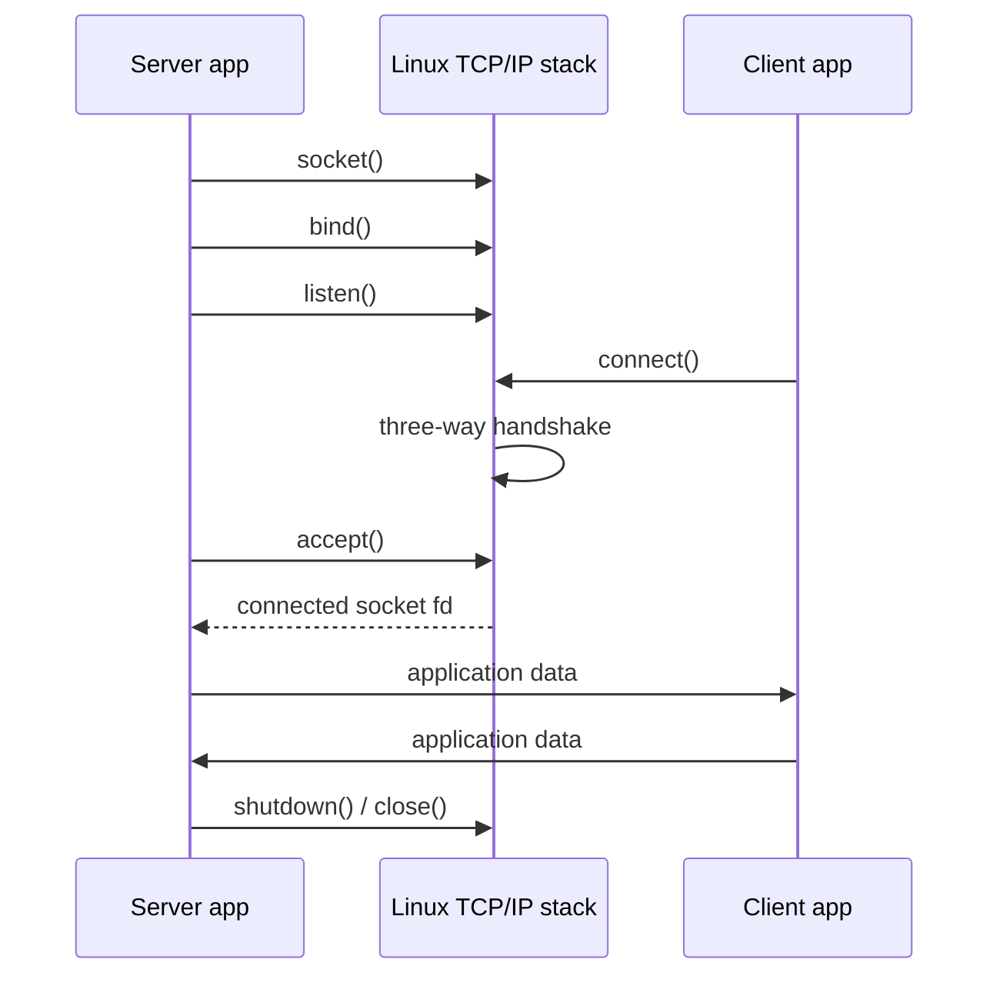
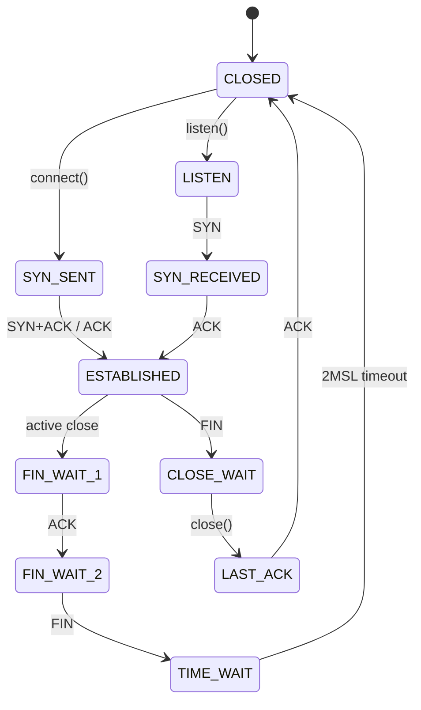

# Chủ đề 9 — Socket Programming trong Linux

> **Mục tiêu:** hiểu socket là gì, cách TCP `server`/`client` hình thành kết nối, UDP khác TCP ở đâu, địa chỉ `sockaddr` và `network byte order` hoạt động thế nào, và cách một kết nối được đóng hoặc báo lỗi ở mức lý thuyết.
>
> **Quy ước ngôn ngữ:** phần giải thích dùng Tiếng Việt. Giữ nguyên các thuật ngữ mạng/socket cần tra cứu đúng tên như `socket`, `server`, `client`, `endpoint`, `address family`, `socket address`, `network byte order`, `byte stream`, `datagram`, `message framing`, `backpressure`, `partial I/O`, `half-close`, `orderly shutdown`, cùng tên API, protocol, cấu trúc, trạng thái TCP và mã lỗi.
>
> **Phạm vi:** socket API, `address family`/kiểu/giao thức, địa chỉ socket, IPv4/IPv6, cổng, byte order, `getaddrinfo()`, TCP và UDP, vòng đời `server`/`client`, TCP bắt tay/trạng thái, `byte stream` và `framing`, `partial I/O`, `graceful shutdown`, UDP datagram, Unix Domain Socket ở mức socket API và xử lý lỗi cơ bản.
>
> Chương này chỉ có **lý thuyết**, không có bài thực hành. `O_NONBLOCK`, `select()`, `poll()`, `epoll()`, readiness model và event loop thuộc **Chủ đề 10**; Topic 9 chỉ nhắc ranh giới cần thiết.

Socket là một điểm giao tiếp do Linux kernel quản lý. Khi tạo socket, ứng dụng chọn **`domain`/`address family`**, **kiểu giao tiếp** và **giao thức**; sau đó socket được gắn với địa chỉ cục bộ hoặc kết nối tới một `endpoint` khác tùy vai trò. TCP và UDP cùng dùng Socket API nhưng có ngữ nghĩa dữ liệu rất khác: TCP là `byte stream` có kết nối, còn UDP truyền từng datagram độc lập.

Chương này đi theo vòng đời thật của một socket. Ta bắt đầu từ `socket()` và cấu trúc địa chỉ, tiếp đến `bind()`/`listen()`/`accept()` hoặc `connect()`, rồi mới giải thích `framing` của TCP, `partial I/O`, đóng kết nối, UDP và Unix Domain Socket. Cách đi này giúp người mới nhìn thấy một luồng hoàn chỉnh trước khi nhớ từng API.

Nếu bạn mới bắt đầu, hãy đọc theo thứ tự từ mục lớn tới mục nhỏ và xem sơ đồ trước khi đi vào các chi tiết API. Mỗi sơ đồ chỉ giữ những thành phần cần thiết để tạo mô hình trong đầu; đoạn văn ngay bên dưới sẽ giải thích luồng dữ liệu, trạng thái hoặc quan hệ giữa các object. Sau khi đã hiểu mô hình, hãy quay lại tên API, flag và mã lỗi để gắn chúng vào đúng vị trí thay vì học thuộc rời rạc.

---

## Mục lục

- [1. Socket Programming là gì?](#1-socket-programming-là-gì)
- [2. `address family`, kiểu và giao thức quyết định `socket` ra sao?](#2-address-family-kiểu-và-giao-thức-quyết-định-socket-ra-sao)
- [3. `socket` có `file descriptor` nhưng không phải tệp thông thường](#3-socket-có-file-descriptor-nhưng-không-phải-tệp-thông-thường)
- [4. `socket address` và `sockaddr`](#4-socket-address-và-sockaddr)
- [5. `network byte order`: vì sao phải đổi `byte order`?](#5-network-byte-order-vì-sao-phải-đổi-byte-order)
- [6. `getaddrinfo()`: từ tên máy tới `socket address`](#6-getaddrinfo-từ-tên-máy-tới-socket-address)
- [7. Địa chỉ IP, cổng và `endpoint`](#7-địa-chỉ-ip-cổng-và-endpoint)
- [8. `bind()`: chọn địa chỉ và cổng cục bộ](#8-bind-chọn-địa-chỉ-và-cổng-cục-bộ)
- [9. TCP và UDP khác nhau ở mô hình dữ liệu nào?](#9-tcp-và-udp-khác-nhau-ở-mô-hình-dữ-liệu-nào)
- [10. TCP `server`: `socket → bind → listen → accept`](#10-tcp-server-socket--bind--listen--accept)
- [11. TCP `client`: `socket → connect`](#11-tcp-client-socket--connect)
- [12. Bắt tay TCP và các trạng thái quan trọng](#12-bắt-tay-tcp-và-các-trạng-thái-quan-trọng)
- [13. TCP là `byte stream`: ứng dụng phải tự chia thông điệp](#13-tcp-là-byte-stream-ứng-dụng-phải-tự-chia-thông-điệp)
- [14. Bộ đệm, `backpressure` và `partial I/O` trong TCP](#14-bộ-đệm-backpressure-và-partial-io-trong-tcp)
- [15. Đóng TCP đúng cách: `shutdown()`, FIN, RST và `TIME_WAIT`](#15-đóng-tcp-đúng-cách-shutdown-fin-rst-và-time_wait)
- [16. UDP: mỗi lần gửi là một `datagram`](#16-udp-mỗi-lần-gửi-là-một-datagram)
- [17. UDP `bind()`, `connect()`, `sendto()` và `recvfrom()`](#17-udp-bind-connect-sendto-và-recvfrom)
- [18. `send()` và `recv()`: API truyền nhận dữ liệu cơ bản](#18-send-và-recv-api-truyền-nhận-dữ-liệu-cơ-bản)
- [19. Unix Domain Socket: cùng API nhưng giao tiếp cục bộ](#19-unix-domain-socket-cùng-api-nhưng-giao-tiếp-cục-bộ)
- [20. Tư duy gỡ lỗi Socket theo từng lớp](#20-tư-duy-gỡ-lỗi-socket-theo-từng-lớp)
- [21. Liên hệ với Embedded Linux](#21-liên-hệ-với-embedded-linux)
- [22. Tổng kết và mô hình tư duy](#22-tổng-kết-và-mô-hình-tư-duy)
- [23. Tài liệu tham khảo](#23-tài-liệu-tham-khảo)

---

## 1. Socket Programming là gì?

`socket` là một điểm giao tiếp do Linux kernel quản lý. Cùng một Socket API có thể dùng cho TCP, UDP và Unix Domain Socket.

### 1.1 `socket` nằm ở đâu trong hệ thống?

Mô hình đơn giản:

```text
Ứng dụng
   |
   | socket API
   v
socket object trong Linux kernel
   |
   +--> TCP
   |
   +--> UDP
   |
   +--> Unix Domain Socket
```

Sơ đồ cho thấy `socket` là **object do kernel quản lý**, còn TCP, UDP và Unix Domain Socket là các semantics/protocol family khác nhau có thể được truy cập qua cùng họ API. Vì vậy một fd socket không tự nói cho ta biết dữ liệu là byte stream hay datagram, giao tiếp local hay qua IP; phải nhìn cả `address family`, `socket type` và protocol.

Với TCP/UDP qua IP:

```text
Ứng dụng
   |
socket API
   |
TCP / UDP
   |
IP
   |
routing / network interface
   |
NIC / mạng
```

Sơ đồ đặt socket đúng vị trí giữa ứng dụng và network/IPC stack của kernel. Ứng dụng thao tác qua một socket fd; kernel giữ protocol state, buffer, địa chỉ và connection state tương ứng. Vì vậy `send()` thành công thường chỉ có nghĩa kernel đã chấp nhận dữ liệu vào pipeline gửi, chứ không chứng minh ứng dụng phía xa đã xử lý dữ liệu đó.

---

### 1.2 Socket là `endpoint`

`socket(2)` mô tả socket như một `endpoint` cho việc giao tiếp.

Hai phía:

```text
Ứng dụng A
   |
socket A
   |
   +========== giao tiếp ==========+
                                |
                             socket B
                                |
                           Ứng dụng B
```

Mỗi socket là một endpoint mà ứng dụng dùng để giao tiếp. Với TCP connection, hai endpoint được liên kết thành một byte stream hai chiều; với UDP, một socket có thể gửi/nhận nhiều datagram tới/từ các peer khác nhau tùy cách sử dụng. Từ `endpoint` giúp tránh cách nghĩ sai rằng socket chính là “đường dây” hoặc chính packet trên mạng.

---

### 1.3 Socket API không đồng nghĩa TCP

Cùng Socket API có thể phục vụ: `TCP`, `UDP` và Unix Domain Socket.

Do đó:

```text
socket = giao diện/endpoint
TCP/UDP = giao thức với ngữ nghĩa riêng
```

---

### 1.4 `client` và `server` là vai trò

Không có kiểu: `SOCK_CLIENT` và `SOCK_SERVER`.

Vai trò hình thành bởi chuỗi thao tác.

TCP `server`:

```text
socket -> bind -> listen -> accept
```

Chuỗi server mô tả quá trình biến một socket mới thành **listening socket** gắn với local endpoint rồi chờ connection. `accept()` sau đó tạo/trả một connected socket fd cho từng connection cụ thể; listening socket không bị thay thế.

TCP `client`:

```text
socket -> connect
```

Hai chuỗi thao tác thể hiện **vai trò**, không phải hai loại socket API hoàn toàn khác nhau. TCP server thường chọn local endpoint bằng `bind()`, chuyển socket sang trạng thái lắng nghe bằng `listen()` và nhận connection bằng `accept()`. Client thường để kernel chọn local ephemeral port rồi gọi `connect()` tới remote endpoint. Sau khi kết nối được thiết lập, cả hai phía đều có connected socket và đều có thể `send()`/`recv()`.

---

## 2. `address family`, kiểu và giao thức quyết định `socket` ra sao?

`domain` chọn communication domain (`address family`), `type` chọn kiểu truyền như `stream`/`datagram`, còn `protocol` chọn giao thức cụ thể nếu cần.

### 2.1 `socket(domain, type, protocol)`

Ba tham số trả lời ba câu hỏi khác nhau: **domain** chọn `address family`; **type** chọn kiểu giao tiếp như `stream` hay `datagram`; **protocol** chọn giao thức cụ thể nếu cặp domain/type cho phép nhiều lựa chọn.

---

### 2.2 `AF_INET`

Dùng cho:

```text
IPv4 Internet socket
```

Một địa chỉ socket IPv4 thường chứa địa chỉ IPv4 và số cổng 16 bit.

---

### 2.3 `AF_INET6`

Dùng cho:

```text
IPv6 Internet socket
```

Địa chỉ IPv6 rộng 128 bit và có thêm một số trường địa chỉ/định tuyến cục bộ như `scope` trong cấu trúc địa chỉ socket.

---

### 2.4 `AF_UNIX` / `AF_LOCAL`

Dùng cho giao tiếp socket giữa các tiến trình trên cùng hệ thống Linux/Unix.

Không gian tên địa chỉ của `AF_UNIX` khác IP. Trường hợp phổ biến nhất là dùng một pathname làm địa chỉ cục bộ; Linux còn có abstract namespace.

---

### 2.5 `SOCK_STREAM`

Kiểu luồng cung cấp mô hình: kết nối, hai chiều và chuỗi byte có thứ tự.

Với Internet socket, `AF_INET/AF_INET6 + SOCK_STREAM` thông thường tương ứng TCP.

---

### 2.6 `SOCK_DGRAM`

Kiểu datagram giữ ranh giới từng datagram/thông điệp.

Với Internet socket, thông thường tương ứng UDP.

---

### 2.7 `protocol = 0`

Thường có nghĩa:

```text
Linux kernel chọn giao thức mặc định phù hợp với address family + kiểu
```

Ví dụ:

```text
AF_INET + SOCK_STREAM + 0
  -> TCP thông thường

AF_INET + SOCK_DGRAM + 0
  -> UDP thông thường
```

Khi `protocol` bằng 0, kernel chọn protocol mặc định phù hợp với cặp `address family` và `socket type`. Với `AF_INET/AF_INET6 + SOCK_STREAM`, lựa chọn thông thường là TCP; với `SOCK_DGRAM`, lựa chọn thông thường là UDP. Vì thế chỉ nhìn `protocol=0` không đủ để biết semantics; phải đọc cả ba tham số của `socket()` cùng nhau.

---

### 2.8 Phải nhìn cả ba thành phần

`SOCK_STREAM` một mình chưa đủ để kết luận đó là TCP, vì kiểu stream cũng có thể được dùng với `AF_UNIX`. Phải nhìn đồng thời cả `domain`, `type` và `protocol`.

Ngữ nghĩa đầy đủ là:

```text
address family + kiểu + giao thức
```

---

## 3. `socket` có `file descriptor` nhưng không phải tệp thông thường

Socket được tiến trình giữ qua `file descriptor`, nên nhiều thao tác fd áp dụng được; nhưng socket không phải tệp thông thường có offset để `lseek()` như tệp trên đĩa.

### 3.1 `socket()` trả về fd

```text
socket()
   |
   v
fd = 7
```

fd 7 nằm trong cùng bảng `file descriptor` của tiến trình:

```text
fd 0 -> stdin
fd 1 -> stdout
fd 2 -> stderr
fd 7 -> socket
```

Socket fd tham gia cùng file descriptor table với stdin, stdout, file, pipe và device fd. Con số fd chỉ là handle ở cấp process; operation phía sau được dispatch theo object mà entry đó tham chiếu. Đây là lý do các API chung như `read()`, `write()`, `close()`, `poll()` có thể làm việc với socket, dù socket không phải regular file và không có file offset.

---

### 3.2 fd trỏ tới trạng thái `socket` trong kernel

Cách hình dung:

```text
fd
 |
 v
open file description
 |
 v
kernel socket object
 |
 v
TCP / UDP / Unix Domain Socket state
```

Với TCP, kernel socket object có thể chứa local endpoint, remote endpoint, send buffer, receive buffer, **TCP connection state** và trạng thái lỗi liên quan.

---

### 3.3 Vì sao `read()`/`write()` có thể dùng trên socket?

Vì socket được biểu diễn qua fd và tích hợp vào mô hình I/O của Unix.

Một connected stream socket có thể dùng:

```text
read()/write()
```

hoặc:

```text
recv()/send()
```

Các API riêng của socket thêm khả năng như flag, địa chỉ nguồn/đích và siêu dữ liệu.

---

### 3.4 Nhưng `socket` không có vị trí đọc/ghi của tệp

Không nên suy ra:

```text
có fd  -/->  regular file
```

Internet socket không lưu nội dung bền vững như tệp và cũng không có file offset để `seek` như tệp thông thường.

---

### 3.5 Nhiều fd có thể trỏ cùng socket

Do:

```text
dup()
fork()
truyền fd
```

có thể có:

```text
fd 7 ----+
         +--> cùng underlying socket object
fd 10 ---+
```

Đóng một fd chưa chắc đóng kết nối nếu tham chiếu khác vẫn còn.

---

### 3.6 `FD_CLOEXEC`

Socket fd có thể sống qua `execve()` nếu không đặt close-on-exec.

Rò fd qua `exec` có thể gây: kết nối sống lâu bất ngờ, socket lắng nghe còn tham chiếu và tiến trình child thừa quyền truy cập socket.

---

## 4. `socket address` và `sockaddr`

API socket dùng `sockaddr` như dạng chung, còn IPv4/IPv6 có cấu trúc riêng như `sockaddr_in` và `sockaddr_in6`.

### 4.1 Mỗi `address family` có cấu trúc địa chỉ riêng

IPv4:

```text
IP + cổng
```

IPv6:

```text
địa chỉ IPv6 + cổng + trường IPv6 liên quan
```

Unix `address family`:

```text
local socket address
```

API chung cần một cách truyền các cấu trúc khác nhau.

---

### 4.2 `struct sockaddr`

Đây là cấu trúc địa chỉ socket tổng quát dùng ở giao diện API.

Nó chứa ít nhất thông tin về `address family` và phần dữ liệu địa chỉ tương ứng.

Ứng dụng IPv4 thường thao tác bằng `sockaddr_in`, sau đó truyền con trỏ theo kiểu chung mà API yêu cầu.

---

### 4.3 `sockaddr_in` cho IPv4

Mental structure:

```text
sockaddr_in
  |
  +--> sin_family = AF_INET
  |
  +--> sin_port
  |
  +--> sin_addr
```

`sin_family` nói cấu trúc này thuộc IPv4, `sin_port` chứa port theo network byte order và `sin_addr` chứa địa chỉ IPv4 dạng nhị phân. Ba trường này không phải ba endpoint khác nhau; chúng cùng mô tả **một socket address IPv4** mà API như `bind()` hoặc `connect()` sử dụng.

Có thể hình dung endpoint IPv4 là:

```text
địa chỉ IPv4 + TCP/UDP cổng
```

---

### 4.4 `sockaddr_in6` cho IPv6

Hiểu đơn giản:

```text
sockaddr_in6
  |
  +--> sin6_family
  +--> sin6_port
  +--> sin6_addr
  +--> sin6_scope_id
  +--> các IPv6-specific fields khác
```

`scope_id` đặc biệt quan trọng với các địa chỉ có phạm vi như **link-local address**.

---

### 4.5 `sockaddr_storage`

Nếu chương trình cần một bộ đệm đủ lớn cho nhiều `address family`:

```text
sockaddr_storage
```

được thiết kế đủ lớn và đúng alignment cho các địa chỉ socket chuẩn được hỗ trợ.

---

### 4.6 `socklen_t`

Socket API thường nhận đồng thời con trỏ tới cấu trúc địa chỉ và độ dài của cấu trúc đó, vì mỗi `address family` có kiểu cấu trúc và kích thước khác nhau.

Kiểu độ dài chuẩn là:

```text
socklen_t
```

---

### 4.7 Địa chỉ dạng chữ và dạng nhị phân

Con người dùng: `192.168.1.10` và `2001:db8::1`.

Socket API làm việc với binary cấu trúc địa chỉ.

Các hàm như:

```text
inet_pton()
inet_ntop()
getaddrinfo()
```

nối hai thế giới này.

---

## 5. `network byte order`: vì sao phải đổi `byte order`?

Máy tính có thể lưu một số gồm nhiều byte theo thứ tự khác nhau; `network byte order` tạo ra một quy ước chung để hai máy hiểu cùng giá trị.

### 5.1 Little-endian và big-endian

Giá trị 16-bit:

```text
0x1234
```

Cùng giá trị đó có thể được lưu theo hai `byte order`: **big-endian** là `12 34`, còn **little-endian** là `34 12`.

---

### 5.2 `network byte order` là big-endian

Các trường số trong giao thức Internet dùng quy ước **`network byte order`**, tức big-endian.

Ứng dụng không nên truyền số nguyên thô ở host byte order rồi mong mọi máy hiểu giống nhau.

---

### 5.3 Các hàm chuyển đổi

```text
htons()
  host byte order → network byte order, 16 bit

htonl()
  host byte order → network byte order, 32 bit

ntohs()
  network byte order → host byte order, 16 bit

ntohl()
  network byte order → host byte order, 32 bit
```

---

### 5.4 Vì sao cổng dùng `htons()`?

TCP/UDP cổng là 16 bit.

Cách hình dung:

```text
port number ở host byte order
   |
 htons()
   |
   v
sin_port
```

---

### 5.5 Không chuyển đổi hai lần

Nếu một API đã trả địa chỉ ở dạng cách biểu diễn trên mạng phù hợp, không được mù quáng gọi `hton*()` lại.

Mỗi field/API phải được đọc đúng hợp đồng biểu diễn của nó.

---

### 5.6 `inet_pton()` và `inet_ntop()`

```text
"192.0.2.1"
   |
inet_pton()
   |
   v
binary IPv4 address
```

Ngược lại:

```text
binary network address
   |
inet_ntop()
   |
   v
human-readable IP string
```

---

## 6. `getaddrinfo()`: từ tên máy tới `socket address`

`getaddrinfo()` biến hostname và service name thành danh sách địa chỉ phù hợp, giúp chương trình hỗ trợ IPv4/IPv6 mà không tự `hard-code` từng cấu trúc.

### 6.1 Vì sao không nên gắn chương trình cứng vào IPv4?

Một `server` có thể có cả IPv4, IPv6, nhiều địa chỉ IP và bản ghi DNS thay đổi theo thời gian. Vì vậy một tên máy như:

```text
example.com
```

không đồng nghĩa một IP duy nhất.

---

### 6.2 `getaddrinfo()` làm gì?

Hiểu đơn giản:

```text
hostname + service/port + hints
(address family / socket type / protocol)
             |
             v
        getaddrinfo()
             |
             v
      candidate addresses
```

---

### 6.3 `struct addrinfo`

Mỗi kết quả ứng viên chứa thông tin như: `ai_family`, `ai_socktype`, `ai_protocol`, `ai_addr`, `ai_addrlen` và `ai_next`.

Ứng dụng có thể duyệt nhiều địa chỉ ứng viên thay vì tự ghép `sockaddr_in` cho mọi trường hợp.

---

### 6.4 `AF_UNSPEC`

Nếu chấp nhận cả IPv4 và IPv6:

```text
AF_UNSPEC
```

cho phép bộ phân giải trả về nhiều `address family` phù hợp.

Đây là nền cho code ít bị phụ thuộc vào IPv4 hơn.

---

### 6.5 Phân giải địa chỉ phía `client`

```text
hostname
  +
service
  |
  v
getaddrinfo()
  |
  v
candidate address A
candidate address B
candidate address C
  |
  v
thử socket()/connect() theo application policy
```

Phía client thường bắt đầu từ một hostname và service chứ không phải từ một địa chỉ IPv4 đã hard-code. `getaddrinfo()` chuyển cặp tên đó thành danh sách candidate socket address, có thể gồm IPv4 và IPv6 tùy cấu hình và các hint. Ứng dụng sau đó thử `socket()` và `connect()` với từng candidate theo policy của mình. Vì vậy **name resolution** và **connection attempt** là hai bước riêng: resolve thành công chỉ nói rằng ta có địa chỉ để thử, chưa chứng minh server đang reachable hay đang lắng nghe.

---

### 6.6 Phân giải địa chỉ phía `server`

Với `AI_PASSIVE`, bộ phân giải có thể tạo địa chỉ wildcard cục bộ phù hợp cho `bind()` khi `server` không chỉ định một địa chỉ IP cục bộ cụ thể.

---

### 6.7 Name resolution thành công không có nghĩa `connect()` thành công

`getaddrinfo()` chỉ cho biết:

```text
có thể biểu diễn tên máy/dịch vụ thành địa chỉ ứng viên
```

Nó không chứng minh đường mạng đang thông, máy đích đang hoạt động, cổng đang mở, `server` đang chạy hay giao thức ứng dụng đang đúng.

---

## 7. Địa chỉ IP, cổng và `endpoint`

Một `endpoint` Internet có địa chỉ IP và port. Một kết nối TCP đầy đủ được phân biệt bởi cả `endpoint` cục bộ và `endpoint` phía bên kia.

### 7.1 IP và cổng trả lời hai câu hỏi khác nhau

Đơn giản hóa:

Địa chỉ **IP** trả lời “máy hoặc giao diện mạng nào?”, còn **cổng** trả lời “dịch vụ giao vận nào trên máy đó?”.

---

### 7.2 Cổng là 16 bit

Phạm vi giá trị:

```text
0 ... 65535
```

TCP cổng và UDP cổng là hai không gian tên giao vận riêng.

```text
TCP :5000
```

và:

```text
UDP :5000
```

không phải cùng một binding theo giao thức.

---

### 7.3 Các dải cổng theo IANA

IANA chia registry thành:

**0–1023**: System Ports; **1024–49151**: User/Registered Ports; **49152–65535**: Dynamic/Private Ports.

Đây là phân loại registry.

Dải cổng tạm thời (`ephemeral port`) mà Linux tự chọn cho `client` có thể được cấu hình khác; vì vậy không nên đồng nhất nó với các dải đăng ký của IANA.

---

### 7.4 Internet `endpoint`

Có thể hình dung một `endpoint` Internet bằng các thành phần: `address family`, địa chỉ IP, giao thức vận chuyển và số cổng.

Với TCP, một kết nối được phân biệt bởi cả `endpoint` cục bộ và `endpoint` từ xa.

---

### 7.5 Một kết nối TCP thường được mô tả bằng 4-tuple

```text
địa chỉ IP cục bộ
cổng cục bộ
địa chỉ IP từ xa
cổng từ xa
```

Bốn giá trị này tạo thành cách mô tả quen thuộc của một TCP connection: local address, local port, remote address và remote port. Listening socket chủ yếu đại diện cho local endpoint, còn connected socket có đủ cả local và remote endpoint. Chính remote endpoint khác nhau cho phép nhiều client cùng kết nối tới một server port mà không bị lẫn connection state.

Ví dụ một `server` cổng 8080 có thể phục vụ nhiều `client`:

```text
192.168.1.10:8080 <-> 192.168.1.20:51001
192.168.1.10:8080 <-> 192.168.1.21:52311
192.168.1.10:8080 <-> 192.168.1.22:60002
```

Một server có thể dùng cùng local IP:port cho rất nhiều client vì mỗi TCP connection được phân biệt bởi **local address, local port, remote address và remote port**. Ba connection trong sơ đồ có cùng server endpoint nhưng remote endpoint khác nhau, nên kernel vẫn quản lý chúng như ba connection độc lập. Đây là nền tảng để hiểu vì sao một listening port có thể phục vụ hàng nghìn connection đồng thời.

---

### 7.6 `wildcard address`

IPv4:

```text
0.0.0.0 / INADDR_ANY
```

khi dùng với `bind()` có nghĩa socket chấp nhận các địa chỉ IPv4 cục bộ phù hợp, không phải một “máy từ xa 0.0.0.0”.

---

### 7.7 `loopback`

```text
127.0.0.1
::1
```

là địa chỉ loopback qua ngăn xếp IP trên cùng máy.

Nó khác `AF_UNIX`, dù đều dùng cho giao tiếp cục bộ.

---

## 8. `bind()`: chọn địa chỉ và cổng cục bộ

`bind()` gán địa chỉ/port cục bộ cho socket. `Server` thường cần `endpoint` ổn định; `client` thường để Linux kernel tự chọn port tạm thời.

### 8.1 `socket` mới chưa có địa chỉ cục bộ do ứng dụng chọn

`bind()` gán địa chỉ hoặc tên cục bộ cho socket.

```text
socket()
   |
   v
unbound socket
   |
bind(local address)
   |
   v
socket có local endpoint
```

---

### 8.2 `server` thường cần `bind()`

`Client` phải biết:

```text
server ở IP/địa chỉ nào?
cổng nào?
```

Do đó `server` cần `endpoint` ổn định.

---

### 8.3 `client` thường không cần tự bind

Nếu `client` không gọi `bind()` trước, Linux thường tự chọn địa chỉ nguồn cục bộ và một cổng nguồn tạm thời (`ephemeral port`) khi `connect()` hoặc khi bắt đầu truyền datagram.

---

### 8.4 Cổng 0

Bind cổng 0 có thể yêu cầu Linux kernel chọn một cổng khả dụng.

```text
Ứng dụng:
"Tôi cần một cổng cục bộ, số cụ thể không quan trọng"
```

Linux kernel chọn theo chính sách ephemeral port của hệ thống.

---

### 8.5 `EADDRINUSE`

Thường chỉ ra địa chỉ cục bộ/cổng đang xung đột theo quy tắc bind/reuse hiện tại.

Không nên chỉ nghĩ:

> “Có một chương trình khác dùng đúng cổng.”

Còn có trạng thái giao thức/socket option có thể ảnh hưởng.

---

### 8.6 `EADDRNOTAVAIL`

Thường liên quan tới địa chỉ yêu cầu không khả dụng/không thuộc cục bộ ngữ cảnh hiện tại.

Câu hỏi cần đặt:

```text
Địa chỉ này có thật sự là địa chỉ cục bộ trong namespace/giao diện này không?
```

---

## 9. TCP và UDP khác nhau ở mô hình dữ liệu nào?

TCP cung cấp một `byte stream` có thứ tự và cơ chế truyền tin cậy ở tầng vận chuyển; UDP gửi từng datagram riêng nhưng không tự bảo đảm datagram sẽ tới nơi hoặc tới đúng thứ tự.

### 9.1 TCP

TCP cung cấp một kết nối hai chiều với `byte stream` có thứ tự và cơ chế truyền tin cậy ở tầng vận chuyển.

TCP tự xử lý nhiều cơ chế như `retransmission`, `flow control` và `congestion control`.

---

### 9.2 UDP

UDP cung cấp: datagram, không có bắt tay kết nối kiểu TCP, không bảo đảm giao hàng, không bảo đảm thứ tự và không bảo đảm loại bỏ dữ liệu trùng lặp (`duplicate`).

Ứng dụng nhìn dữ liệu theo từng datagram.

---

### 9.3 Bảng so sánh

| Thuộc tính | TCP | UDP |
|---|---|---|
| Kết nối giao vận | Có | Không có TCP handshake |
| Mô hình dữ liệu | `byte stream` | datagram |
| Thứ tự | được giữ | không bảo đảm |
| Mất gói | TCP xử lý `retransmission` theo giao thức | ứng dụng/giao thức tự quyết |
| ranh giới thông điệp | Không | Có |
| `congestion control` | TCP có | ứng dụng UDP phải tuân thủ cơ chế/chính sách kiểm soát tắc nghẽn phù hợp |

---

### 9.4 “TCP đáng tin cậy” không có nghĩa logic nghiệp vụ thành công

TCP có thể xác nhận `byte stream` đã được TCP phía bên kia tiếp nhận ở mức giao thức, nhưng không chứng minh: ứng dụng từ xa đã parse xong, đã ghi database, đã lưu flash hay đã thực hiện command thành công.

Nếu cần xác nhận nghiệp vụ, giao thức ứng dụng phải có ACK/trạng thái riêng.

---

### 9.5 “UDP nhanh hơn TCP” là cách nói quá đơn giản

UDP ít cơ chế giao vận hơn, nhưng ứng dụng có thể phải tự bổ sung: đánh số thứ tự, `retry`, `timeout`, phát hiện dữ liệu trùng, kiểm soát tắc nghẽn và trạng thái session.

Việc lựa chọn phải theo yêu cầu giao thức, không chỉ theo một benchmark độ trễ nhỏ.

---

## 10. TCP `server`: `socket → bind → listen → accept`

TCP `server` dùng socket lắng nghe để nhận kết nối mới. Mỗi `accept()` trả về một socket đã kết nối riêng cho một `client`.

### 10.1 Bước 1 — `socket()`

Tạo `endpoint`:

```text
AF_INET/AF_INET6
+
SOCK_STREAM
```

Ở thời điểm này chưa phải listener.

---

### 10.2 Bước 2 — `bind()`

Chọn `endpoint` cục bộ:

```text
địa chỉ IP cục bộ hoặc địa chỉ wildcard
+
cổng dịch vụ
```

---

### 10.3 Bước 3 — `listen()`

Chuyển `SOCK_STREAM` socket sang trạng thái lắng nghe:

```text
listening socket
```

Nó nhận yêu cầu kết nối chứ không phải là socket dữ liệu riêng của một `client`.

---

### 10.4 Bước 4 — `accept()`

Khi có kết nối đã sẵn sàng:

```text
accept()
   |
   v
fd mới
```

fd mới là **`connected socket`** gắn với một `peer` cụ thể.

---

### 10.5 Phân biệt `listening socket` và `connected socket`

```text
                  listening socket
                      :8080
                        |
          +-------------+-------------+
          |             |             |
          v             v             v
 connected fd A   connected fd B   connected fd C
    client A         client B         client C
```

Sơ đồ tách hai vai trò rất quan trọng. `listening socket` là điểm mà kernel dùng để nhận connection mới cho local port; nó không phải socket dữ liệu riêng của bất kỳ client nào. Mỗi lần `accept()` thành công, kernel trả về một **connected socket fd mới** gắn với một peer cụ thể. Server dùng các connected fd để trao đổi dữ liệu, trong khi listening fd vẫn mở để tiếp tục `accept()` connection sau.

---

### 10.6 `backlog`

`listen(backlog)` liên quan tới hàng đợi kết nối đang chờ ứng dụng accept.

Không được hiểu:

```text
backlog = số client tối đa suốt đời server
```

Trên Linux hiện đại, `listen(2)` mô tả backlog theo hàng đợi kết nối đã hoàn tất bắt tay chờ accept, trong khi SYN hàng đợi có quản lý riêng.

---

### 10.7 Chuỗi `server`



Sơ đồ phân biệt rõ thao tác của **ứng dụng server** với công việc của **Linux TCP/IP stack**. `socket()`, `bind()` và `listen()` chuẩn bị listening socket; `connect()` từ client khiến TCP stack thực hiện bắt tay. Chỉ sau khi một connection đã được kernel thiết lập, `accept()` mới trả về một **connected socket fd** riêng để server trao đổi byte stream với client. Listening socket vẫn tồn tại để nhận các connection mới, nên server thực tế thường có ít nhất hai loại fd: một fd để lắng nghe và nhiều fd kết nối cho từng client.

---

## 11. TCP `client`: `socket → connect`

`Client` TCP tạo socket rồi gọi `connect()` tới `server`. `connect()` thành công chỉ cho biết kết nối TCP đã được thiết lập; nó chưa chứng minh yêu cầu ở tầng ứng dụng đã thành công.

### 11.1 Chuỗi cơ bản

```text
tên máy/dịch vụ
      |
getaddrinfo()
      |
      v
socket()
      |
connect(server address)
      |
      v
connected socket
```

Client thường bắt đầu từ hostname/service thay vì địa chỉ nhị phân. `getaddrinfo()` chuyển tên thành một danh sách candidate socket address; chương trình thử `socket()`/`connect()` với candidate phù hợp cho tới khi kết nối được hoặc hết lựa chọn. Tách bước resolution khỏi connect giúp code hỗ trợ cả IPv4/IPv6 và tránh gắn cứng cấu trúc địa chỉ vào logic ứng dụng.

---

### 11.2 `connect()` với TCP

`connect()` bắt đầu quá trình mở chủ động (`active open`) tới `endpoint` từ xa.

Ở chế độ blocking thông thường, lời gọi có thể chờ tới khi:

```text
kết nối thành công
hoặc
lỗi/timeout
```

Nonblocking connect và `EINPROGRESS` thuộc Topic 10.

---

### 11.3 `endpoint` cục bộ có thể được kernel chọn

`Client` thường chỉ chỉ định:

```text
địa chỉ từ xa + cổng từ xa
```

Linux kernel dựa trên bảng định tuyến (`route`) để chọn: địa chỉ nguồn cục bộ và cổng cục bộ tạm thời.

---

### 11.4 `connect()` thành công chỉ là thành công ở tầng TCP

Điều đó chưa chứng minh `server` đã chấp nhận đăng nhập, phiên bản giao thức ứng dụng tương thích hay yêu cầu của ứng dụng đã được xử lý.

Đó là tầng giao thức ứng dụng.

---

## 12. Bắt tay TCP và các trạng thái quan trọng

TCP hoạt động như một `state machine` và thiết lập kết nối bằng `three-way handshake`. Các trạng thái như `ESTABLISHED`, `CLOSE_WAIT` và `TIME_WAIT` giúp giải thích nhiều hiện tượng khi gỡ lỗi.

### 12.1 TCP có `state machine`

Một kết nối TCP đi qua những trạng thái như:

```text
CLOSED
LISTEN
SYN-SENT
SYN-RECEIVED
ESTABLISHED
FIN-WAIT-1
FIN-WAIT-2
CLOSE-WAIT
LAST-ACK
TIME-WAIT
```

Không nên nghĩ TCP chỉ có:

```text
connected / disconnected
```

---

### 12.2 `three-way handshake`

```text
Client                         Server

SYN -------------------------->

    <--------------------- SYN + ACK

ACK -------------------------->

ESTABLISHED                 ESTABLISHED
```

Three-way handshake đồng bộ connection state và initial sequence-number state giữa hai TCP endpoint. Client chủ động gửi SYN; server đang LISTEN phản hồi SYN+ACK; ACK cuối từ client xác nhận phản hồi của server. Sau khi state machine đạt `ESTABLISHED`, TCP byte stream mới sẵn sàng cho trao đổi dữ liệu theo nghĩa thông thường. Đây là handshake của transport layer, không phải authentication hay handshake của application protocol.

---

### 12.3 `LISTEN`

`Server` socket lắng nghe đang chờ quá trình bắt đầu kết nối.

---

### 12.4 `SYN-SENT`

`Client` đã gửi yêu cầu mở chủ động (`active open`) và đang chờ phản hồi bắt tay.

---

### 12.5 `SYN-RECEIVED`

Phía nhận đã nhận SYN, trả SYN/ACK và chờ hoàn tất bắt tay.

---

### 12.6 `ESTABLISHED`

Kết nối hai phía đã được thiết lập ở mức TCP và có thể truyền `byte stream`.

---

### 12.7 `state machine` đơn giản



Đây là phiên bản rút gọn của TCP state machine, dùng để hình dung **connection thay đổi trạng thái theo packet và API call**. Phía server thường đi từ `CLOSED` tới `LISTEN`, còn active opener đi từ `CLOSED` tới `SYN_SENT`. Sau bắt tay, hai phía ở `ESTABLISHED`. Khi đóng kết nối, đường đi phụ thuộc bên nào chủ động gửi FIN trước; vì vậy có các trạng thái khác nhau như `FIN_WAIT_*`, `CLOSE_WAIT`, `LAST_ACK` và `TIME_WAIT`. Sơ đồ không thay thế RFC, nhưng đủ để giải thích phần lớn trạng thái xuất hiện trong `ss`/`netstat` khi debug.

RFC 9293 có `state machine` đầy đủ hơn; sơ đồ trên phục vụ nhập môn.

---

## 13. TCP là `byte stream`: ứng dụng phải tự chia thông điệp

TCP bảo toàn **thứ tự các byte trong `byte stream`**, nhưng không giữ ranh giới message của ứng dụng. Nếu ứng dụng có message, nó phải tự định nghĩa cách chia khung (`message framing`).

> **Đây là một trong những điểm quan trọng nhất của socket programming.** TCP không giữ ranh giới giữa các lần `send()`.

### 13.1 Ví dụ

Sender:

```text
send("ABC")
send("DEF")
```

Receiver có thể thấy:

```text
recv -> "ABCDEF"
```

hoặc:

```text
recv -> "A"
recv -> "BCDE"
recv -> "F"
```

Cả hai cách nhận đều hợp lệ. TCP bảo toàn **thứ tự các byte trong byte stream**, nhưng không bảo toàn ranh giới giữa các lần `send()`. Vì vậy receiver phải tự biết khi nào một message hoàn chỉnh bằng framing của application protocol; không được giả định “một `send()` tương ứng một `recv()`”.

---

### 13.2 Ranh giới một lần `send()` không phải ranh giới một lần `recv()`

Sai:

```text
1 send = 1 recv
```

Đúng: send đưa byte vào luồng và recv lấy một số byte hiện có từ luồng.

---

### 13.3 TCP segment cũng không phải thông điệp

Linux có thể chia dữ liệu ứng dụng thành nhiều TCP segment hoặc gộp dữ liệu theo cách không trùng với ranh giới các lần `send()`. Việc đóng gói phụ thuộc vào TCP, MTU, bộ đệm và thời điểm truyền.

RFC 9293 nhấn mạnh TCP segment không tương ứng 1:1 với ứng dụng write/send.

---

### 13.4 `message framing` ở tầng ứng dụng

Nếu ứng dụng có thông điệp:

```text
[M1][M2][M3]
```

phải tự mã hóa ranh giới vào `byte stream`.

Các cách khái niệm:

```text
fixed-size frame
length-prefix framing
separator/delimiter
giao thức grammar
```

---

### 13.5 `length-prefix framing`

```text
+--------+------------------+--------+----------+
| len=20 | 20 byte payload  | len=5  | 5 byte   |
+--------+------------------+--------+----------+
```

Ở length-prefix framing, header cho receiver biết chính xác payload tiếp theo dài bao nhiêu byte. Nhưng vì TCP có thể trả short read, receiver không thể giả định một `recv()` sẽ lấy đủ header hoặc đủ payload; nó phải tích lũy byte và chuyển trạng thái khi từng phần đã hoàn chỉnh.

Vì vậy receiver cần một `state machine`:

```text
read complete header
    |
parse length field
    |
read complete payload
    |
advance to next frame
```

---

### 13.6 `framing` cần giới hạn và kiểm tra

Đầu bên kia có thể gửi: `length` vô lý, frame không đầy đủ và payload lỗi.

Do đó `framing` không chỉ là tiện lợi mà còn là biên kiểm tra dữ liệu không tin cậy.

---

## 14. Bộ đệm, `backpressure` và `partial I/O` trong TCP

`send()`/`recv()` có thể xử lý ít byte hơn yêu cầu. Bộ đệm hữu hạn khiến chương trình phải đối mặt với partial I/O và `backpressure`.

### 14.1 `send()` không gửi thẳng vào tay ứng dụng từ xa ngay lập tức

Mô hình đơn giản:

```text
Ứng dụng A
   |
send()
   |
   v
local TCP send buffer
   |
   v
network
   |
   v
remote TCP receive buffer
   |
recv()
   |
   v
Ứng dụng B
```

Dữ liệu đi qua nhiều lớp buffer và protocol state. `send()` trước hết copy/queue dữ liệu vào socket send buffer trong kernel; TCP stack phân đoạn, truyền, retransmit khi cần và peer kernel đưa byte nhận được vào receive buffer. Chỉ khi ứng dụng phía xa gọi `recv()` thì dữ liệu mới đi lên userspace. Vì vậy cần phân biệt **đã queue để gửi**, **đã được TCP peer ACK** và **đã được ứng dụng peer xử lý**.

---

### 14.2 `send()` thành công không có nghĩa `peer` đã xử lý

Nếu `send()` trả số byte dương, TCP stack cục bộ đã chấp nhận tiến triển tương ứng.

Nó không chứng minh ứng dụng phía `peer` đã `recv()`, đã parse, đã ghi flash hoặc giao dịch đã thành công.

---

### 14.3 `partial I/O` khi gửi

```text
muốn gửi N byte
send() trả M
0 < M < N
```

đây có thể là tiến triển hợp lệ.

Ứng dụng luồng phải theo dõi: đã gửi bao nhiêu và còn bao nhiêu.

---

### 14.4 `recv()` có thể trả ít hơn bộ đệm yêu cầu

Nếu gọi với bộ đệm 4096 byte nhưng hiện chỉ có 125 byte:

```text
recv() có thể trả 125
```

không cần chờ đủ 4096 trong ngữ nghĩa thông thường.

---

### 14.5 `recv() == 0` trên TCP

Khi mọi byte trước đó đã được đọc và `peer` đã đóng chiều gửi theo kiểu `orderly shutdown`:

```text
recv() -> 0
```

Đó là EOF của chiều nhận trên TCP `byte stream`: peer đã đóng chiều gửi và sẽ không còn byte mới từ peer trên connection đó.

Không phải:

```text
"nhận một packet TCP có payload 0"
```

---

### 14.6 Bộ đệm hữu hạn tạo `backpressure`

Nếu ứng dụng gửi nhanh hơn khả năng mạng/`peer` tiêu thụ dữ liệu:

```text
TCP send buffer dần đầy
        |
        v
blocking send() phải chờ buffer space
```

hoặc nonblocking sẽ báo chưa sẵn sàng.

---

### 14.7 TCP `flow control` và `congestion control`

Hai khái niệm khác nhau:

**`flow control`**: tránh gửi vượt quá khả năng nhận của `peer`; **`congestion control`**: điều chỉnh theo khả năng đường mạng.

Ứng dụng-level hàng đợi/`backpressure` vẫn là lớp khác phía trên.

---

## 15. Đóng TCP đúng cách: `shutdown()`, FIN, RST và `TIME_WAIT`

TCP là full-duplex nên hai chiều có thể đóng riêng. `shutdown()` khác `close()`, FIN khác RST, và `TIME_WAIT` không đồng nghĩa socket bị leak.

### 15.1 TCP là `full-duplex`

Có hai chiều:

```text
A =====> B
A <===== B
```

mỗi chiều có thể được đóng độc lập.

---

### 15.2 `shutdown()`

`SHUT_RD`: ngừng phía nhận; `SHUT_WR`: ngừng phía gửi; `SHUT_RDWR`: ngừng cả hai.

`shutdown()` thay đổi trạng thái truyền thông của socket.

---

### 15.3 `shutdown()` khác `close()`

`shutdown()`: điều khiển các hướng truyền dữ liệu; `close()`: giải phóng một `file descriptor` tham chiếu.

Nếu cùng socket còn fd tham chiếu khác, `close()` một fd chưa chắc phá toàn bộ socket ngay.

---

### 15.4 `half-close`

Một phía có thể báo:

```text
"Tôi gửi xong rồi, nhưng vẫn muốn nhận"
```

Ví dụ:

```text
Client gửi request
Client shutdown(SHUT_WR)
        |
        v
Server đọc request tới EOF
Server vẫn gửi response
        |
        v
Client vẫn có thể recv() response
```

Đây là ví dụ của **half-close**. `shutdown(SHUT_WR)` nói với local TCP stack rằng application sẽ không gửi thêm byte ở chiều gửi; peer cuối cùng sẽ quan sát EOF ở chiều nhận sau khi toàn bộ dữ liệu trước đó đã được xử lý. Tuy nhiên chiều ngược lại vẫn tồn tại, nên server còn có thể gửi response và client tiếp tục `recv()`. Mô hình này hữu ích với protocol trong đó EOF được dùng làm dấu kết thúc request nhưng response vẫn đi ngược về sau đó.

---

### 15.5 FIN

FIN có nghĩa:

```text
không còn byte mới trong chiều gửi này
```

không có nghĩa toàn bộ trạng thái kết nối bên dưới lập tức biến mất.

---

### 15.6 `orderly shutdown`

Mô hình đơn giản:

```text
A                              B

FIN -------------------------->
    <----------------------- ACK
    <----------------------- FIN
ACK -------------------------->
```

FIN và ACK có thể xuất hiện riêng hoặc được kết hợp tùy thời điểm gửi và trạng thái hiện tại của TCP connection.

---

### 15.7 `CLOSE_WAIT`

Peer đã gửi FIN và local TCP stack đã nhận FIN đó.

```text
peer: đã kết thúc chiều gửi
local application: chưa close connected socket phía mình
```

Nếu `CLOSE_WAIT` tồn tại lâu bất thường, thường nên kiểm tra ứng dụng có quên hoàn tất vòng đời socket hay không.

---

### 15.8 `TIME_WAIT`

Phía thực hiện `active close` thường đi qua `TIME_WAIT` để bảo đảm tính đúng đắn của TCP trước các segment trùng lặp đến muộn và việc xử lý ACK cuối.

`TIME_WAIT` là trạng thái TCP bình thường.

Không nên kết luận:

```text
TIME_WAIT = fd leak
```

---

### 15.9 RST

`RST` biểu diễn kiểu kết thúc bằng reset, không phải `orderly shutdown` như FIN.

Ứng dụng cần phân biệt:

```text
EOF orderly
```

với:

```text
ECONNRESET / reset
```

vì ý nghĩa dữ liệu có thể khác nhau.

---

### 15.10 `SIGPIPE` và `EPIPE`

Gửi dữ liệu trên một stream socket không còn khả năng ghi có thể gây `SIGPIPE`; nếu tiến trình không bị signal này kết thúc, lời gọi gửi có thể trả lỗi `EPIPE`.

Linux/Socket API cũng có cách per-call như `MSG_NOSIGNAL` để không phát `SIGPIPE` cho lần gửi đó mà vẫn nhận lỗi.

---

## 16. UDP: mỗi lần gửi là một `datagram`

UDP giữ từng datagram riêng. Mỗi datagram có ranh giới rõ nhưng có thể mất, lặp hoặc đến sai thứ tự.

### 16.1 `message boundary` được giữ

Sender: Datagram A, Datagram B và Datagram C.

Receiver, nếu nhận đủ, xử lý từng datagram riêng.

UDP không gộp chúng thành một `byte stream` duy nhất.

---

### 16.2 Không có `three-way handshake`

Sender UDP không cần:

```text
SYN -> SYN/ACK -> ACK
```

trước khi gửi datagram. Điều đó có nghĩa `sendto()` có thể queue một UDP datagram mà không cần thiết lập connection state kiểu TCP trước. Tuy nhiên “không handshake” cũng đồng nghĩa UDP không nhận được các bảo đảm về connection establishment, retransmission hay in-order byte stream mà TCP cung cấp; nếu application cần chúng, protocol ứng dụng phải tự thiết kế.

---

### 16.3 Không bảo đảm việc chuyển tới đích

Một datagram có thể: đến, mất, đến lặp và đến sau datagram gửi sau.

Nếu ứng dụng cần độ tin cậy (`reliability`), nó phải chọn giao thức phù hợp hoặc xây logic phù hợp trên UDP.

---

### 16.4 UDP vẫn có trạng thái ở `socket`/kernel

“Connectionless” không có nghĩa socket không giữ gì.

Socket vẫn có thể có:

```text
local address / port
default peer (sau connect())
receive queue
error state
socket options
```

---

### 16.5 Kích thước datagram quan trọng

Datagram quá lớn có thể chạm: path MTU, fragmentation và `EMSGSIZE`.

Fragmentation làm datagram nhạy với mất mát hơn vì mất một fragment có thể làm cả datagram không tái hợp được.

---

### 16.6 UDP và `congestion control`

UDP không tự có TCP `congestion control`.

RFC 8085 yêu cầu thiết kế UDP ứng dụng/giao thức phải ứng xử có trách nhiệm với congestion.

Không nên hiểu UDP là:

```text
"cứ gửi nhanh nhất có thể"
```

---

## 17. UDP `bind()`, `connect()`, `sendto()` và `recvfrom()`

UDP có thể `bind()` địa chỉ cục bộ và có thể `connect()` để cố định peer mặc định mặc dù không có handshake kết nối như TCP.

### 17.1 UDP `server` thường `bind()`

```text
socket(SOCK_DGRAM)
      |
bind(local port)
      |
      v
recvfrom()/sendto()
```

UDP server thường bind một socket vào local address/port rồi dùng chính socket đó để nhận và gửi datagram. `recvfrom()` có thể trả cả payload lẫn source socket address; server dùng địa chỉ nguồn đó để biết peer nào đã gửi và có thể truyền lại cho `sendto()` khi phản hồi. Không có bước `listen()`/`accept()` sinh fd riêng cho từng client như TCP, vì datagram semantics cho phép một socket giao tiếp với nhiều peer.

`client` biết cổng đó để gửi datagram tới.

---

### 17.2 UDP không cần `listen()`/`accept()`

Một socket UDP đã bind có thể nhận từ nhiều sender:

```text
Client A ---\
Client B ----> UDP socket :5000
Client C ---/
```

Không có fd đã kết nối mới cho mỗi `client` như TCP `accept()`.

---

### 17.3 `sendto()`

Mỗi lần gửi có thể chỉ rõ destination:

```text
Datagram 1 -> peer A
Datagram 2 -> peer B
Datagram 3 -> peer C
```

Một UDP socket có thể gửi các datagram độc lập tới các destination khác nhau bằng `sendto()`. Mỗi lời gọi mang theo destination address và mỗi datagram giữ boundary riêng; kernel không ghép chúng thành một byte stream như TCP. Điều này tiện cho request/response đơn giản nhưng ứng dụng phải tự chịu trách nhiệm về retry, ordering, duplicate và reliability nếu protocol cần các thuộc tính đó.

---

### 17.4 `recvfrom()`

Ngoài `payload`, có thể nhận địa chỉ nguồn của datagram.

```text
payload
+
sender địa chỉ
```

Đây là cơ sở để `server` UDP biết phải gửi phản hồi về địa chỉ nào.

---

### 17.5 `connect()` trên UDP không tạo kết nối kiểu TCP

Đây là điểm rất dễ nhầm.

UDP `connect()` chủ yếu gắn socket với một `default peer` và thay đổi cách Linux kernel lọc/liên kết gửi nhận/lỗi.

Không có: TCP bắt tay, retransmission guarantee và đúng thứ tự `byte stream`.

---

### 17.6 UDP đã `connect()` có thể dùng `send()`/`recv()`

Sau khi `connect()`:

Sau khi UDP socket được `connect()`, `send()` dùng peer đã chọn làm đích mặc định và `recv()` chỉ nhận theo liên kết đó; giao thức vận chuyển vẫn là UDP và không xuất hiện bắt tay kiểu TCP.

---

### 17.7 UDP có thể báo lỗi bất đồng bộ

Linux có thể lưu/trả lỗi mạng liên quan tới datagram trước đó ở thao tác sau.

Do đó một lỗi UDP không phải lúc nào cũng đồng bộ 1:1 với đúng lần `send()` hiện tại.

---

---

## 18. `send()` và `recv()`: API truyền nhận dữ liệu cơ bản

`send()` và `recv()` là API truyền nhận cơ bản cho socket đã có ngữ cảnh phù hợp. Giá trị trả về phải luôn được kiểm tra để biết số byte thực tế.

### 18.1 Nhóm hàm gửi dữ liệu

Hai API cơ bản cần phân biệt:

```text
send()
sendto()
```

`send()` phù hợp khi socket đã biết `peer`, ví dụ TCP `connected socket` hoặc UDP socket đã gọi `connect()`.

`sendto()` cho phép chỉ rõ địa chỉ đích cho từng lần gửi, nên rất tự nhiên với UDP chưa kết nối.

---

### 18.2 `send()`

Mô hình tư duy:

```text
connected socket
      |
    send()
      |
      v
kernel accepts some/all requested bytes
```

Giá trị trả về cho biết số byte mà lời gọi đã chấp nhận xử lý. Với socket kiểu luồng, số byte này có thể nhỏ hơn số byte ứng dụng yêu cầu gửi.

---

### 18.3 `sendto()`

`sendto()` thêm một địa chỉ đích:

```text
data
  +
destination address
  |
  v
sendto()
```

Với UDP, cùng một socket chưa kết nối có thể gửi các datagram khác nhau tới các đích khác nhau.

---

### 18.4 Nhóm hàm nhận dữ liệu

Hai API cơ bản:

```text
recv()
recvfrom()
```

`recv()` nhận dữ liệu khi ứng dụng không cần lấy địa chỉ nguồn trên từng lần nhận.

`recvfrom()` ngoài dữ liệu còn có thể trả lại địa chỉ của bên đã gửi datagram.

---

### 18.5 `recv()`

Với TCP, `recv()` lấy các byte từ luồng nhận:

```text
TCP byte stream
      |
      v
   recv()
      |
      v
returns currently available bytes
```

Không được giả định rằng một lần `recv()` sẽ trả đúng một thông điệp của ứng dụng.

---

### 18.6 `recvfrom()`

Với UDP chưa kết nối:

```text
Datagram
   |
   +--> payload
   |
   +--> source address
```

`recvfrom()` cho phép ứng dụng nhận cả hai. Đây là cơ sở để một `server` UDP biết phải gửi phản hồi về địa chỉ nào.

---

### 18.7 Bộ đệm nhận nhỏ hơn datagram

UDP giữ ranh giới datagram. Nếu bộ đệm ứng dụng nhỏ hơn datagram nhận được, phần vượt quá kích thước bộ đệm có thể bị loại bỏ và API/cờ trạng thái có thể báo việc cắt ngắn dữ liệu.

Điều này khác TCP. Với TCP, phần byte chưa đọc vẫn còn trong luồng để lần đọc sau tiếp tục lấy; với UDP, mỗi datagram là một đơn vị riêng và phần bị cắt ngắn không trở thành dữ liệu cho lần `recv` kế tiếp.

---

### 18.8 `send()` thành công không bảo đảm `peer` đã nhận/xử lý dữ liệu

Linux `send(2)` phân biệt rõ việc dữ liệu được local socket chấp nhận với việc dữ liệu đã được ứng dụng phía `peer` xử lý.

Mô hình:

```text
send() succeeds
      |
      v
local kernel/socket buffer accepted the data
      |
      X   does NOT imply
      |
      v
peer application processed the data
```

Nếu giao thức ứng dụng cần xác nhận nghiệp vụ, nó phải tự định nghĩa thông điệp phản hồi/xác nhận phù hợp.

---

## 19. Unix Domain Socket: cùng API nhưng giao tiếp cục bộ

Unix Domain Socket dùng cùng mô hình API socket nhưng giao tiếp giữa tiến trình trên cùng máy, không đi qua mạng IP theo cách TCP/UDP Internet socket làm.

### 19.1 Mối liên hệ với Topic 8

Topic 8 đã giải thích Unix Domain Socket ở góc nhìn IPC. Trong Topic 9 chỉ cần giữ một ý quan trọng:

```text
cùng socket API
      |
      +--> AF_INET / AF_INET6 : giao tiếp qua IP
      |
      +--> AF_UNIX            : local IPC
```

Nhờ đó, cùng tư duy `server`/`client` có thể được dùng cho cả dịch vụ mạng và dịch vụ chỉ chạy trên một máy.

---

### 19.2 Chuỗi API ở mức cao gần giống TCP

`server` Unix Domain Socket kiểu luồng:

```text
socket(AF_UNIX, SOCK_STREAM)
        |
       bind
        |
      listen
        |
      accept
```

`client`:

```text
socket(AF_UNIX, SOCK_STREAM)
        |
      connect
```

Điểm khác nằm ở:

```text
address family
đường truyền cục bộ
quy tắc đặt tên/vòng đời
khả năng đặc thù của AF_UNIX
```

chứ không phải ở mô hình API cơ bản.

---

### 19.3 `address family` + kiểu `socket` quyết định ngữ nghĩa

So sánh:

```text
AF_INET + SOCK_STREAM
  -> TCP qua IP
  -> byte stream

AF_UNIX + SOCK_STREAM
  -> local IPC
  -> vẫn là byte stream
```

Cả hai đều **không giữ ranh giới thông điệp của ứng dụng** khi dùng `SOCK_STREAM`.

---

### 19.4 Ý nghĩa trong kiến trúc hệ thống

Một dịch vụ có thể dùng mô hình `server`/`client` nhưng không cần mở cổng ra mạng:

```text
Ứng dụng A
    |
AF_UNIX socket
    |
Dịch vụ cục bộ
```

Điều này giúp tách hai câu hỏi: API của dịch vụ hoạt động như thế nào, và dịch vụ đó có thực sự cần được truy cập qua mạng hay chỉ cần giao tiếp cục bộ.

---

## 20. Tư duy gỡ lỗi Socket theo từng lớp

Khi gỡ lỗi socket, hãy đi theo từng lớp: địa chỉ/cổng → trạng thái socket → TCP/UDP → I/O → giao thức ứng dụng. Không nên gom mọi triệu chứng thành một kết luận chung là “mạng hỏng”.

### 20.1 Một lỗi `socket` có thể nằm ở nhiều lớp

```text
Application protocol
        |
     socket fd
        |
    TCP / UDP
        |
   IP / routing
        |
network interface
        |
physical network / peer
```

Cùng biểu hiện “không nhận được dữ liệu” có thể xuất phát từ những lớp rất khác nhau.

---

### 20.2 Mô hình gỡ lỗi theo lớp

Thứ tự kiểm tra nên đi từ thấp lên cao: bảng định tuyến (`route`)/giao diện mạng → địa chỉ và cổng cục bộ → trạng thái TCP/UDP → trạng thái socket → khả năng kết nối tới peer → dịch vụ phía `peer` → giao thức ứng dụng.

---

### 20.3 Lỗi tại `socket()`

Nếu `socket()` thất bại, vấn đề còn xảy ra **trước khi** xét khả năng kết nối tới `peer`.

Các nhóm nguyên nhân có thể gồm:

```text
`address family`/giao thức không được hỗ trợ
hết `file descriptor`
tài nguyên Linux kernel không đủ
quyền không cho phép
```

---

### 20.4 `bind()` trả `EADDRINUSE`

Ý nghĩa chính:

```text
địa chỉ/cổng cục bộ được yêu cầu
không thể bind theo trạng thái hiện tại
```

Có thể liên quan tới: socket khác đang dùng, quy tắc tái sử dụng địa chỉ, trạng thái TCP trước đó và xung đột cấp cổng.

---

### 20.5 `bind()` trả `EADDRNOTAVAIL`

Thường cần hỏi:

```text
Địa chỉ này có thực sự thuộc máy/giao diện/`network namespace` hiện tại không?
```

Đây không phải cùng một lỗi với “cổng đang được dùng”.

---

### 20.6 `connect()` trả `ECONNREFUSED`

`ECONNREFUSED` thường thuộc lớp: đích đã phản hồi nhưng không có điểm lắng nghe phù hợp.

Nó khác `ETIMEDOUT`, nơi quá trình thiết lập kết nối không hoàn tất trong thời gian cho phép.

---

### 20.7 `ENETUNREACH` và `EHOSTUNREACH`

Đây là các lỗi thuộc nhóm:

```text
định tuyến / khả năng tới mạng hoặc máy đích
```

Nó xảy ra thấp hơn tầng giao thức ứng dụng.

---

### 20.8 `accept()` chờ mãi

Có thể đơn giản là chưa có kết nối hoàn tất nào trong hàng đợi `accept()`.

Cần phân biệt:

```text
`server` đã `listen()`
```

với:

```text
kết nối từ `client` thực sự tới được `server`
```

Các nguyên nhân cần nghĩ tới:

```text
sai địa chỉ/cổng
`client` chưa `connect()`
định tuyến/firewall
khác `network namespace`
quá trình bắt tay TCP chưa hoàn tất
```

---

### 20.9 `recv()` chờ

Một `recv()` đang chặn không tự động có nghĩa deadlock.

Nó có thể chỉ có nghĩa: kết nối vẫn tồn tại nhưng hiện chưa có dữ liệu, EOF hoặc lỗi để trả về.

---

### 20.10 `recv() == 0` trên TCP

Trên TCP, sau khi các byte đã nhận trước đó được đọc hết:

```text
recv() == 0
```

có nghĩa `peer` đã thực hiện `orderly shutdown` ở chiều gửi của nó.

Không nên hiểu đây là:

```text
"nhận được một gói TCP dài 0 byte"
```

---

### 20.11 `ECONNRESET`

`ECONNRESET` biểu thị kết nối bị đặt lại/huỷ theo kiểu bất thường.

Cần phân biệt:

```text
EOF do FIN
```

với:

```text
reset do RST
```

vì ý nghĩa vòng đời và dữ liệu khác nhau.

---

### 20.12 `EPIPE` và `SIGPIPE`

Theo ngữ nghĩa POSIX/Linux, khi gửi vào một stream socket không còn cho phép ghi, lời gọi có thể trả `EPIPE` và tiến trình có thể nhận `SIGPIPE`.

Do đó xử lý `SIGPIPE` là một phần của thiết kế lỗi đối với socket kiểu luồng.

---

### 20.13 `EINTR`

Một lời gọi socket đang chặn có thể bị signal làm gián đoạn.

Cần áp dụng kiến thức Topic 5:

```text
SA_RESTART
ngữ nghĩa của từng `system call`
đã có `partial I/O` hay chưa
chính sách timeout/hủy của ứng dụng
```

Không nên biến mọi `EINTR` thành một vòng lặp retry vô điều kiện mà không hiểu trạng thái ứng dụng.

---

### 20.14 UDP có thể mất `datagram` mà phía gửi không thấy lỗi trực tiếp

`send()`/`sendto()` thành công không chứng minh datagram đã tới ứng dụng phía nhận.

Sau đó vẫn có thể xảy ra: mất trên mạng, bị phía nhận loại bỏ và ứng dụng phía nhận không xử lý.

Đây là bản chất của mô hình UDP.

---

### 20.15 Lỗi UDP bất đồng bộ

Linux có thể báo một lỗi mạng liên quan tới datagram đã gửi trước đó ở một thao tác socket xảy ra sau đó.

Vì vậy không nên luôn giả định:

```text
lỗi trả về ở lần gọi N
= lỗi chỉ thuộc datagram của lần gọi N
```

---

### 20.16 Lỗi `message framing` trên TCP

Nếu hai thông điệp bị dính vào nhau, một thông điệp bị chia qua nhiều lần `recv()` hoặc header chỉ nhận được một phần, ứng dụng thường đã giả định sai rằng TCP giữ nguyên ranh giới thông điệp. Hãy kiểm tra:

```text
một send() = một recv()
```

TCP có thể đang hoạt động hoàn toàn đúng.

---

### 20.17 Lỗi `byte order`

Triệu chứng có thể là: cổng 8080 xuất hiện thành giá trị khác và trường số nguyên trong giao thức bị đọc sai.

Cần phân biệt ba dạng: giá trị số nguyên trên máy, cách biểu diễn theo `network byte order` và dạng chữ để con người đọc.

---

### 20.18 Sai `address family` hoặc kích thước cấu trúc

Ví dụ lớp lỗi: dùng sockaddr_in cho kết quả IPv6, truyền sai addrlen và family không khớp cấu trúc.

Khi dùng `getaddrinfo()`, nên sử dụng trực tiếp `ai_addr`, `ai_addrlen` và `ai_family` của từng kết quả thay vì giả định mọi địa chỉ đều là IPv4.

---

### 20.19 TCP đã kết nối nhưng ứng dụng vẫn lỗi

Khi TCP đã kết nối thành công, việc gỡ lỗi phải chuyển lên tầng ứng dụng: cách `message framing`, phiên bản giao thức, xác thực, phân tích yêu cầu, `state machine` của giao thức, timeout và logic nghiệp vụ.

`socket`/TCP hoạt động thành công chỉ chứng minh một phần của toàn bộ hệ thống.

---

### 20.20 Có nhiều `TIME_WAIT`

Cách hiểu đầu tiên phải là:

```text
đây có thể là trạng thái TCP bình thường của phía chủ động đóng
```

Chỉ sau đó mới đánh giá xem số lượng lớn có gây áp lực lên tài nguyên/cổng hay không.

Không nên coi mọi `TIME_WAIT` là rò rỉ socket.

---

### 20.21 Có nhiều `CLOSE_WAIT`

`CLOSE_WAIT` thường cho thấy: `peer` đã gửi FIN nhưng ứng dụng cục bộ chưa hoàn tất việc đóng phía mình.

Nếu trạng thái này tồn tại lâu với số lượng lớn, cần xem lại vòng đời file descriptor/kết nối trong ứng dụng.

---

## 21. Liên hệ với Embedded Linux

Embedded Linux dùng socket cho service cục bộ, telemetry, điều khiển từ xa, giao tiếp daemon và kết nối thiết bị với gateway/cloud.

### 21.1 Thiết bị Embedded Linux đóng vai trò `server` trên mạng

Một thiết bị có thể cung cấp dịch vụ chẩn đoán, cấu hình, telemetry, API điều khiển hoặc gateway cục bộ qua TCP hoặc UDP.

---

### 21.2 Thiết bị Embedded Linux đóng vai trò `client` trên mạng

Thiết bị có thể chủ động kết nối tới:

```text
cloud
gateway trong mạng cục bộ
`server` quản lý
dịch vụ thời gian/cấu hình
```

Vòng đời phía `client` phải tính tới:

```text
mạng có/không có
phân giải tên
kết nối thất bại
`retry` và `backoff`
`reconnect`
đóng dịch vụ
```

Topic 9 cung cấp nền ngữ nghĩa socket; kiến trúc timer/`event loop` sẽ thuộc các topic sau.

---

### 21.3 TCP làm kênh điều khiển

TCP phù hợp khi ứng dụng cần:

```text
reliable ordered command stream
trao đổi cấu hình
yêu cầu/phản hồi
điều khiển hoặc metadata firmware
```

Nhưng ứng dụng vẫn phải tự định nghĩa ranh giới thông điệp trên `byte stream` TCP.

---

### 21.4 UDP cho telemetry hoặc điều khiển nhẹ

UDP có thể phù hợp với:

```text
các datagram telemetry độc lập
discovery
multicast/broadcast
low-latency traffic
```

khi giao thức ứng dụng đã tính tới: mất gói, đảo thứ tự, trùng dữ liệu, tắc nghẽn và kích thước datagram.

---

### 21.5 Dịch vụ cục bộ và dịch vụ mạng

Cùng mô hình socket có thể chọn:

```text
AF_UNIX
  -> chỉ giao tiếp trên cùng máy

AF_INET / AF_INET6
  -> có thể giao tiếp qua IP
```

Điều này giúp tách thiết kế API của dịch vụ khỏi quyết định có cho phép truy cập qua mạng hay không.

---

### 21.6 Giới hạn tài nguyên rất quan trọng

Thiết bị Embedded Linux có thể bị giới hạn về: `RAM`, `file descriptor`, bộ đệm socket, luồng, `CPU` và băng thông mạng.

Mỗi kết nối TCP đồng thời đều tiêu tốn trạng thái trong Linux kernel và ứng dụng.

Vì vậy kiến trúc số kết nối không nên tăng vô hạn.

---

### 21.7 TCP keepalive khác heartbeat của ứng dụng

TCP keepalive kiểm tra đường truyền/kết nối sau một khoảng thời gian không hoạt động theo các tham số TCP.

Heartbeat của ứng dụng kiểm tra ý nghĩa ở tầng cao hơn, chẳng hạn dịch vụ còn phản hồi hay không, pipeline xử lý cảm biến còn hoạt động không và trạng thái phía bên kia còn hợp lệ không.

Hai cơ chế giải quyết hai bài toán khác nhau.

---

### 21.8 Đóng dịch vụ có kiểm soát

Một dịch vụ có thể nhận `SIGTERM` từ `systemd`/init.

Mô hình lý thuyết:

```text
shutdown requested
      |
stop accepting new work / connections
      |
finish or cancel in-flight operations
      |
shutdown socket direction(s) if needed
      |
close file descriptors
      |
process exits
```

Đây là nơi kiến thức Signal, đồng bộ luồng và Socket gặp nhau.

---

### 21.9 `network byte order` đặc biệt quan trọng khi các kiến trúc khác nhau giao tiếp

Thiết bị có thể giao tiếp giữa: `x86`, `ARM`, `MCU` và SoC khác.

Không được gửi thẳng một `struct` C trong RAM rồi giả định hai phía có cùng: endianness, padding, alignment, kích thước kiểu dữ liệu và `ABI`.

Giao thức phải định nghĩa định dạng dữ liệu trên đường truyền một cách độc lập với ABI của chương trình.

---

### 21.10 `serialization` là bài toán riêng với Socket

`socket` chỉ cung cấp cơ chế truyền dữ liệu theo mô hình của loại socket, chẳng hạn **`byte stream`** với TCP hoặc **datagram** với UDP.

Ứng dụng vẫn phải định nghĩa: kích thước trường, `byte order`, cách `framing`, phiên bản giao thức, kiểm tra dữ liệu đầu vào và giới hạn kích thước.

Đây là điểm rất quan trọng với sản phẩm Embedded Linux cần duy trì lâu dài.

---

### 21.11 Khả năng hỗ trợ IPv4/IPv6

Một sản phẩm có thể gặp: mạng chỉ IPv4, mạng `dual-stack` và môi trường có IPv6.

Dùng `getaddrinfo()` và các cấu trúc địa chỉ tổng quát giúp giảm việc gắn cứng chương trình vào IPv4.

---

## 22. Tổng kết và mô hình tư duy

Topic 09 cần để lại mô hình: tạo `socket` → gắn/chọn `endpoint` → kết nối hoặc chờ datagram → truyền nhận → đóng đúng cách.

### 22.1 Bản đồ tổng thể

```text
Ứng dụng
   |
   v
socket fd
   |
   v
address family + socket type + protocol
   |
   +--> AF_INET / AF_INET6 + SOCK_STREAM -> TCP
   |
   +--> AF_INET / AF_INET6 + SOCK_DGRAM  -> UDP
   |
   +--> AF_UNIX                          -> local IPC
```

Bản đồ này nối các lớp từ application xuống kernel: socket fd là handle userspace, socket object giữ state, protocol layer cung cấp TCP/UDP/Unix-domain semantics, và phía dưới là network device hoặc local IPC path. Khi debug nên xác định lỗi đang nằm ở lớp nào thay vì gọi chung là “lỗi socket”. Ví dụ `ECONNREFUSED`, framing sai và packet không ra interface là ba vấn đề ở ba lớp khác nhau.

---

### 22.2 TCP `server`

```text
socket()
   |
bind()
   |
listen()
   |
accept()
   |
   +--> connected socket -> client A
   |
   +--> connected socket -> client B
```

Luồng server gồm hai giai đoạn. `socket()`/`bind()`/`listen()` tạo và chuẩn bị **listening socket** cho local endpoint; vòng `accept()` sau đó nhận từng connection và trả về **connected socket fd** riêng để trao đổi dữ liệu với từng client. Server thực tế thường giữ listening fd trong một accept/event loop và chuyển connected fd cho worker hoặc event-driven state machine. Tách hai vai trò này giúp vòng đời, timeout và lỗi của một client không làm mất khả năng nhận connection mới của listener.

Điểm phải nhớ:

```text
listening socket
!=
connected socket returned by accept()
```

---

### 22.3 TCP `client`

```text
hostname / address
      |
 getaddrinfo()
      |
   socket()
      |
  connect()
      |
      v
TCP connection
```

Luồng client bắt đầu từ tên/địa chỉ đích, resolution thành socket address, tạo socket rồi `connect()`. Nếu connect thành công, fd đại diện cho một TCP connection với local endpoint do kernel chọn hoặc ứng dụng bind trước đó. Từ lúc này ứng dụng trao đổi **byte stream** bằng `send()`/`recv()` và phải tự định nghĩa framing ở application protocol.

---

### 22.4 TCP

```text
connection-oriented
reliable
ordered
full-duplex
byte stream
```

Điểm quan trọng nhất:

```text
TCP không giữ ranh giới thông điệp của ứng dụng
```

Do đó ứng dụng phải tự `message framing`.

---

### 22.5 UDP

```text
Datagram A
Datagram B
Datagram C
```

Ranh giới từng datagram được giữ, nhưng không có bảo đảm chung về: chuyển tới đích, thứ tự và loại bỏ bản trùng.

---

### 22.6 Đóng TCP

```text
shutdown()
  -> disables one or both I/O directions

close()
  -> releases one file descriptor reference

FIN
  -> graceful half-close / close direction

RST
  -> aborts / resets the connection

TIME_WAIT
  -> normal state in the TCP connection lifecycle
```

`shutdown()` và `close()` giải quyết hai vấn đề khác nhau. `shutdown()` thay đổi khả năng gửi/nhận của **connection direction** và có thể tạo half-close để báo EOF cho peer trong khi vẫn tiếp tục nhận; `close()` bỏ reference fd của process tới socket. Khi reference cuối cùng biến mất, kernel xử lý phần còn lại của TCP lifecycle theo trạng thái hiện tại. Vì vậy protocol cần half-close không nên coi `shutdown()` và `close()` là hai tên cho cùng một thao tác.

---

### 22.7 Mười nguyên tắc cần nhớ nhất

1. `socket()` tạo một `endpoint` giao tiếp và trả về `file descriptor`.
2. `domain + type + protocol` cùng quyết định ngữ nghĩa của socket.
3. `bind()` chọn địa chỉ/cổng cục bộ.
4. TCP `server` dùng chuỗi `socket → bind → listen → accept`.
5. TCP `client` dùng `socket → connect`.
6. `accept()` trả về **socket mới** cho từng kết nối; socket lắng nghe vẫn tiếp tục lắng nghe.
7. TCP là **`byte stream`**, không phải hàng đợi thông điệp.
8. UDP giữ ranh giới datagram nhưng không bảo đảm chuyển tới đích/thứ tự.
9. `shutdown()` và `close()` giải quyết hai phần khác nhau của vòng đời socket.
10. Khi gỡ lỗi, phải xác định lỗi nằm ở fd, địa chỉ, TCP/UDP, IP/định tuyến hay giao thức ứng dụng.

---

## 23. Tài liệu tham khảo

Phần này liệt kê nguồn chuẩn về socket, TCP, UDP và Unix Domain Socket.

### 23.1 POSIX và Linux Socket API

- POSIX.1-2024: https://pubs.opengroup.org/onlinepubs/9799919799/
- `socket(2)`: https://man7.org/linux/man-pages/man2/socket.2.html
- `socket(7)`: https://man7.org/linux/man-pages/man7/socket.7.html
- `bind(2)`: https://man7.org/linux/man-pages/man2/bind.2.html
- `listen(2)`: https://man7.org/linux/man-pages/man2/listen.2.html
- `accept(2)`: https://man7.org/linux/man-pages/man2/accept.2.html
- `connect(2)`: https://man7.org/linux/man-pages/man2/connect.2.html
- `send(2)`: https://man7.org/linux/man-pages/man2/send.2.html
- `recv(2)`: https://man7.org/linux/man-pages/man2/recv.2.html
- `shutdown(2)`: https://man7.org/linux/man-pages/man2/shutdown.2.html

### 23.2 Địa chỉ Internet và phân giải tên

- `ip(7)`: https://man7.org/linux/man-pages/man7/ip.7.html
- `ipv6(7)`: https://man7.org/linux/man-pages/man7/ipv6.7.html
- `getaddrinfo(3)`: https://man7.org/linux/man-pages/man3/getaddrinfo.3.html
- `inet_pton(3)`: https://man7.org/linux/man-pages/man3/inet_pton.3.html
- `byteorder(3)`: https://man7.org/linux/man-pages/man3/byteorder.3.html

### 23.3 TCP và UDP

- RFC 9293 — Transmission Control Protocol (TCP): https://www.rfc-editor.org/rfc/rfc9293.html
- `tcp(7)`: https://man7.org/linux/man-pages/man7/tcp.7.html
- RFC 768 — User Datagram Protocol: https://www.rfc-editor.org/rfc/rfc768.html
- RFC 8085 — UDP Usage Guidelines: https://www.rfc-editor.org/rfc/rfc8085.html
- `udp(7)`: https://man7.org/linux/man-pages/man7/udp.7.html

### 23.4 Unix Domain Socket

- `unix(7)`: https://man7.org/linux/man-pages/man7/unix.7.html

### 23.5 Nguồn giải thích bổ sung

- Linux man-pages project: https://www.kernel.org/doc/man-pages/
- The Linux Programming Interface / man7.org: https://man7.org/tlpi/
- Bootlin Embedded Linux training: https://bootlin.com/training/embedded-linux/
- Unix & Linux Stack Exchange: https://unix.stackexchange.com/
- Stack Overflow: https://stackoverflow.com/

> Các nguồn cộng đồng chỉ dùng để tham khảo cách giải thích hoặc tình huống lỗi thực tế; khi xác định hành vi chuẩn của API, ưu tiên POSIX, RFC và Linux man-pages.

---

> **Điều hướng:** [← Chủ đề 8 — IPC](README-topic-08.md)
