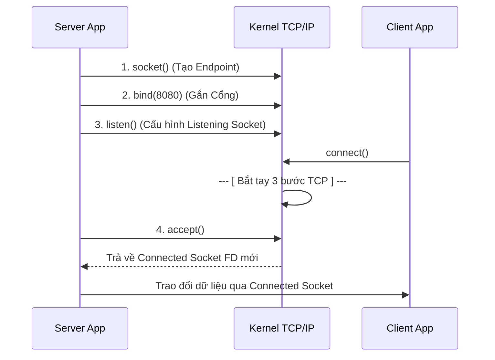
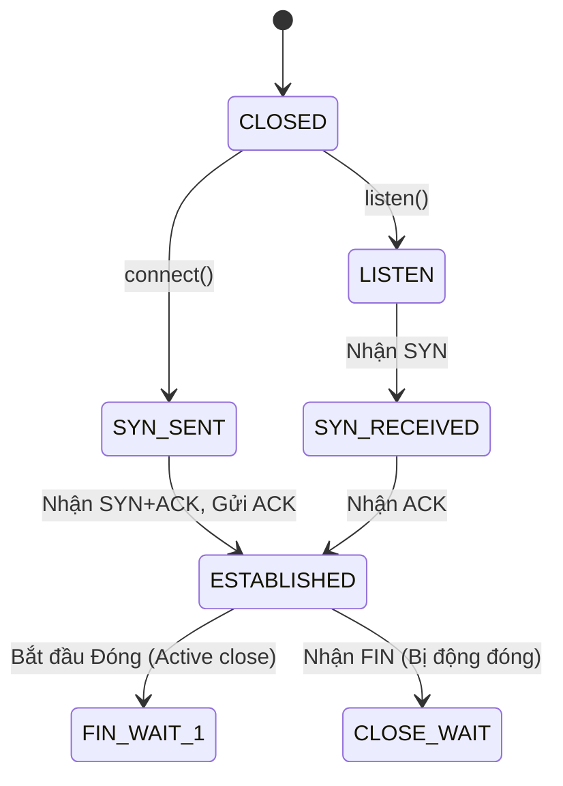

# Chủ đề 9 — Socket Programming trong Linux

> **Mục tiêu:** Hiểu bản chất Socket là gì; cách thức TCP Server/Client hình thành kết nối; sự khác biệt cốt lõi về mặt dữ liệu giữa TCP (luồng) và UDP (gói tin); cấu trúc địa chỉ `sockaddr` cùng khái niệm `network byte order`; và thấu hiểu cách một kết nối đóng lại chuẩn mực ở cấp độ giao thức.
>
> **Quy ước ngôn ngữ:** Phần giải thích dùng Tiếng Việt. Giữ nguyên các thuật ngữ mạng/socket chuẩn để dễ tra cứu quốc tế: `socket`, `server`, `client`, `endpoint`, `address family`, `socket address`, `network byte order`, `byte stream`, `datagram`, `message framing`, `backpressure`, `partial I/O`, `half-close`, `orderly shutdown` cùng tên các API, giao thức, cấu trúc, trạng thái TCP và mã lỗi.
>
> **Phạm vi:** Các khái niệm cơ sở: API Socket, `address family`, kiểu/giao thức, địa chỉ IP, Cổng (Port), kiến trúc Byte order, hàm phân giải tên miền `getaddrinfo()`. Sự khác biệt TCP/UDP. Vòng đời TCP Server/Client, quá trình bắt tay (Handshake), bản chất `byte stream` và bài toán `message framing`, `partial I/O`. Đóng kết nối an toàn (Graceful shutdown). Ngữ nghĩa UDP Datagram và Unix Domain Socket.
>
> Chương này là **lý thuyết nền tảng** chuẩn bị cho lập trình mạng. Không có bài thực hành. Các cơ chế nâng cao như `O_NONBLOCK`, `select()`, `poll()`, `epoll()` và vòng lặp sự kiện (Event loop) sẽ thuộc **Chủ đề 10**.

Socket là điểm chạm giao tiếp do Kernel quản lý. Khi tạo một Socket, ứng dụng phải khai báo ba tham số cốt lõi: **Họ địa chỉ (Domain/Address family)**, **Kiểu truyền tải (Type)**, và **Giao thức (Protocol)**. Sau đó, Socket sẽ được gán một địa chỉ cục bộ hoặc kết nối tới một đầu cuối (`endpoint`) phụ thuộc vào vai trò của ứng dụng. 

Chương này sẽ đi theo vòng đời của một luồng mạng: từ lúc tạo `socket()`, gán tọa độ, thiết lập trạng thái bằng chuỗi `bind() → listen() → accept()` hoặc `connect()`. Quan trọng nhất, bạn sẽ nhận ra một điểm cốt lõi trong lập trình mạng: TCP cung cấp một luồng dữ liệu (Byte Stream) không tự bảo toàn ranh giới thông điệp của ứng dụng, trái ngược với mô hình truyền từng gói tin nguyên vẹn (Datagram) của UDP.

---

## Mục lục

- [1. Socket Programming là gì?](#1-socket-programming-là-gì)
- [2. `address family`, kiểu và giao thức quyết định `socket` ra sao?](#2-address-family-kiểu-và-giao-thức-quyết-định-socket-ra-sao)
- [3. `socket` có `file descriptor` nhưng không phải tệp thông thường](#3-socket-có-file-descriptor-nhưng-không-phải-tệp-thông-thường)
- [4. `socket address` và `sockaddr`](#4-socket-address-và-sockaddr)
- [5. `network byte order`: vì sao phải đổi `byte order`?](#5-network-byte-order-vì-sao-phải-đổi-byte-order)
- [6. `getaddrinfo()`: từ tên máy tới `socket address`](#6-getaddrinfo-từ-tên-máy-tới-socket-address)
- [7. Địa chỉ IP, cổng và `endpoint`](#7-địa-chỉ-ip-cổng-và-endpoint)
- [8. `bind()`: chọn địa chỉ và cổng cục bộ](#8-bind-chọn-địa-chỉ-và-cổng-cục-bộ)
- [9. TCP và UDP khác nhau ở mô hình dữ liệu nào?](#9-tcp-và-udp-khác-nhau-ở-mô-hình-dữ-liệu-nào)
- [10. TCP `server`: `socket → bind → listen → accept`](#10-tcp-server-socket--bind--listen--accept)
- [11. TCP `client`: `socket → connect`](#11-tcp-client-socket--connect)
- [12. Bắt tay TCP và các trạng thái quan trọng](#12-bắt-tay-tcp-và-các-trạng-thái-quan-trọng)
- [13. TCP là `byte stream`: ứng dụng phải tự chia thông điệp](#13-tcp-là-byte-stream-ứng-dụng-phải-tự-chia-thông-điệp)
- [14. Bộ đệm, `backpressure` và `partial I/O` trong TCP](#14-bộ-đệm-backpressure-và-partial-io-trong-tcp)
- [15. Đóng TCP đúng cách: `shutdown()`, FIN, RST và `TIME_WAIT`](#15-đóng-tcp-đúng-cách-shutdown-fin-rst-và-time_wait)
- [16. UDP: mỗi lần gửi là một `datagram`](#16-udp-mỗi-lần-gửi-là-một-datagram)
- [17. UDP `bind()`, `connect()`, `sendto()` và `recvfrom()`](#17-udp-bind-connect-sendto-và-recvfrom)
- [18. `send()` và `recv()`: API truyền nhận dữ liệu cơ bản](#18-send-và-recv-api-truyền-nhận-dữ-liệu-cơ-bản)
- [19. Unix Domain Socket: cùng API nhưng giao tiếp cục bộ](#19-unix-domain-socket-cùng-api-nhưng-giao-tiếp-cục-bộ)
- [20. Tư duy gỡ lỗi Socket theo từng lớp](#20-tư-duy-gỡ-lỗi-socket-theo-từng-lớp)
- [21. Liên hệ với Embedded Linux](#21-liên-hệ-với-embedded-linux)
- [22. Tổng kết và mô hình tư duy](#22-tổng-kết-và-mô-hình-tư-duy)
- [23. Tài liệu tham khảo](#23-tài-liệu-tham-khảo)

---

## 1. Socket Programming là gì?

Socket là giao diện nối liền ứng dụng Userspace với mạng truyền thông (hoặc hệ thống IPC nội bộ) được quản lý bởi Linux Kernel.

### 1.1 Socket nằm ở đâu trong hệ thống?

```text
[ Ứng dụng (Trình duyệt Web, Game) ]
                 |
        [ API Socket Chuẩn ]
                 |
[ Socket Object (Được Kernel quản lý) ]
                 |
   +-------------+-------------+
   |             |             |
 [ TCP ]      [ UDP ]  [ Unix Domain Socket ]
   |             |
   +------+------+
          |
        [ IP ] (Định tuyến mạng)
          |
    [ Card Mạng vật lý (NIC) ]
```

> **Đọc sơ đồ:** Ứng dụng thao tác với mạng thông qua Socket API. Tùy vào cấu hình, Socket sẽ chuyển giao dữ liệu xuống các giao thức tương ứng (TCP, UDP) và các tầng mạng bên dưới do Kernel thực hiện. Việc hàm gửi (send) trả về báo cáo thành công thường chỉ mang ý nghĩa Kernel đã chấp nhận dữ liệu vào bộ đệm của nó; nó không chứng minh ứng dụng phía đích đã thực sự nhận hoặc xử lý dữ liệu đó.

### 1.2 Socket là một Đầu cuối (`endpoint`)

Giao tiếp mạng diễn ra giữa các đầu cuối:
```text
[ Ứng dụng A ]                        [ Ứng dụng B ]
      |                                      |
[ Socket (Đầu cuối A) ] ========> [ Socket (Đầu cuối B) ]
```
Socket đóng vai trò là một `endpoint` (điểm cuối giao tiếp). Đối với TCP, hai endpoint tạo thành một luồng truyền tải hai chiều có kết nối. Đối với UDP, một socket có thể được dùng để trao đổi các gói tin với nhiều endpoint khác nhau tùy thuộc vào thiết kế của ứng dụng.

### 1.3 Lập trình Socket không chỉ là gọi TCP/UDP

Socket là một **Bộ giao diện API dùng chung**.
Cùng một bộ hàm C `socket()`, `bind()`, `read()`, `write()`, bạn có thể dùng để:
*   Giao tiếp mạng có kết nối (TCP/IP).
*   Giao tiếp mạng không kết nối (UDP).
*   Giao tiếp IPC nội bộ giữa các tiến trình trên cùng hệ điều hành (Unix Domain Socket - UDS).

### 1.4 `client` và `server` là vai trò, không phải là loại Socket

Không có các định nghĩa kiểu như `SOCK_CLIENT` hay `SOCK_SERVER` lúc tạo Socket.
Vai trò được hình thành thông qua **chuỗi hành vi** của ứng dụng:

*   **TCP Server:** Chủ động gắn với một địa chỉ/cổng và chờ kết nối. 
    Chuỗi gọi hàm: `socket` -> `bind` -> `listen` -> `accept`.
*   **TCP Client:** Chủ động kết nối tới một máy chủ. 
    Chuỗi gọi hàm: `socket` -> `connect`.

*(Sau khi thiết lập kết nối xong, cả hai phía đều sở hữu một socket đã kết nối và đều có thể gọi `send`/`recv` một cách bình đẳng)*.

---

## 2. `address family`, kiểu và giao thức quyết định `socket` ra sao?

Khi tạo một Socket qua hàm `socket(domain, type, protocol)`, bạn cung cấp 3 tham số để xác định ngữ nghĩa của kênh giao tiếp.

### 2.1 Ba thành phần phân loại

*   `domain` (Họ địa chỉ / Address Family): Giao tiếp bằng không gian tên (namespace) nào? (IPv4, IPv6, hay Local/Unix)?
*   `type` (Kiểu truyền tải): Truyền dữ liệu dưới dạng luồng (`stream`) hay từng gói độc lập (`datagram`)?
*   `protocol` (Giao thức): Tên cụ thể của giao thức là gì (nếu có nhiều lựa chọn)?

### 2.2 Các `Address Family` phổ biến (Domain)

*   `AF_INET`: Dành cho mạng Internet IPv4. Sử dụng địa chỉ IP (Vd: `192.168.1.5`) và Cổng (16 bit).
*   `AF_INET6`: Dành cho mạng Internet IPv6. Sử dụng địa chỉ 128 bit kèm một số trường đặc tả ngữ cảnh mạng (scope).
*   `AF_UNIX` (hay `AF_LOCAL`): Dành cho IPC nội bộ trên cùng hệ thống, thường sử dụng đường dẫn file (pathname) hoặc abstract namespace làm "địa chỉ".

### 2.3 Các Kiểu truyền tải (Type)

*   `SOCK_STREAM`: Mô hình luồng dữ liệu 2 chiều, đảm bảo thứ tự.
*   `SOCK_DGRAM`: Mô hình giữ nguyên ranh giới từng gói tin (datagram).

### 2.4 Tham số `protocol = 0` nghĩa là gì?

Thường lập trình viên truyền số `0` ở tham số thứ 3. Ý nghĩa là yêu cầu Kernel tự chọn giao thức mặc định phù hợp với cặp Domain + Type đã khai báo.
*   `AF_INET` + `SOCK_STREAM` + `0` --> Kernel chọn: **TCP**.
*   `AF_INET` + `SOCK_DGRAM`  + `0` --> Kernel chọn: **UDP**.

> Cần phải phân tích đồng thời cả 3 tham số. Không nên tự động kết luận "`SOCK_STREAM` thì 100% là TCP", vì `SOCK_STREAM` kết hợp với `AF_UNIX` sẽ trở thành một kênh IPC cục bộ dựa trên byte stream.

---

## 3. `socket` có `file descriptor` nhưng không phải tệp thông thường

Mọi Socket sau khi khởi tạo thành công đều trả về một bộ mô tả tệp (`file descriptor` - `fd`). Điều này cho phép ứng dụng sử dụng các hàm I/O tiêu chuẩn của UNIX.

### 3.1 Sự đồng nhất qua `fd`

Giả sử `socket()` trả về `fd = 7`. Trong bảng file descriptor của tiến trình:
```text
fd 0 -> stdin
fd 1 -> stdout
fd 3 -> tệp thông thường
fd 7 -> socket
```
Số `fd` chỉ là một mã quản lý (handle) ở không gian ứng dụng. Khi gọi các hàm chung như `read()`, `write()`, `close()`, Kernel sẽ dựa vào đối tượng thực sự mà `fd` tham chiếu để thực hiện hành động thích hợp.

### 3.2 Lăng kính Kernel

```text
    (Ứng dụng)
    fd = 7
       |
       v
[ Open file description ]
       |
       v
[ Kernel Socket Object ]
       |
       +---> Trạng thái TCP / UDP / Unix Domain Socket
       +---> Bộ đệm gửi / nhận
       +---> Địa chỉ Endpoint
```

Socket là một cấu trúc dữ liệu nội bộ trên RAM, lưu trữ toàn bộ trạng thái của một kết nối mạng. Vì `fd` trỏ qua cấu trúc quản lý chung, nếu bạn dùng `dup()` hoặc `fork()`, nhiều `fd` (của một hay nhiều tiến trình) có thể cùng trỏ về một Kernel Socket Object. Do đó, việc gọi `close()` trên một `fd` chưa chắc đã đóng hoàn toàn kết nối nếu vẫn còn các tham chiếu (references) khác.

### 3.3 Socket không hỗ trợ mọi thao tác của Tệp

Dù dùng chung API `read/write`, bạn không thể coi Internet Socket như tệp lưu trữ trên đĩa. Đặc biệt, nó không có khái niệm "vị trí con trỏ tệp" (file offset), do đó bạn không thể gọi lệnh `lseek()` trên một socket để tua lại luồng dữ liệu.

---

## 4. `socket address` và `sockaddr`

Giống như gửi thư cần có địa chỉ nhà, giao tiếp mạng yêu cầu ứng dụng chỉ định địa chỉ (Socket Address).

### 4.1 Cấu trúc Địa chỉ tổng quát

Vì API Socket dùng chung cho nhiều `address family` (IPv4, IPv6, Unix Domain), hệ thống sử dụng một cấu trúc dữ liệu tổng quát là `struct sockaddr` tại giao diện API. 
Lập trình viên thường khởi tạo các cấu trúc đặc thù (như `sockaddr_in`), sau đó ép kiểu con trỏ về `struct sockaddr*` khi gọi hàm.

### 4.2 Cấu trúc IPv4: `sockaddr_in`

```text
[ struct sockaddr_in ]
  |
  +--> sin_family = AF_INET (Định dạng IPv4)
  |
  +--> sin_port = 8080      (Cổng giao vận)
  |
  +--> sin_addr = 1.1.1.1   (Địa chỉ IPv4 - Dạng nhị phân)
```
> Các trường này gộp lại để tạo thành một endpoint duy nhất; Cổng và IP không hoạt động rời rạc.

### 4.3 Cấu trúc IPv6: `sockaddr_in6`

```text
[ struct sockaddr_in6 ]
  |
  +--> sin6_family = AF_INET6
  +--> sin6_port = 443
  +--> sin6_addr = (Địa chỉ IPv6)
  +--> sin6_scope_id (Hỗ trợ định tuyến các dải IPv6 có phạm vi cục bộ)
```

### 4.4 Kích thước động và biến `socklen_t`

Do kích thước cấu trúc của từng `address family` là khác nhau, các API socket yêu cầu bạn phải truyền kèm kích thước cấu trúc địa chỉ thông qua kiểu `socklen_t` để đảm bảo Kernel phân giải đúng độ dài vùng nhớ.

---

## 5. `network byte order`: vì sao phải đổi `byte order`?

Các hệ thống máy tính có kiến trúc vi xử lý khác nhau có thể lưu trữ các số nguyên nhiều byte theo các thứ tự khác nhau. Việc truyền dữ liệu thô (raw bytes) giữa các kiến trúc này mà không có quy ước chung sẽ dẫn đến sai lệch dữ liệu.

### 5.1 Thế chiến giữa Little-endian và Big-endian

Giá trị 16-bit `0x1234` có thể được lưu trữ trên RAM:
*   Kiểu **Little-endian** (thường thấy trên chip x86): Dạng `34 12`.
*   Kiểu **Big-endian** (một số dòng chip mạng/nhúng): Dạng `12 34`.

### 5.2 Ngôn ngữ ngoại giao: `Network Byte Order`

Các giao thức Internet quy định một số trường cấu trúc nhiều byte (như Port, IP address dạng số) bắt buộc phải sử dụng **Network Byte Order**, tương đương với thứ tự **Big-endian**. 

### 5.3 Các hàm chuyển đổi kinh điển

Ứng dụng cung cấp các hàm dịch thuật để đồng bộ hóa `byte order`:
*   `htons()` (Host To Network Short): Chuyển số nguyên 16-bit (như Port) từ kiến trúc máy sang chuẩn Mạng.
*   `htonl()` (Host To Network Long): Chuyển số nguyên 32-bit từ kiến trúc máy sang chuẩn Mạng.
*   `ntohs()`: Dịch ngược từ Mạng về Máy (16-bit).
*   `ntohl()`: Dịch ngược từ Mạng về Máy (32-bit).

*(Chỉ nên chuyển đổi khi cần thao tác với các trường đặc tả trên giao thức mạng, và đảm bảo không gọi hàm chuyển đổi hai lần lên cùng một giá trị).*

### 5.4 Chuyển đổi IP dạng Văn bản (Human-readable)

Con người đọc IP dạng chữ: `"192.168.1.10"`. Máy tính xử lý dạng số nhị phân (Binary).
*   `inet_pton()` (Presentation to Network): Chuyển IP dạng văn bản thành định dạng mã nhị phân cấu trúc mạng.
*   `inet_ntop()` (Network to Presentation): Phiên dịch ngược lại từ dạng mã nhị phân mạng ra chuỗi IP.

---

## 6. `getaddrinfo()`: từ tên máy tới `socket address`

Hàm `getaddrinfo()` giúp phân giải tên miền và tên dịch vụ thành danh sách các địa chỉ socket hợp lệ, tự động tương thích với cả IPv4 và IPv6.

### 6.1 Cơ chế hoạt động của `getaddrinfo()`

```text
  [ Tên miền + Dịch vụ (vd: 443/https) + Gợi ý (Hints) ]
             |
             v
       [ getaddrinfo() ]
             |
             v
  [ Danh sách các cấu trúc Tọa độ ứng viên phù hợp ]
     |
     +--> Ứng viên 1: (IPv6, TCP, Port 443, Dạng nhị phân)
     +--> Ứng viên 2: (IPv4, TCP, Port 443, Dạng nhị phân)
```

### 6.2 Phân giải đa cấu trúc (AF_UNSPEC)

Khi sử dụng cờ `AF_UNSPEC` trong thuộc tính Gợi ý (Hints), hàm sẽ trả về tất cả các ứng viên phù hợp (bao gồm cả IPv4 và IPv6). Thiết kế Client chuẩn mực sẽ lặp qua danh sách này, liên tục thử gọi `socket()` và `connect()` cho tới khi có một kết nối thành công, giúp code ít bị phụ thuộc cứng vào riêng hệ IPv4.

### 6.3 Phân giải địa chỉ dành cho Server

Khi tạo Server, việc thiết lập cờ `AI_PASSIVE` trong Hints sẽ giúp `getaddrinfo()` khởi tạo cấu trúc địa chỉ đại diện cục bộ (như IP `0.0.0.0` hoặc `::`), để ứng dụng có thể truyền trực tiếp vào hàm `bind()` nhằm lắng nghe tất cả các giao diện mạng.

### 6.4 Phân giải thành công không đồng nghĩa kết nối thành công

Sự kiện `getaddrinfo()` trả về danh sách địa chỉ chỉ chứng tỏ việc phân giải tên miền/dịch vụ hoàn tất. Nó không chứng minh đường mạng đang thông, máy chủ từ xa đang bật hay cổng đang mở. Các bước tiếp cận kết nối thực tế phụ thuộc vào lời gọi `connect()` sau đó.

---

## 7. Địa chỉ IP, cổng và `endpoint`

Một kết nối mạng được định hình bởi tập hợp các tọa độ gọi là Endpoint.

### 7.1 Lãnh thổ của IP và Port

Về cơ bản: 
*   **Địa chỉ IP:** Chỉ định giao diện mạng hoặc thiết bị máy chủ nào sẽ nhận gói tin.
*   **Cổng (Port):** Quyết định dịch vụ giao vận (process/service) nào trên thiết bị đó sẽ xử lý gói tin.

### 7.2 Không gian độc lập của Cổng

Cổng (Port) là một giá trị 16-bit (từ `0` đến `65535`).
Không gian cổng TCP và UDP là độc lập. Cổng `TCP 5000` và `UDP 5000` trên cùng một máy là hai `endpoint` hoàn toàn khác nhau.

### 7.3 Bộ tứ Quyền lực (4-Tuple TCP Endpoint)

Một kết nối TCP (TCP connection) đầy đủ được hệ điều hành phân biệt duy nhất thông qua **Định danh 4 điểm (4-tuple)**:
```text
1. Địa chỉ IP Cục bộ.
2. Cổng Cục bộ.
3. Địa chỉ IP Đối tác (Remote).
4. Cổng Đối tác.
```

### 7.4 Làm sao một Server cổng 80 phục vụ nhiều người?

Nhiều Client có thể cùng lúc kết nối tới một Server tại cùng địa chỉ IP và Cổng 80:
```text
(Connection 1): Server IP X : Port 80 <=====> Client IP A : Port 44215
(Connection 2): Server IP X : Port 80 <=====> Client IP B : Port 19022
(Connection 3): Server IP X : Port 80 <=====> Client IP A : Port 56000
```
Mặc dù Server chỉ dùng cổng 80, nhưng do 4-tuple của mỗi kết nối đều khác biệt (nhờ sự khác nhau ở thông tin Client IP/Port), Kernel vẫn quản lý và phân biệt chúng như các luồng dữ liệu độc lập.

---

## 8. `bind()`: chọn địa chỉ và cổng cục bộ

Lệnh `bind()` gán một cấu trúc địa chỉ Socket (IP + Cổng) cụ thể vào một Socket.

### 8.1 Gán tọa độ cục bộ

```text
  [ Khởi tạo socket() -> Socket vô danh (unbound) ]
                 |
  [ Gọi bind(Local Address) ]
                 |
                 v
  [ Socket đã có Local Endpoint ]
```

### 8.2 Khi nào dùng `bind()`?

**Server thường xuyên phải `bind()`**. Server cần một Endpoint ổn định (như Cổng 80) để các Client biết chính xác địa chỉ mà gửi yêu cầu tới.

**Client hiếm khi cần tự `bind()`**. Nếu Client không gọi `bind()`, Kernel sẽ tự động lựa chọn một IP nguồn hợp lệ và cấp một Cổng tạm thời (`ephemeral port`) ngay khi Client phát sinh truy cập truyền/kết nối.

### 8.3 Cổng `0` và Cờ thu gom (Wildcard)

*   **Cổng (Port) `0`:** Yêu cầu Kernel tự lựa chọn một cổng trống khả dụng từ dải cổng tạm thời (ephemeral ports) của hệ thống.
*   **Địa chỉ `0.0.0.0` (INADDR_ANY):** Đây là địa chỉ `wildcard`, báo cho Kernel rằng Socket này muốn lắng nghe yêu cầu đến từ mọi giao diện mạng hiện có trên thiết bị, thay vì chỉ dính chặt vào một địa chỉ IP LAN duy nhất.

### 8.4 Giải mã lỗi `bind()`

*   **`EADDRINUSE`:** Cho biết sự kết hợp Địa chỉ/Cổng bạn đang cố gán không thể khả dụng ở trạng thái hiện tại. (Có thể do một tiến trình khác đang giữ cổng, hoặc Socket cũ đang ở trạng thái TCP ngầm như `TIME_WAIT`).
*   **`EADDRNOTAVAIL`:** Địa chỉ IP yêu cầu không thuộc bất kỳ không gian mạng cục bộ nào mà máy tính đang quản lý.

---

## 9. TCP và UDP khác nhau ở mô hình dữ liệu nào?

Để vận dụng mạng tốt, cần hiểu sự khác biệt cơ bản giữa TCP và UDP, không chỉ dừng ở tính "Đáng tin cậy/Nhanh".

| Đặc trưng cốt lõi | TCP (`SOCK_STREAM`) | UDP (`SOCK_DGRAM`) |
| :--- | :--- | :--- |
| **Bản chất truyền** | Thiết lập kết nối (Connection-oriented) | Đẩy các gói Datagram độc lập. Không cần TCP handshake. |
| **Mô hình Dữ liệu** | Luồng dữ liệu (Byte stream). Không bảo lưu ranh giới thông điệp. | Từng gói tin nguyên vẹn, giữ ranh giới đóng gói. |
| **Thứ tự & Tin cậy**| Cung cấp truyền dẫn đáng tin cậy, bảo toàn thứ tự byte trong luồng. | Dữ liệu có thể rớt, bị lặp, đến sai thứ tự. Ứng dụng phải tự chịu trách nhiệm nếu cần xử lý. |
| **Quản trị tắc nghẽn** | Có cơ chế Flow control và Congestion control. | Không tự có. Đẩy dữ liệu quá nhanh có thể gây quá tải mạng, ứng dụng UDP cần tuân thủ giao thức điều tiết của riêng mình. |

> **Lưu ý:** Việc TCP đánh dấu truyền thành công chỉ chứng tỏ dữ liệu được tiếp nhận ở mức giao vận (Transport layer). Nó không chứng minh logic nghiệp vụ ở ứng dụng đối tác (Ví dụ: lưu database, chạy hàm thành công) đã hoàn tất.

---

## 10. TCP `server`: `socket → bind → listen → accept`

Vòng đời mẫu mực của một TCP Server.

### 10.1 Chuỗi hành động thiết lập



> **Đọc sơ đồ:**
> Hàm `listen()` biến Socket ban đầu thành một **Listening Socket**. Tại đây, Kernel tiếp nhận các yêu cầu kết nối tới cổng dịch vụ và đưa vào hàng chờ.
> Hàm `accept()` lôi kết nối đã hoàn thành bắt tay ra, và sinh ra một File Descriptor hoàn toàn mới: **Connected Socket**. 
> Việc đọc/ghi dữ liệu với Client đó sẽ diễn ra trên `Connected Socket` này. Socket Lắng nghe (Listening Socket) ban đầu vẫn tồn tại và không bị thay thế, sẵn sàng tiếp tục `accept` các yêu cầu của Client khác. 

### 10.2 Biến `backlog` trong `listen()`

Hàm `listen(fd, backlog)` thiết lập giới hạn cho **Hàng đợi các kết nối đã hoàn tất quá trình bắt tay TCP và đang chờ ứng dụng gọi lệnh `accept()`**. Nó không mô tả tổng số Client tối đa mà server phục vụ trong suốt vòng đời của mình.

---

## 11. TCP `client`: `socket → connect`

### 11.1 Chuỗi hành động kết nối

```text
  [ Tên miền / Tên Dịch vụ ]
        |
   getaddrinfo()  
        |
        v
    socket()      (Khởi tạo Endpoint)
        |
  connect(Server Address)  ---> Tiến trình cố gắng bắt tay TCP
        |
        v
[ Connected Socket ] ---> (Giao tiếp Dữ liệu)
```

Ở chế độ mặc định, lệnh `connect()` thực hiện "Mở chủ động" (Active open) và sẽ chặn luồng thực thi (Block) cho tới khi kết nối TCP với máy chủ thành công, hoặc gặp lỗi (như timeout, bị từ chối kết nối).

### 11.2 `connect()` chỉ là thành công ở tầng giao vận

Khi `connect()` không trả về lỗi, nó chỉ báo hiệu quá trình thiết lập kênh truyền tải TCP đã thành công. Nó không bảo đảm rằng tiến trình ứng dụng phía Máy chủ đã sẵn sàng phản hồi, phiên bản phần mềm khớp nhau, hay mật khẩu đăng nhập của bạn là đúng.

---

## 12. Bắt tay TCP và các trạng thái quan trọng

TCP hoạt động như một cỗ máy trạng thái (State Machine). 

### 12.1 Bắt tay 3 bước (Three-way Handshake)

```text
  [ Máy Khách (Active Open) ]             [ Máy Chủ (LISTEN) ]
       |                                           |
       | --- 1. [ Cờ SYN ] ----------------------> |
       |                                           |
       | <--- 2. [ Cờ SYN + Cờ ACK ] ------------- |
       |                                           |
       | --- 3. [ Cờ ACK ] ----------------------> |
       v                                           v
[ ESTABLISHED ]                             [ ESTABLISHED ]
```

Sự tương tác này đồng bộ hóa trạng thái sequence-number giữa hai thiết bị. Trong mô hình thông thường, sau khi cả hai chạm tới ngưỡng **`ESTABLISHED`**, luồng truyền tải byte mới sẵn sàng để ứng dụng thao tác.

### 12.2 Cỗ máy Trạng thái TCP Rút gọn



Sơ đồ giúp bạn hình dung các trạng thái xuất hiện khi gỡ lỗi thông qua lệnh `ss` hoặc `netstat`. 

---

## 13. TCP là `byte stream`: ứng dụng phải tự chia thông điệp

Đây là nguyên tắc quan trọng bậc nhất của TCP Socket: **TCP bảo toàn thứ tự các byte trong dòng dữ liệu, nhưng KHÔNG bảo toàn ranh giới của các lệnh gửi (send).**

### 13.1 Lầm tưởng của việc Gửi / Nhận 1:1

Bạn không được phép suy diễn "1 lệnh send() = 1 lệnh recv()".

Giả sử ứng dụng Server gọi lệnh Gửi:
```c
send(fd, "DATA_1", 6, 0); 
send(fd, "DATA_2", 6, 0); 
```
Client khi gọi hàm `recv()` có thể nhận thành:
```text
recv -> "DATA_1DATA_2" (Gộp chung)
```
Hoặc:
```text
recv lần 1 -> "DATA_"
recv lần 2 -> "1DATA_2" (Phân mảnh đứt gãy)
```

Cả hai cách nhận đều hợp lệ đối với TCP. TCP là dòng luồng byte, không phải là hệ thống đóng hộp văn bản. Do đó Receiver không được giả định rằng một thông điệp sẽ luôn đến nguyên vẹn trong một lần gọi `recv()`.

### 13.2 Phân khung Thông điệp (Message Framing)

Vì TCP không có khái niệm Thông điệp (Message), ứng dụng của bạn phải tự thiết kế một hệ quy ước (Protocol) để băm nhỏ luồng byte này ra.
Một trong các phương pháp phổ biến là **Length-Prefix Framing** (Chỉ định độ dài trước):

```text
[ Độ dài=6 | Dữ liệu=LENH_A ] [ Độ dài=6 | Dữ liệu=LENH_B ]
```
Ứng dụng phía thu sẽ thiết kế một bộ đệm vòng lặp:
1. Đọc đúng n-byte ban đầu để trích xuất Kích thước.
2. Vòng lặp liên tục gọi `recv()` cho tới khi thu thập đủ Kích thước byte Payload được công bố.
3. Bóc tách ra để xử lý, và tiếp tục lặp.

Quy tắc Framing này còn dùng làm biên ranh giới để kiểm tra bắt lỗi (nếu độ dài gửi tới là một con số phi thực tế).

---

## 14. Bộ đệm, `backpressure` và `partial I/O` trong TCP

Hiểu rõ hành vi trả về của hàm I/O.

### 14.1 Lệnh `send()` không bảo đảm Dữ liệu đã truyền đi

```text
[ App gọi send(100 byte) ] 
       |
       v
[ Kernel chấp nhận chép 100 byte vào TCP Send Buffer Nội bộ ]
       |
       |----> TCP lo việc phân đoạn, đàm phán, gửi sang mạng...
       v
[ Receive Buffer của máy Đích ] 
       |
       v
[ App Đích gọi recv() ] 
```

Khi lệnh `send()` trả về số lượng byte hợp lệ, điều đó chứng tỏ lớp TCP Stack cục bộ đã tiếp nhận tiến trình gửi. Nó không chứng minh phần mềm đích đã thực sự nhận hoặc xử lý dữ liệu đó.

### 14.2 Partial I/O (Chỉ xử lý một phần)

Thao tác Stream I/O có thể xử lý ít dữ liệu hơn mức bạn yêu cầu:
*   **`send()` bị thiếu:** Cố gửi 4000 byte, nhưng `send` trả về `1500`. Ở chế độ chặn (blocking), hệ thống có thể chờ thêm để nạp phần còn lại, nhưng nhiều yếu tố vẫn có thể khiến hàm trả về kết quả chưa trọn vẹn. Lập trình viên phải duy trì một vòng lặp để tiếp tục gửi phần còn thiếu dựa trên số byte trả về thực tế.
*   **`recv()` bị thiếu:** Đòi rút 4000 byte, nhưng `recv` trả về `100`. Lý do: Mạng mới chỉ tải về kịp được 100 byte nằm trên đệm Receive Buffer, hàm trả ra dữ liệu ngay thay vì bắt ứng dụng đứng chờ. Lại cần dùng vòng lặp để thu thập.

### 14.3 EOF trên TCP Stream: `recv() == 0`

Khi lệnh `recv()` trả về con số `0`, đây là trạng thái báo hiệu sự kết thúc.
Ngữ nghĩa: **Toàn bộ dữ liệu tồn đọng trong luồng đã được ứng dụng đọc sạch, và thiết bị đối tác (Peer) đã thực hiện quy trình đóng van gửi một cách có trật tự (Gửi cờ FIN). Không còn byte mới nào xuất hiện trên chiều kết nối này nữa.**
> Lưu ý: Điều này khác biệt hoàn toàn với "nhận một gói tin TCP có payload độ dài 0".

### 14.4 Backpressure do Bộ đệm hữu hạn

Nếu tiến trình gửi bơm dữ liệu nhanh hơn tốc độ tiêu thụ/xử lý của đối tác, Send Buffer cục bộ dần bị lấp đầy. Lúc này, lệnh `send()` sẽ chuyển sang ngủ chờ không gian trống (trong chế độ chặn), hoặc báo lỗi chưa sẵn sàng (trong chế độ không chặn). Đây là cơ chế điều tiết tự nhiên của mạng.

---

## 15. Đóng TCP đúng cách: `shutdown()`, FIN, RST và `TIME_WAIT`

Mạng TCP là giao thức hai chiều toàn phần (Full-duplex).

### 15.1 Hàm `shutdown()` khác `close()`

*   `shutdown()`: Giao tiếp với Kernel để điều khiển hướng của luồng mạng. (Ngừng gửi `SHUT_WR`, Ngừng nhận `SHUT_RD` hoặc Ngừng cả hai). 
*   `close()`: Giải phóng `file descriptor` ở cấp độ Tiến trình. Nếu FD này có nhiều bản sao (qua lệnh `fork` / `dup`), một lệnh `close` không nhất thiết kích hoạt ngay việc phá hủy kết nối TCP phía dưới.

### 15.2 Đóng Bán Khép Kín (Half-close)

Hàm `shutdown(fd, SHUT_WR)` làm thay đổi trạng thái giao thức. Khẳng định với nội bộ TCP stack rằng ứng dụng sẽ không gửi thêm byte nào nữa. Kernel sẽ gửi cờ `FIN` thực hiện quy trình `orderly shutdown` hướng gửi. 
Tuy nhiên, chiều nhận dữ liệu từ đối tác vẫn tồn tại (Half-close). Bạn vẫn có thể tiếp tục `recv()` phản hồi. Mô hình này rất hữu hiệu khi EOF được dùng làm mốc kết thúc Request nhưng Response vẫn đi ngược về sau đó.

### 15.3 `CLOSE_WAIT`

Khi trạng thái mạng xuất hiện cờ `CLOSE_WAIT`, điều đó có nghĩa: Hệ thống đã nhận được cờ `FIN` từ Đối tác, nhưng tiến trình ứng dụng cục bộ chưa tiến hành xử lý vòng đời kết nối và chưa chịu gọi hàm `close()` phía mình. Nếu trạng thái này dồn ứ nhiều, đó là biểu hiện ứng dụng của bạn quản lý tài nguyên/FD tồi.

### 15.4 Cạm bẫy `TIME_WAIT`

Phía máy chủ thực hiện việc chủ động cắt cầu (Active close) thường đi qua trạng thái `TIME_WAIT`. Đây là trạng thái bình thường của TCP nhằm đảm bảo tính toàn vẹn của kết nối khi phải đối mặt với các gói tin lạc hậu đi muộn trên mạng và việc xử lý gói ACK cuối cùng.
Có nhiều `TIME_WAIT` không tự động đồng nghĩa với việc rò rỉ Socket (Leak fd). 

### 15.5 Tín hiệu ngắt: `RST`

Cờ `RST` là thao tác ngắt kết nối cưỡng bức/bất thường, thay vì quy trình Đóng trật tự (Orderly shutdown) của `FIN`. Trong code, ứng dụng cần phải phân biệt trạng thái EOF đàng hoàng (nhận trả về `0`) và lỗi Reset ép buộc (như lỗi `ECONNRESET`) vì ngữ nghĩa của dữ liệu tại thời điểm đó là khác biệt.

---

## 16. UDP: mỗi lần gửi là một `datagram`

UDP không quản lý theo byte. Nó gửi các gói tin (Datagram) đóng gói độc lập.

### 16.1 Ranh giới bảo toàn

*   Sender ném: Datagram A, Datagram B.
*   Receiver khi gọi lệnh `recv` sẽ bóc ra được đúng gói A và B rời rạc (nếu không có sự cố mạng). UDP giữ ranh giới đóng gói, Kernel không ghép các Datagram thành một dòng `byte stream` như TCP. 

### 16.2 Giao dịch Không Kết nối

Sender UDP không cần gọi:
```text
SYN -> SYN/ACK -> ACK
```
Bất kỳ lúc nào, nó cũng có thể ném một gói tin lên mạng. Đổi lại sự linh hoạt này, bạn không nhận được các bảo đảm về việc kết nối mạng đã thiết lập, việc truyền lại nếu thất lạc (Retransmission) hay tự động sắp xếp thứ tự như TCP.

### 16.3 Thiếu độ tin cậy

Một Datagram có thể: tới đích, bị rơi mất dọc đường, tới đích lặp lại hai lần, hoặc chạy chậm và tới sau một Datagram gửi sau.
Nếu ứng dụng chọn UDP nhưng lại yêu cầu tính Toàn vẹn dữ liệu, giao thức tầng Ứng dụng phải TỰ MÌNH chắp vá: Tự thiết kế hệ số Sequence, mã Timeout, và Retries.

### 16.4 Kiểm soát tắc nghẽn ở Không gian UDP

UDP không tự phanh lại khi mạng nghẽn (`Congestion control`) như TCP. Việc gửi dữ liệu ào ạt không kiểm soát có thể gây tắc nghẽn nghiêm trọng cho hạ tầng mạng. Theo RFC 8085, ứng dụng UDP cần tuân thủ cơ chế/chính sách kiểm soát tắc nghẽn phù hợp do chính ứng dụng đó triển khai.

---

## 17. UDP `bind()`, `connect()`, `sendto()` và `recvfrom()`

Dù không bắt tay mạng, API của UDP vẫn hỗ trợ một số thiết lập luồng đi.

### 17.1 UDP Server thường sử dụng `bind()`

```text
socket(SOCK_DGRAM)
      |
bind(Local Port)
      |
      v
recvfrom() / sendto()
```

UDP Server sẽ `bind` vào một Cổng cục bộ để đón các gói tin bay tới. Nó không có lệnh `listen()` hay đẻ ra FD nhánh mới (`accept()`). Một Socket UDP đã gắn Cổng có thể giao tiếp đồng thời với vô số đối tác khác nhau.

### 17.2 Sự đa năng của `sendto()` và `recvfrom()`

*   `sendto()`: Gửi gói tin đi, luôn đính kèm địa chỉ Tọa độ Đích (IP:Port) trên mỗi lệnh gọi. Cho phép một UDP socket gửi datagram tới các đích khác nhau.
*   `recvfrom()`: Hứng gói tin tới. Ngoài Payload dữ liệu, hàm này bóc ra được luôn cả Địa chỉ Nguồn của gói tin đó. Đây là cơ sở bắt buộc để Server UDP biết địa chỉ truy vết nhằm gửi phản hồi.

### 17.3 Sức mạnh Lệnh `connect()` trong UDP

Bạn hoàn toàn có quyền gọi `connect()` lên một UDP Socket. Nhưng:
Lệnh `connect()` ở đây KHÔNG HỀ phát sóng lên Internet để bắt tay kết nối như TCP. Nó thực hiện các thao tác quản lý dưới Kernel:
1. Thiết lập Cấu hình Đích Mặc định (Default Destination).
2. Cho phép Kernel gắn/lọc liên kết nhận, bỏ qua mọi gói tin không thuộc về Đối tác này.
3. Cho phép bạn gọi `send()` và `recv()` mượt mà.
4. Giúp báo lỗi ICMP bất đồng bộ trên hệ thống Linux rõ ràng hơn đối với Socket cụ thể đó.

*(Tất nhiên, cấu hình kiểu này không mang lại bất cứ tính an toàn nào của luồng TCP, nó vẫn là UDP).*

---

## 18. `send()` và `recv()`: API truyền nhận dữ liệu cơ bản

Lựa chọn cặp hàm giao tiếp tùy thuộc vào Trạng thái của Socket.

### 18.1 Nhóm Truyền: `send()` vs `sendto()`

*   Dùng `send()`: Phù hợp khi Socket đã xác định được Điểm đích (Peer). Ví dụ: TCP Connected socket hoặc UDP Socket đã chạy qua lệnh `connect()`.
*   Dùng `sendto()`: Chuyên dùng để linh hoạt gửi mỗi Datagram cho một máy chủ đích độc lập thông qua một UDP Socket thuần.

### 18.2 Lưu ý kích thước Datagram của `recvfrom()`

Nếu kích thước Datagram gửi tới lớn hơn vùng đệm (buffer) mà bạn khai báo trong lệnh `recv()`/`recvfrom()` của UDP:
Với TCP, phần dữ liệu còn lại nằm yên đó để bạn đọc ở vòng lặp sau.
Với UDP, phần Byte bị vượt ngưỡng (tràn buffer) **có thể bị loại bỏ vĩnh viễn** khỏi luồng do mỗi Datagram luôn đóng ranh giới riêng biệt. Lỗi cắt cụt (Truncation) sẽ xảy ra.

---

## 19. Unix Domain Socket: cùng API nhưng giao tiếp cục bộ

Lập trình Mạng nhưng không cần ra khỏi Máy.

### 19.1 IPC qua mô hình Socket

Socket API không chỉ dành cho mạng diện rộng (Internet). Bằng cách đổi Hệ quy chiếu (Address Family) sang `AF_UNIX` (hay `AF_LOCAL`), hệ điều hành biến bộ API này thành công cụ Giao tiếp Liên Tiến Trình (IPC) tốc độ cực đỉnh dành riêng cho nội bộ 1 máy tính duy nhất.

### 19.2 Tính tương đồng nhưng Bản chất khác biệt

Mô hình thiết lập TCP Server: `socket(AF_UNIX) -> bind -> listen -> accept`.
Tọa độ định tuyến của nó không phải là IP/Port, mà là một tệp (hoặc abstract namespace) trên hệ thống tệp, ví dụ: `/tmp/db_engine.sock`.

> Cùng bộ API, nhưng AF_UNIX khác AF_INET ở không gian tên địa chỉ, tính giới hạn trong nội bộ thiết bị (local-only), khả năng xác thực quyền (credentials/permissions) và cơ chế truyền tải của Kernel. Unix Domain Socket giúp bạn thiết kế giao thức linh hoạt mà không mở ranh giới phơi bày mạng.

---

## 20. Tư duy gỡ lỗi Socket theo từng lớp

Khi gỡ lỗi socket, hãy đi theo từng lớp: địa chỉ/cổng → trạng thái socket → TCP/UDP → I/O → giao thức ứng dụng. Đừng gom mọi triệu chứng thành một kết luận mờ mịt là “mạng hỏng”.

### 20.1 Lỗi do `bind()`: `EADDRINUSE` vs `EADDRNOTAVAIL`

*   **`EADDRINUSE` (Address in use):** Khả năng cao Cổng (Port) đã bị tiến trình khác chiếm dụng, hoặc Socket cũ đang ở trạng thái TCP ngầm như `TIME_WAIT`. (Cần cấu hình `SO_REUSEADDR` trước khi `bind` để tái sử dụng).
*   **`EADDRNOTAVAIL`:** Lỗi này xảy ra khi bạn ráng ghim (bind) một Tọa độ Địa chỉ IP không hề thuộc về Máy tính cục bộ (Namespace / Interface không đúng).

### 20.2 Lỗi do `connect()`: `ECONNREFUSED`

Nếu đập vào lệnh `connect()` mà trả lỗi `ECONNREFUSED` (Bị Từ Chối), đó là tin mừng! Lỗi này chứng tỏ: Gói tin của bạn đã chạm được đến địa phận của Máy chủ đích, Máy đích còn sống, NHƯNG nó không hề có phần mềm (Listening socket) nào đang chực chờ mở cửa ở đúng cái Cổng (Port) mà bạn gõ.

*(Phân biệt với lỗi Timeout: `ETIMEDOUT`. Xảy ra khi Máy đích sập nguồn, dứt cáp, hoặc bị Firewall chặn đứng gói tin giữa đường)*.

### 20.3 Hiện tượng Lệnh `accept()` Treo Vô Tận

Nghĩa là chưa có một Khách hàng nào đâm thủng được hàng đợi chờ của TCP. 
Hãy rà soát lại: Máy Khách đã gọi lệnh `connect()` chưa? Cổng Router có chặn Mạng tường lửa không? Hay có thể quá trình Bắt Tay 3 Bước (3-way handshake) còn dang dở?

### 20.4 Sự bùng phát Ngắt tín hiệu `EINTR`

Khi ứng dụng gọi các lệnh làm ngưng đọng luồng hệ thống (Blocking) như `read()`, `write()`, `accept()`, một Tín hiệu hệ thống (Signal ở Topic 05) có thể văng tới và ngắt ngang lệnh đó. Hàm mạng lúc này sẽ trả về lỗi `-1` kèm `errno = EINTR`. 
Lập trình viên CẦN PHÂN TÍCH kỹ ngữ nghĩa của lệnh: Không nên viết vòng lặp `while(retry)` gọi lại hàm mù quáng khi gặp `EINTR`. Bạn phải kiểm tra ngữ nghĩa xem liệu Signal đó có phải là Tín hiệu Tắt Server hay không, cũng như lưu tâm đến số lượng byte I/O đã chạy dở dang (Partial I/O).

---

## 21. Liên hệ với Embedded Linux

Không có một bo mạch IoT/Nhúng nào sống một mình. Nó sinh ra để đàm thoại với Vạn vật.

### 21.1 Thiết bị Nhúng đóng vai trò Client

Khi là một thiết bị gọi API lên Cloud. Vòng đời Client phải đối mặt với độ trễ (latency) và bất ổn hạ tầng:
Mất mạng WiFi / Ngắt mạng 4G? Hàm `getaddrinfo` Time-out. Lỗi Cáp bị tuột (Rớt kết nối)? Ứng dụng phải tự Code logic Back-off (Thử lại kết nối sau khoảng thời gian tăng dần, tránh đốt nóng CPU).

### 21.2 Nỗi ám ảnh Giới hạn Tài nguyên (Bounded Resources)

Mạch Nhúng (Ví dụ Camera IP) bị giới hạn khắt khe về RAM, Bộ đệm Socket, Số lượng Luồng và CPU.
Mỗi kết nối TCP đồng thời (Concurrent Connection) đều tiêu tốn một phần không gian lưu trữ trạng thái trong Linux Kernel. Việc quản lý kém vòng đời kết nối sẽ dẫn tới rò rỉ (leak) tài nguyên, sớm muộn cũng gây tình trạng cạn kiệt (Resource Exhaustion như `EMFILE` / `ENFILE`). Đừng lầm tưởng Leak FD sẽ đâm thẳng ra Kernel Panic ngay lập tức.

### 21.3 Tái cấu trúc (Serialization) và Ranh giới giao thức

Như phân tích ở Mục 5, thiết bị Nhúng sử dụng vô vàn các chủng loại chip khác nhau: `ARM`, `MIPS`, `x86`. 
Nguyên tắc Bắt Buộc: **Giao thức phải định nghĩa rõ ràng về độ rộng của biến, kiến trúc `Endianness` (Quy ước Byte), và ranh giới đóng gói dữ liệu (Framing) độc lập với hệ điều hành**. 
Tuyệt đối cấm sao chép cấu trúc `struct` bộ nhớ của C/C++ thành mảng Byte rồi gửi thẳng lên Cáp Mạng, vì hai con chip ngoại đạo sẽ không thể hiểu nhau. Hãy dùng các công cụ Serialization mạnh mẽ (như Protocol Buffers, JSON).

### 21.4 Tắt kết nối có kiểm soát (Graceful Shutdown)

Khi một Dịch vụ (Service) nhận `SIGTERM` từ tiến trình `init` của hệ thống:
Mô hình chuẩn: Nó ngừng nhận các kết nối mới, từ chối tải công việc mới, hoàn tất quá trình I/O đang dang dở, gọi `shutdown()` ngắt hướng truyền/nhận, đóng toàn bộ File Descriptor an toàn rồi mới thoát vòng lặp.

### 21.5 Heartbeat (Nhịp tim) Ứng dụng khác Keepalive TCP

Cơ chế cấu hình `TCP keepalive` chỉ kiểm tra tính ổn định của đường truyền cáp và tầng TCP.
Tuy nhiên, TCP Ping thông vẫn không thể bảo đảm Service nghiệp vụ của phía bên kia vẫn phản hồi bình thường. Một thiết kế nhúng chuẩn mực thường phải triển khai Heartbeat ở Tầng Ứng dụng (Application protocol) để xác minh xem bộ máy xử lý của đối tác có thực sự còn sống.

---

## 22. Tổng kết và mô hình tư duy

Khắc sâu hệ trục xương sống của Giao tiếp mạng: 

### 22.1 Vòng đời TCP Server/Client Cổ Điển

```text
    [ MÁY CHỦ - SERVER ]                             [ MÁY KHÁCH - CLIENT ]

        socket()                                          socket()
           |                                                 |
   bind() (Chiếm Cổng cục bộ)                                |
           |                                                 |
  listen() (Chuyển thành Mở hàng chờ)                        |
           |                                                 |
       accept()  <---------- (Bắt Tay 3 Bước TCP) ------- connect()
 (Trả ra FD mới theo Client)                                 |
           |                                                 v
    [ Kết nối được Mở (Connected Socket fd) ]        [ Kết nối được Mở ]
           |                                                 |
      recv() / read() <----- (Nhận Luồng Dữ liệu) ----- send() / write()
           |                                                 |
      send() / write() ----> (Gửi Luồng Dữ liệu) -----> recv() / read()
           |                                                 |
    shutdown() / close() <------- (Cờ FIN) -----------> shutdown() / close()
```
> **Đọc sơ đồ:** Client bắt buộc phải gọi `socket()` trước tiên để thiết lập trạng thái Endpoint, sau đó mới kích hoạt TCP Establishment thông qua lệnh `connect()`. Phía Server phân lập rõ ràng giữa Listening Socket (Nhận Khách) và Connected Socket FD (Socket Mới trả ra dành riêng cho giao tiếp dữ liệu). Sự phân rã 2 loại Socket này đảm bảo các rủi ro kết nối cá nhân của 1 Client không phá hỏng khả năng tiếp đón của Listening Socket gốc.

### 22.2 Top 10 Chân Lý Khắc Cốt Ghi Tâm
1. Hàm `socket()` định hình phương thức giao tiếp; trả về `File Descriptor` đại diện cho một Endpoint cấu trúc phức tạp.
2. Lệnh `bind()` neo Socket vào Địa chỉ IP và Số Cổng (Tọa độ vật lý/logic).
3. Lệnh `accept()` nhặt yêu cầu kết nối từ Hàng đợi và **sinh ra một FD hoàn toàn MỚI** để chuyên phục vụ đàm thoại với đúng Khách hàng đó. Socket Tổng đài vẫn tiếp tục Lắng nghe.
4. TCP là luồng nước (`Byte stream`): Không có chuyện Gửi 1 - Nhận 1. Ứng dụng phải tự chế tác Thuật toán bóc tách khung dữ liệu (Framing).
5. UDP là Hộp quà rời rạc (`Datagram`): Giữ nguyên ranh giới đóng gói, nhưng có tỷ lệ rớt hàng, lặp hàng, lộn xộn dọc đường.
6. Lệnh `send()` trả báo cáo Thành công chỉ biểu thị Dữ liệu đã hạ cánh vào Vùng Đệm RAM của Kernel Nội bộ, không chứng minh đối tác phía bên kia bán cầu đã kịp nuốt dữ liệu.
7. `recv() == 0` trên TCP là Dấu chấm hết. Cột mốc thông báo: Luồng giao tiếp từ đối tác đã chốt sổ (EOF).
8. Lệnh `shutdown()` điều khiển hướng của luồng mạng, cho phép ngắt truyền (SHUT_WR) nhưng vẫn đón nhận (SHUT_RD). Lệnh `close()` xóa sổ cuống vé tham chiếu.
9. Lệnh `connect()` ở thế giới UDP không bắt tay mạng; Nó giúp chốt tọa độ đích cục bộ, tối ưu hàm Send và khoanh vùng báo lỗi ICMP.
10. Hàm `getaddrinfo()` giúp phân giải Đa nền tảng Cả Tên miền IPv4 lẫn IPv6 cực kỳ mềm dẻo. Sống chết phải dùng Mạng Đảo Byte (`network byte order` - Big-Endian) để thao tác tọa độ Số Cổng trước khi gửi đi.

---

## 23. Tài liệu tham khảo

Phần này liệt kê nguồn chuẩn về socket, TCP, UDP và Unix Domain Socket.

### 23.1 POSIX và Linux Socket API

- POSIX.1-2024: https://pubs.opengroup.org/onlinepubs/9799919799/
- `socket(2)`: https://man7.org/linux/man-pages/man2/socket.2.html
- `socket(7)`: https://man7.org/linux/man-pages/man7/socket.7.html
- `bind(2)`: https://man7.org/linux/man-pages/man2/bind.2.html
- `listen(2)`: https://man7.org/linux/man-pages/man2/listen.2.html
- `accept(2)`: https://man7.org/linux/man-pages/man2/accept.2.html
- `connect(2)`: https://man7.org/linux/man-pages/man2/connect.2.html
- `send(2)`: https://man7.org/linux/man-pages/man2/send.2.html
- `recv(2)`: https://man7.org/linux/man-pages/man2/recv.2.html
- `shutdown(2)`: https://man7.org/linux/man-pages/man2/shutdown.2.html

### 23.2 Địa chỉ Internet và phân giải tên

- `ip(7)`: https://man7.org/linux/man-pages/man7/ip.7.html
- `ipv6(7)`: https://man7.org/linux/man-pages/man7/ipv6.7.html
- `getaddrinfo(3)`: https://man7.org/linux/man-pages/man3/getaddrinfo.3.html
- `inet_pton(3)`: https://man7.org/linux/man-pages/man3/inet_pton.3.html
- `byteorder(3)`: https://man7.org/linux/man-pages/man3/byteorder.3.html

### 23.3 TCP và UDP

- RFC 9293 — Transmission Control Protocol (TCP): https://www.rfc-editor.org/rfc/rfc9293.html
- `tcp(7)`: https://man7.org/linux/man-pages/man7/tcp.7.html
- RFC 768 — User Datagram Protocol: https://www.rfc-editor.org/rfc/rfc768.html
- RFC 8085 — UDP Usage Guidelines: https://www.rfc-editor.org/rfc/rfc8085.html
- `udp(7)`: https://man7.org/linux/man-pages/man7/udp.7.html

### 23.4 Unix Domain Socket

- `unix(7)`: https://man7.org/linux/man-pages/man7/unix.7.html

### 23.5 Nguồn giải thích bổ sung

- Linux man-pages project: https://www.kernel.org/doc/man-pages/
- The Linux Programming Interface / man7.org: https://man7.org/tlpi/
- Bootlin Embedded Linux training: https://bootlin.com/training/embedded-linux/
- Unix & Linux Stack Exchange: https://unix.stackexchange.com/
- Stack Overflow: https://stackoverflow.com/

> Các nguồn cộng đồng chỉ dùng để tham khảo cách giải thích hoặc tình huống lỗi thực tế; khi xác định hành vi chuẩn của API, ưu tiên POSIX, RFC và Linux man-pages.

---

> **Điều hướng:** [← Chủ đề 8 — IPC](README-topic-08.md)
